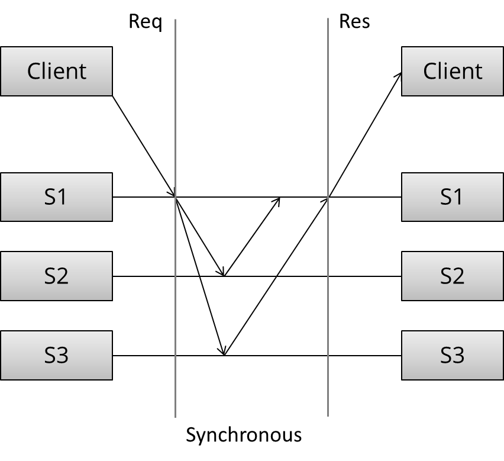
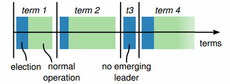
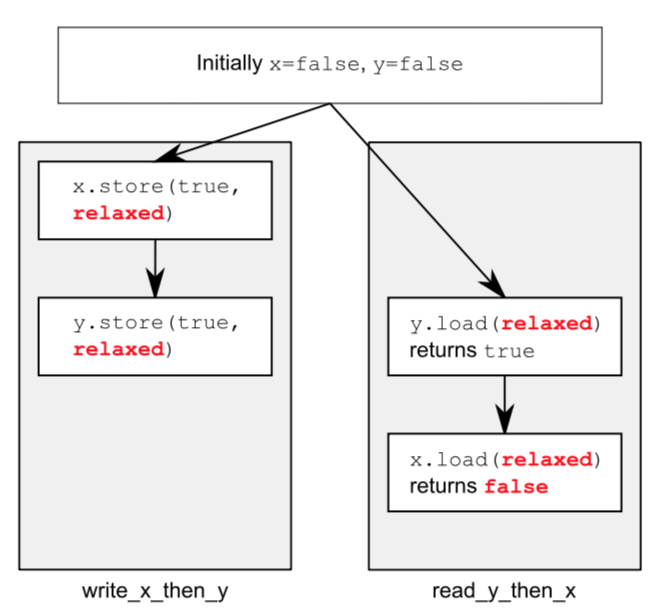
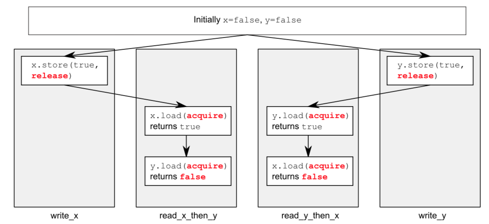

# Algorithm

Leetcode 72: Edit Distance

<https://medium.com/@dreamume/leetcode-72-edit-distance-9b237dbb7198>

# Review

<http://book.mixu.net/distsys/replication.html>

## 复制

复制是分布式系统中非常关注的问题，它还因此引出了一些子问题，如选举领导者、失败检测、共识和原子广播。

1.  同步复制

    
    
    如图所示，客户端发出请求，收到请求的第一个服务器需要跟其他两个服务器都同步后才回复客户端。
    
    同步复制的特点导致其对延迟很敏感，且所有服务器节点必须保证是正常的。

2.  异步复制

    
    
    同步复制则快速回复客户端请求。服务器节点间需要依赖一些算法解决数据更新问题。
    
    异步复制能够容忍一定的网络延迟，容忍服务器节点异常，但数据有丢失的风险，节点间需要通讯来保证取得共识。

3.  主要的复制方案

    另一种复制技术分类方法：
    
    1.  防止分离（单一复制系统）的复制方法
    2.  有分离风险（multi-master系统）的复制方法
    
    第一类方法使分布式行为跟单一系统相似，如果部分节点异常，确保只存在单一复制系统处于激活状态，即副本节点状态总是达成一致的。
    
    节点达成共识即如果他们都同意某个值，步骤如下：
    
    1.  同意
        
        每个正常的进程必须都同意某个值
    
    2.  集成
        
        每个正常的进程只能决定一个值，如果他们决定了某个值，则这个值已被一些进程采用
    
    3.  终止
        
        所有进程都已做出决定
    
    4.  验证
        
        如果所有正常的进程都采用了某个相同的值，则所有正常的进程将决定为这个值
    
    互斥、领导者选举、多播和原子广播是通用的共识方案。单一复制一致性算法包括：
    
    1.  1n 消息 (异步主/备份）
    2.  2n 消息（同步主/备份）
    3.  4n 消息（2阶段提交, Multi-Paxos）
    4.  6n 消息（3阶段提交，重复领导者选举的Paxos）
    
    下图描述了这些算法的不同：
    
    
    根据上图一致性、延迟、吞吐量、数据丢失和故障转移特性，又可以把复制分为：同步复制（比如等待然后响应）和异步复制。当处于等待时，性能会变差但得到更强的保证。2PC和quorum系统之间吞吐量的差异主要体现在分区容忍和延迟上的不同。

4.  主/备份复制

    主/备份复制是最常见的技术方案，所有的更新在主节点上执行，执行日志（或更改）同步到备份节点。该方案又分为：
    
    1.  异步主/备份复制
    2.  同步主/备份复制
    
    同步方法需要两种消息（更新和确认接收），异步只需要更新消息。
    
    同步主/备份复制只能提供弱保证，考虑如下场景：
    
    1.  主节点收到一个写操作然后发送给备份
    2.  备份保存并ACK给主节点
    3.  在ACK发送给客户端之前主节点发生异常
    
    这时客户端认为提交失败，但备份节点已经提交；当备份节点晋升为主节点时，该更新是错误的。
    
    主/备份方案只能提供最大化的保障（有可能丢失更新或错误更新）。当发生故障恢复主节点和备份节点同时被激活时导致决策异常。
    
    为防止这些失败导致异常的问题，引入了两阶段提交协议。

5.  两阶段提交（2PC）

    经典的关系型数据库大都使用2PC协议。示例如下：
    
        [ Coordinator ] -> OK to commit?     [ Peers ]
                        <- Yes / No
        
        [ Coordinator ] -> Commit / Rollback [ Peers ]
                        <- ACK
    
    第一个投票阶段，协调者发送更新给所有的参与者，每个参与者投票确定提交还是取消，当参与者确定为提交时，将存储更新信息到一个临时区域。
    
    第二个决定阶段，协调者做出决定并通知每个参与者，如果所有参与者投票提交，则更新信息从临时区域移动到永久存储区。
    
    这里分两个阶段，以使系统在最后存储到永久区之前有回滚的机会，这是之前到方法所缺乏的。
    
    2PC协议主要问题是阻塞，一个节点（协调者或参与者）异常后，进度将阻塞直到该节点恢复。另外2PC假设数据在节点中不会丢失，但数据丢失仍然不可避免，如崩溃等原因引起。
    
    2PC协议不能分区容忍。

6.  分区容忍共识算法

    最著名的共识算法是Paxos。由于它难以实现和描述，所以我们将主要介绍Raft算法，该算法出现于2013年左右。
    
    1.  多数人决策
    
        依赖于多数人投票，而不是所有节点（2PC协议），少数服从多数，确保N个节点只要有N/2 + 1个节点正常即可操作。
        
        多数人决策确保少数节点的分歧不会影响决策过程。
    
    2.  角色
    
        共识算法中把节点角色分为领导者和随从者，随从者需要把请求转发给领导者。
    
    3.  Epochs
    
        Epoch指一个时间段，每个Epoch里只有一个领导者节点。
        
        
        
        领导者选举完成后，该领导者行使协调职责直到epoch结束。如果选举失败，当前epoch立即结束。
        
        epochs起逻辑时钟的作用，当前的操作会带当前的epoch号，通过查看epoch号，领导者能够忽略不是当前的操作（epoch号小）。
    
    4.  领导者改变
    
        所有节点开始时都是随从者角色。其中一个节点被选举为领导者。领导者维持一个心跳，随从者得以检测领导者是否异常或网络被分区。
        
        当节点探测到领导者不能响应，则切换为一种中间状态：使epoch值加一，初始化领导者选举，并尝试竞争成为领导者。
        
        要成为领导者，节点需要收到多数人的投票。设置开始选举的随机等待时间，减少节点同时选举的可能。
    
    5.  epoch中带数字号的提议
    
        每个epoch期间，领导者提议一个值来进行投票过程。每个epoch中，每个提议带一个严格增长的号，随从者接受某个提议号的第一个接受到的提议。
    
    6.  正常流程
    
        当客户端提交一个提议（如更新操作），领导者负责联系所有的随从者。如没有竞争性的提议存在，则领导者提议这个操作值。如果多数随从者接受该值，则该值被决定接受。
        
        因可能有另一个节点尝试作为领导者，因此需要确保一旦提议被接受，该值不能改变。
        
        为此提议者需要首先询问随从者是否已接受更高版本的提议和值，如果发现有这样的提议存在，则不会发起新提议。
        
        更准确地说，对于任意一个值v和提议号n，如果该提议被发起，则必存在一个多数随从者集s，满足以下条件之一：
        
        1.  随从者集s中没有随从者接受小于提议号n的提议
        2.  v是随从者集中随从者接受的最高提议号的值
        
        简述流程如下：
        
            [ Proposer ] -> Prepare(n)                                [ Followers ]
                         <- Promise(n; previous proposal number
                            and previous value if accepted a
                            proposal in the past)
            
            [ Proposer ] -> AcceptRequest(n, own value or the value   [ Followers ]
                            associated with the highest proposal number
                            reported by the followers)
                            <- Accepted(n, value)
        
        然而算法实现上比较有难度。有一些细节需要考虑：
        
        -   优化
            -   避免领导者权限释放期重复选举
            -   当领导者确定时避免稳定状态下的重复提议消息
        -   确保随从者和领导者在存储区不会丢失信息及存储区的存储结果完好无损
        -   确保节点成员变更有安全的方法
        -   添加副本过程确保安全及有效
        -   确保在一些特殊时期（平衡存储和容错）快照和数据垃圾收集的安全

7.  分区容忍共识算法：Paxos, Raft, ZAB

    Paxos是强一致性分区容忍复制系统中最重要的算法之一。谷歌系统里很多使用了该算法，包括BitTable/Megastore中使用的Chubby lock manager，谷歌文件系统及Spanner。
    
    难点在于Pasox描述了单轮共识决策，但实际实现需要多轮共识。因此为了构建基于Paxos的系统在核心协议上人们做了很多扩展来便于应用于实际场景。同时存在很多挑战比如如何适应成员的改变。
    
    ZAB是Zookeeper Atomic Broadcast protocol的简称，用于Apache Zookeeper。Zookeeper是提供分布式协调机制的系统，用于很多Hadoop分布式系统中（比如HBase、Storm、Kafka）。
    
    Raft是2013年左右出现的算法，比Paxos简单，提供跟Paxos同样的保障。

# Tips

-   只读数组可以用std::array

# Share

## 内存顺序

上一周多线程编程中讲了无锁编程，但没有细谈里面涉及到的内存顺序，这里将详细说明内存顺序。

内存顺序选项有6种：memory_order_relaxed, memory_order_consume, memory_order_acquire, memory_order_release, memory_order_acq_rel, memory_order_seq_cst.

如果未指定，接口默认用最严格的memory_order_seq_cst选项。该选项保证各线程看到的内存顺序是一致的。否则一个线程可能获取任一其他线程的内存顺序可能导致不同的结果。

为了获得更好的性能，需要选择更合适的内存顺序。下面我们一一来介绍。

1.  relaxed

    memory_order_relaxed选项没有额外的同步设置，线程间只是共享变量的修改顺序。
    
        atomic<bool> x, y;
        atomic<int> z;
        
        void write_x_then_y() {
          x.store(true, memory_order_relaxed);
          y.store(true, memory_order_relaxed);
        }
        
        void read_y_then_x() {
          while (!y.load(memory_order_relaxed));
          if (x.load(memory_order_relaxed)) ++z;
        }
        
        int main() {
          x = false;
          y = false;
          z = 0;
          thread a(write_x_then_y);
          thread b(read_y_then_x);
          a.join();
          b.join();
          assert(z.load() != 0);
        }
    
    如例所示，最后的assert将被触发。因为x可能会读到false值，即使y读到true值并且x值的写入发生在y值写入之前。
    
    由于relaxed在不同的变量上的操作会被自由重排，则会出现如下图情况：
    

2.  acquire-release

    原子性读取是acquire操作，原子性写入是release操作。release操作会和acquire操作引入同步，release保证了acquire读到的是写入后的值。
    
    这意味着除了被release、acquire限制住的，不同线程依然能出现不同的内存顺序。
    
        atomic<bool> x, y;
        atomic<int> z;
        
        void write_x() {
          x.store(true, memory_order_release);
        }
        
        void write_y() {
          y.store(true, memory_order_release);
        }
        
        void read_x_then_y() {
          while (!x.load(memory_order_acquire));
          if (y.load(memory_order_acquire)) ++z;
        }
        
        void read_y_then_x() {
          while (!y.load(memory_order_acquire));
          if (x.load(memory_order_acquire)) ++z;
        }
        
        int main() {
          x = false;
          y = false;
          z = 0;
          thread a(write_x);
          thread b(write_y);
          thread c(read_x_then_y);
          thread d(read_y_then_x);
          a.join();
          b.join();
          c.join();
          d.join();
          assert(z.load() != 0);
        }
    
    如例所示，最后的assert将被触发。因为x和y可能都会读到false值。x和y值在不同的线程写入，release和acquire对其他线程的操作没起作用。
    
    

3.  consume

    consume跟数据依赖有关，比如通常的写入读取依赖，可用上面的release-acquire保证内存顺序，但如果写入的是一个指针地址，该指针地址指向的内容有可能被别的线程修改，则需要使用consume选项。
    
        struct X {
          int i;
          string s;
        };
        
        atomic<X *> p;
        atomic<int> a;
        
        void create_x() {
          X* x = new X;
          x->i = 42;
          x->s = "hello";
          a.store(99, memory_order_relaxed);
          p.store(x, memory_order_release);
        }
        
        void use_x() {
          X* x;
          while (!(x = p.load(memory_order_consume)))
                this_thread::sleep(std::chrono::microseconds(1));
        
          assert(x->i == 42);
          assert(x->s == "hello");
          assert(a->load(memory_order_relaxed) == 99);
        }
        
        int main() {
          thread t1(create_x);
          thread t2(use_x);
          t1.join();
          t2.join();
        }
    
    如例所示，p的写入选项是release，p的读取选项是consume，则p相关的写入都会在读取之前获得更新，则有关x的assert不会被触发。而有关a的assert会触发。因为p跟a无关，consume不保障a的写入顺序。

4.  总结

    搞清楚了这6种内存顺序，其实还是很清晰的，各有各的作用场景，在使用时就不会犯错了。
    
    reference: C++ concurrency in action

