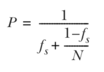

# Table of Contents

1.  [左耳听风ARTS第10周](#org5849d5a)
    1.  [Algorithm](#orgf1d9bc7)
    2.  [Review](#org1aa70a9)
        1.  [部分有序](#org9fec558)
        2.  [逻辑时钟](#org401e52d)
        3.  [全部有序](#org6fcf7fa)
        4.  [异常行为](#org7630bce)
        5.  [物理时钟](#org9748209)
    3.  [Tips](#org9d30b7f)
    4.  [Share](#org283fe87)
        1.  [设计并行代码](#org012ff47)
        2.  [影响并行性能的因素](#org73adeb9)
        3.  [其他需要考虑的点](#orgc1a19b9)

# 左耳听风ARTS第10周

## Algorithm

Leetcode 123: <https://leetcode.com/problems/best-time-to-buy-and-sell-stock-iii/>

<https://medium.com/@dreamume/leetcode-123-best-time-to-buy-and-sell-stock-iii-6492f3af30a3>

## Review

Time, Clocks, and the Ordering of Events in a Distributed System

<https://amturing.acm.org/p558-lamport.pdf>

### 部分有序

通常认为事件a先于事件b发生是基于事件a发生的时间比事件b早。而对于一个系统来说，很难把时间精确对应到实际的时间。

定义：关系"->"满足以下3个条件：

1.  如果事件a和b发生在同一个进程，a比b先发生，则a -> b
2.  a从一个进程中发送一个消息，b在另一个进程中接收到该消息，则a -> b
3.  如果a -> b, b -> c，则a -> c

### 逻辑时钟

定义时钟C_i，对进程P_i中的任意事件a赋于一个数C_i&lt;a>。函数C代表整个系统时钟，即C&lt;b> = C_j&lt;b>，事件b是进程P_j中的事件。

该定义跟物理时间无关，而是基于事件发生的顺序。

对于任意事件a, b：如果a -> b则C&lt;a> < C&lt;b>。

逻辑时钟要满足"->"关系，则对于连续成功发生的事件，进程P_i要使C_i的值增加。

对于"->"关系条件2，需要满足如下规则：

进程P_i发生的事件a发送了一个消息m，则消息m带有一个时间戳T_m = C_i&lt;a>，当进程P_j收到消息m后，C_j的值要求必须大于T_m。

### 全部有序

定义关系"=>"：对于P_i进程中的事件a和进程P_j中的事件b，a => b当且仅当，

1.  C_i&lt;a> < C_j&lt;b>，或
2.  C_i&lt;a> = C_j&lt;b>且P_i < P_j（这里个人理解为条件是看作进程i的事件永远早于进程j的事件）

以下利用全部有序关系解决一个互斥问题。

考虑一个系统由固定数量的进程组成，并共享一个资源。同一时间只能有一个进程使用。我们希望找到一种算法保证资源用于一个进程时满足以下3个条件：

1.  进程拥有资源必须先释放资源，其他进程才能使用该资源
2.  资源请求必须是有序的
3.  每个进程获得资源最终都会释放资源，则每个资源请求都会得到处理

这里要注意到，使用一个专门的资源调度进程是不能保证请求被有序处理的。例如，假设P_0为调度进程，P_1发送请求给P_0，然后发送消息给P_2。P_2接收到消息后，发送请求给P_0。这里存在P_2的请求比P_1的请求更早到达P_0的可能。

为简化问题，我们假设任意P_i到P_j的消息，发送时的顺序跟接收到的顺序相同。任意消息最终都会接收到。所有进程互相之间能直接发送消息。

每个进程维护自己的请求队列，且对别的进程不可见。队列初始化包含一个消息T_0:P_0，P_0是初始化保证获得资源的进程，T_0是最小的时钟时间。

算法分5个步骤：

1.  进程P_i发送消息T_m:P_i请求给其他所有进程，表示请求资源。
2.  当进程P_j收到消息T_m:P_i后，存放到请求队列并发送应答时间戳给P_i。
3.  释放资源时，进程P_i从请求队列中删除T_m:P_i请求，并发送带时间戳的P_i释放资源消息给其他所有进程。
4.  当进程P_j收到P_i的释放资源消息后，从请求队列中删除T_m:P_i请求。
5.  进程P_i获得资源需满足以下2个条件：
    1.  T_m:P_i请求在请求队列中顺序最靠前（通过=>关系判断）。
    2.  P_i进程收到其他所有进程的应答时间戳消息，且时间戳晚于T_m。

### 异常行为

假设一人在计算机A上发起请求A，然后电话通知一朋友在计算机B上发起请求B，则可能请求B会早于请求A。这是由于系统无法知道该逻辑存在。

有两种办法解决该问题。一是让系统获知该行为以使其能正常处理事件顺序（请求A时把收到的时间戳同时告诉给那位朋友，以使请求B的时间戳晚于请求A）。
二是构建系统时钟满足强时钟条件：对于任意事件a和b，如果a -> b，则C&lt;a> < C&lt;b>（这里的->关系不是上面提到的->部分有序关系，而是更强的有序关系）。下面要讲的物理时钟即是这种。

### 物理时钟

这一块比较复杂，大致是把上面逻辑时钟的产生逻辑替换为物理时钟，并做了时钟误差和矫正处理。

## Tips

-   多使用for_each
-   使用std::unique去重

## Share

并行编程，主要参考C++ Concurrency in Action。

### 设计并行代码

分割工作给各线程。

一是在处理之前先分割数据。

最简单的方法是给每个线程分配N个数据元素。数据结构通常可用Message Passing Interface(MPI)或OpenMP。任务被分割为并行的子任务，线程间独立运行，最终会需要合并子任务结果。

另一种方式是递归分割。

比如快速排序算法，每次迭代会把数据段分为两段。

或者按任务类型分割。

### 影响并行性能的因素

首先是处理器个数。通常情况是一个处理器核上并行跑一个线程。std::thread::hardware_concurrency()可以获得可并行线程数。

注意数据竞争和Cache ping-pong问题。

数据内存对齐避免false sharing。

同一线程需要的数据要尽量靠近，避免数据分散引起内存命中率下降。

过多的线程也会因为线程切换等问题引起性能下降。

### 其他需要考虑的点

确保并行算法的异常处理安全性。

并行算法的可扩展性。

Amdahl's law:

P是并行算法扩展性性能，N是处理器个数，f_s是串行部分比例。

隐藏线程的延迟。线程可能会因等待某个资源而处于等待状态，合理增加线程提高系统响应度。

