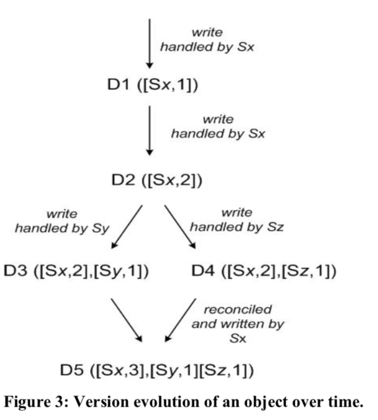

# Table of Contents

1.  [左耳听风ARTS第12周](#org1fbfcca)
    1.  [Algorithm](#org2a48d6a)
    2.  [Review](#org3edefab)
        1.  [系统架构](#org0bc1808)
        2.  [实现](#org7b90a17)
        3.  [经验及总结](#orgce83f80)
    3.  [Tips](#org9d6b2f5)
    4.  [Share](#orgbed291b)

# 左耳听风ARTS第12周

## Algorithm

Leetcode 139: <https://leetcode.com/problems/word-break/>

<https://medium.com/@dreamume/leetcode-139-word-break-2f6968b45af0>

## Review

Dynamo: Amazon’s Highly Available Key-value Store（下）

<https://www.allthingsdistributed.com/files/amazon-dynamo-sosp2007.pdf>

Dynamo是Amazon推出的高可用key-value存储系统。

### 系统架构

Dynamo 复制数据到N个节点，即按照之前的分区算法方案，每个节点会复制落在该节点所在环位置及其前N-1个位置的数据。

Dynamo提供最终一致性，会存在数据的多个不同版本，新版本会归并老版本数据，但不可避免有冲突的存在。

Dynamo使用矢量时钟来识别对象，丢弃老时钟的相同对象。

当客户端更新对象时，必须携带版本号（里面包含矢量时钟），当Dynamo发现多个分支且不可协调时，合并相关信息并生成一个新版本数据。

Dynamo的一致性协议有两个可配置的值：R和W。R是参与成功的读操作的最少需要的节点数，W则是对应的写操作节点数。为保障较短的延迟，配置R + W < N。

为应对服务异常和网络分区，Dynamo使用非严格的选举机制，假设N = 3， 节点A异常，则消息将发送给节点D，信息中带有元数据暗示原本应该发送给的节点(A)，一旦节点A恢复，则D会尝试转发给A并删除本地的信息。

为更快地检测非一致性和最小化数据传输，Dynamo使用Merkle树来确定哪些数据需要同步。

Dynamo为维护节点环的节点，使用一个基于gossip的协议广播环节点的变更，维护环节点的最终一致性。

Dynamo为防止环节点信息的逻辑分区，一些节点被赋予种子角色，这些种子节点通过额外的发现机制被所有节点所知，所有节点将和种子节点协调解决节点信息问题，防止节点信息的逻辑分区。

去中心化故障检测协议使用的是一种简单的gossip风格协议，使每个节点能够知道对其他节点是否可达。

当一个新的存储节点添加入系统时，它将被分配一系列环上的散列token，决定它将负责处理的key的范围，同时相关节点的key范围会做调整。删除节点时也是类似操作。

### 实现

Dynamo系统中，每个存储节点有三个主要软件组件：请求协调，成员和异常探测和本地持久化引擎。

Dynamo的本地持久化为可插入式存储引擎，Berkeley Database (BDB) 适合处理几十K大小的对象，MySQL适合更大尺寸。

请求协调组件基于消息事件驱动机制。每个客户端请求将在节点上创建一个状态机接收客户端请求。比如对于读请求，状态机将发送请求给节点，等待满足最小数量的请求响应，如果在给定时间内无足够数量响应信息，视为请求失败，否则聚合所有版本响应并决定返回内容，如果版本比较功能启动，执行冲突解决机制合并所有版本信息并生成一个写操作Context。

### 经验及总结

Dynamo已被不同服务使用，其配置也不同。不同点主要在于版本冲突逻辑和读写选举机制：

-   商业逻辑冲突
    
    每个数据对象复制给多个节点。当版本冲突时，客户端应用执行自己特定的冲突解决逻辑。

-   基于时间戳的冲突解决
    
    基于时间戳使用简单的最后写优胜的冲突解决策略

-   高性能读引擎
    
    Dynamo构建了总是可写的数据存储，一些服务为高性能读操作进行优化，配置读请求最小数量限制R为1或很小的数。

Dynamo的主要优点是可灵活配置N、R、W值，N决定对象的可用性，W和R影响对象的有效性，可用性和一致性。

为优化性能，每个存储节点在主存中维护一个对象缓存区，读操作先从缓存区里找，如没有则读存储引擎。

之前提到的环节点方案，这里分析一下如何使环里的节点负载均衡的策略：

1.  每个节点T个随机tokens并按token值分区
    
    缺点是当新节点添加进来时，它需要从其他节点分摊key范围，其他节点需要扫描本地持久化存储来获取对应的数据集。然后扫描操作是一个繁重的任务，且新范围的数据集的Merkle树需要重新计算。

2.  每个节点T个随机tokens并且数据分区相同大小
    
    主要优点是解耦分区和分区替换，具有运行时动态改变分配方案的能力

3.  每个节点Q/S个tokens并且数据分区相同大小
    
    当节点剔除时，它的tokens将随机分配给其他的节点。
    
    优点是：
    
    1.  更快的启动/恢复
    2.  方便数据归档

对于分离的版本数据，有两种情况造成：

1.  节点异常、数据中心异常、网络分区
2.  系统在处理数据项的大量并发写，多个节点在并发的协调更新数据项。

因此，需要关注是否有并发写引起的数据分离现象。

之前提到的对于每个请求，服务节点会创建一个状态机来维护该请求，收集达到最少数量的响应。而另一种方案是把状态机功能放客户端，这种方案有更短的延迟。

## Tips

-   使用ifstream和ofstream替代fstream

## Share

reference: C++ Concurrency in Action

C++17标准库中引入了并行算法，对于写并行算法程序更加方便简洁了。

对于标准库中原有的算法，添加了执行策略参数来支持并行执行。

如果指定了执行策略参数，则标准库中算法将影响如下几个方面的行为：

1.  算法复杂度
2.  异常抛出行为
    
    缺省为程序终止执行
3.  算法执行的步骤
    
    算法的执行可能是线程、vector streams、GPU线程及其他。

执行策略有std::execution::sequenced_policy, std::execution::parallel_policy, std::execution::parallel_unsequenced_policy。

std::execution::sequenced_policy不执行并行算法

std::execution::parallel_policy提供基本的并行执行，在多个线程中执行。

std::execution::parallel_unsequenced_policy操作可能执行在不同的线程，元素、数据之间不能有相关性。

安装步骤(MacOS)：

1.  下载tdd (github)，里面带pstl算法
2.  安装tdd（这一步可以通过brew install tdd)来安装
3.  编译指定相关参数
    
        clang++ -g -D__PSTL_USE_TBB -std=c++17 test.cc -I~/tbb2019_20190605oss_mac/pstl2019_20190605oss/include -ltbb -o test

