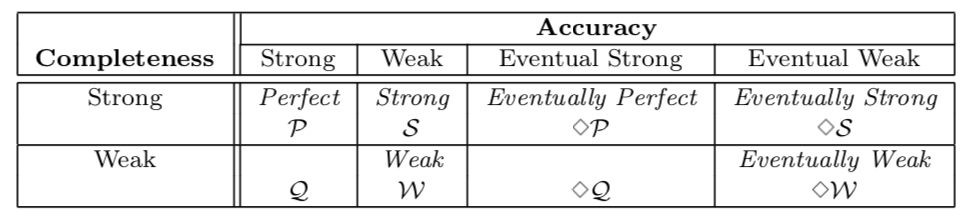

# Table of Contents

1.  [Algorithm](#orgc110025)
2.  [Review](#org91cdfad)
    1.  [简介](#org027b699)
    2.  [模型](#org2ee3ef8)
3.  [Tips](#orgdf9f7db)
4.  [Share](#org013661a)

# Algorithm

Leetcode 629: <https://leetcode.com/problems/k-inverse-pairs-array/>

<https://medium.com/@dreamume/leetcode-629-k-inverse-pairs-array-8f6b1c05e3ea>

# Review

Unreliable Failure Detectors for Reliable Distributed Systems（上）

<http://courses.csail.mit.edu/6.852/08/papers/CT96-JACM.pdf>

本文主要讨论分布式系统下的故障检测机制。

## 简介

本文聚焦于异步模式下分布式计算的共识和原子广播解决方案。

我们考虑这样的分布式故障检测机制：每个进程有一个本地的故障检测模块，该模块监控系统中的一系列进程，维护一个疑似故障的进程列表。

假设每个故障检测模块可能错误的添加正常的进程到列表里，如果模块认为该行为错误，可从列表中移除进程。

故障检测机制有两个基本属性：完成性和精确度。完成性要求故障检测机制最终怀疑所有有故障的进程，精确度限制故障检测机制的错误行为。

## 模型

现在我们描述两种完成性和四种精确度。

完成性：

1.  强完成性。每个故障进程最终被所有正常进程怀疑
2.  弱完成性。每个故障进程最终被某些正常进程怀疑

精确度：

1.  强精确。进程故障之前没有被其他进程怀疑
2.  弱精确。一些正常进程没有被怀疑
3.  最终强精确。某个时间点之后正常进程不会被其他正常进程怀疑
4.  最终弱精确。某个时间点之后一些正常进程不会被其他正常进程怀疑

以下是8种故障检测机制的分类:

# Tips

-   多使用响应式编程、函数式编程，扩展性、可维护性、可读性更好
-   应该多读一些经典书、其次是博客、论文等

# Share

分享一下google的代码规范。

c++: <https://google.github.io/styleguide/cppguide.html>

objc: <http://google.github.io/styleguide/objcguide.html>

swift: <https://google.github.io/swift/>

