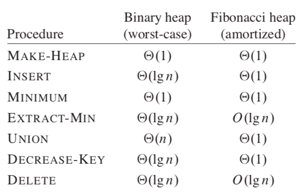
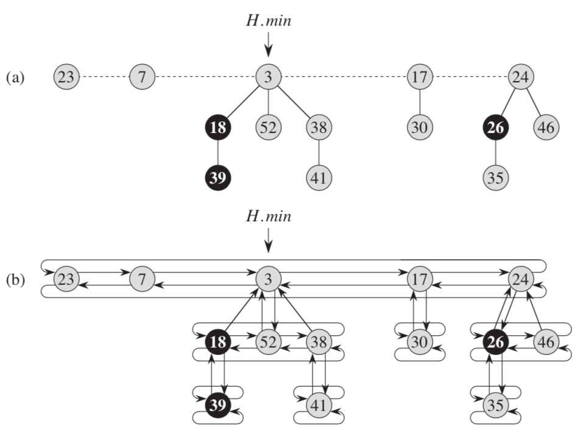
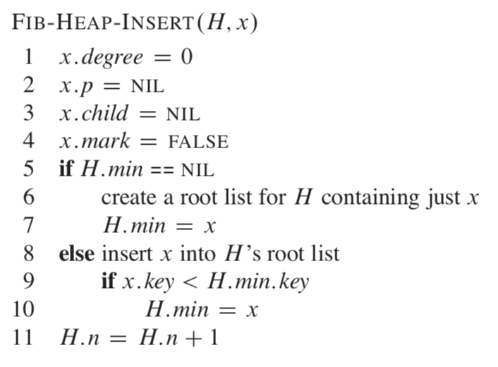
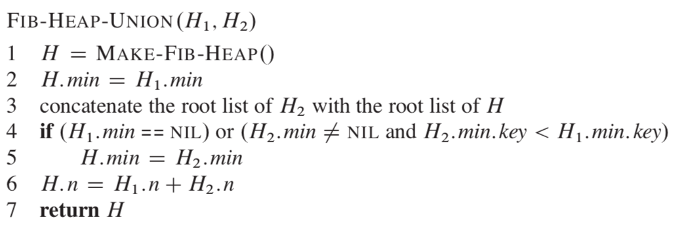
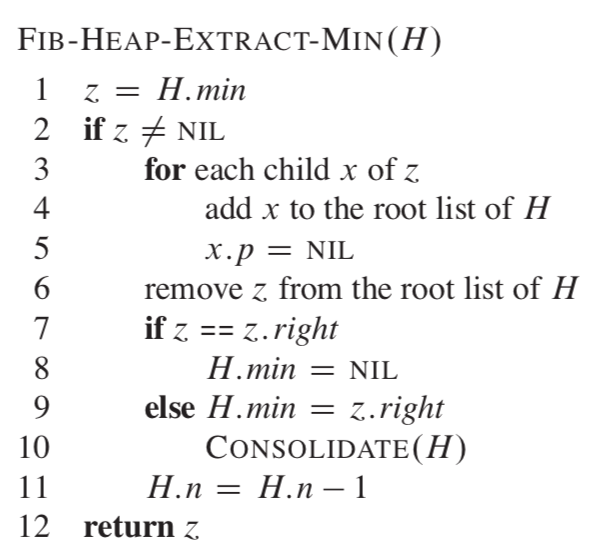
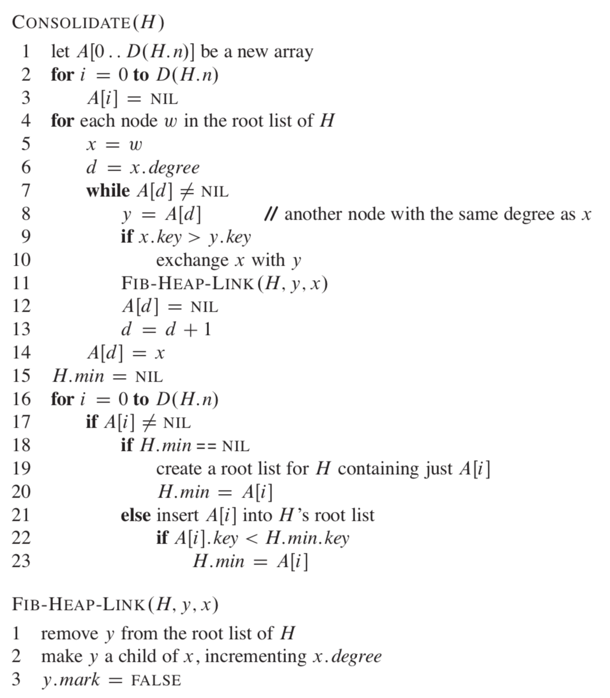
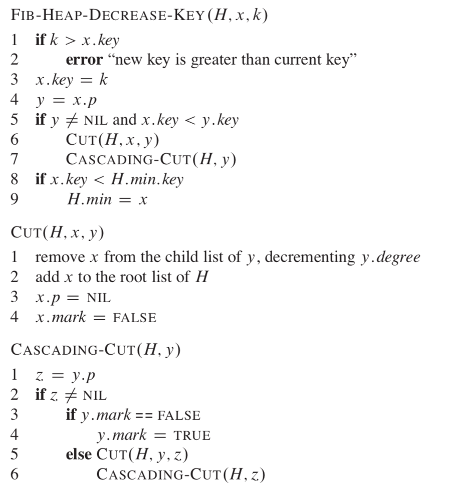
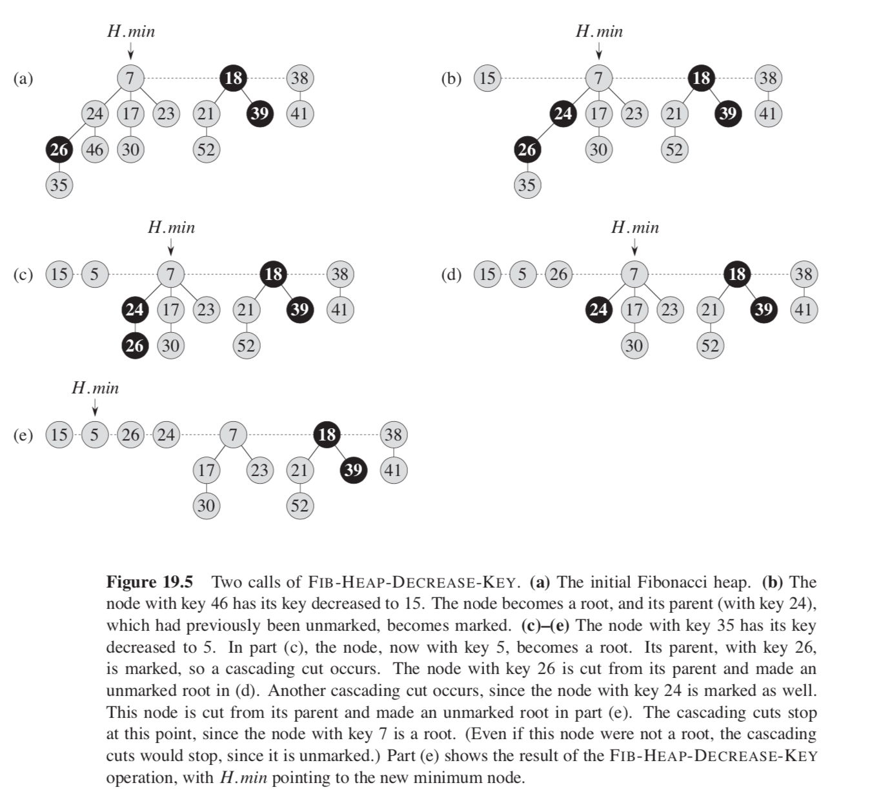
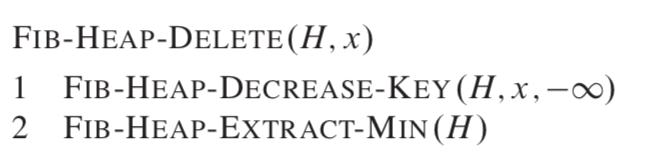

# Table of Contents

1.  [Algorithm](#org6105010)
2.  [Review](#org5be8b9c)
    1.  [可靠广播](#orgd585f80)
    2.  [共识问题](#org849481d)
    3.  [使用非可靠故障检测机制解决共识问题](#org166850b)
        1.  [在强完成性和弱精确度下解决共识问题](#org7aa7225)
        2.  [在强完成性和最终弱精确度下解决共识问题](#org18b2ca0)
3.  [Tips](#orgbf01e8f)
4.  [Share](#org3a02206)
    1.  [合并堆操作](#orgaaec36f)
        1.  [插入节点](#org6984011)
        2.  [合并两个堆](#orge63a65b)
        3.  [提取最小key](#org71a7fd9)
        4.  [Decreasing a key](#org33d8ff7)
        5.  [删除节点](#org6e9e74a)
        6.  [总结](#org7ee0b4b)

# Algorithm

Leetcode 632: <https://leetcode.com/problems/smallest-range-covering-elements-from-k-lists/>

<https://medium.com/@dreamume/leetcode-632-smallest-range-covering-elements-from-k-lists-aaeaf56a9425>

# Review

Unreliable Failure Detectors for Reliable Distributed Systems（中）

<http://courses.csail.mit.edu/6.852/08/papers/CT96-JACM.pdf>

本文主要讨论分布式系统下的故障检测机制。

## 可靠广播

我们先定义可靠广播：

1.  所有正常的进程转发相同的消息集
2.  所有被正常进程广播的消息一定被转发
3.  不转发被怀疑的消息

## 共识问题

共识问题分四个步骤：

1.  终止
    
    每个正常进程最终会决定用某个值
2.  统一集成
    
    每个进程只会决定用一个值
3.  同意
    
    每个正常的进程决定的值相同
4.  统一验证
    
    如果一个进程决定用某个值，则该值被一些进程提议

如果有一个进程故障，共识问题就无法在异步系统中达成共识。

## 使用非可靠故障检测机制解决共识问题

### 在强完成性和弱精确度下解决共识问题

算法分三步：

1.  进程广播和转发他们的提议值时执行n - 1轮异步。每个进程在处理r + 1轮之前等待接收r个从正常进程发来的消息。
2.  正常进程同意基于向量的所有进程的提议值
3.  正常进程决定用向量里的第一个重要的值

### 在强完成性和最终弱精确度下解决共识问题

算法分四步：

1.  每个进程发送当前轮次预估的决定值给协调者c
2.  协调者c收集(n + 1) / 2个估计值，选择最大时间戳的那个，发送给所有进程作为新的预估值
3.  每个进程的处理有两个可能性
    1.  接收该新预估值，发送ack给协调者c表示接受该值作为自己的新预估值
    2.  或者通过故障检测机制怀疑协调者c故障，发送nack给协调者
4.  协调者c等待(n + 1) / 2个回复(ack或nack)，如果所有回复为ack，则协调者知道大多数进程已接受该新估值，则锁定该值

当正常进程数大于n / 2时，之前所提的8种故障检测机制都能解决共识问题。

# Tips

-   理解哪些工作是trivial，把精力放在重要的事情上

# Share

《算法导论》19章 Fibonacci Heaps

Fibonacci heap支持合并堆的系列操作，一些操作运作在常量的摊销时间复杂度下。

Fibonacci heap数据结构：

如上图，每个节点x包含一个指针x.p指向父节点，x.child指向子节点。子节点为一个双向链表。每个子节点y有一个y.left和y.right指针指向左右兄弟节点。

x.degree表示节点x下面的子节点个数，x.mark标志表示x节点是否失去一个节点从最近获得子节点的时间之后。

Fibonacci heap H有一个H.min节点作为根节点，该节点含有最小的key，H.n表示当前节点下的所有节点个数。

## 合并堆操作

### 插入节点

### 合并两个堆

### 提取最小key

consolidate操作确保根节点下的子节点不会有相同的degree。

### Decreasing a key

### 删除节点

### 总结

Fibonacci Heap是一个比较有意思的数据结构，很巧妙的利用了Fibonacci的性质，而且代码也比较简短易懂。

