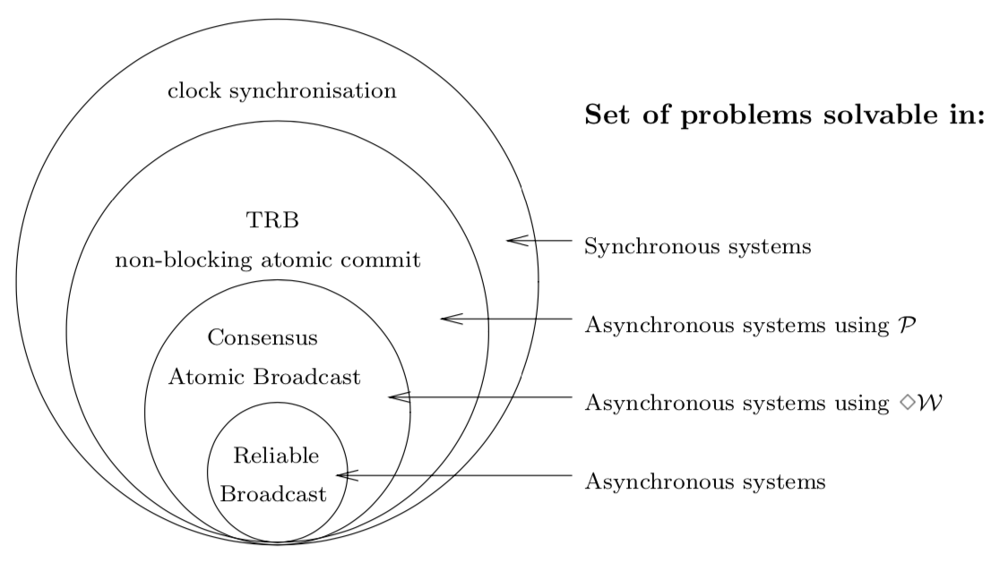
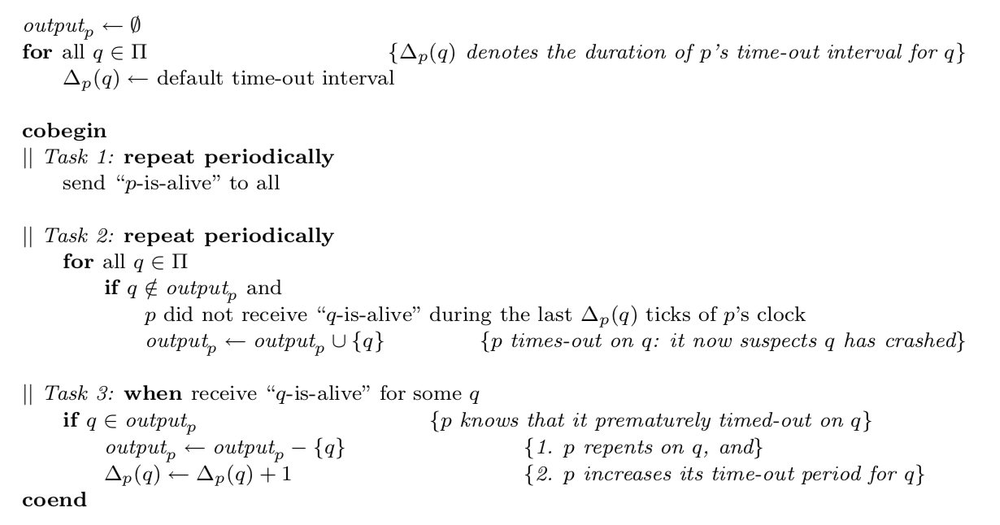

# Table of Contents

1.  [Algorithm](#org83f4a78)
2.  [Review](#org3ef2f3a)
    1.  [原子广播](#org9131bdc)
    2.  [比较故障检测机制类型](#org51219c3)
    3.  [相关工作](#orgfdcbdd8)
        1.  [部分同步](#orgee835f9)
        2.  [共享内存系统中的不可靠故障检测机制](#org118d88f)
        3.  [Isis工具](#org13bf2c3)
3.  [Tips](#org4ec35d4)
4.  [Share](#orgf68d8e3)

# Algorithm

Leetcode 636: <https://leetcode.com/problems/exclusive-time-of-functions/>

<https://medium.com/@dreamume/leetcode-636-exclusive-time-of-functions-124e5df2bfdb>

# Review

Unreliable Failure Detectors for Reliable Distributed Systems（下）

<http://courses.csail.mit.edu/6.852/08/papers/CT96-JACM.pdf>

本文主要讨论分布式系统下的故障检测机制。

## 原子广播

共识问题的结果同样可应用于原子广播。原子广播需要所有正确的进程以相同的顺序转发相同的消息。

原子广播是可靠广播需满足：

总序：两个正确的进程p、q转发两个消息m、m'，则p先转发m后转发m'当且仅当q先转发m后转发m'。

共识问题和原子广播等价：

1.  在异步系统中没有一个确定性算法能解决原子广播问题，即使我们假设最多只有一个进程会故障。因为没有一个确定性算法在异步系统中能解决共识问题。
2.  在异步系统中可以使用随机或不可靠故障检测机制解决原子广播问题，因为这些算法能解决异步系统中共识问题。

## 比较故障检测机制类型

这里考虑一个TRB（终止可靠广播）问题：TRB跟可靠广播相似，但它需要每个正确的进程总是转发消息，甚至进程已故障，在崩溃之前依然在广播。

各种故障检测机制及其能解决的问题如下图：

## 相关工作

### 部分同步

部分同步即介于完全同步和完全异步之间，我们考虑这样的一种最弱的模型条件（记作M_3）：消息传输时间边界存在但未可知，仅知道在GST（全局稳定时间）时间之后。

在满足M_3模型条件下的部分同步系统，存在一个故障检测机制D属于最终强精确强完成性检测类型，能够解决共识问题。

该故障检测机制算法如下（每个进程p执行如下步骤）：

### 共享内存系统中的不可靠故障检测机制

Lo和Hadzilacos提出了一个算法解决在带原子读写寄存器的共享内存系统中用最终弱精确弱完成性的故障检测机制解决共识问题。

该算法容忍任意数量的故障进程。

### Isis工具

之前的假设是即使正常进程p被其他进程不断怀疑为故障进程后，p仍然需要作为一个正常进程继续工作。

而Isis不同，它假设故障检测机制绝少出错。即进程p被怀疑故障，则认为p已崩溃。基于Isis的系统time-out可以设置得更长。

# Tips

-   一些知识点光看可能只是粗浅的认为看明白了，通过写作整理才会发现理解的程度及细节是否真的搞懂
-   制定每天的学习进度，坚定执行，如遇难点适当调整
-   难点一定要弄懂，需要一些前提知识则去了解掌握，需要时间可以调整，难点可以反复看，尽量不要跳过。
-   书里章节后的习题先自己思考，不会的思考后可以看答案，无答案也想不出来的基于效率考虑也不要过于纠结，可跳过。

# Share

华裔数学家张益唐于2013年4月17日在《数学年刊》发表《质数间的有界间隔》，首次证明了存在无穷多对间隙为有限的质数（具体间隙小于7000万），解决了孪生素数猜想这一数论难题。

其在发表该论文时已58岁。在读博士期间因与导师有一些争论，导致毕业后未拿到导师推荐信，就业困难，长期靠打杂糊口，曾任快餐店收银员、中餐外卖员、汽车旅馆零工等。后经校友帮助才获得新罕布什尔大学讲师的职位。

由于长年无论文发表，默默无闻，数学家一般出成果都在年纪20到40左右，比如菲尔兹奖就有40岁以下的年龄限制。而张益唐打破了这一传统。以58岁发表的这一论文一鸣惊人，成为公认的数论学家。

张益唐以其人生经历说明论文少不是问题，年龄不是问题，坚持最重要。

