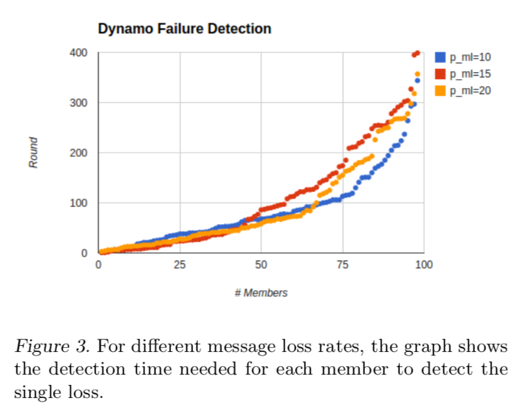

# Table of Contents

1.  [Algorithm](#org0fcec4c)
2.  [Review](#org276d7ad)
    1.  [故障检测](#org88feaed)
    2.  [实现](#org0f7887e)
    3.  [协议分析](#org89210fb)
        1.  [延迟](#org5fe48d5)
        2.  [误认故障](#orgb2b1472)
        3.  [可扩展性](#org2790480)
    4.  [总结](#org67763a2)
3.  [Tips](#orgde4b875)
4.  [Share](#org8e14f63)

# Algorithm

Leetcode 636: <https://leetcode.com/problems/find-peak-element/>

<https://medium.com/@dreamume/leetcode-162-find-peak-element-cc780b9cf5b4>

# Review

Survey on Scalable Failure Detectors

<http://www.scs.stanford.edu/14au-cs244b/labs/projects/song.pdf>

有关故障检测机制的另一篇文章，本文比较简短易懂。

## 故障检测

本文介绍两种故障检测机制：Gossip和Dynamo

Gossip模型基于心跳，随机节点在某时间段维护一个成员列表。接收节点使用更高版本号的成员列表，如果一段时间内没有某节点心跳更新则认为该节点故障。

GRR协议选择某节点进行协调而不是使用随机节点。使成员列表同步时间复杂度优化为lgn

Dynamo基于随机ping和分布式故障确认。节点响应ping包则表示节点正常，如一个节点ping另一个节点无响应，则该节点请求其他k个节点去ping，如k个节点都无法获得响应，则被标记为故障。

对于故障恢复，心跳更快更容易确认，然而效率不高，而ping包不能保证恢复。

## 实现

Dynamo使用UDP，gossip协议使用的是TCP

## 协议分析

### 延迟

Gossip协议故障检测速度函数类似于一个S形。如图：

Dynamo消息丢失检测速度，如图：

Dynamo在消息丢失检测上比Gossip更稳定

### 误认故障

Gossip协议会频繁调整故障节点信息，gossip协议更加依赖故障检测周期而不是消息丢失。即使消息丢失，节点会等到新周期消息来更新。如图：

Dynamo依赖k中转节点ping可能故障的节点来确定故障。

### 可扩展性

Gossip协议每个工作节点每轮发送协商信息。每轮发送的总信息需要：N(8N + 4)字节。

Dynamo需要的流量为线性。

## 总结

Gossip有低的错误检测延迟，但对消息丢失更敏感，Dynamo不能保证错误检测延迟，但对消息丢失相对不敏感。

# Tips

-   固定作息，保持头脑清晰，能保证好的工作效率

# Share

Fermat's Theorem in What is Mathematics

如果p是一个质数，而整数a不是p的倍数，则有a(p-1) ≡ 1（mod p）

证明：

假设m(k) = k * a, 1 <= k < p，则m(1) \* m(2) \* &#x2026; \* m(p - 1) = 1 \* 2 \* &#x2026; \* (p - 1) \* a(p - 1)不能被p整除。

设M = m(1) \* m(2) \* &#x2026; \* m(p - 1)，S = 1 \* 2 \* &#x2026; \* (p - 1)，则M - S ≡ 0 (mode p)

M - S = S \* (a(p - 1) - 1)，则a(p - 1) ≡ 1 (mode p)

进一步推理可得更一般化的结论：任意正整数n，n和整数a无除1以外的公约数，且设t(n)为小于n的整数跟n无除1以外公约数的个数，则at(n) ≡ 1 (mod n)

该结论可解leetcode某题。

