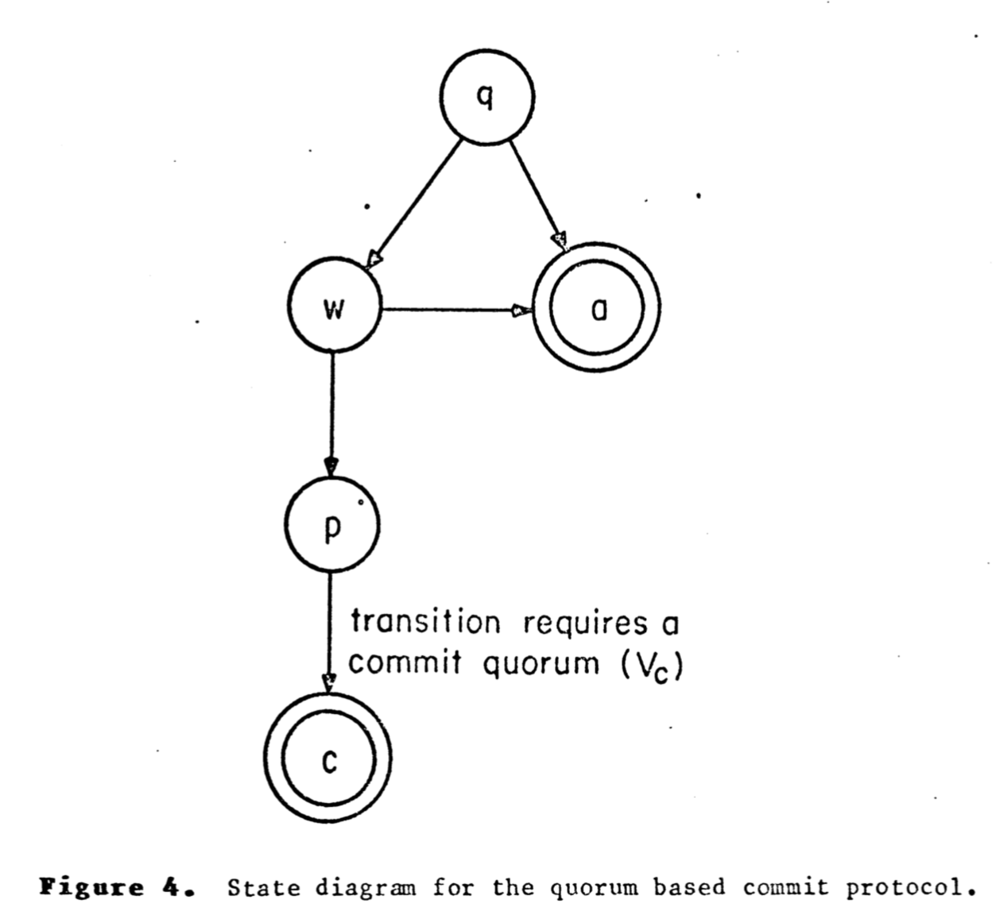
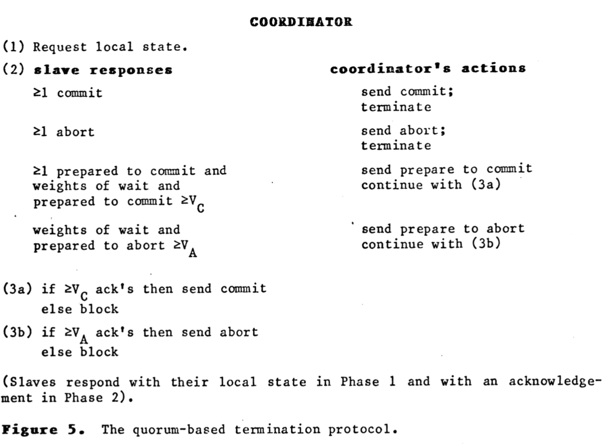

# Table of Contents

1.  [Algorithm](#org20fa166)
2.  [Review](#org0ccf83d)
    1.  [简介](#orgdbda5b1)
    2.  [背景](#org670e3ad)
    3.  [可适应性提交协议](#org1df8eb6)
    4.  [恢复](#orged67c8e)
        1.  [终止协议](#org9556f9d)
        2.  [合并](#orge5356f6)
    5.  [性能](#org4eaddc5)
    6.  [总结](#orgaaaf9a6)
3.  [Tips](#org740aec7)
4.  [Share](#orgb42b2c7)

# Algorithm

Leetcode 164: <https://leetcode.com/problems/maximum-gap/>

<https://medium.com/@dreamume/leetcode-164-maximum-gap-f8a6ec2c049c>

# Review

A Quorum-based commit protocol

<https://ecommons.cornell.edu/bitstream/handle/1813/6323/82-483.pdf?sequence=1>

本文非常友好，简短易懂。内容主要是提出了一种提交和故障恢复协议，对抗站点故障、消息丢失和网络分区。

该协议不需要故障被确定或被检测，这只是会对性能造成影响。该协议使用投票机制支持任意数量的数据复制和非关联的取消操作。该属性使协议更容易和并行控制协议集成。

## 简介

交易被定义为分布式数据库系统的原子操作，要么所有交易变更都记录入数据库即提交，要么该交易不产生更改即取消。

本文提出一种提交协议，支持并行发生的如下类型故障：任意站点故障、消息丢失和网络分区。甚至故障未被检测也能正常工作。

该协议使用带权重的投票机制解决故障后的冲突。当故障发生时，交易只有在达到最小投票数Vc后才能提交，同样，交易只有在达到最小投票数Va后才能取消。Vc不一定跟Va相等，但他们的总和一定要超过总投票数。

投票机制之前提出用于交易管理，Thomas引入多数投票机制确保数据库复制的一致性，Gifford扩展该机制使站点带权重，使用投票最低人数代替简单多数。本协议在如下几个方面跟之前的协议不同：

1.  本协议是一种提交协议，而不是并行控制方案。提供基于交易的原子性，能够直接集成任意类型的并行控制协议
2.  在交易的第一阶段允许独立的取消
3.  主要使部分分布式数据库复制，当交易需要从任意复制点读取时需要同步更新到所有复制点

另外，协议扩展了如下属性：

1.  该协议是集中式协议，拥有集中式协议的优点
2.  故障缺失的代价不会比之前的协议差，之前的协议只能支持协调器失败，并不能支持网络分区
3.  如果所有的故障最终被修复，则协议最终也将被终止
4.  该协议是一种阻塞协议，站点操作必须等待故障被修复，但本协议阻塞频率低

## 背景

假设任意站点间提供点对点通讯，不产生自发的消息，即不清晰的消息被检测清除。我们不假设消息顺序到达或检测丢失的消息。

## 可适应性提交协议

两阶段提交协议不是很健壮的协议。当协调者故障或随从者被分区，随从者在被修复之前一直被阻塞。

本节将介绍一个适应性的提交协议允许从这两种故障中恢复。

每个站点赋值一个最小提交数和最小取消数。设V，Vc和Va分别代表总投票数，最小提交数和最小取消数。则：

1.  Vc + Va > V, 0 < Vc, Va <= V
2.  当站点在提交阶段时，需要至少有最小提交数个站点在可提交状态
3.  当站点在取消状态，则至少有最小取消数个站点在不可提交状态

以上保证协议终止时的一致性。

在第一个站点提交之前，必须获得最低提交数的站点在可提交状态。

在任意站点提交之后，必须维护最低提交数的站点信息。

也就是说一个站点可以安全地从可提交状态变为不可提交状态当且仅当无站点提交本次交易的时候或本次改变不影响最低提交数。同理对取消操作类似。

本协议相对于两阶段提交协议多了一个准备提交状态，需要3节点提交，两节点来取消。在第3阶段，交易被提交只有在最低提交数的站点在准备提交状态才行。

本协议是悲观协议，如果任何站点或分区发生在第一阶段，则协议者立即终止交易。

## 恢复

有两种类型的恢复。当网络分区时，分区站点尝试形成最小提交数或最小取消数来终止交易。如果分区里站点无法满足该数，则被阻塞直至分区恢复。当分区被恢复后，新分区的站点将执行一个合并协议并尝试结束交易。

### 终止协议

当一组站点检测到他们被网络分区后，将执行两部分终止协议。第一部分将选择替代的协调者，第二部分尝试形成最小提交/取消数。

有几种选举协议。我们将不直接讨论选举协议除了有关线性地选出唯一协调者这部分。选举协议不依赖选举的唯一性，如果有两个被同时选中，会自适应只是性能会受到影响。

当选举完成，替代者会执行一个类似提交的协议。终止协议复杂主要有两个原因。

1.  替代者对之前的协调者信息所知甚少
2.  可能同时有多个替代者

对第一个问题，替代者可以尝试形成提交协议仅当站点所在分区在可提交状态。对第二个问题，替代者可以直接形成取消数。

终止协议具体描述如下图：

然而，过多的故障会防止站点交易或获得交易信息，协议将被阻塞。

当总站点权重在等待状态，准备取消状态至少为Va时，最小取消数可能达到。不同于最小提交数，最小取消数不需要任意站点占据准备取消状态，替代者尝试移动达到最小取消数的站点到准备取消状态，成功则取消交易，否则被阻塞。

### 合并

分区合并发生在故障恢复，分区间通讯建立之后，我们假设通讯建立路径能够被探测。

合并的恢复策略比较简单：执行终止协议，新的协调者在旧的协调者中被选中，例如最低站点号的协调者作为新的协调者。新的协调者执行终止协议第二部分的三阶段。

## 性能

分析选举协议性能比较困难，很明显地是最坏性能没有底线。

如果所有分区被最终解决，协议最终也会终止。分区不会形成循环，因此每次状态转换使站点更接近终止。所有分区被合并后，取消终止或提交终止会执行。

在故障少的环境，最重要的成本估计是提交协议故障丢失的成本。基于选举的提交协议需要3个阶段，5个端到端延迟和5N个消息（N为参与者数目）。成本比两阶段提交协议高大约50%。

两个参数决定协议故障的性能：每个站点的权重，Vc和Va值。

通常Vc要设置为大于Va：

1.  考虑多个独立的故障：交易故障时，明细Va应该更小
2.  大多数站点故障发生在提交协议的第一阶段，因为大多数交易执行时间花费在第一阶段。耗费时间的数据处理在第一阶段，因此第一阶段故障则交易必须取消，因此要让第一阶段的故障容易取消一些。

一个有趣的选择是使Va基于站点故障分布的估计时间，通常使用于站点故障远多于网络分区的场景。假设P(Va)是至少达到最低取消数的概率，P(Va)是一个下降函数。选择最大的Va使Va <= Vc并且P(Va)超过预想可用性的最低值。

## 总结

选举协议是处理网络分区的标准技术，我们描述了可用于复制和非复制数据的基于选举的提交协议。

选举协议适应性高因为一个站点只能参与一种类型的选举。

当新的协调者在恢复协议中被选中，它获取所有站点的当前本地状态。当做提交决定时，仅使用最新的投票。

# Tips

-   联系学到的知识，抽象出本质，从不同角度观察，可能会发现更多有趣的规律。

# Share

谷歌最近公开了代码评审的文档，看了大半，感觉很好，分享一下，讲得很细：

<https://google.github.io/eng-practices/>

