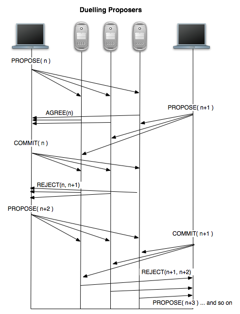
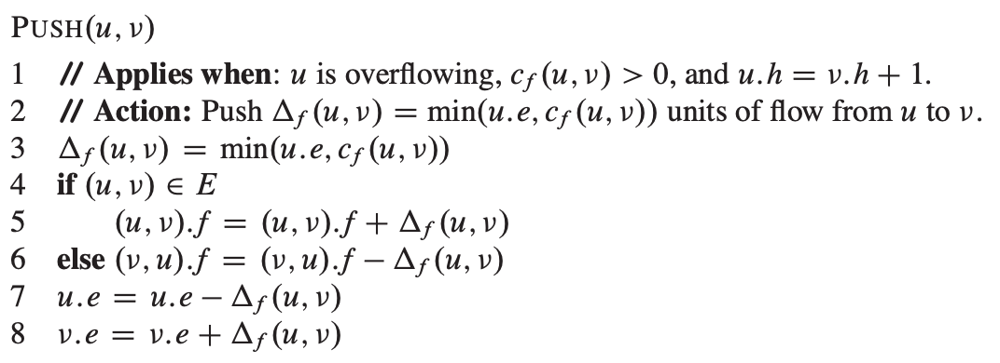
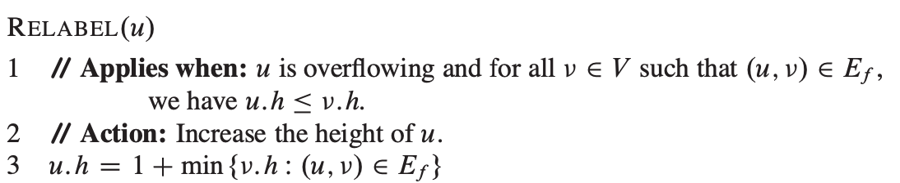
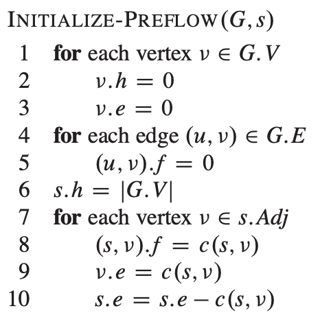
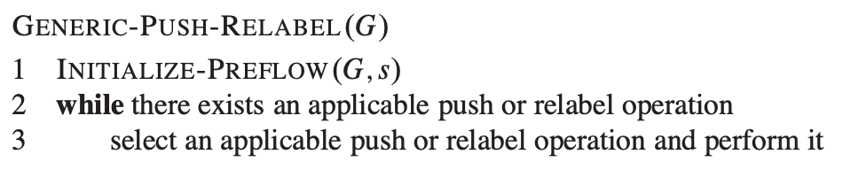

# Table of Contents

1.  [Algorithm](#orgc468217)
2.  [Review](#orga9a6d96)
    1.  [为什么需要另一个共识算法](#org0779761)
    2.  [Paxos详解](#orgdcf5b36)
        1.  [术语](#org7807087)
        2.  [Paxos协议](#org96fac96)
        3.  [序列号](#org95104da)
        4.  [多数](#org7dc8387)
        5.  [合理的提议](#org055816f)
        6.  [精确描述](#org823be8d)
        7.  [容错](#org9d91154)
        8.  [效率](#org1026e31)
    3.  [总结](#org7c15be2)
3.  [Tips](#org53f55a4)
4.  [Share](#orgbfeadc8)

# Algorithm

Leetcode 188: <https://leetcode.com/problems/best-time-to-buy-and-sell-stock-iv/>

<https://medium.com/@dreamume/leetcode-188-best-time-to-buy-and-sell-stock-iv-61a2e362112a>

# Review

Consensus Protocols: Paxos

<https://www.the-paper-trail.org/post/2009-02-03-consensus-protocols-paxos/>

Paxos是非常重要的共识算法，Google在Chubby中用到了它，还有ZooKeeper。它同样因难以理解而闻名，它被认为是一种微妙的、复杂的仅有少部分人能欣赏的算法。

Paxos虽然难以理解，但其实它是非常直观、相对简单的。本文将描述Paxos如何工作。

## 为什么需要另一个共识算法

三阶段提交协议解决了两阶段提交协议的主要问题，即单节点故障导致协议阻塞。三阶段协议唯一的问题是当网络分区时，不同分区将形成不同的结果，导致分区合并时不一致。

当节点崩溃并最终挂起时三阶段提交协议能正常反应该现象，即协议永久性阻塞，无法终止。这被称作失败停止故障模型。然而，在网络系统中，并不只有节点崩溃这一种形式，可能遇到了某个故障，节点崩溃然后又恢复，并开始继续执行时碰巧忽略了这一过程（针对崩溃前后的持久化存储，重启的节点可以继续崩溃前的协议)。 这个叫失败恢复故障模型，比fail-stop更普遍，因此更需要技巧处理。

假设三阶段协议的协调者在接收到所有参与者的“准备提交“回复之前运行出现问题，在这个故障期间，一个恢复协调者将接替之前协调者的工作，指导协议完成。该恢复协调者将联系参与者，从而知道所有都在等待提交状态，并指导参与者提交交易。

同时，之前故障的协调者恢复并从之前中断处继续，它发现还没有从所有参与者那收到准备提交的消息，则通知它们超时，发送消息给参与者取消该交易。该消息跟恢复协调者发送的提交交易消息冲突，一些节点将先收到提交消息，一些节点先收到取消消息。结果导致出现不一致问题。

你可能不认为这是个问题，为什么发生故障的协调者不能意识到它已经故障，并把自己从协议上删除？原因是故障检测机制，不容易实现。在上述例子中的故障是协调者在一段时间范围内不能正常响应消息。高负荷负载下可能导致协调者在任意时间段内延迟处理消息。高网络负载同样能导致消息转发在任意时间段内延迟。在同步网络模型中，有远程主机处理和响应消息的边界值，在异步模型中，不存在这样的边界。问题的关键是异步导致使用代理检测故障是不可靠的：总是存在这样的可能性，主机只是运行缓慢，你不能因此说它是不能工作了。

所以我们需要另一种共识算法解决这些问题。这即是1990年代Leslie Lamport发明的Paxos协议。记得FLP不可能结果告诉我们没有协议能够在异步网络中正确执行。Paxos适应异步环境特性并等待直到好的行为被记录存储。在不牺牲正确性的前提下，Paxos牺牲了活动性，例如保证协议终止，即网络处于异步，同步返回时终止的情况。

共识协议发展中的重要事件简单列举如下：

1.  Jim Gray（及其他）在1970年代提出两阶段提交协议。问题是单节点故障导致阻塞。
2.  1980年代Dale Skeen（及其他）增加了一个协议步骤避免阻塞。三阶段协议出现是必然结果，但它在某些网络条件下会导致结果不正确。
3.  Leslie Lamport提出Paxos协议，能够在异步环境下保证正确，可能最终导致变成同步，在多数参与者有效的情况（n/2个节点失败）下不会阻塞，在最好的情况下有最小的消息延迟。

## Paxos详解

### 术语

Paxos中的角色跟两阶段提交和三阶段提交协议相似，一个节点作为提议者，负责初始化协议。同一时间只有一个节点能作为提议者，如果两个或多个提议者出现，协议将不能终止直到只有一个节点作为提议者。这将牺牲终止的正确性。

其他节点将参与做出决定，这些节点被称为接收者，接收者响应提议者的提议，要么以某些原因拒绝，要么同意并承诺将在之后接受该提议。这些承诺保证其他提议者的提议不会被错误接受，并且它们确保只有该提议者最新的提议被接受。

一旦多数接收者接受了相同的提议，Paxos协议终止并把提议值广播给对该值感兴趣的节点（接听者）。

### Paxos协议

Paxos跟两阶段协议比较像。提议者发送一个“准备”请求给接收者，当接收者表示同意并接受提议，提议者发送提交请求给接收者。最后，接收者回复给提议者提交消息的成功或失败。一旦足够多的接收者已经提交该值并通知提议者，则协议终止。然而，Paxos难的是一些细节，什么时候接收者可接受一个提议，什么值提议者允许并最终发给接收者请求。

Paxos给两阶段提交添加了两个重要的机制。第一个是提议排序，这样可以确定哪个提议应该被接受，第二个改进是考虑当多数接收者决定该值时才接受该提议。两阶段提交协议是仅当全部接收者同意该值才接受。

### 序列号

每个提议被标记为唯一的一个序列号，该序列号可被任意提议者产出。序列号用来排序提议。当一个提议到达，接收者检查它接收到的最高序列号提议，如果新提议比最高的提议高，接收者承诺保证其不再接受比该提议低的提议。如果新提议被最高的提议低，接收者将拒绝该提议并返回当前提议的序列号。这样下一次允许提议者选择一个足够大的序列号来问，而不是猜。

不管准备请求的消息按什么顺序到来，接收者在没有进一步通讯的情况下，能同意并接受一个值。

如何确定所有提议被唯一的编号？最简单的办法是让所有的提议者从序列号的不相交集中取值。一个实际的例子是构建元值（序列号，地址），地址值是提议者的唯一网络地址。

### 多数

通过一个简单的事实来理解我们如何不需要所有接收者的请求还能使协议正常：任何两个多数接收者的集合至少有一个共同的接收者。因此如果两个提议被多数同意，则存在至少一个接收者同意了两个提议。即意味着当另一个提议决定时，第三个多数保证接收者看到了之前的两个提议或两个接收者各看到一个。

这意味着不管协议处于什么阶段，总是存在足够的信息恢复影响执行的所有提议的完全状态。多数接收者有完全的信息并因此确保合理的提议被接受。

### 合理的提议

一旦提议者收到从多数接收者发出的准备消息的回复，提议者将继续要求接收者提交该提议值。这跟两阶段提交很像，除了提议者对提议值的合理限制。可能存在很多提议者在任一时间提议一些值。考虑某个提议者提交提议给最小可能多数的接收者，而此时一个接收者故障了。导致提议者没法接受到多数确认消息，协议无法终止。第二个提议者尝试提议某值，由于提议者请求排序在前一个之后，则该值会被多数接受。第二个提议者接着提交该提议，多数接收者响应。第二个提议者认为协议完成。这时，之前故障的接收者恢复并发送最后的确认消息给第一个提议者，第一个提议者也认为协议完成。如果第一个提议者和第二个提议的是不同的值，将导致正确性出现问题。

上述问题在异步网络中无法避免。因此，唯一的方法是确保两个提议者提议的是相同的值。这样使问题简化，无论哪个提议者提议，每个接收者提交的值是相同的。当接收者响应一个准备请求，接收者回复它已接受的最高序列号提议的值。提议者被限制为只能要求用这个值提交。这样协议通知提议者有关其他完成的提议，强制最高序号的值提交。

这种做法并没有违背共识的需求，我们并不关心最终什么值被接受，或哪个提议者的提议。接收者允许表达接受或拒绝准备请求的内容，一旦多数同意接受某值，则该值将会被最终接受。

因每个准备请求都有一个多数接收者列表，Paxos确保每个准备请求的多数接收者回复包含接收者的响应，其内容含有每个之前同意的提议。因此在提议者开始提交阶段之前，确保知道之前被接受提议的高序号值。这样保证了所有已接受的提议值相同。当接收者同意某提议，承诺不会接受任何提议序号低于当前提议的值。这样防止了如下问题发生：当一个提议者的低序号提议被接受期间一个高序号提议被同意（高序号提议者知道所有之前接受的值），避免了提交潜在不同值的情况。

### 精确描述

以下描述了协议执行的步骤。

对于提议者：

1.  提出带序号n的提议给多数接收者。等待接收者回复。
2.  如果多数回复同意，它们也将发回它们已接受的提议值。如果没有接受值，使用你提议的值。如果多数回复拒绝，或没有成功回复，丢弃提议并重新开始。
3.  如果多数用接受消息回复你的提交请求，则认为协议终止，否则丢弃提议并重新开始

对于接收者：

1.  一旦收到提议，比较该序号与已经同意的最高序号提议。如果本提议序号更高，回复同意及你已接受的所有提议值。否则，回复拒绝及最高提议的序号。
2.  当接受到提交消息时，如果该值与之前接受的提议值相同或其序号大于你同意的所有提议，则接受该值，否则拒绝

### 容错

Paxos比两阶段协议容错性能强。使用多数同意的方式使Paxos协议允许一半的接收者故障。如果我们希望容错f个故障，则需要提供2f+1个接收者。如果提议者故障，我们可以安排其他的提议者开始接管协议，处理提议。如果原来的提议者恢复，规则将提交之前接受的值和同意序号高的提议，这样两个提议者可共存，且不会影响正确性。

Paxos有一种故障模式，当两个提议者同时活跃时，它们将争夺成为高序号提议，直到这个状态被解决，一个领导者同意，Paxos可能不会终止。这将牺牲活跃性(liveness)。然而，最终Paxos很可能回归到正确执行情况下，一旦网络缓和下来并且两个提议者观察到彼此，同意让一个先行（注意这个跟解决共识不同，一个提议者通过简单的让步让另一个提议者的提议得到提交）。

接收者需要记录其同意的最高提议，和已接受的提议值列表。如果这些信息的存储出现问题，接收者不能继续参与协议，防止执行出问题（通过欺骗其能看到的提议）。使接收者离开协议，这是一种拜占庭容错。拜占庭容错比较复杂且使其高效很困难（一个确定的方法是添加额外的f个接收者替代潜在的f个故障的接收者）。

### 效率

在理想地正确执行Paxos情况下，需要的消息数量少。在第一个阶段提议者将发送f+1个消息，收到f+1个回复。第二个阶段会重复并总计4f+4个消息。然而，如果一个接收者故障，协议将花费更多的时间来完成重新发布提议。提议者可以广播消息给所有的2f+1个接收者，这样f+1个接收者故障才会引起协议延迟。如果提议者故障，会因以下原因延迟：

1.  另一个提议者决定替代故障提议者
2.  新的协议实例执行

如果发生正确序号的故障或提议者进入争夺模式，消息数量将会是任意的大数量。一旦网络恢复稳定状态，网络延迟又恢复成4个消息延迟达到协议终止。

我们也要考虑接收者和提议者写入磁盘的花销，磁盘延迟可能比网络延迟更大，协议仅在磁盘被保证成功写入之后才能发送回复。

## 总结

本文呈现了基本的Paxos共识协议，给出了一些设计决定的推理，以免第一次接触时的理解困难。对于理想情况和更短的启动时间有很多针对Paxos的优化来达到更少的消息延迟。我希望在之后的文章介绍。

# Tips

-   写arts包括写博客有个好处是确保你看过的内容你是否完全理解，通过写作把逻辑清晰地表达出来，说明确实看懂了
-   另一个好处是要用到时记得以前什么时候写过，则可以快速找到并捡起相关知识点

# Share

max flow push relabel algorithm

算法导论26章中提到的算法

最大流算法是一种图算法，计算从图中一个起点到终点能通过的最大流量，其有一系列的算法，push relabel是其中的一种。

我们可以理解为水在水管中流动，水总是从高处往低处流，图中每个边可以看作为水管，每个顶点是水管的连接口。

顶点高度决定水流方向：水总是从高的点流向低的点。我们固定起点的高度为最高值，终点高度为0，其他顶点初始值为0，并会在之后增加。

算法开始时从起点注入足够多的水，每个水管有容量限制，同时我们把每个顶点记一个蓄水池容量属性。当水流向中间顶点时，我们把水量记录在蓄水池属性中。

水流过程中我们可能会遇到流出顶点u的管道通向的顶点高度都大于等于u高的情况，为让过载的水流出，我们需要增加u顶点的高度，即对顶点u进行relabel操作。我们增加u顶点高度到其未灌满的最低高度邻居顶点大1个单位的高度。

最终，所有能到达终点的水流将汇聚于终点。为形成合法的水流，通过relabel顶点高度，使其超过起点高度，使超过顶点蓄水池的水流将流回起点，当清空所有的蓄水池后，将形成合法的水流，且该水流就是最大流。

源代码及测试代码：

<https://github.com/dreamume/introduction2algorithm/blob/master/chapter26/push_relabel.cc>

算法时间复杂度为: O(V2E)

如果有部分符号不理解，需要查看算法导论之前的几章图算法内容。

