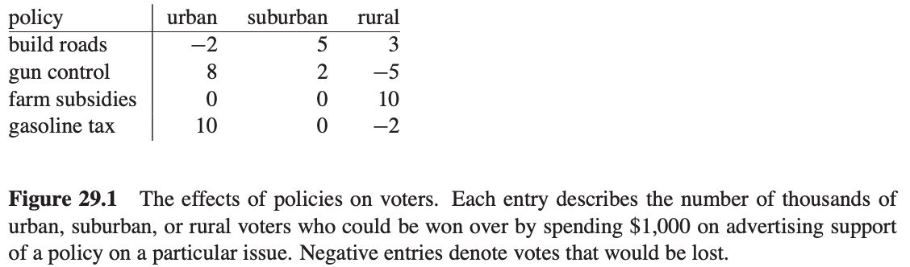

# Table of Contents

1.  [Algorithm](#org55a8832)
2.  [Review](#orgdf9b384)
    1.  [简介](#orgca7ca07)
    2.  [共识算法](#org94c4c06)
        1.  [问题](#org9235ba2)
        2.  [选择提议](#org5960352)
        3.  [学习一个选中的提议值](#org6e22e7e)
        4.  [进度](#org51d981b)
        5.  [实现](#orgdb397fb)
    3.  [实现状态机](#orge276ee4)
3.  [Tips](#org9d831b5)
4.  [Share](#org4bf1d57)
    1.  [一个选举投票问题的例子](#orgc22bed2)
    2.  [简介](#org1241999)
    3.  [标准形和松散形](#org7d67352)
        1.  [转换线性规划为标准形](#org452aaf5)
        2.  [松散形](#org7626be4)
    4.  [simplex算法](#orge0c0a77)
        1.  [simplex算法示例](#orgdda7c42)
        2.  [Pivoting](#org6f73759)
        3.  [形式化simplex算法](#org8a40e30)
        4.  [初始化过程](#org60dd875)
    5.  [c++代码实现](#org6bc325c)

# Algorithm

leetcode 664: <https://leetcode.com/problems/strange-printer/>

<https://medium.com/@dreamume/leetcode-664-strange-printer-51b80306c52>

# Review

Paxos Made Simple

<https://www.microsoft.com/en-us/research/uploads/prod/2016/12/paxos-simple-Copy.pdf>

## 简介

实现容错分布式系统的Paxos算法被认为难以理解，可能是原始论文是以古希腊故事呈现的，但事实上，它是最简单最显而易见的分布式算法。

## 共识算法

### 问题

假设一系列进程进行提议，共识算法则确保众多提议中只有一个被选中。如果没有任何提议，则没有任何提议会选中。如果一个提议被选中，则这些进程能够知道被选中的提议。共识需要满足如下安全性要求：

1.  只有提议的值能选中
2.  只有一个提议被选中
3.  直到提议被选中之前进程不知道有提议被选中

目的是确保最终某个提议被选中，如果一个提议被选中，则进程最终能知道这个提议。

我们定义共识算法中的三个角色：提议者，接收者和学习者。在实现中，一个进程可能扮演多个角色。

我们使用自定义的异步、非拜占庭模型：

-   可以在任意速度下工作，可能因为停止工作而故障，可以重启。因为可能在选中某提议后发生故障并重启，除非故障、重启等信息能被记录，否则没有解决方案
-   消息可以任意长时间才转发，复制，也可能会丢失，但不会损坏。

### 选择提议

只有一个接受者的情况下最简单，提议者发送提议给接收者，接收者选择它收到的第一个提议。但是该方案会导致接收者故障的话后续处理无法进行。

另一种方式是有多个接收者，提议者发送提议给这些接收者。接收者可能接受该提议，当足够多的接收者接受该提议后该提议变为被选中状态。我们选择多数的接收者作为被选中的底线，因为两个多数集合至少有一个共同的接收者。当一个接收者最多接受一个提议时成立。

在没有故障和消息丢失的情况下，我们希望提议被选中即使只有一个提议者提议。这将要求：

P1 &#x2013; 接收者必须接受它收到的第一个提议。

但该要求引出一个问题。多个提议可能被多个提议者同时提出，导致一种情形即每个接收者接受一个提议，但没有一个提议占多数。即使只有两个提议，如果每个被一半的接收者接受，一个故障发生后的接收者却不能学习到应该选哪个。

P1和多数接收者接受才能变为选中状态的要求意味着接收者必须允许接受多个提议。我们通过给提议赋予一个序号来跟踪不同的提议，这样一个提议包含一个序号和提议值。为防止混淆，我们要求不同的提议有不同的序号。满足该要求依赖具体的实现，我们先假设是这样。

我们可以允许多个提议被选中，但需要保证这些提议的提议值是相同的。通过引入序号，则以下条件必满足：

P2 &#x2013; 如果一个提议被选中，则每个被选中的高序号提议跟该提议的提议值是相同的

P2a &#x2013; 如果提议被选中，该提议值为v，则每个被接受的高序号提议其提议值也为v

由于异步环境，一个提议可能被没有收到任何提议的接收者选中。假设一个新的提议者醒来，发布一个新的高序号提议，且提议值不同。P1要求接收者接受该提议，这将导致与P2a冲突。则需要有以下要求：

P2b &#x2013; 如果提议值v被选中，则每个发布的高序号提议的提议值都为v

进一步可推出：

P2c &#x2013; 对于任意提议值v和序号n，如果一个提议包含提议值v和序号n被发布，则存在一个集合S包含一个多数接收者，

-   不存在集合S中的接收者接受了任何小于n的提议
-   v是所有被集合S中的接收者接受的小于n的提议中最高序号提议的提议值

这样提议者想要发布序号n的提议之前必须知道小于n的最高序号提议（已经或将要被接受的提议，该提议是指被多数接收者中的接收者接受的提议）。学习已被接受的提议非常容易，预测将来的接受提议很困难。为避免预测，提议者通过获得承诺没有什么样的接受列表来控制。即提议者请求接收者不要接受小于n的提议。以下通过算法解决该问题：

1.  提议者选择序号n的新提议，发送一个请求给接收者集合的每一个成员，要求响应以下内容：
    
    1.  承诺不接受小于序号n的提议
    
    2.  如果有已接受的提议，返回小于n序号的最高接受提议
    
    我们称该请求为序号n的准备请求

2.  如果提议者接收到多数接收者的请求响应，则该提议者可以发布一个序号n和提议值为v的提议，v为响应中的最高序号提议值，或者响应无提议时v为提议值可选择的任意值

提议者发布一个提议，通过发送给一些接收者，请求提议被接受（不需要是响应初始请求的相同接收者集合）。我们把这个请求称为接受请求。

以上是提议者的算法，关于接收者，它会接收到两种类型提议者的请求：准备请求和接受请求。接收者可以无妥协的忽略任何请求。即：

P1a &#x2013; 接收者可以接受序号n的请求当且仅当它没有响应一个要求序号大于n的准备请求

最终的算法还需要一个小优化。假设接收者接受到一个准备请求要求序号n，但接收者已经响应了一个准备请求要求的序号n'大于n，因此承诺不接受任何序号n的提议。因此接收者不响应这个新准备请求，因为它不接受提议者想要发布的带序号n的提议。所以接收者忽略该准备请求。同样接收者将忽略新的它已接受的准备请求。

基于这个优化，接收者需要记住它接受的最高序号提议和它响应的最高序号的准备请求。因为P2c必须保持不变，不管是否故障，接收者故障重启后必须记住这些信息。注意提议者可以丢弃提议，它不会发布相同序号的另一个提议。

结合提议者和接收者的行为，我们看到算法分为以下两个阶段：

第一阶段：

1.  提议者选择一个序号n和发送一个带序号n的准备请求给多数接收者
2.  如果接收者接收一个带序号n的准备请求，该序号n大于任何它已经响应的准备请求中的序号，则接收者响应该请求，承诺不接受任何小于序号n的提议及给出它已接受的最高序号提议。

第二阶段：

1.  如果提议者接收到多数接收者的准备请求响应，则它发送一个带序号n和值v的接受请求给每个响应的接收者，v是响应中最高提议的值或者任意值（当响应中没有任何提议）
2.  如果接收者接受一个带序号n的接受请求，它接受该提议除非它已响应一个带大于序号n的准备请求

提议者可发起多个提议，每个提议各走一遍算法。提议者可在过程中任意时刻丢弃提议（即使提议者的请求或响应在提议被丢弃后才到达，依然可以保证正确性）。如果有提议者在尝试发布高序号的提议，则丢弃之前的提议是个好办法。因此，如果一个接收者忽略一个准备请求或接受请求，因为它已经接收到一个带更高序号的准备请求，接收者应该通知提议者丢弃提议。这是一个性能优化，并不影响正确性。

### 学习一个选中的提议值

为了解已经被选中的提议值，一个学习者必须找到被多数接收者接受的提议。一个显见的算法是接受提议的接收者，响应所有的学习者，发送该提议。这使得学习者能尽快找到选中提议值，但它需要每个接收者响应每个学习者，响应数为接收者个数乘以学习者个数。

假设非拜占庭故障使一个学习者容易从另一个学习者发现已接受的提议值。我们可以使接收者响应不同的学习者，这些学习者再通知其他的学习者。这种实现需要额外一轮处理，而且可靠性变差，因为学习者故障将导致一些第二轮的学习者出现无法学习到的情况。但它需要的响应数少些，为接收者和学习者数目之和。

一般来说，接收者可以响应一系列不同的学习者，这些学习者再通知所有学习者。使用更大集合的学习者提供更高的可靠性，同时带来更高的通讯复杂度。

由于消息丢失，可能没有学习者找到已选中的提议值。学习者可询问接收者已接受的提议，但接收者故障可能导致是否有多数接受了某提议。这种情况下，学习者只有当新的提议被选中时才能找到。如果学习者需要知道是否一个提议值被选中，可以使一个提议值发布一个提议，使用上述描述的算法。

### 进度

我们可以构造一个场景，两个提议者各自发布一系列提议，序号为增序，而无提议被选中。提议者p完成序号n1 的提议的第一阶段，另一个提议者q完成序号n2 提议的第一阶段，n2 > n1。提议者p的第二阶段的接受请求被忽略，因为接收者承诺了不接受任何序号小于n2 的任何提议。这样提议者p开始并完成新序号n3 提议的第一阶段，n3 > n2，导致提议者q的第二阶段的接受请求被忽略。如此循环。

为保证进度，一个不同的提议者必须被选择作为唯一的提议者尝试发布提议。如果一个不同的提议者能跟多数接收者通讯，并且用一个提议其序号比当前所有使用的更大，则该提议能成功接受。如果提议者学习到一些请求带有更高的序号，通过丢弃提议并重新尝试，提议者最终能选择到一个足够高的序号。

如果整个系统工作正常，通过选举出一个不同的提议者能保证进度进行下去。Fischer，Lynch和Patterson的著名结论表示一个可靠的选举提议者算法必须使用随机或实时 &#x2013; 例如通过使用超时。然而，安全性可以得到保证，不管选举成功或失败。

### 实现

在共识算法中，每个进程扮演提议者、接收者或学习者的角色。请求和响应通过消息来传送。算法选择一个领导，扮演不同的提议者和不同的学习者角色。稳定的持久化存储，用来维护接收者必须记录的信息。接收者在发送响应之前把响应记录进持久化存储中。

剩下的用来描述机制保证没有两个提议者发布相同序号的提议。不同的提议者选择不相交集合中的数，这样两个不同的提议者不会发布相同序号的提议。每个提议者记录它尝试发布的最高序号的提议，并且用一个比它所有使用过的更高的序号开始第一阶段。

## 实现状态机

一个实现分布式简单的方法是所有客户端发布命令给中央服务器。该服务器可被描述为确定性状态机，串行执行客户端命令。状态机有当前的状态，从输入端获取执行步骤，产生输出和一个新的状态。一旦该服务器故障则无法工作。我们然后选择用多个服务器，每个都独立执行状态机。

为保障所有服务器执行相同序列的状态机命令，我们实现一系列Paxos共识算法的独立实例，每个服务器扮演算法实例里的所有角色（提议者、接收者和学习者）。

在正常操作中，一个服务器被选举为领导。客户端发送命令给领导，领导决定每个命令出现在何处。如果领导决定某个客户端应该是第135个命令，它尝试把这个命令选择为第135个共识算法实例的值。它可能成功，可能因为故障失败，或因为另一个服务器相信它自己为领导并且对第135个命令有不同的看法。但共识算法确保至多一个命令能被选中作为第135个。

效率的关键是在Paxos共识算法中，被提议的值应该在第二阶段才被选中。完成第一阶段的提议者算法，要么被提议值被确定或提议者可以自由的提议任何值。

我将描述Paxos状态机实现在正常操作中如何工作。之后，将讨论什么将导致出错。考虑当之前的领导故障和新的领导被选择是发生什么（系统启动是一个特殊例子，此时还没有命令被提议）。

一个新的领导，作为所有实例共识算法的学习者，应该知道已被选择的大多数命令。假设它知道命令1-134，138和139 &#x2013; 实例1-134，138和139被选中的值，然后执行实例135-137实例的第一阶段和所有大于139的所有实例。假设这些执行的输出决定被提议的135和140实例的值，而对其他实例无限制。领导然后执行135和140实例的第二阶段，然后选择命令135和140。

领导现在执行命令1-135。然而，它不执行命令138-140，因为命令136和137还没有被选择。领导可以选择下来的两个命令136和137，然而，我们让它填补隔阂立即提议，作为命令136和137，一个特殊的"no-op"命令让状态不变（通过执行共识算法实例136和137的第二阶段）。一旦no-op命令被选中，命令138-140即可被执行。

命令1-140现在都被选中。领导同样完成所有大于140的实例的第一阶段，可以提议这些实例的任何提议值。它赋予命令141给客户端请求的下一个命令，提议它作为141共识算法实例的第二阶段的值。提议下一个收到的客户端命令作为命令142，等等。

领导可以在学习到它的提议命令141被选中之前提议命令142。可能发送提议命令141的所有消息都丢失了，在所有其他服务器学习到领导提议什么作为命令141之前命令142已被选中。当领导未收到实例141第二阶段消息的响应，它将重传这些信息。如果正常，被提议的命令将被选中。然而，它可能失败。一般来说，假设领导可领a命令超前 &#x2013; 在1-i命令被选中之后提议命令i + 1到i + a。

一个新选中的领导如上述场景所述执行无穷多共识算法实例的第一阶段，实例135-137和所有实例大于139。使用所有实例的相同提议数值，通过发送一个短消息给所有服务器。在第一阶段，一个接收者响应多个OK仅在它收到一些建议者的第二阶段消息（在这个场景中，指实例135和140）。这样，这个服务器（作为接收者）可以响应所有实例的一个短消息。因此执行这些无穷多实例的第一阶段没有问题。

因为领导故障并选举一个新的领导不是一个常见的事情。执行状态机命令的有效成本 &#x2013; 获得命令/值的共识 &#x2013; 是执行共识算法的第二阶段成本。在允许故障的情况下Paxos共识算法的第二阶段具有所有算法的最小可能成本来达到共识。因此，Paxos算法本质上是最好的算法了。

系统正常操作的讨论假设总是只有一个领导，除了短暂的领导故障新领导选举期间。在异常环境下，领导选举可能失败。如果没有服务器作为领导，则没有新的命令被提议。如果多个服务器认为自己作为领导，则他们都能在共识算法实例中提议，可能导致无值被选中。然而，安全性能够得到保障，两个不同的服务器不会在某值选中作为第i个状态机命令上发生分歧。

如果服务器变动，则必须有什么方法确定什么服务器实现共识算法的什么实例。最容易的办法是通过状态机本身。当前的服务器可以使部分状态和状态机命令改变，我们可以允许一个领导提前获得a命令，通过一系列服务器执行实例i + a共识算法，在执行第i个状态机命令之后。这样允许任意复杂的重新配置算法的简单实现。

# Tips

-   看完书上讲的算法认为看懂了，于是写博客把该算法描述出来，写的过程中发现有些细节不清楚，以至于一些步骤没法描述清楚，于是再看书；当把博客写完了后，再把该算法用c++实现一遍，实现的过程中又发现一些新的细节没有注意到，于是代码写不下去需要看书再确认细节，直到实现的代码跑出正确的结果，才算基本确认算法确实搞懂了。可见没有这个过程的话，自我认为懂了其实是很想当然的。

# Share

Linear programming

算法导论29章中提到的算法

线性规划是通过指定一些包含变量的等式或不等式作为限制条件，获取目标函数最大值、最小值的问题。

## 一个选举投票问题的例子

假设你是一个政客想赢得选举。你的选区有三种类型区域&#x2013;城市、城乡结合部、农村。对应有100000，200000，50000注册选民。

你希望每个类型区域有至少一半的投票给你。你的主要主张是建造更多的路、控制枪支、投资农业、增收汽油税改善公共交通。

通过调研发现每花费1000美金广告支持某主张的投票变化表（投票人数单位：千）：

如何通过最小的花费达到每个类型区域至少一半投票给你的效果？

我们引入4个变量：

-   x1 为广告建造公路花费的金额（单位：千美金）
-   x2 为广告枪支控制花费的金额（单位：千美金）
-   x3 为广告投资农业花费的金额（单位：千美金）
-   x4 为广告汽油税花费的金额（单位：千美金）

可以得出以下公式：

为赢得至少50000城市居民投票：

-2x1 + 8x2 + 0x3 + 10x4 >= 50

赢得至少100000城乡结合部居民投票和25000农村居民投票：

5x1 + 2x2 + 0x3 + 0x4 >= 100

3x1 - 5x2 + 10x3 - 2x4 >= 25

以及最小的花费表达式：

x1 + x2 + x3 + x4

同时：

x1 >= 0, x2 >= 0, x3 >= 0, x4 >= 0

根据以上不等式，我们构造一个线性规划问题，整理如下：

最小化    x1 + x2 + x3 + x4

约束

-2x1 + 8x2 + 0x3 + 10x4 >= 50

5x1 + 2x2 + 0x3 + 0x4 >= 100

3x1 - 5x2 + 10x3 - 2x4 >= 25

x1, x2, x3, x4 >= 0

## 简介

我们看一个例子：

最小化    x1 + x2

约束

4x1 - x2 <= 8

2x1 + x2 <= 10

5x1 - 2x2 >= -2

x1, x2 >= 0

满足所有约束的x1、x2 我们称之为该线性规划问题的可行解，如下图：

我们称图中阴影部分为有解区域，目标函数在某一点的值为目标值。使目标值最大的点为最优解。

可以看到线性规划的最优解在可解区域的顶点上。由于有解区域是凸的，最优解必须出现在顶点上。相似的，可以推广到N维空间，如果我们有n个变量，每条约束定义了n维空间里的一个半空间，由于仍具有凸性，最优解依然在一个顶点上。

## 标准形和松散形

线性规划中

标准形：

给定n个实数c1, c2, &#x2026;, cn，m个实数b1, b2, &#x2026;, bm，和mn个实数aij，i = 1,2,&#x2026;,m，j = 1,2,&#x2026;,n

### 转换线性规划为标准形

考虑如下4种情况：

1.  目标函数为求最小值而不是最大值
2.  变量不是非负的
3.  约束为等式
4.  不等式约束为大于等于

我们通过例子来说明：

改变目标函数为最大值，求得最大值，取负即为原最小值。

如果xj 缺少非负约束，我们将用x'j - x''j 替代xj，并添加约束x'j >= 0和x''j >= 0。

等式约束可以转成两个不等式约束：

最后，大于等于的约束改为小于等于，把x'2用x2 代替，x''2 作为x3：

### 松散形

在标准形的基础上我们通过再添加松散变量使其变成松散形（不等式约束变成等式约束），如下图的不等式：

记s为松散变量，不等式变换为如下等式形式：

再以之前的例子说明，转换成松散形后：

等式左边的变量我们称之为基本变量，右边的为非基本变量。我们用z表示目标函数的值，把例子简化成如下松散形：

## simplex算法

simplex算法是解决线性规划问题的典型方法。同本书大多数其他算法不同，本算法最坏的情况下不是多项式时间复杂度。

simplex算法跟高斯消元有些相似，通过迭代消元来找到可行解最优值，每次迭代根据等式约束把一个非基变量变换为基本变量，通过设非基变量为0，依此求得基本变量值，从而获得目标函数值。我们还是通过例子来具体说明：

### simplex算法示例

考虑如下标准形的一个例子：

首先是转化成如下的松散形：

设基本变量x1, x2, x3 为0，则x4, x5, x6 分别为30, 24, 36，目标函数值z = (3 \* 0) + (1 \* 0) + (2 \* 0) = 0。

我们的目标是每次迭代能够获得更高的目标函数值。我们先考虑增加x1 的值，当x1 的值增加时，x4, x5, x6 的值将减少。根据约束，我们不能让它们的值减为负。如果x1 增加到30以上，x4 变成负数，相应的，当x1 增加到12、9时对应的x5、x6变为负。这样我们得到如下迭代后的松散形：

我们把这个操作叫做pivot，一个pivot选择一个非基变量xe 和一个基本变量xl，交换它们的角色。以上pivot操作后目标函数值为(3 \* 9) + (1 \* 0) + (2 \* 0) = 27。

继续考虑迭代，我们选择一个新的变量来增加目标函数值，我们不考虑x6，因为它的值增加则目标函数值将减少。我们将尝试增加x2 或 x3，我们先选择x3。同理，根据上图约束我们可以转化为如下松散形：

获得目标函数值为111/4。现在我们只能选择增加x2，转换后如下：

这时，目标函数上所有的系数都是负值，这时的目标函数值为28，是最优解。

### Pivoting

我们把pivoting的形式化代码写出如下：

结合上面的示例看来会比较清晰。

### 形式化simplex算法

我们还需要考虑以下几个问题：

-   我们如何确定线性规划问题有可行解？
-   如果线性规划问题有可行解，但初始化方案无可行解？
-   如何确定线性规划问题无边界？
-   如何选择进入变量xe 和离开变量xl ?

在之后的一节将说明如何确定问题是否有可行解，我们假设我们有一个INITIALIZE-SIMPLEX(A, b, c)的方法，把线性规划问题的标准形作为输入，mxn的矩阵A = ( aij )，m维向量b = ( bi )，n维向量c = ( cj )。如果线性规划问题无解，该方法返回问题无解的消息并终止，否则方法返回一个松散形。

3-12行的循环过程是算法的主要部分。如果目标函数中的所有系数为负，则循环终止。否则第4行会选择一个变量xe，其系数在目标函数中为正，5-9行检查约束，确定xe 的增长值，如无约束限制xe 的增长，则算法无界。

注：每次迭代我们希望目标函数值将增加，但有可能迭代导致目标函数值不变，考虑如下示例：

假设我们选择x1 作为xe，x4 作为xl，则：

这时，只能选择x2 作为xe，x5 作为xl，则：

目标函数值不变，而我们继续迭代将导致重复上述两步的循环。

这种情况将导致simplex算法无法终止。循环在理论上是存在的，但一般很少出现。我们可以通过谨慎地选择xe 和 xl 来防止循环出现。一种办法是小心地选择输入使其不出现两个可行解导致相同的目标函数值的情况，另一种是迭代时总是选择最小index的变量，该策略叫Bland's rule。可以参考一下文章：<https://www.matem.unam.mx/~omar/math340/blands-rule.html>

### 初始化过程

现在讲讲之前提到的INITIALIZE-SIMPLE，我们需要在这个过程中判断线性规划问题是否有可行解。对于一个线性规划问题的标准形，我们添加一个x0 变量，使其转化为如下形式：

当且仅当该线性规划方程式最优解为0时原标准形有可行解。如取得最优解为0，则x0 为0，将该值带入其中，可以看到即变成原标准形。因此初始化过程形式代码如下：

## c++代码实现

<https://github.com/dreamume/introduction2algorithm/blob/master/chapter29/simplex.h>

<https://github.com/dreamume/introduction2algorithm/blob/master/chapter29/simplex.cc>

