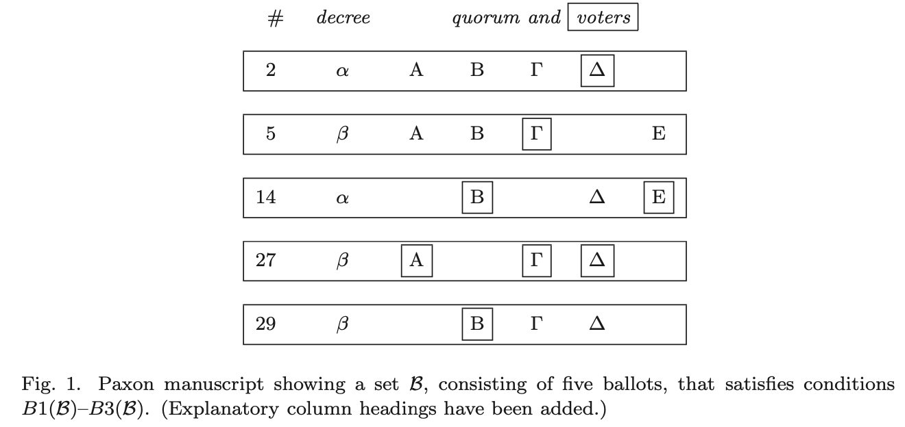
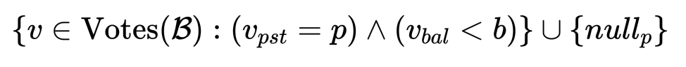
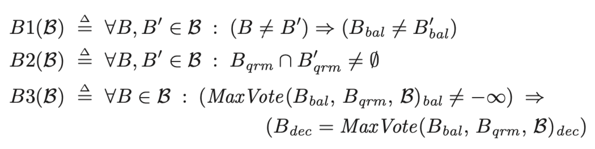
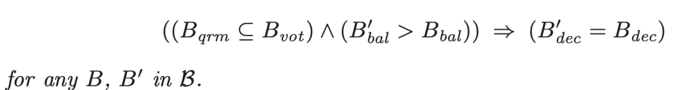
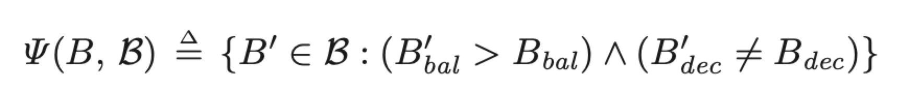
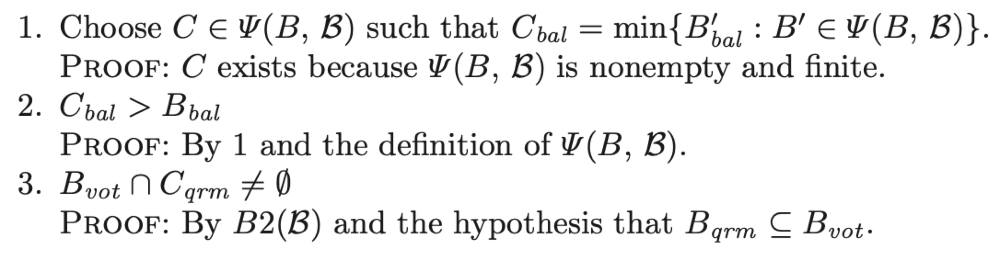
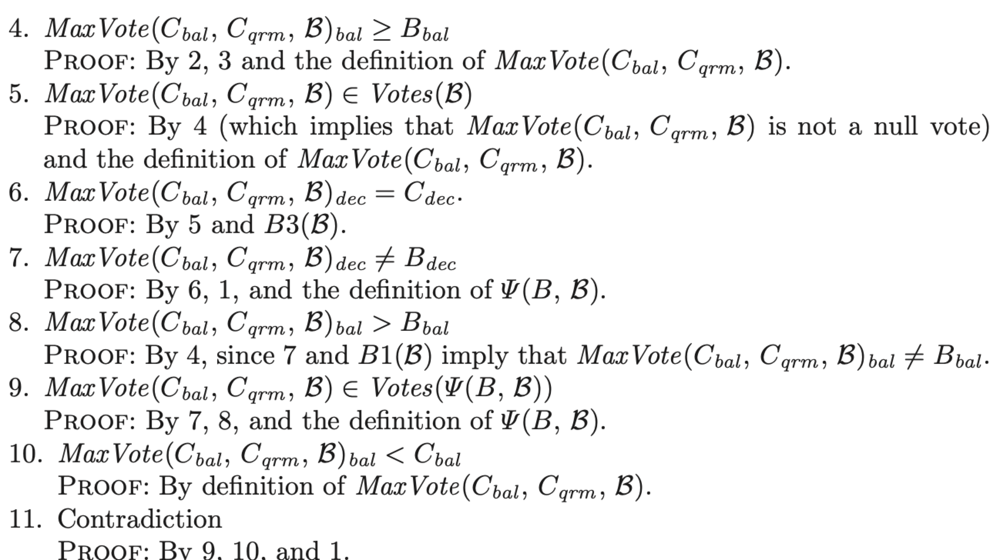
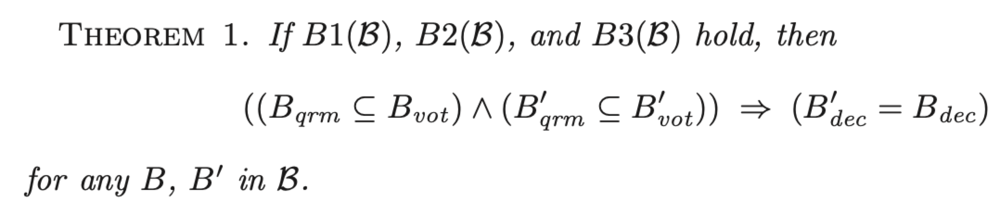

# Table of Contents

1.  [Algorithm](#orgd0899c2)
2.  [Review](#org2a11cc7)
    1.  [问题](#orgda8cdcd)
        1.  [Paxos岛](#orgccec4a3)
        2.  [需求](#orgc8122c0)
        3.  [假设](#org9d00a6f)
    2.  [单法令会议](#org1763add)
        1.  [数学结果](#org71f8222)
        2.  [原始协议](#org3f97282)
        3.  [基本协议](#orgb3e795b)
        4.  [完整的会议协议](#org53ef2e6)
    3.  [多法令议会](#orga4759c3)
        1.  [协议](#org7c093c3)
        2.  [协议的属性](#org3a7aa8e)
        3.  [未来发展](#orgf25f0dc)
    4.  [计算机科学相关](#orgaa7453a)
        1.  [状态机实现](#orgd25f87d)
        2.  [提交协议](#orgf798a66)
3.  [Tips](#orga11dff1)
4.  [Share](#orgd44a7fb)
    1.  [简介](#org7530943)
    2.  [WAL如何工作](#org743c852)
        1.  [checkpointing](#orgc4c20e5)
        2.  [并行](#orgeb53479)
        3.  [性能考量](#org6405da7)
    3.  [激活和配置WAL模式](#org9de946e)
        1.  [自动checkpoing](#orgf83b9ef)
        2.  [应用程序初始化checkpoint](#org3647acd)
        3.  [WAL模式的持久性](#org9626b98)
    4.  [WAL文件](#org85cbaab)
    5.  [只读数据库](#orgb2878d5)
    6.  [避免过大的WAL文件](#org49ae438)
    7.  [wal-index的共享内存实现](#org366fbe2)
    8.  [使用没有共享内存的WAL模式](#orgae2c0cd)
    9.  [WAL模式下一些查询返回SQLITE_BUSY](#orgc271db8)
    10. [向后兼容性](#org561577b)

# Algorithm

leetcode 673: <https://leetcode.com/problems/number-of-longest-increasing-subsequence/>

<https://medium.com/@dreamume/leetcode-673-number-of-longest-increasing-subsequence-5d05faa85070>

# Review

The Part-Time Parliament

<https://www.microsoft.com/en-us/research/uploads/prod/2016/12/The-Part-Time-Parliament.pdf>

最近在Paxos岛上的考古发现那里议会即使有经常旅游的兼职立法议员也能正常运行。议员维护议会记录的一致性拷贝，即使经常不在议会或送信者忘记了。Paxon议会协议提供了新的状态机机制来实现分布式设计。

## 问题

### Paxos岛

一千年前左右，爱琴海的Paxos岛是一个成长中的商业中心。财富导致政治复杂性，Paxos人以议会的形式政府取代了早期的宗教式统治。在城市职责出现前就已有交易，但在Paxos没有人愿意为议会出力。Paxos议会不得不在立法议员频繁出入国会议院的情况下颁布法令。

管理这样的兼职议会面临的问题跟现在的容错式分布式系统相似，立法议员对应进程，离开议院对应进程出错。科学家们因此对Paxos人的解决方案很感兴趣。这里我呈现Paxos议会协议的一个简短历史，接着会有一个更剪短的分布式系统的相关讨论。

Paxos文明已被外来侵略者摧毁，考古学家最近开始揭露其未知的历史。我们对Paxos议会的了解因此也是琐碎的。虽然基本的协议我们知道，但我们会忽略很多细节。当一些细节比较有趣时，我将Paxos人可能做了什么的讨论自由留给大家。

### 需求

议会的主要任务是制订岛屿的法律，通过一系列的法令来形成法律。现代议会会雇佣秘书来记录，但在Paxos没有人愿意逗留在议院长达一个季度。因此，每个Paxos立法议员维护一个账本，记录通过的法令。例如，立法员Λ ̆ινχ∂z账本上有这样一条记录：

    155: 橄榄税是每吨3德拉克马

账本使用一种无法篡改的墨水。

议会协议的第一个需求是账本的一致性，不同账本不能含有矛盾的信息。如果立法员Φισ∂ερ有如下记录：

    132: 灯具必须使用橄榄油

则其他立法员没有不同的132条法令。如果立法员还不知道132条法令已通过，他可能没有该条法令记录。

光账本的一致性还不够，因为账本可能无记录。因此需要保证法令最终被通过且记录进账本。在现代议会中，法令需要通过议员的同意。这在Paxos不是问题，因为他们之间充分信任并接受。Paxos的立法议员愿意通过被提议的任何法令。但他们经常旅游的习性引出了一个问题。一致性将丢失当一组立法员发布法令

    37: 禁止在寺庙墙上涂画

然后他们离开去参加宴会。同时另一组议员进入议院，并不知道刚才的法令，他们又通过了一条新的冲突法令：

    37: 允许自由地艺术表达

这样法令进度无法保障，除非足够的立法议员花足够的时间呆在议院。因为Paxos的立法议员不愿意他们的外出活动被限制，因此不能确保任何法令被通过。然而，立法议员愿意保证，当在议院时，他们愿意帮助处理所有的议会事务。这种保证促使Paxos发明了一种议会协议满足如下进度条件：

           如果多数立法员在议院并且在一段长时间内无人进入或离开，则议院里的立法员提议的任意法令都被通过，
           每个通过的法令都会出现在议院里议员的账本里。

### 假设

议会协议的条件只有在提供给立法议员必要资源后才能达成。每个立法议员拥有一个记录法令的账本，一支笔和不可篡改的墨水。当议员离开议院时可能忘记他们做的事情，所以他们在账本写下备注提醒他们一些重要的议会任务。法令列表的记录不能改变，但备注可以划掉。获取进度需要立法议员能够测量时间，他们给出一个简单的漏斗计时器。

立法议员始终带着账本，总是读着法令列表和未划掉的备注。账本是用最好的皮质制作，并只用于最重要的备注。议员在另一些小纸片上记录其他的备注，当他离开议院时可能丢失。

议院传声很差，不能公开宣讲。议员只能通过信使交流，已提供足够的资金供议员雇佣足够的信使。信使可以信赖不会发送意图不明的消息，但他可能忘记已经发送了消息，并会重复发送。和议员一样，信使也是兼职。信使可能离开议院去做一些生意，可能花费6个月的旅行，然后才传递消息。他甚至可能永远离开，导致消息不被转发。

虽然议员和信使可能在任意时刻进入或离开，当在议院的时候他们会尽力为议会工作。当他们在议院时，信使尽力转发消息，议员反馈收到的信息。

Paxos的官方记录声称议员和信使非常诚实并严格服从议会协议。大多数研究员不在意这点，约定俗成地认为Paxos在道德上比东方邻居做得好。不诚实，虽然罕见，不可怀疑地当然存在。然而，在官方文档里没有提及，我们对议会如何处理不诚信的议员和信使所知甚少。

## 单法令会议

Paxos议会从早期一种祭司仪式的会议演化而来，祭司每19年聚集一次来选择一个标志性的法令。多个世纪以来，这个会议通过约定俗成的过程来选择法令，该过程需要所有祭司在场。但在商业繁荣发展后，在会议过程中祭司开始往来于议院。最终，旧的协议失效，导致无法令被选中。为防止这种技术灾难的复现，Paxos宗教头领请求数学家来设计新的协议。协议的需求和假设和前述议会相同，除了账本只能最多有一个法令。

数学家通过一系列步骤实现该协议。首先，他们证明结果显示协议满足一些限制就能保障一致性和确保协议在推进。一个原始的协议由这些限制引出。一个限制性的原始协议版本提供基本协议的一致性，但不保证进展。然后完整的协议，满足一致性和进展要求，从这个限制的基本协议中发展出来。

### 数学结果

法令选择通过一系列投票产生，每个投票过程，祭司只能选择投或不投。参加本次投票过程的祭司人数叫法定人数。一个投票过程成功当且仅当法定人数里的所有祭司都已作出投票决定。形式上，一个投票活动B包含如下四个部分：

-   Bdec 本次投票的法令
-   Bqrm 非空祭司集合（投票的法定人数）
-   Bvot 已做出投票决定的祭司集合
-   Bbal 代表本次投票活动的序号

投票活动B成功完成当且仅当Bqrm ⊆  Bvot，即每个法定成员都已做出投票决定。

投票活动序号从无边界顺序数字集合中选择。如果B'bal > Bbal，则投票活动B'在B之后。但这并不意味着实际时间顺序，之后的活动也可能发生得更早。

Paxos数学家定义了一系列投票活动ℬ的这些条件，并展示在这些条件下一致性和进度可以得到保障。前两个条件比较简单，形式化描述如下：

-   B1(ℬ) 每个投票活动在集合ℬ中有一个唯一的活动序号
-   B2(ℬ) 任意两个投票活动的法定人数里至少有一个共同祭司

第3个条件比较复杂，一个Paxos手稿上有比较含糊的描述：

B3(ℬ): ℬ集合中的每个投票活动，任何法定人数里的祭司在之前活动中如已投票，则本次活动所代表的法令和该祭司在最新的已投票的早期活动的法令相同

我们通过手稿上的图1来帮助解释，图1显示5个投票活动，有5个祭司：A, B, Γ, ∆, 和 E，并显示了每次活动的法定祭司，方框括起来的表示该祭司已完成投票决定。例如，序号14的活动投票的法令是α，法定人数为3人，2人已做出投票决定。

5次活动的条件如下：

-   活动2是最早的活动，因此满足条件要求
-   活动5中的法定成员没有在之前的活动中投票，因此活动5满足条件要求
-   活动14中唯一一个在早期活动中有投票的是祭司∆，他在活动2中投了票，因此按条件要求活动14的法令和活动2的法令必须相同
-   活动27是一次成功的活动，祭司A没有在之前的活动中投票，祭司Γ在活动5中投了票，祭司∆在活动2中投了票，因此按条件要求活动27的法令必须与活动5的法令相同
-   活动29中祭司B在活动14中投了票，祭司Γ在活动5和27中投了票，祭司∆在活动2和27中投了票。这些活动中最新的活动是27，所以按条件要求本活动必须和活动27的法令相同

为形式化描述B1(ℬ) - B3(ℬ) 我们需要添加一些记号。一个投票v有3个部分组成：祭司vpst，投票活动号vbal和法令vdec。它表示祭司vpst在投票活动vbal中为法令vdec选择的投票决定。Paxos定义空投票vbal = −∞，vdec = BLANK， 对任意投票活动b，−∞ < b < ∞，BLANK表示非法令，对任意祭司，定义nullp对应vpst = p。

Paxos数学家对所有投票定义了一个总序，但部分手稿丢失了该定义。一些琐碎记录显示，对任意投票v和v'，如果vbal < v'bal 则v < v'。

对任意投票活动集合ℬ，集合Votes(ℬ)定义为包含所有投票v，vpst ∈ Bvot，vbal = Bbal，vdec = Bdec，B ∈ ℬ。如果祭司p和b为一个活动号或±∞，则MaxVote(b, p, ℬ)定义为p投票的最大的投票v，v ∈ Votes(ℬ)vbal < b或nullp。公式如下：

对任意非空祭司集合Q，MaxVote(b, Q, ℬ)定义为集合Q中的祭司p的MaxVote(b, p, ℬ)的最大值。

条件B1(ℬ) - B3(ℬ)形式化描述如下：

虽然MaxVote的定义依赖投票顺序，B1(ℬ)表明MaxVote(b, Q, ℬ)dec不依赖于相同活动序号的投票顺序。

为表示这些条件能满足一致性，Paxos人首先表示B1(ℬ) - B3(ℬ)意味着，如果ℬ中的一个投票活动B成功，则任意后面的集合ℬ中的活动，其法令跟本次活动相同的都是活动B。

引理：如果B1(ℬ)，B2(ℬ)，B3(ℬ)满足，则：

引理的证明

对ℬ集合中的任意投票活动B，定义Ψ(B,ℬ)为晚于B且法令不同于B中的法令的活动集合：

为证明引理，需表明如果Bqrm ⊆ Bvot，则Ψ(B, ℬ)为空。

Paxos人通过反证法，他们假设存在这样的活动B，Bqrm ⊆ Bvot 且 Ψ(B, ℬ) != ∅，则获得矛盾：

通过这个引理，我们能够得到定理1：

Paxos人然后证明了另一个定理，假设如果议院里有足够多的祭司，通过条件B1 - B3能够指导得到一个成功的投票活动。虽然这里没有保证进度，但它至少显示了这样的过程不会被死锁。

定理2：设b为活动号，Q为祭司集合，对所有B ∈ ℬ，有b > Bbal且Qb>∩Bqrm !̸= ∅。如果B1(ℬ), B2(ℬ), and B3(ℬ)满足，则存在一个投票活动B'，B'bal = b且 B'qrm = B'vot = Q，使其满足B1(ℬ∪{B′}), B2(ℬ∪{B′})和B3(ℬ ∪ {B′})

证明：从条件B1(ℬ)和B1(ℬ∪{B′}) ，选择B'bal和假设b，从条件B2(ℬ)和B2(ℬ ∪ {B′}) ，选择B'qrm和假设Q，如果MaxVote(b, Q, ℬ)bal = −∞则让B'dec为任意法令，否则让它等于MaxVote(b, Q, ℬ)dec，则有B3(ℬ)和B3(ℬ ∪ {B′})

### 原始协议

Paxos人从B1(ℬ)–B3(ℬ) 条件下得出原始协议。协议定义指出集合ℬ如何改变，该集合不通过直接计算得出。Paxos人认为集合ℬ的数量只能被上帝观察到，任何凡人都不能。

每个投票活动都会被祭司初始化，祭司会选择一个序号，法令和法定人数。每个法定人数里的祭司能做出投或不投的决定。规则决定负责初始化的祭司如何选择投票活动的序号、法令、法定人数和在保证B1(ℬ)–B3(ℬ)条件下祭司如何投票。

为满足B1，每个投票活动需要有一个唯一的序号。通过记录在账本里的投票活动，祭司很容易避免不同的投票活动使用相同的号的问题。为避免不同的祭司初始化出相同的序号，需要在祭司间把可选的序号集进行划分。虽然不知道怎么做，但一个简单易见的方法是让活动序号为号码加祭司的组合，使用字典序，例如：

    (13, Γρα ̆ι) < (13, Λινσε ̆ι) < (15, Γρα ̆ι)

为满足B2，一个活动的法定人数里选择包含一组祭司μαδζ∂ωριτ ̆ισετ。初始化时，μαδζ∂ωριτ ̆ισετ表示简单多数。之后，观察到胖的祭司走动慢且花费更多的时间在议院中，所以μαδζ∂ωριτ ̆ισετ改变为祭司的集合，其总体重大于所有祭司体重的一半。当一些瘦的祭司抱怨不公时，实际的体重被替换为符号化的体重，其值基于祭司的出席记录。μαδζ∂ωριτ ̆ισετ的主要目的是使任何两个祭司集合，包含有μαδζ∂ωριτ ̆ισετ里的祭司则该两集合至少有一个共同的祭司。为满足B2，祭司初始化一个活动B，选择的Bqrm需要是一个多数集合。

条件B3要求如果MaxVote(b, Q, ℬ)dec不为BLANK，则序号为b的活动和法定人数Q必须含有法令为MaxVote(b, Q, ℬ)dec。如果MaxVote(b, Q, ℬ)dec为BLANK，则投票活动的法令可以是任意法令。为满足条件B3(ℬ)，在初始化序号为b，法定人数为Q的新活动前，祭司p需要找到MaxVote(b, Q, ℬ)dec。这样，祭司p需要找到Q中每个祭司q的MaxVote(b, q, ℬ)。

祭司p给q发消息获得MaxVote(b, q, ℬ)。因此协议中一个投票活动祭司p的首要两步是：

1.  祭司p选择一个新的活动号b并发送一个NextBallot(b)的消息给一些集合中的祭司
2.  祭司q响应该消息，发送LastVote(b, v)消息给祭司p，v是祭司q参与的小于b的最大已投票活动号，若祭司q没有参与任何小于b的活动则为nullq

祭司q必须在账本做备注来记录他的投票。

祭司q发送的LastVote(b, v)，v等于MaxVote(b, q, ℬ)。但集合ℬ的投票活动随着新投票活动的初始化和新的投票产生而变化。由于祭司p需要通过v来选择法令，为满足条件B3(ℬ)，在祭司q发送LastVote(b, v)消息后MaxVote(b, q, ℬ) 不能再改变。为此，祭司q在活动序号vbal和b之间的活动不能在参与投票。通过发送LastVote(b, v)消息，祭司q即承诺不再参与有关活动投票。（为保证这个承诺，祭司q必须在账本中记录一些必要的信息）

投票协议的接下来两步：

1.  在收到某个多数集合Q里的每个祭司的LastVote(b, v)消息后，祭司p初始化一个新的投票活动，序号为b，法定人数为Q，及法令d，d必须满足条件B3。则在账本记录该活动并发送一个BeginBallot(b, d)的消息给Q中的每一个祭司
2.  祭司q在收到BeginBallot(b, d)消息后，将做出对活动b的投票决定。（祭司可能不投，因这样可能会违背发送给；另一个投票活动LastVote(b', v')的承诺）如果祭司q对活动b做出决定，则他发送一个Voted(b, q)的消息给祭司q并在账本里做记录。

步骤3将向集合ℬ中添加一个活动B，其Bbal = b，Bqrm = Q, Bvot = ∅（此时还没有人投票）和Bdec = d。在步骤4中，如果祭司q决定对活动投票，则改变活动集合ℬ，即添加q到集合Bvot, B ∈ ℬ。

祭司在步骤4中有权利不投票，即使投票不会违背任何承诺。事实上，协议的这些步骤都是可选的。例如，祭司q可以忽略NextBallot(b)消息而不执行步骤2。不采取行动会防止进展，但不会导致不一致性，因不违背条件B1(B)–B3(B)。甚至唯一的影响是未收到消息防止进一步行动发生，消息丢失也不会导致不一致。这样，协议保证了一致性，即使祭司离开议院或消息丢失。

收到重复的消息导致行为重复。除了步骤3，其他情况执行重复的行为并没有影响。例如，在步骤4中发送几个Voted(b, q)消息和发送一个效果相同。步骤3的重复通过账本记录可以防止。这样，一致性条件得到满足即使信使重复发送消息多次。

步骤1-4描述了初始化投票活动和投票的完整协议过程。剩下的是决定投票活动的结果和什么时间宣布法令。提醒一下投票活动成功当且仅当法定人数里的所有祭司都已投票。协议的剩下部分为：

1.  如果祭司p收到集合Q中的每个祭司q的Voted(b, q)消息，则他在账本中写入活动法令d，发送Success(d)消息作为响应
2.  收到Success(d)消息后，祭司q在账本中记录法令d

步骤1-6描述了一个投票活动的过程。原始协议允许任何祭司在任何时间初始化新的投票活动。每个步骤满足B1(ℬ)– B3(ℬ)，所以整个协议也满足该条件。祭司在账本中记录法令仅当该法令为一个成功的投票活动的法令。定理1意味着祭司的账本是一致的。协议未提及进度问题。

在步骤3中，通过条件B3决定法令，则有可能法令已经写入一些祭司的账本。祭司不需要在法定人数中，他可能离开了议院。这样如果步骤3允许更多的自由来选择法令d的话一致性将不能保证。

### 基本协议

原始协议中，祭司需要记录每个他初始化的投票活动号，每个投票，每个他发送的LastVote消息。记录所有这些信息对一个忙碌的祭司比较困难。Paxos人因此限制原始协议来获得更加实用的基本协议，使祭司p只需要维护下面信息到账本中：

1.  lastTried[p] 祭司p初始化的最新的活动序号，如没有则−∞
2.  prevVote[p] 祭司p投过票的最新的活动号，如没有则−∞
3.  nextBal[p] 祭司p发送过的LastVote(b, v)消息中最大的b值

原始协议的步骤1-6描述了祭司p如何指导单个投票活动。原始协议允许祭司p同时指导任意数量的投票活动。在基本协议中，只能允许一个时间一个活动，该活动号为lastTried[p]。祭司p初始化该活动后，他将忽略有关以前他初始化的其他活动的消息。祭司p会在纸片上记录lastTried[p]活动的所有进度信息。如果他丢失了该纸片，则他停止指导该活动。

在原始协议中，祭司q发送的每个LastVote(b, v)消息代表一个承诺不在vbal和b之间的任意活动中投票。在基本协议中，将代表一个更强的承诺：不去给活动号小于b的任何活动投票。这将防止该祭司在基本协议步骤4中投票，该行为在原始协议中是允许的。然而，原始协议总是给祭司q一个权利可以不投票，基本协议不要求他做任何原始协议不允许的事。

原始协议的步骤1-6变成如下基本协议的6个步骤（所有信息被祭司p用来指导投票活动，除了lastTried[p]，prevVote[p]，nextBal[p]记录在纸片中）。

1.  祭司p选择一个大于lastTried[p]的新活动号b，设置lastTried[p]为b，发送NextBallot(b)消息给一些祭司
2.  收到b > nextBal[q]的NextBallot(b)消息后，祭司q设置nextBal[q]为b，发送LastVote(b, v)消息给祭司p，v为prevVote[q]（如果b <= nextBal[q]，NextBallot(b)消息将被忽略）
3.  在收到祭司集合Q中每个祭司的LastVote(b, v)消息后，b = lastTried[p]，祭司p初始化一个新的投票活动，其号为b，法定人数为Q，法令为d，d需要满足条件B3。祭司p然后发送BeginBallot(b, d)消息给Q中每个祭司
4.  当收到b = nexgtBal[q]的BeginBallot(b, d)消息后，祭司q在活动b中投票，设置prevVote[q]为本次投票，发送Voted(b, q)消息给祭司p。（如果b != nexgtBal[q]则BeginBallot(b, d)消息将被忽略）
5.  如果祭司p收到Q中每个祭司q的Voted(b, q)消息，b = lastTried[p]，则祭司p把法令d写入账本并发送Success(d)消息给每个祭司。
6.  当收到Success(d)消息时，祭司在账本中记录法令d

基本协议是原始协议的限制版本，即基本协议允许的操作在原始协议中同样允许。因原始协议满足一致性，基本协议因此也满足一致性。跟原始协议一样，基本协议甚至不需要任何操作被执行，因此它也没有涉及进度问题。

然而，一些类似的显而易见的古老智慧被证明是错误的，一些质疑的市民要求一个更严谨的证明。这些Paxos数学家的证明协议满足一致性要求将放在附录中。

### 完整的会议协议

## 多法令议会

当议会建立，一个满足一致性和进度要求的协议从宗教会议中发展出来。原始议会协议的起源和属性将在3.1和3.2章节中描述。3.3章节将讨论协议未来的演变。

### 协议

Paxos议会可以同时通过一系列法令。和会议协议一样，先是一个总统被选举出来。任何人想要通过一项法令就先通知总统，则总统分配一个序号给该法令并尝试让它通过。逻辑上，议会协议对每个法令序号使用一个完整会议协议的独立实例。然而，单个总统处理所有这些实例，但只执行协议的前2步一次。

获得原始协议的关键是，在会议协议中，总统直到步骤3才会选择法令或法定人数。新选择的总统p能在所有的会议协议实例中发送给一系列立法者类似NextBallot(b)的消息（有无穷多个实例，每个实例对应一个法令号）。立法员q可以对所有会议协议实例回复一个类似步骤2的LastVote消息。该消息包含有限数量的信息，因立法员q只在有限个实例中投票。

当新总统收到多数集合中的每个成员的回复，则准备执行会议协议中每个实例的步骤3。对有限数量的实例，步骤3中法令的选择决定于B3条件。然后总统立即执行这些实例的步骤3来尝试通过这些法令。当他收到通过法令的请求时，他选择能选择的最小号法令，并执行步骤3尝试通过法令。

以下对简单协议的修改引出了实际的Paxos议会协议：

-   没必要查看整个会议协议来选择法令。如果新选择的总统p的账本里已有所有小于等于n的法令，则他发送NextBallot(b, n)的消息给会议协议的所有实例要求一个大于n的法令号。在回复消息中，立法员q告知p所有法令号大于n的法令已记录进账本里，并请求p发送给他不在他账本中的任意法令号小于等于n的法令号。
-   假设法令125和126已在周五下午引入，法令126已通过且已写入一个或两个账本中，然后所有的立法员回家过周末去了。假设接下来的周一，∆φωρκ被选择为新总统，并学习到了法令126，但她并不知道法令125，因为之前的总统和投票的所有立法员都不在议院。她将持有一个投票活动通过了法令126，这样账本中出现了隔断。分配法令号125给新法令将导致该法令在账本中出现的比法令126早。法令乱序将导致混乱 - 例如，如果市民基于126法令提议新的法令，因他已知126法令已通过。然而，∆φωρκ会尝试通过：
    
        125: 二月月中是国际橄榄油日
    
    一个传统的法令，对Paxos所有人来说没有不同。一般来说，新总统会通过类似橄榄油日这样的法令来填充账本中存在的隔断。

原始协议的一致性和进度属性遵从对应的议会协议的属性。Paxos人不会厌烦写一个精确的原始协议的描述，因为从会议协议中获得该协议很简单。

### 协议的属性

1.  法令的序

    含不同的法令号的投票活动可能同时发生，不同的立法员初始化活动，每个立法员初始化时视己为总统。我们不能确定法令已怎样的顺序通过，特别是不知道总统如何被选出的时候。然而，我们可以推演出法令顺序的一个重要属性。
    
    法令被提议指当总统在会议协议的对应实例的步骤3中选择了它。法令被通过指法令第一次被写进账本。在总统提议任何新法令前，他需要学习多数集合中的每个人他所投票过的法令。任何通过的法令必须有多数集合中的至少一个立法员投票过。因此，总统必须在初始化新法令前学习到所有之前通过的法令。总统可以不用重要的法令填充法令序号的隔断。总统同样不能乱序提议法令。因此，洗衣满足如下法令序属性：
    
                如果法令A和B都为重要的法令，法令A在法令B被提议前通过，则法令A的序号小于B

2.  关门前

    虽然我们不知道选择总统的细节，但我们知道当总统被选出且无人进出议院时议会如何工作。当收到要求通过法令的请求时，从市民直接获得请求或由其他立法员转发，总统分配法令一个序号并通过交换以下信息来通过法令（号码对应会议协议的步骤）。
    
    (3) 总统发送一个BeginBallot消息给所有法定人员
    
    (4) 法定人员里的每个人发送一个Voted消息给总统
    
    (5) 总统发送一个Success消息给每个立法员
    
    三种类型消息转发，假设议会有N个立法员且法定人数为N/2，则共3N个消息。如果议会很忙，总统可以合并法令的BeginBallot消息和前一个法令的Success消息，这样对每个法令需要总共2N个消息。

### 未来发展

管理岛屿已证明比Paxos人意识到的还要难。一系列问题导致协议需要改变。主要的变动如下：

1.  选择总统

    议会总统最早使用宗教会议的方法选出，其仅仅基于名字的字母序。这样，当立法员Ωκι从六个月的假期中返回时，他立马变成总统，即使他完全不知道离开期间发生了什么。议会活动中断，因Ωκι写字很慢，他需要六个月来产生的法令同步到账本。
    
    该事件导致选择总统需要一个更好的办法。一些Paxos人对一旦议员被选为总统，他会一直担当总统直到离开议院这点有异议。一些有影响力的市民希望最富有的议员成为总统，因为他可以雇佣更多的人作为总统期间的帮手。他们认为一旦富有的议员已更新完账本，没有理由不开始担当总统职位。另一些人认为真正、最令人敬仰的市民应该担当总统，而无关财富。这样的人意味着更诚信，虽然没有Paxos人公开宣称官方人员不端行为的可能性。不幸的是，这些细节无人知晓，没有记录描述总统选举协议最终怎么使用的。

2.  大账本

    经过多年，议会发布了一道道法令，Paxos人不得不学习众多的法令来发现当前的橄榄油税或什么颜色的山羊可以出售。长假后返回议院的议员不得不做一次长的同步。最终，议员不得不把他们的账本转化成法律文书，其包含法律的当前状态和最近的法令号。
    
    为了解当前的橄榄油税，需要查看税的法律文书；为了解什么颜色山羊能够出售，需要查看商业法律文书。如果一个议员的账本包含法令1298的法律，他了解了法令1299更新了橄榄油税为6德拉马克每吨，于是更新橄榄油法律条例并记录账本更新到法令1299。如果他又学习了法令1302，则他会写入账本并等待学习1300和1301后才写入法律文书。
    
    为使短暂离开的议员同步而不更新整个法律文书，议员在法律文书里记录了上周的法令列表。他把该列表记录在账本的一张纸上，对于议员来说从账本里拿到该列表并一周同步二三次到法律文书还是很方便的。

3.  官员

    随着Paxos繁荣发展，议员变得非常忙碌。议会不能处理所有政府事务的细节了，所以需要一个官僚机构。不需要通过法令来定义每次奶酪多少适合出售，议会通过一条法令指定一位奶酪检察官来做这些决定。
    
    很明显地可以看到，选择一个官员并不简单。议会通过一个法令任命∆ ̆ικστρα为第一个奶酪检察官。几个月后，商人抱怨 ∆ ̆ικστρα太苛刻拒绝了很好的奶酪。议会然后替换他并通过一条法令：
    
        1375：Γωυδα为新奶酪检察官
    
    但∆ ̆ικστρα并没有注意到议会的决定，他没有立即学习到该法令。则存在一段混乱的时间两个检察官都在检察奶酪并做出冲突的决定。
    
    为防止这样的混乱，Paxos人必须得保证任一时间一个职位只能最多有一位官员。为确保如此，总统对每个法令指定一个时间。法令指认∆ ̆ικστρα为奶酪检察官内容如下：
    
        2716: 8:30 15 Jan 72—∆ ̆ικστρα担任奶酪检察官3个月
    
    该法令指定了开始时间和结束时间，除非他直接辞职，要求总统通过一条法令如下：
    
        2834: 9:15 3 Mar 72—∆ ̆ικστρα辞去奶酪检察官
    
    官员上任约定为一个短时间，这样他能被快速替换，例如，他离开了本岛。议会可能通过法令延长官员的任期，如果他很好的完成了工作的话。
    
    官员需要确定时间来决定他是否在职。Paxos还没有机械时钟，但Paxos人能精确到15分钟内，通过观看太阳或星星。如果∆ ̆ικστρα的任期开始时间为8:30，则他观察到天空状态为8:45时才会开始检察奶酪。
    
    这种方法很容易实施，如果更高序号法令总是有更新的指定时间。但如果议会发布了如下法令：
    
        2854: 9:45 9 Apr 78—Φρανσεζ任职为调酒师2个月
        2855: 9:20 9 Apr 78—Πνυελ ̆ι任职为调酒师1个月
    
    9:30到9:35时间短内不同议员提议。这种乱序的指定时间可通过原始协议满足如下属性完成阻止：
    
                如果两个法令被不同的总统通过，则一个总统在学习到另一个提出的法令后才提议他的法令
    
    为说明该属性满足，假设投票活动号b成功发布法令D，投票活动号b'成功发布法令D'，且b < b'。设q为给这两个活动都投票了的议员。为法令D'的投票活动投票开始于一个NextBallot(b', n)消息。如果消息的发送者不知道法令D，则n将小于法令D的序号，议员q对NextBallot的回复消息将表述他投票了法令D。

4.  学习法律

    普通市民需要询问当地的法律来了解通过的法令。Paxos人开始认为市民可以简单地查看任意议员的账本，但以下事件表明需要一个更复杂的处理。多年以来，出售白山羊被认为是合法的。一位名为∆ωλεφ的农民知道了议会通过了如下法令：
    
        77: 允许出售黑山羊
    
    ∆ωλεφ则下令他的看羊人出售一些黑山羊给商人Σκεεν。作为一个守法的市民, Σκεεν询问议员Στωκμε ̆ιρ这样的出售是否合法。但Στωκμε ̆ιρ已离开议院，不了解法令77，他建议Σκεεν该出售为非法，这样Σκεεν拒绝购买这些山羊。
    
    这种情况导致请求法律的如下单调条件形式：
    
                如果一个请求在第二个请求之前，则第二个请求不能表达的状态比第一个早
    
    如果一个市民学习到一个法令已通过，则查询该知识的过程则可看作为比其晚的第二个请求。
    
    最开始，该单调条件通过给每个请求传递一个法令来实现。如果Σ∂ν ̆ιδερ想要知道当前的橄榄油税，他将给议会通过一条法令：
    
        87: 市民Σ∂ν ̆ιδερ在阅读法律
    
    他将读到任意完整的账本直到法令86来学习橄榄油税。如果市民Γρεες请求橄榄油税，则他的请求法令提议在法令87之后，即他的法令号会比87大。因此，Γρεες获得的橄榄油税状态比Σ∂ν ̆ιδερ更新。这种方法满足其单调条件。
    
    但这种方式多了非常令人烦恼，Paxos人实现了一种更简单的方法，该方法通过改变前后顺序的解释减弱单调条件。他们决定一个事件在另一个之前，需要前一个事件不仅仅发生在更早的时间，而且能够影响到有关联的第二个事件。该弱单调条件防止类似农民∆ωλεφ和商人Σκεεν这样的事情，他们之间存在一个关联在∆ωλεφ请求结束和Σκεεν请求之前。
    
    该弱单调条件通过所有交易的法令号和请求来实现。例如，农民∆ωλεφ，拥有很多非白的山羊，得到议院通过法令：
    
        277: 允许出售棕色山羊
    
    当他出售棕色山羊给Σκεεν时，他通知商人根据法令277该出售是合法的。Σκεεν则询问议员Στωκμε ̆ιρ。如果Στωκμε ̆ιρ的账本没有完整记录到277，则他要么等待要么告诉Σκεεν去问问别人。如果Στωκμε ̆ιρ的账本记录到了法令298，则他告诉Σκεεν到法令298为止显示该出售合法。商人Σκεεν则记录法令号298作为下一次交易或查询法令时用。
    
    Paxos人已满足单调条件的要求，但普通市民讨厌需要记住法令号的做法。于是，Paxos人通过重新解释单调条件的方式来解决该问题，即改变法律的状态。他们分隔法律为独立的不同领域，为每个领域选择一个议员作为特定人员。每个领域法律的状态决定于该特定人员的账本。例如，假设法令1517改变了关税法，法令1518改变了税法。如果税法特定人员学习到这两个法令且在关税法特定人员学习到任一个之前税法则可以先改变，这样法律的状态不能通过立法的号顺序获得。
    
    为避免当前状态的定义冲突，Paxos人要求任何领域任一时刻最多只能有一个特定人员。该要求通过选择官僚的相同方法来选择特定人员实现。如果请求都在一个领域的法律中，单调条件通过直接请求该领域特定人员即获得。
    
    请求包含多个领域也不难。当商人Λισκωφ请求是否引进金色羊毛的关税高于本地购买的税，税法和关税法特定人员需要合作来提供答案。例如，税法特定人员可能先问关税法特定人员金色羊毛的关税，在收到回复且自己的账本没有改变前可以答复Λισκωφ。
    
    该方法满足了要求，除非出现同时有几个领域法律改变的情况。Paxos人意识到维持单调条件的必要条件不是法令只影响一个领域，而是它影响的每个领域需要是同一个特定人员。议会可以通过一个法令改变多个领域的法律，则需要首先指定一个议员为所有这些领域的特定人员。则相同领域可能有多个特定人员，直到该领域法律不允许再改变。在交个人所得税的期间，议会可能指定多个税法特定人员来处理爆发的请求。

5.  不诚实的议员与过失

    尽管跟官方宣言的相反，在Paxos历史上一定存在一些不诚信的议员。一旦发现，他们可能被驱逐。通过发送矛盾的消息，一个恶意的议员可能导致其他议员的账本不一致。不一致可能导致诚信议员或信使的记录失败。
    
    当不一致被识别时，它可以通过法令来纠正。例如，不同意当前的橄榄油税可通过一个新法令定义该税为一个新值。困难在于可能没有人意识到出现了不一致。
    
    不诚信的存在或议员的过失可对应于冗余的法令，出现在账本中几年后被议会发现。例如，法令：
    
        2605: 橄榄油税每吨9德拉马克
    
    被通过即使法令2155已经设置橄榄油税为9德拉马克，并且没有其他法令改变它。议会可能每6个月循环检查法律这样如果议员的账本不一致，所有议员也能够同意当前6个月内的法律。通过使用这些冗余的法令，Paxos使他们的议会更稳定。
    
    Paxos人不满足于定义要求所有议员在某一时刻留在国会直到达成一致。然而，达成一致要求如果一个议员有一个对应某个法令号的账本条目而另一个议员没有，则没有的那个议员最终将补充该条目。
    
    不幸的是，我们不能确切地知道Paxos议会如何保证这一点。Paxos数学家确切地指出了这个问题，但他们的工作尚未被发现。我希望未来的考古探究能给出更近一步地研究。

6.  选择新的议员

    首先，议会的成员是世袭的。当年长的议员Παρνας退休时，他把账本给了他儿子。
    
    当旧家族离开新的家族到来，系统不得不做出改变。Paxos人决定通过法令来添加删除议会成员。这将导致一个循环问题：议会的成员由法令决定，但通过一个法令需要有一个多数议员的集合。该循环可通过如下这样打破：让通过n法令的议会成员为n-3法令的成员。总统直到了解了所有3252之前的法令才会通过3255法令。实际上，在通过法令：
    
        3252: Στρωνγ现在是议会议员
    
    后，总统会立即通过橄榄油日法令3253和3254。
    
    这样改变议会组成是危险的，必须小心处理。一致性和进度条件能获得保证。然而，进度条件保证进度仅在国会有多数议员集合的情况下才行，它不能确保是否有多数议员集合。事实上，选择议员的机制导致过Paxos议会系统停摆。由于记录者的过失，一个法令本意是认定一次沉船事故中的水手为荣誉水手而错误地指定他们作为议会的惟一成员，该法令的通过导致后续的法令都无法通过，包括想要纠正该错误的法令。Paxos政府导致被停摆。一位名叫Λαμπσων的将军利用该混乱组织了一场成功地进攻，确立了军事独裁统治结束了数百年的政府。Paxos在一系列的腐败独裁统治下成长缓慢，无法抵御东方来的入侵者导致它的文明被摧毁。

## 计算机科学相关

### 状态机实现

虽然Paxos议会已在数百年前摧毁，它的协议依然是有用的。例如，考虑一个简单的分布式数据库系统可能作为命名服务器。数据库的状态包含一些付给名称的值。数据库的拷贝为几个服务器维护。一个客户端程序可以向任意服务器发请求读取或修改相关名称的值。有两种读请求：慢读，返回当前赋值给该名称的值，快读，读取更快，但可能跟最新的数据库变更不同步。

数据库系统和Paxos议会之间有明显地对应关系：

议员对应服务器，市民对应客户端程序，当前的法律对应数据库状态。

客户改变值的请求通过发布法令来执行。慢读包含通过法令的过程。快读则是读取服务器当前版本数据库。Paxos议会协议提供了数据库系统的分布式容错实现。

实现分布式数据库的方法是使用状态机。先定义一个状态机，包含一系列状态、命令、响应和方法映射每个响应状态元组对应到命令状态元组。状态机执行命令改变状态并产生一个响应。命令和状态机当前的状态决定了什么响应和新的状态。对分布式数据库，状态机状态对应数据库状态。

在状态机方案中，系统由网络的服务器进程实现。服务器转换客户请求为状态机命令，执行命令，转换状态机响应为对客户的回复。一般的算法确保所有服务器获得相同系列的命令，因此他们都能产生相同系列的响应和状态变换，假设它们初始化的状态相同。在数据库案例中，客户请求执行一个慢读或修改值将转换为对应的状态机读取或更新命令。命令被执行后，状态机响应被转换为客户的回复。因所有的服务器执行相同系列的状态机命令，它们将能够维持一致性版本的数据库。然而，任一时刻，一些服务器可能持有早期版本的数据库，因状态机命令不需要在所有服务器上同时执行。一个服务器使用它当前状态回复快读请求，可能没有执行状态机命令。

状态机表示了系统的功能，同步和容错问题通过算法使服务器获得相同系列命令实现。当设计一个新系统时，只有状态机需要新的设计。服务器获得状态机命令通过标准的分布式算法已被证明是正确无疑。相关方法比分布式算法要容易设计。

第一个算法实现任意状态机在Lamport 1978年。之后，算法被演进支持容错任意确认数量的方法的任意故障(Lamport 1984)。这些算法保证，如果少于f个进程失败，则状态机在固定长时间内会被执行。该算法适合需要实时响应的应用程序。如果超过f个进程故障，则不同的服务器将含有不一致的状态机拷贝。为了系统有低概率的不一致性，则需要算法使用一个较大值的f，这意味着高成本的冗余硬件、通讯带宽和响应时间。

Paxos议会协议提供了另一种实现状态机的方式。议员的法律文书对应状态机，通过法令对应执行状态机命令。该算法比之前的算法稳定性要弱，但成本较低。他不能容错任意、恶意的故障，不能确保响应的边界时间。然而，在任意数量故障和通讯通道情况下一致性能得到维持。Paxos算法适合中小型可靠性的系统，不需要极端容错、实时的实现。

如果状态机依算法执行保证边界时间响应，则时间变为状态的一部分，机器行为可能会被时间触发。例如，考虑一个授权资源所有权的系统。一个包含时间的状态代表授权一个资源，如果客户机持有资源时间太长，状态机会自动执行命令回收拥有权。

对Paxos算法，时间无法以自然的方式作为状态的一部分。如果故障发生，可能导致任意长的时间执行命令（通过法令），一个命令可能被比系列号在它前的命令之前执行。然而，状态机依然使用跟Paxos议会一样的实时时间。例如，之前描述的方法确定谁是当前的奶酪检察官可以被用来决定谁是当前的资源持有者。

### 提交协议

Paxos协议跟标准的三阶段提交协议相似。一个Paxos投票活动和三阶段提交协议都包括协调者和其他议员成员之间的5次消息交换。提交协议选择两个值之一 - 提交或中止，议会协议选择一个任意的法令。为转换一个提交协议到议会协议，一个议员发送一个初始消息中包含一个法令。一个提交决定表示法令被通过，一个中止决定意味着橄榄油日法令被通过。

议会协议跟转换的提交协议不同的地方在于法令直到第二阶段不会被发送。这将使议会协议对所有法令的第一阶段只执行一次，这样只需要交换3次消息来通过每次单独的法令。

# Tips

-   看源码，找一些经典、简短的，比较有效果
-   一个人自学确实进度偏慢，有人讨论还是很有必要的，不行的话只能网上找找资料
-   leetcode首先要看清题意
-   练leetcode首先熟悉套路，如果不能快速想出思路，说明这样的题还不熟悉，则想半小时到两小时，不行则不要纠结看题解，然后是细节优化
-   leetcode题如果比较复杂，可以先把一般情况写下来，然后再考虑特殊情况，先让题能过，最后再想优化

# Share

<https://www.sqlite.org/wal.html>

Write-Ahead Logging

## 简介

SQLite实现原子提交和回滚的默认方法是使用回滚日志。3.7.0版本之后，新出了一个"Write-Ahead Log"选项，简称WAL。

使用WAL的优点：

1.  WAL在大多数场景下更快
2.  WAL提供更好的并发，读不阻塞写，写不阻塞读。读写可并发执行。
3.  WAL使磁盘IO操作更加顺序执行
4.  WAL使用更少的fsync()函数，这样fsync()函数爆发的缺点不会像以前那么明显

缺点：

1.  WAL需要VFS支持共享内存。（除了一种特殊情况，后面会讲到）。unix和windows系统支持，但一些自定义系统的三方扩展可能不支持。
2.  使用数据库的所有进程必须在同一台主机上
3.  多个数据库的交易对于每个数据库是原子的，但对整个数据库集不是
4.  进入WAL模式后不能改变page size，只能在回滚日志模式下能改变
5.  3.22.0版本之后，只读WAL模式数据库文件在-shm和-wal文件存在或这些文件能被创建或数据库不能修改的情况下能被打开
6.  WAL模式在读多写少的情况下可能比传统回滚日志模式慢（慢1%-2%）
7.  每个数据库存在"-wal"文件和"-shm"共享内存文件，使SQLite不适合作为应用程序文件格式
8.  额外的checkpointing操作，虽然默认自动，需要应用开发人员注意
9.  3.11.0版本之后，WAL模式对于大交易跟回滚模式一样有效率

## WAL如何工作

传统回滚日志模式先把原始未改变的数据库内容写入一个回滚日志文件，然后把改变写入数据库。当崩溃或回滚发生时，回滚日志里的原始内容会覆盖到数据库文件，使数据库回退到原始状态。当回滚日志删除后提交才会发生。

WAL模式刚好相反。原始内容保留在数据库文件，更新放入一个WAL文件。提交操作时提交内容添加到WAL文件。提交不需要写入到数据库文件，这样读操作可以继续访问数据库中未改变的部分。

### checkpointing

checkpoint即把WAL文件中的交易记录合并到数据库中。

当WAL文件超过1000页面大小时SQLite会自动执行checkpoint（SQLITE_DEFAULT_WAL_AUTOCHECKPOINT编译选项可以用来改变默认值）。

### 并行

当WAL模式数据库在执行一个读操作时，它首先找到WAL文件里最新有效提交记录的位置。该位置被叫做“end mark“。由于WAL文件会增长并添加新的提交记录，每个读者可能有各自的end mark。end mark在交易过程中不会改变。

当读者需要一页内容时，它首先检测WAL文件，如发现它会拷贝该页面。该页面应该在end mark之前，否则从数据库文件里拷贝。读者可能在不同的进程，为避免每个读者都去扫描整个WAL文件，读者可以通过共享内存中维护的wal-index数据结构来快速定位页面及最小化IO。wal-index极大地改进了读性能，但使用共享内存则意味着所有读者必须在同一台主机中。这是WAL模式不能工作在网络文件系统的原因。

写操作只是向WAL文件尾部添加内容。因为写操作不会干扰读操作，读写可以同时进行。然而因为只有一个WAL文件，写操作同一时段只能有一个。

当读者从数据库里读某页面时，而checkpoint需要把该页面内容从WAL写入数据库文件时，checkpoint操作将被取消。checkpoint会记住该页面的wal-index，下次调用时会更快找到该页。

一个长时间的读交易会阻碍checkpoint的进行。但每个读交易最终都会结束，checkpoint终有可能执行。

当写操作执行时，写操作会检查checkpoint的情况，如果整个WAL文件已经被同步到数据库并且没有读者使用WAL文件，则写操作会重定位文件到开头，并从开头写入新的交易内容。该机制防止WAL文件变得过大。

### 性能考量

由于写操作只写内容一次因此会很快（回滚日志交易写两次），并且写操作都是顺序的。同步到磁盘也不需要，如果应用程序愿意牺牲一些持久性（掉电或重启）的话（PRAGMA synchronous设置为FULL时每次交易会同步WAL文件，NORMAL是不同步）。

随着WAL文件增长读性能会下降，因为读操作需要检查WAL文件内容，检查时间随着文件大小增长，即使wal-index能帮助提高速度。因此要确保好的读性能需要定期调用checkpoint方法。

checkpoint把WAL文件内容同步到数据库之前需要先同步到磁盘，重置WAL文件之前数据库文件必须先同步。checkpoint会需要更多的seek操作，checkpoint会尽量顺序地写页面到数据库，但页面写入期间依然会有很多seek操作。这使得checkpoint操作比写交易慢。

默认的策略是允许连续地交易写入WAL文件直到文件大小超过1000个页面，则运行checkpoint操作进行同步直到WAL被恢复到小于1000页面大小。默认情况下，线程提交交易导致WAL文件大小超限时会自动执行checkpoint。这使得大部分的交易操作会很快，除了触发checkpoint时会变慢。如果该影响不能接受，应用程序可以禁止自动checkpoint操作，并用一个单独的线程或进程定期执行checkpoint。

当PRAGMA synchronous设置为NORMAL时，checkpoint仅处理I/O barrier和同步操作（unix系统里的fsync()或windows系统的FlushFileBuffers()）。如果应用程序在一个单独的线程或进程中执行checkpoint，主线程或进程在数据库查询或更新时不会被同步操作阻塞。这将帮助应用程序在磁盘读写频繁时出现锁定现象。缺点是交易不再耐久，当断电或硬重启时会被回滚。

注意这里对读性能和写性能有一个权衡。最大化读性能需要保持WAL文件尽量小，并因此频繁运行checkpoint，而最大化写性能，需要摊销每次checkpoint的写开销，即意味着checkpoint不要频繁调用并让WAL文件尽量增长。如何取舍需要根据应用程序读写情况来定，默认的策略在终端机中运行良好，但在不同的平台或不同的工作负载中用其他的策略或许更好。

## 激活和配置WAL模式

SQLite数据库连接默认journal_mode=DELETE，为使用WAL模式，使用如下语法：

    PRAGMA journal_mode=WAL;

该命令返回"wal"表示成功，如果转换模式失败，则使用之前的模式，返回"delete"。

### 自动checkpoing

当交易提交导致WAL文件超过1000页面或最后的数据库连接关闭时，SQLite默认自动执行checkpoint。如果应用程序想要更多地控制可强制执行checkpoint，使用wal_checkpoint_pragma或调用sqlite3_wal_checkpoint()接口。通过wal_autocheckpoint_pragma或调用sqlite3_wal_autocheckpoint()接口可以改变自动执行checkpoint的阙值或禁止自动checkpoint。应用程序可以使用sqlite3_wal_hook()注册一个回调，当交易提交到WAL文件时被调用。该回调里可以调用sqlite3_wal_checkpoint()或sqlite3_wal_checkpoint_v2()（自动执行checkpoint机制即是通过sqlite3_wal_hook()来实现的）。

### 应用程序初始化checkpoint

应用程序可通过任意可写数据库连接执行checkpoint，调用sqlite3_wal_checkpoint()或sqlite3_wal_checkpoint_v2()即可。checkpoint有三种子类型：PASSIVE、FULL或RESTART。缺省类型为PASSIVE，在不干扰其他数据库连接时尽量做更多的工作，当有读者或写者并行时checkpoint可能不能执行完成。所有sqlite3_wal_checkpoint()和自动checkpoint机制为PASSIVE类型，FULL和RESTART类型会更激进地尝试执行checkpoint使其完成，该类型只能通过sqlite3_wal_checkpoint_v2()接口调用。

### WAL模式的持久性

WAL模式具有持久性。关闭和重新打开数据库时，数据库将进入WAL模式。相反，如果进程设置PRAGMA journal_mode=TRUNCATE并关闭重开数据库将回到缺省的DELETE模式。

## WAL文件

当数据库连接打开一个WAL模式数据库时，SQLite将维持一个以数据库名后接"-wal"的文件，可通过SQLite编译选项SQLITE_ENABLE_8_3_NAMES改变该命名规则。

当有数据库连接打开数据库时WAL文件会一直存在。通常，当最后一个数据库连接关闭时WAL文件会自动删除。当打开数据库的最后一个进程退出并没有关闭数据库连接或使用了sqlite3_file_control()接口，则所有数据库连接关闭后WAL文件还会存在。WAL文件是数据库文件持久化的一部分，如果数据库被拷贝或移动时需要把WAL文件一并处理，否则交易可能被丢失，或数据库被损坏。唯一安全的删除WAL文件的方式是用sqlite3_open()接口打开数据库并立马使用sqlite3_close()关闭数据库。

WAL文件格式是跨平台的。

## 只读数据库

老版本的SQLite不能读取只读状态下的WAL模式数据库。即读取WAL模式数据库需要写访问权限。该限制在3.22.0版本被取消。

新版本的SQLite，在只读媒介中的WAL模式数据库或缺少写权限的WAL模式数据库，在满足如下条件下可以被读取：

1.  -shm和-wal文件存在并可读
2.  数据库所在目录可写
3.  数据库连接是使用不可修改查询参数选项打开的

虽然可以打开只读WAL模式数据库，烧录SQLite数据库镜像到只读媒介时更好的操作是先转换模式：PRAGMA journal_mode=DELETE。

## 避免过大的WAL文件

通常情况下，当WAL文件超过1000页面大小时sqlite会自动执行checkpoint来控制WAL文件大小，checkpoint不会截断WAL文件（除非journal_size_limit_pragma被设置）。它只是使SQLite从开头覆盖WAL文件。因为覆盖文件内容比添加新内容更快。当最后一个数据库连接关闭时，连接执行checkpoint并删除WAL文件和共享内存文件。

大多数情况下，应用程序不需要担心WAL文件过大的问题。但仍有可能使WAL文件过大，导致磁盘空间被过多占用及查询速度下降。以下是一些可能导致问题的情况及避免方法：

1.  禁止自动checkpoint机制
    
    默认是开启的，然而编译选项和运行时选项可能禁止或延迟自动checkpoint。如果应用程序禁止自动checkpoint，则没有办法防止WAL文件增长了。

2.  checkpoint starvation
    
    当没有其他数据库连接使用WAL文件时checkpoint才能完成执行，否则checkpoint不能重置WAL文件。checkpoint会在下个写交易后重新启动，直到一些checkpoint完成。
    
    然而，如果数据库一直存在读者会导致没有checkpiont执行完成，WAL文件将会不断变大。
    
    该场景可通过一个读者间隔概念避免，这时没有读者且checkpoint尝试执行完成。当应用程序有大量并行读者时，可以考虑运行手动的checkpoint，并带上SQLITE_CHECKPOINT_RESTART和SQLITE_CHECKPOINT_TRUNCATE选项，缺点是读者会被阻塞。

3.  超大的写交易
    
    checkpoint执行需要无交易在运行，数据库的大量修改则会导致大的WAL文件。checkpoint只能在该交易完成后执行。
    
    3.11.0版本的SQLite，WAL文件会对单个交易的大小做适配。交易改变的页面只写入WAL文件一次。然而，旧版本的SQLite，如果交易数据增长超过页面缓存，相同页面可能被写入WAL文件多次。

## wal-index的共享内存实现

wal-index用普通文件mmap实现。之前的实现使用易失性共享内存，比如linux上的/dev/shm或unix上的/tmp。该问题是进程在不同root目录将看到不同的文件并因此使用不同的共享内存区域，导致数据库不一致。创建无命名共享内存块在不同unix系统中不能兼容，并且这在windows系统上是不行的。我们找到的唯一办法是使用共享内存mmap到数据库目录下来使所有进程能访问相同的数据库文件。

使用普通磁盘文件提供共享内存有一个缺点是可能有一些不必要的写共享内存到磁盘的IO操作。开发者不认为这个问题值得担忧因为wal-index文件很少超过32k字节并且不需要同步。当最后一个数据库连接关闭时，wal-index备份文件会被删除，这将防止出现实际的磁盘IO操作。

一些特殊的应用程序使用自定义的VFS不能支持共享内存，如果知道数据库只被一个进程的线程访问，wal-index可以用堆内存实现。

## 使用没有共享内存的WAL模式

3.7.4版本之后，WAL模式可以在没有共享内存的情况下使用，需要第一次尝试访问是locking_mode设置为EXCLUSIVE。即保证只有一个进程访问数据库的情况即可。该特性允许WAL模式数据库在一些特殊VFS上创建和读写，只是sqlite3_io_methods里不含有版本2的共享内存方法xShmMap，xShmLock，xShmBarrier和xShmUnmap。

这种情况下SQLite不会调用任何共享内存方法，不创建共享内存的wal-index，数据库连接会一直保持在EXCLUSIVE模式，使用PRAGMA locking_mode=NORMAL;来改变模式会无效，唯一改变locking mode的方法是先改变WAL日志模式。

VFS必须支持版本2的共享内存，NORMAL locking mode才会起效，如果VFS不支持则在该模式下尝试打开WAL数据库或转换数据库为WAL模式都会失败。在只有一个数据库连接时，locking mode可以在NORMAL和EXCLUSIVE之间自由切换。只有当共享内存wal-index不允许，第一次WAL数据库访问前locking mode被设置为EXCLUSIVE时，locking mode只能停留在EXCLUSIVE。

## WAL模式下一些查询返回SQLITE_BUSY

WAL模式下读写互不阻塞，但一些复杂情况下查询会返回SQLITE_BUSY，应用程序需要为该偶然情况做准备：

1.  如果另一个数据库连接以EXCLUSIVE locking mode打开，则所有的查询将返回SQLITE_BUSY。Chrome和Firefox都是EXCLUSIVE locking mode。
2.  当最后一个连接正在关闭，该连接会请求一个排他锁清理WAL和共享内存文件，如果另一个连接尝试打开则可能返回SQLITE_BUSY
3.  如果最后一个连接崩溃，则第一个新的连接会启动一个恢复进程，该进程会持有一个排他锁，则当其他连接尝试查询时会返回SQLITE_BUSY

## 向后兼容性

老版本可能不能识别WAL和wal-index文件，当崩溃发生时老版本不能恢复WAL数据库，当其尝试连接时会报"file is encrypted or is not a database"的错误。

可以使用PRAGMA journal_mode=DELETE;改变WAL模式，这样老版本就可以访问了。

