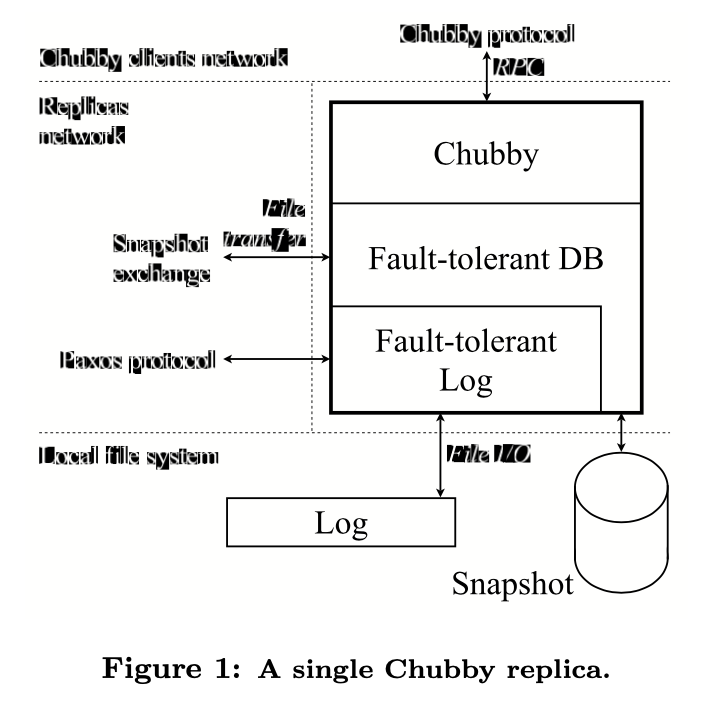
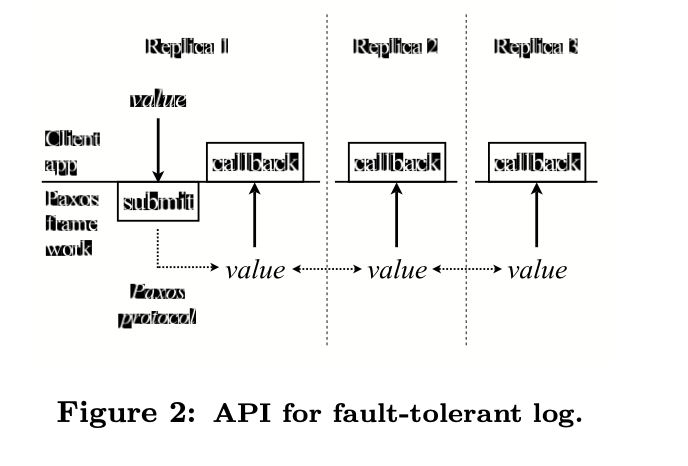
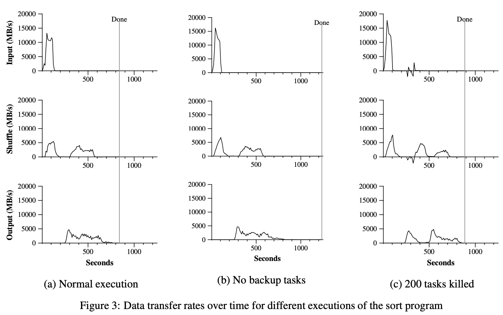

# Table of Contents

1.  [Algorithm](#org305f7b0)
2.  [Review](#org852dfe5)
    1.  [简介](#org50d195d)
    2.  [背景](#org5f6a4a8)
    3.  [架构简介](#org9e81bdc)
    4.  [Paxos](#orgb8c43fb)
        1.  [Paxos基础](#orgd9da20f)
        2.  [多Paxos](#org475018e)
    5.  [算法挑战](#org8dc61f9)
        1.  [处理磁盘损坏](#org6e88547)
        2.  [主节点租赁](#org14550a7)
        3.  [Epoch号](#orge1e0d7d)
        4.  [组成员](#org4dd18d7)
        5.  [快照](#orgf9e0978)
        6.  [数据库交易](#org019f902)
    6.  [软件工程](#org12c1e8e)
        1.  [有效地表达算法](#org1ebfdd1)
        2.  [运行时一致性检查](#orgea9f132)
        3.  [测试](#org104169f)
        4.  [并行](#org35d4c46)
    7.  [不可预料的故障](#org6e12850)
    8.  [测量](#orge7839cb)
    9.  [总结和开放问题](#org43134e6)
    10. [相关内容](#org9068bea)
3.  [Tips](#orgebb48d7)
4.  [Share](#orgdadceff)
    1.  [简介](#orgd592f9a)
    2.  [编程模型](#orgd0dea68)
        1.  [示例](#orgde1c637)
        2.  [类型](#org17df49f)
        3.  [更多示例](#orgbfde6f7)
    3.  [实现](#orgb2771f2)
        1.  [执行总览](#orgdc89bc2)
        2.  [主节点数据结构](#org6b7f192)
        3.  [容错](#orgd0c097a)
        4.  [本地化](#org7776864)
        5.  [任务粒度](#org9851263)
        6.  [备份任务](#org7fa5ca7)
    4.  [提炼](#org037d757)
        1.  [分区函数](#orge065ada)
        2.  [顺序保证](#org91b284c)
        3.  [组合函数](#orgd014b61)
        4.  [输入和输出类型](#org5d3ccfc)
        5.  [副产品](#orgf6232b1)
        6.  [跳过错误记录](#orgf97387b)
        7.  [本地执行](#orged66f77)
        8.  [状态信息](#orge9c6463)
        9.  [统计](#org1085fef)
    5.  [性能](#org98def4c)
        1.  [集群配置](#orgb09ea2f)
        2.  [查询](#orgf000c99)
        3.  [排序](#org92bd06f)
        4.  [备份任务的效率](#orgb36532d)
        5.  [机器故障](#org9456477)
    6.  [经验](#orgf92be5a)
        1.  [大规模索引](#orgab05a82)
    7.  [相关工作](#orgd4f01c7)
    8.  [结论](#org912a4cd)

# Algorithm

leetcode 321: <https://leetcode.com/problems/create-maximum-number/>

<https://medium.com/@dreamume/leetcode-321-create-maximum-number-45af2be1d47d?sk=ce3cc366807283e7f4db0b8f2ae78796>

# Review

Paxos Made Live

<https://ai.google/research/pubs/pub33002>

## 简介

我们知道容错可通过复制节点实现。通常的实现是使用一个共识算法确保所有复制节点一致。通过不断地应用该算法在输入数据序列中，则可以在复制节点上构建一个确定性的数据值日志。如果这些数据值是在一些数据结构中，复制节点上相同日志的应用程序可通过日志使该数据结构保持一致。例如，如果日志包含一系列数据库操作，如果这些操作应用到每个复制节点的本地数据库，最终所有节点的数据库内容一致。

这样可以实现各种原始的容错，数据库就是一个例子。最近二十年共识算法是一个研究热点。已有几种著名的共识算法有大量的设置并支持各种容错。Paxos算法已在理论和应用领域讨论了十多年。

我们使用Paxos算法作为框架的基础实现一个容错的日志。然后我们依赖该框架构建一个容错的数据库。尽管有这方面的文字描述，构建一个产品级的系统依然不是一个简单的任务。原因如下：

1.  Paxos算法用伪代码描述，我们的完整实现包含数千行c++代码。问题并不是简单因为我们使用C++实现而不是伪代码，也不是因为我们代码风格比较啰嗦。把算法转换为实现，产品级系统包含各种特性和优化，一些已发表还有一些并没有。
2.  容错算法通过一页的伪代码实现简短的证明。该证明没法扩展到系统的数千行代码，为证明一个真实系统的正确性，还得使用一些不同的方法
3.  容错算法容错了一些精心选择的有限错误集合。然而，现实中软件有各种各样的错误模型，包括算法的错误，实现中的bug，操作错误。我们不得不通过软件工程和设计可操作过程来稳健地处理各种错误模型
4.  真实系统需要非常精确。甚至指导说明可能在实现过程中改变，因此，实现需要是可控的。最后，由于错误地理解系统可能在指导说明描述的过程中出错。

本文讨论一些把Paxos引入实践的算法及工程方面的挑战性问题。这些练习更有研究意义而不是指导把伪代码转换为C++代码。

## 背景

Chubby是谷歌公司的容错系统提供分布式锁机制和存储小文件。典型情况下，每个数据中心有一个Chubby实例或cell。谷歌GFS和BigTable使用Chubby作为分布式协作和存储metadata。

Chubby通过复制节点实现容错。一个典型的Chubby cell包含5个复制节点，运行同一套代码，每个运行在一个专机上。每个Chubby对象（例如Chubby锁，或文件）作为数据库一个条目存储。在任一时刻，其中的一个节点会被作为主节点。

Chubby客户（例如GFS和Bigtable）联系一个Chubby cell来获得服务。主节点为所有Chubby请求提供服务。如果一个Chubby客户联系一个节点为非主节点，该非主节点将回复主节点的网络地址。如果主节点故障，一个新的主节点将自动选出，该主节点将以本地数据库的内容继续提供服务。这样，复制的数据库需确保Chubby状态在主节点故障的情况下的连续性。

第一版的Chubby基于一个商业的、三方的容错数据库；后面我们将以3DB指代该数据库。事实上，复制机制没有基于一个被证明的复制算法，我们并不知道它是否正确。基于产品问题的历史和Chubby的重要性，我们最终决定用我们自己基于Paxos算法的解决方案来取代3DB。

## 架构简介

上图显示了一个Chubby复制节点的架构。一个基于Paxos算法的容错复制日志在协议栈的最底部。每个复制节点维护日志的本地拷贝。Paxos算法不断地运行确保所有的复制节点在他们的本地日志中有确定顺序的条目。复制节点间通过Paxos特定协议通讯。

上一层是一个容错的数据库，每个复制节点有该数据库的本地拷贝。数据库包含一个本地快照和一个数据库操作的重放日志。新数据库操作提交到该复制日志中。当一个数据库操作在复制节点中出现，它将应用于复制节点的本地数据库拷贝中。

最后，Chubby使用该容错数据库存储它的状态。Chubby客户通过Chubby特定协议联系一个Chubby复制节点。

我们努力设计清晰的接口隔离Paxos框架，数据库和Chubby。我们部分通过系统发展的清晰化，及意图在其他应用程序中重用复制日志层。我们预测谷歌未来的系统将通过复制节点实现容错。我们相信容错日志是构建这样的系统的强大原始因素。

我们的容错日志api如上图所示。包含一个调用提交新值到日志。一旦一个提交值进入容错日志，我们的复制节点系统将调用一个回调给客户应用程序来传递该值。

我们的系统是多线程的，多个值可以在不同的线程并行提交。复制日志不创建自己的线程，但可以被任意数目的线程并行调用。

## Paxos

本节我们将给出基本Paxos算法的非形式化概述和说明如何执行多个Paxos。

### Paxos基础

Paxos是一个共识算法，被一系列进程执行，简称为复制节点。该节点可能崩溃并之后恢复。网络可能丢掉节点间的消息。节点从崩溃恢复时访问持久化存储。一些节点会提交值及达成共识。如果多数节点在没有崩溃的情况下运行足够长的时间并没有故障，所有的节点将保证都同意被提交的某一个值。

算法包含3个阶段，每个阶段可能因为故障而重复：

1.  选择一个节点作为协调者
2.  协调者选择一个值并广播给所有复制节点一个接收消息。其他复制节点要么回应该消息要么拒绝
3.  一旦多数节点回应协调者，共识即被达成，协调者广播一个提交消息通知复制节点

为说明算法如何工作，考虑只有一个协调者并且无故障的场景。一旦多数复制节点从协调者那收到接受消息并确认则共识达成。如果任意多数复制节点故障，我们将依然确保至少一个接受到共识值的复制节点依然存活着。

实际情况是协调者也可能故障。Paxos不需要同一时间只有一个复制节点作为协调者。多个复制节点可能决定变成协调者并在任意时间执行算法。典型情况下系统可能人为地限制了协调者改变速率，因这会导致延迟达成共识。

灵活选举策略意味着多个复制节点同时认为它们是协调者。这些协调者可能选择不同的值。Paxos确保共识在某个值上，需要引入以下两个机制：

1.  给成功的协调者分配一个排序
2.  限制对选择的值的每个协调者的选择

排序协调者允许每个复制节点区分当前的协调者和之前的协调者。这样，复制节点可能拒绝就协调者的消息，防止它们干扰达成的共识。Paxos通过给协调者一个递增的序号来排序。每个复制节点保存它看到的最近序号的记录。当一个复制节点想要变成一个协调者时，它生成一个唯一的序号，比它所看到的都高，并广播一个建议消息给所有复制节点。如果多数节点回复并表示没有看到更高的序号，则该复制节点将作为一个协调者。这些回复叫做承诺消息，复制节点承诺因此拒绝老的协调者消息。提议/承诺消息交换构成了上述所说的步骤1。

一旦共识在某值上达成，Paxos必须强制未来的协调者选择相同的值来继续。为保证如此，复制节点的承诺消息包含它所了解的最新的值，及了解该值的协调者序号。新的协调者选择最近协调者的值。如果没有一个承诺消息包含值，协调者将自由选择一个提交值。

以上工作的推理证明很简单，新的协调者多数节点提议消息的响应。因此，如果之前的协调者已达成共识，新的协调者被确保能从至少一个复制节点了解到该值。该值有所有收到的响应的最高序号，这样新的协调者就能够选择该值。

### 多Paxos

Paxos的实现系统像积木一样达成一系列共识，例如利用重复日志。最简单的方法实现是重复执行Paxos算法。我们标示每个执行为一个Paxos实例。提交值表示执行一个Paxos实例来提交该值。

在多Paxos中，一些慢的复制节点可能没有参与最近的Paxos实例。我们使用一个追赶机制使慢的节点追赶上其他节点。

每个复制节点维护一个本地持久化日志来记录所有Paxos行为。当一个节点崩溃并之后恢复，它将重放持久化日志来恢复状态。节点也使用日志帮助慢的节点追赶。Paxos算法请求所有的消息发送者在发送之前记录它们的状态，这样算法请求五个写操作（提议、承诺、接受、确认和提交消息）到磁盘。在系统进一步处理之前所有的写必须立即刷新到磁盘。如果复制节点紧临网络，则磁盘刷新时间将是延迟的关键。

有一个著名的优化是通过把多个Paxos实例串起来来减少消息数量。提议消息可能被忽略，如果协调者在实例中没有改变的话。这不会影响Paxos的属性，因任意复制节点在任意时刻都可以尝试变成协调者，通过广播一个更高序号的提议消息。为了利用该优化，多Paxos算法可设计为固定一个协调者一段时间。我们把该协调者作为master，通过这个优化，Paxos算法对每个Paxos实例在每个复制节点只请求一次写磁盘操作，并行执行多个实例。master在发送它的接受消息后立即写磁盘，其他复制节点在发送它的了解消息前写磁盘。

为在并行系统中获得更高的吞吐量，可以批量提交不同应用程序的值给一个Paxos实例。

## 算法挑战

Paxos核心算法已是精确描述的，基于此实现容错日志还是需要大量努力地。一些复制性源于现实世界中的不完美（例如硬盘故障，有限的资源），一些源于增加的需求（例如，主节点租赁）。许多这样的挑战的算法解决方案跟Paxos核心算法紧密相关。以下我们将描述一些我们引入的机制。

### 处理磁盘损坏

复制节点时常遭遇磁盘损坏。由于媒体故障或操作错误导致磁盘损坏（操作可能是误擦除了关键数据）。当复制节点磁盘损坏，复制节点将丢失它持久化的状态，导致之前对其他节点的承诺会有违背的情况。这是一个Paxos中关键的假设。我们使用如下机制处理这个问题。

磁盘损坏有两个明显的判断方法。要么文件内容被改变要么文件不能访问。为检测前者，我们在文件中存储文件的checksum。后者可以用新复制节点打标签和空盘来区分 - 我们通过用一个新节点在GFS中做一个标签来做检测。如果该节点以空盘再次重启，它将发现GFS的标签显示它是一个损坏的磁盘。

一个带损坏磁盘的复制节点按如下步骤重建它的状态。作为非投票成员参与Paxos，即使用追赶机制追赶但不响应承诺或确认消息。在它开始重建状态之后会一直停留在该状态，直到观察到一个完整的Paxos实例。在这期间，我们确保这个复制节点不会违背之前的承诺。

这个机制启动如下优化改进系统延迟。由于系统可以处理偶然出现的磁盘损坏，在一些条件下，它可接受不立即刷新写入磁盘。我们考虑一些方案利用这个观察，但我们还没有实现。

### 主节点租赁

当基本Paxos算法用来实现复制节点数据结构，读取数据结构需要执行一个Paxos实例。通过读取和更新串行化，确保读取到当前的状态。读取操作只能作用于主节点拷贝的数据结构，因为其他节点可能选举了其他主节点并修改数据结构而没有通知旧的主节点。这种情况下会导致主节点的读操作读取的是脏数据。因读取操作经常由所有操作的大部分组成，Paxos串行读取成本很高。

变通办法是实现主节点租赁规则：当主节点租赁时，保证其他节点不能成功地通过Paxos提交值。这样租赁的主节点本地数据结构中保持着最新的信息可以用来服务本地的读操作。使主节点在租赁到期之前续租可让主节点一直租赁。在我们的系统中，主节点维持一次租赁几天。

在我们的实现中，所有节点允许租赁之前Paxos实例的主节点，拒绝处理在此期间收到的其他节点的Paxos消息。主节点维持一个比其他节点要短一点的租赁超时，保护系统避免时钟放缓问题。主节点定期提交一个心跳值给Paxos来刷新它的租赁。

多Paxos优化展示了如下稳定性问题，在网络不间断地被耗尽的情况下。当一个主节点临时掉线，Paxos会选举一个新主节点。新主节点会在Paxos实例中维持一个固定顺序号。同时，当掉线的旧主节点试图运行Paxos算法，如果它连接另一个节点，它可能增加它的序号，当它重连接时，它可能有一个比新主节点更高的序号，并可能替代新主节点。然后，它又掉线，然而继续重复以上步骤。

该行为导致Chubby主节点改变对一些用户会有一些影响。在弱连接环境下，该行为将降低主节点切换速度。在我们的实现中，主节点定期通过跑完整的Paxos算法流程来大幅增加序号，包括发送提议消息。定期的增加序号避免了多数情况下的主节点切换抖动问题。

注意扩展租赁概念到所有节点也是可能的。这将允许任意租赁节点从它本地的数据结构服务读请求。这种扩展租赁机制在读远多于写的场景下非常有用。我们有节点租赁检测算法，但还没有实现。

### Epoch号

Chubby客户端的请求提交到Chubby将直接交给当前的Chubby主节点。从主节点收到请求到数据库更新，这期间节点可能失去它的主节点状态。甚至它失去了主节点状态后又重新获得。Chubby要求请求失效如果节点资格丢失或处理请求时重新获得。我们需要一个机制可靠地检测主节点切换并需要时取消操作。

为解决这个问题我们引入了一个全局的epoch号。主节点收到一个epoch号的两个请求其请求值相同当且仅当在收到请求期间该节点为主节点。epoch号存储在数据库条目中，所有的数据库操作以epoch号的值作为条件。

### 组成员

实际经验搭建的系统必须有能力处理节点集的变更。即组成员管理问题。一些Paxos论文指出Paxos算法能用来实现组成员。核心Paxos算法实现组成员是很直接的，具体细节需要引入多Paxos、磁盘损坏等。不幸地是这里没有包含Paxos相关组成员变更的正确性证明。

### 快照

重复的共识算法应用程序创建重复的日志将导致日志的暴涨。这将导致两个问题：它需要巨量的磁盘空间，甚至，它将导致超长的恢复时间因为节点不得不重放超长的日志来追赶其他节点。因为日志是应用于一些数据结构的一系列操作，代表数据结构的一种持久化形式，问题是如何找到该数据结构的另一种替代的表达形式。一个明显的机制是持久化，或快照。例如，如果数据结构在内存，我们用快照序列化放入磁盘。如果数据结构在磁盘，则快照只是拷贝它。

paxos框架并不知道什么数据结构，它只关心日志的一致性。快照是使用Paxos框架并了解相关数据结构的特殊程序，我们的框架提供了一种机制允许客户程序比如我们的容错数据库通知框架已生成了快照。客户程序可以在任意时间点生成快照。当Paxos框架通知生成了快照，它将截断并删除快照之前的日志。当节点故障，在恢复时它将安装最新的快照并重放截断日志来重建它的状态。快照在节点间不同步，每个节点独立地决定什么时候生成快照。

本机制很直观，但它给系统引入了复杂度：节点的持久化状态由日志和快照组成，需要用它们维持一致性。日志由框架控制，快照格式则由应用程序决定。快照机器：

1.  快照和日志需要手动保证一致性。每个快照需要有关它的内容及相关容错日志的信息。在我们的框架中我们引入快照处理的概念。快照处理包含所有Paxos特定的跟快照相关的信息。当应用程序创建一个快照，对应的框架提供的快照处理也需要应用程序存储起来。当恢复一个快照时，应用程序需要把对应的快照处理提供给框架，框架将利用快照处理提供的信息来协调快照和日志。注意快照处理也是快照的Paxos状态本身。在我们的系统中，它包含Paxos实例号对应快照、日志和组成员。
2.  创建快照需要花费时间，在一些情况下我们可能没法承担在此期间冻结节点日志的结果。在我们的框架中，快照被分成3个阶段。首先，当客户端决定创建快照时，它先请求快照处理，接着，客户端应用程序开始创建快照。这将阻塞系统，通常是占用一个线程进行快照而节点继续参与Paxos。当快照处理获得后快照必须回应客户端状态它的日志位置。如果快照期间节点继续参与Paxos，则一些特殊处理来保证快照期间客户端数据结构持续更新不会有问题。最后，当快照完成，客户端应用程序通知框架，框架获得快照及对应的快照处理，则会适时截断日志。
3.  快照可能失败。我们的框架只会在快照成功并获得快照处理后截断日志。这样，如果客户端应用程序未通知框架，则从框架的视角来看则认为没有创建快照。这将允许应用程序检查快照并可能的情况下放弃快照。如果快照有问题，客户端不会要求框架截断日志。客户端应用程序甚至可能尝试同时发起几个快照。
4.  当在追赶阶段，节点尝试获得遗失的日志记录。如果它不能获得（其他节点没有有效的旧日志记录），节点将被告知从其他节点获取快照。快照处理包含Paxos实例直到快照抓取状态之间的信息。一旦收到快照并安装，大多数情况下该节点将靠近领导节点。为了完成追赶，该节点请求并接收领导节点剩下的日志记录来使其完全跟上并同步。注意，在落后节点安装旧的快照期间（在容错系统中，这种情况无法避免），领导节点可能正在快照。这种情况下，落后节点可能没法获得未完成的日志记录因为快照提供者（及其他节点）同时也在处理一些事情中。落后节点需要获得更多最新的快照。进一步地说，领导节点在发送快照后可能故障。追赶机制必须能够从这种情况下恢复，落后节点需要联系其他领导节点。
5.  我们需要一个机制定位最近的快照。当其他节点要求落后节点在GFS中查找快照时一些应用程序可能选择直接在领导节点和落后节点间传输快照。我们实现一个通用机制允许应用程序在领导节点和落后节点间传递快照位置信息。

### 数据库交易

Chubby导入的数据库需求很简单：数据库需要存储键值对（键和值为任意字符串），支持常见操作如插入、删除、查找，原子操作（cas）和迭代访问所有条目。我们使用快照全数据库的方式实现日志结构的设计，数据库操作的日志应用到快照。操作日志就是Paxos日志。实现将定期生成数据库状态的快照及截断日志。

cas操作需要原子化。可以通过提交给Paxos所有cas相关的数据为一个值实现。我们意识到我们可以扩展该机制来提供事务风格的支持但并不需要实现真正的数据库事务。我们将详细描述我们的解决方案因为我们相信这会对其他方面也有帮助。

我们的实现利用了一个强大的操作，我们称之为MultiOp。除了迭代操作所有其他数据库操作都实现一个单一的调用到MultiOp。MultiOp为原子化的，包含3个组件：

1.  测试列表称为守卫。守卫的每个测试检查数据库一个条目。它可能检查值的缺失或内容，或跟一个给定值比较。守卫中两个不同的测试可能应用到数据库相同或不同的条目中。守卫中所有的测试被应用，MultiOp返回该结果。如果所有测试通过，MultiOp执行t_op，否则执行f_op
2.  数据库操作列表称为t_op。列表中每个操作为插入、删除或查找，并应用到单个数据库条目中。两个不同的操作可能应用到数据库里相同或不同的条目中。只有守卫推断为真这些操作才能执行
3.  f_op也是数据库操作列表。跟t_op相似，但只有守卫推断不成立时才会执行

在我们后续的发展中（在我们实现数据库和MultiOp之后），我们意识到我们还需要epoch号来实现数据库操作。所有Chubby操作携带一个epoch号，如果Paxos epoch号改变将请求失败。之后我们将Paxos epoch号作为数据库一个条目，我们能够修改所有之前的数据库调用，并通过额外的守卫程序检查epoch号。

## 软件工程

容错系统希望能长期持续运行。相比其他系统用户更厌恶容错系统中的bug。例如，一个文档编辑器显示的布局bug可能惹怒用户，但这经常是临时处理问题的手段，甚至该bug是软件假设就是会出现的。类似bug在容错系统中可能导致系统不可用。

我们采用一些软件工程方法使我们的实现更稳定。我们将描述一些这样的方法。

### 有效地表达算法

容错算法是出名的难以准确描述，即使用伪代码。当算法代码跟其他构建完整系统的代码混合在一起时更难描述，更难找到核心算法，当bug出现时推理或调试更难。同样改变核心算法来对应需求变更也是很困难。

我们的办法是通过代码展示核心算法把它看作为两个状态机。为此，我们设计一个简单的状态机指导语言并构建一个编译器来转化这些指令为C++代码。我们用简短的语言描述设计，这样整个算法能够呈现在屏幕上。状态机编译器自动产生代码来记录状态转变和度量代码覆盖率来帮助调试和测试。

我们相信选择一种特定说明语言使它更容易推理并修改我们的状态机而不是直接给出跟其他系统部分混在一起的代码实现。这里阐述了如下经验。在我们开发容错日志的最后，我们在组成员算法中做了一个基本的改变。在这个改变之前，节点需要走过3个状态。最开始它等待加入组，然后它加入了组，最后离开组。一旦一个节点离开组，它不允许重新加入。我们觉得这种处理很好因为不间断故障的节点会因不能加入组而不被它长期干扰。不间断故障比普通的参与更常见，因为正常的节点不时会出现不间断故障。这样，我们需要改变算法事其只有两个状态。要么该节点在组里要么在组外。一个节点在系统生命周期内可能会经常在这两个状态间切换。这花费了我们一个小时完成修改并花了3天修改对应的测试代码。因我们的状态机跟系统其他代码混杂在一块，这种修改比想象的要困难一些。

### 运行时一致性检查

在一个项目中当代码增长，多人修改相同的代码时，不一致性可能性也会增加。我们使用各种自查机制例如使用assert，直接检查代码测试数据结构。

举例来说，我们使用如下的数据库一致性检查。主节点定期提交一个checksum请求到数据库日志。一旦收到该请求，每个节点计算本地数据库的checksum。因为Paxos日志串行化所有操作，我们希望所有节点计算的checksum一致。在主节点完成checksum计算后，它发送它的checksum给所有节点，节点比较主节点的checksum和自己的checksum。

我们出现过3个数据库不一致事件：

1.  由于操作错误
2.  我们还没有找到第2个事件的解释。在重放故障节点日志时我们发现它跟其他节点是一致的。这可能是随机硬件内存故障导致。
3.  我们怀疑第3个事件由于有问题的代码导致的非法内存访问。为防止未来再次发生，我们维护一个辅助数据库的checksum和对于数据库访问进行双检查数据库checksum

在所有这3种例子中，在它们在Chubby中显现之前都需要手动干涉来解决问题。

### 测试

根据现在的技术水平，去证明一个真实系统比如我们的是正确的是不现实的。为达到稳定性，最好的实际解决方案是用软件工程方法小心地测试整个系统。我们的系统被设计为从开始就是可测试的，现在包含一个扩展的测试套件。本节我们描述两种测试让系统系统遭遇持续地随机故障并检查它的行为符合预期。两种测试都能运行在如下模式：

1.  安全模式。在这种模式中，测试检查系统是否一致。然而，系统不要求能取得进展。例如，操作因故障不能完成或报告系统失效都是可接受的。
2.  活跃模式。在这种模式中，测试检查系统一致并能够进展。所有操作预期能完成且系统要求一致。

我们的测试以安全模式开始并向系统注入随机故障。在运行到预定义的时间后，我们停止注入故障并给系统时间来完全恢复。然后我们切换测试到活跃模式。活跃模式测试的目的是检查系统在一系列故障后是否死锁。

我们测试的一项是检查容错日志。它模拟分布式系统包含随机个数的节点并获取容错日志，其中会出现网络耗尽、消息延迟、超时、进程崩溃和恢复，文件损坏，调度交错等。我们想要测试能复现来帮助调试。最后，我们使用一个随机数生成器决定调度故障。该随机数生成器的种子在测试运行前给出。我们确保两次测试运行如果随机数种子相同则运行在单线程的测试结果一致，去掉有未确定性的多线程干扰。这样做是可行的因为容错日志不会创建自己的线程并能运行在单线程环境（即使它能正常运行在多线程环境）。

每次测试执行结果为成功或失败。如果测试失败，我们用失败时的随机数种子重新运行测试并在调试器中打开详细日志开关来查找问题。因为可复现所以是可行的。

测试证明是有用的，能找到各种微妙的协议错误，包括组成员实现和我们修改的处理损坏磁盘代码的错误。为了考量测试的能力，我们遗留了一些从代码和系统设计审查中发现的协议bug，检查我们的测试系统检测这些bug。在一些bug修复后，测试变得非常稳定。为了改进bug收益，我们开始在数百台Google机器上运行这些测试。我们发现一些额外的bug，一些需要花费数周模拟执行时间来找到（在高故障率的情况下）。

另一种测试检测新Chubby系统在低端系统和硬件故障情况下的稳定性。我们在容错日志中实现一些hook来注射故障。测试随机调用这些hook并检查高层系统能成功处理。我们的hook能用来使节点崩溃，和其他节点断联一段时间或强制节点假装它不再是主节点。这些测试在头两周在Chubby中发现了5个微妙的跟主节点有关的bug。同样，我们构建了一个带hook的文件系统，注入一些故障并测试我们处理文件系统故障的能力。

最后，我们指出一个挑战，我们测试我们的系统但我们没有系统的解决方案。容错系统容易掩盖问题。系统会掩盖bug或配置问题，这些问题会危害到容错性。例如，我们观察到如下场景。我们曾经启动了5个节点的系统，但在初始化组时拼错了一个节点的名字。系统开始运行正常因为有4个正确的配置节点能保证进展。之后，第5个节点不断地运行追赶模式并因此保持正常。然而在这种配置下系统只能容错一个故障节点。我们现在已经处理检查这种特殊类型的问题。我们无法知道是否还有其他bug或错误配置掩盖了容错问题。

### 并行

在项目的开始时我们就在考虑并行容错代码的测试问题。特别是，我们想要我们的测试能重现。想早期描述那样，我们的容错日志不包含任何它自己的线程（它能处理不同线程的并行请求）。在一些代码处理的边缘我们引入了线程 - 当我们从网络层收到调用时。通过使我们的测试可重现，我们能够捕获一些难以察觉的协议错误。

项目进展过程中，我们使几个子系统更加并行，但牺牲了可重现性。Chubby核心是多线程的，我们无法用完整的系统运行可重现测试。我们把我们的数据库多线程，这样它能生产快照，计算checksum和处理迭代器同时并行地服务数据库请求。最后，我们强制使代码能处理多线程日志的本地拷贝（真正的原因超过了本文讨论的范围）。

总结，我们相信我们设置了正确的目标，即限制并行来重现执行。不幸的是，产品需要成长我们不可能坚持住这些目标。

## 不可预料的故障

我们的系统在产品线上的日志已有100机时年，在这期间，我们见证了如下未预料的故障场景：

-   我们第一版发布的Chubby系统比原始Chubby系统多10倍的工作线程。我们希望这样能使我们处理更多的请求。不幸地是，这些工作线程导致其他关键线程处于饥饿状态，导致我们的系统频繁超时。主节点快速故障，引起大量的客户端迁移到新的主节点，这样新的主节点过载，又引起新的主节点故障。当这个问题首次出现时，尚未查明原因，我们不得不在我们的系统中做些保护措施。我们做了一个错误决定，在我们的一个数据中心中回滚我们的系统到旧版的Chubby（基于3DB）。回滚机制没有很好的文档（我们从未想过会用到它），该机制的使用是非直观的，我们没有使用它进行回滚的经验，当回滚执行时，开发团队成员也不在。结果，一个旧的快照被误使用，在我们发现错误的时候，我们失去了15个小时的数据，一些关键的数据集不得不重建。
-   几个月后当我们尝试升级Chubby，我们的升级脚本失败因为我们错误的删除了过去失败的升级中生成的文件。在我们发现问题前，该服务器已使用一个月之前的快照运行了数分钟。这导致我们丢失了30分钟的数据。幸运地是所有的Chubby客户端都已恢复。
-   几个月后我们开始发布，我们意识到我们的数据库提供的语义跟Chubby期望的不同。如果Chubby提交一个操作给数据库，并且数据库丢失了它的主节点状态，Chubby期望操作失败。在我们的系统中，当数据库操作且操作成功期间，一个节点能被重新安装为主节点。该修复需要在Chubby和我们的框架之间有一个集成层的子网络（我们需要实现epoch号）。MultiOp能帮助解决这种问题。
-   如之前提到的一样，有3次我们发现有一个数据库节点跟Chubby的其他节点不同。我们发现该问题是因为我们的系统定期的生成所有节点的checksum并进行比较。
-   复杂迁移服务器从3DB版本到Paxos版本的Chubby升级脚本因各种原因故障了好几次。例如，它曾经因为一个基本的Google程序未安装在其中一个服务器而导致失败。
-   我们遭遇了一些故障是由于底层的操作系统。例如我们的Linux kernel 2.4版本，当我们尝试刷新小文件到磁盘，如果有大量缓存在写其他文件，该系统调用可能被长时间悬挂。这种事件很快出现在当我们写数据库快照到磁盘的时候。我们观察到该系统调用可能导致花费数秒来让内核刷新不相关的小写入到Paxos日志。我们的临时办法是以小块为单位写所有的大文件，每次写小块会刷新到磁盘。然而这将影响写的性能，他防止更多的重要日志写入时有未知的延迟。

100机时年小量故障对大多数产品系统来说可以认为是优秀的。然而，我们考虑对Chubby来说当前的故障率太高，我们决定还需要降低该故障率。

3个故障发生在升级或回滚时。每次我们在升级中遭遇问题，我们会更新我们的升级脚本。一旦一个单元升级完成，该类型故障消失。

2个故障源于已修复的bug，为减少其他bug的可能性，我们更早地继续改进并运行Chubby检查测试。

2个意外问题跟操作错误有关，当我们首次推出新版并导致我们丢失数据。在Google，每天通过系统操作来监控和管理系统。这些脚本非常高效，它们通常不是构建系统的开发团队开发，因此并不熟悉它的一些细节。这可能导致一些偶尔的操作错误。我们现在依赖非常小心地写和完美测试过的脚本来自动发布和最小化操作。结果我们最新的Chubby主版本无故障的发布到数百台机器上。

一个故障跟内存损坏有关。因为我们的系统基于日志结构并维护几天的日志数据和快照，它能够重放数据库到问题出现的具体点。我们能够检查我们的日志是正确的，即检查出错软件或硬件问题引起的内存损坏。我们添加了额外的checksum数据来检测这类问题，当它检测到这类问题时会使节点崩溃。

## 测量

我们的系统最初的目标是用我们的系统替代3DB。这样我们的系统需要展示它的性能相同或超过3DB。我们使用容错可重复的数据库测量了一个完整Chubby系统的性能（客户、服务器、网络延迟）。我们同样比较了一个基于3DB的系统。在我们的测试中，我们运行两个Chubby在5台服务器上（典型的Pentium机）。一份Chubby使用我们的数据库另一份使用3DB。我们在工作站上运行Chubby客户端产生服务器负载。在我们的测试中，我们测量总的系统吞吐量。每次调用包括Chubby客户端，网络，Chubby服务器和我们的容错数据库。当测试评估我们数据库性能时，它给出了基于Paxos的全系统吞吐量。

即使在实际系统中，Chubby的读请求占大多数，我们设计我们的测试包含大量地写。这是因为读请求是完全在主节点处理，这样没法测Paxos算法。

在我们的测试中，每个工作机在Chubby中重复创建一个文件并在再次创建文件前等待Chubby返回。这样每次操作只会是一次写入数据库。如果文件内容很少并只有一个工作机，测试测量系统的延迟。如果文件内容很多，测试测量系统的吞吐量（MB/s）。多个并行的工作机，我们也能测量系统吞吐量（子任务/s）。

多个工作机的所有测试显示了批量一系列提交值的效果。用3DB捆绑一系列数据库交易的更新可能获得一些加速。最后两项吞吐量测试显示了快照的效率。系统被配置当重复日志大小超过100MB时会执行快照。在这两项测试中，系统每100秒快照一次。当快照时，系统使用另一个数据库拷贝并写入磁盘。结果，它的性能会临时下降。

我们的系统只为性能优化，我们相信有很大空间使它更快。然而，目前性能已超过3DB，进一步地优化不在目前的优先级中。

## 总结和开放问题

我们已经描述了我们的容错数据库的实现，基于Paxos共识算法。尽管有大量描述，算法已有15年历史，我们团队的经验（其中一个同事之前设计了一个相似的系统，其他人构建过其他类型的复杂系统），明显比原始构建过这种系统的团队要困难一些。我们标识一些弱点如下：

1.  Paxos算法和实际系统需求上存在一些鸿沟。为了构建一个真实系统，专家需要使用各种想法分解描述并扩展一些相关的协议。累积地效果是巨大的，最终的系统将基于未验证的协议
2.  容错计算社区还为开发出工具使其实现它们的算法更容易
3.  容错计算社区对测试关注度不够，这是构建容错系统的关键因素

结果，核心算法工作仍然相对偏理论，还不能提供给更大型的计算社区。我们相信为了有更大的影响，研究者们将继续聚焦于这些痛点。

相反，考虑编译器构造领域，虽然该领域概念复杂，它们已开放给广大的群众。工业级的分析工具如yacc在分析理论尚未完全理解即已出现。这里不仅有很多前端工具如ANTLR或CoCo/R，也有重写树工具帮助优化和指令选择，汇编帮助二进制代码生成等等。这样，在该领域的软件工程中，一整套家族式工具已出现，使编译器的构造更加容易或不易出错。编译器构建的原理，比如解析，曾经是研究的边缘地带，现在认为是解决该问题的关键并普遍在众多学校毕业级课程中教授。

现在容错分布式计算社区还未开发出工具并像编译器社区那样解决理论和实际之间的鸿沟。我们的经验建议这些鸿沟是重要的，理应得到研究社区的关注。

## 相关内容

Google的许多人在这个项目中给了我们很多帮助。实现了Chubby的Mike Burrow建议我们用Paxos算法替换3DB。他和Sharon Perl审查了我们的设计并提供了优秀的反馈。它们指导我们实现处理磁盘损坏的机制并建议我们实现主节点租赁。Michal Cierniak移植原始的状态机编译器从Perl到C++并做了大量的修改（它现在被用在Google的各个地方）。Vadim Furman帮助我们写了Chubby检查测试。Salim Virji和他的团队负责从Google数据中心发布我们的系统。

Mike Burrows，Bill Coughran, Gregory Eitzman, Peter Mckenzie, Sharon Perl, Rob Pike, David Presotto, Sean Quinlan, 和Salim Virji审查了早期的论文和提供了有价值的反馈。

# Tips

-   看不懂文章的话就翻译它
-   费曼学习法很有效，看懂、理解比看更重要，要cover住所看过的内容，否则等于没看

# Share

MapReduce: Simplified Data Processing on Large Clusters

## 简介

最近五年，作者和许多其他谷歌同事实现了很多各种特殊目的的大数据计算。例如爬文档，网页请求日志等。为计算各种各样的数据，例如反转索引、网页文档图结构的呈现，按主机爬到的网页数据的总结，某日最频繁查询请求的集合。大多数这样的计算是非常概念性的。然而，输入数据通常非常庞大且计算不得不分布于成千上百的机器中来实现在可接受的时间内完成。如何并行计算，分布数据及处理错误激发人们去从原始的简单计算的复杂代码中处理这些问题。

为应对这种复杂性，我们设计一种新的抽象允许我们表达该简单计算，隐藏并行处理地细节、容错、数据分布和负载平衡。我们的抽象激发于Lisp语音中对map和reduce的原始呈现。我们意识到大多数计算应用map操作于每个输入的逻辑记录以用来计算一系列临时的键值对，然后用reduce操作相同键的所有值，用来合并数据。我们使用用户特定的map和reduce操作的函数模型，允许我们方便地并行大量地计算，并用重新执行的方式作为容错的主要手段。

本工作的主要贡献是提供一个简单强大的接口来支持自动并行的分布式的巨量可扩展计算，达到大集群PC的高性能。

## 编程模型

该计算输入为一系列键值对，MapReduce库的用户表达计算为两种函数：Map和Reduce。

Map把输入对产生一系列中间的键值对。MapReduce库对所有中间值根据键进行分组然后传递给Reduce函数。

Reduce函数合并这些值为一系列更小的值集。典型的是每个Reduce调用返回0或1个输出值。中间值通过迭代器传递给Reduce函数。这样允许我们处理远超过内存大小的数据值。

### 示例

考虑统计单词出现次数的问题。用户可能写下如下伪代码：

    map(String key, String value):
      // key: document name
      // value: document contents
      for each word w in value:
        EmitIntermediate(w, "1");
    
    reduce(String key, Iterator values):
      // key: a word
      // values: a list of counts
      int result = 0;
      for each v in values:
        result += ParseInt(v);
      Emit(AsString(result));

用户编写代码填充在mapreduce特殊对象为输入输出文件名，和一个可选的调整参数。

### 类型

之前的伪代码以字符串作为输入输出，用户提供的map和reduce函数有如下相关类型：

map    (k1, v1)       -> list(k2, v2)

reduce (k2, list(v2)) -> list(v2)

输入键值和输出键值为不同的域，中间键值和输出键值域相同。

我们的C++实现从用户定义的函数传递字符串，并让用户代码来转换字符串到相关类型。

### 更多示例

一些简单有趣的示例表达为MapReduce计算：

分布式Grep: map函数对匹配范型的行进行触发。reduce函数拷贝数据到输出。

计数URL访问频率：map函数处理web页面的请求日志，输出<URL, 1>。reduce函数统计相同URL的值，触发<URL, total count>元组。

反转Web链接图：map函数输出<target, source>元组，reduce函数拼接列表生成<target, list(source)>

主机的元素向量：元素向量统计文件中最重要的单词<word, frequency>。map函数对每个输入文档生成一个<hostname, term vector>元组，reduce函数统计主机的元素向量，去掉不频繁使用的元素，并触发生成<hostname, term vector>元组。

反转索引：map函数解析每个文档，触发一系列<word, document ID>元组，reduce函数排序并生成<word, list(document ID)>元组数据。

分布式排序：map函数从每个记录里解析出key，触发<key, record>元组，reduce函数不修改直接触发数据。

## 实现

有许多MapReduce接口的不同实现。适合的选择依赖于环境。例如，一种实现可能适合于小共享内存的机器，另一种适合大型NUMA多处理器，另一种适合巨量的网络机群。

本节描述一种在Google计算环境中大量使用的实现：巨量商业PC机的集群，彼此通过交换以太网连接。在我们的环境中：

1.  机器为典型的x86双处理器，运行Linux，每台机器2-4G的内存
2.  使用商业网络硬件，典型的100MB/s或1GB/s
3.  每个集群包含数百或数千机器，因此机器故障比较常见
4.  每个机器的存储为便宜的IDE磁盘。使用了一个公司内部的分布式文件系统管理这些磁盘的数据存储。文件系统在不可靠的硬件基础上使用复制节点来提供有效性和可靠性。
5.  用户提交任务给调度系统。每个任务包含一系列的具体任务，调度器把它们映射到集群里一系列有效的机器上。

### 执行总览

Map调用通过自动分区输入数据到一系列M分隔后分发到多个机器中。输入分隔能在不同的机器中并行处理。reduce调用用分区函数（例如hash(key) mode R）通过分区中间的key空间到R块。分区数和分区函数由用户提供。

当用户程序调用MapReduce函数，接下来的系列操作如下：

1.  用户程序的MapReduce库首先分隔输入文件为M块，典型的每块大小为16MB到64MB（用户通过参数控制）。然后在集群机器中启动多份程序的拷贝。
2.  其中有一份拷贝比较特殊&#x2013;主节点。其他为工作节点，主节点为其分配工作。对于M个map任务和R个reduce任务，主节点选择空闲工作节点并分配其一个map任务或reduce任务。
3.  分配到map任务的工作节点读取对应的输入分隔内容。分析key/value对并传递给用户定义的Map函数。产生的中间key/value对数据缓存到内存。
4.  定期地，缓存的键值对会写入本地磁盘，分区函数会把它们分区为R个区域。这些缓存在本地磁盘的位置信息将传递给主节点，主节点负责转发这些位置给reduce工作机器。
5.  当reduce工作节点收到主节点这些位置信息，它使用远程过程调用读取这些数据。但完成读取后，它按中间键排序，这样相同的键数据被聚合。排序是必要的因为非常多的键将映射到相同的reduce任务中。如果中间数据过大，需要使用外部排序。
6.  reduce工作节点迭代统计排好序的中间数据，它传递键及对应的中间值给用户的Reduce函数。Reduce函数的输出添加到该reduce分区的最终输出文件中。
7.  当所有的map任务和reduce任务完成时，主节点唤醒用户程序。这时，用户程序的MapReduce调用返回到用户代码

在成功完成后，mapreduce的执行输出到R个输出文件中（每个对应一个reduce任务，用户指定其文件名）。典型地，用户不需要合并这些文件为一个文件 &#x2013; 它们经常传递这些文件作为另一个MapReduce调用的输入，或另一个应用程序使用它们。

### 主节点数据结构

主节点维持一些数据结构。对每个map和reduce任务，它将存储状态（空闲、进度中或完成），并确定工作机（对未空闲的任务）。

主节点负责从map任务传递中间文件范围位置信息到reduce任务。因此，对每个完成的map任务，主节点存储map任务生成的R中间文件范围位置和大小。map任务完成时收到更新位置和大小信息。信息递增地推送到正在执行reduce任务的工作机。

### 容错

MapReduce库设计为使用数百或数千的机器处理巨量数据，因此需要很好的处理机器故障。

1.  工作机故障

    主节点定期ping每个工作节点。如果一定时间内没有收到工作节点的响应，主节点则标志该工作节点故障。工作节点完成的任何map任务将重置为初始的空闲状态，这样它们可以调度到其他工作节点。同样地，在故障工作节点正在进行中的任意map任务或reduce任务也将重置为空闲状态以方便调度。
    
    完成的map任务将在故障节点重新执行，因为它们的输出存储在故障节点的本地磁盘中无法访问。完成的reduce任务不需要重新执行因为它们的输出存储在GFS。
    
    当一个map任务先在工作节点A中执行，然后在工作节点B执行（因为A故障），所有执行reduce任务的工作节点将被通知该重执行事件。任意reduce任务如还没有从工作节点A读取数据将从工作节点B中读取。
    
    MapReduce能从大量工作节点故障中恢复。例如，在一个MapReduce操作期间，运行集群的网络维护导致80台工作机无法工作数分钟。MapReduce主节点将重新执行这些工作节点的工作，使进展不会中断，最终完成MapReduce操作。

2.  主节点故障

    主节点写定期的主数据结构检查点是很简单的。如果主任务死亡，一份新的拷贝将从最新的检查点状态上开始。然而，只有一个单主节点，故障的可能性不大。当主节点故障，我们当前的MapReduce计算将中止。客户端可以检查并重试MapReduce操作。

3.  故障呈现的语义

    当用户提供的map和reduce操作为它们的输入值确定性函数，我们的分布式实现产生相同的输出就像一个程序顺序执行的输出一样。
    
    我们依赖map和reduce任务的原子提交来输出达到该特性。每个进展的任务把它们的输出写入私有临时文件。一个reduce任务产生一个这样的文件，一个map任务产生R个这样的文件（每个reduce任务一个）。当map任务完成，工作机发送一个消息给主节点并在消息中带着R个临时文件名字信息。如果主节点收到一个已完成的map任务的完成消息，它将忽略该消息。否则，记录R个文件的名字到主节点数据结构中。
    
    当reduce任务完成，reduce工作机自动重命名它的临时输出文件到最终的输出文件。如果相同的reduce任务在多台机器上执行，多次重命名将执行到相同的最终输出文件。我们依赖原子重命名操作提供基于文件系统的保护来保证数据正确性。
    
    绝大多数map和reduce操作是确定性的，我们的语义相当于顺序执行，程序员很容易推断程序的行为。当map或reduce操作为非确定性时，我们提供更弱但依然能推理的语义。在非确定性操作中，一个特殊reduce任务R_1的输出跟产生该R_1输出的非确定性程序顺序执行效果对等。然而，不同reduce任务R_2的输出可能对应产生R_2的非确定性程序顺序执行效果。
    
    考虑map任务M和reduce任务R_1和R_2。让e(R_i)为执行R_i。弱语义如：e(R_1)可能读取一个M执行的输出，而e(R_2)可能读取另一个M执行的输出。

### 本地化

网络带宽在我们的计算环境中是相对瓶颈的资源。我们保护网络带宽把输入数据（GFS管理的）存储在机器的本地磁盘来组成我们的集群。GFS把每个文件分成64MB的块，在不同的机器上存储数份拷贝。MapReduce主节点统计输入文件的位置信息并尝试调度机器的map任务，使节点能在本地访问到输入数据。否则，它尝试调度map任务为附近的节点的任务输入数据（例如一个工作机需要的数据为同一个网络的机器上）。当在机器大量工作机上运行大量MapReduce操作时，大多数输入数据从本地读取，无网络带宽消耗。

### 任务粒度

我们把map语法划分为M段，reduce语法R段。理想情况下，M和R应该比工作机数量更大。每个工作机执行许多不同的任务改进动态负载平衡，并当工作机故障时加速恢复：许多map任务能在很多工作机上合作完成。

实际的边界在于现实中M和R有多大，因为主节点必须为O(M+R)的调度决定并保存O(M\*R)的状态。（常量因素对于内存使用足够小，然而O(M\*R)状态包含每map任务/每reduce任务对）

R经常被用户限制因为每个reduce任务的输出为一个独立的输出文件。实际上，我们趋于选择M这样每个独立的任务大约是16MB到64MB的输入数据（这样本地优化最有效），我们使R为最小的工作机倍数。我们经常设置M=200,000及R=5,000来执行MapReduce计算，使用2,000工作机。

### 备份任务

MapReduce操作总时间变长的一个主要原因是“落后者”。某个机器花费过长的时候来完成最后的map或reduce任务。落后者可能因某个主机的原因。例如，一个机器存在磁盘损坏，这样它将频繁修正错误导致读性能从30MB/s降低到1MB/s。集群调度系统可能调度了其他任务到该机器，导致它执行MapReduce代码因CPU竞争、内存、本地磁盘或网络等原因导致更慢。最近经历的问题是机器初始化时有个bug导致处理器内存被禁掉，影响一百台机器计算性能下降。

我们有一个泛化机制平衡落后者问题。当一个MapReduce操作快要完成时，主节点调度起依然在执行中的任务的备份执行。当主或备份执行完成时任务才会被标注为完成。我们用这个机制控制它增加计算资源使用率在某个百分比之下。我们发现这样显著地减少了大型MapReduce操作完成的时间。例如，当备份任务机制禁止后，排序程序在5.3节多花费44%的时间。

## 提炼

虽然基本的map和reduce函数提供的功能在大多数情况下是很有效率的，我们依然发现了一些有用的扩展。描述如下：

### 分区函数

MapReduce的用户指定他们想要的R参数即reduce任务数/输出文件数。数据在这些任务中被分区函数按中间键来分区。缺省的分区函数提供为使用hash（例如hash(key) mod R）。它使各分区平衡。在一些情况下，用其他函数分区数据也是很有用的。例如，一些输出键为URL，我们想要单机的所有的条目输出到相同的文件。这样，用户的MapReduce库可提供一个特殊的分区函数。例如，使用“hash(Hostname(urlkey)) mode R”作为分区函数使所有相同主机的URL输出到相同的文件。

### 顺序保证

我们保证在一个给定分区中，中间键值对按键的增序处理。这保证了每个分区很容易的生成排序的输出文件，这样当输出文件格式需要支持按键来有效地随机访问或排序数据对用户的输出更方便时非常有用。

### 组合函数

一些情况下，每个map任务存在大量重复的中间键，用户指定的reduce函数是可交换和结合的。一个很好的例子是单词统计。因为单词的频率趋于Zipf分布，每个map任务将产生数百或数千个<the, 1>这样的记录。所有的这些统计将发送到网络给一个reduce任务并聚合来生成一个数。我们允许用户指定一个可选的组合函数部分的合并这些数据然后才发送到网络。

每台机器执行map任务时执行组合函数。典型地，相同的代码用来实现组合和reduce函数。唯一的不同是MapReduce库如何处理函数的输出。reduce函数的输出将写入一个输出文件。组合函数的输出写入一个中间文件，该文件将发送给reduce任务。

部分组合将显著地加速某类MapReduce操作。

### 输入和输出类型

MapReduce库提供支持输入为几种不同的格式。例如，"text“模式输入处理每行作为一个键值对：key是文件的offset，value是行内容。另一种常见的支持格式存储按键排序的一系列键值对。每个输入类型实现知道如何分割成范围来作为独立的map任务（例如text模式范围分割确保分割以行为边界）。用户能添加新输入类型的支持，通过提供一个简单的reader接口实现，虽然大多数用户仅使用小数量的预定义输入类型。

reader不需要提供从文件读取的数据。例如，定义reader读取数据库记录，或内存映射的数据结构。

我们支持一些输出类型产生不同格式的数据，用户通过自写代码支持新的输出类型也是很简单的。

### 副产品

一些情况下，用户的MapReduce可能能方便的生成辅助文件作为map和reduce操作额外的输出。我们依赖应用程序作者来使这些文件操作原子化和幂等性。典型地，应用程序写入一个临时文件并在该文件完全生成后原子性地重命名它。

我们不提供单个任务产生的原子化两阶段提交多个输出文件。因此，任务生成的跨文件一致性需求的多个输出文件需要是确定性的。该限制在实际中不是一个问题。

### 跳过错误记录

有时候用户代码的bug导致map或reduce函数在某些记录上操作会崩溃。这些bug使MapReduce操作不能完成。通常的处理办法是修复这些bug，但有时这样不是很灵活，可能bug是三方库引起的。同样，有时忽略一些记录是可接受的，例如当做大数据集统计分析时。我们提供可选的执行模型，当MapReduce库检测到一些记录引起确定性崩溃时跳过这些记录使进度继续。

每个工作进程安装一个信号处理器捕获段错误和bus错误。在调用用户map或reduce操作时，MapReduce库存储参数的序列号在全局变量中。如果用户代码产生一个信号，信号处理器发送一个“最后踹气“UDP包，其中包含序列号并发送给MapReduce主节点。当主节点发现多次故障发生在某个记录时，当它处理下一次重新执行的对应map或reduce任务时它标示该记录应该被跳过。

### 本地执行

在map和reduce函数里调试问题是很琐碎的，因为真实的计算发生在分布式系统里，经常在数千个机器中，主节点动态分配工作。为辅助调试、性能、小规模测试，我们发展了一个替代的MapReduce库实现在单机上串行化执行所有的MapReduce操作。给用户提供相关控制使计算限制在特定的map任务中。用户以一个特殊的标志调用他们的程序并能方便的使用调试或测试工具。

### 状态信息

主节点运行一个内部的HTTP服务并导出一系列用户友好的状态页。状态页显示计算的进度，比如已完成多少任务，正在进展的有多少任务，输入字节数，中间数据的字节数，输出字节数，进度值等等。页面也包含标准错误的链接和每个任务生成的标准输出文件。用户可以使用这些数据预测计算将花费多长时间，是否需要更多的资源添加到计算中。这些页面可以用来指出什么时候计算比预期的更慢。

头部状态页显示哪些工作机故障，当故障时它们在处理哪些map和reduce任务。这些信息对诊断用户代码中的bug来说非常有用。

### 统计

MapReduce库提供一个统计工具来统计各种事件的发生。例如，用户代码可能想要统计总共处理的单词数或德文文档索引的数量等等。

为使用该工具，用户代码创建一个统计对象并在map或reduce函数中增加该统计：

    Counter* uppercase;
    uppercase = GetCounter("uppercase");
    
    map(String name, String contents):
        for each word w in contents:
            if (IsCapitalized(w)):
                uppercase->Increment();
            EmitIntermediate(w, "1");

每个工作机的统计值定期广播给主节点。主节点从成功的map和reduce任务中聚合统计值，当MapReduce操作完成时返回给用户代码。当前的统计值也显示在主节点状态页这样人们可以查看当前计算的进度。当聚合统计值时，主节点估计相同map和reduce任务重复执行的影响来避免重复统计（重复执行为我们的备份任务或故障引起的重新执行）。

MapReduce库会自动维护一些统计值，比如处理的输入键值对数量和生成的输出键值对数量。

用户发现统计工具对检测MapReduce操作的行为非常有用。例如，在一些MapReduce操作中，用户代码可能想要确保输出对数量跟处理的输入对数量一致，或处理的德文文档比例在可容忍的总处理文档比例范围内。

## 性能

本节我们在大集群机器上运行两个计算来测量MapReduce的性能。一个计算搜索万亿字节数据查找某种范式。另一个排序万亿字节数据。

这两个程序代表MapReduce用户的真实程序 - 一种程序把数据从一种形式打散为另一种形式，另一种程序从大数据集中挖掘感兴趣的数据。

### 集群配置

所有的程序执行在大约1800台机器的集群中。每台机器为2GHz Intel Xeon启动了超线程的处理器，4GB内存，两个160GB IDE磁盘，一个百兆网卡。机器按两层树形交换网络排列，根上大约100-200Gbps聚合带宽。所有的机器位于同一托管设备中，因此彼此往返时间不超过1毫秒。

4GB内存中大约保留了1-1.5GB给集群中运行的其他任务。程序执行在周末下午，这时CPU、磁盘和网络比较空闲。

### 查询

grep程序扫描1010个100字节的记录，查找一种罕见的3字符范型（该范型存在于92，337个记录中）。输入被分割为64MB的块（M = 15000），整个输出为一个文件（R = 1）。

上图显示计算的进度。Y轴显示输入数据扫描的速度。当越来越多的机器被分配MapReduce计算任务，在1764个工作机被分配时达到顶点30GB/s。当map任务结束，速度开始下降并在80秒后降为0。整个计算大约150秒。这包括了1分钟的启动开销，程序广播给所有工作机，与GFS交互延迟打开1000个输入文件，并从本地优化中获取信息。

### 排序

排序程序排序1010 100字节大小的记录（大约1万亿字节数据）。该程序以TeraSort作为标准模版进行衡量。

排序程序包含不超过50行用户代码。一个3行map函数从文本行中获取10字节排序键，原始文本行为中间键值对。我们使用内建的确认函数作为Reduce操作。该函数传递未改变的中间键值对作为输出键值对。最终的排序输出写入两阶段重复GFS文件集（程序的输出为2万亿字节）。

之前，输入数据分割为64MB的块（M = 15000）。我们分区排序输出为4000个文件（R = 4000）。分区函数使用键的初始化字节来把数据分配到R块中的一个。

本次测量用的分区函数使用分布式键。在一般的排序程序中，我们会添加一个预处理MapReduce操作，它会收集键的样本并使用分布式的样本键来计算最终排序的分割点。

图3（a）显示了排序程序正常执行的进度。左上图显示了读取输入的速度。该速度峰值为13GB/s并快速回落因所有的map任务在200秒之前已结束。注意输入速度小于查询速度。因为排序map任务花费了一半的时间及写中间键值输出到本地磁盘的I/O带宽限制。对应的grep的中间键输出的大小可忽略不计。

中左图显示了从map任务到reduce任务数据发送到网络的速度。打散处理在第一个map任务完成时即开始了。途中第一个隆起为第一次批处理大约1700个reduce任务（整个MapReduce分配了1700个机器，每个机器一次执行一个reduce任务）。大约300秒后开始计算，第一批的reduce任务有些已结束，我们开始打散数据为接下来的reduce任务做准备。所有的打散在600秒内完成并开始计算。

左下图显示了reduce任务中排序数据写入最终的输出文件的速度。在第一次打散期间结束后和开始写之间有一个延迟，因为机器在排序中间数据。写速度在2-4GB/s持续了一段时间。所有的写在850秒左右结束。包括启动加载，整个计算花费891秒。这跟当前最好TeraSort测试性能的1057秒相差不大。

需要注意的是，输入速度比打散速度和输出速度高，因为我们的本地优化，大多数数据从本地磁盘读取且绕过本地网络限制。打散速度比输出速度高因为输出阶段写了两次（我们使用两个节点的输出来保证可靠性和有效性）。我们写两个节点是因为我们底层文件系统提供的可靠性和有效性要求。如果底层文件系统使用擦除代码技术而不是复制节点，则写数据的网络带宽要求会减少

### 备份任务的效率

在上图(b)中，我们显示了禁止备份任务的排序程序执行情况。执行情况跟上图(a)相似，除了有一个几乎没有写动作的长尾。在960秒之后，除了5个reduce任务其他都已完成。然而这些少量的任务又过了300秒后才完成。整个计算花费了1283秒，增加了44%。

### 机器故障

上图(c)，我们显示了当我们有意识地在计算过程中杀死1746个工作进程的200个几分钟后的执行效果。集群调度器立即重新在这些机器上开始新的工作进程（因只是进程被杀死，机器仍然运行）。

工作进程死亡显示了一个负输入速度因一些之前完成的map工作消失（对应的map工作进程被杀死）并需要重新执行。重新执行这些map任务是很快的。整个计算在933秒完成包含启动（仅在正常执行时间上增加了5%）。

## 经验

在2003年2月我们写了MapReduce库的第一版，并在2003年八月做了重大改进，包括本地优化，工作机任务的动态负载平衡。从那以后，我们惊喜地MapReduce库如何广泛地应用于我们工作遇到的各种问题。它已在Google中广泛应用，包含：

-   大规模机器学习问题
-   Google新闻和Froogle产品的集群问题
-   用来产生流行查询报告的数据挖掘（例如，Google Zeitgeist）
-   新实验和产品的网页属性挖掘（例如，本地搜索网页收集地理位置的挖掘）
-   大规模图形计算

### 大规模索引

MapReduce一个非常重要的用途是完全重写用来生成Google网页搜索服务数据结构的产品索引系统。索引系统使用爬虫系统捕获的巨量文档作为输入，存储为GSF文件集合。文档的内容超过两千万亿字节。索引进程运行五到十个MapReduce操作。使用MapReduce（替代之前索引系统版本用的广告分布）带来了如下好处：

1.  索引代码更简单、小巧、容易理解，因代码处理容错、分布式和并行的问题隐藏在MapReduce库内部。例如，计算的一个阶段的大小从大约3800行C++代码缩减到使用MapReduce后的700行
2.  MapReduce库的性能足够好以使我们保持不相关的计算概念上独立，而不是混合在一块避免数据过度传递。这使得改变索引进程会相对容易。例如，在旧的索引系统上一个改变花费了几个月而在新系统上只需要几天
3.  索引系统变得更容易操作，因大部分问题由机器故障、机器慢、网络卡顿引起的会由MapReduce库自动处理不需要干涉。改进索引系统的性能也很容易，向索引集群添加新机器即可。

## 相关工作

许多系统提供了严格的程序模型和自动并行计算。例如，一个相关函数可以被计算在所有N个元素数组前缀在N个进程logN时间，使用并行前缀计算。MapReduce可以考虑为一个在我们大规模真实计算经验基础上对这些模型的简化和提炼。更进一步，我们提供一个容错实现可伸缩到数千个进程。相反地，大多数并行处理系统仅实现更小的伸缩性，把处理机器故障的问题留给了程序员。

Bulk同步程序和一些MPI提供了高级抽象使程序员写并行代码更容易。这些系统和MapReduce的关键不同在于MapReduce采用一个受限的编程模型来自动地并行化用户程序并提供容错。

我们的本地优化源于活动磁盘等技术，使用本地磁盘处理元素来进行计算，减少发送到IO系统和网络的数据量。我们运行在商业处理器，小数据量的磁盘数据直接连接而不是通过磁盘控制器处理器，其基本思路是相似的。

我们的备份任务机制和Charlotte系统的激进调度机制相似。其一个缺点是如果一个任务引起重复的故障，整个计算将不能完成。我们修复了这种问题的一些实例，比如跳过错误记录。

MapReduce实现依赖一个响应分布式和在大集群共享机器上运行用户任务的集群管理系统。但这不是本文讨论的重点，集群管理系统跟Condor等系统相似。

排序功能是MapReduce库的一部分，源机器（map工作机）分区要排序的数据并发送它给一个reduce工作机。每个reduce工作机本地排序它的数据（可能在内存中）。

River提供一个编程模型，进程间通信通过发送数据给分布式队列。和MapReduce一样，River系统尝试良好的平均性能，即使因各种硬件和系统差异下导致不统一。River通过小心地调度磁盘和网络传输来平衡完成时间。MapReduce则不同。通过限制编程模型，MapReduce库能够分区问题为大量适合大小的子任务。这些任务被动态调度给工作机，速度快的工作机能处理更多的任务。限制的编程模型允许我们在快结束时调度任务的冗余执行来减少完成时间。

BAD-FS跟MapReduce的编程模型不同，它的目标是跨广域网执行任务。然而，有两个基本点相似。这些系统都使用冗余执行来恢复因故障导致的数据丢失；它们都能本地调度来减少跨网的数据传输。

TACC系统设计简化高有效网络服务的构建。跟MapReduce一样，它依赖重复执行机制来实现容错。

## 结论

MapReduce编程模型已成功用于Google的许多地方。我们认为成功有如下原因。首先，模型易用，即使是没有并行和分布式经验的程序员，因为它隐藏了并行、容错、本地优化和负载平衡。其次，各种问题可以很方便地表达成MapReduce计算。例如，MapReduce用来为Google的网页搜索服务生成数据，排序、数据挖掘、机器学习和许多其他系统；第三，我们开发了MapReduce的实现扩展到由数千台机器构成的大机器集群。实现有效利用了这些机器资源并因此适用于Google遇到的许多大规模计算问题。

我们从这些工作中学到了几点。第一，限制编程模型使它更易于并行和分布式计算，并使该计算容错。第二，网络带宽是稀有资源。我们系统中很多优化目标在减少网络中数据的传输：本地优化允许我们从本地磁盘读数据，写中间数据到本地磁盘节省了网络带宽。第三，冗余执行用来减少慢机器的影响，处理机器故障和数据丢失。

