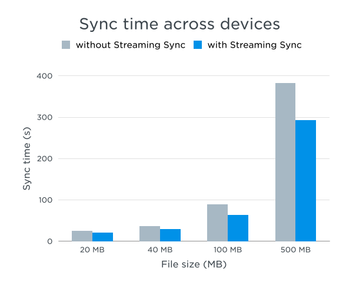

# Table of Contents

1.  [Algorithm](#org5bfefea)
2.  [Review](#orgc9d7a16)
    1.  [简介](#orgfcd7dcf)
    2.  [经典Paxos算法](#orgc08a58d)
        1.  [问题](#org1dca3d7)
        2.  [安全性](#orgd55babb)
        3.  [进展](#org16b2763)
    3.  [使Paxos变快](#org8a86b0b)
        1.  [基本算法](#org3adc0c6)
        2.  [冲突恢复](#org0a98851)
        3.  [进展](#orgc8e2278)
    4.  [实现上的考虑](#orga172e5d)
        1.  [选择法定人数](#org545aa23)
        2.  [非协调恢复中避免冲突](#orgc9efe27)
        3.  [快速Paxos的成本](#org0bd2b7c)
    5.  [结论](#org93ab6bd)
3.  [Tips](#org2f5fdd7)
4.  [Share](#org76fa629)
    1.  [Dropbox文件格式](#org59b354a)
    2.  [服务器文件日志](#org407299f)
    3.  [高水平改变](#orgf9efc90)
    4.  [协议更改](#org22022dc)
    5.  [元数据服务器变更](#orgf510862)
    6.  [客户端变更](#org7db932c)
    7.  [完成](#orgac4482a)
    8.  [流同步有什么好处？](#orgf28a4c9)

# Algorithm

leetcode 321: <https://leetcode.com/problems/create-maximum-number/>

<https://medium.com/@dreamume/leetcode-321-create-maximum-number-45af2be1d47d>

# Review

<https://www.microsoft.com/en-us/research/publication/fast-paxos/>

Fast Paxos

## 简介

共识问题需要一系列进程来选择一个值。本文在一个异步消息传递系统非拜占庭故障环境下考虑共识问题。该问题的一个解决方案在任意数量故障的情况下禁止选择两个不同的值，在有足够非故障进程及互相能通讯的情况下最终会选择一个值。

在传统的共识问题描述中，每个进程提议一个值和选择一个提议值。可以看到任何解决方案需要至少两个消息延迟以达到任意进程已学习了解被选中的值。一系列算法在最好的情况下能达到这种延迟情况。经典的Paxos算法这么流行是因为在实际系统中Paxos算法能在正常情况下达到这种延迟状况。

可以看到用传统共识算法优化消息延迟数是不可能的 &#x2013; 一个人为的传统问题描述，提议的进程和选择的进程为同一个进程。在很多应用程序中，提议和选择的进程并不是同一个。例如，在一个客户端/服务器系统中，客户提议下一个被执行的命令，服务器会选择一个提议值。当传统共识算法用在这样的系统时，需要3个消息延迟：客户端提议一个命令，一些进程学习到被选中的命令。

一种快速共识算法是一个进程可以以两个消息延迟学习到选中值，即使值提议和选择在不同系列的进程中。该算法显示没有一般性的共识算法能保证在提议值竞争冲突时能在两个消息延迟学习到选中值，即如果两个不同的值同时提议的时候。快速共识算法因此不能总是像预计的那么快速，如果遇到冲突事件的时候。

快速Paxos是一种快速共识算法，为经典Paxos的变种。在正常情况下，如果无冲突学习将在两个消息延迟完成，并保证冲突时3个消息延迟能完成。甚至，它能使用最小可能的进程数达到想要的容错。

快速Paxos的基本思想依赖于更早的Brasileiro算法。然而，它们仅考虑传统的共识问题，没有意识到他们的算法能轻易地修改来达到快速共识。Pedone和Schiper的R共识算法也能修改成为快速共识算法。然而，修改后的算法在冲突的情况下需要至少4个消息延迟。

快速Paxos算法是经典Paxos算法扩展的核心。如果理解经典Paxos工作原理则能容易理解快速Paxos。因此我开始在第2节解释经典Paxos。第3节解释如何修改经典Paxos来获得快速Paxos。这两节的解释描述有些是非形式化的。目的是解释算法如何工作，不提供按照惯例的用伪代码或其他语言的算法简约描述。经典Paxos算法的精确描述在第4和第7节，一个形式化的TLA+快速Paxos指导说明在书后附录里给出。TLA+指导说明足够详细，可以指导这里讨论的所有变量。然而，没有一种快速Paxos的描述能描述出实现中的所有变量细节。要透彻理解快速Paxos的原理最好准备实现它而不是看算法的任何伪代码或形式化语言的描述。

在最后的章节将讨论快速Paxos的优化，解释Brasileiro算法和快速Paxos算法的关系，简略提及经典和快速Paxos的一般化来处理拜占庭故障。

## 经典Paxos算法

### 问题

共识问题可以很好的用3种集合代理的术语来描述：提议者提议值，接受者选择一个值，学习者学习被选中的值。代理代表在进程中扮演的角色；一个进程可以扮演多个角色。例如，在客户端/服务器系统中，一个客户端可扮演提议者和学习者，服务端扮演接受者和学习者。

我假设异步，分布式，非拜占庭计算模型：

1.  代理以任意速度工作，可能因故障停止，并重启。然而，代理不能执行错误的行为。
2.  代理通过发送消息来通讯，可能转发很耗时，转发乱序和重复、丢失。然而，消息不能损坏。

共识算法的安全需求如下，一个值只能被一个提议者提议：

1.  不平凡性，只有提议值能被学习
2.  一致性，最多只能学习一个值

大多数共识算法，包括快速Paxos，都会满足不平凡性。我这里将因此忽略不平凡性。一致性通过确保接受者只能选择一个值来保证，且只有该值能被学习。确保只有一个值被选中是比较困难的，学习选中值则相对简单，我们将集中关注在接受者如何选择值这块。

安全需求需要在任意数量（非拜占庭）故障中也能维护住。一个共识算法同样需要满足进度需求，即如果有足够的非故障代理某个值最终会被选中。我们不想回复提议者或学习者进度信息，因为它们不可靠。例如，我们不想一个客户端/服务器系统因一个客户端失去响应而整个系统挂掉；客户端可能会扮演提议者或学习者角色。进度只需要有足够多的非故障接受者，一个非故障提议者提议一个值和一个非故障学习者学习该值。然而，这样的需求是有问题的，因为典型的Fischer、Lynch、Paterson结果显示它不能满足任意满足共识安全属性的容错异步算法。因此，需要一些额外的假设。不同的共识算法使用不同的假设。我将稍后介绍Paxos算法进度属性的精确描述，其中会定义“非故障”，直到我描述了它如何满足安全属性之后。这是可能的，因为安全需求在没有任何非故障假设前提下也需要保持。

如果所有代理都正常进度能够得到保持，即使所有代理故障后重启。因为一个值可能在代理故障前学习到，代理必须有一些稳定的存储保存，因为代理可能故障和重启。我假设代理重启时从存储中恢复它的状态，这样一个故障的代理就像被一个简单地暂停了一样没有不同。

### 安全性

1.  基本算法

    我开始描述一个Paxos共识算法的简单版本，他满足共识的安全需求。在2.3节将扩展到完整算法，并满足进度属性。
    
    算法执行多轮，每轮有一个正整数号。但不需要按号顺序执行，不需要完成并可能跳过，不同轮可能并发执行。每轮选择一个值。一个值被选中当且仅当在某轮中它被选中。每一轮，接受者可能投票接受某个值或确定不投票。在某轮一个值v定义为选中当且仅当在该轮中多数接受者投票接受该v值。简单来说，我描述一个算法不会终止且持续一轮轮执行即使某个值被选中。终止和其他优化将在2.4章节讨论。
    
    达到一致性需要没有不同值被选中。因为每轮接受者投票接受最多一个值，且任意两个多数中包含一个共同的接受者，因此在同一轮中不可能有两个不同的值被选中。然而，接受者可以在不同的轮中投票接受不同的值。达到一致性的难点是保证不同的轮中不会被选中不同的值。
    
    虽然我们以接受者投票的所有投票的方式推理算法，接受者不需要记住这些投票。接受者a维持仅仅如下数据：
    
    -   rnd[a]，a参与的最高轮轮号，初始化为0（因0不是一个轮号，rnd[a] = 0意味着a未参与任何轮次）。
    -   vrnd[a]，a投过票的最高轮号，初始化为0（因此，vrnd[a] <= rnd[a]）
    -   vval[a]，a在vrnd[a]轮中接受的值
    
    Paxos假设有一系列协调代理集合。协调者的角色和接受者通常为同一个进程。对每轮i，一些协调者为i轮预先设置的协调者。每个协调者被设置为无穷轮的协调者。提议值发送它们的提议给协调者。i轮的协调者尝试获取被选中的值。每个协调者c维持如下数据：
    
    -   crnd[c]，c参与开始的最高轮，初始化为0
    -   cval[c]，对crnd[c]轮中c所选择的值，或c未选择任何值则值为空。
    
    i轮进度在以下阶段：
    
    -   如果crnd[c] < i，则c开始i轮，设置crnd[c]为i，设置cval[c]为空，发送消息给每个接受者a请求a参与i轮
    -   如果一个接受者a收到参与i轮的请求且i > rnd[a]，则a设置rnd[a]为i，发送一个消息给协调者c，内容包含轮号i和vrnd[a]及vval[a]的当前值。如果i <= rnd[a]（a已开始i轮或参与了一个更高的轮次），则a忽略该请求。
    -   如果crnd[c] = i（c还没有开始更高轮次），cval[c] = 空（c还没有执行这轮的阶段2a），且c接收到i轮多数接受者的阶段1b消息；则规则描述如下，c使用这些消息的内容包含一个v值并设置cval[c]为v，发送一个消息给接受者请求他们在i轮接受v值。
    -   如果接受者a收到一个请求在i轮投票接受一个v值，i >= rnd[a]且vrand[a] != i；则a在i轮投票接受v值，设置vrnd[a]和rnd[a]为i，设置vval[a]为v，发送一个消息给所有学习者宣布它已在i轮投票。如果i < rnd[a]或vrnd[a] = i（这样a已经开始一个更高序号的轮次或已经在本轮投票），则a忽略这个请求。
    
    学习者学习一个v值，在第i轮，它从多数接受者收到阶段2b消息，宣布它们在第i轮都投票了v值。
    
    协调者在任意时刻对新轮号执行阶段1a行为。然而，该行为的启动条件防止协调者以一个低于之前它启动的轮次的轮号作为新轮轮号。不同的轮次可以并行执行，但接受者如果接收到更高轮次的消息将停止参与本轮。阶段2a消息请求接收不同的值可以在不同的轮次发送。然而，阶段2a行为的启动条件和给协调者唯一分配的轮次确保带不同值的阶段2a消息不会发送到相同的轮次。

2.  阶段2a中选择一个值

    我还没有描述算法的核心 - 协调者如何在阶段2a中选择v值。如何做源于算法维护如下基本属性的需求：
    
    CP. 对任意轮i和j，j < i，如果一个v值在j轮已被选中或将被选中，则接受者在i轮不能投票给除v外的其他值。
    
    当然，一个对等的CP描述是：
    
    对任意轮i和j，j < i，如果一个接受者在i轮已投票给v值，则在j轮，除v以外的值都不会将被或会被选择。
    
    一个值在i轮被选择只会是一些接受者投票给了它。因此，CP意味着，如果j < i，如果v在j轮被选择，除v以外的值都不会在i轮被选择。CP表明两个不同的值不会在不同的轮选中。我们已经看到两个不同的值不会在同一轮中被选中，这样CP代表了一致性。
    
    因为CP代表了一致性需求，我们可以通过维护CP来保证算法满足一致性。接受者在i轮可投票的唯一v值即是协调者在阶段2a指定的值。这样，我们只需要确保v满足如下属性：
    
    CP(v, i)：对任意轮j < i，在j轮除v以外的值不会被选择或选中。
    
    多数集包含接受者的多数。一个v值在j轮将被或被选中当且仅当有一个多数集Q，Q中每个接受者在j轮投票了v或将要投票给v。接受者a不会降低rnd[a]，如果j < rnd[a]它将忽略j轮的投票请求。因此，我们有：
    
    观察1: 一个v值在j轮将被或被选中仅当有一个多数集Q，Q中每个接受者有rnd[a] <= j或在j轮投票了v值
    
    如果“仅当“替换为“当且仅当”则观察1不成立，因为rnd[a] = j在接受者在j轮已投票给非v的其他值时成立。要用“当且仅当”需要把条件rnd[a] <= j替换为：
    
        (rnd[a] <= j) && (vrnd[a] < j)
    
    但我们不需要这么复杂的条件。
    
    因为任何两个多数集合有一个共同的接受者，观察1意味着如下两个观察：
    
    -   观察2: 如果有一个多数集合Q，Q中每个接受者a的rnd[a] > j且在j轮没有投票，则在j轮没有选择或将会选择值
    -   观察3: 如果有一个多数集合Q，Q中每个接受者a的rnd[a] > j，要么投票了v值要么尚未投票，则在j轮不会投票或将会投票给非v的其他值
    
    观察3的假设并不意味着v值在j轮被选中或将被选择。事实上，这些假设表示两个不同的v值，在观察3的约束下在j轮不会选择或将会它们。
    
    假设协调者从多数接受者集合Q中收到i轮阶段1b消息。因为接受者a设置rnd[a]为i且rnd[a]不会变小，对Q中每个接受者rnd[a]当前值满足rnd[a] >= i。设vr(a)和vv(a)为vrnd[a]和vval[a]的值，设k为Q中所有接受者的vr(a)的最大值。我们现在考虑两种情况：
    
        K1. k = 0
        K2. k > 0
    
    K1时，Q中每个接受者a报告vrnd[a] = 0，Q中接受者在j < i轮中都没有投票。因为Q中所有rnd[a] >= i，观察2意味着在j < i轮中没有值被选中或将被选择。因此，不管协调者选择了任意v值，CP(v, i)都满足。然而，为保证不平凡性，协调者必须选择一个提议的v值。
    
    K2时，一个或多个接受者报告在k轮已投票并且在任意j > k轮，没有接受者报告投票。设a_0为Q中vr(a_0) = k的一些接受者，在阶段2a，协调者选择一个等于vv(a_0)的v值。为说明v值满足CP(v, i)，我们必须证明对任意j轮，j < i，非v的值不会被选中或选择。因为vrnd[a] <= rnd[a]且接受者a只在i > rnd[a]时回应一个i轮消息，则我们有k < i。证明因此分成如下3种情况：
    
    1.  k < j < i。设a为Q中任意接受者。因为vr(a)为最大的轮号，a发送消息投票且vr(a) <= k < j，接受者a在j轮没有投票。因它发送消息时设置rnd[a]为i，则a在轮号小于i的轮次中没有投票。因此a在j轮没有投票，Q中没有接受者在j轮投票。因在Q中任意a有rnd[a] >= i > j，观察2意味着在j轮没有值被选中或将被选择。
    2.  j = k。当接受者在k轮投票了v值，接受者a_0设置vrnd[a_0]为k，k > 0且vval[a_0]为v。因为接受者投票仅当协调者在该轮发送了该v值，每个接受者在k轮要么投票v值要么没有投票。因为Q中所有接受者a，rnd[a] >= i > k，观察3意味着在j轮没有非v的值被选中或将被选择。
    3.  j < k。我们可以假设引入属性CP，当在k轮接受者a_0投票了v值。这意味着在j轮非v值被选中或将被选择。
    
    设Q为任意接受者的多数集合，在i轮发送了阶段1b消息。
    
    对Q中接受者a，其报告的阶段1b消息中vr(a)和vv(a)为vrnd[a]和vval[a]的值。
    
    k为Q中所有接受者a的vr(a)的最大值。
    
    V为Q中所有vr(a) = k的接受者a的值vv(a)的集合
    
    如果k = 0，则选择任意一个提议值否则V包含一个值v。
    
    这个完整的非形式化CP(v, i)证明满足v = vv(a_0)。
    
    在阶段2a选择v值的规则描述如上，我们观察到该规则允许协调者在收到多数集合的1b消息且收到一个提议者的提议消息时可以选择一个v值。

### 进展

上述简单算法满足CP属性，且因此满足一致性需求。它也明显满足不平凡性。我将扩展它为完整算法来满足进度要求。

1.  进度属性

    Paxos通过假设算法选择单个协调者来当领导的方式处理FLP不可能性结果。当然，选择单个领导是共识的一种形式。然而， Paxos需要单个领导来取得进展。即使领导者选举算法失败且代理对相信谁为领导有不同看法的情况下，安全性也是能得到保证的。实际上，它通常比较轻松地实现一个领导者选举算法，且多数时间是成功的，如果算法失败无任何会发生，这样就很好了。我将先不讨论如何选举领导。
    
    代理定位为无故障当且仅当它最终执行了它应该做的行为，比如响应消息。定义代理集合G为好的当且仅当G中所有代理都无故障，且如果G中任一代理重复发送消息给其他G中代理，则消息最终收到，进一步说，消息最终被转发否则G最终被认为是不好的。故障和不好都是时间属性取决于未来的行为。
    
    根据定义，好的集合的任意子集也是好的集合。两个好的集合的并集不一定是好的，如果通讯网络被分区或网络通讯有问题，代理p和q可能无法互相通讯即使另一个代理r可以跟它们通讯。如果网络完全奔溃，则没有超过单个代理的好集合。
    
    对任意提议者p，领导者l，协调者c，接受者集合G，定义LA(p, l, c, Q)：
    
    -   LA1 {p, l, c} U Q 是好集合
    -   LA2 p提议了一个值
    -   LA3 c是唯一的协调者相信自己是领导者
    
    Paxos共识算法满足如下属性：
    
    进展：对任意学习者l，如果存在提议值p，协调者c和多数集合G，LA(p, l, c, Q)一直满足，则最终l将学习到一个值。
    
    该属性断言l最终学习到一个值如果LA(p, l, c, Q)一直满足的话。更有用的是如果在一定时间内LA(p, l, c, Q)属性保持，则实时属性断言l在一定时间内会学习到一个值。假设一个时间范围，好集合中任意代理发送消息，好集合中另一个代理接收并处理消息的时间，这可以直接转换进展属性的证明为实时属性的证明。
    
    故障代理可能执行行为（假设非拜占庭故障意味着它们不能执行错误的行为）。因此，进展需要LA3即使是故障代理也要满足。故障代理的状态即是否执行未来的行为是不重要的。

2.  完整算法

    我现在扩展上述算法使它满足进度属性。首先，协调者行为和接收者修改如下：
    
    -   CA1 如果接收者a接收到一个i轮阶段1a或2a消息，i < rnd[a]，rnd[a]轮的协调者不是i轮的协调者，则接收者a发送一个特殊消息给i轮协调者表示rnd[a]轮已开始。【如果i < rnd[a]且i轮和rnd[a]轮协调者相同，则该消息忽略】
    -   CA2 协调者c如果相信它是当前的领导者则执行一个行为。当crnd[c] = 0或它学习到j轮已开始，crnd[c] < j < i，则它开始一个新的i轮
    
    因为任何消息都可能被丢失，代理需要重传消息来确保它们最终已转发。我修改算法如下：
    
    -   CA3 每个接收者保持重新发送最后的阶段1b或2b消息；任意相信自己是领导者的协调者保持重发最后的阶段1a或2a消息给每个接收者；每个已提议值的提议者保持重发提议给每个协调者
    
    CA3需要代理发送无穷的消息。2.4节解释这些无终止的重传如何终止。
    
    我们还不能期望一个故障的代理能成功做任何事。我们能期望的是：
    
    -   CA4 一个非故障代理最终执行它应该做的任何行为
    
    例如，CA3和CA4意味着当接收者a非故障时，它必须最终重发最后的阶段1b或2b消息。CA4并没有禁止故障代理执行行为。

3.  进展的证明

    我现在展示完整Paxos算法满足进度属性的证明。我假设LA(p, l, c, Q)保持从某个时间T_0开始，对提议者p，学习者l，协调者c，和多数集合Q，我将展示l最终学习到一个值。设LA1 - LA3为LA(p, l, c, Q)的三个条件。
    
    1.  从时间T_0开始，除了协调者c以外的其他协调者执行任何行为。可通过LA3和CA2证明。
    2.  在某个时间T_1 >= T_0，从T_1时间起，有一个轮号i，crnd[c] = i
        
        证明：通过LA1，LA3和CA4，协调者c最终开始执行一轮，通过步骤1，在T_0之后没有其他协调者开始新一轮。因为到T_0时只有有限轮已开始，最终协调者c将不会再学习轮号大于crnd[c]的信息，并因CA2也不会开始新的轮。
    3.  从T_1起，对Q中所有接收者，rnd[a] <= i
        
        证明：假设Q中存在一些接收者a在时间T_1之后rnd[a] > i，通过步骤2，LA1、LA3和CA4，接收者a发送无数个消息给c，通知它的轮号大于i，这些消息中的一个最终被c接收且使它开始新的一个大于i的轮次，这跟步骤2冲突
    4.  在某个时刻T_2 >= T_1，协调者c将开始i轮的阶段2
        
        证明：步骤2意味着协调者c在T_1时刻已开始i轮。假设它不会开始阶段2，通过步骤2、LA1、LA3和CA3，协调者c必须持续发送1a消息。通过LA1和CA4，Q中每个接收者最终接收到1a消息，通过步骤3，响应一个阶段1b消息。通过LA1、CA3和步骤1，Q中接收者持续发送阶段1b消息且协调者c最终收到这些消息。通过LA1、LA2和CA3，提议者p持续发送一个提议消息给c且c最终接收它。当c接收到提议和多数集合Q中的阶段1b消息，LA3意味着它的阶段2a行为已启动，这样LA1和CA4意味着c执行该行为，开始i轮的阶段2。这与假设矛盾。
    5.  最终l学习到一个值
        
        证明：通过步骤4、LA1、LA3和CA4，协调者c持续发送i轮带着某个v值的2a消息给接收者。通过LA1，Q中每个接收者接收到消息，通过CA4和步骤2，它将发送i轮带v值的阶段2b消息给l。通过CA3和步骤3，Q中接收者持续发送阶段2b消息给l，这样LA1和CA4意味着l最终将学习到v值。

4.  实现的考量

    我们希望进程故障和消息丢失为很少出现的事件（如果物理消息经常丢失，则感知和重传协议会用来使逻辑消息丢失为罕见事件）。通常当一个值被提议和它被选中期间，故障和消息丢失不会发生。我因此考虑实现正常的流程。然而，当一个提议发起一个或多个代理已故障的情况很常见。
    
    1.  减少消息数量
    
        这里描述的算法不会终止且持续发送不必要的消息。我现在描述一些简单的实现技术来使它更高效。
        
        首先，一旦一个值被选中，算法即不需要继续执行。任意进程学习到选中值可停止执行算法并简单地广播该值给所有其他的进程。
        
        CA3需要代理在已收到的情况下保持重传消息。一些情况下，发送者可告诉它不需要继续发送消息。例如，一个协调者从接收者接收到阶段1b消息将不需要在相同的轮次中再发送阶段1a消息，即使它还没有发送阶段2a消息。在实际系统中，信息经常被发送告诉发送者一个消息已被接收。然而，如果接收者未记录消息到存储中，则这个信息可作为提示，发送者不需要再发送了。实际上，当没有消息丢失时，合理的使用信息和超时将避免大多数重传。
        
        算法里使用的一些方法来减少消息数量（减少正常情况下消息数量，但在其他情况下不需要）。
        
        -   协调者给它认为非故障的多数接收者发送阶段1a或2a消息。如果接收者没有响应它会之后发送消息给其他接收者。
        -   提议者只发送它的提议给领导者。然而，这需要领导选举算法广播结果给提议者，这会相对昂贵。这样，更好地是让提议者发送它的提议给所有协调者（这样只需要协调者需要知道谁是领导者）。
        -   接收者发送它们的阶段2b消息给领导者，领导者通知学习者一个值被选中而不是每个接收者发送2b消息给每个学习者。然而，这会增加额外的消息延迟。
        
        最后，第1轮不需要观察阶段1，因为接收者a在该轮发送的阶段1b消息报告vrnd[a] = 0（如果rnd[a] >= 1接收者a将不会发送1轮的1b消息）。1轮的协调者可开始该轮，发送包含任意提议值的阶段2a消息。
    
    2.  典型Paxos的成本
    
        共识算法的高效不在于是否系统只执行一次。在多数应用程序中，系统执行相同代理的一系列算法实例，每个实例使用相同的领导者。
        
        Paxos共识算法高效的关键是阶段1可被所有实例同时执行。当一个新的领导者c被选中，初始化或因为之前的领导者故障，c选择一个轮次为i，该值大于任何之前开始的轮次号。然后发送它还不知道的所有实例的阶段1a消息。接收者响应所有这些实例的阶段1b消息。这些消息只包含小部分信息，每个代理发送的所有这些实例消息很容易组合成一个物理消息。阶段1的摊还成本因此可被忽略，只需要关注阶段2的成本。
        
        在大多数实例中，每个接收者报告vrnd[a] = 0。协调者然后等待一个提议消息并发送它的阶段2a消息包含它的提议值。在正常情况下，Paxos算法按如下工作，当我们使用技术消除上述描述的消息：
        
        -   提议者发送一个消息给领导者或所有协调者
        -   领导者发送阶段2a消息给接收者多数集合
        -   接收者多数集合发送阶段2b消息给学习者
        
        以上是执行Paxos共识算法的3个重要成本。两个明显的要素一个是延迟，即消息延迟，和通讯带宽，即消息数。延迟的话为3个消息延迟，消息数依赖于具体实现，为提议发送给的协调者数目。设N为接收者数目，假设阶段1a和2a消息只发给多数集合。使用多播，一个消息可有多个接收者，则总共需要⌊N /2⌋+3个消息。假设提议只发送给领导者（其也是一个接收者），且接收者为学习者（通常情况为客户端/服务器系统）。使用单播（点对点消息），要发送N (⌊N /2⌋ + 1)个消息。
        
        其次的成本是向存储写信息的延迟。如2.1节所述，允许一个故障代理重启需要它的状态被存储。对许多系统来说，写磁盘比发送消息要慢。这样，在执行阶段2时，领导者需要在发送阶段2a消息前执行一个写存储，接收者在发送阶段2b消息前也要写存储。因后面的写为并行的，这将导致两个写存储的延迟。
        
        提议者和学习者是否要写存储依赖于应用程序。学习者可总是向当前的领导者要值，即共识算法任何实例中被选中的值。如果领导者不知道，可能因为它刚被选中为领导者，它可以开启新的一轮来查找。它将发现在阶段1没有值被选中，否则执行阶段2a来找到被选中的值。

## 使Paxos变快

如之前所述，正常情况下Paxos共识算法模型为：

          提议者 -> 领导者 -> 接收者 -> 学习者

在快速Paxos中，提议者发送它的提议值直接给接收者，不经过领导者。这将节省一个消息延迟（一个消息）。我将解释它如何工作。但首先，我需要简短但重要的先描述一下Paxos算法。

以上描述的Paxos算法用了多数集合的概念，多数集合即由接收者的多数组成。v值在i轮被选中当且仅当接收者多数集合在i轮投票接收v值。多数集合需要的唯一属性为任意两个多数集合的交集不能为空。算法概括地假设任意系列集合为法定人数，任意两个法定人数交集不能为空，在2节中用法定人数替代了多数集合。

我们将进一步概括算法允许法定人数集合依赖于轮号。即对每个轮号i，有一个接收者集合称为i轮的法定人数。v值在i轮被选中当且仅当在某个法定人数里的所有接收者在i轮投票接收v值。即唯一的保持一致性的要求为任意两个法定人数交集不能为空。这意味着对任意轮号i和j，任意i轮法定人数和任意j轮法定人数交集不为空。

### 基本算法

我现在概括2.2节快速Paxos的基本Paxos算法。它只保证安全性。进度和成本之后考虑。

在快速Paxos中，轮号分区为快速和经典轮号。具体轮号决定该轮为快速还是经典。每轮分两阶段处理，除了两处不同：

-   协调者在阶段2a拾起一个值，其修改解释将在以下叙述
-   在快速Paxos i轮中，如果协调者在阶段2a中可以拾起任意提议值，则它可发送一个特殊的阶段2a消息（称为任意消息）给接收者，而不拾起单个值。当一个接收者收到阶段2a任意消息，它可认为任意提议者提议值的消息作为i轮阶段2a带该值的消息（然而，对单个值，它只能执行i轮阶段2b行为一次）。

在正常情况下，协调者c收到的所有阶段1b消息表明在该轮没有接收者投票，这样c可拾起阶段2a的任意提议值。因此，对c来说在快速Paxos轮的正常情况中，c能发送一个阶段2a任意消息。当c被选中为领导者且没有提议值在算法实例提议时这是正常的。接收者等待提议者的提议消息，把第一个提议消息作为c的阶段2a任意消息。

典型的轮次则跟典型Paxos工作方式相同。协调者拾起一个值，则其他接受者在该轮不能投票接收其他值。这在快速Paxos中不一样。如果协调者在快速Paxos轮次中发送一个阶段2a任意消息，每个接收者独立决定什么提议消息作为阶段2a消息。在快速Paxos轮次中，不同的接收者因此可投票不同的值。

协调者的规则在阶段2a拾起一个值不在保证一致性，即使是典型轮次。规则描述断言，如果k != 0，则V包含单个元素。在快速Paxos轮次中这不再为真。在阶段2a中拾起一个值的规则需要校正。

为发现如何校正规则，我们必须重新审视它的根源。我们想要维护CP属性，意味着CP(v, i)必须在i轮持有v值。观察1-3仍然有效，多数集合替换为法定人数。

推理跟K1示例一样，k = 0，CP(v, i)持有v值。协调者因此发送一个阶段2a消息带任意提议值，或对一个快速Paxos轮次来说一个阶段2a任意消息。

我们现在考虑K2，k > 0。对所有j < i，我们必须找到V中一个v值满足CP(v, i)。这意味着其他值在j轮不会被选中，在经典Paxos的推理中，我们考虑三个可能的示例k < j < i，j = k和j < k。我们认为V只在j = k时包含最多一个值。因此，有如下相同的推理：

-   k < j < i， 在j轮没有值会被选中
-   j = k，如果V包含一个单值v，则在j轮其他值不会被选中
-   j < k，对V中任意值v，在j轮v值以外的值不会被选中

以上覆盖了除了当j = k且V中含有超过一个值的情形外的所有情况（k轮为快速Paxos）。在这种情况下，没有值会被在小于i轮的轮次中选中，除了k轮（对j < k，不可能选中两个不同的值，因此在j轮没有值被选中）。对j = k这种情况，我们必须小心推理。

通过观察1，在k轮一个值v被选中或可能被选中仅当在k轮中有一个法定人数R，对R中每个接收者有rnd[a] <= k或已经投票给v。因Q中每个接收者a有rnd[a] >= i > k（因a已发送i轮的阶段1b消息）。这意味着：

观察4: 对Q，vr，vv和k，在k轮一个值v被选中或可能被选中仅当对每个R ∩ Q中的接收者，vr(a) = k且vv(a) = v。

定义观察4为真当且仅当存在一个法定人数R，对所有R∩Q中的接收者，vr(a) = k且vv(a) = v。观察4断言v值在k轮被选中仅当O4(v)为真。这有3个示例需要考虑：

1.  V中没有v值满足O4(v)。在这种情况下，观察4意味着在k轮没有值被选中。因此，协调者在阶段2a可拾起V中任意一个值
2.  V中有一个v值满足O4(v)。这时，观察4意味着v值为唯一的在k轮被选中的值。因此，协调者在阶段2a将拾起该值
3.  V中有多个v值满足O4(v)。

第3个情况的解决方案是使该情况不可能出现。该情况断言对不同值的v和w其O4(v)和O4(w)为真。这意味着有法定人数R_v和R_w对所有R_v ∩ Q中的接收者a有vv(a) = v，对R_w ∩ Q中的所有接收者a有vv(a) = w。如果R_v ∩R_w ∩Q不为空，这是不可能出现的。我们已经要求任意两个法定人数有非空交集：

法定人数要求 对任意i和j轮：

-   任意i轮法定人数和j轮法定人数有非空交集
-   如果j轮为快速Paxos轮，则任意i轮和任意两个j轮有非空交集

上述的完成源于i轮协调者发送阶段2a消息时选择值的规则。在该规则下，快速Paxos满足共识一致性要求。

如果i轮为快速Paxos轮号，则在下面的图2的第一个THEN或最后的ELSE中，协调者会发送阶段2a任意消息。然而，如果它知道值最好发送提议值，因这将避免以下讨论的冲突可能性。在最后的ELSE中，协调者知道每一个V中提议值，这样它将发送一个提议值。

### 冲突恢复

在经典Paxos中，如果i轮法定人数的接收者在收到更高轮号的消息前收到了i轮阶段2a消息，则i轮成功选择了一个值。这对快速Paxos轮次来说当协调者发送一个阶段2a任意消息时不成立。这时，不同的接收者可投票接收不同的值，结果是没有值被选中。在正常的情况下，接收者首先接收到阶段2a任意消息，然后投票接收它收到的第一个提议值。如果两个或多个不同的提议者同时发送提议，且这些提议值被接收者已不同的顺序接受则该轮会失败。我现在考虑算法如何从这样的冲突竞争提议中恢复。

    设Q为任意i轮法定人数的接收者，已发送i轮阶段1b消息
        对Q中接收者a，vr(a)和vv(a)为阶段1b消息中带的vrnd[a]和vval[a]的值
        k为所有接收者a中最大的vr(a)值
        V为vr(a) = k的所有接收者的vv(a)值集合
        O4(v)成立当且仅当存在一个k轮法定人数R，对所有R ∩ Q中接收者a，vr(a) = k且vv(a) = v
    if k = 0则设v为任意提议值
        else if V 只含有一个值
            then 设v为该值 
            else if 存在w in V 满足 O4(w) 
                then 设v = w (唯一) 
                else 设v为任意提议值

一个明星的从冲突中恢复的办法是当协调者c知道了i轮可能没有选择值时开始一个新轮，发送阶段1a消息给所有接收者。假设i轮的协调者也是i + 1轮的协调者，则i + i轮是它发起的新一轮。接收者a发送阶段1b消息响应c在i + 1轮的阶段1a消息，做如下两件事情：它报告vrnd[a]和vval[a]的当前值，它宣称一个承诺不会给任意小于i + 1的轮次投票（这个承诺间接地表示了a的设置rnd[a]为i + 1）。假设a在i轮投票了，这种情况下，a的阶段1b消息报告vrnd[a] = i和vval[a]为a在i轮阶段2b消息里发送的值。阶段2b消息也意味着a不会在任意小于i + 1轮的轮次里投票。即a的i轮阶段2b消息携带了i + 1轮1b消息中的相同信息。如果协调者c接收了阶段2b消息，它不再需要阶段1b消息。该观察导致如下两种冲突恢复方法。

第一种为协调恢复。假设i为快速Paxos轮，c为i和i + 1轮的协调者。在协调恢复中，接收者发送i轮阶段2b消息给协调者c（也发送给学习者）。如果c接收到i + 1轮法定人数接收者的这些消息并发现冲突发生，则它处理这些阶段2b消息作为对应i + 1轮阶段1b消息并执行i + 1轮阶段2a，使用上图规则在阶段2a消息中选择一个v值（注意接收者可执行它的阶段2b行为即使它未收到该轮的阶段1a消息）。因在这种情况下V非空，c不发送阶段2a任意消息。因此，如果i + 1轮法定人数的接收者在收到更高轮次消息前收到这些阶段2a消息，则i + 1轮将成功。协调恢复因CA2修改被禁止，CA2的添加为保证进展。CA2被补充来修正这个问题。

第二种方法是非协调恢复，假设i和i + 1轮都是快速Paxos轮。在非协调恢复中，接收者发送它们的i轮阶段2b消息给所有其他接收者。每个接收者使用和协调恢复相同的过程拾起协调者在i + 1轮阶段2a消息所带的v值。然后它执行i + 1轮阶段2b就像它收到阶段2a消息那样。因为拾起v值的规则非确定性，不同的接收者在i + 1轮可能投票接受不同的值，导致该轮不能成功。然而，因为i + 1轮是快速Paxos轮，一致性得到保留并更高轮次号可选择一个值，3.4节讨论尝试让所有接收者拾起相同的v值。

协调和非协调恢复给算法增加了新的允许行为。这些行为维护了安全性因为它们跟原始算法允许的行为相对等。协调者在i轮学习到该冲突可依然开始一个大于i + 1轮的完整轮次（同协调恢复一样，可通过CA2的弥补版本得到允许）。

### 进展

为说明快速Paxos必须解决的进展属性，我们找到在经典Paxos进展属性里合适地替代多数集合的替代方案。一个明星的方式是i轮法定人数，但对哪个i？回答该问题需要考虑法定人数如何选择。

3.1节的法定人数要求表述了i轮法定人数的要求依赖于是否i轮为经典轮或快速Paxos轮。我假设两种类型的法定人数 - 经典和快速。一个i轮法定人数是经典或快速依赖于i轮是经典轮还是快速轮。法定人数要求断言(a)任意两个法定人数有非空交集且(b)任意两个快速法定人数和任意经典或快速法定人数有一个非空交集。

为获得快速Paxos的进展属性，我们用经典法定人数或快速法定人数来替代经典Paxos里的多数集合。但用哪个呢？因为快速法定人数的要求比经典法定人数要强，快速法定人数至少跟经典法定人数一样大。这样，要求为进展只经典法定人数为非故障是一个相比要求快速法定人数非故障的，要更强的进展属性要求。通过替换经典Paxos进展属性要求的多数集合为经典的法定人数，我因此加强了快速Paxos算法要满足更强的属性。

如果i为经典轮号，则i轮在快速Paxos中工作如同跟经典Paxos一样。如果我们确保领导者最终开始一个足够大的经典轮号，则如2.3.3节一样相同的参数显示快速Paxos满足它的进展属性（因非协调恢复允许接收者通过开始新的i + 1轮来执行i轮，进展属性的证明要求额外的观察，只要i为快速轮次则这可能发生）。为确保领导者可开始一个足够大的经典轮次，我们假设每个协调者为无穷多经典轮次的协调者（这是一个预分配映射轮次到协调者的条件）。我们也修改CA2：

CA2' 协调者c如果相信它自己为当前的领导者，它可执行一个行为。它可能开始一个新的i轮仅当(a) crnd[a] = 0， (b) crnd[c]为一个快速Paxos轮次且i为一个经典轮次，或(c)它已学习到j轮已开始，crnd[c] < j < i

当i + 1轮为经典轮次时，(b)允许在快速轮次i的冲突中协调恢复，开始一个完整的新经典轮次。因领导者在协调恢复中不会发送阶段2a任意消息，经典法定人数至少跟快速Paxos相同，没有理由在i + 1轮为快速轮次执行协调恢复。CA4必须解释为如果协调者c相信它自己为领导者且crnd[c]仍然是一个快速轮次，则c必须最终开始一个新的经典轮次。这确保快速Paxos满足它的活跃属性。

## 实现上的考虑

### 选择法定人数

在多数应用程序中，是否接收者集合形成一个法定人数依赖于基数。设N为接收者个数，我们选择F和E，使任意至少N - F个接收者的集合是一个典型法定人数且任意至少N - E个接收者的集合是快速法定人数。这意味着在最多F个接收者故障的情况下一个经典轮次可以成功，最多E个接收者故障的情况下一个快速轮次可以成功。我们想要E和F尽可能大，虽然增加一个需要减少另一个。

法定人数要求断言(a)任意两个法定人数有非空交集且(b)任意两个快速法定人数和任意经典或快速法定人数有一个非空交集。因为快速法定人数的要求比经典法定人数要强，我们可假设E <= F（如果F < E，我们可替换F为E且依然满足要求）。容易看到E <= F意味着(a)和(b)相当于：

(a) N > 2F

(b) N > 2E + F

对固定的N，两个自然地选择E和F的方法是最大化一个。最大化E导致E = F = ⌈N /3⌉ − 1；最大化F则F = ⌈N /2⌉ − 1和E = ⌊N /4⌋。

领导者可决定基于非故障的接收者个数是否使用快速或慢轮次。如果至少N - E个非故障接收者，它可以使用快速轮次。如果超过E个接收者故障，则领导者可通过开始一个新的经典轮次来切换到经典Paxos，执行所有实例的阶段1。

### 非协调恢复中避免冲突

在非协调恢复中，一个接收者基于接收到的i轮阶段2b消息拾起一个值来在i + 1轮中投票。它处理这些阶段2b消息作为i + 1轮的阶段1b消息。规则的未确定性可导致不同接收者拾起不同的值，这将阻塞从i + 1轮中选择值。我现在展示如何防止该可能性。

对一个固定的i + 1轮法定人数Q，通过使用一个固定的过程从V中按上图最后的ELSE分支拾起一个值，可很简单地去掉该非确定性。然而，不同的接收者没有收到所有i轮相同集合的阶段2b消息则可能使用不同的i + 1轮法定人数。这可通过该轮的协调者在它的i轮阶段2a任意消息里指定用于冲突非协调恢复的i + 1轮法定人数Q来防止该情况发生（它可选择它认为非故障的任意法定人数Q）。协调者也可以间接地暗示Q，通过首次发送它的阶段2a消息给最小的快速法定人数Q的非故障接收者。在正常情况下，Q中接收者都没有故障，则Q中接收者接收到的i轮阶段2b消息集合将正是Q中的接收者，这样Q中所有接收者将使用Q作为i + 1轮法定人数，在i + 1轮阶段2b消息中拾起一个值。i + 1轮最后会成功。

### 快速Paxos的成本

如2.4.2节所述，一个新选中的领导者在共识算法多个实例中并行地选择一个新轮号并执行阶段1。如果E < F，则快速法定人数比经典法定人数大，领导者将选择一个快速轮号当且仅当它相信接收者快速法定人数是非故障的。如果E = F，在多数应用程序中，它将总是选择一个快速轮号。如果领导者选择一个经典轮号，则会如同经典Paxos那样处理。成本上唯一的不同是法定人数必须包含多数接收者，这样更多的消息需要发送。假设现在它选择一个快速轮号。

对大多数实例来说，领导者在阶段1发现它可以使用任意提议值。它因此发送一个阶段2a任意消息给某个法定人数的所有接收者。因该消息发送给大多数实例，只需要有一个物理消息，则摊还成本是可忽略的。快速Paxos显著的成本开始于提议者的提议消息。

在经典Paxos中，提议者被通知谁是领导者，这样他们可只发送他们的提议给领导者。然而，它可简单地发送提议给所有协调者，而不是通知他们谁是领导者。相似地，在快速Paxos中，提议者可学习到快速轮次正在执行且领导者已选择某个非故障的接收者法定人数，将会发送提议给它们。然而，它可简单地发送它们的提议给所有协调者和接收者。

在无冲突的情况下，处理过程跟经典Paxos一致，除了一个消息延迟和更多的消息，因快速法定人数一般比接收者集合中的个数多。冲突时使用的协调或非协调恢复需要阶段2b消息发送给领导者（协调恢复）或快速法定人数的接收者（非协调恢复）。这可能需要额外的单播（非多播）消息，依赖于是否领导者或接收者也是学习者。跟经典Paxos相比，我们又假设领导者为接收者，接收者为学习者，阶段2a消息只发送给法定人数。我们又设E = F且提议只发送给法定人数。在这些假设下，需要⌊2N /3⌋ + 2多播或N (⌊2N /3⌋ + 1)单播。

如果在快速轮次中有冲突，则算法需要额外的恢复成本。该成本依赖于恢复如何执行 - 一个完整的新轮，协调恢复或非协调恢复。协调者决定使用哪种恢复。该决定可间接地由轮次决定或宣告一个阶段2a任意消息。

开始一个新轮会有新轮阶段1和阶段2的成本。i轮冲突的协调恢复成本为i + 1轮的阶段2，包括两个消息延迟和两次写存储延迟。对以上假设，意味着一个额外的⌊2N /3⌋ + 2多播或N (⌊2N /3⌋ + 1)单播消息。非协调恢复只增加i + 1轮阶段2b的成本，包括一个消息延迟和一次写存储延迟。对相同的假设，这将有⌊2N /3⌋ + 1个多播或(N − 1)(⌊2N /3⌋ + 1)个单播消息。这使非协调恢复看着比协调恢复更好，而协调恢复比开始一个完整的新轮要好。然而，这些都是假设接收者为学习者。如果不是，非协调恢复相比协调恢复可能要增加更多的i轮阶段2b消息（即使无冲突）；开始一个完整的新轮则不会增加额外的i轮消息。

冲突恢复最好的办法依赖于发送这些额外的i轮消息的成本和冲突发生的频率。对多播，对额外的消息可能没有成本，这样非协调恢复是最好的。如果冲突很少，则开始一个新轮是最好的。如果冲突过于频繁，则经典Paxos比快速Paxos要好。

当两个提议同时发送的时候冲突不会发生；需要这些提议被不同的接收者已不同的顺序接收。多频繁发生依赖于提议产生频率和媒体交换。例如，如果所有接收者在同一个以太网中，则它不太可能被不同的接收者已不同的顺序接收。这样冲突会很少。

## 结论

共识问题以提议者提议值，接收者选择值和学习者学习选中值这些术语描述最清晰。传统异步共识算法在提议和学习之间需要三个消息延迟。在正常操作中，在没有冲突的情况下快速Paxos只需要两个消息延迟：提议者发送它的提议给接收者，接收者发送阶段2b消息给学习者。如果冲突发生，非协调恢复正常情况下增加一个消息延迟：接收者发送另一轮的阶段2b消息给学习者。这些是一般共识算法需要的最少消息延迟 - 对任意集合的提议者，接收者和学习者。

法定人数需求决定非故障接收者数目来确保进展。2.3节的快速接收推理显示该需求必须被任意一般化的快速共识算法满足。法定人数可被选择这样如果超过2/3的接收者非故障则快速学习的进展可被保障。或者，如果接收者集合多数非故障且如果至少3/4的接收者非故障的情况下快速学习，则进度可被确保。

当每个这样的进程使用它收到的第一个提议值作为它的值时，Brasileiro算法可转换为快速共识算法。N个进程为接收者和学习者（添加其他的学习者很简单）。当N > 3F时，算法开始一个快速轮号1，快速和经典法定人数都包含N - F个接收者。如果该轮未成功，算法切换到一个普通共识算法，每个进程拾起它的私值，并发送在非协调恢复的第2轮阶段2b消息中。因为快速Paxos满足CP要求，这样如果一个v值在第1轮中选中，则进程不能使用其他值作为私值。Pedone和Schiper的R共识算法跟快速Paxos相似，其所有轮都是快速轮。

Zielinski的1-2共识算法对每个轮次并行执行一个快速和经典协议。如果冲突防止快速协议在两个消息延迟时选中一个值，则经典协议可在第3个消息延迟时选择一个值。允许快速协议只选择在经典协议中领导者提议的值，则一致性得到维持。单个进程故障（领导者）将使快速学习为不可能，这样形式上是一个E = 0的协议。然而，它允许快速学习尽管有不为领导者的E > 0个接收者故障。

经典和快速Paxos都能处理拜占庭故障。Castro-Liskov算法是一种典型的拜占庭Paxos。在正常情况下，该算法要求比普通经典Paxos多一个消息延迟，即提议和学习之间有4个消息延迟。额外的消息延迟防止恶意协调者发送带不同值的阶段2a消息。因快速Paxos允许阶段2a消息在快速轮次中带不同值，它可生成更快的拜占庭Paxos算法，消除额外的消息延迟。快速拜占庭共识算法被Martin和Alvisi独立地开发。快速Paxos也能生成快速拜占庭Paxos算法，在没有冲突的情况下，在提议和学习之间只需要两个消息延迟（然而，一个恶意的提议者可创造冲突）。

# Tips

-   构造简单的模型，设计好方案，代码具体实现就是很简单的事情了

# Share

流文件同步

<https://dropbox.tech/infrastructure/streaming-file-synchronization>

我们的用户因各种原因喜欢Dropbox，同步性能是其中最主要的。我们继续最近的性能改进称为流同步，其能提升2倍的同步延迟。

在流同步之前，文件同步分为两个阶段：上传和下载。整个文件必须上传到我们的服务器并提交到我们的数据库，其他客户端才能了解到它的存在。流同步运行文件内容作为流存在我们的服务器和客户端之间。

首先我们将讨论Dropbox存储和同步文件。在本地机器中，Dropbox尝试确认你的系统中的主机文件系统。然而，特别考虑到Dropbox支持共享文件夹，服务端Dropbox文件系统有一个不同的抽象。不像传统的文件系统，只有相对路径是不够的。

我们定义命名空间为对更多传统文件系统目录树根目录的抽象。每个用户拥有一个根命名空间。每个共享目录为一个命名空间，可以加载到一个或多个根命名空间。注意用户拥有命名空间而不是相反。在这个抽象下，在Dropbox服务器下的每个文件和目录可以唯一对应两个值：一个命名空间和一个相对目录。

## Dropbox文件格式

Dropbox的每个文件分成4MB大小的块，最后的块可能较小。这些块用SHA-256进行hash并存储。文件内容唯一对应到SHA-256hash列表，我们称为块列表。

## 服务器文件日志

这是我们的大元数据数据库，代表了我们的文件系统。注意它不包含文件内容，只是块列表。它为只添加记录每一行代表一个文件的特殊版本。关键的列为：

-   命名空间号(NSID)
-   命名空间相对目录
-   块列表
-   日志号(JID)：对一个命名空间来说是单调递增的

两种服务器类型：

-   块数据服务器：维护一个hash的键值存储来加密内容。无法了解用户/文件/块是如何对应的
-   元数据服务器：维护用户数据库，命名空间和服务器文件日志SFJ

服务器通过内部的RPC进行通讯。

我们在流同步之前先讨论Dropbox客户端协议。

每个桌面客户端对每个它的命名空间保存一个在SFJ位置的游标，该游标可以和服务器通讯如何更新。

首先，我们讨论一个上传客户端，当一个文件出现的时候发生了什么。客户端首先尝试提交块列表给服务器（命名空间，路径）。元数据服务器检测是否这些hash值已知及这个用户和命名空间可访问。否则，提交调用返回“需要块”表明哪些块丢失。对文件来说，通常需要上传所有块。

上传客户端必须直接与块服务器通话来添加这些块。我们限制每个请求的字节数，这样可能需要多个请求。

在这个图中，限制为8MB，但我们也试验其他值。

最后，客户端尝试再次提交。这次，它会正常工作。元数据服务器将更新SFJ，添加一个新行。这样文件将出现在Dropbox中。

现在我们看下载客户端。当客户端发现更新有效时，它将发起一个列表调用学习新的SFJ行。列表调用使用每个命名空间的游标作为输入，这样只有新的条目会返回。

空闲客户端维持一个通知服务器的长连接。

一个新文件，我们需要从块中重建。下载客户端首先检查是否块已在本地存在（文件已存在，或在我们的删除文件缓存中）。对新文件，这些检查很可能失败，客户端将直接从块服务器中下载。块服务器检验用户有这些块的访问权限并提供它们。同样，这里可能有多次请求。

现在客户端已有所有的块。它可以重建文件并添加到本地文件系统。我们只展示了一个新文件如何跟客户端同步。我们有不同的线程跟文件系统交互，hash、提交、存储批处理、列表、获取批处理、重建，这允许我们对多文件流水线并行处理。我们使用压缩和远程同步来最小化存储批处理和获取批处理请求的大小。

总结过程，以下是整个的流程图：

典型地，对大文件，同步时间由存储和获取调用的网络时间决定。存储批处理调用发生在SFJ提交之前。列表调用只在SFJ提交后有效。然而，获取批处理依赖提交是没有必要的。这指出我们可优化，该优化我们称之为流同步。我们想要对每个客户端可以部分并行工作。理想情况下下载客户端可以总是只落后一个块服务器网络调用。

这样看着会比较好。我们应该如何做来达成这样的效果呢？

## 高水平改变

对初始化从上传客户端失败的提交开始我们将要维护元数据服务器状态（跟SFJ分离）。这允许下载客户端在SFJ提交前获得进展。下载客户端可以预取那些还没有提交的文件的部分块。这样，当SFJ提交发生时，下载客户端也基本下载完成了。

## 协议更改

上传客户端不需要改变它的行为。然而，下载客户端需要监听非SFJ变更。我们通过添加额外的输出到列表来处理。列表现在返回新的SFJ行，新流同步预取块列表。

## 元数据服务器变更

我们决定除持久化表外在memchache存储额外的状态。该数据是否持久化不重要，我们选择不考虑写入失败的提交这样额外的成本。memcache条目跟SFJ行相似，除了没有版本控制。这样不需要JID。

-   当失败的提交调用时写入memcache
-   列表处理时从memcache读
-   成功提交调用后删除（memcache驱除）

## 客户端变更

当不响应SFJ的文件时客户端需要维护块的预取缓存。客户端对预取进行队列处理，该处理使用预取缓存。在新版客户端中，你可以在".dropbox.cache/prefetch_cache/"目录找到这些。

## 完成

还有一些东西需要讨论。我们只讨论了上传完整时的正常情况。我们需要确保即使文件没有完整提交，我们也不阻塞该进程。想象开始一个上传并中途改变主意。我们需要确保服务端memcache过期条目且不引起服务震荡。我们需要下载客户端预取缓存定期智能地删除，这样使它不会过度增长。

当访问块时，我们检查memcache表的有效性。因为mamcache条目可能被修改、无效、过期或预取过程中删除，我们需要安排客户端的反馈行为当服务器不能检测块是否满足流同步条件时。这将添加特殊返回值给存储协议来说明这种情况。

## 流同步有什么好处？

我们发现流同步只影响那些大文件，需要多次存储/获取请求的，这样我们限制该特征到新的大文件。流同步在多客户端同步时间上提供上达2倍的改进。改进接近2倍是因为文件大小增加相当于上传/下载带宽，但实际上，速度被限制在连接的慢的那端。我们测试两台在相同网络的机器（1.2 mb/s上传，5 mb/s下载）。大约同步时间提高了25%。

<table border="2" cellspacing="0" cellpadding="6" rules="groups" frame="hsides">

<colgroup>
<col  class="org-right" />

<col  class="org-right" />

<col  class="org-right" />
</colgroup>
<tbody>
<tr>
<td class="org-right">文件大小 (MB)</td>
<td class="org-right">流同步的同步时间</td>
<td class="org-right">非流同步的同步时间</td>
</tr>

<tr>
<td class="org-right">20</td>
<td class="org-right">21</td>
<td class="org-right">25</td>
</tr>

<tr>
<td class="org-right">40</td>
<td class="org-right">30</td>
<td class="org-right">37</td>
</tr>

<tr>
<td class="org-right">100</td>
<td class="org-right">64</td>
<td class="org-right">89</td>
</tr>

<tr>
<td class="org-right">500</td>
<td class="org-right">293</td>
<td class="org-right">383</td>
</tr>
</tbody>
</table>

当我们首次提供这个特性时，我们跟踪了关键度量像预取块数量、预取缓存大小和memcache hit/miss比例。

