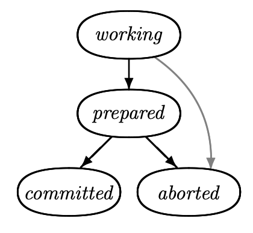
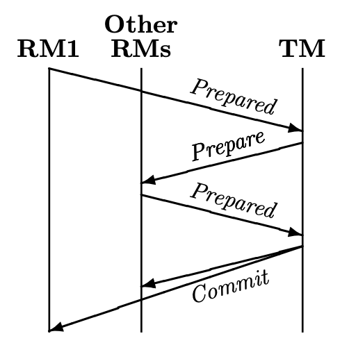
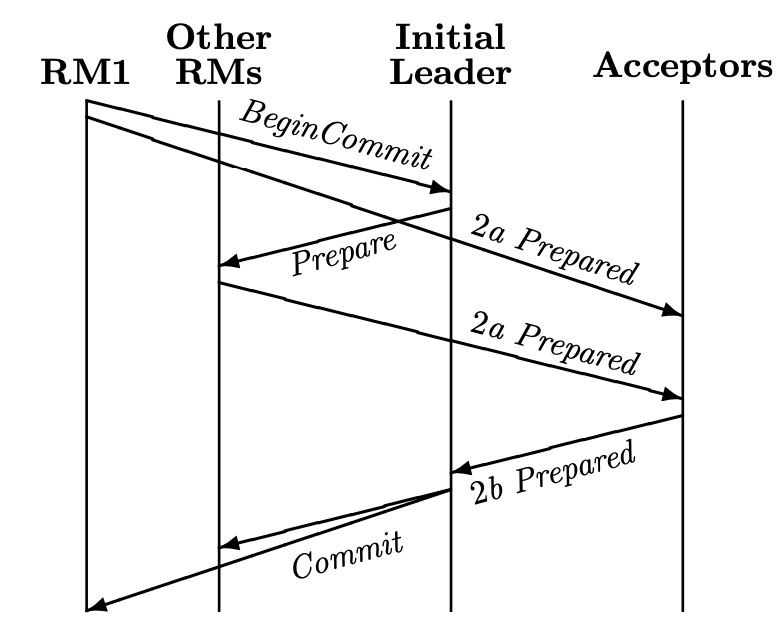
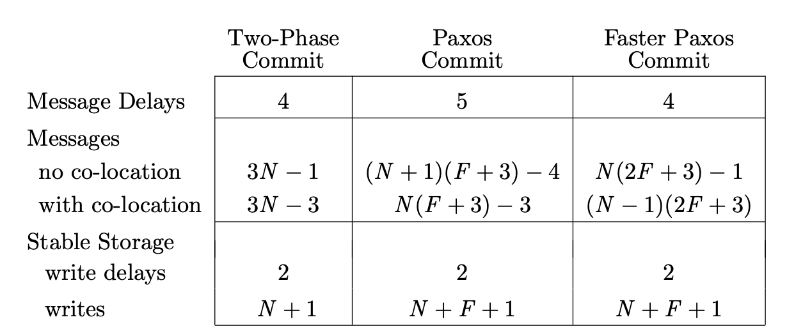
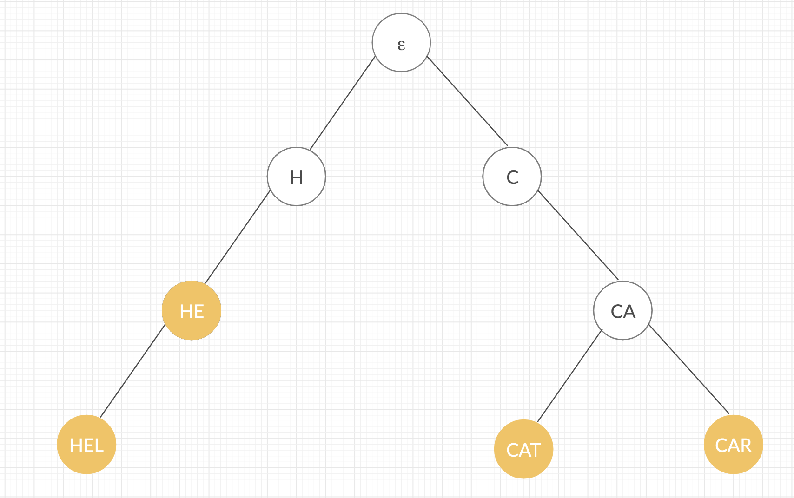
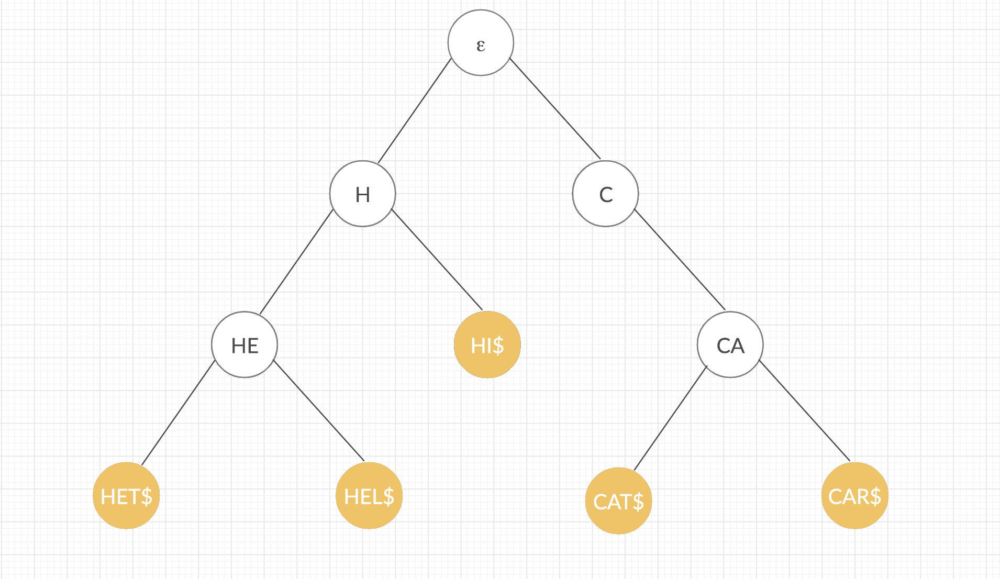
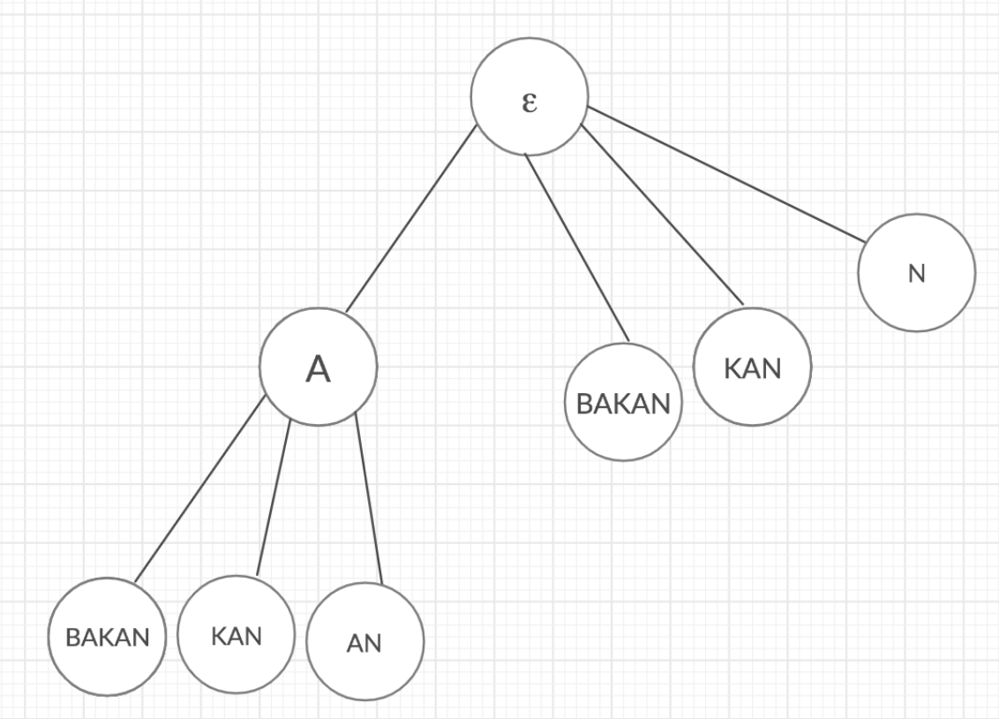
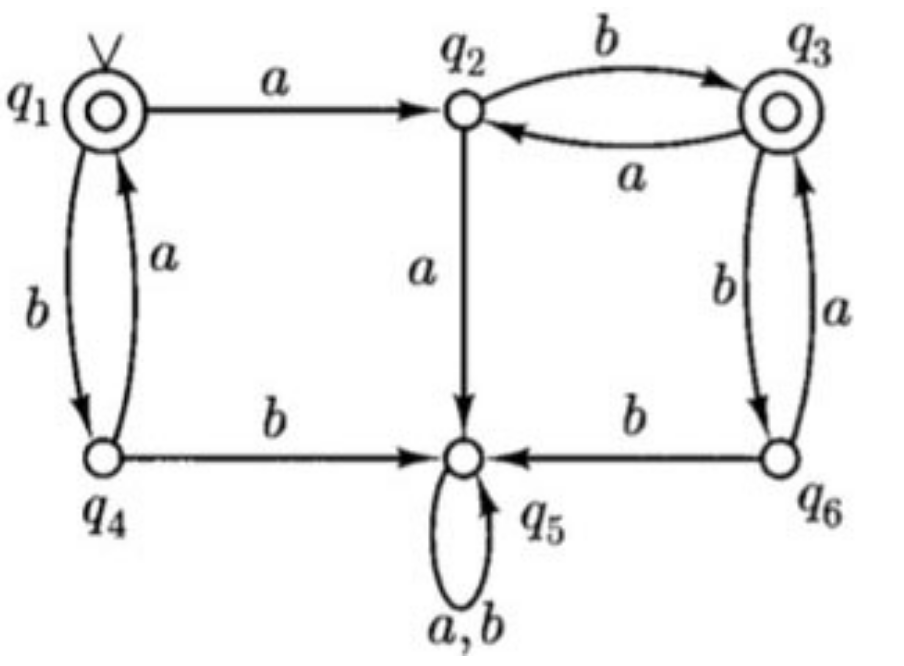
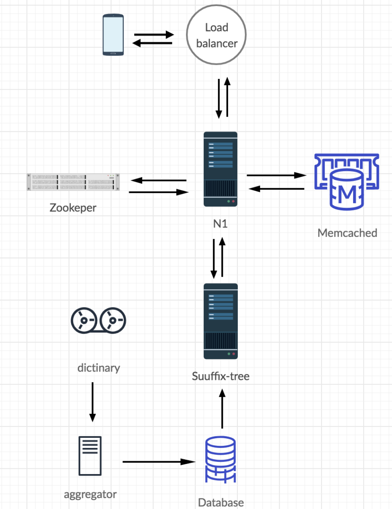
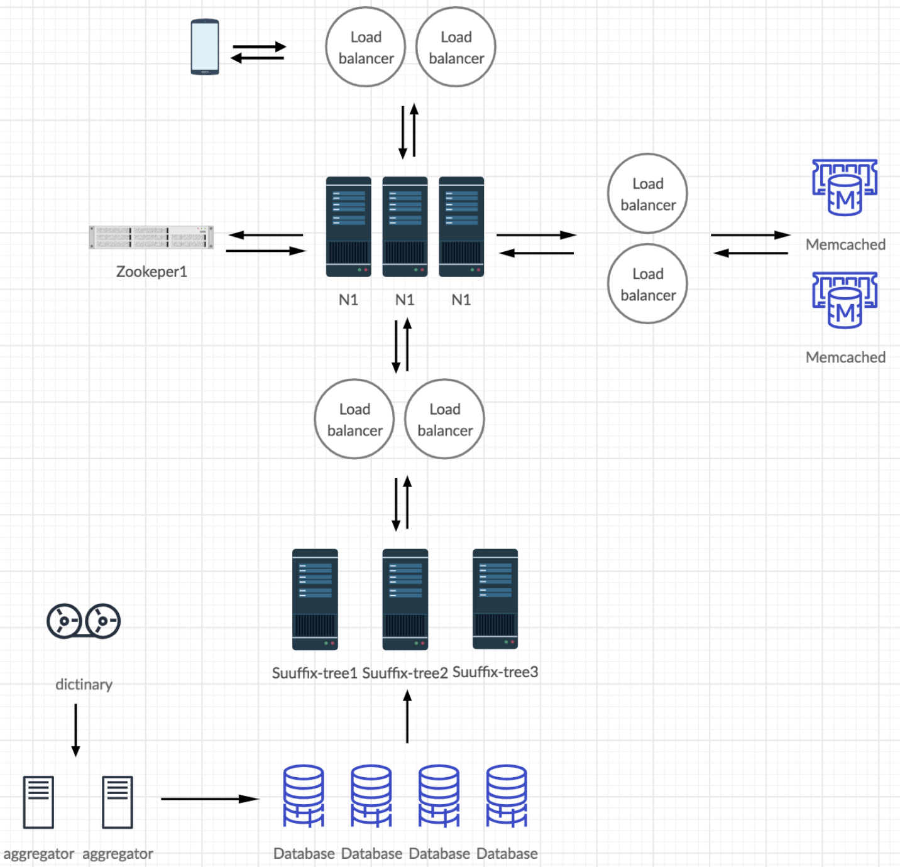

# Table of Contents

1.  [Algorithm](#org6c584ed)
2.  [Review](#orgb5a2b0c)
    1.  [简介](#org002ee2d)
    2.  [交易提交](#org211e5f6)
    3.  [两阶段提交](#org9794927)
        1.  [协议](#orgd608358)
        2.  [两阶段提交的成本](#org8400a66)
        3.  [两阶段提交的问题](#orgac7ae9a)
    4.  [Paxos提交](#org8dc6fbe)
        1.  [Paxos共识算法](#org164ff69)
        2.  [Paxos提交算法](#org5e5952a)
        3.  [Paxos提交成本](#org50b11fe)
    5.  [Paxos VS 两阶段提交](#org82f1113)
    6.  [交易创建和注册](#org074ea5f)
        1.  [交易创建](#org894c0c2)
        2.  [加入交易](#orgd374d3a)
        3.  [提交交易](#org2e08b53)
        4.  [学习输出](#org84b76fe)
    7.  [结论](#orgf01a705)
3.  [Tips](#orgb6129f8)
4.  [Share](#org9f85f00)
    1.  [简介](#org0c08b11)
    2.  [Trie数据结构](#org6cc9685)
    3.  [后缀树算法](#org7cefc52)
    4.  [最小DFA](#org9a04539)
    5.  [设计一个自动完成系统](#org606a323)
    6.  [结论](#org055cc96)

# Algorithm

Leetcode 324: <https://leetcode.com/problems/wiggle-sort-ii/>

<https://medium.com/@dreamume/leetcode-324-wiggle-sort-ii-ba6416b84648>

# Review

<https://www.microsoft.com/en-us/research/publication/consensus-on-transaction-commit/?from=http%3A%2F%2Fresearch.microsoft.com%2Fapps%2Fpubs%2Fdefault.aspx%3Fid%3D64636>

Consensus on Transaction Commit

## 简介

分布式交易包含多个操作，执行在多个站点，请求提交或放弃交易时终止。站点使用交易提交协议来决定是否交易被提交或放弃。交易能被提交仅当所有站点将要提交该交易。在分布式系统中达成这种所有或无的原子属性是不容易的。交易提交的要求在第2节中将详细描述。

经典的交易提交协议是两阶段提交，描述在第3节。它使用单个协调者来达到一致。协调者故障会导致协议被阻塞，无进程会了解，直到协调者恢复。在第4节，我们使用Paxos共识算法来获得一个使用多个协调者的交易提交协议；它在多数协调者工作的情况下能取得进展。第5节比较两阶段提交和Paxos提交。我们将展示两阶段提交是一种单协调者Paxos提交算法的降级，只有在该协调者工作的时候能保证进展。第6节讨论一些交易管理的实战。相关工作在总结中讨论。

我们的计算模型假设算法执行在一系列进程中，互相通过消息通讯。每个进程执行在一个网络节点。进程在遭遇故障是可保存数据到稳定的存储中。不同的进程可能执行在同一个节点。我们的模型统计节点间消息、消息延迟、写存储、写存储延迟。我们假设同一个节点的进程消息成本可忽略不计。我们的故障模型假设节点、它们的进程可能故障；消息会丢失或重复，但不会损坏。任意进程在故障节点会停止执行任何行为；它不执行不正确的行为和不会忘记它的状态。实现进程故障模型需要写信息到存储，可能会是昂贵的操作。我们将看到在两阶段提交和Paxos提交中写存储引起的延迟。

一般来说，算法必须满足两种正确的属性：安全性和活跃性。安全属性描述什么是允许发生的，活跃属性描述什么必须发生。

我们的算法是异步的，它们的安全属性不依赖进程执行的时间顺序或消息延迟的边界。进展依赖进程如何快速响应和消息如何转发。

我们定义一个非故障节点，该节点进程以某个时间限制响应消息。网络节点非故障当且仅当所有它的节点非故障且节点进程间发送的消息能在某个时间限制内转发。

本文主要部分描述交易提交和我们的两个协议。附录包含形式化的TLA+安全属性说明，即说明删除进度或实时限制的假设和需求。我们期望只是最关注的读者会查看这些说明。我们算法的进度属性和伴随的非故障定义也是形式化的，例如，像De Prisco，Lampson和Lunch的终止属性那样，我们只是以非形式化的方式解释它们。

## 交易提交

在分布式系统中，交易被一系列进程执行，这些进程被称为资源管理器，每个执行在不同的节点上。当一个资源管理器提出请求提交或取消交易时交易结束。对被提交的交易，每个参与的资源管理者必须提交它。否则，交易将被取消。在交易请求之前，任何资源管理者可自由决定取消它的交易部分。基本的需求是所有的资源管理者必须最终同意交易提交或取消。

为参与，一个资源管理者必须首先加入交易。我们假设固定集合的资源管理者决定。6.2节讨论资源管理者如何加入交易。

我们抽象交易提交协议的需求如下。我们假设一系列资源管理者进程，每个开始于工作状态。协议的目的是对所有资源管理者达到提交状态或取消状态。

两个协议的安全需要如下：

-   稳定性 一旦一个资源管理者进入提交状态或取消状态，它将永远在这个状态
-   一致性 资源管理者不可能一个在提交状态，另一个在取消状态

这两个属性意味着一旦资源管理者进入已提交状态，其他资源管理者则不能进入取消状态，反之依然。

每个资源管理者有准备状态。我们需要：

-   资源管理者只有在所有资源管理者在准备状态后才能进入已提交状态

这些要求意味着交易可提交，即所有资源管理者都进入已提交状态，只能通过如下顺序的事件：

-   所有资源管理者进入准备状态（以任意顺序）
-   所有资源管理者进入已提交状态（以任意顺序）

协议允许如下事件防止交易提交：

-   任意在工作状态下的资源管理者可进入取消状态

稳定性和一致性条件意味着取消事件不可能在一些资源管理者进入已提交状态后发生。实际上，一个工作中的资源管理者当它意识到它不能执行它的交易部分时它会取消。

算法的目标是]]让所有资源管理者达到已提交或取消状态，但在资源管理者故障或因通讯失败被隔绝的情况下无法实现。经典的FLP理论意味着一个确定性、纯异步的算法不能在满足稳定性和一致性的条件下依然保证进展（即使只有一个故障）。我们因此要求只在正确的时间顺序假设满足的情况下有进展。交易提交协议的两个活跃要求如下：

-   非平凡性 如果协议执行期间整个网络正常，则(a)如果所有资源管理者进入准备状态，则所有资源管理者最终进入已提交状态，(b)如果一些资源管理者进入取消状态，则所有资源管理者最终进入取消状态
-   非阻塞性 在任意时刻，大量的网络节点正常工作足够长时间，则这些节点的每个资源管理者最终进入已提交或取消状态

这两个条件的精确描述需要精确定义什么是网络节点非故障。非阻塞性里的“足够长时间”依赖于非故障进程和网络通讯的响应时间。我们在这里不会继续描述。

我们可通过指定逻辑行为集合来更精确地指出交易提交协议，这里行为指一系列系统状态。我们指定带一些初始信息的安全属性和描述所有可能步骤（状态转换）的下一步状态的关系。初始信息为所有资源管理者为工作状态。为定义下一步状态关系，我们先定义两个状态信息：

-   可提交 当且仅当所有资源管理者为准备状态或已提交状态
-   不可提交 当且仅当没有资源管理者进入已提交状态

下一个状态关系断言对每个资源管理者，每个步骤包含如下两个行为之一：

-   准备 资源管理者可从工作状态进入准备状态
-   决定 如果资源管理者在准备状态且可提交，则它可进入已提交状态；如果资源管理者在工作状态或准备状态且不可提交，则它可进入取消状态

## 两阶段提交

### 协议

两阶段提交协议是一种使用交易管理器进程协调决定过程的交易提交实现。资源管理者按交易提交说明在协议中有相同的状态。交易管理者有如下状态：初始化（它的初始化状态），准备，已提交和取消。

当资源管理者进入准备状态并发送一个准备消息给交易管理者时开始两阶段提交协议。在收到准备消息后，交易管理者进入准备状态并发送一个准备消息给每个其他资源管理者。收到准备消息后，仍在工作状态的资源管理者可进入准备状态并发送一个准备消息给交易管理者。当它接收到所有资源管理者的准备消息后，交易管理者可进入已提交状态并发送提交消息给所有其他进程。资源管理者在收到交易管理者的提交消息后可进入已提交状态。两阶段提交协议的消息流如下图。

本图显示一个资源管理者正在准备中，事实上，任意资源管理者可从工作状态进入准备状态并在任意时刻发送一个准备消息。交易管理者的准备消息可认为是一个可选的建议，认为现在是一个好的时机来提交。其他事件，包括实时超时时间，可能使工作的资源管理者进入准备。该观察基于两阶段提交协议使用更少的消息。

一个资源管理者在工作状态中时可自然地进入取消状态，交易管理者除非它已进入已提交状态可自然地进入取消状态。当交易管理者取消时，它发送一个取消消息给所有资源管理者。当收到该消息后，资源管理者进入取消状态。在实现中，自然取消可被超时触发。

在两阶段提交中，在任意的异步算法，处理故障并重启是非常容易的。在发送任意消息之前，每个进程记录它的当前状态到存储中。例如，当收到一个准备消息，交易管理者记录它已进入准备状态的信息到存储中然后发送一个准备消息。当故障进程重启时，它从存储中恢复它的状态并继续执行该算法。处理故障并重启相当于进程暂停，异步算法是允许该操作的。6.4节将讨论在我们交易提交协议中的进程故障并重启的更多细节。

两阶段提交有很多描述，它的形式化说明在附录的A.2节，使用一个理论断言它实现交易提交的详细说明。该理论被TLC模型检测机用大量足够的配置检测，所有它不太可能出错。

### 两阶段提交的成本

交易提交协议的重要高效度量是正常情况下的成本。设N为资源管理者的数量。两阶段提交协议在正常情况下发送如下消息序列：

-   初始化资源管理者进入准备状态并发送一个准备消息给交易管理者（1个消息）
-   交易管理者发送准备消息给每个其他的资源管理者（N - 1个消息）
-   每个其他资源管理者发送一个准备消息给交易管理者（N - 1个消息）
-   交易管理者发送一个提交消息给每个资源管理者（N个消息）

这样，正常情况下，资源管理者在4个消息延迟后学习到交易已被提交。总共3N - 1个消息发送。典型地，交易管理者可作为同一个节点上的初始化资源管理者。这样，两个消息在节点内，所以一共是3N - 3个消息和3个消息延迟。

如3.1节讨论的那样，我们可消除交易管理者的准备消息，减少消息复杂度为2N。但实际上，这需要额外的消息延迟或一些实时假设。

在消息延迟之外，两阶段提交协议还会伴随写存储的延迟：第一个资源管理者准备时的写入，其他管理者准备时地写入，和交易管理者作出交易决定时地写入。使所有资源管理者同时准备可减少到两个写入延迟。

### 两阶段提交的问题

在交易提交协议中，如果一个或多个资源管理者故障，交易通常被取消。例如，在两阶段提交协议中，如果交易管理者在发送准备消息后足够长的一段时间内没有收到一些资源管理者的准备消息，则它发送取消消息给其他资源管理者来取消交易。然而，交易管理者故障将导致协议阻塞直到交易管理者恢复。特别地，如果交易管理者在收到每个资源管理者的准备消息时故障，则其他的资源管理者不知道交易管理者是提交了还是取消了交易。

一个非阻塞提交协议为一个进程故障不会防止其他进程决定交易是否提交或取消。它们通常被称为三阶段提交协议。一些已经被提议，一些已经实现。它们尝试通过在交易管理者故障的时候选择另一个交易管理者来修复两阶段提交协议问题。然而，我们知道还没有谁提供完整的算法证明满足一个清晰地正确描述条件。例如，Bernstein, Hadzilacos, 和Goodman讨论非阻塞提交的文章没有解释如果收到两个不同的进程声称其为当前的交易管理者时进程该如果做。保证这种情况不出现对实现交易提交协议来说比较困难。

## Paxos提交

### Paxos共识算法

分布式计算社区已学习了更多一般性的共识问题，有关需要一系列进程同意某个值。该问题的许多解决方案在各种故障假设下被提议，这些算法有精确的故障模型和严谨的正确性证明。

在共识问题中，一系列被称为接收者的进程合作选择一个值。每个接收者运行在不同的节点。基本的安全要求为只有一个值被选中。为了解决方案有意义，需要一个额外的要求即被选中的值必须为客户提议的值。活跃性要求断言，在足够长时间内，如果一个大型的子网接收者节点不故障，则一些值将最终被选中。如我们的严格同步假设，在F个接收者故障的情况下需要2F + 1个接收者达成共识。

Paxos算法为流行的异步共识算法。它使用一系列非负整数的投票活动号，每个有一个预先决定的协调者进程称为领导者。0活动号的领导者被称为初始领导者。正常情况下，初始领导者收到一个提议值，它发送一个阶段2a消息给0轮号包含该值的所有接收者（缺失的阶段1将在之后解释）。每个接收者接收该消息并回复0轮的一个阶段2b消息。当领导者收到多数接收者的阶段2b消息，它将发送一个阶段3消息宣布该值被选中。

初始领导者可能故障，导致0轮没有选择值。这样，一些算法开始执行选择一个新的领导者 - 例如，Aguilera算法。选择一个唯一的领导者也相当于解决共识问题。然而，Paxos维护一致性，绝不允许两个不同的值被选中，即使多个进程认为它们是领导者（这跟传统的3阶段提交协议不同，多协调者会导致不一致）。需要一个唯一的非故障领导者来确保活跃性。

一个进程相信自己为新选中的领导者初始化一个轮号，执行如下阶段（因可能有多个领导者，一些阶段的行为可能并发执行）。

-   阶段1a 领导者选择一个投票活动轮号bal，其相信该轮号比任意已经执行了阶段1的轮号都大。领导者发送阶段该轮号的1a消息给每个接收者
-   阶段1b 当接收者接收到轮号bal的阶段1a消息，如果它尚未执行轮号bal或更大轮号的任意行为，它将响应一个阶段1b消息包含它当前的状态，内容为：
    
    -   它接收到的最大轮号的阶段1a消息
    -   它发送的最大轮号的阶段2b消息
    
    接收者如果已执行了轮号为bal或更大的轮号的行为它将忽略这个阶段1a消息
-   阶段2a 当领导者收到投票活动号bal中接收者多数集合的阶段1b消息，它将学习到如下两个可能性之一：
    
    -   自由 接收者多数没有报告已发送阶段2b消息，则算法还没有选择一个值
    -   强制 多数集合中的一些接收者已经发送阶段2b消息。设μ为已发送阶段2b消息的最大轮号，设Mμ为该轮次阶段2b消息集合。所有的Mμ消息有一个相同的v值，其可能已被选中。
    
    在自由示例中，领导者尝试获得任意可接受的值。它通常拾起客户端提议的第一个提议值。在强制示例中，它尝试获得v值，通过发送带v值和投票活动号bal的阶段2a消息给每个接收者。
-   阶段2b 当一个接收者接收到一个带v值和投票活动号bal的2a消息，如果它还没有更大投票活动号的阶段1a或2a消息，它将接受该消息并发送一个带v值和该投票活动号的2b消息给领导者。接收者如果已参与一个更高投票活动号的活动则会忽略该消息。
-   阶段3 当领导者收到接收者多数集合的带v值和投票活动号bal的阶段2b消息，它知道v值已被选中并通讯发送阶段3消息告诉给所有感兴趣的进程。

0投票活动号没有阶段1因没有更低的投票活动号，这样没有接收者会报告阶段1b消息。

和其他异步算法一样，进程故障和重启需要每个进程记录必要的状态信息到存储中。

算法可以两种独立的方式优化。我们可减少正常情况下的消息数，让领导者只发送阶段2a消息给多数接收者。如果从接收者多数接收到阶段2b消息，领导者将知道v值被选中。如果领导者没接收到足够的2b消息，它会发送阶段2a消息给额外的接收者。第二个优化是消除阶段3的消息延迟，代价是需要有额外的消息，即通过让接收者发送2b消息给所有需要知道该值的进程。跟领导者一样，这些进程在接收到多数接收者的阶段2b消息后会学习到该值。

Paxos算法确保系统在任意非恶意故障的情况下最多一个值被选中，即进程在执行算法和网络通讯时不会破坏消息。在只有一个领导者且领导者和多数接收者所在的节点在足够长时间内不故障的情况下它能保证进展。

实际上，构建一个算法是不困难的，除了网络不稳定的罕见时期，在多数非故障接收者中选举一个合适的唯一领导者。短暂的领导者选举算法故障是无害的，不影响安全性和最终的进展。

### Paxos提交算法

在两阶段提交协议中，交易管理者决定是否取消或提交，在存储中记录该决定，通知资源管理者它的决定。们可以通过使用共识算法来选择已提交或取消决定来实现容错，让交易管理者为客户端来提议共识值。该方案首次由Mohan, Strong, and Finkelstein提交，使用了一个同步共识协议。然而，在正常情况下，领导者在尝试获得提交选中值之前必须学习到每个资源管理者已进入准备状态。让资源管理者告诉领导者它已进入准备状态需要至少一个消息延迟。我们的Paxos提交算法如何消除消息延迟描述如下。

Paxos提交使用独立的Paxos共识算法实例来获得每个资源管理者做出是否准备或取消决定的同意，该决定我们表示为值的准备或取消。这样，对每个资源管理者有一个共识算法实例。交易提交当且仅当每个资源管理者实例选择准备；否则交易被取消。在每个资源管理者决定上执行独立的共识的想法可用于任意共识算法，但如何使用这种做法来节省消息延迟依赖于算法。

Paxos提交对每个Paxos实例使用相同的2F + 1个接收者集合和相同的当前领导者。这样，投票的角色包含N个资源管理者，2F + 1个接收者和当前领导者。我们假设资源管理者知道接收者。在普通的Paxos中，投票活动0的阶段2a消息可含有任意v值。当领导者发送这样的消息，Paxos算法即使在发送消息代理给任意单个选择的进程依然是正确的。在Paxos提交中，每个资源管理者通过在Paxos实例中发送投票活动号0的带准备或取消值的阶段2a消息来宣称它的准备/取消决定。

Paxos提交的执行通常开始于当一些资源管理者决定准备并发送一个开始提交消息给领导者的时候。领导者然后发送一个准备消息给所有其他的资源管理者。如果一个资源管理者决定它将要准备，它发送一个带准备的值和投票活动号0的Paxos算法实例的阶段2a消息。否则，它发送一个带取消值和投票活动号0的阶段2a消息。对每个实例，接收者发送阶段2b消息给领导者。领导者在收到投票活动号0的F + 1个阶段2b消息后会知道该实例的输出，然后它可发送阶段3消息宣称该输出给所有资源管理者（阶段3可去除当接收者发送它们的阶段2b消息直接给资源管理者的时候）。交易提交当且仅当每个资源管理者的Paxos算法实例选择准备；否则交易被取消。

为效率考虑，接收者可捆绑它的所有Paxos算法实例的阶段2b消息为一个实际的消息。领导者可把所有实例的阶段3消息变为一个提交或取消消息，依赖于是否所有的实例选择了准备值。

一个或多个资源管理者的Paxos算法实例在投票活动号0中可能不会达成决定。在这种情况下，领导者（超时后改变）假设每个这样的资源管理者已故障并执行每个这样的Paxos实例的一个更大投票活动号的阶段1a。在阶段2a中，领导者自由学习它的决定（Paxos实例尚未选择一个值），然后它尝试在阶段2b中获得被选中的取消决定。

Paxos算法的一个检查 - 特别地，决定如何在阶段2a达成 - 展示了只有资源管理者为投票活动号0发送了带着准备值的阶段2a消息，则资源管理者实例才会选中准备值。如果资源管理者在投票活动号0中发送了带着取消值的阶段2a消息，则Paxos算法实例只能选择取消，意味着交易必须取消。在这种情况下，Paxos提交可能短路，使用任意广播协议通知所有进程交易被取消（一旦一个进程知道交易被取消，它可忽略所有其他协议消息）。该短路只在投票活动号0的阶段2a消息中出现。即Paxos算法实例选择一个准备值即使领导者已发送带取消值的阶段2a消息（对大于0的投票活动）。

我们简短地展示一个直观的Paxos提交正确性证明。在第2节，我们表述了一个非阻塞算法应该满足四个属性：稳定性，一致性，非平凡性和非阻塞。算法满足稳定性因一旦资源管理者从领导者那里接收到一个决定，它不会改变被选中值。一致性因Paxos算法每个实例选择唯一的值，这样不同的领导者不能发送不同的决定。非平凡性即领导者在执行新一轮投票活动的阶段1a之前等待足够长时间，如果没有故障，每个Paxos实例将完成执行投票活动号0的阶段2。非阻塞性和进展属性意味着如果大网络中的接收者没有故障，Paxos每个实例最终将选择准备或取消。更精确地说，如果Paxos满足共识的活跃要求，即大网络接收者节点在足够长时间不故障，领导者选举算法确保唯一非故障领导者被选中。

算法的安全属性 - 算法无进展要求 - 已详细地形式化描述在附录A.3节，同时附带一个理论断言它实现了交易提交。该理论正确性在TLC模型检测器检测下因配置太少没有检测出错误，但足够检测简单地代码问题。Paxos算法的严谨证明迫使我们相信它没有错误，Paxos提交算法的正确性为Paxos正确性的一个简单推理。

### Paxos提交成本

我们现在考虑当交易已提交时，Paxos提交在正常情况下的成本。消息交换序列图如上图所示。

我们再假设有N个资源管理者。我们考虑系统容忍F个故障，这样有2F + 1个接收者。然而，我们假设优化领导者发送阶段2a消息给F + 1个接收者，并只有一个或多个故障时使用其他接收者。在正常情况下，Paxos提交算法使用如下可能的节点内消息：

-   第一个资源管理者准备发送一个开始交易消息给领导者（1个消息）
-   领导者发送一个准备消息给其他的资源管理者（N - 1个消息）
-   每个资源管理者发送一个Paxos实例的投票活动号0的阶段2a准备消息给F + 1个接收者（N(F + 1)个消息）
-   对每个Paxos实例的资源管理者，一个接收者发送一个阶段2b准备消息给领导者来响应阶段2a消息。然而，接收者可捆绑所有这些实例的消息为一个消息（F + 1个消息）
-   领导者对每个Paxos实例发送一个单个提交消息给每个资源管理者，包含一个阶段3准备消息（N个消息）

如上所观察，我们可消除Paxos的阶段3，使每个接收者发送它的阶段2b消息直接给所有资源管理者。这允许资源管理者在4个消息延迟中学习输出，但需要N(2F + 3)个消息。设领导者跟接收者在同一个节点，则又消除这些消息中的一个。如果每个接受者跟资源管理者在同一个节点，且领导者跟第一个资源管理者在同一个节点，则初始化BeginCommit消息，阶段2a的F + 1个消息，和阶段2b的F + 1个消息可不计算，则总共需要(N - 1)(2F + 3)个消息。

我们看到Paxos提交需要五个消息延迟，通过消除阶段3和接收者发送额外的阶段2b消息我们可消除阶段3来减少到4个消息延迟。这些消息延迟中的两个为发送准备消息给资源管理者。如3.1节所观察到的，这些消息延迟可通过允许资源管理者自发准备来消除，这样只有两个消息延迟。该优化实现交易提交要求在资源管理者的决定上达成共识，并它能显示任意的容错共识算法需要至少两个消息延迟来选择一个值。

资源管理者当进入准备状态，在Paxos提交中执行跟两解读提交相同的写存储。在Paxos共识算法中，一个接收者必须记录它的决定到存储中，在发送它的阶段2b消息之前。Paxos提交通过所有共识算法实例的单个写入来实现。对应在两阶段提交中在发送提交消息之前写存储。Paxos提交因此有跟两阶段提交一样的写存储延迟，并且它执行总共N + F + 1次写入。

## Paxos VS 两阶段提交

在两阶段提交协议中，交易管理者作出取消/交易决定并存储决定到存储中。如果交易管理者故障，则两阶段提交会阻塞。我们使用Paxos简单地在单个决定值上获得共识，这将有效地替换交易管理者的存储为接收者的存储，并替代单个交易管理者为一系列可能的领导者。我们的Paxos提交算法更进一步地消除交易管理者在做决定时的角色。在两阶段提交中，交易管理者可独立地决定取消。在Paxos提交中，领导者只有在资源管理者未做决定时提出取消决定。领导者通过初始化对资源管理者Paxos实例的大于0的投票活动来实现（领导者必须能够这么做来防止被故障资源管理者阻塞）。

3.2和4.3节描述了正常情况下两阶段提交和Paxos提交的消息和写存储成本。两个算法都有相同的3个存储写延迟（如果资源管理者并行准备则是两个）。Paxos提交的条目假设初始化领导者和一个接收者在同一个节点。快速Paxos提交算法优化去掉了Paxos共识算法的阶段3。对两阶段提交，同位置意味着初始化资源管理者和交易管理者在同一个节点。对Paxos提交，它意味着每个相同节点的接收者作为一个资源管理者，初始化资源管理者和初始化领导者在同一个节点。非同位置的Paxos提交，我们假设初始化领导者为一个接收者。

最近，系统设计者满足于提交算法在最多一个故障的情况下不阻塞，即F = 1。在这种情况下，对于5个资源管理者的交易，两阶段提交使用12个消息，Paxos提交使用17个，快速Paxos提交使用20个（同位置）。对N值，这三个算法使用3N，4N，5N个消息（同或不同位置）。

考虑Paxos提交F = 0的简单情况，只有一个接收者和一个可能的领导者，算法不容忍任何接收者故障（算法可容忍资源管理者故障）。设这个接收者和领导者在相同节点上。一个Paxos共识算法的阶段2b消息可作为阶段3消息，使阶段3为非必要。Paxos提交因此变为快速Paxos提交。下图显示，当F = 0时，两阶段提交和Paxos提交使用相同数量的消息，3N - 1或3N - 3，取决于是否在同位置。事实上，两阶段提交和Paxos提交在F = 0时是相同的。两个算法在如下对应上同构：

<table border="2" cellspacing="0" cellpadding="6" rules="groups" frame="hsides">

<colgroup>
<col  class="org-left" />

<col  class="org-left" />
</colgroup>
<thead>
<tr>
<th scope="col" class="org-left">两阶段提交</th>
<th scope="col" class="org-left">Paxos提交</th>
</tr>
</thead>

<tbody>
<tr>
<td class="org-left">资源管理者</td>
<td class="org-left">接收者/领导者</td>
</tr>

<tr>
<td class="org-left">准备消息</td>
<td class="org-left">准备消息</td>
</tr>

<tr>
<td class="org-left">已准备消息</td>
<td class="org-left">阶段2a已准备消息</td>
</tr>

<tr>
<td class="org-left">提交消息</td>
<td class="org-left">提交消息</td>
</tr>

<tr>
<td class="org-left">已取消消息</td>
<td class="org-left">阶段2a取消消息</td>
</tr>

<tr>
<td class="org-left">取消消息</td>
<td class="org-left">取消消息</td>
</tr>
</tbody>
</table>

两阶段提交协议可看作为一个接收者的Paxos提交算法的降级

## 交易创建和注册

我们已经考虑了参与资源管理者的固定集合的单个交易。在实际系统中，一个交易先创建然后资源管理者加入。只有加入交易的资源管理者参与提交/取消决定。我们现在描述交易提交协议如何修改来处理动态变动的资源管理者集合。

第5节显示了两阶段提交为F = 0时的Paxos提交，交易管理者执行一个接收者和一个可能的领导者的功能。我们因此只考虑Paxos提交。

为提供资源管理者的动态集合，我们引入一个记录跟踪进程跟踪哪些资源管理者加入了交易。记录者作为一个额外的资源管理者，除了它的输入给提交协议的是已加入的资源管理者集合，而不是已准备或已取消这样的值。作为一个资源管理者，Paxos提交运行Paxos共识算法的独立实例来决定记录者的输入，其使用相同的接收者集合。交易被提交当且仅当记录者的共识算法选择一个资源管理者集合且其中每个资源管理者的共识算法实例选择了已准备。

记录者一般跟初始领导者在同一个节点，通常也是创建交易的资源管理者所在节点。在两阶段提交中，记录者的功能通常为交易管理者执行而不是一个独立进程（在两阶段提交中，Paxos共识算法可看作为交易管理者选择一个值并写入存储）。

我们现在描述动态Paxos算法如何工作。

### 交易创建

每个节点有一个本地交易服务，一个资源管理者可调用创建和管理交易。为创建交易，服务构建一个交易描述，包含一个唯一识别号和交易协调者进程名。协调者进程为非资源管理者在提交协议中参与的所有进程 - 记录者，初始领导者，其他可能的领导者和接收者。

交易执行期间发送的任意消息包含交易描述，这样一个接收者知道该消息是哪个交易的。一个进程可首先通过接收这样的消息学习到交易的存在。描述告诉了进程它在协议中执行它的角色所必须要知道的协调者的名字。

### 加入交易

一个资源管理者通过发送给记录者一个加入消息来加入交易。如上所述，如果它为该交易记录者收到的第一个消息，则该加入消息必须包含交易描述。资源管理者创建交易，发送描述给其他想加入交易的资源管理者。

一旦收到一个加入消息，记录者添加资源管理者到参与资源管理者的集合并发送该资源管理者一个通知。

### 提交交易

当一个资源管理者想要提交交易，它发送一个开始交易消息给记录者而不是给初始领导者（在两阶段提交中，开始交易消息为第一个资源管理者进入已准备状态的已准备消息）。记录者然后发送准备消息给其他加入交易的资源管理者。这时起，记录者不再允许资源管理者加入交易，对任何加入消息响应一个负面的通知。

开始交易消息使记录者开始一个Paxos共识算法实例来选择已加入交易的资源管理者集合J。它发送投票活动号0的带集合J信息的阶段2a消息给接收者（交易描述列出来接收者）。共识算法实例像资源管理者实例一样运行。记录者故障会导致领导者开始一个更高轮次投票活动并获得取消选择作为记录者的值。

记录者不能发送投票活动号0包含不正确J值的阶段2a消息，即使它故障重启。记录者在开始执行交易时记录进存储，如果它故障重启则不会发送阶段2a消息。可以通过让记录者故障重启时写存储来消除每个交易的写操作。

如4.2节所述，每个资源管理者通过发送投票活动0带已准备或取消值的阶段2a消息给接收者来初始化它的共识算法实例。当记录者共识算法实例选择一个集合J且J中每个资源管理者实例选择已准备时交易被定义为已提交。如果J中任意资源管理者实例选择取消，或记录者实例选择取消则交易被定义为取消。

动态选择资源管理者集合需要Paxos共识算法执行多实例时做一个改变。记得接收者组合它的所有实例的阶段2b消息为一个单消息。在发送一个消息之前接收者等待直到它知道所有实例的阶段2b消息。然而，所有实例包括每个参与的资源管理者实例，参与的资源管理者集合为记录者选择。为打破这个循环，我们观察到，如果记录者实例选择了取消值，则它不在乎资源管理者实例会选择什么值。因此，接收者可等待直到它准备发送阶段2b消息给记录者实例。如果该消息包含一个资源管理者集合J的值，则接收者等待直到它能发送阶段2b消息给J中每个资源管理者。如果给记录者实例的阶段2b消息包含取消值，则接收者只发送该阶段2b消息。

4.2节解释了如果任何参与的自由管理者选择了取消值，协议可能短路且取消消息发送给所有进程。资源管理者可简单地发送取消消息给协调者进程而不是发送阶段2a消息。记录者可回复其他所有加入交易的资源管理者一个取消消息。

在记录者发送它的投票活动号0的阶段2a消息前故障则导致交易被取消。然而，单个资源管理者故障也将导致交易取消。容错意味着一个独立进程的故障不能阻止一个提交/取消决定的达成。

### 学习输出

以上描述所示，当没有故障时，动态提交协议会按照4.3节图片所示工作。我们现在考虑故障时会发生什么。

接收者故障是很直接的。如果交易有2F + 1个接收者，当F + 1个工作接受者故障时协议会被阻塞，否则它将正常工作。

在考虑其他进程故障之前，我们检查一个进程P，只知道交易描述，能发现协议输出 - 即交易被提交或取消。例如，P可能为一个重启的资源管理者，在发送阶段2a已准备消息之后故障且还未记录输出到存储中。

通过交易描述，P知道所有可能的领导者进程集合。它发送给它们一个消息，包含该描述和询问输出。如果所有的领导者进程都故障，则P必须等待直到一个或多个领导者重启（每个节点有一个接收者进程通常也有一个领导者进程，这样有2F + 1个领导者进程）。如果一些非故障领导者知道输出，它将告诉P。然而，即是协议已完成，它可能没有非故障领导者进程知道输出。例如，初始领导者可能故障且这可能是第一次其他领导者进程知道该交易。

假设没有非故障领导者进程知道输出。这些领导者进程选择一个当前的领导者L开始一个Paxos共识算法记录者实例的新投票活动。如果有F + 1个非故障接受者，则L将学习到记录者选择的值，该值要么为参与者集合J的值或者为取消。如果为后者，交易被取消。否则，L为每个J中资源管理者的共识算法实例开始一个新的投票活动。当L学习到这些实例选择的值（已准备或取消），它即知道了交易的输出。一旦L学习到交易输出，它通知P和任意其他感兴趣尚未知道输出的进程 - 例如，已加入交易的其他领导者进程和资源管理者。

这样的学习场景可能因各种原因失败。例如，两个进程并行地尝试学习输出，可能由于网络分区，联系了不同集合的领导者进程。这两个集合的领导者可能选择不同的进程作为当前的领导者。这两个领导者进程可能发生冲突的消息给接受者，阻碍了共识算法实例的成功。然而，Paxos共识算法的正确性确保了提交协议的一致性属性不会被违背。它也确保了如果有唯一的当前领导者能联系P且至少F + 1个非故障接受者，进程P将学习到输出。

对两阶段提交，学习输出很容易。单一的交易管理者进程作为领导者，接受者和记录者。进程P可通过简单地询问交易管理者来学习输出。如果交易管理者故障，则P会等待直到交易管理者重启。

我们现在回到当资源管理者、记录者或初始领导者故障会发生什么的问题上。这样的故障导致协议临时挂起。当一些进程尝试如上述所述的方法进行学习交易输出，则进度将继续。例如，一个资源管理者进程发送一个阶段2a准备消息并超时且未学习到输出。学习交易输出将强制交易提交或取消，如果它尚未如此的话。

## 结论

两阶段提交是典型的交易提交协议。它一些时候被认为就是交易提交。两阶段提交不能容错因它使用单个协调者，当其故障时会导致协议阻塞。我们引入了Paxos提交，一个新的交易提交协议，使用多个协调者且如果多数正常工作则进度能得到保证。因此，2F + 1个协调者能在F个故障的情况下保持进展。两阶段提交等同于使用单个协调者的Paxos提交。

在正常情况下，Paxos提交需要比两阶段提交多一个消息延迟。该额外的延迟在快速Paxos提交中被消除，快速Paxos提交被认为在非阻塞协议中有理论上最小的消息延迟。

非阻塞交易提交协议在1980年左右首次被提出。初始的算法比两阶段提交多两个消息延迟；后续算法减少到一个。所有这些算法使用一个协调者进程并假设两个不同进程不会认为它们都是协调者 - 该假设在纯异步系统中无法实现。临时的网络故障可导致其违反交易提交的一致性要求。1980年观察到使用共识算法来实现非阻塞提交较为容易。然而，一个明显的方法导致比Paxos提交多一个消息延迟。唯一达到低消息延迟的快速Paxos提交算法由Guerrraoui，Larrea和Schiper提出。

对2F + 1个协调者和N个资源管理者，Paxos提交在正常情况下需要比两阶段提交多2FN个消息。两个算法有相同的写存储延迟。在现代的本地网络，消息成本低，写存储的成本可能远大于发送消息的成本。这样在许多系统中，非阻塞协议的优势远大于Paxos提交的额外成本。

Paxos提交用Paxos共识算法实现交易提交。一些读者可能觉得比较难懂，因为它们都是基于分布式系统理论，其交易提交问题比共识问题要更难。然而，这些结果基于更强的交易提交定义，交易在所有资源管理者非故障且选择准备的情况下来提交 - 即使在有不可预测的通讯延迟的情况下。相反地，我们的非平凡条件要求交易提交仅在一个额外假设下，整个网络非故障 - 意味着节点间发送的消息都会在某个时间限制内转发（Guerraoui，Larrea和schiper表示这个条件比故障检测更抽象）。这个交易提交更强的定义没有在典型的交易系统中实现，这些系统中需要容忍偶尔的长通讯延迟。

# Tips

-   设计思想是共同的，通过学习一些案例可以获得一些通用的思路
-   通过翻译等的手段看似学习某知识时花费时间长，但质量高，远比看过效果好百倍
-   书中有些看不懂的内容，带着目的反复看几遍很可能就看懂了，第一遍看的时候往往太略，不细，忽略了很多细节或有些内容并没有真正理解或只是自以为理解了
-   对于计算机书籍，如内容看不懂，把例子用代码实现一下是非常好的理解原理的方法

# Share

如何设计自动完成系统

<https://dzone.com/articles/how-to-design-a-autocomplete-system>

## 简介

自动完成用于搜索建议。该特性增加文本输入速度。事实上，它想要加速搜索交互，通过输入尝试预测你的搜索。自动完成通常会在搜索引擎和消息app中。一个好的自动完成需要在用户输入下一个字母时快速并立即更新建议列表。自动完成仅建议它知道的单词。建议的单词从预定义词汇表中获取，例如，Wikipedia所有不同的单词或英语词典。词汇表的单词数量可能是巨大的：Wikipedia包含数百万个不同的单词。如果自动完成需要识别多单词和条目名，词汇表将更大。

系统的核心是获取前缀和搜索某前缀的词汇表单词的API。典型的，只有k个可能的结果返回。有许多设计实现这样的系统。本文中，我将描述一个百万词汇系统的中等设计。在此之前，我将介绍基本的概念和它们的使用，然后是设计部分。

## Trie数据结构

Trie是一种数据获取数据结构。它减少搜索复杂度并改进成功率和速度。Trie可以以O(M)的复杂度搜索键。然而，它需要数据存储。存储可在内存缓存（Redis或Memcached），数据库，或文件。假设S为一系列K字符串。S = {s1, s2, &#x2026;, sk}。模型集合S以根节点T，从T开始的每个路径到任意它的节点对应至少S中一个字符串的前缀。最好的方法展示该构建是考虑一个例子集。假设S = {het, hel, hi, car, cat}和ε对应一个空字符串。则Trie树如下：

考虑内部节点的每条边到它的子节点被一个字母标注。每个节点对应S的字符串则标注颜色。我们的观察是如果它是S中另一个字符串的前缀，则节点对应它的内部节点，否则，它是一个叶子节点。一些时候，所有的节点对应到S的字符串为叶子节点是非常有用的，或则把$字符添加到尾部：

为了创建Trie，可用一个节点做为根代表空字符串ε。如果你想要插入一个字符串e，按字符串中字符顺序依次插入。

为查找字符串e，你可从根节点开始迭代查找字符。

## 后缀树算法

后缀树是字符串所有后缀的压缩trie树。后缀树在解决许多字符串相关问题如模式匹配，寻找不同的子串，找最长的回文等非常有效。后缀树是使用trie数据结构解决模型匹配问题的一种改进。基本上，它是一种有长路径且没有分支的trie。更好的方法是减少这些长路径为一个路径，即减少trie的大小。

考虑字符串为abakan的后缀树。单词abakan有6个后缀{abakan, bakan, akan, kan, an, n}，它的后缀树如下：

Ukkonen设计了一种算法使用后缀树实现以字符串长度的线性时间复杂度。

后缀树能解决许多复杂问题，因它包含字符串本身的很多数据。例如，为了知道字符串中匹配模型P多少次，它可通过在后缀树中查找P并返回子树节点的大小来解决。另一个有名的应用程序是查找不同子字符串的数量。

前缀的自动完成可通过沿着路径查找前缀。这将在一些内部节点中结束。例如，图片前缀树，前缀对应着从根节点到子节点的路径。自动完成则通过继续遍历所有子节点来产生。

在前缀树中查找是非常快的。需要比较的步骤数量为查找一个前缀的字符数。特别的，这意味着搜索时间独立于字典大小。因此，前缀树适合大字典。前缀树相对于排序队列提供了显著的改进。

## 最小DFA

前缀树处理有共同的前缀非常有效，但其他的共享单词部分依然存储在独立的每个分支。例如，后缀，比如-ing和-ion，在英语里很常见。幸运地是，有一个方法能非常有效地保存共享的单词部分。前缀树是一种更一般的非循环确定性有限自动机（DFA）的数据结构的类实例。有很多算法可用很少的节点转换一种DFA到对应的DFA。最小前缀树DFA能缩减数据结构大小。最小DFA在即使字典很大的情况下也能放入内存。避免昂贵地磁盘操作是轻量快速自动完成的关键。

Myhill-Nerode理论给了我们一个理论化的最小DFA描述。两个状态不可区分意味着对所有字符串，它们都能运行到最终状态或非最终状态。我们说p和q为k区分仅当它们能以字符串长度不超过k的情况下能被区分。

很容易理解这种关系的推演属性：

p和q为k区分的仅当它们为k - 1区分的，或δ(p,σ)和δ (q,σ) 为k - 1可区分的,σ ∈ Σ

构建对应的类开始如下：

p和q为0不可区分的仅当它们都为最终或非最终状态。所以我们开始用算法分割为两块：最终或非最终。

在每两个这样的分区，p和q为1可区分的仅当有一个符号σ使δ (p,σ)和δ(q,σ)为0可区分的。例如，一个为最终另一个为非最终。我们近一步区分每个组为1可区分的状态集合。

方法是继续分割这些分区集合：

在分区集合中的p和q为k区分的仅当有一个符号σ 使δ(p,σ) 和δ(q,σ) 为k - 1可区分的。

在一些节点上，我们不能继续分割分区，我们终止算法因为不能进一步产生新的分割。当我们终止时，我们有了不可区分度对应的类，其将形成最小DFA的状态。从一种类到另一种类的转移通过获得在源类中选择任意状态，应用该转换：

开始区分最终和非最终：{q1, q3}, {q2, q4, q5, q6}

组中不同状态，获得下一步分区：{q1, q3}, {q4, q6}, {q5}, {q2}

-   b区分q2, q4：q4: δ(q2,b) ∈ {q1,q3}, δ(q4,b) ∈ {q2,q4,q5,q6}
-   b区分q2, q5: δ(q2,b) ∈ {q1,q3}, δ(q5,b) ∈ {q2,q4,q5,q6}
-   a区分q4, q5: δ(q4,a) ∈ {q1,q3}, δ(q5,a) ∈ {q2,q4,q5,q6}
-   非a、b区分(q4,q6)

最小DFA有开始状态{q1, q3}，单最终状态{q4, q6}，转换方法如下：

<table border="2" cellspacing="0" cellpadding="6" rules="groups" frame="hsides">

<colgroup>
<col  class="org-left" />

<col  class="org-left" />

<col  class="org-left" />
</colgroup>
<thead>
<tr>
<th scope="col" class="org-left">&#xa0;</th>
<th scope="col" class="org-left">a</th>
<th scope="col" class="org-left">b</th>
</tr>
</thead>

<tbody>
<tr>
<td class="org-left">{q1, q3}</td>
<td class="org-left">{q2}</td>
<td class="org-left">{q4, q6}</td>
</tr>

<tr>
<td class="org-left">{q4, q6}</td>
<td class="org-left">{q1, q3}</td>
<td class="org-left">{q5}</td>
</tr>

<tr>
<td class="org-left">{q2}</td>
<td class="org-left">{q5}</td>
<td class="org-left">{q1, q3}</td>
</tr>

<tr>
<td class="org-left">{q5}</td>
<td class="org-left">{q5}</td>
<td class="org-left">{q5}</td>
</tr>
</tbody>
</table>

## 设计一个自动完成系统

在系统设计中，大多数时间是没有唯一的方法来实现一个实际的目标。我们考虑一般的自动完成如google搜索。但我不会描述一些公共特性，比如空间检查、本地化、隐私信息和非英语单词。一个通常的实现是只使用trie数据结构，但我相信自动完成更加复杂。事实上，我们需要设计一个速度快且可扩展的系统。在系统设计领域，每个人有不同的观点和态度来对待复杂度且总是考虑更好的观点。

一般来说，自动完成获取前缀请求并发送给API。API服务器前端，我们需要有一个负载均衡。负载均衡分发前缀给一个节点。该节点为一个微服务响应检查是否有该前缀数据的缓存。如果有，则返回给API，否则检查zookeeper找到正确的后缀树服务器。

ZooKeeper定义后缀树服务器的有效性。例如，在zookeeper中，定义a\(s-1。它表示从a到\)（后缀结尾），服务器s1会响应。同样地，我们需要后台进程获得一捆字符串并聚集它们到数据库，进而应用到后缀树服务器。

通过后台进程，我们获得语法流和权重（这些流可从术语表、字典等获得）。权重基于数据挖掘技术，对每个系统会不同。

我们需要hash我们的权重和语法并发送给聚集器聚集相似的术语，创建时间和权重总数给数据库。这样我们可基于相关性和权重来推荐数据。

当前系统没有对数千个并行请求进行优化。我们需要改进它。我们可通过垂直扩展来改进我们的系统，但单个服务器是单点故障。我们需要更多的服务器来水平扩展我们的系统来分发请求，我建议用一个轮转算法来在不同系统间分发请求。我们需要对我们的缓存服务器做一些修改，我们可以简单地添加更多的缓存服务器，然而，问题是我们分发数据给不同的缓存服务器，我们如果保证每个服务器接收到的数据相当。例如，如果我们决定基于前缀的开始字符来处理数据段，则我们如何证明所有的服务器有对应相当的数据？我们可简单地使用哈希算法来决定什么数据插入到哪个服务器。但，如果一个服务器故障，我们的系统将不会按预期执行。

这样，我们需要一个一致性哈希技术。一致性哈希是一种分布式哈希方案，在分布式哈希表中独立操作服务器或对象数量，分配它们一个抽象循环或哈希环上的一个位置。这允许服务器和对象扩展并不影响所有的系统。同样，我们的zookeeper需要一些改变，当我们添加更多的后缀树服务器，我们需要改变zookeeper定义为a-k s1, l-m s2, m-z s3$。这将帮助节点服务器获取后缀树的正确数据。

## 结论

以上描述了如何设计一个自动完成系统。同样，这些数据结构可多方式扩展来改进性能。通常，相对于用户接口，存在对特定前缀更多可能的完整性。

自动完成数据结构非常有趣，它不需要你来实现它们。有开源库提供了相关功能。例如，Elasticsearch，Solr，和其他基于Lucence的搜索引擎提供了高效稳定的自动完成系统。

