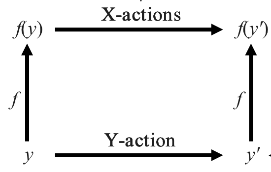
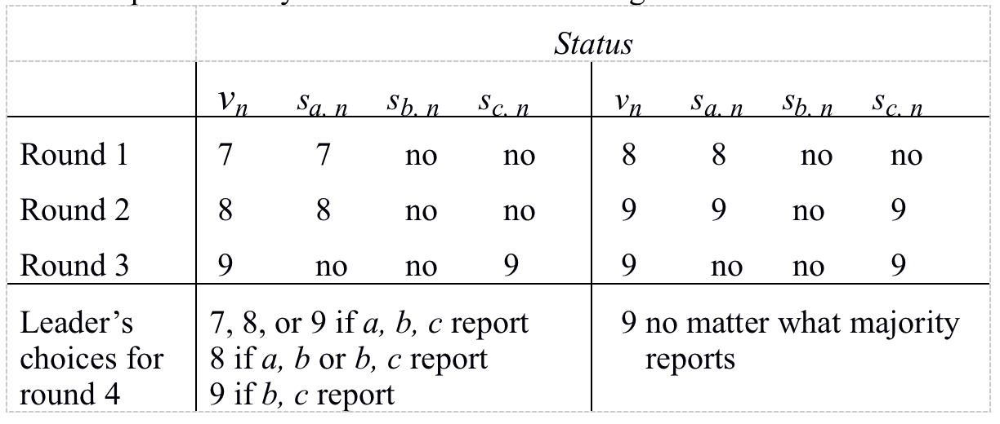

# Table of Contents

1.  [Algorithm](#orga53b90b)
2.  [Review](#orga617a62)
    1.  [简介](#org5061bf5)
    2.  [复制状态机](#orgce05106)
        1.  [协调复制节点](#org1573a5a)
        2.  [租赁：有效地高效计算](#orgf2847ef)
        3.  [分层租赁](#org9d99718)
    3.  [共识](#org4e2e1fe)
    4.  [指导说明](#org2c803c3)
        1.  [如何指定状态系统](#org0221a7c)
        2.  [说明共识](#org0d0848c)
    5.  [实现](#orgaee3509)
        1.  [证明Y实现X](#orgee0fdf7)
        2.  [简单实现的抽象方法](#org8be2e81)
    6.  [Paxos算法](#org0e49eca)
        1.  [想法](#org0440971)
        2.  [状态和抽象方法](#org0b6d6b2)
        3.  [不变量](#orge290243)
        4.  [算法](#org50ca07a)
        5.  [终止：选择一个领导者](#orgf0a4a53)
    7.  [优化](#org960ad0d)
    8.  [总结](#org9a0c269)
3.  [Tips](#org37e56eb)
4.  [Share](#org3f25b16)

# Algorithm

Leetcode 327: <https://leetcode.com/problems/count-of-range-sum/>

<https://medium.com/@dreamume/leetcode-327-count-of-range-sum-9f7d0a611469>

# Review

How To Build a Highly Available System Using Consensus

<http://research.microsoft.com/en-us/um/people/blampson/58-consensus/acrobat.pdf>

## 简介

系统有效指它能按照需求提供服务。从非高效组件中建立高效系统唯一的方法使用冗余。这样系统在部分故障的时候依然能够工作。最简单的冗余即使复制：使每个部分有一些拷贝或复制节点。

本文解释了除了复制节点以外如何构建高效系统，并给出详细指导说明和关键算法的非正式化正确性证明。几乎所有想法源于Leslie Lamport的复制状态机，Paxos共识算法及说明分析并行系统的方法。我写本文因为在我读了Lamport论文之后，它依然使我用长时间来理解这些方法并如何有效地使用它们。奇怪地是很少有人知道这些。

下一节我们将解释如何构建一个有效并高效地重复状态机，给出一个共识容错算法。第3节给出一些共识问题的背景和它的应用程序。第4节用几种形式说明共识。第5节我们介绍Paxos共识算法的基本概念并把算法从想法变为详细说明。最后，我们解释一些重要的优化和归纳我们的结论。

## 复制状态机

冗余是不够的，需要有协调。最简单的办法是使每个非故障复制节点做相同的事。然后任意非故障复制节点可提供输出；如果复制节点没有故障停止，需要f个复制节点的输出容错f - 1个故障。更复制类型的冗余（比如错误修正代码）更便宜，但它们依赖服务提供的特殊属性。

在本节我们解释如何以泛化并高容错的方式协调复制节点。然后我们探索一个优化称为“租赁”，使几乎在所有情况下协调更加有效。

### 协调复制节点

我们如何排列每个复制节点做同样的事情？采用一个由Lamport首次提出的方案，我们构建每个复制节点做为确定性状态机；这使交易关系为一个函数从（状态，输入）到（新状态，输出）。通常称一个这样的复制节点为进程。几个进程已相同的状态开始，看懂相同序列的输入将做相同的事情，然后已相同的状态结束并产生相同的输出。这样所有我们需要保持高有效性的是确保所有非故障进程看到相同的输入。该技术术语称为共识（有时称为同意或可靠广播）。我们说一些进程达成共识仅当它们都同意某个值；我们将在之后给出形式化定义。

这样如果一些进程实现相同的确定性状态机并在一些值上达成共识并顺序化输入，它们将做相同的事情。这样它可能重复任意的计算并使它有效。当然我们可通过定义一些输入集合整体有序来使输入数据部分有序，例如通过编号它们为1，2，3&#x2026;。

在许多应用程序中，输入为客户端发送给复制节点服务的请求。例如，一个复制存储服务可能有一个Read(a)和Write(a, d)输入，且一个机场飞行控制系统可能有ReadInstrument(i)和RaiseFlags(d)输入。不同的客户端通常独立地产生它们的请求，这样它们需要同意请求且服务的顺序。最简单的方法是用连续的整数编号，开始为1。这在主复制节点中完成，因为对一个进程来说分配连续编号比较简单。这样存储服务将同意输入1=Write(x, 3)和输入2=Read(x)。

当总序不为连续的整数时，有许多其他达成共识的方案来排序请求。这些方案标签每个输入为一个总序集合的相同值（例如，(客户端UID, tiimestamp)对），然后发明一种方法来确定你看见所有的输入甚至存在比给定值更小的标签。这是比较复杂的，实际系统通常使用一个主机来序列号输入。

### 租赁：有效地高效计算

容错共识是昂贵的。单进程（加锁）排他访问是廉价的，但它不容错，如果一个进程在加锁时故障，其他进程不能访问该资源。添加一个加锁超时使锁容错或“租赁”。这样进程持有一个状态组件或资源租赁直到超；我们说进程持有租赁时为该资源的主。其他进程不能接触到资源直到租赁结束。要让这样工作，当然，进程必须同步时钟。更精确地说，如果两个进程时钟之间最大的差异为ε且进程P的租赁到期时间为t，则P知道在P的时钟t - ε内其他进程不会接触到资源。

当它持有租赁时，可自由读写资源。写必须有边界时间，这样它们可保障在租赁到期后是故障还是继续处理任何操作；对SCSI磁盘中的资源来说这将是个严重问题，因它为弱顺序保障且写上限时间较长。

交易处理系统里的锁通常是租赁；如果过期则交易被取消，即写入将退回，交易相当于被跳过。进程使用租赁超过交易范围时必须小心地提供必要的原子性，例如，为确保资源在每次原子写之后仍在好的状态，或基于日志使用标准的重做或回退操作。如果资源重复租赁，回退是必要的。

进程可通过在到期前重新租赁来保持对资源的控制。它也可以按需释放租赁。如果你无法跟租赁中的进程通讯，也许因为故障，你不得不等待租赁到期来接触该资源。这样这里有一个重新租赁成本和等待租赁到期时间的妥协。一个短的租赁表示恢复时间短，但重新租赁成本高。一个长的租赁表示恢复时间长但重新租赁成本低。

租赁通常用来让进程有权限来缓存部分状态，例如它知道不会改变的缓存内容或文件。因租赁为一种锁，它可有一种模式决定持有者能做什么操作。如果租赁为排他的，则进程可自由地改变租赁状态。这就像拥有者访问缓存或多端口磁盘的拥有者关系。

### 分层租赁

容错系统的租赁必须保障和重租赁来运行共识。如果使用共识依然成本高，解决方案是分层租赁。运行共识一旦选举了领导者C并给C大部分状态的租赁。现在C分配一些子租赁x和y给一些主节点。每个主节点控制它们自己的资源。主节点通过C重新租赁它们的子租赁。因它不需要任何协调因此很轻。C通过共识来重新租赁。这个成本高，但只有一个领导者。同样，领导者可简单并更小几率故障，这样长租赁可接受。

分层租赁通常使用在重复的文件系统和集群中。

通过共识、租赁和分层，可以构建高可用系统同样也高效。

## 共识

一些进程达成共识当它们都同意某个允许的值称为输出（如果它们能同意任意值则本解决方案无意义：总是同意0）。这样共识的接口有两个行为：允许一个值，读输出。一个共识算法终止当所有非故障进程都了解了输出。

有很多共识的应用程序产生可重复状态机。3个流行的例子为：

-   分布式交易，所有进程需要同意交易是否提交或取消。每个交易需要输出的独立共识
-   成员，一组进程合作提供高可用服务需要同意哪些进程作为当前工作的成员。每次进程故障或重新开始工作需要有一个新的共识
-   在不知道谁是成员的情况下选举一组进程的领导者

如果无故障则共识很容易。这有一个简单实现。有一个固定的领导者进程。它获取所有的允许行为，选择输出，并告诉每个人。如果它故障，则不能工作。标准的两阶段提交即是如此工作：如果所有参与者已准备则允许提交值，如果至少一个故障则取消。如果领导者故障则输出不明。

另一个简单实现为一组进程，每个选择一个值。如果多数选择相同的值，则作为输出（可能的多数为子集，且任意两个多数有一个非空交集）。如果进程选择过程没有达成多数，则没有输出。如果多数中的一些成员故障则输出不明。

当故障存在时共识是困难的。在异步系统中（非故障进程可用任意时间来交易），如果连接是完美的，即是一个进程故障，则没有共识算法能保证能终止。在异步系统，即是进程有任意或恶意故障（拜占庭），共识也可能达成，但需要昂贵的消息发送和用时。

## 指导说明

我们学习状态系统，有一个状态空间（不需要有限），和一系列行为（不需要确定性）时系统从一个状态转换到另一个。数据抽象，并行程序，分布式系统，容错系统都基于这种模型。通常我们描述状态空间作为更小空间的卡特兰乘积，称为变量。

### 如何指定状态系统

为说明这样的系统，我们指定一些行为或变量为外部的，另一些为内部的。我们关心地是外部行为序列（或外部变量值的序列），因为我们假设你不能从系统外观察到内部行为或变量。我们称这样的序列为系统跟踪。一个指导说明为一系列跟踪，或跟踪预测。这样的集合称为属性。

我们可定义两种特殊类型的属性。一个安全属性断言无有害的事情发生；其为序列程序部分正确性的一般化。一个活跃属性断言一些好的事情最终会发生；其为终止的一般化。你可总是告诉一个跟踪通过查找一些有限的前缀来了解安全属性，但你不能这么处理活跃属性。任何属性（任意序列行为集合）为安全属性和活跃属性的交集。

本文中我们只处理安全属性。因为我们知道没有异步共识的终止算法。幸运地是，活跃属性更难处理。

我们方便地通过状态机定义一个安全属性，它的行为可分为外部的和内部的。所有序列的机器外部行为定义为一个安全属性。不要混淆这些状态机和我们实现共识用的重复状态机。

我们定义一个系统Y来实现另一个系统X:

-   Y的每个跟踪为X的跟踪；即Y的安全属性意味着X的安全属性
-   Y的活跃属性意味着X的活跃属性

第一个要求确保你不能通过观察Y来说这不是X；Y不会做任何有害的事。第二个确保Y会做所有X支持做的好事情。

使用这种方法来说明一个状态系统我们必须首先要定义状态空间和描述其行为。我们选择状态空间来使说明更清晰，而不是状态的实现。对每个行为我们说它对状态做了什么和它是外部的还是内部的。我们用参数和结果模型化一个行为，比如Read(x)，比如一个Read(x)返回3；该行为发生时客户端读取x并得到结果3.

以下为一些有用的提示来写这些说明：

-   标注很重要，因为它帮助你了解在发生什么。使用一个合适的词汇
-   少即是多。行为越少越好
-   更多地非确定性更好，因为它允许更多的实现

### 说明共识

我们现在准备给出共识的详细说明。我们把输出值初始化为空，一个行为Allow(v)可被调用多次。一个行为Outcome读取输出值；它必须返回空或一个被Allow行为同意的v值，且它必须总是返回相同的v值。

更精确地说，我们有两个要求：

-   同意：每个非空的Outcome结果相同
-   有效：一个非空的输出为某个允许的值

有效意味着输出不能是任意值，必须是一个允许的值。共识达成即为选择某个允许值并作为输出。

以下是精确地说明，我们称之为C。它给出了状态机的状态和行为。状态为：

输出：值 或 空，初始化为空

行为：

<table border="2" cellspacing="0" cellpadding="6" rules="groups" frame="hsides">

<colgroup>
<col  class="org-left" />

<col  class="org-left" />

<col  class="org-left" />
</colgroup>
<thead>
<tr>
<th scope="col" class="org-left">名称</th>
<th scope="col" class="org-left">保证</th>
<th scope="col" class="org-left">效果</th>
</tr>
</thead>

<tbody>
<tr>
<td class="org-left">\*Allow(v)</td>
<td class="org-left">&#xa0;</td>
<td class="org-left">如果输出为空则选择v，否则跳过</td>
</tr>

<tr>
<td class="org-left">\*Outcome</td>
<td class="org-left">&#xa0;</td>
<td class="org-left">选择则返回输出，否则返回空</td>
</tr>
</tbody>
</table>

外部行为以\*标注，保证为前置条件，其在当前状态下行为发生时必须为真；其为空则表示为真。

注意输出允许返回空，即是选择已做出。反映到现实为几个复制节点，从一个节点中得到输出，某些节点尚未学习到该选择。

接下来我们给出共识终止的说明T。一旦内部的终止行为发生，输出保证不会为空。你可通过调用Done来确定算法是否终止。我们标识从C中的改变：

状态：输出：值或空 初始化为空

done: BOOL 初始化为false

<table border="2" cellspacing="0" cellpadding="6" rules="groups" frame="hsides">

<colgroup>
<col  class="org-left" />

<col  class="org-left" />

<col  class="org-left" />
</colgroup>
<thead>
<tr>
<th scope="col" class="org-left">名称</th>
<th scope="col" class="org-left">保证</th>
<th scope="col" class="org-left">效果</th>
</tr>
</thead>

<tbody>
<tr>
<td class="org-left">\*Allow(v)</td>
<td class="org-left">&#xa0;</td>
<td class="org-left">如果输出为空则选择v，否则跳过</td>
</tr>

<tr>
<td class="org-left">\*Outcome</td>
<td class="org-left">&#xa0;</td>
<td class="org-left">选择则返回输出，否则返回空</td>
</tr>

<tr>
<td class="org-left">\*Done</td>
<td class="org-left">&#xa0;</td>
<td class="org-left">return done</td>
</tr>

<tr>
<td class="org-left">Terminate</td>
<td class="org-left">输出不为空</td>
<td class="org-left">done := true</td>
</tr>
</tbody>
</table>

注意指导说明T没有说明是否终止会发生。实现中Outcome总是返回nil满足T。这看起来不是很好，但这是在异步实现中我们能做的最好的办法。即一个更强的说明会破坏异步实现。

最终，这里是一个更复杂的指导说明D实现延迟共识。它累积允许的值然后在内部同意行为中选择其中一个。

状态：输出：Value ∪ {nil} 初始化为nil

done: Bool          初始化为false

allowed: set Value  初始化为{}

<table border="2" cellspacing="0" cellpadding="6" rules="groups" frame="hsides">

<colgroup>
<col  class="org-left" />

<col  class="org-left" />

<col  class="org-left" />
</colgroup>
<thead>
<tr>
<th scope="col" class="org-left">名称</th>
<th scope="col" class="org-left">保证</th>
<th scope="col" class="org-left">效果</th>
</tr>
</thead>

<tbody>
<tr>
<td class="org-left">\*Allow(v)</td>
<td class="org-left">&#xa0;</td>
<td class="org-left">allowed := allowed ∪ {v}</td>
</tr>

<tr>
<td class="org-left">\*Outcome</td>
<td class="org-left">&#xa0;</td>
<td class="org-left">选择则返回输出，否则如果not done返回空</td>
</tr>

<tr>
<td class="org-left">\*Done</td>
<td class="org-left">&#xa0;</td>
<td class="org-left">return done</td>
</tr>

<tr>
<td class="org-left">Agree(v)</td>
<td class="org-left">输出为空且v在allowed中</td>
<td class="org-left">输出 := v</td>
</tr>

<tr>
<td class="org-left">Terminate</td>
<td class="org-left">输出不为空</td>
<td class="org-left">done := true</td>
</tr>
</tbody>
</table>

很明显D实现了T。为证明如此在下一章节中使用抽象函数方法，需要一个预言变量或回退模拟[1, 10]，因为C和T一旦发现允许值就会选择输出，然而实现可能导致该选择延后。我们有两个原因来给出D说明。其一是一些人发现它比T更容易理解，即使它有更多的状态和行为。另一个是把对预言变量的需要移动到D实现T的证明中，这样相比Paxos实现D要更简化。

## 实现

本节我们先解释指导说明的实现的抽象函数方法。该方法具有一般性和实用性。然后我们将给出设计和理解实现的一些提示，并展示之前给出的简单实现的抽象函数方法和提示。下一节将显示如何使用方法和提示来引出Lamport的Paxos共识算法。

### 证明Y实现X

实现的定义告诉我们我们需要做什么（忽略活跃性）：显示Y的每个跟踪为X的跟踪。从头开始做是很头痛的，因为一般每个跟踪有无限的长度且Y有无限个跟踪数。证明因此需要用一个归纳法。幸运地是，有一个一般性的方法证明Y实现X，不需要直接推理每一个跟踪。该方法最初由Hoare发明，证明了数据抽象的正确性。它被Lamport一般化后用在并行系统中。

该方法这样工作。首先，定义一个抽象函数f，从Y状态到X状态。然后显示Y模拟X:

1.  f映射一个Y的初始状态到X的初始状态
2.  对每个Y行为和每个可达到的状态y
    
    有一系列X行为（可能为空），如图可交换:
    
    

一系列X行为跟Y行为外延相同如果所有内部行为丢弃后他们相同。如果Y行为是内部的，所有X行为必须为内部的（可能完全为空）。如果Y行为为外部的，所有X行为必须内部的，除了一个必须跟Y行为相同。

一个直接地归纳显示Y实现X：对任意Y行为我们构建一个X行为，使外部相同，通过使用第2点映射每个Y行为到一系列X行为，并使外部相同。则X行为系列将跟原始Y行为系列有相同的外延。

如果Y实现X，是否总是可以使用这种方法证明？答案是总是可以。它需要修改Y，根据某些规则添加辅助历史和预言变量，确保Y的修改有跟Y一样的跟踪。总是可以找到历史和预言变量这样存在一个抽象方法。一个等效地改变是使用抽象关系替代抽象方法，并做回退模拟和前向模拟。我们为了完整性提及这些复杂的东西，但本文将避免使用它们。

为了证明Y模拟X，我们通常需要知道Y有哪些可达的状态，因为从推断的Y状态模拟一系列X行为，对每个Y行为不一定为真；事实上，抽象方法可能未定义推断的Y状态。最方便的展示Y可达状态的方法是通过不变量，预言每个可达状态为真。通常写一个不变量作为一个结合是很有帮助的，然后我们称每个结合为一个不变量。通常需要一个比模拟需求更强的不变量，使得更强的归纳假设使其可能确立模拟需要些什么。

这样证明的结构如下：

1.  定义一个抽象方法
2.  确定不变量来表征可达状态，显示每个行为维持该不变量
3.  确定模拟，显示每个Y行为模拟一系列X行为，使其外延一致

该方法只与行为有关，不需要任何跟踪推理。进一步地说，它独立处理每个行为。只有不变量连接行为。这样如果我们改变（或添加）Y行为，我们只需要检测新行为维持不变量并模拟一系列X行为，使其外延一致。

有一些方法的提示来推导、理解和证明实现的正确性。

1.  首先写指导说明
2.  想象发明一些实现的想法。这是非常创造性的，通常你可以把关键的想法融入抽象方法中
3.  检查每个模拟一些指导行为的实现行为。添加不变量使实现更简单。每个行为必须维护它。改变实现（或指导）直到能工作
4.  先使实现正确，然而高效。更高效意味着更复杂的不变量。你需要改变指导说明来获得有效的实现
    
    一个高效的程序是逻辑极限的练习 &#x2013; Dijkstra

接下来我们给出每个实现的抽象方法，和Paxos算法的不变量。实际的证明即保持不变量并每个Y行为模拟一系列X行为的方法，我们先忽略这些。

### 简单实现的抽象方法

让我们回忆一下之前的两个简单的非容错实现。第一个是单个领导者进程，状态如指导说明所示，告诉其他所有人输出（这就是两阶段提交的工作方式）。抽象方法C为

    输出 = 协调者输出
    done = 每个人都获得输出

如果领导者故障则算法失败。

第二个为进程集合，每个选择一个值。如果多数进程选择一个相同值，则该值作为输出。抽象方法C为：

    输出 = 多数进程的选择，或没有多数则为空
    done = 每个进程获得输出

当多数没能达成同意或多数中一个成员故障则会失败。

## Paxos算法

本节我们描述Lamport的Paxos算法来实现共识。该算法被Liskov和Oki独立发明，作为重复数据存储系统的一部分。它的核心是异步共识算法。这是它必要的属性：

它由一系列领导者进程运行，指导一系列代理进程达成共识。

不管多少同时进行的领导者和领导者或代理频繁故障并恢复，很慢，或消息丢失、延迟或重复，该算法依然正确。

如果一个领导者在足够长时间内，该领导者能跟多数代理进程通讯两次，则算法终止。

如果有太多的领导者（幸运地是，因为我们知道保证终止是不可能的），则算法可能不会终止。

为获得完整的共识算法我们将它与选择单一领导者的基于超时的算法比较。如果超时算法一段时间内没有领导者或有多个领导者，则该算法可能在该段时间内不会终止。但如果超时算法在足够长时间内产生一个领导者，则该算法会终止。

我们首先解释最简单版本的Paxos，不考虑数据存储数量或其发送的消息，然后描述优化使其高效。为获得真正的高效系统它通常需要实验租赁。

### 想法

首先我们回顾以上描述的框架。有一系列代理进程，记为集合I，代理的行为是确定的。代理有持久化存储，当崩溃后也可访问。代理集合对算法的单个运行实例固定（它可以使用Paxos算法改变）。存在一些领导者进程，记为集合L，告诉代理做什么。领导者可随时离开，它们非确定，没有持久化存储。

Paxos关键想法来自于早期的非容错多数共识算法。如果代理不能达成同意多数，该算法会遇到麻烦，或者如果多数里的一些成员故障则其他成员不能确定共识是否达成。为解决这些问题，Paxos有一系列的轮次，其集合记为N。第n轮有一个领导者尝试获得值vn 的多数集合。如果一个轮次遭遇麻烦，另一个会开始一个新轮次。如果n轮次达成vn 的多数，则vn 作为输出。

任意两个轮次达成多数必须有相同的值。Paxos算法会确保该属性。

在每个轮次中。领导者

-   查询代理学习它们过去轮次的状态
-   选择一个值并命令代理，尝试使多数接受它
-   如果成功，分发该值作为输出给每一个代理

对成功轮次它将花费2.5轮次，如果领导者重复故障或几个领导者冲突，它将花费很多轮次来达成共识。

### 状态和抽象方法

代理的状态是每轮持久化的状态变量；持久化意味着它不会被代理故障影响。一个状态要么是一个值或一个特殊符号no或中立。代理行为已定义这样如果它中立则会改变。这样代理状态被定义为一个数组s：

状态si,n：值 ∪ {no, 中立} 初始化为中立

当多数代理状态为no时一个轮次死亡，如果多数有状态为一个值时轮次成功

领导者状态为其所在轮次的状态（如果未工作在任何轮次则为nil），该轮的值（如果尚未选择则为nil），和领导者的想法允许集合。

           状态：n_l       : N ∪ {nil}      初始化为nil
                 u_l       : 值 ∪ {nil}     初始化为nil
                 allowed_l : 值集合         初始化为{}

允许的抽象方法为领导者集合的并集：

    AF:    allowed = ∪_l∈L allowed_l

Allow(v)行为添加v到一些领导者的允许集合；也可以有一个内部的ShareAllowed行为从一个领导者允许集合拷贝一个值到另一个。

我们定义n轮的值如下：

vn ≡ 如果一些代理i在si,n 中有一个值则si,n 否则nil

为更好的定义，我们必须有

不变量1: 一个轮次最多有一个值

即在给定轮次中，所有有一个值的代理必须为相同的值。现在我们给出输出的抽象方法：

AF: 输出 = 成功轮次n中vn ，如果没有成功的轮次则为nil

为更好的定义，我们必须有：

不变量2: 任意两个成功轮次有相同的值

我们维护不变量1（一个轮次最多有一个值），通过确保一个领导者一次只工作在一个轮次且绝不重用轮次号，且一个轮次最多只有一个领导者。为保证后一个条件，我们使领导者的唯一识别号作为轮次号的部分，即使用（序号，领导者唯一识别号）对作为轮次号。这样N = (J, L)，J为总序列，通常为整数。领导者l对nl 选择（j, l），j为一个J，l为之前未使用的。例如，j可能为本地时钟的当前值。我们之后将看到选择j时领导者如何避免使用任何稳定存储。

### 不变量

我们引入状态的稳定预期记号，一个预期一旦为真，返回true。这很重要因为在真的稳定预期上操作它是安全的。其他都可能因并行或崩溃而改变。

因为一个非中立的si,n 值不会改变，如下预期是稳定的：

si,n = no

si,n = v

vn = v

n为死亡

n为成功

这是一个更复杂的稳定预期：

n为锚定的 ≡ 对所有m <= n，m为死亡或vn = vm

即n为锚定的当且仅当当你查看n之前的轮次，跳过死亡轮次，你看到的值跟n轮的值相同。如果所有后续轮次死亡，则n为锚定的。为更好的定义，我们需要N上的一个总序，且我们使用字典序。

现在我们要做的是维护不变量2，使进度朝成功的轮次发展。对于如何维护该不变量，我们加固它直到我们获得一个形式使我们可以容易地维护分布式算法，即一系列行为只使用进程的本地状态。

不变量2: 任意两个成功的轮次有相同的值

等同于

不变量3: 对所有n，m <= n，如果m成功则vn = nil或vn = vm

也即

不变量4: 对所有n，m <= n，如果m没有死亡，则vn = nil或vn = vm

这样我们需要做的是选择每个非空vn ，使

只有一个（满足不变量1），且

n是锚定的（满足不变量4和不变量2）

现在算法的剩余部分就明显了，我们只需要填充一些细节。对完整性，我们需要另外的不变量，描述每个vn 都是允许的。

### 算法

一个领导者选择轮次中一个值，使轮次锚定。为实现这，领导者l选择一个新的nl 并查询所有的代理学习所有轮次号小于nl 的轮次的状态（及这些轮次的值）。在一个代理响应前，它改变小于轮次nl 的中立状态轮次为no，这样领导者将有足够的信息来锚定该轮次。多数代理的查询响应给了领导者足够的信息来使轮次nl 锚定，如下：

领导者从nl 往前看，跳过报告为no的轮次，因为这些为死亡（记住l已被多数听到，被报告的状态为一个值或no）。当l得到n轮次状态为一个值时，它选择该值vn 作为ul 。因为n锚定（不变量4），所有n和nl 之间的轮次为死亡，如果ul 变成它的值则nl 也锚定。

如果所有之前的轮次死亡，领导者选择任意允许的值作为ul 。这种情况下nl 也是锚定的。

因为“锚定”和“死亡”为稳定属性，无状态改变可使它们无效。

现在领导者命令每个人接受ul 作为nl轮次的值。每个代理在nl 轮次中依然中立（因为它还没有回答最新轮次的查询），接受在nl 轮次中改变它的状态为ul ，然后报告它的状态给领导者。如果领导者收集到多数代理的ul 报告，则它知道nl 轮次已经成功，ul 作为算法输出，并发送这个事实给所有进程。这样整个进程在领导者和每个代理之间花费5个消息。

注意轮次成功（同意行为发生且抽象输出改变）即一些代理形成多数接受该值，即使没有代理或领导者在该时刻知道这件事。事实上，有可能轮次成功而领导者不知道该事实，如果一些代理在接受后故障但尚未把它的报告交给领导者，或领导者故障。

一个例子能帮助你理解为什么这样能行。下表显示3个轮次在算法的两个不同运行，3个代理a，b和c及允许集={7, 8, 9}。左边运行的3个轮次都死亡了，这样如果领导者从3个代理中知道该情况，则可以自由选择任意允许的值。如果领导者听到a和b或a和c，则它知道第3轮次已死亡，但不知道第2轮次已死亡，因此必须选择8。如果它只听到b和c，它不知道第3轮次已死亡，因此必须选择9。

在右边的运行中，不管领导者听到什么代理，它都不知道第2轮次已死亡。因为它会成功，但除非领导者听到a和c，否则它不知道。这样一个成功的轮次比如第2轮次会作为一个屏障防止后续轮次选择一个不同的值。

大概原因是两个运行中各有3个轮次，至少有两个不同的领导者，或完成每个轮次前领导者故障。否则第1轮次将成功。如果领导者互相保持工作，且强制代理在早期轮次达到命令阶段之前设置它们早期状态为no，则算法行为将持续未定义。

这是算法的细节。它的行为描述在表中及还有一些发送接受消息的行为。

<table border="2" cellspacing="0" cellpadding="6" rules="groups" frame="hsides">

<colgroup>
<col  class="org-left" />

<col  class="org-left" />

<col  class="org-left" />
</colgroup>
<thead>
<tr>
<th scope="col" class="org-left">Leader l</th>
<th scope="col" class="org-left">Message</th>
<th scope="col" class="org-left">Agent i</th>
</tr>
</thead>

<tbody>
<tr>
<td class="org-left">选择一个新nl</td>
<td class="org-left">&#xa0;</td>
<td class="org-left">&#xa0;</td>
</tr>

<tr>
<td class="org-left">查询一个多数代理的状态</td>
<td class="org-left">query(nl) -></td>
<td class="org-left">for all m < nl, if si,m = 中立 then si,m = no</td>
</tr>

<tr>
<td class="org-left">&#xa0;</td>
<td class="org-left"><- report(i si)</td>
<td class="org-left">&#xa0;</td>
</tr>

<tr>
<td class="org-left">选择ul 使nl 锚定，如果所有m < nl 为死亡，选择allowedl 中任意v</td>
<td class="org-left">&#xa0;</td>
<td class="org-left">&#xa0;</td>
</tr>

<tr>
<td class="org-left">命令多数代理接受ul</td>
<td class="org-left">command(nl, ul) -></td>
<td class="org-left">if si,nl = 中立 then si,nl = ul</td>
</tr>

<tr>
<td class="org-left">&#xa0;</td>
<td class="org-left"><- report(i, nl, si,nl)</td>
<td class="org-left">&#xa0;</td>
</tr>

<tr>
<td class="org-left">如果多数接受，发布输出ul</td>
<td class="org-left">outcome(ul) -></td>
<td class="org-left">&#xa0;</td>
</tr>
</tbody>
</table>

算法对网络属性最小的要求：丢失，重复或乱序消息都是可接受的。因为节点会故障恢复，更好的网络也不能让事情变得简单。我们认为网络模型为从领导者广播媒介到代理；实际上通常使用私有消息给每个代理来实现。领导者和代理可以按它们的需要重传；实际上，代理重传只为了响应领导者的重传。

如果领导者从本次之后的轮次中看到任何非中立状态的报告，它会放弃本轮，因为有一个竞争的领导者。这仅为了效率考虑，然而，领导者会延迟一点时间来发现它的轮次死亡。

一个完整的证明需要模型进程间一系列可能丢失或重复的消息通讯频道，并证明频道的不变量形成“如果频道中消息报告report(i, s)，则si 同意s除了一些中立部件的s“。

### 终止：选择一个领导者

什么时候算法结束？如果没有领导者开始新的轮次直到一个现存的轮次成功，则领导者成功查询并命令一个多数后算法定义终止。它不需要为两个相同的多数，代理不需要同时完成。因此我们想要单个领导者，一次运行一个轮次。如果有多个领导者，则运行最大轮次号的轮次最终将会成功，但如果新领导者持续开始更高轮次的新轮，则无法成功。我们看到了上述例子的一些行为。幸运地是，因为我们知道FLP结果，没有算法能保证终止。

同时保持有两个领导者是容易的，如果一段时间没有故障发生，进程有时钟，并知道通常的最大发送时间、接收时间和处理消息时间：

每个潜在的领导者会广播它的名字。

你会在广播后一个消息循环时间后变成领导者，除非你接收到更大名字的广播

当然如果消息延迟或进程处理消息的响应缓慢会导致算法失败。当失败时，会存在两个领导者一段时间。运行最大轮次号的领导者会成功除非进一步的问题导致另一个领导者出现。对于不同类型故障的模型的可能性，可能有更高效的算法来选择领导者。

## 优化

不需要存储或传递完整的代理状态si。所有事物都可以编码为固定比特。观察到中立状态值不会跟随一个非中立值。相关si 部分为最近值（如果有的话）和后面的no状态。即存在N的lasti 和nexti 和一个值v：

si,lasti = v 或lasti = n0 (最小的N)和si,lasti = no

si,m = no，对所有在lasti 和nexti 之间的m

si,m = 中立，对所有m >= lasti

我们把(v, lasti ,nexti )编码。这就是代理需要存储或报告的内容。

相似的，领导者需要从报告中记录的内容为最近的报告值的轮次，和已报告的那些代理。只简单统计报告数是不够的，因为报告消息因为重传会导致重复。

领导者不需要跟代理在同一个进程，虽然通常是这样。领导者不需要任何稳定状态，虽然算法中它有一些使其允许选择一个之前没使用过的n。故障后它能收到从nexti 那边的多数投票，并选择一个带更大j的nl。这将使nl 大于任何它之前在命令消息中带的轮次号（因为lasti 在多数代理的nexti 值没有的情况下带入命令消息中），这是我们所需要的。

如果Paxos用来在非阻塞提交算法中达成共识，则第一个消息循环可组合准备消息和它的响应。

对一系列共识问题最重要的优化为重复状态机的成功步骤。我们尝试用同一个领导者，通常称为“主”，运行一系列Paxos实例，索引号为p，代理的状态为：

状态：sp,i,n : 值 ∪ {no, 中立}    初始化为中立

使代理i固定大小状态(v, last, next, p)编码：

sa,i,m = no 对所有q >= p和m < next

则一个查询在每次领导者改变时只需要做一次，因为该查询对所有后续的Paxos实例来说已维护好nl 。我们也可以把输出消息放入下一个Paxos实例的命令消息中。结果为每个共识两个消息。

## 总结

我们展示了如何构建高有效共识系统。思想为用重复确定性状态机，在每个输入上得到共识。为使其高效，用一个进程租赁来替代多数共识步骤的行为。

我们使用最容错的共识算法，不保证实时。这是Lamport的Paxos算法，基于重复的轮次直到获得多数，并确保每个多数轮次有相同的值。我们看到如何以最少的消息实现，用同一个领导者对系列化的每个共识只使用一个消息来回。

最后，我们解释了如何设计和理解并行，容错系统。结论是写一个简单的状态机指导说明，找到实现的抽象方法，确立合适的不变量，并用实现模拟该说明。这种方法对很多困难问题都能起作用。

# Tips

-   快速读，追求一定的速度，如看不懂则返回来再重复读之前需要的一些章节，如一些内容依然不是很懂，可同时阅读讲解相同内容的不同书籍做参考
-   为快速理解一些概念，看题解，以理解概念为重

# Share

Polynomials and the FFT

算法导论第30章

本章内容并不难，需要一点线性代数和复数知识。几乎以最简练的语言讲解了FFT算法，非常经典通透。

主要是讨论了多项式乘法O(n2)的普通算法通过FFT优化为O(nlogn)。

在简单介绍了多项式后，用范德孟德矩阵和拉格朗日插值公式求解。

首先求出两个多项式分别n个x值的y值，然后把两个多项式值分别相乘，最后用拉格朗日插值公式求出最终的各项系数。

这里利用了复数性质，以1的n次方根作为x值带入来求其多项式的值。

剩下的就是利用1的n次方根的特点进行局部优化，衍生出FFT的分治算法和迭代算法，及简单说明了一下FFT的并行化。

相关C++代码实现如下：

<https://github.com/dreamume/introduction2algorithm/blob/master/chapter30/fft.cc>

