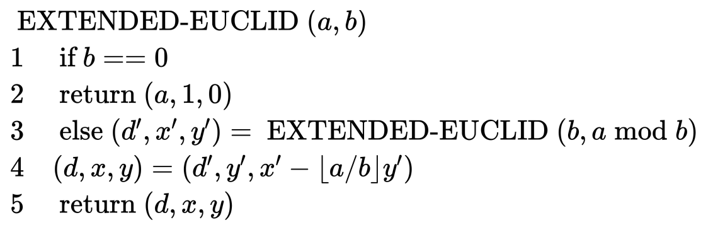
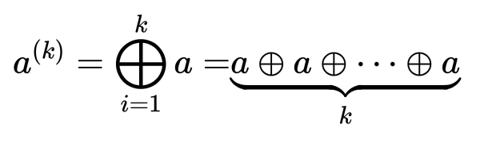
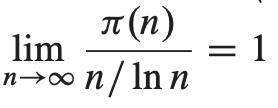

<head>
    
    
</head>

# Table of Contents

1.  [Algorithm](#org2ffed71)
2.  [Review](#orgb648148)
    1.  [抽象](#org629335f)
    2.  [简介](#org57d0bd8)
        1.  [目标](#org6908a3a)
        2.  [假设](#org25d0834)
        3.  [需要调整的观点](#org2f56d3d)
    3.  [条目](#orgd4563a0)
        1.  [串行化不相交领域](#org2979508)
        2.  [唯一键条目](#orgf3e050c)
        3.  [重分区和条目](#orga6865a7)
        4.  [原子交易和条目](#org66d4beb)
        5.  [考虑交替索引](#orgf625ca2)
    4.  [跨条目消息](#org11f0ec2)
        1.  [跨条目通讯的消息](#orgc02fd6b)
        2.  [异步发送交易](#orga16410e)
        3.  [命名目的消息](#orgcc5d5b6)
        4.  [重分区和消息转发](#orgd7ef6af)
    5.  [条目，SOA，对象](#org6da3877)
        1.  [条目和对象实例](#orgd9a98a1)
        2.  [消息 vs 方法](#orgc198200)
        3.  [面向条目和服务的架构](#org92549e7)
    6.  [活动：凌乱的消息](#org1410c41)
        1.  [重试和幂等](#org8414e6d)
        2.  [定义重大行为的幂等](#orgdfc2900)
        3.  [自然的幂等](#org1a17e08)
        4.  [用状态记录消息](#org9ae5ed7)
        5.  [活动：管理每个合作者的状态](#orgb7977db)
        6.  [确保通过活动最多接受一次](#org6c25c0d)
    7.  [活动：非原子拷贝](#org260f92c)
        1.  [距离上的不确定性](#orga2668bb)
        2.  [活动和管理不确定性](#orgf4e1e63)
        3.  [执行不确定的业务操作](#org0ef2fa2)
        4.  [不确定操作，确认和取消](#orgdc85fab)
        5.  [不确定和无穷扩展](#org4244be0)
    8.  [总结](#org92e424c)
3.  [Tips](#orgc959812)
4.  [Share](#orgf70079d)
    1.  [最大公约数](#orgfa8080b)
    2.  [模的算术](#org0ef6e3f)
    3.  [解模的线性等式](#orgce2b739)
    4.  [中国余数定理](#orgc17d9db)
    5.  [元素的幂](#orgccc7796)
    6.  [RSA公钥加密系统](#org5e043d9)
    7.  [质数条件测试](#orgef0fbdc)
    8.  [整数因子](#orgd616f2e)

# Algorithm

Leetcode 330: <https://leetcode.com/problems/patching-array/>

<https://medium.com/@dreamume/leetcode-330-patching-array-2477a76f40a0>

# Review

Life beyond Distributed Transactions: an Apostate’s Opinion

<http://www.ics.uci.edu/~cs223/papers/cidr07p15.pdf>

## 抽象

分布式交易包括2PC，Paxos和各种关于法定人数的协议已发展了几十年。这些协议提供给应用程序开发人员一个全局的顺序化。在我的部分职业生涯中我已经投入实现和使用平台提供的全局顺序保证相关工作。

我最近十年的经验使我专注于类似马奇诺防线那样的系统。一般来说，应用程序开发人员实现大规模可扩展性应用程序都假设为分布式交易。当他们尝试使用分布式交易时，项目因为性能成本和脆弱性问题使得无法正常工作。因此开始了自然选择&#x2026;应用程序开始使用不同的技术构建，不提供相同的交易保障但能满足商业需要。

本文探讨并命名一些世界上拒绝分布式交易的实现大规模紧急任务的应用程序实现。我们讨论使用适度尺寸应用程序数据管理，其可能随着应用程序增长进行数据分区。我们也讨论在这些可分区数据间发送消息的设计模型。

开始这些讨论的两个原因是提高新模型的知晓度。首先，我相信这会使人们开发大规模可扩展应用程序更加容易；其次，通过观察模型，希望工业界可创建平台使构建大规模应用程序更加容易。

## 简介

让我们检查本文的一些目标，为讨论我做的一些假设和从这些假设中推演的一些观点。因我对高可用性的痴迷，本文将忽略这样的问题并聚焦于可扩展性。特别地，我们将聚焦于假设我们不能有大规模可扩展分布式交易的争执。

### 目标

本文有3大目标：

1.  讨论可扩展应用程序
    
    许多设计可扩展系统的需求被许多应用程序设计者理解为谁构建大规模系统。
    
    问题是交易交互和可扩展系统的难点、概念和抽象还没有命名及很好地理解。当它们被应用时，它们非一致地应用，有时会反击到我们。本文的一个目标是启动一个讨论，使这些概念更明确，希望驱动一些共同的术语及对可扩展程序的同意意见。
    
    本文尝试命名和形式化多年来实现可扩展系统的一些抽象

2.  思考一些几乎无限扩展的应用程序
    
    为展开扩展性的讨论，本文呈现一个非正式的想法实验关于无穷扩展。我假设客户数，可购买条目，订单，发送物品，健康护理的病人，打的人，银行账户，和所有其他生意概念，随时间应用程序需要处理的事物快速增长。典型地，个人事物没有明显增长，我们只是简单地获得更多的东西。首先计算机被什么资源占满并不重要，需求的增加将驱动我们把之前运行在小型规模机器下改为运行在更大的机器集群。
    
    几乎无限的扩展是一种松散的、不精确的、无形的方法促使一些需要非常清晰，什么时候什么地方我们知道一些事情适合在一台机器上，如果我们不能确保它适合在一台机器应该怎么做。更进一步，我们想要扩展几乎线性的负载（数据和计算）。

3.  描述一些可扩展程序的通用模型
    
    什么是无穷扩展业务逻辑上的决定性的因素？我断言扩展意味着程序中使用一个新的抽象称为条目。一个条目在一个时间存活在一个机器中，应用程序一次只能操作一个条目。无穷扩展的结果是程序抽象必须导出到开发者的业务逻辑中。
    
    为命名并讨论该未命名的概念，希望我们对构建扩展性系统能有一致性编程和一致性的问题理解。
    
    更进一步地是，条目的使用意味着消息模型跟条目关联。这些使尝试构建可扩展解决方案的初级的应用程序开发者对状态机的创建必须考虑消息转发不一致的问题。

### 假设

我们开始三个假设，其都为断言而非已证明。我们基于经验简单假设它们为真。

-   应用程序的层和扩展不可知论
    
    让我们先预设每个可扩展应用程序至少有两层。这些层不同于扩展的直觉。它们可能有其他的不同但不在本文讨论中。
    
    应用程序的下层理解关于更多计算机添加来使系统扩展的事实。它管理映射上层代码到物理机器和位置。下层为理解该映射的扩展组件。我们预设下层提供一个可扩展编程抽象给上层。
    
    使用该抽象，应用程序上层代码的编写不用考虑扩展问题。通过该抽象，我们可编写应用程序代码而不用考虑增长的负载对应用程序的改变。
    
    这些应用程序的下层可能演变为新的平台或中间件，简化可扩展应用程序的创建。
    
    讨论的焦点为这些还出于早期的可扩展API的可能性。

-   交易序列化的领域
    
    大量学术工作在提供分布式系统间交易序列化。这包括2PC（两阶段提交），其在节点无效时容易阻塞和其他节点故障不阻塞的协议，比如Paxos算法。
    
    让我们描述这些算法为提供全局交易序列化的算法。它们的目标是允许在一系列机器之间任意的原子更新。这些算法允许更新在一系列机器之间存在单一的序列化。
    
    我们继续简单地考虑当不这么做时会发生什么。真实的系统开发者和真实系统很少会尝试在机器之间达成交易串行化，如果它们这么做，它将作为一系列紧密连接的机器工作即集群。简单地，我们不在机器间交易除非一些简单情况下作为集群，使其像一台机器一样工作。
    
    我们假设多个不相交的交易串行化。考虑每个机器为交易串行化的独立区域。每个数据项存在单个机器或集群中。原子交易可能包括交易串行化领域里的任意数据（例如在单一机器或集群中）。你不能执行这些不相交交易串行化间的原子交易。

-   多数应用程序使用“至少一次”消息
    
    如果你使用短活Unix类型进程，则TCP-IP是非常好的选择。但让我们考虑应用程序开发者的工作即处理消息和修改一些持久化的数据（在SQL数据库中或一些其他持久化存储中），其过程中面临的窘境。消息被消费但还没有知道。数据库更新然后消息被得知。故障时，重启然后消息被重新处理。
    
    困难源于消息转发不直接跟持久化数据更新和应用程序行为相关。它可能关联消息的消费和持久化数据更新，但这是无效的。这将导致消息转发多次。消息连接负责该情况因为它的其他资源偶尔会丢失消息（最多一次消息）及非常难处理。
    
    消息连接行为的结果是应用程序必须容忍消息重试及消息乱序。本文考虑应用程序模型当业务逻辑程序员在大多数大型应用程序中必须处理该难题。

### 需要调整的观点

写观点论文的好处是你可以表达开放的观点。这里是一些我们在本文中的有争议的部分：

-   可扩展应用程序使用唯一确定的条目
    
    本文讨论每个应用程序的上层代码必须操作一系列数据我们称为条目。这里对条目的数量没有限制除了它必须存活在单个串行化领域（例如，一个机器或集群）。
    
    每个条目有一个唯一的标识或键。一个条目键可能为任意形状，形式或风格但它唯一确定一个条目且数据包含在该条目中。
    
    条目的表达也没有限制。它可能存储在SLQ记录，XML文档，文件，文件系统中的数据，blob块或任何其他方便适合应用程序使用的形式。一个可能的表达为SQL记录集（可能跨多个表），主键以条目键作为开始。
    
    条目代表数据的不相交集。每条信息只存在一个条目中。条目的数据不会覆盖另一个条目的数据。
    
    应用程序由许多条目组成。例如，一个订单处理应用程序封装许多订单。每个订单用唯一的订单号确定。为了成为可扩展订单处理应用程序，一个订单的数据必须跟其他订单不会相交。

-   原子交易不能跨条目
    
    我们争论如下为什么我们要求原子交易不能跨条目。程序员对每次交易必须总是只处理单个条目中的数据。该限制对相同应用程序的条目和不同应用程序的条目都成立。
    
    从程序员的观点，唯一确定条目为序列化领域。该概念对应用程序扩展设计有深远影响。我们将探讨替代索引不能对无穷扩展设计保持交易一致性。

-   消息对应条目
    
    多数消息系统不考虑数据的分区键，但关联一个无状态进程的队列。
    
    标准的实践会包含一些数据在消息中，通知无状态应用程序代码去那里获得它需要的数据。这就是以上描述的条目键实现。条目的数据从一些数据库或应用程序的其他稳定存储中获取。
    
    一些有趣的趋势正在工业界发生。首先，单个应用程序条目集的大小增长过快而不能放入单个数据存储中。单个数据条目都能放入存储但它们的集合却不行。因此，无状态应用程序会基于一些分区方案来获取条目。其次，获取和分区方案被分割为应用程序的下层，故意隔离应用程序上层的业务逻辑。
    
    无状态Unix类型进程和应用程序下层会简单实现业务逻辑的可扩展API的实现部分。上层的可扩展业务逻辑简单处理消息为条目键，其唯一对应一个稳定状态的条目。

-   条目管理每个合作者状态（“活动”）
    
    可扩展消息为有效的条目对条目消息。发送条目（有稳定的状态及用它的条目键来唯一确定）发送一个消息，其指定了另一个条目。接收条目组合上层业务逻辑和稳定的数据代表其状态。
    
    记得我们假设了消息转发至少一次。这意味着接收条目必须在它的持久状态中准备好，以忽略冗余的消息。实际上，消息分为两种类别：影响接收条目状态及不影响的。不影响的消息处理起来很容易哦，它们是幂等的。那些影响状态的消息才是设计上的挑战。
    
    为确保幂等（例如，确保处理重试消息为无害的），接收条目通常设计为记住已处理的消息。这样，重复的消息将产生一个新的响应（或输出消息）模拟之前处理过的消息的行为。
    
    接收到的消息的状态会以每个合作者为基础进行包装。这里的键观察即为合作者组织的状态，这里合作者为条目。
    
    我们应用活动这个术语表述每个合作者的消息在两合作者之间每边的关系。每个活动存活于一个条目中。一个条目对它收到的消息的每个合作者条目有一个活动。
    
    为管理消息混乱，活动用来管理松对同意机制。在现实世界中原子交易是不可能的，不确定的操作用来协调一个共享的输出。这些执行在条目中，被活动管理。
    
    本文不断言活动可解决著名的达成同意的挑战。我们指出无穷扩展导致奇怪的很好的工作流类型解决方案。参与者为条目且每个条目管理它的工作流，使用包含其他条目的一些知识。该两部分知识维持在条目内部即被我们称为活动。
    
    活动的例子有一些微妙。一个订单程序会发送消息给运输程序并包含运单id和发送的订单id。消息类型用来模拟运输程序中的状态改变，记录某个订单为准备运输。实现不设计重试直到bug发生。很少情况下，应用程序设计师会想到并计划设计活动。

本文余下章节将检测这些断言并提出这些选项的讨论和解释。

## 条目

本节检测条目的一些属性。我们首先考虑用单个条目保证原子交易。其次，我们考虑使用唯一的键来访问条目并说明这会如何授权应用程序底层重分区时来定位条目。之后，我们考虑单个原子交易中什么能被访问，最终，检测无穷扩展在交替索引上的细节。

### 串行化不相交领域

每个条目定义为带一个存活在单个串行化领域里的唯一的键的数据集。因为它存活于串行化的单个领域，我们确定我们在一个条目内总是原子操作。

因此给条目这样一个不同于对象的名称是必要的。对象可能或不可能共享交易领域。条目不会共享交易领域因为重分区可能把它们分布于不同的机器。

### 唯一键条目

应用程序上层代码设计为带唯一键的数据的集。我们可以在应用程序中看到用户id，社会安全号，产品SKU，和其他唯一确认号。它们使用键来定位实现应用程序的数据。这是自然的范型，我们观察到实际上唯一键总是能够确定不相交串行化领域的边界。

### 重分区和条目

我们的一个假设是上层的出现是扩展和底层决定扩展改变时如何发展适应需求的演变。这意味着特定条目的位置很可能随着发展演变改变。应用程序的上层不会假设条目的位置因为这样不利于扩展。

### 原子交易和条目

在可扩展系统中，你不能假设交易更新跨不同的条目。每个条目有唯一的键且每个条目能很容易地放入一个串行化领域。如何知道两个不同条目能保证在相同的串行化领域（因此，原子更新）？你只知道什么时候有一个唯一的键。

如果我们使用哈希条目键来分区，当两个不同键的条目不会在相同的盒子中。如果我们使用键范围分区条目键，多数时间相邻键值位于相同的机器上但一旦你不走运，你的邻居会在另一台机器上。一个简单的测试例子为当代码重新开发后，移动条目到不同的串行化领域将导致更新不再是原子的。你不能统计在同一个机器上的不同条目键值对。

更简单来说，应用程序底层将确保每个条目键（及条目）在同一个机器（或集群）上。不同的条目可能在任何地方。

一个可扩展编程抽象必须有条目作为原子边界。为理解条目作为编程抽象的存在，条目键的使用，和清楚的提交来假设条目间原子的缺乏必须提高一个可扩展应用程序上层。

可扩展应用程序在如今工业界就是这么做的。我们只是没有条目这个概念的名称。从一个应用程序上层来看，它必须假设条目在串行化领域中。假设当开发变动时，更多的东西会变动。

### 考虑交替索引

我们习惯于用多个键或索引定位数据。例如，有时候我们通过社会安全号引用一个客户，有时候通过信用卡号，有时候用街道地址。如果我们假设可扩展大数据，这些索引不能存放于同一台机器或集群上。单个客户的数据不能知道存放于哪个串行化领域。条目本身是可存放于单个串行化领域的。挑战是信息拷贝用来创建交替索引必须假设存放于不同的串行化领域。

考虑保证交替索引存放于相同的串行化领域。当无限扩展开始且条目集合扩散到巨量的机器中，主索引和交替索引信息必须存放于相同的串行化领域中。我们如何确定这个事情呢？唯一的方法是确保它们都存活在相同的领域中，使用主键来定位交替索引。如果我们无主键，并查找所有的串行化领域，每个交替索引查找必须检查无穷数量的领域来匹配该交替键。这将是不现实的。

唯一的逻辑交替是做两次查找。首先，我们查找交替键并定位条目键，然后，我们使用条目键访问条目。这很像关系型数据库通过交替键用两步来访问记录。但我们无穷扩展的想法意味着两个索引（主和交替）不能确定存放于相同的串行化领域。

可扩展应用程序不能原子的更新一个条目和它的交替索引。可扩展应用程序上层必须设计理解交替索引跟条目主键索引访问条目可能是不同步的。

过去自动管理交替索引的应用程序现在必须改为手动管理。工作流类型的更新跟异步消息为无限扩展应用程序所能使用的手段。之前同交替键访问数据现在必须得改为注意理解数据表示条目的实现可能会不同步。之前实现的交替索引功能现在会更困难。这是现在巨型系统中的残酷事实。

## 跨条目消息

本章节中我们将考虑使用消息连接独立条目的意义。我们检查命名、交易和消息，消息转发语法和考虑在这些消息转发语法下重分区条目定位的影响。

### 跨条目通讯的消息

如果你不能更新在交易中跨两个条目的数据，你需要一个机制更新不同交易的数据。条目间的连接通过消息。

### 异步发送交易

因为消息跨条目，带发送消息决定的数据在一个条目中且消息的目的在另一个条目。通过条目的定义，我们必须假设它们不能自动更新。

对应用程序开发者来说交易中发送消息可能会很复杂，消息已发送，而交易可能被取消。这意味者你没有触使一些事情发生而却发生了。因此，交易消息队列是有必要的。

如果消息不能被目标看到直到交易提交，我们看到消息跟发送交易异步。每个条目更新交易状态。消息从一个交易触发并到达一个新的条目。

### 命名目的消息

考虑编程应用程序可扩展部分作为一个条目想要发送一个消息给另一个条目。目的条目的位置对可扩展代码是不可见的，只有条目键可见。

应用程序可扩展组件部分关联条目键到条目的位置。

### 重分区和消息转发

当应用程序可扩展部分发送一个消息，底层扩展组件部分搜索目标并转发消息至少一次。

因系统扩展，条目移动。这通常称为重分区。条目数据的位置因此会持续变化。有时候，消息会在老位置查找来希望找到该条目。

当条目移动后，发送者和目的之间先进先出的队列的清晰度会偶尔中断。消息会重复。后面的消息可能先到。

因此，我们看到可扩展应用程序已演化为支持所有应用程序可见消息幂等处理。这意味着消息转发重排序。

## 条目，SOA，对象

本节对比本文的思想和面向对象、面向服务的差异。

### 条目和对象实例

有人会问：“条目和对象实例有什么不同？“回答不是非白即黑。对象有很多种形式，一些是条目，其他则不是。有两个重要的区分。

首先，被对象封装的数据必须严格区分其他数据。其次，不相关数据不能跟其他数据原子更新。

一些对象系统有数据库对象的不明确封装。这些内容不清晰且非小心强制地，这些对象则不是条目。一些时候，可使用材料的观点和交替索引。当你的系统尝试扩展且你的对象不是条目时这些不能持久。

许多对象系统允许通过交易范围来扩展对象。这种编程方式能方便地消除本文里描述的大多数挑战。不幸地是，在无限扩展中除非你的交易配对对象总是能够被搭配，否则这样是不起作用的。为此，我们需要赋给它们一个共同的键来确保重定位和识别两个交易搭配对象为相同条目的部分。

对象很好但它们是不同的抽象。

### 消息 vs 方法

方法调用通常跟调用的线程同步。它们也跟调用对象的交易同步。被调用的对象可能也不可能跟调用对象原子匹配。典型的方法调用不会原子记录意图来调用一个消息和保证被调用消息的至少一次调用。一些系统封装消息发送为一个方法调用，我们考虑这些为消息，而不是方法。

我们不考虑在聚合和绑定方法里不同消息的区别。我们简单指出交易边界为异步。

### 面向条目和服务的架构

本文讨论的内容支持SOA。大多数SOA实现接受独立的交易跨服务。

SOA主要的加强是每个服务都会面临无限扩展，并需要一些观察。这些SOA里跨服务的观察及这些独立的服务是设计为独立扩展的。

## 活动：凌乱的消息

本节讨论消息重试和乱序的挑战。我们引入活动记号作为本地信息，需要管理合作者条目的关系。

### 重试和幂等

因为任意消息可能转发多次，我们需要一条应用程序规则来处理重复消息。通过构建底层支持来消除重复消息是可能的，在无限扩展环境下，底层支持需要知道条目。当重分区时，哪条消息被转发到条目的信息必须跟条目一起移动。事实上，该信息的底层管理很少出现，消息可能被转发多次。

典型地，无穷扩展应用程序的高层部分必须实现确保接受的消息幂等的机制。重复消除可构建到应用程序扩展组件部分里。然而，目前还不行。因此，我们考虑扩展应用程序程序员必须实现的东西。

### 定义重大行为的幂等

消息处理是幂等的，即当随后的处理执行不会对条目产生重大变动。这是个模糊的定义，可使应用程序指导说明进行描述。

如果消息不改变被调用的条目，只是读信息，该处理是幂等的。即使日志记录描述该读为写，我们考虑这也是幂等的。日志记录对条目的行为来说是不重要的。应用程序指导说明会定义什么是重要的，什么不是。

### 自然的幂等

为实现幂等，消息不引起重大的副作用是必要的。一些消息在处理的任何时刻都不会引起重要的影响。这些就称为自然幂等。

一个消息只从条目中读取一些数据则为自然幂等。如果处理消息改变了条目，但是是已一种不重要的方式，则也是自然幂等。

现在变得更加困难了。一些消息事实上引起了重大的改变。这些消息不是自然幂等的。应用程序必须包含机制来确保它们幂等。这意味着消息需要被记住，被处理后接下来的尝试不会导致重大的改变。

这就是我们接下来要考虑的非自然幂等消息的处理。

### 用状态记录消息

为确保幂等处理非自然幂等消息，条目必须记住已处理的这类消息。这些信息即为状态。状态随着消息处理累积。

如果需要消息回复，必须回复的是相同的回复。最后，我们不知道原始的发送者是否已收到回复。

### 活动：管理每个合作者的状态

为跟踪关系和接收到的消息，无穷扩展应用程序里的每个条目必须记住合作者的状态信息。它必须捕获基于合作者基础的合作者状态。我们称该状态为活动。每个条目如果跟许多其他条目交互的话会有很多活动。活动跟踪每个合作者的交互。

每个条目由一系列活动组成，可能还有一些扩展活动的数据。

在无穷扩展应用程序中，你需要非常清楚关系，因为你不能查询来知道关系是怎样的。每个事物必须通过两部分关系网络结合到一起。结合使用条目键，因为合作者在另一端，你必须管理你理解的合作者状态作为合作者到达的新知识。你通过活动了解有关远端合作者的本地信息。

### 确保通过活动最多接受一次

处理不是自然幂等的消息需要确保每个消息处理至多一次（例如，消息重大的影响必须发生最多一次）。为实现这样，必须有一些需要记住的唯一的消息特征确保它不会被处理超过一次。

当消息不会有重大影响时条目必须记住消息带的交易为成功来处理进状态。

典型地，一个条目将使用它的活动来实现基于合作者基础的合作者状态管理。这是必须的因为一些时候一个条目支持多个不同的合作者且每个将通过一种模型的消息关联关系。通过获得每个合作者状态集合，程序员可聚焦于每合作者的关系。

断言通过聚焦每个合作者的信息，会容易地构建可扩展应用程序。一个例子就是实现支持幂等消息处理。

## 活动：非原子拷贝

本节处理如何扩展系统在非分布式交易的情况下做决策。

本节的重点是管理分布式同意的困难工作。此外，在无穷扩展环境下，不确定性的表征必须在面向每合作者关系的情况下很好的完成。数据在条目中通过活动进行管理。

### 距离上的不确定性

分布式交易的缺失意味着我们必须接受不确定性，因为我们尝试跨不同的条目作出决策。跨分布式系统的决策包括接受一段时间的不确定性。当分布式交易可以被使用时，不确定性是明显的，锁锁住数据，并被交易管理者管理。

在非分布式交易的系统中，不确定性的管理必须实现在业务逻辑中。不确定性的输出保持在业务语义而不是记录锁。这是简化的工作流。因为我们不能使用分布式交易所以我们需要使用工作流。

让我们引向条目和消息的假设使我们得到结论扩展应用程序必须使用工作流管理不确定性，如果它需要跨多个条目达成一致的话。

### 活动和管理不确定性

当条目与其他条目交互时，有时接受不确定的结果。该不确定必须被基于合作者与合作者的基管理，其一可以可视化作为在合作者活动状态中真实的东西。

经常，不确定被表征为关系。它需要被合作者跟踪。当每个合作者进入新状态，活动跟踪这个改变。

### 执行不确定的业务操作

为使条目达成同意意见，一个条目需要询问另一个条目接受一些不确定。该过程通过发送一个消息请求一个提交，并允许取消。这称为一个不确定操作且它表示为消息在两个条目间流动。该步骤最后，一个条目同意接受另一个条目的请求。

### 不确定操作，确认和取消

对于不确定操作，可以取消。有时，条目请求不确定操作决定是否继续。这被称为取消操作。当取消操作取消，则为确认操作。每个不确定操作最终确认或取消。

当一个条目同意执行一个不确定操作，它同意让另一个条目决定输出。条目接受不确定并添加该通用混淆经验。当确认和取消到达时，则不确定性降低。通常旧问题的增加和下降不确定动作到来同时新的问题也同时被处理。

这是一种简单的工作流，但这是一种非常好的把条目作为参与者的工作流。

### 不确定和无穷扩展

扩展有趣的地方是不确定管理通常演变为两方的同意。经常出现多个两方同意发生。如同web一样使用条目键作为链接及活动作为跟踪远端合作者状态。

当考虑无穷扩展，可以认为它是一种两部分关系。通过从两部分不确定/取消/确认中构建，我们看到分布式同意是如何达成的。如同在担保公司，许多条目通过组合可能参与该同意过程。

因为关系为两部分，活动的简单概念作为“我记住的合作者“变成管理各种系统的基础。即使当数据存储在条目中且你不知道数据在哪，必须假设它不在本地，这样可用扩展方式编程。

真实世界中无穷扩展应用程序喜欢两阶段提交的全局串行化领域及其算法。不幸地是，其脆弱性导致有效性上有不可接受的压力。管理不确定的不确定工作使开发者不得不在扩展应用程序中体验。它必须如积压产品般处理。

## 总结

通常，计算机工业在不停更新。扩展应用程序的一个趋势是数据规模无法放入一台机器或集群中。如同我们所见，一个特殊解决方案是单个应用程序先合并然后观察一般模型。基于这些模型，新的构建工具使业务逻辑创造更容易。

在1970年代，许多大规模扩展应用程序困难在于需要提供处理多在线终端的多路业务解决方案。出现的终端控制模型被和一些高末端应用程序演变成TP监控。最终，这些模型重复创建发展成TP监控。这些平台允许业务逻辑开发人员聚集在他们最擅长的地方：开发业务逻辑。

今天，我们看到新的设计压力对于程序员变成简单地解决业务问题。这些现实使他们进入无穷扩展并强制他们设计问题跟实际业务不相关。

不幸地是，程序员努力尝试解决业务目标例如电子商务、供应链管理、金融和健康应用程序需要考虑非分布式扩展。他们这样做因为尝试使用分布式交易是脆弱的且执行性差。

我们所在的时刻即是构建这些应用程序的模型已出现但没有一个能持久地应用。本文讨论这些早期模型能被更持久地应用于无穷扩展的应用程序手工设计。更进一步，最近几年我们很可能看到新的自动管理这些应用程序的中间件或平台的发展及用一种类型编程范式消除应用程序扩展挑战。这些平行的出现在1970年代的TP监控。

在本文中，我们引入命名了在大规模扩展应用程序中的形式：

-   条目为命名的数据集合，可以自动更新条目但不能原子的跨条目更新
-   活动组合条目用来管理单个合作者条目的消息关系的状态集

工作流用来达成决定，像多年讨论地那样，函数位于条目里的活动中。工作流出现在无穷扩展中是很自然的。

讨论许多应用程序用条目和活动进行设计。它们既不形式化也不一致性使用。当不一致使用时，bug出现并最终用补丁解决。当讨论和一致使用这些模型，更好的大规模扩展应用程序会被构建，像一个工业品，我们能构建解决方案允许业务逻辑程序员聚焦于业务问题而不是扩展问题。

# Tips

-   有些书中习题可能就是从本章知识中不容易解决，需要参考其他书籍，不能指望作者给出的习题刚好就是本章内容能解决，有可能有部分知识超纲

# Share

《算法导论》31章 数论算法

跳过前面介绍基础部分，我们直接进入比较关键或有趣的内容。

## 最大公约数

我们引入求最大公约数的Euclid算法：

    EUCLID(a, b)
    1  if b == 0
    2      return a
    3  else return EUCLID(b, a mod b)

该算法时间复杂度跟斐波那契数有关，定理31.11:

对任意整数k >= 1，如果a > b >= 1且b < Fk+1，则EUCLID(a, b)递归执行次数少于k次

我们现在重写Euclid算法来计算一些额外的有用信息。我们扩展算法计算整数系数x和y，使

    d = gcd(a, b) = ax + by

注意x和y可以为0或负数。

算法如下：

## 模的算术

先定义有限群：

群(S, ⊕)为集合S及S上的二元操作符⊕，满足如下属性：

1.  闭合：对任意a, b ∈ S，我们有a ⊕ b ∈ S
2.  单位元：存在一个元素e ∈ S，称为群的单位元，对任意a ∈ S，e ⊕ a = a ⊕ e = a
3.  交换性：对任意a, b, c ∈ S，有(a ⊕ b) ⊕ c = a ⊕ (b ⊕ c)
4.  倒数：对每个a ∈ S，存在唯一的元素b ∈ S，称为a的倒数，a ⊕ b = b ⊕ a = e

如果该群满足交换律，即对任意a, b ∈ S，有a ⊕ b = b ⊕ a，则称其为阿贝尔群。如果 $ \| S \| < \\infty $ ，则为有限群。

定理31.13:

系统(Zn\*, .n)是一个有限阿贝尔群。

这里集合Zn\*的元素为

Zn\* = {[a]n ∈ Zn : gcd(a, n) = 1}

二元操作符为两元素相乘再对n取模。

例如：Z15\* = {1, 2, 4, 7, 8, 11, 13, 14}。

Zn\*的元素总个数定义为φ(n)，该函数被称为欧拉的phi函数，满足如下等式：

例如：φ(45) = 45 (1 - 1/3) (1 - 1/5) = 45 (2/3) (4/5) = 24

如果(S, ⊕)是一个群，S' ⊆ S, 且(S', ⊕) 也是一个群，则(S', ⊕) 是 (S, ⊕)的一个子群。

定理31.14 （一个有限群的非空闭合子集是一个子裙）

如果(S, ⊕)是一个有限群且S'是集合S的任意非空子集，对任意a, b ∈ S', 有a ⊕ b ∈ S'，则(S', ⊕) 是(S, ⊕)的一个子群。

定理31.15 （拉格朗日定理）

如果(S, ⊕) 是一个有限群且(S', ⊕) 是(S, ⊕)的一个子群，则 \| S' \| 是\| S \|的除数。

引理31.16

如果S'是有限群S的子群，则 $ \| S' \| \\leq \\frac{\| S \|}{2} $ ;

定理31.14给我们提供了一个简单的方法来生成一个有限群(S, ⊕)的子群：选择一个元素a并用群操作符从a产生所有的元素。对k >= 1，定义a(k) ：

例如：我们让a = 2，群为Z6，则序列a(1) , a(2) ,a(3) , &#x2026;为2, 4, 0, 2, 4, 0, 2, 4, 0, &#x2026;

在群Zn 中，我们有a(k) = ka mod n，且在群zn\* 中，我们有a(k) = ak mod n，我们定义元素a生成的子群，记为<a> 或(<a>, ⊕)，<a> = {a(k) : k >= 1}

我们说a生成子群<a>或a是子群<a>的生成器。因S是有限的，<a>是S的有限子集，可能包含S的所有元素。因⊕的交换律，有a(i) ⊕ a(j) = a(i + j)

<a>是闭合的，因此，<a>是S的子群。例如：Z6，我们有

<0> = {0},

<1> = {0, 1, 2, 3, 4, 5}

<2> = {0, 2, 4}

同样的，Z7\* ，我们有：

<1> = {1},

<2> = {1, 2, 4},

<3> = {1, 2, 3, 4, 5, 6}

S群中a的序，记为ord(a)，定义为最小的正整数t，a(t) = e

定理31.17

对任意有限群(S, ⊕)和任意a ∈ S，a的序跟它生成的子群的大小相等，即ord(a) = \| < a > \|

引理31.18

序列a(1) ，a(2) ，&#x2026;以t = ord(a)为周期；即a(i) = a(j) 当且仅当i ≡ j(mod t)

引理31.19

如果(S, ⊕)为有限群，单位元为e，则对任意a ∈ S，有a(|S|) = e

## 解模的线性等式

定理31.20

对任意正整数a和n，如果d = gcd(a, n)，则在Zn 中，< a > = < d > = {0, d, 2d, &#x2026;, ((n / d) - 1)d}，且 $ \| < a > \| = \\frac{n}{d} $

引理31.21

等式ax ≡ b (mod n) 可解当且仅当d\| b，d = gcd(a, n)

引理31.22

等式ax ≡ b (mod n) 要么有d个不同的解，d = gcd(a, n)，要么无解

定理31.23

设d = gcd(a, n)，假设d = ax' + ny'，如果d \| b，则ax ≡ b (mod n)有一个解为x0，x0 = x'(b / d) mod n

定理31.24

假设等式ax ≡ b (mod n)可解，即d\| b，d = gcd(a, n)，且x0 是该等式的解。则该等式有d个不同的解，xi = x0 + i(n / d)，i = 0, 1, &#x2026;, d - 1

    MODULAR_LINEAR_EQUATION_SOLVER(a, b, n)
    1  (d, x', y') = EXTENDED_EUCLID(a, n)
    2  if d | b
    3      x_0 = x'(b / d) mod n
    4      for i = 0 to d - 1
    5          print (x_0 + i(n / d)) mod n
    6  else print "no solutions"

引理31.25

对任意n > 1，如果gcd(a, n) = 1，则等式ax ≡ b (mod n)有一个唯一解。

引理31.26

对任意n > 1，如果gcd(a, n) = 1，则等式ax ≡ 1 (mod n)有唯一解，否则无解。

## 中国余数定理

定理31.27 （中国余数定理）

设n = n1 n2 &#x2026; nk ，ni 为相互prime，考虑a <-> (a1 , a2 , &#x2026;, ak )，a ∈ Zn ，ai ∈ Zni ，且ai = a (mod ni ) ，可推得如果a <-> (a1 ,a2 , &#x2026;, ak )，b <-> (b1 ，b2 ，&#x2026;, bk )，则(a + b) mod n <-> ((a1 + b1 ) mod n1 , &#x2026;, (ak + bk ) mod nk )，(a - b) mod n <-> ((a1 - b1 ) mod n1 , &#x2026;, (ak , bk ) mod nk )，(ab) mod n <-> (a1 b1 mod n1 , &#x2026;, ak bk mod nk )

引理31.28

如果n1 , n2 , &#x2026;, nk 互质，n = n1 n2 &#x2026; nk ，则对任意整数a1 ,a2 ,&#x2026;, ak , x ≡ ai (mod ni )，i = 1, 2, &#x2026;, k有一个唯一的解x mode n。

引理31.29

如果n1 , n2 , &#x2026;, nk 互质，n = n1 n2 &#x2026; nk ，则对所有整数x和a, x ≡ a(mod ni )，i = 1, 2, &#x2026;, k当且仅当x ≡ a (mod n)

## 元素的幂

定理31.30（欧拉定理）

对任意整数n > 1，任意a ∈ Z\*n ，有aφ(n) ≡ 1 (mod n)

定理31.31 （费马定理）

如果p是质数，任意a ∈ Z\*p ， 有a(p-1) ≡ 1 (mod p)

如果ordn (g) = \| Z\*n \|，则Z\*n 中每个元素都是g的幂，模上n，则g为原始根或Z\*n 的生成器。例如，3是原始根，模7，但2不是原始根，模7。如果Z\*n 有一个原始根，则群Z\*n 为可循环的。

定理31.32

对所有质数p > 2且所有正整数e，n > 1，Z\*n 为可循环的根为2，4，pe ，2pe

定理31.33

如果g是Z\*n 的原始根，则等式gx ≡ gy (mod n)当且仅当x ≡ y (mod φ(n))

定理31.34

如果p是一个奇的质数且e >= 1，则等式x2 ≡ 1 (mod pe )只有两个解，x = 1和x = -1

引理31.35

如果存在一个1的非平凡平方根，模n，则n不是质数

接下来我们给出ab 模n的快速算法：

    MODULAR-EXPONENTIATION(a, b, n)
    1  c = 0
    2  d = 1
    3  let <b_k, b_k-1, ..., b_0>为b的二进制表示
    4  for i = k downto 0
    5      c = 2c
    6      d = (d * d) mod n
    7      if b_i == 1
    8          c = c + 1
    9          d = (d * a) mod n
    10 return d

## RSA公钥加密系统

在公钥加密系统中，每个参与者有一个公钥和一个私钥，参与者"Alice"和"Bob"作为例子，我们记Alice的公钥和私钥为PA ，SA ，Bob的公钥和私钥为PB ，SB

记任意消息M，有M = SA (PA (M))，M = PA(SA (M))

假设Bob用Alice的公钥加密一个消息M，即C = PA (M)，加密后的内容C在网络中传输，假设一个偷听者截获了该内容C，但由于他没有Alice的私钥，则无法获得原始的M，而Alice收到内容C后，用他的私钥解密得到M = SA (C) = SA (PA (M))。

另一个应用是数字签名，假设Alice发送一个消息M'，并用私钥做加密生成一个签名σ，σ = SA (M')，Alice然后发送这个消息/签名对给Bob，Bob收到后用Alice的公钥验证M' = PA (σ)，如果等式成立，则Bob确认消息M'确实是被Alice签名的，否则要么消息M'或签名σ在传输过程中被破坏要么该消息对为非法的拷贝。

在RSA公钥系统中，参与者创建他或她的公私钥步骤如下：

1.  随机选择两个大质数p和q，p != q，p和q可能为1024 bits
2.  计算n = pq
3.  选择一个小的奇整数e，跟φ(n)互质，根据定理31.20，φ(n)值为(p - 1)(q - 1)
4.  计算d作为e的倒数，模φ(n)（引理31.26确保d存在且唯一定义）
5.  发布P = (e, n)作为参与者的RSA公钥
6.  使S = (d, n)作为参与者的RSA私钥

用公钥P = (e, n)来转换消息M，即P(M) = Me mod n，用私钥转换加密内容C，即S(C) = Cd mod n

证明：

根据本节内容，我们有对任意M ∈ Zn ，P(S(M)) = S(P(M)) = Med (mod n)

因为e和d对于模φ(n) = (p - 1)(q - 1) 互为倒数，有ed = 1 + k(p - 1)(q - 1)，k为某整数。

如果M != 0 (mod p)，我们有

Med ≡ M(Mp-1 )k(q-1)      (mod p)

≡ M((M mod p)p-1 )k(q-1)    (mod p)

≡ M(1)k(q-1)        (mod p)  （定理31.31）

≡ M     (mod p)

同样，对任意M，如果M ≡ 0 (mod p)，则Med ≡ M (mod p)，同样，Med ≡ M (mod q)

根据中国余数定理的引理31.29，有Med ≡ M (mod n)

## 质数条件测试

质数分布函数π(n)表示小于等于n的质数个数。例如，π(10) = 4

定理31.37 （质数定理）

设Z^+n 为Zn 的非空元素：Z^+n = {1, 2, &#x2026;, n - 1}。如果n为质数，则Z^+n = Z\*n

我们说n是基于a的伪质数，如果n不是质数且an-1 ≡ 1 (mod n)。如果n是质数，根据费马定理（定理31.31）对Z^+n 中任意a，则n满足该等式。这样，如果我们找到任意a ∈ Z^+n 使n不满足该等式，则n不是质数。特别地，反过来也大多数成立，这样我们可以用来作为测试质数的条件。我们测试对于a = 2是否n满足该等式。如果不满足，我们定义n为非质数，否则我们猜测其为质数（事实上，我们知道n要么为质数要么为基于2的伪质数）。

    PSEUDOPRIME(n)
    1  if MODULAR_EXPONENTIATION(2, n - 1, n) != 1 (mod n)
    2      return 非质数
    3  else return 质数    // 我们希望是

当n为基于2的伪质数时，该程序出错。该程序出错的频率如何呢？非常罕见，对于小于10,000的数只有22个为伪质数，前4个为341，561，645和1105。

Miller-Rabin 质数条件测试克服了伪质数测试的问题，做了两个修改：

-   它尝试几个随机选择的基值a而不是一个
-   当计算模的幂时，它在最后一系列平方处理中查找一个1的非平凡平方根，模n。如果找到，则停止并返回非质数

Miller-Rabin的伪代码使用一个辅助过程WITNESS，WITNESS(a, n)为真当且仅当a是非质数n的一个见证，即使用a证明n为非质数。

WITNESS(a, n)

1 $ \\quad $ 设t >= 1，u为奇数，且n - 1 = 2t u

2$ \\quad $   x0 = MODULAR_EXPONENTIATION(a, u, n)

3 $ \\quad $  for i = 1 to t

4 $ \\quad \\quad \\quad $      xi = x2i-1 mod n

5 $ \\quad \\quad \\quad $      if $ x_{i} = 1 $ 且 $ x_{i-1} \\neq 1 $ 且 $ x_{i-1} \\neq n - 1 $

6 $ \\quad \\quad \\quad \\quad \\quad $          return TRUE

7 $ \\quad $ if xt != 1

8 $ \\quad \\quad \\quad $     return TRUE

9 $ \\quad $ return FALSE

WITNESS伪代码计算an-1 mod n，首先第2行计算x0 = au mod n，然后在3-6行循环中平方结果t次。在第i次中，计算满足等式xi ≡ au2i (mod n)。

如果WITNESS在第6行返回真，则它发现xi-1 是一个1的非平凡根，模n，因为有xi-1 != 1或-1 (mod n)，而xi ≡ x2i-1 ≡ 1 (mod n)。引理31.35表述了只有n为非质数才存在1的非平凡平方根，模n，所以n为非质数。

现在我们给出Miller-Rabin的伪代码，我们假设n是一个奇的整数，且大于2:

    MILLER-RABIN(n, s)
    1  for j = 1 to s
    2      a = RANDOM(1, n - 1)
    3      if WITNESS(a, n)
    4          return 非质数
    5  return 质数    // 大多数情况下是对的

定理31.39

对任意奇整数n > 2且正整数s，Miller-Rabin(n, s)错误的概率最多为2-s

## 整数因子

假设我们有一个整数n我们想要因式分解它，即把它分解为质数之积。之前章节的质数测试可以计算n是否为质数，但它不能告诉我们n的因式分解。整数的因式分解是非常困难的，即使是现在的超级计算机和用最好的算法，也不能很好的分解一个1024位的整数。

尝试除到R的所有整数可以保证完全分解直到R2 的整数。如下的Pollard's rho过程分解任何整数直到R4 （除非我们非常不幸）。该过程运行时间和成功都无法保证，但在实际中该过程非常有效。另一个优点是该过程只使用常量内存即可。

POLLARD-RHO(n)

1 $ \\quad $  i = 1

2 $ \\quad $ x1 = RANDOM(0, n - 1)

3 $ \\quad $ y = x1

4 $ \\quad $ k = 2

5 $ \\quad $ while TRUE

6 $ \\quad \\quad \\quad $    i = i + 1

7 $ \\quad \\quad \\quad $     xi = (x2i-1 - 1) mod n

8 $ \\quad \\quad \\quad $     d = gcd(y - xi , n)

9 $ \\quad \\quad \\quad $     if d != 1 and d != n

10 $ \\quad \\quad \\quad \\quad \\quad $        print d

11$ \\ \\quad \\quad $      if i == k

12 $ \\ \\quad \\quad \\quad \\quad $         y = xi

13 $ \\ \\quad \\quad \\quad \\quad $         k = 2k

