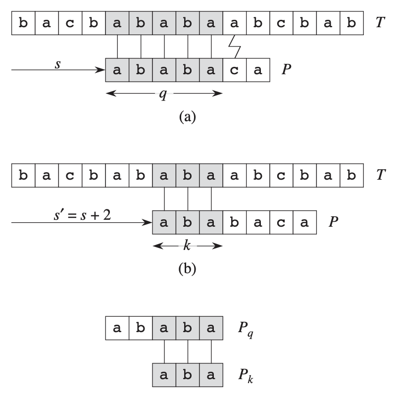

# Table of Contents

1.  [Algorithm](#orgbc30670)
2.  [Review](#orgc464d80)
3.  [Tips](#orgbb42df9)
4.  [Share](#orgc39a193)
    1.  [Rabin-Karp算法](#org9a88bd5)
    2.  [有限状态机](#orgbe83851)
    3.  [KMP算法](#orgf857860)

# Algorithm

Leetcode 332: <https://leetcode.com/problems/reconstruct-itinerary/>

<https://medium.com/@dreamume/leetcode-332-reconstruct-itinerary-c14989dceb32>

# Review

Bully algorithm

<https://en.wikipedia.org/wiki/Bully_algorithm>

在分布式计算中，bully算法是从一组分布式机器进程中动态选举协调者或领导者的方法。从非故障进程中有最高进程ID号的进程被选举为协调者。

算法假设：

-   系统是同步的
-   进程会在任意时刻故障，包括执行算法期间
-   进程故障会停止运行并重启
-   有一个故障检测器检测故障进程
-   进程间消息转发是可靠的
-   每个进程知道它自己的进程id和地址，及其他进程

算法使用如下消息类型：

-   选举消息：发送宣布选举
-   答复（活跃）消息：响应选举消息
-   协调者（胜利）消息：选举的胜出者发送的宣誓胜利的消息

当一个进程P从故障中恢复，或故障检测器显示当前协调者故障，P执行以下行为：

1.  如果P有最高的进程ID，它发送一个胜利消息给所有其他进程并变成新的协调者。否则，P广播一个选举消息给其他所有进程ID号比它高的进程
2.  如果P发送一个选举消息后没有收到回复，则它广播一个胜利消息给所有其他进程并变成协调者
3.  如果P接受到一个更高进程ID的进程的回复消息，它不再发送这次选举的消息并等待一个胜利消息（如果一段时间后没有胜利消息，它重新开始进程）。
4.  如果P收到另一个进程ID号比它低的进程的选举消息，它发送一个回复消息并开始一个选举过程（发送一个选举消息给高进程ID的进程）。
5.  如果P收到一个协调者消息，它则把发送者作为协调者。

分析

安全性

安全属性期望领导者选举协议这样，每个非故障进程要么选举一个进程Q，要么不选举任何进程。注意所有进程选举一个领导者必须确定选举的是同一个进程Q作为领导者。Bully算法满足该属性（在系统模型指定下），且组中两个进程在任意时刻对谁是领导者不会有冲突的看法，除非在选举中。如果不是这样，会存在两个进程X和Y，都发送协调者消息给组内。这意味着X和Y必须互相发送协调者信息。但这不可能发生，因为在发送协调者消息之前，选举消息已被两个进程交换，低进程ID的进程不会发送协调者消息。

活跃

活跃在同步，崩溃恢复模型中也能得到保证。考虑将成为领导者的进程在发送回复消息之后发送协调者消息之前故障。如果它没有在低进程ID的进程超时时间之前恢复，这些进程中的一个会最终变成领导者（即使一些进程崩溃）。如果故障进程及时恢复，它简单地发送协调者消息给组内。

网络带宽利用

假设bully算法消息为固定大小，当最小ID的进程初始化一个选举时会有最大的消息交换。该进程发送(N - 1)次选举消息，接着高一点的进程发送(N - 2)次消息，等等，结果是发送了θ(N2 )个选举消息。同样有θ(N2 )个活跃消息，θ(N)个协调者消息，因此最坏的情况下消息数量级为θ(N2 )

# Tips

-   看高质量的视频讲解是个好办法，比单看书节省时间，会把关键的地方讲透

# Share

《算法导论》第32章字符串匹配

这里我们考虑一些字符串匹配的算法，设字符串T长度为n，匹配串P长度为m。

## Rabin-Karp算法

Rabin-Karp算法使用θ(m)预处理时间，最坏时间复杂度为θ((n - m + 1)m)。基于一些假设，它的平均时间复杂度会比较好。

假设T为数字，P也为数字，则我们可以比较m长度的数字进行比较，设ts 为字符串T中第s, s + 1, &#x2026;, s + m - 1段的数字，则ts+1 = 10(ts - 10m-1 T[s + 1]) + T[s + m + 1]，这样跟P比较n - m次即可。

这样字符串比较可以看作26进制数字对比。但P的长度比较长的话数字会很大，这样我们可以通过取模处理，具体算法如下：（q为选定一个模，d为指定进制）

RABIN-KARP-MATCHER(T, P, d, q)

1 $ \\quad $  n = T.length

2 $ \\quad $ m = P.length

3 $ \\quad $ h = dm-1 mod q

4 $ \\quad $  p = 0

5 $ \\quad $ t0 = 0

6 $ \\quad $ for i = 1 to m     // 预处理

7 $ \\quad \\quad \\quad $     p = (dp + P[i]) mod q

8 $ \\quad \\quad \\quad $     t0 = (dt0 + T[i]) mod q

9 $ \\quad $ for s = 0 to n - m    // 匹配

10 $ \\ \\quad \\quad $    if p == ts

11 $ \\ \\quad \\quad \\quad \\quad $        if P[1..m] == T[s + 1 .. s + m]

12 $ \\ \\quad \\quad \\quad \\quad \\quad \\quad $             print "匹配发生在位移" s处

13 $ \\ \\quad \\quad $     if s < n - m

14 $ \\ \\quad \\quad \\quad \\quad $        ts+1 = (d(ts - T[s + 1]h) + T[s + m + 1]) mod q

该算法时间复杂度为O(n) + O(m(v + n / q))，v为模匹配成功的次数。

## 有限状态机

文中描述有点过于繁复，其实其算法本身很好理解。就是对匹配串做一个预处理。假设字符串ts和pm已匹配，ts为字符串从s, s + 1, &#x2026;, s + l - 1，pm为从m, m + 1, &#x2026;, m + l - 1，则再比较后续一个字符，如匹配则继续，否则记T的第s + l个字符为c，则查找ts c对应于匹配串的最长后缀，再从该最长后缀开始继续匹配，这样比从头开始匹配快。

因为每次不匹配时要找匹配串上的最长匹配后缀，这里需要对匹配串做一个预处理，然后每次不匹配可直接查该函数进行跳转。该预处理函数可看作为跳转状态机函数。

## KMP算法

KMP算法其实也很简单，如图所示，但匹配串和字符串匹配不成功时，找到当前已匹配部分的匹配子串在匹配串中的最大匹配前缀，然后再比较，而不是从头开始比较。这样算法时间复杂度为θ(n)

