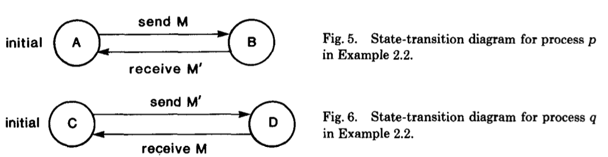
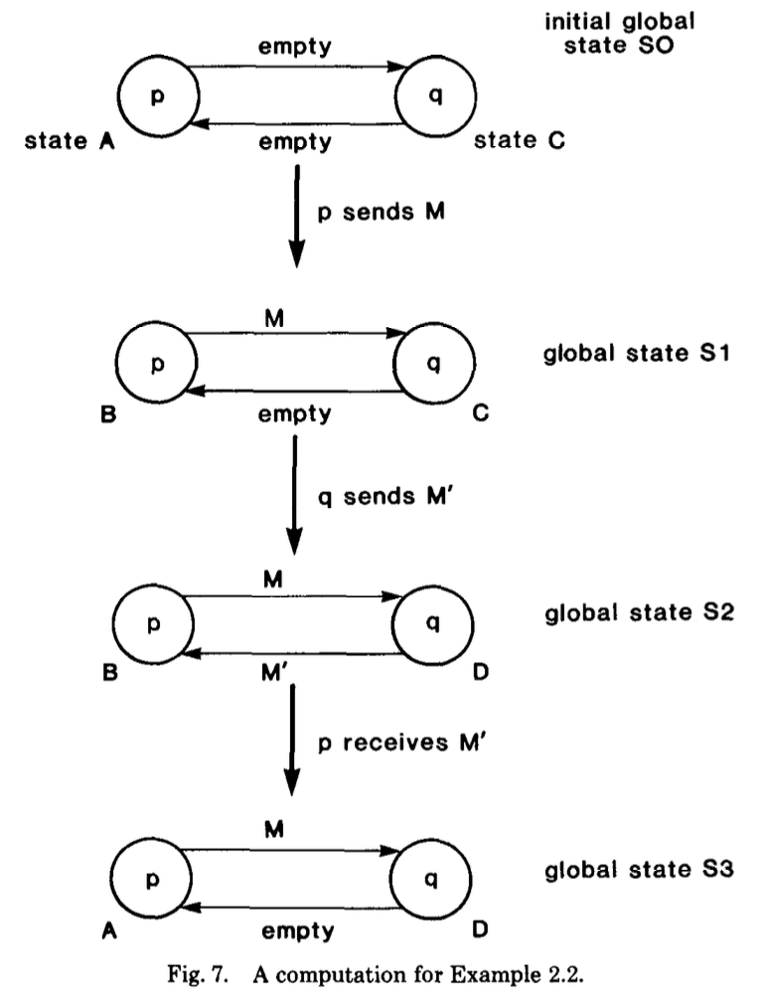
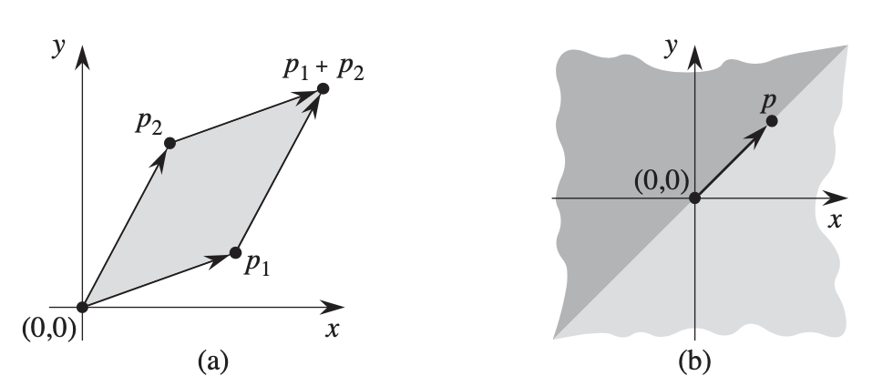
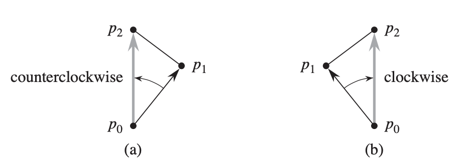
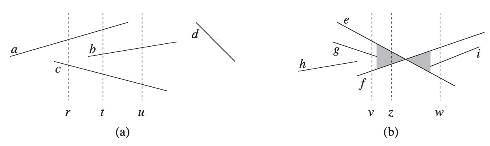

<head>
    
    
</head>

# Table of Contents

1.  [Algorithm](#org4b74f23)
2.  [Review](#org18e6e93)
    1.  [简介](#orgaae9cc3)
    2.  [分布式系统模型](#org0c50fd5)
    3.  [算法](#orge0328d2)
        1.  [算法步骤的动机](#orgc59b399)
        2.  [全局状态检测算法概要](#org84303c2)
        3.  [算法的终止](#orgbd290da)
    4.  [记录的全局状态的属性](#orgd7e768d)
    5.  [稳定性检测](#org95fd5d0)
3.  [Tips](#org488d0ec)
4.  [Share](#org8b15d06)
    1.  [线段属性](#orga53a40a)
    2.  [判定是否任意线段对相交](#orga63e0b8)
    3.  [凸优化](#org0db6e7a)
        1.  [Graham扫描法](#orge12ad5c)
        2.  [Jarvis's march](#org3a1f1ed)
    4.  [查找最近的点对](#orgeb1f919)
        1.  [分治法](#org668e88a)

# Algorithm

Leetcode 679: <https://leetcode.com/problems/24-game/>

<https://medium.com/@dreamume/leetcode-679-24-game-f20ec9ee1c89>

# Review

Distributed Snapshots: Determining Global States of a Distributed System

<https://www.microsoft.com/en-us/research/publication/distributed-snapshots-determining-global-states-distributed-system/?from=http%3A%2F%2Fresearch.miicrosoft.com%2fFenus%2Fum%2Fpeople%2Flamport%2Fpubs%2Fchandy.pdf>

本文展示了一个算法，使一个分布式系统里的进程在计算时决定系统的全局状态。分布式里的很多问题可以看作为检测全家状态的问题。例如，全局状态检测算法帮助解决一类重要问题：稳定属性探测。一个稳定属性即为，一旦一个稳定属性变为true则它总是true。稳定属性的例子有“计算已终止“，“系统已死锁“和“token环中所有token已消失“。稳定属性检测问题即为检测给定稳定属性的算法。全局状态检测也可以用来作为检查点。

## 简介

本文展示了一个算法，使一个分布式系统里的进程在计算时决定系统的全局状态。分布式系统里的进程通过发送接收消息来通讯，它不能记录任何事物。为决定一个全局系统状态，进程p必须加入和其他进程的合作，记录它们自己的本地状态且发送记录好的状态给p。所有进程不能在相同的时刻记录它们的本地状态除非它们访问了共同的时钟。我们假设进程没有共享时针或内存。问题是设计算法，使哪个进程记录它们自己的状态及通讯频道的状态使得进程集合和频道状态记录为一个全局系统状态。全局状态检测算法潜入在其中的计算中：它必须并行运行，但不改变计算。

状态检测算法可看作为一组摄影师在观察一个广景动态的画面，比如有很多迁徙飞鸟的天空 - 场景很宽广使得一张照片容不下所有场景。摄影师必须拍下一些快照并拼接它们来形成整幅画面。因为同步问题快照不能精确地拍摄在同一时刻。更进一步，摄像师不能分布处理拍摄；例如，在拍摄的时候他们不能在使场景不动地情况下捕获所有的鸟。组合的图片是有意义的。我们的问题是定义有意义及决定如何拍摄图片。

我们现在描述一个重要的类问题，它可用来解决全局状态算法。设y为一个断言函数定义在分布式系统D的全局状态中；即对D的全局状态S，y(S)为true或false。断言y被称为D的一个稳定属性仅当从D的全局状态S能得到对D的所有全局状态S'的y(S')。即如果y为一个稳定属性且y在D计算的某个点为true，则y在该计算之后的所有点为true。稳定属性的例子有“计算已终止“，“系统死锁”和“token环中的所有token已消失“。

一些分布式系统问题可形式化为设计一个算法使一个分布式系统中的进程可决定是否保持系统中的稳定属性y这样的一般问题。死锁探测和终止探测是稳定属性检测问题的特殊例子。算法的基本思想是系统的全局状态S是确定性的及如果稳定属性y保持则y(S)可被计算看到。

通过确定分布式系统的全局状态来解决死锁和终止问题的一些算法已发布。Gligor和Shattuck阐述了许多发布的算法是错误的和不可行的。原因可能是本地进程状态、全局系统状态和分布式计算的点之间的关系不好理解。

许多分布式算法以一系列语法作为结构，每个语法包含有用的工作完成的短暂部分，接着一个系统循环的稳定部分。稳定行为表示一个语法的结束。一个语法跟一个顺序化程序的一系列迭代相似，这些迭代一直重复直到成功的迭代没有产生变化，即达到稳定。稳定必须被检测这样一个语法可被终止且另一个语法初始化。计算语法的终止不等同于计算的终止。当一个计算终止，所有的活动停止 - 不发送消息且进程状态不变。在稳定属性时的活动表示计算语法的终止 - 消息被发送和接收，且进程可能改变状态，但这个活动只是表示语法的终止。在本文中，我们考虑稳定系统属性的检测；活动的终止为一个稳定属性的例子。

严格地说，系统死锁这样的属性是不稳定的，如果死锁被打破且计算被重初始化。然而，为使详细描述简单化，我们将分割问题为（1）检测一个语法的终止（和通知所有进程一个语法已结束）和（2）初始化一个新的语法。如下是一个稳定属性：“第k个计算语法已终止“,k = 1, 2, &#x2026; 因此，本文呈现的方法是可用于检测第k个语法的终止。

本文中我们限制为关注检测稳定属性的问题。初始化下一个计算语法的问题暂不考虑，因为这种问题的解决方案严重依赖于应用程序，不同于数据库死锁检测。

我们以系统模型的方式呈现我们的算法。模型如何选择本身不重要，我们将给出我们一些模型的讨论。我们将非形式化地描述我们的模型并只给出必要的细节使算法清晰。

## 分布式系统模型

分布式系统保护有限进程集合和频道集合。它被描述为一个标签、直接的图，顶点代表进程和边代表频道。

频道假设有无限的缓存，顺序地转发消息（无限缓存是为了阐述方便：有界缓存可能假设提供一个证明没有进程尝试添加消息到已满的缓存）。频道里的延迟的消息是任意的且有限的。频道里接收到的消息顺序是频道顺序消息的初始化子序。频道的状态为频道发送的一系列消息，排除频道接收到的消息。

进程被定义为一系列状态，一个初始化状态和一系列事件。进程p中的一个事件e是一个原子行为，其可能改变p本身的状态和p上最多一个频道c的状态，频道c的状态可能通过发送消息来改变或接收消息。一个事件e定义为(1)事件发生在哪个进程p（2）p的状态s在事件之前(3)在事件之后是p的状态s' (4)频道c的状态被事件改变 (5) 消息M，从c发送或被c接收。我们定义e为5元组(p, s, s', M, c)。

分布式系统的全局状态是一系列组件进程和频道状态：初始化全局状态为每个进程的初始化状态及每个频道的状态为空序列。一个事件的发生可能改变全局状态。设e = <p, s, s', M, c>，我们说e可能在全局状态S中发生当且仅当(1)全局状态S中进程p的状态为s (2)如果c为一个频道直连p，则全局状态S中c的状态为一系列消息，M在它的头部。我们定义一个方法next，next(S, e)为事件e发生在全局状态S后的全局状态。next(S, e)的值被定义仅当事件e在全局状态S中发生，next(S, e)是对应于S的全局状态，除了：(1)next(S, e)中p的状态为s' (2)如果e是一个频道直连p，则next(S, e)中c的状态为S中c的状态及消息M从它的头部删除 (3)如果c为一个频道从p离开，则next(S, e)中c的状态为S中c的状态及消息m添加到它的尾部

设序列seq = (ei : 0 <= i <= n)为分布式系统中组件进程的事件序列。我们说该系列为一个系统计算当且仅当事件ei 在全局状态Si 中发生，0 <= i <= n，S0 为初始化全局状态，Si+1 = next(Si ,ei )

例子2.1，为展示分布式系统定义，考虑一个简单系统包含两个进程p和q，两个频道c和c'。

系统包含一个token从一个进程传递到另一个进程，因此我们称该系统为“单token会话“系统。每个进程有两个状态，s0 和s1 ，s0 为进程未处理token的状态，s1 为处理了token的状态。p的初始化状态为s1 ，q为s0 。每个进程有两个事件：（1）发送token，状态从s1 到s0 转换和(2)收到token，状态从s0 到s1 。

一个系统计算对应一个从初始化状态开始的全局状态转换的路径。系统计算的例子为：（1）空系列且（2）<p发送token，q接收token，q发送token>。如下序列不是系统的计算：<p发送token，q发送token>，因为事件“q发送token“不能发生在q为s0 状态时。

例子2.2，本例展示非确定性计算。非确定性在快照算法中扮演一个有趣的角色。

在例子2.1中，在每个全局状态中仅有一个事件，考虑一个跟例子2.1相同拓扑的系统，但进程p和q定义为如图5和6.

图7为一个计算的例子，读者需要注意到全局状态中允许多个传输。例如，事件“p发送M“和“q发送M'“可能在全局状态中发生，且这些事件后下一个状态不同。

## 算法

### 算法步骤的动机

全局状态记录算法按如下工作：每个进程记录它自己的状态，且频道相关的两个进程合作记录频道状态。我们不能确保所有进程和频道的状态在某一时刻被记录，因为没有全局时钟；然而，我们要求被记录的进程和频道状态形成一个全局系统状态。

全局状态记录算法被底层计算映射，它必须并行运行，但不修改底层计算。算法可能发送消息且要求进程完成计算；然而，消息和计算要求记录全局状态必须不干扰底层计算。

我们现在考虑一个例子来模拟算法步骤的动机。在例子中，我们将假设我们能记录频道的状态；我们推迟讨论频道状态如何记录。设c为从p到q的一个频道，例子的目的是获得频道c状态被记录和进程p和q状态被记录的关系的一个直观的理解。

例子3.1，考虑单token会话系统，假设进程p的状态在全局状态中被记录，则p被记录的状态显示token在p中。现在假设全局状态转换为in-c（因为p发送了token）。假设频道c和c'的状态和进程q的状态 被记录到全局状态in-c，这样频道c被记录的状态显示它带的token及c'频道记录的状态和进程q的状态显示它们不拥有token。这种复杂的全局状态记录将在系统中显示两个token，一个在p另一个在c。但两个token的全局状态是不能从单token会话系统的初始化全局状态得到的。不一致性是由于p状态的记录在p发送一个消息给c之前且c的状态记录在p发送消息之后。设n为c状态被记录之前发送到c的消息数。我们的例子建议被记录的全局状态可能不一致如果n < n'。

现在考虑另一个场景。假设c的状态被记录在全局状态in-p中，系统然后转换到全局状态in-c，和c'、p的状态，且q被记录在全局状态in-c中。被记录的全局状态显示系统中没有token。这个例子建议被记录的全局状态可能不一致当c的状态被记录发生在p发送消息给c之前且p的状态被记录在p发送消息给c之后，如果n > n'。

我们知道从这些例子中一个一致的全局状态需要n = n'。

设m为在q的状态被记录之前从c接收到的消息数。设m'为c的状态被记录之前从c接收到的消息数。我们让读者扩展该例子来显示一致性要求m = m'。

在每个状态中，从一个频道接收到的消息数不能超过频道发送的消息数，即n' >= m'。

从上面的等式中，得到n >= m。

频道c的状态被记录必须要频道发送的消息序列在发送者的状态被记录之前，除了频道接收到的消息序列在接受者状态被记录之前，即n' = m'，c的记录状态 必须为空序列，且如果n' > m'，c的记录状态必须为(m' + 1), &#x2026;, n'。基于事实和以上多个等式建议一个简单的算法，q可记录频道c的状态。进程p发送一个特殊的消息，称为标识，在发送了第n个消息给c之后（在发送任何进一步的消息给c之前）。该标识对底层计算没有影响。c的状态为q在记录它自己的状态之后和q接收到c的标识之前时接收到的消息序列。

我们的例子建议如下全局状态检测算法的概要。

### 全局状态检测算法概要

进程p的标识发送规则。对每个频道c，从p离开：

p发送一个标识给c在p记录自己的状态之后p发送进一步的消息给c之前

进程q的标识接收规则。当从频道c接收到一个标识：

           如果q还没有记录它的状态，则
             begin q记录它的状态；
                   q记录c状态为空序列
             end
           否则 q记录c状态为在q的状态被记录之后和q接收到c的标识之前的c接收到的消息序列

### 算法的终止

标识接收和发送规则保证如果一个标识在每个频道接收，则每个进程将记录它的状态和所有进入的频道状态。为确保全局状态记录算法在有限时间内终止，每个进程必须确保(L1)没有标识仍然永远在输入频道且(L2)它在算法初始化有限时间内记录了它的状态。

算法可被一个或多个进程初始化，每个同时记录它的状态，且还没有收到其他进程的标识；我们推迟讨论什么导致进程同时记录它的状态。如果进程p记录它的状态且有一个从p到q的一个频道，则q将在有限时间内记录它的状态因为p将通过该频道发送标识且q将在有限时间内接收到标识。因此如果p记录它的状态且有一个路径从p到q，则q将在有限时间内记录它的状态，通过推导，每个带该路径的进程将在有限时间内记录它的状态。在有限时间内终止是确保的，如果对每个进程q：q同时记录它的状态 或有一个从p的路径，同时记录它的状态到q。

特别地，如果图是强连接的，且至少一个进程同时记录它的状态，则所有进程将在有限时间内记录它们的状态。

算法描述允许每个进程记录它的状态和进入频道的状态。被记录的进程和频道状态必须收集且形成被记录的全局状态。我们将不描述算法收集记录的信息因为这样的算法在其他地方会描述。一个系统中简单的收集信息的算法，对每个进程发送它记录的信息给所有输出频道和每个进程通过输出频道第一次接收信息来拷贝它并广播它的网络拓扑是强连通的。所有记录的信息将在有限时间内给到所有进程，允许所有进程确定记录的全局状态。

## 记录的全局状态的属性

为获得算法中一个直观的全局状态记录属性的理解，我们将学习例子2.2.假设p的状态被全局状态S0 记录，这样p的状态被记录为A。在记录了它的状态之后，p发送一个标识到频道c。现在假设系统状态转换为S1 ，然后S2 ，S3 ,而表示还在传输中，当系统进入S3 状态后标识被q接收到。当接收到标识，q记录它的状态D，记录c的状态为空序列。记录完状态后，q发送一个标识给频道c'。一旦收到标识，p记录c'的状态为包含一个消息M'。记录算法在全局状态S0 中初始化，且在全局状态S3 时终止。

观察被算法记录的全局状态S\* 不等同于发生计算时的任意全局状态S0 ，S1 ，S2 ，S3 。如果没有记录过全局状态则算法用的是哪个？我们现在将回答这个问题。

设序列 $ seq = \\left( e_ {i} , 0 \\leq i \\right) $ 为分布式计算，设Si 为事件 $ e_ {i} , 0 \\leq i $ 之前的序列中的系统全局状态。设算法在全局状态S中初始化，并终止于全局状态 $ S_ {\\phi}, 0 \\leq \\iota \\leq \\phi $ ，即算法在 $ e_ {\\iota - 1}, \\quad if \\quad \\iota > 0 $ 之后初始化，在$ e_ {\\iota} $之前，且它终止于 $ e_ {\\phi - 1} , \\quad if \\quad \\phi > 0 $ 之后，$ e_ {\\phi} $之前。我们在例子2.2中观察到被记录的全局状态S\* 可能跟所有的全局状态 $ S_ {k}, i \\leq k \\leq \\phi $ 不同。

我们将显示：

(1) S\* 可从 $ S_ {\\iota} $ 到达，且

(2) $ S_ {\\phi} $ 可从S\* 到达

特别地，我们将展示存在一个计算序列seq'，有

(1) seq' 为seq的一个排列，使得 $ S_ {\\iota}, S_ { * }, S_ {\\phi} $ 发生在seq'的全局状态中

(2) $ S_ {\\iota} = S^{ * } \\, or \\, S_ {\\iota} $ 发生在S\* 之前，且

(3) $ S_ {\\phi} = S^{ * } \\, or \\, S^{ * } $ 在seq' 中发生在 $ S_ {\\phi} $ 之前

**定理** 存在一个计算 $ seq' = \\left( e_ {i}', 0 \\leq i \\right) $，有

(1) 对任意i，$ i < \\iota \\, or \\, i \\geq \\phi: e_ {i}' = e_ {i} $，且

(2) 子序列 $ \\left( e_ {i}', \\iota \\leq i < \\phi \\right) $ 是 $ \\left( e_ {i}, \\iota \\leq i < \\phi \\right) $ 子序列的一个排列，且

(3) 对任意i，$ i \\leq \\iota \\, or \\, i \\geq \\phi: S_ {i}' = S_ {i} $，且

(4) 存在某个k，$ \\iota \\leq k \\leq \\phi $，使得 $ S^{ * } = S_ {k}' $

证明：序列中的事件ei 被称为一个先记录事件当且仅当ei 在进程p中且p在序列中在ei 之后记录它的状态。序列中的事件ei 被称为一个后记录事件当且仅当它不是一个先记录事件 - 如果ei 在进程p中且p在序列中在ei 之前记录它的状态。所有事件ei ，$ i < \\iota $，是先记录事件且所有事件e_i ，$ i \\geq \\phi $，是序列中后记录事件。对某些j， $ \\iota < j < \\phi $，在先记录事件ej 之前可能有一个后记录事件ej-1 ；这仅会出现在ej-1 和ej 在不同的进程中（因为如果ej-1 和ej 在相同的进程且ej-1 是一个后记录事件，则ej 也是）。

我们将通过排列seq获得一个计算seq'，所有的先记录事件发生在所有seq'中后记录事件之前。我们将显示S\* 是在所有先记录事件之后所有后记录事件之前的seq'的全局状态

假设seq中有一个后记录事件ej-1 在先记录事件ej 之前。我们将显示序列通过交换ej-1 和ej 获得必须有一个计算。事件ej-1 和ej 必须在不同的进程中。设p为ej-1 发生的进程，设q为ej 发生的进程，则没有一个消息在ej-1 发送却收到ej ，因为(1)如果一个消息当事件ej-1 发生时在频道c发送，则一个标识必须在ej-1 之前在c中被发送，因为ej-1 是一个后记录事件，且(2)如果一个消息当事件ej 发生时从频道c接收，则标识必须在ej 发生前在c中接收（因为频道是先进先出），ej 将也是一个后记录事件。

进程q的状态在事件ej-1 发生后不会改变，因为ej-1 在另一个进程p中。如果ej 是一个q从 频道c接收到的消息的事件，则M必须在c的头部在事件ej-1 之前，因为在ej-1 发送的消息不能在ej 接收。因此事件ej 可能发生在全局状态Sj-1 。

进程p的状态在ej 发生时不会修改，因此ej-1 可能发生在ej 之后。因此事件序列 $ e_ {1}, \\ldots, e_ {j-2}, e_ {j}, e_ {j-1} $是一个计算。从上述段落的讨论中它跟随全局状态在计算 $ e_ {1}, \\ldots, e_ {j} $ 之后跟计算 $ e_ {1}, \\ldots, e_ {j-2}, e_ {j}, e_ {j-1} $ 之后的全局状态相同。

设seq\* 为seq的一个排列，其跟seq相同除了ej 和ej-1 交换了之外。则seq\* 必须也是一个计算。设 $ \\bar{S_ {i}} $ 为seq\* 中第i个事件之前的全局状态。从之前的段落讨论中，

$ \\begin{equation} \\bar{S_ {i}} = S_ {i} \\qquad for \\, all \\, i \\, where \\, i \\neq j \\end{equation} $

通过不停地交换后记录事件在先记录事件之后，我们看到存在一个seq的排列seq'，有

(1) 所有的先记录事件在所有后记录事件之前

(2) seq'是一个计算

(3) $ \\forall i, i < \\iota \\, or \\, i \\geq \\phi: e_ {i}' = e_ {i} $ ，且

(4) $ \\forall i, i < \\iota \\, or \\, i \\geq \\phi: S_ {i}' = S_ {i} $

现在我们将显示seq'在所有先记录事件之后及所有后记录事件之前的全局状态是S\* 。为这么做，我们需要显示

(1) S\* 中每个进程的状态是跟进程计算包含p的先记录事件序列之后的状态相同，且

(2) S\* 中每个频道c的状态是（消息序列对应c上发送的先记录） - （消息序列对应c上收到的先记录）

第一部分的证明是显然的。现在我们证明后一部分。设c为从p到q的一个频道。记录在S\* 上频道c的状态是通过q后c收到的消息序列且在q记录它的状态且p接收到c的标识之前。在p通过c发送一个标识之前p通过c发送的消息序列是通过c发送的先记录序列。

例子4.1，本例子的目的是展示计算seq'如何从计算seq发展过来的。考虑例子2.2，图7的计算显示的时间序列是

e0 : p发送M且改变状态为B（一个后记录事件）

e1 : q发送M'且改变状态为D（一个先记录事件）

e2 : p接收M'且改变状态为A（一个后几率事件）

因为e0 ，一个后记录事件，在一个先记录事件e1 之前，我们交换它们，得到排列后的序列seq':

e'0 : q发送M'且改变状态为D（一个先记录事件）

e'1 : p发送M且改变状态为B（一个后记录事件）

e'2 : p接收到M'且改变状态为A（一个后记录事件）

在seq'，所有先记录事件在所有后记录事件之前。我们把证明留给读者来显示在e'0 之后全局状态为被记录全局状态。

## 稳定性检测

我们现在解决第一节描述的稳定性检测问题。我们研究稳定性检测问题因为它是很多实际问题的一个范例，比如分布式死锁检测。

一个稳定性检测算法定义如下：

输入：一个稳定属性y

输出：一个布尔值与属性一起定义：$ \\left( y \\left( S_ {\\iota} \\right) \\to definite \\right) \\quad and \\quad \\left( difinite \\to y\\left( S_ {\\phi} \\right) \\right) $，$ S_ {\\iota}, S_ {\\phi} $为当算法初始化和当它终止时的系统全局状态。

算法的输入是函数y。在算法执行过程中对一些全局状态y(S)的值可能被系统一个进程通过应用全局状态S的外部定义函数y来确定。因算法的输出为布尔值，我们意味着(1)一些特别设计的进程（假设为p）进入并因此仍然在一些特殊状态来符号化一个输出定义为true，且(2)进入且仍然在一些其他特殊状态来符号化一个输出定义为false。

定义为true意味着稳定属性在算法终止时保持。然而，定义为false意味着稳定属性在算法初始化后不保持。我们强调定义为true给定我们信息系统的状态在算法终止的时候，然而定义为false给我们信息系统状态在算法初始化的时候。特别地，我们不能从定义为false来推断稳定属性在算法终止时不保持。

稳定性检测问题的解决方案为

    begin
            记录一个全局状态S*
            定义 := y(S*)
    end

稳定性检测算法的正确性有以下这些事实：

(1) S\* 可从 $ S_ { \\iota } $到达

(2) $ S_ {\\phi} $ 从S\* 可达，且

(3) 对所有从S（定义一个稳定属性）可达S' ，有y(S) -> y(S' )

# Tips

-   找国外名校公开课相关资源是一个快速学习的好办法，有很多lecture notes写得很好，比看书效率高
-   一些公开课视频也不错，好的老师讲解比自己看书效果高

# Share

《算法导论》第33章计算几何

本章将介绍一些计算几何算法

## 线段属性

这里介绍了一个很好用的概念，叉乘，以及一些应用。考虑两个矢量，以原点(0, 0)作为起点，p1 (x1 , y1 )和p2 (x2 , y2 )。p1 X p2 = x1 y2 - x2 y1

如果起点不是原点，我们可以记起点为p0 ，计算时p1 和p2 先减去p0 坐标值再计算。可以看到，叉乘(p1 - p0 ) X (p2 - p0 )，如果值为负，则p0 p1 顺时针旋转可到p0 p2 ，如果为正，则p0 p1 逆时针旋转可到p0 p2 ，顺时针、逆时针也可以理解为右侧和左侧。这样我们就知道了两个线段相对应的方向了。如果叉乘值为0，则两个线段要么在同一方向或相反方向。

利用叉乘原理，我们也就可以判定两条线段是否相交。

SEGMENTS-INTERSECT(p1 , p2 , p3 , p4 )

1  d1 = DIRECTION(p3 , p4 , p1)

2  d2 = DIRECTION(p3 , p4 , p2)

3  d3 = DIRECTION(p1 , p2 , p3)

4  d4 = DIRECTION(p1 , p2 , p4)

5  if ((d1 > 0 and d2 < 0) or (d1 < 0 and d2 > 0)) and ((d3 > 0 and d4 < 0) or (d3 < 0 and d4 > 0))

6      return TRUE

7  elseif d1 == 0 and on-segment(p3 , p4 , p1 )

8      return TRUE

9  elseif d2 == 0 and on-segment(p3 , p4 , p2 )

10     return TRUE

11 elseif d3 == 0 and on-segment(p1 , p2 , p3 )

12     return TRUE

13 elseif d4 == 0 and on-segment(p1 , p2 , p4 )

14     return TRUE

15 else return TRUE

DIRECTION(pi , pj , pk )

1  return (pk - pi ) X (pj - pi )

ON-SEGMENT(pi , pj , pk )

1  if min(xi , xj ) <= xk <= max(xi , xj ) and min(yi , yj ) <= yk <= max(yi , yj )

2      return TRUE

3  else return FALSE

## 判定是否任意线段对相交

本节描述一个算法判定是否任意线段对相交。该算法又叫清扫算法。时间复杂度为O(nlgn)。在算法中，我们使用一种虚拟的垂直清扫线来辅助判断。

我们先考虑对线段排序。我们假设没有垂直的线段，即跟y轴平行的线段。考虑两个线段s1 和s2 。我们说这些线段在x处可比较仅当在x处的垂线和两个线段都相交。我们说s1 在x处位于s2 之上，仅当s1 和s2 可比较，且s1 和垂线在x处的交点高于s2 和垂线的交点或s1 和s2 在垂线上相交。

清扫算法管理两套数据：

1.  垂线状态给出跟垂线相交的对象的关系
2.  事件点调度是一系列点，称为事件点，根据x轴从左到右排序，清扫线从左到右顺序出现，当清扫线到达一个x轴事件点，则清扫过程暂停，处理事件点，然后继续。清扫线状态只会在事件点改变。

每个线段端点是一个事件点，我们按x轴增长方向排序线段端点并从左到右处理（如果多个端点x坐标相同，我们把左端点放在右端点之前，且y坐标低的左端点在其他左端点之前，同理右端点也一样）。当走到一个线段左端点时，我们把线段插入到垂线状态中，当走到右端点时，我们从垂线状态中删除线段。当两个线段在总的先序排列中首次挨着时，我们检查它们是否相交。

垂线状态是一个总的先序排序，需要如下操作：

-   INSERT(T, s): 插入一个线段s到T
-   DELETE(T, s): 从T中删除线段s
-   ABOVE(T, s): 返回T中紧挨着线段s之上的线段
-   BELOW(T, s): 返回T中紧挨着线段s之下的线段

当线段s1 和s2 在垂线上相交时，线段s1 和s2 可能在T上都是互为之上的关系。

线段相交的伪代码如下：

    ANY-SEGMENTS-INTERSECT(S)
    1  T = ∅
    2  从左到右排序S中端点，注意相同x坐标下左端点在右端点之前，y坐标低的端点在前
    3  for 排序后列表里的每个端点p
    4      if p为左端点
    5          INSERT(T, s)
    6          if (ABOVE(T, s)存在且跟s相交) or (BELOW(T, s)存在且跟s相交)
    7              return TRUE
    8      if p为右端点
    9          if ABOVE(T, s)和BELOW(T, s)都存在且它们相交
    10             return TRUE
    11         DELETE(T, s)
    12 return FALSE

## 凸优化

### Graham扫描法

    1  设p_0 为Q中y坐标最小的点或y坐标相同时最左边的点
    2  设<p_1 , p_2 ,..., p_m >为Q中剩下的点，以p_0 点为起点按逆时针角度排序（如果有多个点角度相同，保留离p_0 最远的点，去掉其余）
    3  设S为一个空栈
    4  PUSH(p_0 , S)
    5  PUSH(p_1 , S)
    6  PUSH(p_2 , S)
    7  for i = 3 to m
    8      while NEXT_TO_TOP(S), TOP(S)和p_i 形成的角度为非左转
    9          POP(S)
    10 return S

因第2行有个排序，所以整个时间复杂度为O(nlogn)

### Jarvis's march

Jarvis's march算法也很直观，先用跟Graham扫描法一样的方法选p0 点，想象把一张A4纸水平放置并紧贴p0 点，然后我们把纸右边抬高，当遇到的第一个点则为一个顶点（即抬高最小角度找到的点），然后按这样的方法继续抬高找顶点。最后纸张旋转一周后即可得到所有顶点。

算法复杂度为O(nh)，h为顶点数。当顶点相对少时，h = o(lgn)，Jarvis's march算法比Graham扫描法快一些。

## 查找最近的点对

我们现在考虑查找点集合Q中距离最近的点对问题。我们使用欧几里得距离，即点p1 = (x1 , y1 )和点p2 = (x2 ,y2 )的距离为 $ \\sqrt{\\left(x_{1}-x_{2}\\right)^{2}+\\left(y_{1}-y_{2}\\right)^{2}} $ 。

暴力解法是遍历所有的点对，时间复杂度为 $ \\Theta(n^2) $ 。本文，我们将使用分治法，使时间复杂度为O(nlgn)。

### 分治法

我们首先把点按x轴和y轴分别排序。

-   找到一个垂线把点集P分割为两个集合PL 和PR ，使 $ \\| P_ {L} \\| = \\lceil \\frac{\\| P \\|}{2} \\rceil, \\| P_{R} \\| = \\lfloor \\frac{\\| P \\|}{2} \\rfloor $ ,PL 的点都在垂线l的左边，PR 的点在垂线右边。
-   找到PL 中最近的点对和PR 中最近的点对，记PL 和PR 中最近点对的距离分别为 $ \\delta_ {L}, \\delta_ {R} $ ，并设 $ \\delta = min(\\delta_ {L}, \\delta_ {R}) $
-   则最近点对要么在 $ \\delta $ 中，或PL 和PR 之间的点对上。则分别从PL 和PR 中取点，仅取其x轴或y轴相差 $ \\delta $ 距离的点对，并计算距离

按照以上算法步骤，最后我们将会得到最近点对。

