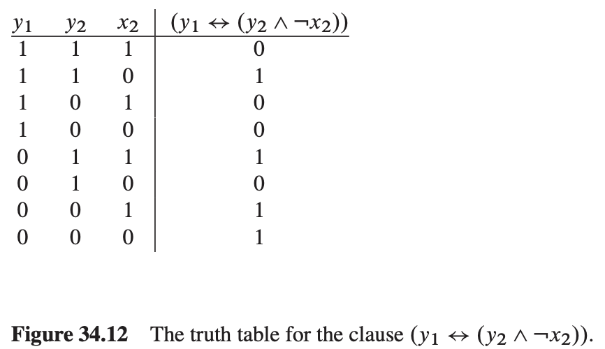
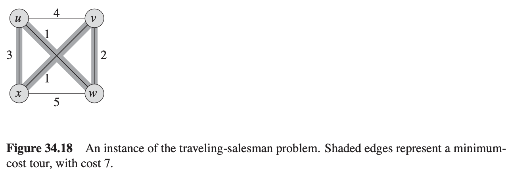

<head>
    
    
</head>

# Table of Contents

1.  [Algorithm](#orge23303e)
2.  [Review](#org54a2972)
    1.  [问题定义](#org14cbe22)
        1.  [分布式服务](#orgb865fa6)
        2.  [状态机](#orgfa8eb2f)
        3.  [容错](#org62af1b5)
        4.  [特别例子：故障-停止](#org73a9c6e)
        5.  [特别例子：拜占庭故障](#orgaee8106)
    2.  [状态机方案](#orgad4497f)
        1.  [顺序输入](#orgb8dddaf)
        2.  [发送输出](#orgfb914f2)
        3.  [系统故障](#org6374541)
        4.  [审查和故障检测](#orgd14a6c0)
    3.  [附录：扩展](#org7c12d52)
        1.  [输入日志](#org22a37ad)
        2.  [检查点](#org08fc3ab)
        3.  [重配置](#orgf136e7f)
        4.  [退出](#org6c3b43f)
        5.  [加入](#orga6e8de4)
        6.  [状态转换](#orgada9c08)
        7.  [领导选举（Paxos）](#org4164dba)
3.  [Tips](#org862ee95)
4.  [Share](#orgd94fe42)
    1.  [多项式时间](#org26c236f)
        1.  [抽象问题](#orgef03752)
        2.  [编码](#orgbca0dff)
        3.  [形式语言框架](#org882a1a9)
    2.  [多项式时间验证](#org42a7801)
        1.  [哈密尔顿环](#orgda701ac)
        2.  [验证算法](#org7815e9b)
        3.  [复杂类型NP](#orgea48251)
    3.  [NP完全和缩减](#orgc239d2b)
        1.  [缩减](#org596d9ba)
        2.  [NP完全](#org11dc230)
        3.  [电路满足](#org7682509)
    4.  [NP完全的证明](#org8a91e4b)
        1.  [公式满足](#orgcbf1a23)
        2.  [3-CNF满足](#org2da1438)
    5.  [NP完全问题](#orgdd11269)
        1.  [小组问题](#org188aaf3)
        2.  [点覆盖问题](#org4301cb0)
        3.  [哈密尔顿环问题](#orgf32ea05)
        4.  [销售旅行问题](#org0135ab5)
        5.  [子集和问题](#org5bddeea)

# Algorithm

Leetcode 680: <https://leetcode.com/problems/valid-palindrome-ii/>

<https://dreamume.medium.com/leetcode-680-valid-palindrome-ii-8dcf6c97cc5a>

# Review

State machine replication

<https://en.wikipedia.org/wiki/State_machine_replication>

在计算机科学中，状态机复制或状态机接近是一个一般化方法通过复制服务器和跟服务器复制节点协调客户交互来实现容错服务。同时也提供一个框架来理解和设计复制管理协议。

## 问题定义

### 分布式服务

分布式软件通常以客户和服务的术语来组织。每个服务组成一个或多个服务器和导出客户端通过请求来调用的操作。虽然使用单个，集中的服务器是最简单的方法来实现服务，这样只有当处理器执行服务器时才容错。如果这种水平的容错不能接受，则多个独立故障的服务器必须使用。通常，单个服务器的复制节点执行在分布式系统独立的处理器上，且协议用来协调客户端与这些复制节点的交互。分布式系统处理器的物理和电子隔离确保服务器故障是独立的

### 状态机

状态机的一系列讨论将被定义为如下元组值：

-   状态集合
-   输入集合
-   输出集合
-   一个过渡函数（输出 x 状态 -> 状态）
-   一个输出函数（输入 x 状态 -> 输出）
-   一个不同的状态称为开始

一个状态机开始于开始状态。每个接受到的输入被传递且输出函数产生一个新的状态和输出。该状态是稳定的直到接收到新的输入，然而输出交换给合适的接收者。

本讨论需要一个状态机为确定性的：相同状态机的多个拷贝开始于开始状态，且在相同的顺序下接收到相同的输入将达到相同的状态产生相同的输出。

典型地，基于状态机复制节点的系统限制它们的实现使用有限状态机来简化错误恢复

### 容错

决策是提供容错的理想特征。直观上，如果存在系统的多个拷贝，一个故障可通过状态的不同或其他节点的输出观察到。

一个推理显示容错需要的最小的拷贝数是3，当一个故障时，另两个会比较状态和输出。仅两个拷贝是不够的因为没有办法确认哪个故障。

进一步推演显示一个3拷贝系统可支持最多一个故障（其故障后必须修复或替换故障节点）。如果超过一个拷贝故障，所有3个状态和输出都可能不同，没有办法选择哪个是正确的。

一般的，一个系统支持F个故障必须有2F + 1个拷贝。额外的拷贝用来作为证据来确定哪些拷贝是正确的且哪些故障。

所有这些演绎预先假设复制节点内存错误或硬盘崩溃等故障都是随机独立的。节点故障导致其会撒谎，欺骗，或共谋，这可通过状态机及隔离变动解决。

故障节点不需要停止，它们可能会继续执行，包括产生虚假或错误的输出

### 特别例子：故障-停止

理论上，如果一个故障节点保证停止不产生输出，只要F + 1个节点就可以了，客户端会接受系统产生的第一个输出。但不存在这样的系统，它通常用来分析系统构建在容错层（因容错层提供错误-停止语义给它上面的所有层）。

### 特别例子：拜占庭故障

节点故障在不同的方向发送不同的值（例如，正确的输出给一些节点而错误的输出给另一些节点）称为拜占庭故障。拜占庭故障可能是随机、欺骗故障、或病毒、智能攻击。2F + 1个节点，没有加密的hash能承受所有非恶意拜占庭故障（高概率）。恶意攻击则需要加密获得2F + 1（使用消息认证），或非加密技术可被应用但节点数目需要增加到3F + 1。

## 状态机方案

先前直观的讨论意味着一个简单的技术用状态机实现容错服务

1.  把状态机的拷贝放置在多个独立的服务器上
2.  收到客户端请求，解释为状态机的输入
3.  选择输入的一个顺序
4.  在每个服务器执行选择顺序的输入
5.  用状态机的输出响应客户端
6.  监控节点状态或输出的不同

本文剩下章节将发展该技术的细节

-   步骤1和2步骤本文讨论的范围
-   步骤3是关键操作，看顺序输入部分
-   步骤4在状态机定义中提到
-   步骤5在顺序输出部分
-   步骤6在审查和故障检测

附录包含讨论在真实世界中的系统使用的典型扩展比如日志、检查点、重配置和状态转换

### 顺序输入

构建分布式系统状态机的关键步骤是选择一个输入顺序来处理。因为所有非故障节点如果给定相同的输入将达到相同的状态和输出，这是重要的，输入在每个节点已一个特定顺序提交。许多解决方案被提议。

一个可见的频道是在两个活跃参与系统的条目间的一个通讯路径（比如服务器和客户端），例如，客户端到服务器，服务器到服务器

一个隐藏的频道是一个在系统中未暴露的通讯路径。例如，客户端到客户端频道通常是隐藏的，比如用户通过电话通讯，或一个进程写文件到磁盘而另一个进程读取。

当所有的通讯路径为可见频道且没有隐藏频道存在，一个部分全局顺序（随意顺序）可能从通讯范式推得。随意顺序可能被每个服务器独立得到。状态机的输入可能已随意顺序执行，对所有非故障节点保证一致性状态和输出。

在开发系统中，隐藏频道是常见的且一个弱顺序形式必须被使用。输入顺序可能被一个使用的投票协议定义，其结果只依赖于可见频道。

对单个值的投票问题通过一组独立的条目被称为共识。通过扩展，一系列值可能被一系列共识实例选择。当参与者或它们的通讯媒介可能故障时这个问题变得困难。

输入可能被它们在系列共识实例的位置（共识顺序）顺序化，共识顺序在每个服务器是独立的。对状态机的输入可能以共识顺序执行，对所有非故障节点保证一致性状态和输出。

对于优化随意和共识顺序，在一些例子中更多的信息是有效的（比如实时时钟）。在这些例子中，它可能获得更有效率的输入随意或共识顺序，用一个缩减号的消息，更少的消息来回，或更小的消息大小。

当状态机操作的语义被记账（比如读 vs 写操作）更进一步的优化有效。

### 发送输出

客户端请求被解释为状态机的输入，以一定的顺序处理为输出。每个节点将独立产生一个输出。非故障节点将总是产生相同的输出。在客户端响应发送前，故障输出可能被过滤。典型地，多数节点将返回相同的输出，且该输出发送给客户端作为响应。

### 系统故障

如果没有多数节点有相同的输出，或如果小于多数的节点返回输出，则发生了一个系统故障。客户端响应必须为唯一的输出：失败。

### 审查和故障检测

永久的、未计划的节点妥协被称为故障，故障证明很困难，因为节点可能只是响应慢，或状态出错。

非故障节点将总是产生相同的输出包含相同的状态。该不变量使得可通过比较所有节点状态和输出来故障检测。典型地，一个带状态和输出的节点不同于多数节点被定义为故障。

一个通常的实现是传递当前节点的状态和服务器件最近的输出的checksum。每个节点的审查进程如果检测到偏差则重启节点。checksum不需要加密。

可能本地服务器有弱点，或审查进程故障，且节点继续不正常操作。这样的例子通过之前提到的输出过滤能安全处理。

## 附录：扩展

### 输入日志

一个没有故障的系统，输入可能被丢弃在被状态机处理之后。实际开发必须补偿暂时的非故障系统行为比如消息丢失、网络分区和慢的处理。

一个技术是存储输入系列到日志。在短暂行为期间，节点必须请求另一个节点的日志拷贝来填充丢失的输入。

一般日志是不需要持久化的（它可存于内存）。一个持久化日志可能在扩展临时行为期间获得补偿，或支持额外的系统特征比如检查点和重配置。

### 检查点

如果让未检查的日志一直增长它可能会耗尽所有存储资源。对一个持续的操作，它需要忘记日志条目。一般的一个日志条目可能被忘记当它的内容不再是相关的（例如如果所有节点已处理一个输入，则该输入不再需要）。

一个常见的控制日志的技术是存储一个重复的状态（称为检查点），则丢弃在该检查点之前的任意日志。当重复状态小于日志大小时这会节省空间。

检查点通过支持额外的输入可被添加到任意状态机，称为检查点。每个节点维护一个检查点到当前的状态值。当日志增长很大时，一个节点像发送客户端请求一样提交检查点命令。系统将确保非故障节点以相同的顺序处理该命令，然后该检查点之前的所有日志将丢弃。

带检查点的系统，日志条目请求发生在检查点之前会被忽略。不能定位需要的日志条目拷贝的节点为故障的且必须重新加入系统

### 重配置

重配置允许节点从系统中添加和删除当客户端请求持续处理的时候。计划的维护和节点故障为常见的重配置例子

### 退出

当一个服务器检测到它的状态或输出是故障的，它可能选择退出系统。一个管理员可能手动执行一个命令来删除一个节点进行维护工作。

一个新的输入被添加到状态机称为退出。一个节点像客户端请求一样提交该命令到系统。所有非故障节点在处理该输入时从系统中移除退出节点。这个期间，节点可能忽略所有协议消息。如果多数非故障节点仍然在，则退出成功，否则为系统故障。

### 加入

退出之后，一个故障的服务器可能选择重启或重加入系统。管理员可能添加一个新的节点到组内来扩充容量。

一个新的输入添加到状态机称为加入。一个节点提交它的命令到系统就像发送一个客户端请求。所有非故障节点当处理该输入时添加该节点到系统。一个新的节点在加入之前必须更新在系统的状态。

### 状态转换

当一个新的节点有效或一个老的节点重启，它必须在处理输入之前更新当前的状态。逻辑上，这需要以适当的顺序应用从系统开始以来的每一个输入。

典型的应用短路逻辑流通过执行一个最近检查点的状态转换。这包括用带外协议直接拷贝一个节点的状态到另一个。

一个检查点可能很大，需要额外的转换时间。在这个时间内，新的输入可能会添加到日志。如果这种情况发生，新的节点必须也接收到新的输入并在检查点收到之后应用它们。典型的开发在开始新的状态转换之前添加新的节点作为观察者来顺序化协议，允许新的节点在该时间内收集输入。

1.  优化状态转换

    通常的开发缩减状态转换时间通过发送仅不同的状态组件。这需要状态机内部的信息。因为状态转换通常使用带外协议，本假设达成很简单。
    
    压缩是状态转换协议另一个常用的特征，缩减总转换的大小。

### 领导选举（Paxos）

Paxos是一个解决共识的协议，并可用来作为实现共识顺序的协议。

Paxos需要一个领导者来确保活跃。即一个节点必须持续为领导者以在下一个状态机操作上时达成共识。如果领导者在每个实例后改变不影响系统行为，或如果每个实例领导者改变多次。唯一的要求是一个节点必须持续为领导者足够长时间来使系统向前走

1.  冲突解决方案

    一般地，仅当存在执行什么操作的分歧时一个领导者是必要的，且如果这些操作以某种形式冲突。
    
    当冲突操作被提议，领导者作为单个权威来设置记录，定义一个操作顺序，允许系统进展。
    
    对Paxos，多个节点可能在同一时间相信自己是领导者。该属性使Paxos的领导者选举非常简单，且任意算法保证最终的领导者会正常工作。

# Tips

-   有些定理的证明比定理本身更精彩，从证明过程中可以学到很精妙地技巧
-   如果书中一些章节新的定义或符号较多，开始不容易理解，放慢速度翻译一遍可能是更好地办法

# Share

《算法导论》第34章NP完全问题

本章将介绍NP算法

目前我们学过的绝大多数算法都是多项式算法：对输入大小为n，最坏情况下运行时间为O(nk )，k为某个常量。然而，不是所有算法都能在多项式时间内解决。例如，图灵著名的“停机问题”，不能被任何计算机解决，也有一些问题可以解决，但不能在O(nk )时间内解决。一般地，我们认为多项式时间内能解决的问题是可跟踪的，简单的，需要超多项式时间的问题是不能跟踪的，困难的。

本章的主题是那些NP完全问题，目前没有发现NP完全问题的多项式时间算法，也没有人证明没有多项式时间算法存在。这被称为P != NP问题，其被认为自1971年在理论计算机科学中提出以来最艰深、最模糊不清的开放研究问题之一。

一些NP完全问题非常有趣因为它们表面上看似乎跟一些多项式问题很相似。下面的这对问题，一个有多项式时间解，另一个是NP完全，但他们之间的不同是差别很小的。

最短 vs 最长路径：在第24章中，我们看到即使边的权重为负，我们也能在O(VE)时间内找到在图G = (V, E)中从一个原点的最短路径。然而找到两个点之间的最长路径很困难。决定是否一个图中在给定一系列边时有一个简单路径是NP完全问题。

欧拉旅行 vs 哈密尔顿回路：一个连接、有向的图G(V, E)的欧拉旅行是一个循环，访问G中每条边一次，虽然它允许访问每个点多次。在问题22-3中，我们可以确定在O(E)时间内一个图是否有一个欧拉旅行路径，事实上，我们可以在O(E)时间内找到欧拉旅行的边。一个有向图G = (V, E)的汉密尔顿回路是一个循环，包含V中每个点一次。决定是否一个有向图有汉密尔顿回路是NP完全问题（本章后面，我们将证明决定是否一个无向图有汉密尔顿回路是一个NP完全问题）。

2-CNF满足 vs 3-CNF满足：一个布尔形式包含值为0或1的变量；布尔连接为 $ \\wedge(\\mathrm{AND}), \\vee(\\mathrm{OR}), \\text { and } \\neg \\text { (NOT) } $ 和括号；一个布尔形式是满足的如果存在对其变量的一些赋值使其结果为1.我们将在之后定义更形式化的术语，非形式化的，一个布尔形式是k连接正常形式，或k-CNF，如果它与、或k个变量或其非值。例如，布尔形式 $ \\left(x_ {1} \\vee \\neg x_ {2}\\right) \\wedge\\left(\\neg x_ {1} \\vee x_ {3}\\right) \\wedge\\left(\\neg x_ {2} \\vee \\neg x_ {3}\\right) $ 是2-CNF（当x1 = 1, x2 = 0, x3 = 1是满足）。虽然我们能在多项式时间内确定一个2-CNF形式是否满足，我们将在本章之后知道确定是否一个3-CNF形式是否满足是NP完全问题。

本章中，我们将说明3类问题：P，NP和NPC，最后这类为NP完全问题。这里我们先非形式化的描述它们，我们将在之后更形式化的定义它们。

P类包含那些能在多项式时间内解决的问题。即在O(nk )时间复杂度内解决的问题，k为某个常数，n为问题输入的大小。之前章节的大多数问题为P类问题。

NP类包含那些能在多项式时间内验证的问题。验证指如果我们给出一个解决方案的证明，则我们可以在问题输入大小的多项式时间内验证正确性。例如，在汉密尔顿回路问题中，给定一个有向图G = (V, E)，一个证明为\| V \| 顶点的一系列点 $ \\left\\langle\\nu_ {1}, v_ {2}, v_ {3}, \\ldots, v_ {\|V\|}\\right\\rangle $ ，我们容易在多项式时间内检查 $ \\left(v_ {i}, v_ {i+1}\\right) \\in E \\text { for } i=1,2,3, \\ldots,\|V\|-1 $ 及 $ \\left(v_ {\|V\|}, v_ {1}\\right) \\in E $ 。另一个例子，对3-CNF，一个证明为给变量赋值。我们可以在多项式时间内检查该赋值是否使布尔形式满足。

P中的任意问题也在NP中，因为如果一个P中的问题我们可以在多项式时间内解决并不提供一个证明。我们会在之后形式化这些记号，但现在我们可相信 $ \\mathrm{P} \\subseteq \\mathrm{NP} $ 。开放问题为是否P是NP的子集。

非正式地，NPC类的问题我们称之为NP完全问题，如果它是NP的且跟NP问题一样难解。同时，我们将表述但并未证明，如果任意NP完成问题可以在多项式时间内解决，则NP的每个问题都会有多项式算法。大多数理论计算机科学家相信NP完全问题是不可追溯的，因为对于目前所学习到的大范围的NP完全问题，没有人发现任何多项式时间的解决方案，如果所有这些问题都能在多项式时间内解决，这将会是非常令人震惊的事情。

作为好的算法设计者，你必须理解NP完全理论的基本知识。如果你确定一个问题是NP完全的，你知道它是不可追溯的。作为一个工程师，你应该花费时间开发一个近似算法或解决一个可追溯的特殊示例，而不是研究精确解决问题的快速算法。更进一步地，许多自然有趣的问题表面上看不比排序、图搜索或网络流复杂，而事实上却是NP完全问题。因此，你需要熟悉这类问题。

我们使用用来显示特殊问题为NP完全问题的技术跟本书多数设计分析算法的技术有根本性的不同。当我们表示一个问题是NP完全的时候，我们表述它如何困难（或至少我们认为它是如何困难的），而不是表述如何简单。我们不会尝试证明一个有效算法的存在，而是说明很可能不存在有效的算法。

我们依赖3个关键概念来展示一个问题是NP完全问题：

决定问题 vs 优化问题

许多问题为优化问题，每个解有一个值，我们希望找到最好的值。例如，我们称最短路径问题，我们给定一个无向图G和顶点u和v，我们希望找到一个从u到v的路径，使用最少的边。NP完全问题跟优化问题不同，其为决定问题，答案为是或者否。

虽然NP完全问题为决定问题，我们可在优化问题和决定问题之间建立一个方便的联系。我们通常转换一个给定的优化问题作为相关的决定问题，通过引入一个可优化的值边界。例如，最短路径决定问题对应于一个路径：给定一个有向图G，顶点u和v，及一个整数k，存在一个从u到v最多包含k个边的路径吗？

优化问题和它对应的决定问题的关系可简单表述为显示优化问题有多难。因为决定问题似乎容易些，或至少不会更难。例如，我们解决路径问题通过解决最短路径然后比较在找到的最短路径里的边数和参数k对应的决定问题值。如果一个优化问题是容易的，它对应的决定问题也是容易的。如果我们能提供证据显示决定问题很难，我们也能提供证据证明其对应的优化问题也难。这样，NP完全问题的理论通常意味着为一个优化问题。

以上的记号显示一个问题不比另一个问题容易或困难即使两个问题都是决定问题。我们会在几乎所有的NP完全证明上用到这个想法。让我们考虑一个决定问题A，我们想要在多项式时间内解决。我们称一个特定问题的输入为一个问题的实例。例如，在路径中，一个实例为一个特殊的图G，特定的顶点u和v，和一个特别的整数k。现在假设我们已经知道如何在多项式时间内解决一个不同的决定问题B。最后，假设我们有一个过程转换任何A的实例 $ \\alpha $ 为B的某个实例 $ \\beta $，其有如下特征：

-   转换为多项式时间
-   答案相同。$ \\alpha $ 的答案为是当且仅当 $ \\beta $ 的答案也是是

我们称这样的过程为多项式时间缩减算法，它提供了一种在多项式时间内解决问题A的办法：

1.  给定一个问题A的实例 $ \\alpha $ ，使用一个多项式缩减算法转换它为B问题的一个实例 $ \\beta $
2.  在实例 $ \\beta $ 上运行B的多项式时间确定性算法
3.  使用 $ \\beta $ 的答案作为 $ \\alpha $ 的答案

回忆NP完全问题是显示问题如何困难而不是如何容易，我们使用多项式时间缩减来反向展示该问题是NP完全的。让我们更进一步，显示我们如何使用多项式缩减来显示对特殊的问题B没有多项式算法存在。假设我们有一个决定问题A，我们已经知道不存在它的多项式时间算法。假设我们有一个多项式缩减转换A的实例到B的实例。现在我们可使用一个简单地证明引出矛盾来说明不存在B的多项式时间算法。假设B有一个多项式时间算法，则我们有一个方法可以在多项式时间内解决问题A，这跟我们假设不存在A的多项式时间算法矛盾。

对NP完全问题，我们不能假设绝对没有问题A的多项式时间算法。

因为缩减技术依赖于有一个问题已知为NP完全的来证明另一个不同的NP完全问题，我们需要一个NP完全问题。我们将使用电路满足问题，我们给定一个布尔组合电路为AND、OR和NOT的电路门的组合，我们希望知道是否存在一些布尔输入集合使电路输出为1。

## 多项式时间

我们开始我们的NP完全问题的学习，先形式化多项式时间解决问题的符号标记。我们已经认为这些问题是可追溯的，基于哲学而不是数学原因。我们可以提供3个支持的论点。

首先，虽然我们认为一个问题需要时间 $ \\Theta (n^{100}) $ 是可追溯的，只有少数实际问题需要如此高的多项式维度。多项式时间可计算问题在实际中通常只需要更少的时间。经验显示一旦一个问题的多项式时间算法被发现，更有效的算法会随后出现。即使当前问题的最好算法需要时间复杂度为 $ \\Theta (n^{100}) $ ，更好的算法会很快出来。

其次，对许多技术推理模型，一个问题可在一个模型中用多项式时间解决则也可以在另一个模型中用多项式时间内解决。例如，本书中通过串行随机访问机器在多项式时间内解决的那些问题也可以同抽象图灵机在多项式时间内解决。通用对于并行计算机在多项式时间内解决的问题，随着输入尺寸的多项式增长处理器个数也同样增长。

第三，多项式时间内解决的问题有很好的闭合属性，即多项式对加法、乘法和组合是闭合的。例如，如果一个多项式时间算法的输出是另一个的输入，则组合算法也是多项式的。

### 抽象问题

为理解多项式时间可解决的问题，我们必须首先有一个形式化的什么是问题的记号。我们定义一个抽象问题Q为问题实例的集合I和问题解决方案的集合S的二进制关系。例如，一个最短路径实例为图和两个顶点的三元组。一个解决方案是图的一系列顶点，及可能的空系列表示路径不存在。最短路径问题本身为图和两个顶点及图中连接两个顶点的最短路径的实例关系。因为最短路径不需要唯一，一个问题实例可能有多个解决方案。

抽象问题的形式化比我们需要的目的更一般化。NP完全问题的理论限制为决策问题：有一个是或否的解决方案。因此，我们可以把抽象决策问题作为一个函数映射为解决方案集合{0, 1}的实例集合I。例如，一个最短路径的决策问题为一个之前我们描述的那样的路径。如果i = <G, u, v, k> 是一个决策问题路径实例，则PATH(i) = 1（是）如果从u到v有一个最多k条边的路径，否则PATH(i) = 0（否）。许多抽象问题不是决策问题，而是优化问题，需要一些值来最大化或最小化。然而，通常我们比较容易地转换一个优化问题为一个决策问题。

### 编码

为了让计算机程序解决抽象问题，我们必须以程序能理解的方式表示问题实例。抽象对象的集合S的编码为一个从S到二进制字符串集合的映射e。例如，我们熟悉把自然数 $ \\mathbb{N} = \\{ 0, 1, 2, 3, 4, \\ldots \\} $ 编码为字符串 $ \\{ 0, 1, 10, 11, 100, \\ldots \\} $ 。使用这样的编码，e(17) = 10001。如果你查看键盘字符的计算机表示，你会看到ascii码，例如，A的编码为1000001。我们通过组合对象的各部分可以编码一个复杂的对象为二进制字符串。多边形、图、函数、有序对、程序，都能编码为二进制字符串。

这样，一个计算机算法解决一些抽象决策问题可编码问题实例作为输入。我们称问题实例集合为二进制字符串集合的问题为实问题。我们说一个算法在O(T(n))时间内解决一个实问题仅当它提供一个长度为n = \| i \| 的问题实例i，算法能在O(T(n))时间内生成解决方案。一个实问题是多项式时间可解决的，如果存在一个算法能在O(nk )时间内解决，k为某个常数。

我们现在可以形式化定义P类复杂度为可多项式时间内解决的实决策问题集合。

我们使用编码映射抽象问题到实问题。给定一个抽象决策问题Q映射为{0, 1}的实例集合，一个编码 $ e: I \\rightarrow \\{0, 1\\}^{*} $ 可推导对应的实决策问题，我们记为e(Q)。如果一个抽象问题实例 $ i \\in I $ 的解决方案为 $ Q\\left( i \\right) \\in \\{0, 1\\} $ ，则实问题实例 $ e \\left( i \\right) \\in \\{ 0, 1 \\}^{ * } $ 的解决方案也是Q(i)。细节上，一些二进制字符串可能表达无具体意义的抽象问题实例。为方便起见，我们将假设任何这样的字符串映射到0。这样，实问题产生和抽象问题在二进制字符串实例的相同解决方案代表抽象问题实例的编码。

我们想通过编码扩展多项式时间可解决的定义从实问题到抽象问题，但我们想要定义跟任何特定编码独立。解决问题的有效性应该不依赖问题如何编码。不幸地是，它严重依赖编码。例如，假设提供一个整数k作为算法的输入，假设算法运行时间为 $ \\Theta \\left( k \\right) $ 。如果整数k以一元的方式提供，k个1的字符串，则算法运行时间在n长度的输入时为O(n)。如果我们使用整数k的更自然的二进制表示，则输入长度为 $ n = \\lfloor \\log k \\rfloor + 1 $。这样运行时间为 $ \\Theta \\left( k \\right) = \\Theta \\left( 2^{n} \\right) $ 。这样，由于编码，算法运行时间为多项式时间或超多项式时间。

我们如何编码一个抽象问题关系到我们如何理解多项式时间。我们不能在不指定编码的情况下谈论抽象问题的解决。实际上，如果我们防止发生昂贵的编码，比如一元编码，问题的实际编码跟问题是否能在多项式时间内解决差不多。例如，基于3为底代表整数而不是二进制跟问题是否能在多项式时间内解决完全没有影响，因为可在多项式时间内转换3为底的整数为二进制。

我们说一个函数 $ f : \\{0, 1 \\}^{ * } \\to \\{ 0, 1 \\}^{ * } $ 为多项式时间可计算的仅当存在一个多项式时间算法A，给定任意输入 $ x \\in \\{0, 1\\}^{ * } $ ，产生一个输出f(x)。对一些问题实例集合I，我们说两个编码e1 和e2 是多项式相关的仅当存在两个多项式时间计算函数f12 和f21 ，使得对任意 $ i \\in I $，我们有 $ f_ {12}\\left(e_ {1}\\left( i \\right)\\right) = e_ {2}\\left(i\\right) \\, and \\, f_ {21}\\left(e_ {2}\\left(i\\right)\\right) = e_ {1}\\left( i \\right) $。即一个多项式时间算法可以从 $ e_ {1}\\left(i\\right) $ 编码中计算出 $ e_ {2}\\left(i\\right) $ 编码，反之依然。如果抽象问题的两个编码e1 和e2 为多项式相关，问题是否为多项式时间解决跟我们使用的编码无关。

**引理** 设Q为在实例集合I上的抽象决策问题，设e1 和e2 为I上多项式相关编码，则 $ e_ {q}\\left(Q\\right) \\in P $ 当且仅当 $ e_ {2}\\left( Q\\right) \\in P $

### 形式语言框架

通过聚焦决策问题，我们可以利用形式语言理论。让我们复习一些理论定义。一个字母表 $ \\sum $ 为符号的有限集合。一个 $ \\sum $ 上的语言L为 $ \\sum $ 中由符号组成的任意字符串集合。例如，如果  $ \\sum = \\{0, 1\\} $，集合 $ L = \\{10, 11, 101, 111, 1011, 1101, 10001, \\ldots \\} $为质数的二进制表示语言。我们记空字符串为 $ \varepsilon $，空语言为 $ \\emptyset $，$ \\sum $上所有字符串语言为 $ \\sum^{ * } $。例如，如果 $ \\sum = \\{0, 1\\} $，则 $ \\sum^{ * } = \\{\\varepsilon, 0, 1, 00, 01, 10, 11, 000, \\ldots \\} $为所有二进制字符串集合。 $ \\sum $上每个语言L是 $ \\sum^{ * } $的子集。

我们可以在语言上执行一些操作。集合理论操作，比如联合和交集。我们定义L的补为 $ \\bar{L} = \\sum^{ * } - L $。两个语言L1 和 L2 的连接 $ L_ {1} L_ {2} $ 为

$ \\begin{equation} L = \\{ x_ {1} x_ {2}: x_ {1} \\in L_ {1} \\, and \\, x_ {2} \\in L_ {2} \\} \\end{equation} $

语言L的闭合或Kleene star为 $ L^{ * } = \\{ \\epsilon \\} \\cup L \\cup L^{2} \\cup L^{3} \\cup \\cdots $

$ L^{k} $ 为连接L到它自身k次的语言。

从语言理论视角看，任意决策问题Q的实例集合为集合 $ \\sum^{ * }, \\, \\sum = \\{0, 1\\} $。因为Q被这些问题实例特征为产生回答1（是），我们可以视Q为  $ \\sum = \\{ 0, 1 \\} $ 上的语言，其 $ L = \\{ x \\in \\sum^{ * }: Q\\left( x \\right) = 1 \\} $。

例如，决策问题路径有对应的语言：

$ \\begin{equation} PATH = \\{ \\langle G, u, v, k \\rangle : G = \\left( V, E \\right) \\, is \\, an \\, undirected \\, graph, \\\\
u, v \\in V, \\\\
k \\geq 0 \\, is \\, an \\, integer, \\, and \\\\
there \\, exists \\, a \\, path \\, from \\, u \\, to \\, v \\, in \\, G \\\\
consisting \\, of \\, at \\, most \\, k \\, edges \\} \\end{equation} $

（为方便起见，我们一些时候使用相同的名字 - PATH 来指定决策问题和它对应的语言）

形式语言框架允许我们精确地表达决策问题和解决它们的算法之间的关系。我们说一个算法A接收一个字符串$ x \\in \\{ 0, 1 \\}^{ * } $，如果给定输入x，算法输出A(x)为1。算法A接收的语言为字符串集合 $ L = \\{ x \\in \\{ 0, 1 \\}^{ * }: A \\left( x \\right) = 1 \\} $，算法A拒绝字符串x如果 A(x) = 0

即使语言L被算法A接受，算法将不必要拒绝 $ x \\notin L $ 的输入。例如，算法可能无限循环。语言L被算法A决定仅当L中每个二进制字符被A接受且不是L的每个二进制字符被A拒绝。语言L被算法A多项式时间接受仅当它被A接受且如果存在一个常量k，使得对任意长度n的字符串 $ x \\in L $ ，算法A在时间O(nk )内接受x。语言L被算法A在多项式时间内决定仅当存在一个常量k，使得对任意n长度的字符 $ x \\in \\{0, 1 \\}^{ * } $ ，算法能在时间O(nk )内正确确定是否 $ x \\in L $。这样，为接受一个语言，算法需要仅当提供一个L的字符串时能产生一个答案，但确定一个语言，它必须正确接受或拒绝 $ \\{0, 1 \\}^{ * } $上的每个字符串。

作为一个例子，语言PATH可在多项式时间内接受。一个多项式时间接受算法验证G编码一个无向图，在G中验证u、v为顶点，使用宽度优先搜索计算G中从u到v的最短路径，然后比较最短路径上的边数。如果G编码一个无向图和从u到v有最多k个边的路径，算法输出1并终止。否则，算法无限运行。该算法不能确定PATH，然而，因为它不直接输出多于k个边的最短路径的实例为0。PATH的决策算法必须直接拒绝不属于PATH的二进制字符串。对PATH这样的决策问题，决策算法容易设计：当不存在从u到v最多k个边的路径时，它输出0且终止而不是无限运行（如果输入编码有问题它必须也输出0）。对其他问题，比如图灵停机问题，存在一个接受算法，但不存在确定算法。

我们可非形式化地定义一个复杂度类型为语言集合，复杂度度量决定其成员，比如运行时间及一个算法决定是否一个给定字符串x属于语言L。复杂度类型事实上的定义是更技术性的。

使用理论语言框架，我们可提供另一个复杂度类型P的定义：

$ \\begin{equation} P = \\{ L \\subseteq \\{ 0, 1 \\}^{ * } : \\, there \\, exists \\, an \\, algorithm \\, A \\, that \\, decides \\, L \\\\
in \\, polynomial \\, time \\} \\end{equation} $

事实上，P也是可在多项式时间内接受的语言类型

**定理** $ \\begin{equation} P = \\{ L: \\, L \\, is \\, accepted \\, by \\, a \\, polynomial-time \\, algorithm \\} \\end{equation} $

## 多项式时间验证

我们现在来看一下算法验证语言的成员。例如，假设对决策问题PATH的一个给定实例 $ \\langle G, u, v, k \\rangle $，我们也给定一个从u到v的路径p。我们可以容易地检测是否路径p是G中的一个路径且p的长度最多为k，如果这样，我们可以视p为一个证明即该实例属于PATH。对决策问题PATH，该证明不会让我们花费太多时间。虽然，PATH属于P，事实上，我们可以在线性时间内解决PATH，这样从一个给定证明验证成员和从头开始解决问题花费的时间一样长。我们现在将检测一个问题，该问题我们知道还没有多项式时间决策算法，给定一个证明，验证是容易地。

### 哈密尔顿环

在无向图中查找哈密尔顿环的问题已经研究了上百年。形式上，一个无向图的哈密尔顿环G = (V, E)是一个简单的包含V中每条边的环。一个图含有哈密尔顿环被称为哈密尔顿的，否则，为非哈密尔顿的。

我们定义哈密尔顿环问题，“是否一个图G有哈密尔顿环？“，其形式化语言为

HAM-CYCLE = $ \\{ \\langle G \\rangle : $ G是一个哈密尔顿图 $ \\} $

算法如何确定HAM-CYCLE语言？给定一个问题实例 $ \\langle G \\rangle $，一个可能的决策算法列出G顶点的所有排列且检查每个排列来确定它是否是一个哈密尔顿路径。该算法的运行时间是？如果我们使用图的合理编码作为一个邻接矩阵，图的m个顶点是 $ \\Omega \\left( \\sqrt{n} \\right), n = \| \\langle G \\rangle \| $是G编码的长度。有m!个可能的顶点排列，因此运行时间为 $ \\Omega \\left( m ! \\right) = \\Omega \\left( \\sqrt{n} ! \\right) = \\Omega  \\left( 2^{ \\sqrt{n} } \\right) $，而不是O(nk )，k为某个常量。这样，该算法不能在多项式时间内运行。事实上，哈密尔顿环问题是NP完全问题。

### 验证算法

考虑一个更简单的算法。假设一个朋友告诉你一个给定的图G是哈密尔顿的，且给定哈密尔顿环的顶点顺序给你提供证明。这会非常容易验证该证明：通过检查它是否是V的边的排列及环上每条连续的边是否存在图中来验证提供的环为哈密尔顿的。你可以实现该验证算法运行时间为O(n2 )，n是G编码的长度。这样该验证就是多项式时间的。

我们定义一个验证算法为两个参数的算法A，一个参数是输入字符串x，另一个是二进制字符串y被称为一个证明。该两参数算法A验证一个输入字符串x，如果存在一个验证y使得A(x, y) = 1。验证算法A的验证语言为

$ \\begin{equation} L = \\{ x \\in \\{ 0, 1 \\}^{ * }: \\, there \\, exists \\, y \\in \\{0,1\\}^{ * } \\, such \\, that \\, A\\left(x, y\\right) = 1 \\} \\end{equation} $

直觉上，一个算法A验证一个语言L，如果对任意字符串 $ x \\in L $，存在一个证明y使得A可以证明 $ x \\in L $。对任意字符串 $ x \\notin L $ ，则没有证明使得  $ x \\in L $。例如，在哈密尔顿环问题中，证明是哈密尔顿环的顶点列表。如果图是哈密尔顿的，哈密尔顿环本身提供足够的信息来验证这个事实。相反的，如果不是哈密尔顿的，则没有顶点列表能使验证算法相信它是哈密尔顿的，因为验证算法会小心地检测环。

### 复杂类型NP

复杂类型NP是一类可在多项式时间内验证的语言。更精确地说，一个语言L属于NP当且仅当存在一个两输入参数的多项式时间算法A和一个常量c使得

$ \\begin{equation} L = \\{ x \\in \\{ 0, 1 \\}^{ * }: there \\, exists \\, a \\, certificate\\, y \\, with \\, \| y \| = O\\left(\| x \|^{c} \\right) \\, such \\, that \\, A\\left(x, y\\right) = 1 \\} \\end{equation} $

我们说算法A在多项式时间验证语言L。

从我们之前的哈密尔顿问题的讨论中，我们看到 $ HAM-CYCLE \\in NP $ 。更近一步说，如果 $ L \\in P, \\, then \\, L \\in NP $，因为如果有一个多项式时间算法确定L，算法能转换为两参数验证算法简单忽略任何证明和接受L决定的输入字符串。这样 $ P \\subseteq NP $

P = NP则是未知的，但大多数研究员相信P和NP不是同一类型。直观上，P类型包含那些能快速解决的问题。NP类型包含那些解决方案能快速验证的问题。你可能从经验中知道从头解决一个问题比验证一个清晰地已呈现的解决方案要更困难，特别是在时间受限的情况下。理论计算机专家一般相信这可以类似扩展到P和NP类型，NP包含那些不是P类型的语言。

这种说法更令人信服，但并不确定，证据 $ N \\neq NP $ - 存在一个语言是NP完全的。

许多其他基本问题超越 $ P \\neq NP $ 问题依然尚未解决。下图显示一些可能的场景。尽管许多研究者已做了很多工作，但没有人知道是否NP类型在补集下是否闭合。即 $ L \\in NP \\, imply \\, \\bar{L} \\in NP? $ 我们可定义复杂类型co-NP作为语言L的集合使得 $ \\bar{L} \\in NP $。我们可重新表述问题关于是否NP在补集下闭合为NP = co-NP。因为P在补集下闭合，则 $ P \\subseteq NP \\cap co-NP $。然而，没人知道是否$ P = NP \\cap co-NP $ 或是否有一些语言在 $ NP \\cap co-NP - P $中。

## NP完全和缩减

可能为什么理论计算机科学家相信 $ P \\neq NP $ 最令人信服地原因是存在NP完全问题。其有一个有趣的属性如果任何NP完全问题可在多项式时间内解决，则NP的所有问题有一个多项式时间解决方案，即P = NP。尽管经过多年研究，还没有发现任何NP完全问题的多项式时间算法。

HAM-CYCLE语言是一个NP完全问题。如果我们能确定HAM-CYCLE为多项式时间的，则我们能在多项式时间解决任意NP问题。事实上，如果NP - P非空，我们可以确定 $ HAM-CYCLE \\in NP - P $

NP完全语言是NP中最难的语言。本节，我们将显示如何用一个精确的标记称为多项式时间缩减来比较相关最难的语言。然后我们形式化地定义NP完全语言，最后我们证明一个这样的语言，称为CIRCUIT-SAT，是NP完全的。

### 缩减

直观上，一个问题Q能被缩减为另一个问题Q'，如果Q的任意实例可以被“简单重写“为Q'的实例，则该解决方案也是Q的解决方案。例如，解决含有x变量的线性等式问题缩减为解决二次项等式问题。给定一个实例ax + b = 0，我们转换为0x2 + ax + b = 0。这样，如果一个问题Q缩减为另一个问题Q'，则Q不能比Q'更难。

回到我们决策问题的形式化语言框架上，我们说一个语言L1 是语言L2 的多项式时间缩减，记为 $ L_ {1} \\leq_ {p} L_ {2} $，如果存在一个多项式时间计算函数 $ f : \\{ 0, 1 \\}^{ * } \\to \\{ 0, 1 \\}^{ * } $ 使得对所有 $ x \\in \\{ 0, 1 \\}^{ * } $，有

$ \\begin{equation} x \\in L_ {1} \\, if \\, and \\, only \\, if \\, f \\left( x\\right) \\in L_ {2} \\end{equation} $

我们称函数f为缩减函数，一个多项式时间算法F计算f则称为缩减算法。

多项式时间缩减给我们一个强大的工具来提供各种语言属于P。

**引理** 如果 $ L_ {1}, L_ {2} \\subseteq \\{0, 1\\}^{ * } $ 为语言且 $ L_ {1} \\leq_ {p} L_ {2} $，则 $ L_ {2} \\in P $ 意味着 $ L_ {1} \\in P $

### NP完全

多项式时间缩减提供了一个形式化的意义来显示一个问题至少与另一个一样难，在多项式时间因素下。如果 $ L_ {1} \\leq_ {p} L_ {2} $ ，则L1 不会比L2 难度超过一个多项式因素，我们用小于等于记号来表示缩减。我们现在定义NP完全语言的集合，这是NP中最难的问题。

一个语言 $ L \\subseteq \\{ 0, 1 \\}^{ * } $是NP完全的，如果

1.  $ L \\in NP $，且
2.  $ \\forall L' \\in NP, L' \\leq_ {p} L $

如果一个语言L满足属性2，但不满足属性1，我们说L是NP-hard。我们也定义NPC为NP完全语言类型。

**定理** 如果任意NP完全问题是多项式时间可解决的，则P = NP。同等地，如果任意NP问题都不是多项式时间可解决的，则NP完全问题也不能多项式时间解决。

### 电路满足

我们已经定义NP完全问题，但目前为止，我们还没有提供任何NP完全问题。一旦我们证明至少一个问题是NP完全的，我们就可以使用多项式时间缩减来证明其他问题是NP完全的。这样，我们现在聚焦于展示NP完全问题的存在：电路满足问题。

不幸地是，形式化证明电路满足问题是NP完全的需要一些技术细节超过了本文的范围。因此，我们将非形式化地描述一个证明依赖于布尔组合电路的基本理解。

布尔组合电路从线路连接的布尔组合元素来构建。一个布尔组合元素是任意电路元素有常数数目的布尔输入和输出及执行一个定义好的函数。布尔值为集合 $ \\{ 0, 1 \\} $，0表示false，1表示true。

我们在电路满足问题中使用的布尔组合元素计算简单的布尔函数，称为逻辑门。我们使用符号 $ \\neg $ 表示NOT函数，$ \\land $ 表示AND函数，$ \\lor $表示OR函数。

一个布尔组合电路包含一个或多个线路连接的布尔组合元素。一个线路可连接一个元素的输出到另一个的输入，因此提供第一个元素的输出值作为第二个元素的输入值。为定义电路满足问题的目的，我们限制电路输出个数为1，虽然实际硬件设计中，一个布尔组合电路可能有多个输出。

布尔组合电路不含有循环。即，假设我们创建一个有向图G = (V, E)，每个组合元素一个顶点，每个线路k条有向边，图中包含一条有向边(u, v)，如果一个线路连接元素u的输出到v的输入。则图G必须是非循环的。

一个布尔组合电路的真赋值是一系列布尔输入值。我们说一个输出布尔组合电路是满足的如果它有一个满足的赋值：一个真赋值到值电路输出为1。

电路满足问题是“给定一个布尔组合电路组合了AND、OR和NOT门，它是否满足？”为了形式化指出这个问题，然而，我们必须同意电路的标准编码。布尔组合电路的大小为电路上布尔组合元素个数加上线路个数。我们可以设计一个图编码映射任意给定电路C到二进制字符串<C>，其长度是电路大小的多项式。作为一个形式化语言，我们因此定义

$ \\begin{equation} CIRCUIT-SAT = \\{ \\langle C \\rangle: C \\, is \\, a \\, satisfiable \\, boolean \\, combinational \\, circuit \\} \\end{equation} $

电路满足问题引起计算机辅助硬件优化。如果一个子电路总是产生0，则子电路是不需要的；设计者可用一个更简单的电路替代它，忽略所有逻辑门且提供常量0作为输出。你可以看到为什么我们想要这个问题的多项式时间算法。

给定一个电路C，我们会通过简单检测输入的所有可能赋值来尝试确定是否它是满足的。不幸地是，如果电路有k个输入，则我们需要检测2k 个可能的赋值。当C的大小为k的多项式，检测每个需要 $ \\Omega \\left(2^{k}\\right) $ 时间，这是电路大小的超多项式。事实上，如我们所述，这是一个强证据没有多项式时间算法存在能解决电路满足问题因为电路满足是NP完全的。我们分割该事实的证明为两部分，基于两个部分的NP完全的定义。

**引理** 电路满足问题属于NP类型

电路满足问题是NP完全的第二部分证明显示该语言是NP-hard的。即，我们必须显示NP的每个语言是多项式时间缩减为电路满足。该事实的实际证明充满了复杂的技术细节，所以我们将基于一些计算机硬件理解的基础上设定一段证明。

计算机程序作为一系列指令存储在计算机内存中。一个典型的指令编码一个被执行的操作，指定内存的操作对象，及指定操作结果的存储地址。一个特殊的内存位置，称为程序计数，指定下一个要执行的指令。程序计数在每次获取指令后自动增长，因此使计算机能顺序执行指令。指令的执行会导致一个值写入程序计数，使得正常顺序执行的修改和运行计算机循环和执行条件分支。

在程序执行的任意点，计算机内存保存计算的完整状态（我们用内存来包含程序本身，程序计数，工作存储，和计算机维护订阅的任意字节的状态）。我们调用任意特殊计算机内存状态为一个配置。我们能观察到指令的执行如同映射一个配置到另一个。计算机硬件实现该映射可通过布尔组合电路实现。

**引理** 电路满足问题是NP-hard的

证明：设L为NP的任意语言。我们将描述一个多项式时间算法F计算一个缩减函数f，其映射每个二进制字符串到一个电路C = f(x)，使得 $ x \\in L $当且仅当 $ C \\in CIRCUIT-SAT $

因为 $ L \\in NP $，则必须存在一个算法A在多项式时间内验证L。我们将构建的算法F使用两输入参数算法A来计算缩减函数f

让T(n)记为算法A在长度为n的输入字符串时最坏的运行时间，且使 $ k \\geq 1 $ 为常数使得  $ T \\left(n \\right) = O \\left(n^{k}\\right) $ 及证明的长度为 $ O \\left( n^{k} \\right) $。

证明的基本思想是展示A的计算为一系列的配置。我们可使每个配置为程序A的部分、程序计数、辅助机器状态、输入x、证明y和工作存储。组合电路M映射每个配置ci 到下一个配置ci+1 ，开始时为初始化配置c0 。算法A写入它的输出 - 0或1 在它执行完的时候到一些设定的位置，如果我们假设A挂掉了，值将不会改变。这样，如果算法运行最多T(n)个步骤，输出将出现在cT(n) 的某个字节上。

缩减算法F构建单个组合电路计算所有配置产生的给定的初始化配置。该想法是粘贴电路M的T(n)拷贝。第i个电路的输出，产生配置ci ，作为第i + 1个电路的输入。

回想多项式时间缩减算法必须做什么。给定一个输入x，它必须计算一个电路C = f(x)，当且仅当存在一个证明y使得A(x, y) = 1则电路是满足的。当F获得一个输入x，它首先计算 n = \| x \|且构建一个组合电路C'包含M的T(n)拷贝。C'的输入是计算A(x, y)的初始化配置，输出是配置cT(n)

算法F修改电路C'来构建电路C = f(x)。首先，它连接输入给C'对应于A的程序、初始化程序计数、输入x、内存初始化状态的值。这样，剩下的电路输入对应证明y。其次，它忽略所有C'的输出，除了cT(n) 的某个字节对应于A的输出。对任意长度为 $ O \\left(n^{k} \\right) $ 的输入，电路C计算C(y) = A(x, y)。缩减算法F提供一个输入字符串x，计算该电路C并输出它。

我们需要证明两个属性。首先，我们必须展示F正确地计算了一个缩减函数f。即我们必须展示C是满足的当且仅当存在一个证明y使得A(x, y) = 1。其次，我们必须展示F运行在多项式时间内。

为展示F正确计算一个缩减算法，让我们假设存在一个长度为$ O \\left( n^{k} \\right) $的证明y使得A(x, y) = 1。然后，如果我们应用y的字节到C的输入，C的输出为C(y) = A(x, y) = 1。这样，如果一个证明存在，则C是满足的。另一方面，假设C是满足的，因此，存在一个C的输入y使得C(y) = 1，我们因此能得到A(x, y) = 1。这样，F正确计算了一个缩减函数。

为完整证明过程，我们只需要展示F在n = \| x \|时运行在多项式时间。我们的第一个观察是为呈现多项式的配置需要的字节数为n。A程序本身有常数大小，跟输入x的长度无关。输入x的长度是n，且证明y的长度是 $ O \\left(n^{k} \\right) $。因为算法运行最多 $ O \\left(n^{k} \\right) $个步骤，A需要的工作存储大小也是n的多项式。

组合电路M实现计算机硬件是配置长度的多项式大小，$ O \\left(n^{k}\\right) $，因此，M的大小是n的多项式。电路C包含最多t = O(nk )个M的拷贝，因此它的大小也是n的多项式。缩减算法F可在多项式时间内从x构建C，因为构建的每个步骤都是多项式时间。

CIRCUIT-SAT语言因此至少跟NP的任意语言一样难，因此它属于NP，是NP完全的。

**定理** 电路满足问题是NP完全的

## NP完全的证明

我们证明了电路满足问题是NP完全的，通过证明 $ \\forall L \\in NP, L \\leq_ {p} CIRCUIT-SAT $。本节，我们将展示不直接缩减NP的每个语言到给定语言如何证明该语言是NP完全的。我们将通过证明各种公式化满足问题是NP完全问题来阐述这个方法。

以下引理是我们这个方法显示语言是NP完全的基础

**引理** 如果语言L使得 $ \\exists L' \\in NPC, L' \\leq_ {p} L $，则L是NP-hard。如果，$ L \\in NP, \\, then \\, L \\in NPC $

证明：因为L'是NP完全的，对所有 $ L'' \\in NP $，我们有 $ L'' \\leq_ {p} L' $。通过推导，由 $ L' \\leq_ {p} L $，我们有 $ L'' \\leq_ {p} L $，即L是NP-hard的。如果 $ L \\in NP $，则有 $ L \\in NPC $。

通过缩减一个已知NP完全问题L'到L，我们间接地缩减NP的每个语言到L。这样，引理给定我们一个方法来证明语言L是NP完全的：

1.  证明 $ L \\in NP $
2.  选择一个已知NP完全语言L'
3.  描述一个算法，计算一个函数f映射每个L'的实例 $ x \\in L' $当且仅当 $ \\forall x \\in \\{0, 1\\}^{ * }, f\\left(x\\right) \\in L $
4.  证明函数f满足 $ x \\in L' $当且仅当 $ \\forall x \\in \\{0, 1\\}^{ * }, f\\left(x\\right) \\in L $
5.  证明算法计算f运行在多项式时间

（步骤2-5显示L是NP-hard的）这种从单个已知NP完全语言缩减的办法比从每个NP语言中直接显示如何缩减你这种更复杂的处理要简单。证明 $ CIRCUIT-SAT \\in NPC $使我们一只脚已踏入门内。因为我们知道电路满足问题是NP完全的，我们现在证明其他问题是NP完全的会更容易。更进一步，我们发展了一类已知NP完全问题，我们将有更多的语言选择来缩减。

### 公式满足

我们通过给定决策问题的NP完全证明来阐述是否一个布尔公式，不是一个电路，是满足的。该问题是历史上第一个问题显示为NP完全的。

我们用SAT语言来构造公式满足问题。SAT实例是一个布尔公式 $ \\phi $组成：

1.  n个布尔变量：$ x_ {1}, x_ {2}, \\ldots, x_ {n} $
2.  m个布尔连接：任意一个或两个输入、一个输出的布尔函数，比如 $ \\land $ (AND), $ \\lor $ (OR), $ \\neg $ (NOT), $ \\to $ (意味着)，$ \\leftrightarrow $ (当且仅当)；且
3.  括号（我们假设没有冗余的括号，例如，一个公式包含最多每个连接一对括号）

我们能简单地编码一个布尔公式 $ \\phi $的长度为n + m 的多项式。在布尔组合电路中，一个布尔公式 $ \\phi $的真赋值是 $ \\phi $的变量值的集合，一个满足赋值是一个真赋值使得结果为1。满足赋值的公式是一个满足公式。满足问题询问是否一个给定布尔公式是满足的；在形式化语言术语中，

$ \\begin{equation} SAT = \\{ \\langle \\phi \\rangle : \\phi \\, is \\, a \\, satisfiable \\, boolean \\, formula \\} \\end{equation} $

简单的算法决定是否一个任意布尔公式是满足的不能运行在多项式时间内。一个带n个变量的公式有2n 种可能的赋值。如果 $ \\langle \\phi \\rangle $ 的长度是n的多项式，则检测每个赋值需要 $ \\Omega\\left(2^{n}\\right) $ 时间。如以下定理所示，多项式时间算法很可能不存在。

**定理** 布尔公式的满足问题是NP完全的

证明：我们开始讨论 $ SAT \\in NP $。然后我们通过显示 $ CIRCUIT-SAT \\leq_ {p} SAT $来证明SAT是是NP-hard的。通过之前的引理，这将证明该定理。

为显示SAT属于NP，我们显示一个证明包含一个输入公式 $ \\phi $的满足赋值可在多项式时间内验证。验证算法简单地替换公式里的每个变量为对应的值来演算表达式。该任务能简单地在多项式时间内完成。如果表达式演算为1，则算法验证公式是满足的。这样，之前的引理的NP完全的第一个条件满足。

为证明SAT是NP-hard的，我们显示 $ CIRCUIT-SAT \\leq_ {p} SAT $。我们需要显示如何在多项式时间内缩减电路满足实例为公式满足的实例。我们可使用引入的办法表达任意布尔组合电路为一个布尔公式。我们简单观察电路门产生的电路输出并表达每个门的输入为公式。然后通过写表达式从电路获得公式应用门的函数为它输入的公式。

不幸地是，直接做的方法不是多项式时间缩减。

本图显示我们如何克服该问题。对电路C上的每个电线xi ，公式 $ \\phi $有一个变量xi 。我们可以表示每个门如何像一个包含变量的小公式一样操作。例如，输出AND门的操作是 $ x_ {10} \\leftrightarrow \\left(x_ {7} \\land x_ {8} \\land x_ {9}\\right) $。我们称每个这样的小公式为一个线索。

通过缩减算法产生的公式 $ \\phi $是电路输出变量与描述每个门操作的线索的AND连接。对图中的电路，公式为

$ \\begin{equation} \\begin{aligned} \\phi = x_ {10} &\\land \\left(x_ {4} \\leftrightarrow \\neg x_ {3}\\right) \\\\ &\\land \\left(x_ {5} \\leftrightarrow \\left(x_ {1} \\lor x_ {2}\\right) \\right) \\\\ &\\land \\left(x_ {6} \\leftrightarrow \\neg x_ {4}\\right) \\\\ &\\land \\left( x_ {7} \\leftrightarrow \\left(x_ {1} \\land x_ {2} \\land x_ {4}\\right) \\right) \\\\ &\\land \\left(x_ {8} \\leftrightarrow \\left(x_ {5} \\lor x_ {6}\\right) \\right) \\\\ &\\land \\left(x_ {9} \\leftrightarrow \\left(x_ {6} \\lor x_ {7}\\right) \\right) \\\\ &\\land \\left(x_ {10} \\leftrightarrow \\left(x_ {7} \\land x_ {8} \\land x_ {9}\\right) \\right) \\end{aligned} \\end{equation} $

给定一个电路C，它是直接在多项式时间内产生这样的公式 $ \\phi $

为什么当公式 $ \\phi $满足时电路C也是满足的？如果C有一个满足赋值，则电路的每个线路有一个定义好的值，且电路的输出为1。因此，当我们把线路值赋值给 $ \\phi $中变量，$ \\phi $中每个分句演算得1，这样所有连接在一起也是1。相反，如果一些赋值导致 $ \\phi $结果为1，则电路C是满足的。这样，我们展示了 $ CIRCUIT-SAT \\leq_ {p} < SAT $，证明完毕。

### 3-CNF满足

我们可以通过公式满足缩减的方法证明许多NP完全问题。缩减算法必须能处理任意输入公式，这样会导致我们必须考虑巨量的事例。我们通常更喜欢从布尔公式的限制性语言进行缩减，这样我们需要考虑较少的实例。当然，我们必须不限制语言太多使它能多项式时间解决。一个方便的语言是3-CNF满足，或3-CNF-SAT。

我们用如下术语定义3-CNF满足。一个布尔公式中的直译是一个变量的发生或它的反面。一个布尔公式为正常形式的连接，或称为CNF，如果它表达为AND分句，每个分句为OR的一个或多个直译。一个3连接的布尔公式，或3-CNF，为如果每个分句有3个不同的直译。

例如，布尔公式

$ \\begin{equation} \\left(x_ {1} \\lor \\neg x_ {1} \\lor \\neg x_ {2}\\right) \\land \\left(x_ {3} \\lor x_ {2} \\lor x_ {4}\\right) \\land \\left(\\neg x_ {1} \\lor \\neg x_ {3} \\lor \\neg x_ {4}\\right) \\end{equation} $

是3-CNF的。在3-CNF-SAT中，我们询问是否一个给定3-CNF的布尔公式 $ \\phi $是满足的。如下定理显示一个多项式时间算法确定布尔公式的满足条件是很可能不存在的。

**定理** 3连接正常形式的布尔公式满足问题是NP完全的。

证明：之前使用的定理显示 $ SAT \\in NP $也同样可用于显示 $ 3-CNF-SAT \\in NP $。通过之前的引理，我们只需要说明 $ SAT \\leq_ {p} 3-CNF-SAT $

我们分割缩减算法为3个基本步骤。每个步骤转换公式 $ \\phi $的输入更进一步为想要的3连接正常形式。

第一个步骤是跟之前证明 $ CIRCUIT-SAT \\leq_ {p} SAT $相似，首先，我们构建一个输入公式$ \\phi $的二进制分析树，直译作为叶子节点连接作为中间节点。

如图所示为以下公式的分析树：

$ \\begin{equation} \\phi = \\left( \\left(x_ {1} \\to x_ {2} \\right) \\lor \\neg \\left( \\left(\\neg x_ {1} \\leftrightarrow x_ {3} \\right) \\lor x_ {4}\\right) \\right) \\land \\neg x_ {2} \\end{equation} $

输入公式应该包含一个分句比如OR的多个直译，我们使用结合率来用括号分割表达式使树中每个内部节点有一个或两个子节点。我们现在想二进制分析树作为电路来计算函数。

模拟之前定理证明的缩减方法，我们对每个内部节点的输出引入一个变量yi 。然后，我们重写原始的公式 $ \\phi $，用AND根变量和分句的连接描述每个节点的操作。对上面的公式，表达式变为：

$ \\begin{equation} \\begin{aligned} \\phi' = y_ {1} \\land \\left(y_ {1} \\leftrightarrow \\left(y_ {2} \\land \\neg x_ {2}\\right) \\right) \\\\ &\\land \\left(y_ {2} \\leftrightarrow \\left( y_ {3} \\lor y_ {4}\\right) \\right) \\\\ &\\land \\left(y_ {3} \\leftrightarrow \\left(x_ {1} \\to x_ {2}\\right) \\right) \\\\ &\\land \\left(x_ {4} \\leftrightarrow \\neg y_ {5}\\right) \\\\ &\\land \\left( y_ {5} \\leftrightarrow \\left(y_ {6} \\lor x_ {4}\\right) \\right) \\\\ &\\land \\left(y_ {6} \\leftrightarrow \\left(\\neg x_ {1} \\leftrightarrow x_ {3}\\right) \\right) \\end{aligned} \\end{equation} $

观察到公式 $ \\phi' $是分句 $ \\phi'_ {i} $的连接，每个分句有最多3个直译。唯一的要求是要每个分句有3个OR的直译我们可能做不到。

缩减的第二步骤是转换每个$ \\phi'_ {i} $分句为连接正常形式。我们构建一个$ \\phi'_ {i} $的真值表，列举出所有可能的变量赋值。真值表的每行包含一个分句变量的可能赋值，及在该赋值下分句的演算值。使用真值表条目演算为0，我们构建一个选择正常形式（或DNF） - 一个OR多个AND - 相当于 $ \\neg \\phi'_ {i} $。我们然后取反该公式并使用DeMorgan法则转换它为CNF公式 $ \\phi''_ {i} $

在我们的例子中，我们转换分句 $ \\phi'_ {1} = \\left(y_ {1} \\leftrightarrow \\left( y_ {2} \\land \\neg x_ {2} \\right) \\right) $ 为CNF。$ \\neg \\phi'_ {1} $对应的DNF公式为：

$ \\begin{equation} \\left(y_ {1} \\land y_ {2} \\land x_ {2}\\right) \\lor \\left(y_ {1} \\land \\neg y_ {2} \\land x_ {2} \\right) \\lor \\left( y_ {1} \\land \\neg y_ {2} \\land \\neg x_ {2}\\right) \\lor \\left( \\neg y_ {1} \\land y_ {2} \\land \\neg x_ {2}\\right) \\end{equation} $

取非并应用DeMorgan法则，我们获得CNF公式：

$ \\begin{equation} \\begin{aligned} \\phi''_ {1} = & \\left(\\neg y_ {1} \\lor \\neg y_ {2} \\lor \\neg x_ {2} \\right) \\land \\left( \\neg y_ {1} \\lor y_ {2} \\lor \\neg x_ {2} \\right) \\\\ &\\land \\left(\\neg y_ {1} \\lor y_ {2} \\lor x_ {2}\\right) \\land \\left(y_ {1} \\lor \\neg y_ {2} \\lor x_ {2} \\right) \\end{aligned} \\end{equation} $

这样，我们转换公式 $ \\phi' $ 的每个分句 $ \\phi'_ {i} $为一个CNF公式 $ \\phi''_ {i} $，这样 $ \\phi' $相当于包含分句 $ \\phi''_ {i} $的CNF公式 $ \\phi'' $。$ \\phi'' $的每个分句有最多3个直译。

缩减的第三和最后步骤转换公式使得每个分句有3个不同的直译。我们从CNF公式 $ \\phi'' $分句构建最终的3-CNF公式 $ \\phi''' $。公式 $ \\phi''' $也使用两个辅助变量我们称为p和q。对 $ \\phi'' $ 的每个分句 $ C_ {i} $，我们包含 $ \\phi''' $的如下分句：

-   如果 $ C_ {i} $有3个不同的直译，则简单包括 $ C_ {i} $作为 $ \\phi''' $的分句
-   如果 $ C_ {i} $有2个不同的直译，如果 $ C_ {i} = \\left(l_ {1} \\lor l_ {2}\\right) $，则包含 $ \\left(l_ {1} \\lor l_ {2} \\lor p \\right) \\land \\left( l_ {1} \\lor l_ {2} \\lor \\neg p\\right) $ 作为 $ \\phi''' $的分句。直译p 和 $ \\neg p $仅仅为了语法需要使得 $ \\phi''' $的每个分句有3个不同的直译
-   如果 $ C_ {i} $有1个直译，则用 $ \\left(l \\lor p \\lor q \\right) \\land \\left( l \\lor p \\lor \\neg q\\right) \\land \\left(l \\lor \\neg p \\lor q\\right) \\land \\left(l \\lor \\neg p \\lor \\neg q\\right) $ 作为 $ \\phi''' $的分句

我们可以看到3-CNF公式 $ \\phi''' $是满足的当且仅当 $ \\phi $是满足的。和CIRCUIT-SAT到SAT的缩减相似，从 $ \\phi $构建 $ \\phi' $保留了满足条件。第二步骤产生的一个CNF公式 $ \\phi'' $代数上相等。第三步骤产生的3-CNF公式 $ \\phi''' $根 $ \\phi'' $相等，因为对变量p和q的任意赋值产生一个公式代数上跟 $ \\phi'' $相等。

我们还必须显示缩减能在多项式时间内计算。从 $ \\phi $构建 $ \\phi' $引入最多1个变量和 $ \\phi $中每个连接一个分句。从 $ \\phi' $构建 $ \\phi'' $对 $ \\phi' $ 的每个分句引入最多8个分句，因为 $ \\phi' $的每个分句有最多3个变量，每个分句的真值表最多有 $ 2^{3} = 8 $行。从 $ \\phi'' $构建 $ \\phi''' $对 $ \\phi'' $的每个分句引入最多4个分句。这样，公式 $ \\phi''' $的大小是原公式长度的多项式。每个构造能简单地在多项式时间内实现。

## NP完全问题

NP完全问题出现在各种领域：布尔逻辑、图、算术、网络设计、集合和分区、存储和获取、顺序和调度、数学编程、代数和数论、游戏和迷宫、自动机和语言理论、编程优化、生物、化学、物理等等。本节我们将使用缩减方法来提供图论和集合分区各种问题的NP完全证明。

上图概述了本节NP完全证明的结构。我们将通过缩减语言来证明图中每个语言是NP完全的。

### 小组问题

在无向图G = (V, E)中的一个小组是顶点 $ V' \\subseteq V $的一个子集，每对顶点为E中一条边连接。即，一个小组是G的一个完全子图。小组的大小是其包含的顶点个数。小组问题是在图中找到最大小组的优化问题。作为一个决策问题，我们询问是否一个给定大小k的小组在图中存在。形式化定义如下：

$ \\begin{equation} CLIQUE = \\{\\langle G, k \\rangle: G \\, is \\, a \\, graph \\, containing \\, a \\, clique \\, of \\, size \\, k \\} \\end{equation} $

一个简单的算法确定是否一个图G = (V, E)有一个大小为k的小组，列举出所有V的k子集，并检测每个是否形成一个小组。该算法的运行时间复杂度为 $ \\Omega\\left(k^{2}{\| V \| \\choose k }\\right) $，k为常数。然而，k可能接近 $ \\frac{\| V \|}{2} $，则算法运行时间复杂度为超多项式时间。小组问题的有效算法很可能不存在。

**定理** 小组问题是NP完成问题

证明：为说明小组问题是NP的，对给定的一个图G = (V, E)，我们使用集合 $ V' \\in V $的小组顶点作为G的证明。我们可以在多项式时间内检测是否V'是一个小组，对每对 $ u, v \\in V', E\\left(u, v\\right) \\in E $

我们接下来证明3-CNF-SAT $ \\leq_ {p} $ CLIQUE，该显示小组问题是NP-hard的。你可能怀疑我们应该能够证明这样的结果，因为在表面上逻辑公式看着对图用处不大。

缩减算法开始于3-CNF-SAT的实例。设 $ \\phi = C_ {1} \\land C_ {2} \\land \\cdots \\land C_ {k} $为k个分句的布尔公式。对每个分句 $ C_ {r}, r = 1, 2, \\ldots, k $，有三个不同的直译 $ l_ {1}^{r}, l_ {2}^{r}, l_ {3}^{r} $。我们将构建一个图G使得 $ \\phi $ 是满足的当且仅当G有一个k大小的小组。

我们构建图G = (V, E)如下，对 $ \\phi $ 的每个分句 $ C_ {r} = \\left( l_ {1}^{r} \\lor l_ {2}^{r} \\lor l_ {3}^{r} \\right) $，我们放置3个变量 $ v_ {1}^{r}, v_ {2}^{r}, v_ {3}^{r} $到V。我们在 $ v_ {i}^{r}, v_ {j}^{s} $之间放置一条边如果下面两条满足：

-   $ v_ {i}^{r}, v_ {j}^{s} $ 在不同的3者组，即 $ r \\neq s $
-   这些直译是独立的，即 $ l_ {i}^{r} $不是 $ l_ {j}^{s} $的非

我们容易在多项式时间从 $ \\phi $构建该图。

我们必须显示 $ \\phi $到G的转换是一个缩减。首先，假设 $ \\phi $ 有一个满足赋值。则每个分句 $ C_ {r} $包含至少一个直译 $ l_ {i}^{r} $赋值为1，且每个这样的直译对应一个顶点 $ v_ {i}^{r} $。对每个分句这样的直译形成一个k顶点的集合V'。我们声称V'是一个小组。对任意两个顶点 $ v_ {i}^{r}, v_ {j}^{s} \\in V', r \\neq s$，对应对直译 $ l_ {i}^{r}, l_ {j}^{s} $在给定的满足赋值中映射到1，且这样的直译不能是互补的。这样，通过G的构建，边 $ \\left( v_ {i}^{r}, v_ {j}^{s} \\right) $ 属于E。

相反的，假设G有一个大小为k的小组V'，G中没有边在相同的3人组里有连接，这样对每个3人组V'只包含一个顶点。我们可以对每个直译 $ l_ {i}^{r} $赋值为1使得 $ l_ {i}^{r} \\in V' $而不用担心对直译及其的补都赋值为1，因为G在不相关的直译不包含边。每个分句是满足的，则 $ \\phi $也是满足的。

我们通过一个特别的结构缩减了一个任意3-CNF-SAT的实例到小组的实例。对顶点限制在3人组且同组的顶点间没有边的情况下你可能认为我们已经显示图中只有小组是NP-hard的。确实，我们显示了在这种限制条件下小组是NP-hard的，但这个证明足够说明在一般图中小组也是NP-hard的。为什么？如果我们有一个多项式时间算法在一般图中解决小组问题，它应该也能在受限图中解决小组问题。

相反的，特殊结构的3-CNF-SAT实例缩减为小组的一般实例 - 应该是不够的。为什么不呢？也许我们选择缩减的3-CFN-SAT实例为容易的，我们应该不能缩减一个NP-hard问题到小组问题。

观察到缩减使用了3-CNF-SAT实例，但不是解决方案。如果多项式时间缩减依赖于知道公式 $ \\phi $是否满足则我们会有问题，因为我们不知道如何确定是否在多项式时间内 $ \\phi $是满足的。

### 点覆盖问题

无向图G = (V, E)的点覆盖是一个子集 $ V' \\subseteq V $使得如果 $ \\left(u, v\\right) \\in E $，则 $ u \\in V' \\, or \\, v \\in V' $。即每个顶点覆盖它的边，且一个G的点覆盖是一系列顶点覆盖E中所有边。点覆盖的大小为顶点数。

点覆盖问题是找到给定图中最少的点覆盖大小。我们重叙述该优化问题为一个决策问题，我们希望确定是否一个图有大小为k的点覆盖。作为语言，我们定义：

$ \\begin{equation} VERTEX-COVER = \\{\\langle G, k \\rangle : \\, graph \\, G \\, has \\, a \\, vertex \\, cover \\, of \\, size \\, k \\} \\end{equation} $

**定理** 点覆盖问题是NP完全的

证明：我们首先显示 $ VERTEX-COVER \\in NP $。假设我们给定一个图G = (V, E)和一个整数k。我们选择的证明是顶点覆盖 $ V' \\in V $本身。验证算法断言 \| V' \| = k，然后检测它，对每条边 $ \\left(u, v\\right) = E $，有 $ u \\in V', \\, or \\, v \\in V' $。我们很容易在多项式时间内验证该证明。

我们通过显示 $ CLIQUE \\leq_ {p} VERTEX-COVER $ 来证明点覆盖问题是NP-hard的。该缩减依赖图的补。给定一个无向图G = (V, E)，我们定义G的补为 $ \\bar{G} = \\left(V, \\bar{E}\\right), \\bar{E} = \\{ \\left(u, v\\right): u, v \\in V, u \\neq v, \\left(u, v\\right) \\notin E \\} $，即图 $ \\bar{G} $包含了哪些不在G图里的边。

缩减算法使用小组问题的实例 $ \\langle G, k \\rangle $作为输入。它计算补图 $ \\bar{G} $，这很容易在多项式时间内完成。缩减算法的输出是点覆盖问题的实例 $ \\langle \\bar{G}, \| V \| - k \\rangle $。为完成证明，我们显示该转换是一个缩减：图G有一个大小为k的小组当且仅当图 $ \\bar{G} $有一个大小为 \| V \| - k的点覆盖。

假设G有一个小组 $ V' \\in V, \| V' \| = k $，我们声称V - V'是 $ \\bar{G} $ 的点覆盖。设(u, v)为 $ \\bar{E} $中任意边。则 $ \\left(u, v\\right) \\notin E $，这意味着u和v至少有一个不属于V'，因为V'中每对顶点在E中连接为一条边。相对地，u和v至少有一个是在V - V'中，这意味着边(u, v)被V - V'覆盖。因为(u, v)是从 $ \\bar{E} $中任意选择，则 $ \\bar{E} $中每条边都被V - V'覆盖。因此，集合V - V'大小为 \| V \| - k，其形成了 $ \\bar{G} $的点覆盖。

相反地，假设 $ \\bar{G} $有一个点覆盖 $ V' \\subseteq V, \| V' \| = \| V \| - k$，则 $ \\forall u, v \\in V $，如果 $ \\left(u, v\\right) \\in \\bar{E} $，则 $ u \\in V' \\, or \\, v \\in V' $。则这意味着 $ \\forall u, v \\in V $，如果 $ u \\notin V' \\, and \\, v \\notin V' $，则 $ \\left(u, v\\right) \\in E $。即V - V'是一个小组，且它的大小为 \| V \| - \| V' \| = k

因为点覆盖为NP完全的，我们不期望找到一个多项式时间算法来找到最小的点覆盖。

### 哈密尔顿环问题

**定理** 哈密尔顿环问题是NP完全问题

证明：我们首先显示哈密尔顿环属于NP。给定一个图G = (V, E)，我们的证明是 \| V \| 的序列验证哈密尔顿环。验证算法检查该序列包含V中每个顶点一次且第一个顶点在结尾处重复，形成G中的一个环。即它检测在每对连续顶点及首尾顶点有一条边。我们可以在多项式时间内验证该证明。

我们现在证明 $ VERTEX-COVER \\leq_ {p} HAM-CYCLE $，这表示哈密尔顿环是NP完全的。给定一个无向图G = (V, E)且一个整数k，我们构建一个无向图G' = (V', E')有一个哈密尔顿环当且仅当G有一个大小为k的点覆盖。

我们的构建使用一个widget概念对象，其为图的片段具有某种属性。上图(a)显示了我们使用的widget。对每条边 $ \\left(u, v\\right) \\in E $，我们构建的图G'将包含一个这样的widget拷贝，我们记为 $ W_ {u v} $。我们记 $ W_ {u v} $上的每个顶点为[u, v, i]或[v, u, i]，$ 1 \\leq i \\leq 6 $，这样每个widget $ W_ {u v} $包含12个顶点。Widget $ W_ {u v} $也包含14条边。

对于widget的内部结构，我们强制属性限制widget和我们构建的图G'的剩下部分的连接。特别地，只有顶点[u, v, 1], [u, v, 6], [v, u, 1]和[v, u, 6]有边连接着 $ W_ {u v} $之外。G'的任意哈密尔顿环必须以3种方式之一经过Wuv 的边，如图(b) - (d)。如果环通过点[u, v, 1]进入，它必须从点[u, v, 6]退出，且它要么访问所有12个widget顶点（如图(b))或6个顶点[u, v, 1]到[u, v, 6]（如图(c)）。后一种情况，环将重新进入widget访问顶点[v, u, 1]到[v, u, 6]。类似，如果环从顶点[v, u, 1]进入，它必须从顶点[v, u, 6]退出，且它要么访问所有12个widget顶点（图(d)）或6个顶点[v, u, 1]到[v, u, 6]（图(c)）。没有其他可能的路径能访问widget的所有12个顶点。特别地，不可能构建两个顶点连接路径，一个连接[u, v, 1]到[v, u, 6]且另一个连接[v, u, 1]到[u, v, 6]，使得这两个路径包含widget的所有顶点。

V'中不在widget里的其他顶点为selector顶点 $ s_ {1}, s_ {2}, \\ldots, s_ {k} $，我们在G'中使用边来连接selector顶点到G中选中的k个点覆盖顶点。

为在widget中添加边，E'包含两种其他类型的边，如上图所示。首先， $ \\forall u \\in V $，我们添加边来加入widget对为了在G中形成一个包含所有widget对应跟u连接的边的路径。我们任意排序邻接到 $ u \\in V $的每个顶点的顶点为 $ u^{\\left(1\\right)}, u^{\\left(2\\right)}, \\ldots, u^{\\left(degree\\left(u\\right)\\right)} $，degree(u)是邻接到u的顶点数。我们创建G'的一个路径通过所有widget对应跟u邻接的边，通过把边 $ \\{\\left([u, u^{\\left(i\\right)}, 6], [u, u^{\\left(i+1\\right)},1]\\right) : 1 \\leq i \\leq degree\\left(u\\right) - 1 \\} $添加到E'。在上图中，例如，我们顺序化邻接到w的顶点为x, y, z，这样图(b)中的G'包含边 $ \\left([w, x, 6], [w, y, 1]\\right), \\left([w, y, 6], [w, z, 1]\\right) $。$ \\forall u \\in V $，G'中的这些边充满包含所有widget对应跟G中u邻接的边的路径。

这些边直觉上如果我们选择G的点覆盖中的一个顶点 $ u \\in V $，我们能构建一个路径在G'中从 $ [u, u^{\\left(1\\right)}, 1] $到 $ [u, u^{\\left(degree\\left(u\\right)\\right)}, 6] $覆盖邻接u的所有widget对应的边。即对每个这样的widget，称为 $ W_ {u, u^{\\left(i\\right)}} $，路径要么包含所有12个顶点（如果u在点覆盖中但 $ u^{\\left(i\\right)} $不是）或仅仅6个顶点 $ [u, u^{\\left(i\\right)}, 1], [u, u^{\\left(i\\right)}, 2], \\ldots, [u, u^{\\left(i\\right)}, 6] $（如果u和 $ u^{\\left(i\\right)} $ 都在点覆盖中）。

最终的类型E'的边加入第一个顶点 $ [u, u^{\\left(i\\right)}, 1] $且每个这样路径的最后的顶点 $ [u, u^{\\left(degree\\left(u\\right)\\right)}, 6] $到每个selector顶点。即我们包含边

$ \\begin{equation} \\{ \\left(s_ {j}, [u, u^{\\left(1\\right)}, 1]\\right): u \\in V \\, and \\, 1 \\leq j \\leq k \\} \\cup \\{ \\left(s_ {j}, [u, u^{\\left(degree\\left(u\\right)\\right)}, 6]\\right) : u \\in V \\, and \\, 1 \\leq j \\leq k \\} \\end{equation} $

下一步，我们显示G'的大小是G的大小的多项式，且因此我们能构建G'在G大小的多项式时间内。G'的顶点是那些在widget里的再加上selector顶点。每个widget12个顶点，加上 $ k \\leq \| V \| $个selector顶点，我们有总共

$ \\begin{equation} \| V' \| = 12 \| E \| + k \\leq 12 \| E \| + \| V \| \\end{equation} $

个顶点。G'的边在widget里，widget之间和那些连接selector顶点和widget。每个widget包含14条边，所有的widget总共 $ 14 \| E \| $条边。对每个顶点 $ u \\in V $，图G'有 degree(u) - 1条边在widget之间，这样对V的所有顶点求和，

$ \\begin{equation} \\sum_ {u \\in V}\\left(degree\\left(u\\right) - 1\\right) = 2 \| E \| - \| V \| \\end{equation} $

总共上述这些边在widget之间。最后，G'有每对包含selector顶点和V的顶点有两条边，总共 $ 2k \| V \| $个这样的边。G'的边总数因此为

$ \\begin{equation} \\begin{aligned} \| E' \| &= \\left(14 \| E \| \\right) + \\left( 2 \| E \| - \| V \| \\right) + \\left(2k \| V \| \\right) \\\\ &= 16 \| E \| + \\left(2k - 1\\right) \| V \| \\\\ &\\leq 16 \| E \| + \\left(2\| V \| - 1\\right)\| V \| \\end{aligned} \\end{equation} $

现在我们显示了从G到G'的转换是一个缩减。即我们必须显示G有大小为k的点覆盖当且仅当G'有哈密尔顿环。

假设G = (V, E)有一个大小为k的点覆盖 $ V^{ * } \\subseteq V $。设 $ V^{ * } = \\{u_ {1}, u_ {2}, \\ldots, u_ {k}\\} $。如上图所示，我们在G'中通过包含每个顶点$ u_ {j} \\in V^{ * } $的边形成一个哈密尔顿环。包括边 $ \\{\\left([u_ {j}, u_ {j}^{\\left(i\\right)}, 6],[u_ {j}, u_ {j}^{\\left(i + 1\\right)}, 1]\\right): 1 \\le i \\le degree\\left(u_ {j}\\right) - 1 \\} $，其在 $ u_ {j} $顶点处连接所有widget对应的边。我们也包含上上图(b) - (d)中widget的边，依赖于边是否被 $ V^{ * } $中一个或两个顶点覆盖。哈密尔顿环也包括边

$ \\begin{equation} \\begin{aligned} \\{\\left(s_ {j}, [u_ {j}, u_ {j}^{\\left(1\\right)}, 1]\\right) &: 1 \\le j \\le k \\} \\\\ &\\cup \\{ \\left(s_ {j+1}, [u_ {j}, u_ {j}^{\\left(degree\\left(u_ {j}\\right)\\right)}, 6]\\right) : 1 \\le j \\le k - 1 \\} \\\\ &\\cup \\{ \\left(s_ {1}, [u_ {k}, u_ {k}^{\\left(degree\\left(u_ {k}\\right)\\right)}, 6]\\right)\\} \\end{aligned} \\end{equation} $

根据上图的观察，你可以验证这些边形成一个环。该环开始于 $ s_ {1} $，访问在 $ u_ {1} $邻接的所有widget对应的边，然后访问 $ s_ {2} $，访问 $ u_ {2} $邻接的所有widget对应的边，等等，直到它返回 $ s_ {1} $。循环访问每个widget要么一次要么两次，依赖于是否 $ V^{ * } $上的一个或两个顶点覆盖对应的边，因为 $ V^{ * } $是G的一个点覆盖，E中每条边邻接 $ V^{ * } $上的点，且循环访问G'中每个widget的顶点。因为循环也访问每个selector顶点，它是哈密尔顿的。

相反地，假设 $ G' = \\left(V', E'\\right) $有一个哈密尔顿环 $ C \\subseteq E' $。我们声称集合

$ \\begin{equation} V^{ * } = \\{ u \\in V: \\left(s_ {j}, [u, u^{\\left(1\\right)}, 1]\\right) \\in C \\, for \\, some \\, 1 \\le j \\le k \\} \\end{equation} $

是G的一个点覆盖。为显示原因，分区C为最大的路径开始于某个selector顶点 $ s_ {i} $，穿过某些 $ u \\in V $的边 $ \\left(s_ {i}, [u, u^{\\left(1\\right)}, 1]\\right) $，且结束于一个selector顶点 $ s_ {j} $，不穿过其他selector顶点。让我们称每个这样的路径为一个覆盖路径。从G'如何构建，每个覆盖路径必须开始于某个 $ s_ {i} $，穿过某个 $ u \\in V $的边 $ \\left(s_ {i}, [u, u^{\\left(1\\right)}, 1]\\right) $，穿过u邻接的所有widget对应的边，然后结束于某个selector顶点$ s_ {j} $。我们引用这个覆盖路径为 $ P_ {u} $，通过上面的等式，我们把u放入 $ V^{ * } $。被 $ p_ {u} $访问的每个widget必须为某个 $ v \\in V $的 $ W_ {u v} $或 $ W_ {v u} $。被 $ p_ {u} $访问的每个widget，它的顶点被一个或两个覆盖路径访问。如果它们被一个覆盖路径访问，则边 $ \\left(u, v\\right) \\in V $被G中u顶点覆盖。如果两个覆盖路径访问widget，则另一个覆盖路径必须为 $ p_ {v} $，这意味着 $ v \\in V^{ * } $，且边 $ \\left(u, v\\right) \\in E $被u和v覆盖。因为每个widget的每个顶点被某个覆盖路径访问，我们看到E的每条边被 $ V^{ * } $上的某个顶点覆盖。

### 销售旅行问题

在销售旅行问题中，跟哈密尔顿环紧密相关，一个销售员必须访问n个城市。模型化该问题作为带n个顶点的完全图，我们说销售员希望有一个旅行路线，或哈密尔顿环，访问每个城市仅一次且结束在开始的城市。销售员从城市i到城市j会有一个非负整数开销c(i, j)，且销售员希望使该线路总开销最小，总开销是线路的边的开销的和。例如上图，一个最小开销线路是 $ \\langle u, w, v, x, u \\rangle $，总开销为7。对应决策问题的形式化语言为

$ \\begin{equation} TSP = \\{\\langle G, c, k\\rangle: G = \\left(V, E\\right) \\text{ 是一个完全图，c是一个 } V x V \\to Z \\text{的函数}, k \\in Z, G \\text{ 有一个销售旅行路线开销最多为} k \\} \\end{equation} $

如下定理显示销售旅行问题的快速算法不太可能存在

**定理** 销售旅行问题是NP完全的

证明：我们先显示TSP属于NP。给定一个问题的实例，我们使用线路的n个顶点序列作为证明。验证算法检查该序列包含每个顶点一次，求和边的开销，检查其和是否最多为k。该过程确定是能在多项式时间内完成的。

为证明TSP是NP-hard的，我们显示 $ HAM-CYCLE \\le_ {p} TSP $。设G = (V, E)为HAM-CYCLE的实例，我们构建TSP的实例如下。我们形成一个完整图G' = (V, E')，$ E' = \\{\\left(i,j\\right): i, j \\in V, i \\ne j \\} $，我们定义开销函数c：

$ \\begin{equation} c\\left(i, j\\right) = \\left\\{ \\begin{array}{ll} 0 & \\text{ if } \\left(i, j\\right) \\in E, \\\\ 1 & \\text{ if } \\left(i, j\\right) \\notin E \\end{array} \\right. \\end{equation} $

（注意G是无向的，它没有自循环，且对 $ \\forall v \\in V, c\\left(u, v\\right) = 1 $）。TSP的实例为 $ \\langle G', c, 0 \\rangle $，我们能容易地在多项式时间内创建。

我们现在显示图G有一个哈密尔顿环当且仅当图G'有一个最多为0的开销线路。假设图G有一个哈密尔顿环h。h的每条边属于E且G'开销为0。这样，h是G'中一个开销为0的路线。相反地，假设图G'有一个最多为0的开销线路h'。因为E'的边开销为0和1，线路h'的开销为0且在线路上每条边的开销必须为0。因此，h'仅包含E中的边。我们结束为h'是图G中一个哈密尔顿环。

### 子集和问题

我们下面考虑一个算术NP完全问题。在子集和问题中，我们给定一个正整数的有限集合S且一个整数目标t > 0。我们问是否存在一个子集 $ S' \\subseteq S $，其元素和为t。例如，如果 $ S = \\{1, 2, 7, 14, 49, 98, 343, 686, 2409, 2793, 16808, 17206, 117705, 117993\\} $且t = 138457，则子集 $ S' = \\{ 1,  2,  7,  98,  343,  686,  2409,  17206,  117705 \\} $是一个解。

我们定义问题语言如下：

$ \\begin{equation} SUBSET-SUM = \\{\\langle S, t\\rangle: \\text{ 存在一个子集 } S' \\subseteq S \\text{ 使得 } t = \\sum_ {s \\in S'}S \\} \\end{equation} $

和任意算术问题一样，回忆我们标准的编码假设输入整数编码为二进制。我们可显示子集和问题不太可能有快速算法。

**定理** 子集和问题是NP完全的

证明：为显示SEBSET-SUM是NP的，对问题实例 $ \\langle S, t \\rangle $，我们设子集 $ S' $为一个证明。一个验证算法能检查在多项式时间内是否 $ t = \\sum_ {s \\in S'}s $成立。

我们现在显示 $ 3-CNF-SAT \\le_ {p} SUBSET-SUM $。给定一个3-CNF公式 $ \\phi $及变量 $ x_ {1}, x_ {2}, \\ldots, x_ {n} $和分句 $ C_ {1}, C_ {2}, \\ldots, C_ {k} $每个包含3个不同的直译，缩减算法构建一个子集和问题的实例 $ \\langle S, t \\rangle $，使得 $ \\phi $是满足的当且仅当存在一个S的子集其和为t。为不失一般性，我们使用两个简单的公式 $ \\phi $的假设。首先，没有分句包含一个变量和其非，对这样的分句通过给变量任意赋值自动满足。第二，每个变量只出现在一个分句中，因为对不出现在分句的变量赋何值并没有关系。

缩减对每个变量 $ x_ {i} $和每个分句 $ C_ {j} $ S中的两个数在集合S中创建两个数。我们将创建10进制数，每个数包含n+k个数字且每个数字对应要么一个变量或一个分句。十进制（其他进制）有一个属性我们需要防止从低位到高位进位。

如上图所示，我们构建集合S和目标t。我们标签每个数字位置为一个变量或一个分句。最小的k个数字被分句标签，最大的n个数字被变量标签。

-   目标t在每个数字被一个变量标签为1且每个数字被一个分句标签为4
-   对每个变量 $ x_ {i} $，集合S包含两个整数 $ v_ {i} 和 v'_ {i} $。每个 $ v_ {i} 和 v'_ {i} $有一个数字被 $ x_ {i} $标签为1且其他变量数字为0。如果直译 $ x_ {i} $出现在分句 $ C_ {j} $中，则该数字被分句 $ C_ {j} $在 $ v_ {i} $上包含一个1。如果直译 $ \\neg x_ {i} $出现在 $ C_ {j} $中，则数字被 $ C_ {j} $在 $ v'_ {i} $上包含一个1。$ v_ {i}和v'_ {i} $其他数字被分句标签为0。

   集合S中所有 $ v_ {i}和v'_ {i} $值是唯一的。为什么？对 $ l \\ne i $，没有 $ v_ {l} 或 v'_ {l} $值在最大n数字中跟 $ v_ {i}和v'_ {i} $相等。进一步，通过我们的简化假设，没有 $ v_ {i}和v'_ {i} $在所有k数字上相等。如果 $ v_ {i}和 v'_ {i} $相等，则 $ x_ {i}和 \\neg x_ {i} $会出现在相同的分句集合中。但我们假设没有分句同时包含 $ x_ {i} 和 \\neg x_ {i} $。
- 对每个分句 $ C_ {j} $，集合S包含两个整数 $ s_ {j}和s'_ {j} $。每个 $ s_ {j}和s'_ {j} $所有数字为0除了被 $ C_ {j} $标签的那个数字。对 $ s_ {j} $，有一个1在 $ C_ {j} $数字中，且 $ s'_ {j} $在这个数字中有一个2。这些整数是“松弛变量”，我们用来获得每个分句标签数字位置来加得目标值4

   简单查看上图显示S中所有的 $ s_ {j}和s'_ {j} $值在集合S中是唯一的

注意任意一个数字位置的最大和是6，被分句标签（从 $ v_ {i}和v'_ {j} $值3个1，加上从 $ s_ {j}和s'_ {j} $值的1和2）。以十进制解释这些数，因此，从低位数字到高位数字不会有进位。

我们可以在多项式时间内执行该缩减。集合S包含2n + 2k个值，每个有n + k个数字，且产生每个数字的时间是n + k的多项式。目标t有n + k个数字，缩减在常量时间产生每个数字。

我们现在显示3-CNF公式 $ \\phi $是满足的当且仅当存在一个子集 $ S' \\subseteq S $其和为t。首先，假设 $ \\phi $有一个满足赋值。对 $ i = 1, 2, \\ldots, n $，如果 $ x_ {i} = 1 $在这个赋值中，则S'包含 $ v_ {i} $。否则，包含 $ v'_ {i} $。即，我们在满足赋值中在$ S' $中包含 $ v_ {i}和v'_ {i} $值对应的值为1的直译。对所有i，包含 $ v_ {i}或v'_ {i} $，不会两个都包含，且在所有 $ s_ {j}和s'_ {j} $中被变量标签的数字为0，我们看到对每个变量标签数字，$ S' $值的和必须为1，匹配t的那些数字。因为每个分句是满足的，分句包含一些值为1的直译。因此，每个被分句标签的数字至少有一个1贡献给在 $ S' $中一个 $ v_ {i}或v'_ {i} $值它的和。事实上，在每个分句中1，2或3个直译可能是1，且这样每个分句标签的数字有在 $ S' $中从 $ v_ {i}和v'_ {i} $值的1、2或3的和。在上图中，例如，直译 $ \\neg x_ {1}, \\neg x_ {2}和 x_ {3} $在满足赋值中有值1。 $ C_ {1}和 C_ {4} $每个分句包含这些直译的一个，且这样 $v'_ {1}, v'_ {2}和 v_ {3} $一起贡献了 $ C_ {1}和C_ {4} $的数字为1到和中。分句 $ C_ {2} $包含两个这样的直译，且 $ v'_ {1}, v'_ {2}和 v_ {3} $对 $ C_ {2} $的数字贡献2到和中。分句 $ C_ {3} $包含所有3个这样的直译，且 $ v'_ {1}, v'_ {2} 和v_ {3} $对 $ C_ {3} $的数字贡献3到和中。我们通过在 $ S' $中包含松散变量 $ \\{ s_ {j}, s'_ {j} $的适合的非空子集获得被分句 $ C_ {j} $标签的每个数字的4个目标。在上图中，$ S' $包含 $ s_ {1}, s'_ {1}, s'_ {2}, s_ {3}, s_ {4} 和 s'_ {4} $。因为我们有和的所有数字匹配目标，且没有进位发生， $ S' $的值和为t。

现在假设有一个子集 $ S' \\subseteq S $ 其和为t。子集 $ S' $必须包含 $ v_ {i} 和 v'_ {i} $中的一个，$ i = 1,2,\\ldots,n $，否则变量标签的数字不能和为1。我们声称每个分句 $ C_ {j}, j = 1,2,\\ldots,k $，满足这个赋值。为证明这个声明，注意在 $ C_ {j} $标签的数字中达成4的和，子集 $ S' $必须包含至少一个 $ v_ {i} 或 v'_ {i} $的值，其被 $ C_ {j} $标签在数字上有一个1，因为松散变量 $ s_ {j}和 s'_ {j} $的贡献综总和最多为3。如果 $ S' $ 包含一个 $ v_ {i} $在 $ C_ {j} $的位置上有一个1，则直译 $ x_ {i} $在分句 $ C_ {j} $中出现。因为当 $ v_ {i} \\in S' $时我们有 $ x_ {i} = 1 $，分句 $ C_ {j} $是满足的。如果 $ S' $包含一个 $ v'_ {i} $在位置上有一个1，则直译 $ \\neg x_ {i} $在 $ C_ {j} $中出现。因为当 $ v'_ {i} \\in S' $时我们有 $ x_ {i} = 0 $，分句 $ C_ {j} $也是满足的。这样，$ \\phi $的所有分句都是满足的，则得证
