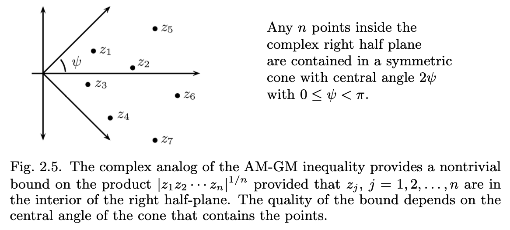

<head>
    
    
</head>

# Table of Contents

1.  [Polya's Coaching and Carleman's Inequality](#org0beded2)
2.  [exercise](#org82bb2fa)
    1.  [Bounds by Pure Powers](#org757c451)
    2.  [A Canadian Challenge](#orgd10957a)
    3.  [A Bound Between Differences](#orgec1fad0)
    4.  [Akerberg's Refinement](#org9564073)
    5.  [An AM-GM Inequality for Complex Numbers](#org1e59382)
    6.  [A Leap-Forward Fall-Back Tour de Force](#org90de841)

对非负实数 $ a_ {1}, a_ {2}, \\ldots, a_ {n} $ 和每个正实数序列 $ p_ {1}, p_ {2}, \\ldots, p_ {n} $，该序列和为1，有

$ \\begin{equation} a_ {1}^{p_ {1}} a_ {2}^{p_ {2}} \\ldots a_ {n}^{p_ {n}} \\leq p_ {1}a_ {1} + p_ {2}a_ {2} + \\cdots + p_ {n}a_ {n} \\end{equation} $

证明：我们利用公式 $ x \\leq e^{x-1} \\qquad for \\, all \\, x \\in R $，有

$ \\begin{equation} a_ {k} \\leq e^{a_ {k} - 1} \\quad and \\quad a_ {k}^{p_ {k}} \\leq e^{p_ {k}a_ {k} - p_ {k}} \\end{equation} $

则有 $ a_ {1}^{p_ {1}} a_ {2}^{p_ {2}} \\ldots a_ {n}^{p_ {n}} = exp\\left(\\{\\sum_ {k=1}^{n}p_ {k}a_ {k} \\} - 1 \\right) $

然后我们考虑引入新变量 $ \\alpha_ {k}, k = 1,2,\\ldots, n $，使得

$ \\begin{equation} \\alpha_ {k} = \\frac{a_ {k}}{A} \\qquad where \\, A = p_ {1}a_ {1} + p_ {2}a_ {2} + \\cdots + p_ {n}a_ {n} \\end{equation} $

然后我们得到 $ \\left(\\frac{a_ {1}}{A}\\right)^{p_ {1}} \\left(\\frac{a_ {2}}{A}\\right)^{p_ {2}} \\cdots \\left(\\frac{a_ {n}}{A}\\right)^{p_ {n}} \\leq exp\\left(\\{\\sum_ {k=1}^{n}p_ {k} \\frac{a_ {k}}{A} \\} - 1\\right) = 1 $

则得证。

# Polya's Coaching and Carleman's Inequality

**Carleman's Inequality** 对每个正实数序列 $ a_ {1}, a_ {2}, \\ldots $，有

$ \\begin{equation} \\sum_ {k=1}^{\\infty} \\left( a_ {1} a_ {2} \\cdots a_ {k} \\right)^{\\frac{1}{k}} \\leq e \\sum_ {k=1}^{\\infty}a_ {k} \\end{equation} $

证明：这里我们构造一序列因子ck ，有

$ \\begin{equation} \\begin{aligned} \\sum_ {k=1}^{\\infty}\\left(a_ {1} a_ {2} \\cdots a_ {k}\\right)^{\\frac{1}{k}} &= \\sum_ {k=1}^{\\infty}\\frac{\\left(a_ {1}c_ {1}a_ {2}c_ {2} \\cdots a_ {k}c_ {k}\\right)^{\\frac{1}{k}}}{\\left(c_ {1}c_ {2} \\cdots c_ {k}\\right)^{\\frac{1}{k}}} \\\\ &\\leq \\sum_ {k=1}^{\\infty} \\sum_ {k=1}{\\infty}\\frac{a_ {1}c_ {1} + a_ {2}c_ {2} + \\cdots + a_ {k}c_ {k}}{k\\left(c_ {1}c_ {2} \\cdots c_ {k}\\right)^{\\frac{1}{k}}} \\\\ &=\\sum_ {k=1}^{\\infty}a_ {k}c_ {k}\\sum_ {j=k}^{\\infty}\\frac{1}{j\\left(c_ {1}c_ {2} \\cdots c_ {j}\\right)^{\\frac{1}{j}}} \\end{aligned} \\end{equation} $

我们可以精心选择这样的ck ，$ k = 1, 2, \\ldots $，使得其和有界

$ \\begin{equation} s_ {k} = c_ {k} \\sum_ {j=k}^{\\infty}\\frac{1}{j\\left(c_ {1} c_ {2} \\cdots c_ {j}\\right)^{\\frac{1}{j}}} \\qquad k = 1, 2, \\ldots \\end{equation} $

于是我们取这样的ck ，使得

$ \\begin{equation} \\left( c_ {1} c_ {2} \\cdots c_ {j}\\right)^{\\frac{1}{j}} = j + 1 \\qquad for \\, j = 1, 2, \\ldots \\end{equation} $

这样我们有

$ \\begin{equation} s_ {k} = c_ {k} \\sum_ {j=k}^{\\infty}\\frac{1}{j \\left(c_ {1}c_ {2} \\cdots c_ {j}\\right)^{\\frac{1}{j}}} = c_ {k} \\sum_ {j=k}^{\\infty}\\frac{1}{j\\left(j + 1\\right)} = \\frac{c_ {k}}{k} \\end{equation} $

通过如下等式：

$ \\begin{equation} c_ {1} c_ {2} \\cdots c_ {j-1} = j^{j-1} \\quad and \\quad c_ {1} c_ {2} \\cdots c_ {j} = \\left(j+1\\right)^{j} \\end{equation} $

我们可以推出：

$ \\begin{equation} c_ {j} = \\frac{\\left(j+1\\right)^{j}}{j^{j-1}} = j \\left(1 + \\frac{1}{j}\\right)^{j} \\end{equation} $

这样我们就得到：

$ \\begin{equation} \\sum_ {k=1}^{\\infty}\\left(a_ {1} a_ {2} \\cdots a_ {k}\\right)^{\\frac{1}{k}} \\leq \\sum_ {k=1}^{\\infty}\\left(1 + \\frac{1}{k}\\right)^{k} a_ {k} \\leq e \\sum_ {k=1}^{\\infty}a_ {k} \\end{equation} $

# exercise

## Bounds by Pure Powers

试证明对正实数x, y, $ \\alpha, \\beta $，有

$ \\begin{equation} x^{\\alpha}y^{\\beta} \\leq \\frac{\\alpha}{\\alpha+\\beta}x^{\\alpha+\\beta} + \\frac{\\beta}{\\alpha+\\beta}y^{\\alpha+\\beta} \\end{equation} $

对典型地推理，证明更好的边界：$ x^{2004}y + xy^{2004} \\leq x^{2005}+y^{2005} $

证明：利用公式 $ a_ {1}^{p_ {1}}a_ {2}^{p_ {2}} \\leq p_ {1}a_ {1} + p_ {2}a_ {2} $，我们设 $p_ {1} = \\frac{\\alpha}{\\alpha+\\beta}, p_ {2} = \\frac{\\beta}{\\alpha+\\beta}, a_ {1} = x^{\\alpha+\\beta}, a_ {2} = y^{\\alpha + \\beta} $，然后利用该不等式即得证。

然后利用求得的公式，令 $ \\alpha = 2004, \\beta = 1 \\, and \\, \\alpha = 1, \\beta = 2004 $带入分别计算，然后加和可得后面不等式的证明。

## A Canadian Challenge

2002年加拿大数学奥林匹克赛中参与者被要求证明如下公式边界

$ \\begin{equation} a + b + c \\leq \\frac{a^{3}}{bc} + \\frac{b^{3}}{ac} + \\frac{c^{3}}{ab} \\end{equation} $

并确定等号什么时候成立。

证明：先把不等式两边乘以abc，得到 $ a^{2}bc + ab^{2}c + abc^{2} \\leq a^{4} + b^{4} + c^{4} $，再同样利用之前学过的不等式，我们有 $ a^{2}bc = \\left(a^{4}\\right)^{\\frac{1}{2}} + \\left(b^{4}\\right)^{\\frac{1}{4}} + \\left(c^{4}\\right)^{\\frac{1}{4}} \\leq \\frac{1}{2} a^{4} + \\frac{1}{4}b^{4} + \\frac{1}{4}c^{4} $，$ ab^{2}c, abc^{2} $也同样处理，最后相加即得证

等式成立需要 $ a = b = c $

## A Bound Between Differences

对非负实数x和y及整数n有 $ n \\left(x - y\\right)\\left(xy\\right)^{\\frac{\\left(n-1\\right)}{2}} \\leq x^{n} - y^{n} $

证明：利用不等式 $ \\left(x^{j+k}y^{j+k}\\right)^{\\frac{1}{2}} \\leq \\frac{1}{2} \\left(x^{j}y^{k}+x^{k}y^{j}\\right) $，我们设 k = n - 1 - j且对 $ 0 \\leq j < n $遍历有：

$ \\begin{equation} n\\left(x+y\\right)^{\\frac{\\left(n-1\\right)}{2}} \\leq x^{n-1} + x^{n-2}y + \\cdots + xy^{n-2} + y^{n-1} = \\frac{x^{n} - y^{n}}{x-y} \\end{equation} $

即得证

## Akerberg's Refinement

对任意非负实数 $ a_ {1}, a_ {2}, \\ldots, a_ {n} $ 且 $ n \\ge 2 $，有如下边界：

$ \\begin{equation} a_ {n}\\{\\frac{a_ {1} + a_ {2} + \\cdots + a_ {n-1}}{n-1}\\}^{n-1} \\le \\{ \\frac{a_ {1} + a_ {2} + \\cdots + a_ {n}}{n}\\}^{n} \\end{equation} $

该关系是AM-GM不等式的提炼因为AM-GM不等式符合该边界的迭代。为证明该式，首先必须证明

$ \\begin{equation} y\\left(n - y^{n-1}\\right) = ny - y^{n} \\le n - 1 \\qquad \\forall y \\ge 0 \\end{equation} $

其中的关键是选择一个巧妙的y

证明：第二个不等式很容易证明，这里不详细展开了。设 $ S_ {n} = a_ {1} + a_ {2} + \\cdots + a_ {n} $，然后我们选择y使得 $ y^{n-1} = \\frac{n a_ {n}}{S_ {n}} $，则我们有 $ n - y^{n-1} = \\frac{n S_ {n-1}}{S_ {n}} $，然后带入第二个不等式，有 $ \\left(\\frac{n a_ {n}}{S_ {n}}\\right)^{\\frac{1}{n-1}} \\frac{n S_ {n-1}}{S_ {n}} \\le n - 1 $，调整相关项得 $ \\left(\\frac{n a_ {n}}{S_ {n}}\\right)^{\\frac{1}{n-1}} \\frac{S_ {n-1}}{n-1} \\le \\frac{S_ {n}}{n} $，然后两边同取n - 1次方得 $ \\frac{n a_ {n}}{S_ {n}} \\left(\\frac{S_ {n-1}}{n-1}\\right)^{n-1} \\leq \\left(\\frac{S_ {n}}{n}\\right)^{n-1} $，然后整理一下即得证

## An AM-GM Inequality for Complex Numbers

考虑n个复数 $ z_ {1}, z_ {2}, \\ldots, z_ {3} $的集合S，其极坐标形式 $ z_ {j} = \\rho_ {j}e^{i \\theta_ {j}} $满足如下限制

$ \\begin{equation} 0 \\le \\rho_ {j} < \\infty \\qquad and \\qquad 0 \\le \| \\theta_ {j} \| < \\psi < \\frac{\\pi}{2} \\end{equation} $

如图所示，参数 $ z_ {j} \\in S $的范围在 $ 2 \\psi $，证明对这样的数有一下边界：

$ \\begin{equation} \\left(cos \\psi\\right) \| z_ {1} z_ {2} \\cdots z_ {n} \|^{\\frac{1}{n}} \\le \\frac{1}{n} \| z_ {1} + z_ {2} + \\cdots + z_ {n} \| \\end{equation} $

注意如果 $ z_ {j}, j = 1,2,\\ldots, n $都是实数的话，则 $ \\psi = 0 $，该边界即为AM-GM不等式。

证明：因 $ \| w \| \\ge \| \\Re(w) \| $且 $ \\Re(z_ {j}) = \\rho_ {j} \\cos(\\theta_ {j}) $，我们有

$ \\begin{equation} \\begin{aligned} \| z_ {1} + z_ {2} + \\cdots + z_ {n} \| &\\ge \| \\Re(z_ {1} + z_ {2} + \\cdots + z_ {n}) \| \\\\ &= \| z_ {1} \| \\cos(\\theta_ {1}) + \| z_ {2} \|\\cos(\\theta_ {2}) + \\cdots + \| z_ {n} \|\\cos(\\theta_ {n}) \\\\ &\\ge \\left(\| z_ {1} \| + \| z_ {2} \| + \\cdots + \| z_ {n} \|\\right)\\cos(\\psi) \\\\ &\\ge n\\left(\|z_ {1} \| \| z_ {2} \| \\cdots \| z_ {n} \|\\right)^{\\frac{1}{n}} \\cos(\\psi) \\end{aligned} \\end{equation} $

## A Leap-Forward Fall-Back Tour de Force

使用Cauchy的前倾后退方法推导证明对任意非负数 $ x_ {1}, x_ {2}, \\ldots, x_ {n} $及所有整数次方 $ n = 1,2,\\ldots $有如下边界：

$ \\begin{equation} \\{ \\frac{x_ {1} + x_ {2} + \\cdots + x_ {m}}{m} \\}^{n} \\le \\frac{x_ {1}^{n} + x_ {2}^{n} + \\cdots + x_ {m}^{n}}{m} \\end{equation} $

证明：考虑公式 $ H\\left(n\\right) : \\left(\\frac{x+y}{2}\\right)^{n} \\le \\frac{x^{n} + y^{n}}{2}, \\forall x \\ge 0, y \\ge 0 $，我们来推导H(n+1)：

$ \\begin{equation} \\begin{aligned} \\left(\\frac{x+y}{2}\\right)^{n+1} &= \\left(\\frac{x+y}{2}\\right) \\left(\\frac{x+y}{2}\\right)^{n} \\le \\left(\\frac{x+y}{2}\\right) \\frac{x^{n} + y^{n}}{2} \\\\ &= \\frac{x^{n+1} + y^{n+1} + xy^{n} + yx^{n}}{4} \\\\ &= \\frac{x^{n+1} + y^{n+1}}{2} - \\frac{\\left(x - y\\right)\\left(x^{n} - y^{n}\\right)}{4} \\le \\frac{x^{n+1} + y^{n+1}}{2} \\end{aligned} \\end{equation} $

这样对所有 $ n \\ge 1 $ H(n)都有效。

现在我们这样处理H(n)：

$ \\begin{equation} \\begin{aligned} \\{\\frac{x_ {1} + x_ {2} + x_ {3} + x_ {4}}{4} \\}^{n} &\\le \\frac{1}{2} \\{ \\left(\\frac{x_ {1} + x_ {2}}{2}\\right)^{n} + \\left(\\frac{x_ {3} + x_ {4}}{2}\\right)^{n} \\} \\\\ &\\le \\frac{1}{2} \\{ \\frac{x_ {1}^{n} + x_ {2}^{n}}{2} + \\frac{x_ {3}^{n} + x_ {4}^{n}}{2} \\} \\\\ &= \\frac{x_ {1}^{n} + x_ {2}^{n} + x_ {3}^{n} + x_ {4}^{n}}{4} \\end{aligned} \\end{equation} $

这样重复参数使得对每个k和 $ 2^{k} $个非负实数 $ x_ {1}, x_ {2}, \\ldots, x_ {2^{k}} $的集合，我们有

$ \\begin{equation} \\{ \\frac{x_ {1} + x_ {2} + \\cdots + x_ {2^{k}}}{2^{k}} \\}^{n} \\le \\frac{x_ {1}^{n} + x_ {2}^{n} + \\cdots + x_ {2^{k}}^{n}}{2^{k}} \\end{equation} $

这里我们设 $ H_ {new}\\left(m\\right) $为如下公式：

$ \\begin{equation} \\{ \\frac{x_ {1} + x_ {2} + \\cdots + x_ {m}}{m} \\}^{n} \\le \\frac{x_ {1}^{n} + x_ {2}^{n} + \\cdots + x_ {m}^{n}}{m} \\end{equation} $

m为非负实数 $ x_ {1}, x_ {2}, \\ldots, x_ {m} $的任意集合，我们知道 $ H_ {new}\\left(m\\right) $当m为2的次方是有效，这里我们如果能证明当$ H_ {new}\\left(m\\right) $ 有效时$ H_ {new}\\left(m - 1\\right) $也有效即可。

给定m - 1个非负实数 $ S = \\{ x_ {1}, x_ {2}, \\ldots, x_ {m-1} $，我们引入一个新的变量y，$ y = \\frac{x_ {1} + x_ {2} + \\cdots + x_ {m-1}}{m-1} $，因为y和 $ \\frac{x_ {1} + x_ {2} + \\cdots + x_ {m-1} + y}{m} $相等，我们应用H(m)到集合 $ S \\cup \\{y\\} $，有

$ \\begin{equation} y^{n} \\le \\frac{x_ {1}^{n} + x_ {2}^{n} + \\cdots + x_ {m-1}^{n} + y^{n}}{m} \\end{equation} $

整理可得

$ \\begin{equation} y^{n} \\le \\frac{x_ {1}^{n} + x_ {2}^{n} + \\cdots + x_ {m-1}^{n}}{m-1} \\end{equation} $

即得证
