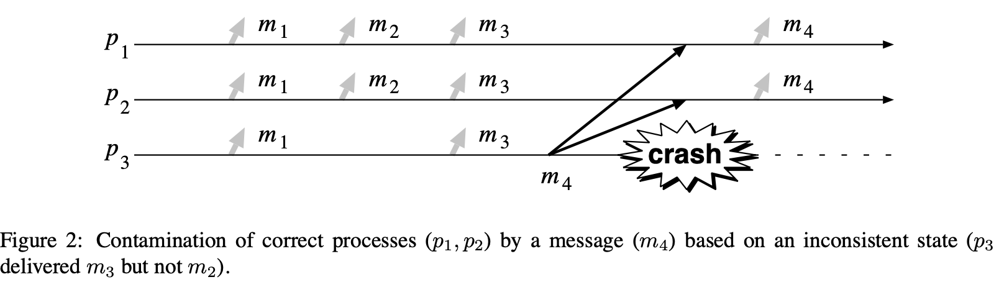

<head>
    
    
</head>

# Table of Contents

1.  [Algorithm](#orgd8af2cf)
2.  [Review](#org481a26c)
    1.  [简介](#org2f217f0)
        1.  [总序广播文献](#orga8ba206)
        2.  [相关工作](#org7f68034)
        3.  [贡献](#orga548954)
        4.  [结构](#org5803692)
    2.  [基本术语和记号](#org82fcfd6)
        1.  [记号](#orgdbbd63b)
        2.  [基本系统模型](#org0fc6364)
        3.  [Oracles](#org0fa7d51)
        4.  [同意问题](#orgced80fe)
        5.  [异步总序广播算法的注意事项](#orgdecb5d4)
        6.  [进程控制崩溃](#org870dc15)
    3.  [指导说明（总序广播）](#org0b99c2e)
    4.  [算法属性](#orgdc6bcaf)
        1.  [统一](#org437e6a7)
        2.  [缺陷](#org7dd2fd8)
        3.  [其他排序属性](#orge76cbc2)
    5.  [目标组的属性](#orgad05e52)
3.  [Tips](#org239b077)
4.  [Share](#org52ec16c)

# Algorithm

Leetcode 680: 

# Review

Total Order Broadcast and Multicast Algorithms:∗ Taxonomy and Survey

<http://citeseerx.ist.psu.edu/viewdoc/download?doi=10.1.1.3.4709&rep=rep1&type=pdf>

总序广播和多播（也称为原子广播或原子多播）在分布式系统中是一个重要的问题，特别对容错。剪短地说，最初地确定发送到一系列进程的消息会被这些进程已相同的总序转发。

该问题激发了大量的工作，大量的提名算法。本文提出基于顺序机制的一个典型总序广播和多播算法，且处理一些重要的其他问题。本文研究60种算法，这样提供问题的最扩展的研究。本文讨论算法的同步和异步模型，并学习不同算法的属性和行为。

## 简介

分布式系统和应用程序是出名的难构建。最主要是由于这样的系统的不可避免的并发，及结合提供全局控制的困难度。相比提供早期的比标准点对点通讯更高地保证，依赖组通讯极大地缩减了困难度。一个这样的初始方案为总序广播。该方案确保所有的进程已相同的顺序转发发送到一系列进程的消息。总序广播是重要的，例如，一个实现的中心角色是状态机（也称为活动节点）。它也有其他应用程序，比如时钟同步，支持协调写的计算机，分布式共享内存，或分布式锁。最近，它也显示总序广播的使用能显著地改善复制数据库的性能。

### 总序广播文献

存在关于总序广播可观的文献和许多算法，及各种处理，被提出用来解决该问题。相比它的实际属性，假设，目标或其他重要方面，要困难。因此很难知道什么样的解决方案适合给定的应用程序内容。当面临新的需求，缺乏对总序广播问题的规划常常导致工程师和研究员要么开发新的算法而不是适配现有的解决方案（重新发明轮子），或使用一个不是很好的解决方案适配应用程序需要。一个改进当前解决方案的重要步骤是提供现有算法的分类。

### 相关工作

之前分类和比较总序广播算法的尝试是Anceaume 1993b, Anceaume and Minet 1992, Cristian et al. 1994, Friedman and van Renesse 1997, Mayer 1992。然而，都没有基于现存算法的理解调查，因此缺乏一般性。

最完整的比较是Anceaume and Minet 1992，基于算法的属性的有趣处理。该论文引起一些基础的问题，我们的一些工作基于它的启发。然而它有一点落后了。此外，作者只学习了7种不同的算法，例如，没有一个基于通讯历史处理。

Cristian et al. 1994使用另一种处理聚焦于这些算法的实现而不是它们的属性。他们学习4种不同的算法，且使用离散事件模拟比较他们。他们根据不同实现策略的性能找到了有趣的结果。然而，他们缺失对不同算法属性的讨论。此外，他们只比较了4种算法，他们的工作比Anceaume的更缺乏一般性。

Friedman and van Renesse 1997学习了压缩消息在算法性能的影响。为这个目的，他们学习了6种算法，包括通过Cristian el al 1994的学习。他们测量这些算法实际的性能且确认了Crisitan et al 1994的观察。他们显示压缩一些协议消息为单个物理消息提供了一个有效的方法改进算法的性能。该比较也缺乏一般性，但这是非常能理解的但这不是本论文的主要关心点。

Mayer 1992定义了一个框架使得总序广播算法能从性能方面进行比较。该框架的定义对算法扩展和有意义的比较是一个重要的步骤。然而，论文在比较大量算法方面没有进一步处理。

### 贡献

本文我们提出一类基于顺序消息机制的总序广播算法。选择的原因是顺序机制是算法通讯范型最有影响的特征：相同类型的两个算法因此展示了相似的行为。我们定义顺序机制的5种类型：通讯历史、基于优先级、移动序列、固定序列和目标同意。

在本文中，我们也提供关于60种已发布的总序广播算法的广泛的检查。只要可能，我们提及每个算法的属性和假设。然而不总是可能因为在本文中的信息不总是能精确地对应到算法特征行为。

### 结构

本文逻辑上组织为3个主要部分：指导说明，机制和调查。更精确地，剩余的本文结构如下。

第一部分是关于定义，指导说明和属性。第2节介绍重要的概念，术语和记号。第3节展现最常见的总序广播问题的指导说明（原子广播）。基于这个指导说明，第4-6节讨论一些重要的属性（及其他问题）和它们在指导说明问题上的影响。更特别地，第4节讨论可能的算法额外属性（例如，单个 vs 多个群），及第6节展示当考虑分区系统和拜占庭故障时指导说明系统模型的影响。

第二部分描述机制。在第7节，我们定义如下5种总序广播算法，根据消息顺序：通讯历史、优先级、移动序列，固定序列和目标同意。第8节讨论从一般化上的故障问题。

第三部分我们审查现存的算法。更特别地，第9节给定一个白板调查总序广播算法找到的文献。算法按它们的类型分组，且我们讨论每个算法的规律特性。

在第10节，我们谈论各种跟总序广播相关的其他问题，第11节包含论文。

## 基本术语和记号

### 记号

$ \\mathcal{M} $是包含所有有效消息的集合，$ \\Pi $是系统中所有进程集合，给定任意消息m，sender(m)指明 $ \\Pi $中发送消息m的进程，且Dest(m)记为m的目标进程的集合。

另外，$ \\Pi_ {sender} $是 $ \\Pi $中可能发送消息的进程集合。

$ \\begin{equation} \\Pi_ {sender} \\stackrel{def}{=} \\cup_ {m \\in \\mathcal{M}}sender\\left(m\\right) \\end{equation} $

$ \\Pi_ {dest} $是所有可能的目的集合 $ \\Pi_ {dest} \\stackrel{def}{=} \\cup_ {m \\in \\mathcal{M}}Dest\\left(m\\right) $

### 基本系统模型

一个分布式系统包含一系列进程 $ \\Pi = \\{p_ {1}, \\ldots, p_ {n} \\} $通过通讯频道交换唯一识别号消息。存在一些模型限制系统行为。考虑最重要的特征是同步性和故障模型。

1.  同步性

    模型的同步性是进程行为和通讯频道上的时间相关的假设。更确切地，通常考虑两个主要参数。第一个参数是进程速度间隔，系统中最快的进程和最慢的速度的差异。第二个参数是通讯延迟，消息发送和接收需要的时间。系统的同步性被定义考虑这两个参数的各种边界。对每个参数，通常考虑如下的同步性水平：
    
    1.  知道一个总能确保的上界
    2.  有一个总能确保的未知上界
    3.  有一个最终总能确保的已知上界
    4.  有一个最终总能确保的未知上界
    5.  参数值无上界
    
    两个参数的系统假设满足(1)被称为同步系统，在另一个极端中，一个进程速度和通讯延无上界的系统被称为异步系统。在这两个极端之间定义各种部分同步系统模型。

2.  进程故障

    系统故障模型指明期望会发生的故障类型，及这些故障可能或不能发生的条件。通常使用的进程故障集合类型如下：
    
    -   崩溃故障。当一个进程崩溃，它永远停止工作。这意味着它停止执行任意活动包含发送、传输或接收任何消息
    -   丢失故障。当一个进程丢失故障，它丢失执行一些行为比如发送或接收消息
    -   时间故障。当一个进程违法一个同步性假设则发生了一个时间故障。该类型故障在异步系统是没有的
    -   拜占庭故障。拜占庭故障是最一般化的故障类型。一个拜占庭组件允许任意行为。例如，一个故障进程可能改变消息内容，重复消息，发送未请求的消息，或甚至恶意尝试使整个系统崩溃
        
        实际上，经常考虑拜占庭故障的一个特殊例子，称为鉴权拜占庭故障。鉴权拜占庭故障允许拜占庭进程任意行为。然而，它假设系统已访问一些鉴权机制（例如，数字签名），这样使它可能通过拜占庭进程检测有效消息的伪造。当在后续提及拜占庭故障（在第9节）时，我们指的是鉴权拜占庭故障。
    
    **注意（时间故障的特殊性）** 一个系统以故障模型为特征且展示了同步性总计。当故障模型正常正交与系统同步性，这不是时间故障直接相关系统同步性的例子。时间故障是以违背系统同步性为特征。

3.  通讯

    根据它们提供的确保，存在通讯频道的一些定义。我们考虑如下类型的通讯频道。除非说明否则，本文假设通讯频道没有重复消息也没有错误的消息。
    
    1.  可靠频道
    
        可靠频道保证如果一个正确的进程p发送一个消息m给一个正确的进程q，则q将最终接收到消息m。这通常假设可靠通讯被网络协议栈提供（例如TCP/IP）
    
    2.  丢失频道
    
        丢失频道是那些丢失消息的频道。一些丢失消息通常的原因是：网络冲突，噪声频道，缓存过载，连线掉线，路由表损坏或间断的连接。虽然消息丢失维护通常由网络栈机制实现（物理层和传输层之间），但网络很弱任然可能发生。这可以在两种丢失频道类型中进行区分。
        
        最简单的例子，通讯频道有一个丢失消息数的上界k。拷贝这样的丢失是简单的，因为它有效地发送一个消息k + 1次为了确保至少一个拷贝会被接收。该模型在网络不差的情况下性能会差一些。
        
        相反地，公平丢失频道允许无边界消息数量丢失。简单地说，公平丢失通讯频道被定义如下。频道不产生伪造消息，重复消息，和不转换消息内容。额外地，一个公平丢失频道保证如果一个无穷多消息被发送，这些消息的一个有限子集被接收。

### Oracles

依赖于系统同步性，一些分布式问题不能解决。还有，如果系统被一个权威扩展这些问题变得可解决。简单地说，一个权威是一个分布式组件处理可查询，且给定一些信息使得算法可用来指导它的选择。在分布式算法中，至少3个不同类型的权威在使用：（物理的）时钟，故障检测器和硬币抛投。因为被这些权威提供的信息是有效用来解决问题是其他的不能解决的，这些权威争论系统模型的威力。

1.  物理时钟

    一个时钟权威给定物理时间的信息。每个进程访问它本地的物理时钟且时钟被假设给出值是单调递增的。
    
    时钟返回的值也能被进一步的假设限制，比如同步。两个时钟是 $ \\epsilon $同步的如果，在任意时刻，两个时钟返回的值的差异不超过 $ \\epsilon $。两个时钟是完美同步的如果 $ \\epsilon = 0 $。相反地，如果没有 $ \\epsilon $的边界则时钟不同步。
    
    依赖于这些假设，时钟带来的信息可能或不能跟实时相关。同步时钟不需要跟实时同步。然而，如果所有本地时钟跟实时同步，则它们当然相互同步。
    
    注意，基于GPS系统的出现，假设时钟完美同步实时是不现实的，即使在广域系统。而是以一些微秒的精确度达到时钟同步。相反地，基于软件时钟的精确度要低几个数量级。

2.  故障检测

    一个故障检测是一个权威，提供进程当前状态的信息。例如，是否一个进程已崩溃。
    
    故障检测的概念被Chandra and Toueg 1996形式化。简单地说，一个故障检测模型为一系列分布式模块，一个模块 $ FD_ {i} $附着在每个进程 $ p_ {i} $。任意进程 $ p_ {i} $可查询它的故障检测模块 $ FD_ {i} $关于其他进程的状态。
    
    故障检测被认为是不可靠的，它们提供的信息可能不总是对应系统真实的状态。例如，一个故障检测模块 $ FD_ {i} $可能提供错误信息说某个进程 $ p_ {j} $已崩溃。而实际上，$ p_ {j} $在正常运行。相反地，$ FD_ {i} $可能提供信息一个进程 $ p_ {k} $是正常的，而实际上它已经崩溃。
    
    为反映故障检测提供的信息不可靠性，我们说一个进程 $ p_ {i} $不管 $ FD_ {i} $开推断某个进程 $ p_ {j} $，故障检测模块附着到 $ p_ {i} $，返回（不可靠）信息 $ p_ {j} $已崩溃。换句话说，一个怀疑是一个信任（例如，“ $ p_ {i} $相信 $ p_ {j} $已崩溃“）跟已知事实相反（例如，" $ p_ {j} $且 $ p_ {i} $已知道“）。
    
    存在故障检测的一些类型，依赖于故障检测如何提供不可靠信息。这被两个属性定义，完成度和精确度，其限制可能的错误。这些属性用例子解释最好。故障检测类型 $ \\diamondsuit S $被如下属性定义：
    
    （强完成度）最终每个故障进程被所有正常进程永久地怀疑
    
    （最终弱精确度）有一个时间，在它之后一些正常进程不会被任意正常进程怀疑
    
    存在故障检测的其他类型，但一个所有故障检测的完整描述超出了本文的范围。

3.  随机权威

    另一个处理扩展系统模型的能力包含引入能力来产生随机值。例如，进程能访问一个模块当查询时产生一个随机位（例如，Bernoulli随机变量）。
    
    这一类算法被称为随机算法。这些算法以概率方式解决问题比如共识。概率这样的算法在一些时间t到1之前终止如同t到无穷。注意确定地解决一个问题和已概率为1解决它是不同的。

### 同意问题

同意问题被认为分布式系统中的基本问题类型。存在许多不同的同意问题共享一个通用的范型：进程不得不达成一些共同的决定，这依赖于问题。本文中，我们最考虑如下4中重要的同意问题：可靠广播，拜占庭同意，共识和总序广播

1.  可靠广播

    如名称所示，可靠广播被定义为原始广播。即消息m的可靠广播确保m被所有的进程转发如果进程 sender(m)是正确的。如果sender(m)不正确，则m必须要么被所有正确的进程要么没有进程转发。

2.  拜占庭同意

    拜占庭同意问题也通常称为拜占庭将军问题。在这个问题中，每个进程有一个先验知识一个特殊进程s被假设广播一个消息m。非形式化地，问题需要所有正常的进程转发相同的消息，如果发送者s是正常的，则消息必须为m。
    
    如名称所示，拜占庭同意跟拜占庭故障相关。一个拜占庭同意变量称为终止可靠广播

3.  共识

    非形式化地，共识问题定义如下，每个进程 $ p_ {i} $开始提议一个值 $ v_ {i} $。然后，所有非故障进程必须最终确定一个相同的值v，其必须为提议值之一。

4.  总序广播

    总序广播问题，也称为原子广播，是一个同意问题。简单地说，它定义为一个可靠广播问题，其必须确保所有转发的消息被所有进程已相同的顺序转发。问题的说明在第3节给定。

5.  重要的理论结果

    有至少4个基本理论结果直接相关总序广播和共识问题。首先，总序广播和共识是对应的问题，例如，如果存在一个算法解决一个问题，则它能被转换为解决另一个问题。Dolev et al 1987显示总序广播可被转化为共识，且Chandra adn Toueg 1996显示共识可被转化为总序广播。其次，Fischer et al 1985表示在异步系统中共识没有确定性解决方案如果仅一个进程可能崩溃的情况下。尽管Chandra and Toueg 1996表示共识能在异步系统扩展了故障检测的情况下得到解决，及部分同步性（Dolev et al 1987, Dwork et al 19880，或使用随机。最后，Chandra et al 1996显示在异步系统中最弱的故障检测来解决共识是 $ \\diamondsuit S $类型。

### 异步总序广播算法的注意事项

在许多关于总序广播的论文中，作者声称他们的算法能解决在异步系统带进程故障的问题。这个声明当然是错误的，或不完整的。

从一个形式化的观点看，最实际的系统是异步的因为它不可能假设有一个通讯延迟的上界。尽管这样，问什么这么多前辈依然声称他们的算法在实际系统中能解决同意问题呢？这是因为许多论文没有形式化处理算法的活跃问题，或认为它已有效考虑一些非形式化同步水平，被这样的假设捕获“多数消息会达到它们的目的地在一个已知延迟 $ \\delta $ “。这个模型被认为时间异步模型和相关时间故障的同步模型。假设消息将以一个给定概率 $ P [T + \\delta ] $遇到截止时间 $ T + \\delta $相当于假设消息已一个已知概率 $ 1 - P [ T + \\delta ] $错过截止时间 $ T + \\delta $（例如时间故障）。这没有设置时间故障发生的边界，但设置了这样的故障发生的概率限制。然而，形式上这不足以建立正确性。

### 进程控制崩溃

进程控制崩溃是给定进程的能力来杀死其他进程或提交自杀操作。即这是认为强制进程崩溃的能力。系统模型中允许进程控制崩溃增强了它的能力。这使得它可能转化严重的故障（例如，疏漏，拜占庭）为相对弱化的故障（例如，崩溃），且模拟一个几乎完美的故障检测。然而，这种能力不是没有代价。

1.  故障自动转换

    Neiger and Toueg 1990呈现了一种技术使用进程控制崩溃来转换严重的故障（例如，疏忽，拜占庭）为弱一些的故障（比如，崩溃故障）。简单地说，该技术基于进程已监控它们的行为的思想。然后，不管何时一个进程开始行为异常（例如，疏忽，拜占庭），它会被杀死。
    
    然而，该技术不能用在丢失频道的系统中，或分区。在这样的情况下，进程可能会互相杀死直到系统中没有进程依然存活。

2.  模拟一个近乎完美的故障检测

    一个完美的故障检测（P）满足强完成度和强精确度（没有进程在它崩溃之前被怀疑，Chandra and Toueg 1996）。在实际系统中，完美故障检测非常困难实现因为难以区分崩溃进程和慢的进程。Fetzer 2003提出一个协议在带进程控制崩溃的时间异步模型中来模拟一个完美故障检测。该协议使用watchdog（硬件或软件）且确保没有进程在它崩溃之前被怀疑。进程控制崩溃使它也可能模拟一个几乎完美故障检测满足一个更弱化的精确属性：
    
    （次强精确度）没有正常进程被任意正常进程怀疑
    
    模拟的思想是简单的。设 $ \\mathcal{X} $为一个故障检测满足强完成度和任意形式的精确度：不管何时 $ \\mathcal{X} $怀疑一个进程p，则p被杀死（强制崩溃）。结果，错误的怀疑被后验纠正，上面次强精确度属性被满足。进程控制崩溃的一个主分区组成员服务典型地模拟这样的故障检测，被用在一些总序广播算法中。

3.  自由启动的开销

    进程控制崩溃在实际中通常用在总序广播算法中，然而，该机制有一个代价。
    
    为便于理解，首先需要区分两种崩溃故障类型：真的故障和引发的故障。真故障是自然发生在系统中的故障，没有进程的干扰。相反地，引发的故障是被某些进程触发，例如，这是进程控制崩溃的结果。
    
    一个容错算法可容忍一个有界数量进程的崩溃。在进程控制崩溃的系统中，这限制真的故障，也限制引发的故障。这意味着每个引发的故障事实上会减少可以被容忍的真故障的数量。即它减少系统事实上的容错。

## 指导说明（总序广播）

本节，我们给定总序广播问题的形式化说明。虽然存在许多总序广播的变种，取决于系统模型，本节描述问题的最简单形式，例如，崩溃故障和关闭系统。然后，在4到6节，我们考虑一些影响算法的问题，例如拜占庭故障，统一或网络分区。

形式上，总序广播被定义为两个术语，TO-broadcast(m)和TO-deliver(m)，$ m \\in \\mathcal{M} $是某个消息。当进程p执行TO-broadcast(m)，我们可说p TO-broadcast m。我们假设每个消息m可被唯一标识，且它的发送者带这个标识，记为sender(m)。另外，我们假设对任意给定消息m和任意运行，TO-broadcast(m)最多执行一次。这样，总序广播被如下属性定义：

（有效性）如果一个正常进程TO-broadcast一个消息m，则它最终TO-deliver m

（统一同意）如果一个进程TO-deliver一个消息m，则所有正常的进程最终TO-deliver m

（统一集成）对任意消息m，每个进程TO-deliver m最多一次，且只在m之前被sender(m) TO-broadcast

（统一总序）如果进程p和q都TO-deliver消息m和m'，则p TO-deliver m在m'之前当且仅当q TO-deliver m在m'之前

有效性和统一同意是活跃属性。简略地说着意味着，在时间任意点，不管在该点发生什么，它仍然可能最终保持属性。统一集成和统一总序是安全属性。这意味着，如果在时间某点属性没有保持，不管之后发生什么，属性最终不会保持。注意Charron-Bost et al显示，对于故障，一些（非统一）属性通常相信安全属性为实际的活跃属性。他们提出安全和活跃概念的提炼避免反直觉分类。

注意：以上的定义是总序广播最通常的定义。然而，尽管它很流行，该定义已知容易有一个重要的瑕疵。该问题将在4.2节讨论，我们将给出排序属性的一个更好的形式化定义。

## 算法属性

### 统一

之前总序广播的定义，同意和总序属性是统一的。这意味着这些属性不仅应用于正确的进程，也用于故障进程。例如，对统一的总序，一个进程不允许乱序转发任意消息，即使它已故障。相反地，（非统一）总序只应用于正常进程，因此不需要对故障进程行为有任意限制。

一些类型的应用程序比如原子提交需要统一属性。然而，因为在算法中强制统一总是有一个性能开销，考虑弱化问题指导使用非统一属性也能重要。非统一属性在应用程序层面上可能导致不一致。然而，这不总是一个问题，特别地如果应用程序知道如何纠正这样的不一致的时候。非统一同意和总序说明如下：

（同意）如果一个正常的进程TO-deliver一个消息m，则所有正常的进程最终TO-deliver m

（总序）如果两个正常进程p和q都TO-deliver消息m和m'，则p TO-deliver m在m'之前当且仅当q TO-deliver m在m'之前

统一和不统一的组合定义了容错总序广播问题的4种不同的指导说明。这些定义形成问题的层次，在Wilhelm and Schiper 1995中扩展讨论。

### 缺陷

缺陷问题来自于观测，即使用最强的指导说明（例如，统一同意和统一总序），总序广播不能防止一个缺陷进程p达到一个不一致状态（例如，在崩溃之前）。这是一个严重问题因为p可能“逻辑上”TO-broadcast一个基于不一致状态的消息，且这样误导正常进程

1.  示例

    
    
    上图展示了一个例子，一个不正常进程误导正常进程。进程 $ p\_ {3} $转发消息 $ m\_ {1}和 m\_ {3} $，但不转发 $ m\_ {2} $，这样，它的状态是不一致的当它广播 $ m\_ {4} $到其他进程前崩溃。正常进程 $ p\_ {1}和p\_ {2} $转发 $ m\_ {4} $，这样被不一致状态的 $ p\_ {3} $污染。这里再次强调上图的情况甚至满足最强的指导说明

2.  指导说明

    它可能扩展或改写总序广播的指导说明使得它不允许污染。这能用两种方法得到。第一个方法是如果进程状态不一致则禁止进程发送消息。然而这很难形式化为一个属性。因此第二个解决方案通常更好，其包含防止任意转发消息的进程可能导致不一致状态。
    
    Aguilera, Delporte-Gallet et al. [2000]提出一个统一总序的新形式，不同于传统定义，它不容易被污染因为它不允许转发序列的空缺：
    
    （自由空缺统一总序）如果一些进程在消息m之后转发消息m'，则进程转发m'只在它已转发消息m之后
    
    相对的，一个旧的形式使用转发历史且需要，对任意两个给定进程，一个的历史是另一个历史的前缀。这表达为如下属性：
    
    （前序）对任意两个进程p和q，要么hist(p)是hist(q)的前缀或hist(q)是hist(p)的前缀，hist(p)和hist(q)是被p和q转发的消息序列
    
    注意：使用前序的总序广播指导说明事实上会阻止进程的动态合并（例如，在一个组成员关系中）。这可以绕过，但结果属性会非常复杂。因此，用更简单的Aguilera Delporte-Gallet et al的提议更好

3.  算法

    在本文学习的大量算法中，绝大部分在指导说明中忽略污染问题。尽管如此，大多数能避免污染。算法要么 (1)防止所有进程达到不一致状态，要么(2)防止不一致状态的进程给其他进程发送消息

### 其他排序属性

总序属性基于目的地限制消息转发的顺序，即，属性跟发送进程无关。定义可进一步被发送者相关属性限制，FIFO顺序和随意顺序

1.  FIFO顺序

    只是总序不能确保消息以它们发送的顺序转发（例如，先进先出顺序）。这个属性需要应用程序添加到总序。这个属性被称为FIFO序：
    
    （FIFO序）如果一个正常进程TO-broadcast消息m在它TO-broadcast消息m'之前，则没有正常进程转发m'直到已转发m

2.  关系顺序

    分布式系统里的causality符号在Lamport 1978b首次作为官方提出。它基于关系“先于”（记为 $ \\to $）定义在他的重要论文中且在[Lamport 1986b]中被扩展。关系“先于”定义如下：
    
    **定义1** 设 $ e_ {1}和 e_ {j} $为分布式系统中的两个事件。关系 $ e_ {i} \\to e_ {j} $成立仅当如下3个条件之一满足：
    
    1.  $ e_ {i} 和 e_ {j} $是同一个进程上的两个事件，且 $ e_ {i} $在 $ e_ {j} $之前到来
    2.  $ e_ {i} $是一个进程发送消息m且 $ e_ {j} $是另一个进程接收消息m
    3.  存在第3个事件 $ e_ {k}使得 e_ {i} \\to e_ {k} 且 e_ {k} \\to e_ {j} $
    
    这个关系定义为事件集合中不能映射到自身的偏序。这样的消息可被它们对应的发送事件之间的“先于”关系定义。更精确地说，一个消息m被认为是先于消息m'（记为 $ m \\prec m' $）如果m的发送事件先于m'的发送事件
    
    广播消息关系顺序的属性定义如下：
    
    （关系顺序）如果消息m的广播先于消息m'的广播，则没有正常进程转发m'直到已转发m
    
    Hadzilacos and Toueg [Hadzilacos and Toueg 1994]也证明了关系顺序的属性跟FIFO顺序属性及本地顺序的如下属性相当
    
    （本地顺序）如果一个进程广播一个消息m且一个进程转发m在广播m'之前，则没有正常进程转发m'直到已转发m
    
    注意（状态机处理） 关系总序广播需要状态机处理（[Lamport 1978a, Schneider 1990]）。然而，我们认为一些应用程序需要关系顺序，一些不需要

3.  源顺序

    一些论文（例如，[Carcia-Molina and Spauster 1991, Jia 1995]）在单源和多源顺序之间做了一个区分。这些论文定义单源顺序算法作为确保总序仅当一个进程广播消息的算法。这是FIFO广播的特例，使用序列号容易解决。源顺序本身并不有意思，因此我们在本文中不进一步讨论。

# Tips

-   某些书里的内容如果看着比较难理解，先放一放，过几天再看可能又变得显然了
-   学习过程中有周期起伏，有些时候效率高，有些时候效率低，调整好节奏和进度（难度），不好的情况下也要尽量有进度（最好不要导致完全没进展的情况），比如只看一页也行，确保持续力

# Share

Scalability for Dummies - Part 1: Clones

<https://www.lecloud.net/post/7295452622/scalability-for-dummies-part-1-clones>

可扩展Web服务的开放服务器隐藏在负载均衡之后。负载均衡分布负载（用户请求）到你的应用程序服务器组/集群。如果，例如，用户Steve与你的服务交互，他可能第一个请求被服务器2服务，第二个请求被服务器9且可能第三个请求又被服务器2服务。

Steve应该总是从他的请求获得相同的结果，跟服务器无关。这导致扩展性的第一个黄金规则：每个服务器包含相同的代码库且不存储用户相关数据在本地磁盘或内存，像sessions或配置文件图片。

Sessions需要存储在集中的数据存储中，被所有应用程序服务器访问。它可以是外部数据库或外部持久化缓存，如Redis。一个外部持久化缓存将有比外部数据库更好的性能。外部的意思是数据存储不在应用程序服务器上。一些时候在你的应用程序服务器的数据中心或附近。

但如何部署？如何确保代码修改发送到所有服务器而没有服务器仍然用旧代码？这个问题幸运地被Capistrano这个工具解决了。

这样你可以从一个服务器上创建一个映像文件（AWS称这个为AMI - 亚马逊机器映像），使用这个AMI作为所有你的新势力的clone。当你开始一个新的实例，只要做最新代码的初始化部署就行了

