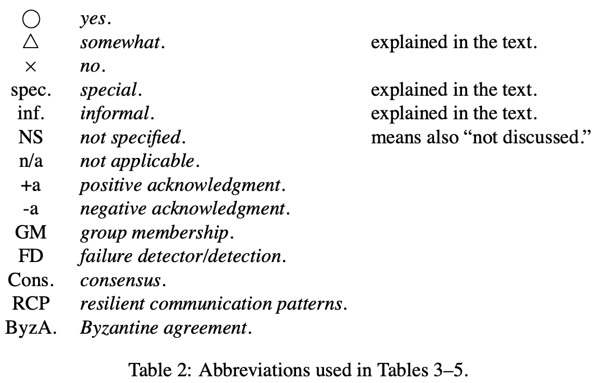

<head>
    
    
</head>

# Table of Contents

1.  [Algorithm](#orgd8af2cf)
2.  [Review](#org481a26c)
    1.  [简介](#org2f217f0)
        1.  [总序广播文献](#orga8ba206)
        2.  [相关工作](#org7f68034)
        3.  [贡献](#orga548954)
        4.  [结构](#org5803692)
    2.  [基本术语和记号](#org82fcfd6)
        1.  [记号](#orgdbbd63b)
        2.  [基本系统模型](#org0fc6364)
        3.  [Oracles](#org0fa7d51)
        4.  [同意问题](#orgced80fe)
        5.  [异步总序广播算法的注意事项](#orgdecb5d4)
        6.  [进程控制崩溃](#org870dc15)
    3.  [指导说明（总序广播）](#org0b99c2e)
    4.  [算法属性](#orgdc6bcaf)
        1.  [统一](#org437e6a7)
        2.  [缺陷](#org7dd2fd8)
        3.  [其他排序属性](#orge76cbc2)
    5.  [目标组的属性](#orgad05e52)
        1.  [闭合组 vs 开放组](#org827dfcd)
        2.  [单组 vs 多组](#orgdce7ab9)
    6.  [总序广播的其他指导说明](#org0dd1836)
        1.  [动态组和分区](#org926bc12)
        2.  [拜占庭故障](#orga005a42)
    7.  [消息顺序的机制](#orgc3be8d8)
        1.  [固定序列者](#org502870d)
        2.  [移动序列者](#org7b91626)
        3.  [基于优先级](#org49f97c4)
        4.  [通讯历史](#org6fddd33)
        5.  [目标同意](#org91f731f)
        6.  [时间自由 vs 基于时间顺序](#orgd2c9285)
    8.  [容错机制](#org272a211)
        1.  [故障检测](#org572441d)
        2.  [组成员服务](#orge6e9d5d)
        3.  [能适应的通讯范型](#org0806860)
        4.  [消息稳定性](#org4a20368)
        5.  [共识](#org5ec9ba4)
        6.  [遗失频道机制](#orgef8a3cf)
    9.  [现有算法的调查](#orgac8adb0)
        1.  [固定序列者算法](#orgf76d630)
        2.  [移动序列者算法](#orge6c839e)
        3.  [基于优先级算法](#org4896202)
        4.  [通讯历史算法](#orgbc180fe)
3.  [Tips](#org239b077)
4.  [Share](#org52ec16c)

# Algorithm

Leetcode 343: <https://leetcode.com/problems/integer-break/>:

<https://dreamume.medium.com/leetcode-343-integer-break-6dde8831cc25>

# Review

Total Order Broadcast and Multicast Algorithms:∗ Taxonomy and Survey

<http://citeseerx.ist.psu.edu/viewdoc/download?doi=10.1.1.3.4709&rep=rep1&type=pdf>

总序广播和多播（也称为原子广播或原子多播）在分布式系统中是一个重要的问题，特别对容错。剪短地说，最初地确定发送到一系列进程的消息会被这些进程已相同的总序转发。

该问题激发了大量的工作，大量的提名算法。本文提出基于顺序机制的一个典型总序广播和多播算法，且处理一些重要的其他问题。本文研究60种算法，这样提供问题的最扩展的研究。本文讨论算法的同步和异步模型，并学习不同算法的属性和行为。

## 简介

分布式系统和应用程序是出名的难构建。最主要是由于这样的系统的不可避免的并发，及结合提供全局控制的困难度。相比提供早期的比标准点对点通讯更高地保证，依赖组通讯极大地缩减了困难度。一个这样的初始方案为总序广播。该方案确保所有的进程已相同的顺序转发发送到一系列进程的消息。总序广播是重要的，例如，一个实现的中心角色是状态机（也称为活动节点）。它也有其他应用程序，比如时钟同步，支持协调写的计算机，分布式共享内存，或分布式锁。最近，它也显示总序广播的使用能显著地改善复制数据库的性能。

### 总序广播文献

存在关于总序广播可观的文献和许多算法，及各种处理，被提出用来解决该问题。相比它的实际属性，假设，目标或其他重要方面，要困难。因此很难知道什么样的解决方案适合给定的应用程序内容。当面临新的需求，缺乏对总序广播问题的规划常常导致工程师和研究员要么开发新的算法而不是适配现有的解决方案（重新发明轮子），或使用一个不是很好的解决方案适配应用程序需要。一个改进当前解决方案的重要步骤是提供现有算法的分类。

### 相关工作

之前分类和比较总序广播算法的尝试是Anceaume 1993b, Anceaume and Minet 1992, Cristian et al. 1994, Friedman and van Renesse 1997, Mayer 1992。然而，都没有基于现存算法的理解调查，因此缺乏一般性。

最完整的比较是Anceaume and Minet 1992，基于算法的属性的有趣处理。该论文引起一些基础的问题，我们的一些工作基于它的启发。然而它有一点落后了。此外，作者只学习了7种不同的算法，例如，没有一个基于通讯历史处理。

Cristian et al. 1994使用另一种处理聚焦于这些算法的实现而不是它们的属性。他们学习4种不同的算法，且使用离散事件模拟比较他们。他们根据不同实现策略的性能找到了有趣的结果。然而，他们缺失对不同算法属性的讨论。此外，他们只比较了4种算法，他们的工作比Anceaume的更缺乏一般性。

Friedman and van Renesse 1997学习了压缩消息在算法性能的影响。为这个目的，他们学习了6种算法，包括通过Cristian el al 1994的学习。他们测量这些算法实际的性能且确认了Crisitan et al 1994的观察。他们显示压缩一些协议消息为单个物理消息提供了一个有效的方法改进算法的性能。该比较也缺乏一般性，但这是非常能理解的但这不是本论文的主要关心点。

Mayer 1992定义了一个框架使得总序广播算法能从性能方面进行比较。该框架的定义对算法扩展和有意义的比较是一个重要的步骤。然而，论文在比较大量算法方面没有进一步处理。

### 贡献

本文我们提出一类基于顺序消息机制的总序广播算法。选择的原因是顺序机制是算法通讯范型最有影响的特征：相同类型的两个算法因此展示了相似的行为。我们定义顺序机制的5种类型：通讯历史、基于优先级、移动序列、固定序列和目标同意。

在本文中，我们也提供关于60种已发布的总序广播算法的广泛的检查。只要可能，我们提及每个算法的属性和假设。然而不总是可能因为在本文中的信息不总是能精确地对应到算法特征行为。

### 结构

本文逻辑上组织为3个主要部分：指导说明，机制和调查。更精确地，剩余的本文结构如下。

第一部分是关于定义，指导说明和属性。第2节介绍重要的概念，术语和记号。第3节展现最常见的总序广播问题的指导说明（原子广播）。基于这个指导说明，第4-6节讨论一些重要的属性（及其他问题）和它们在指导说明问题上的影响。更特别地，第4节讨论可能的算法额外属性（例如，单个 vs 多个群），及第6节展示当考虑分区系统和拜占庭故障时指导说明系统模型的影响。

第二部分描述机制。在第7节，我们定义如下5种总序广播算法，根据消息顺序：通讯历史、优先级、移动序列，固定序列和目标同意。第8节讨论从一般化上的故障问题。

第三部分我们审查现存的算法。更特别地，第9节给定一个白板调查总序广播算法找到的文献。算法按它们的类型分组，且我们讨论每个算法的规律特性。

在第10节，我们谈论各种跟总序广播相关的其他问题，第11节包含论文。

## 基本术语和记号

### 记号

$ \\mathcal{M} $是包含所有有效消息的集合，$ \\Pi $是系统中所有进程集合，给定任意消息m，sender(m)指明 $ \\Pi $中发送消息m的进程，且Dest(m)记为m的目标进程的集合。

另外，$ \\Pi_ {sender} $是 $ \\Pi $中可能发送消息的进程集合。

$ \\begin{equation} \\Pi_ {sender} \\stackrel{def}{=} \\cup_ {m \\in \\mathcal{M}}sender\\left(m\\right) \\end{equation} $

$ \\Pi_ {dest} $是所有可能的目的集合 $ \\Pi_ {dest} \\stackrel{def}{=} \\cup_ {m \\in \\mathcal{M}}Dest\\left(m\\right) $

### 基本系统模型

一个分布式系统包含一系列进程 $ \\Pi = \\{p_ {1}, \\ldots, p_ {n} \\} $通过通讯频道交换唯一识别号消息。存在一些模型限制系统行为。考虑最重要的特征是同步性和故障模型。

1.  同步性

    模型的同步性是进程行为和通讯频道上的时间相关的假设。更确切地，通常考虑两个主要参数。第一个参数是进程速度间隔，系统中最快的进程和最慢的速度的差异。第二个参数是通讯延迟，消息发送和接收需要的时间。系统的同步性被定义考虑这两个参数的各种边界。对每个参数，通常考虑如下的同步性水平：
    
    1.  知道一个总能确保的上界
    2.  有一个总能确保的未知上界
    3.  有一个最终总能确保的已知上界
    4.  有一个最终总能确保的未知上界
    5.  参数值无上界
    
    两个参数的系统假设满足(1)被称为同步系统，在另一个极端中，一个进程速度和通讯延无上界的系统被称为异步系统。在这两个极端之间定义各种部分同步系统模型。

2.  进程故障

    系统故障模型指明期望会发生的故障类型，及这些故障可能或不能发生的条件。通常使用的进程故障集合类型如下：
    
    -   崩溃故障。当一个进程崩溃，它永远停止工作。这意味着它停止执行任意活动包含发送、传输或接收任何消息
    -   丢失故障。当一个进程丢失故障，它丢失执行一些行为比如发送或接收消息
    -   时间故障。当一个进程违法一个同步性假设则发生了一个时间故障。该类型故障在异步系统是没有的
    -   拜占庭故障。拜占庭故障是最一般化的故障类型。一个拜占庭组件允许任意行为。例如，一个故障进程可能改变消息内容，重复消息，发送未请求的消息，或甚至恶意尝试使整个系统崩溃
        
        实际上，经常考虑拜占庭故障的一个特殊例子，称为鉴权拜占庭故障。鉴权拜占庭故障允许拜占庭进程任意行为。然而，它假设系统已访问一些鉴权机制（例如，数字签名），这样使它可能通过拜占庭进程检测有效消息的伪造。当在后续提及拜占庭故障（在第9节）时，我们指的是鉴权拜占庭故障。
    
    **注意（时间故障的特殊性）** 一个系统以故障模型为特征且展示了同步性总计。当故障模型正常正交与系统同步性，这不是时间故障直接相关系统同步性的例子。时间故障是以违背系统同步性为特征。

3.  通讯

    根据它们提供的确保，存在通讯频道的一些定义。我们考虑如下类型的通讯频道。除非说明否则，本文假设通讯频道没有重复消息也没有错误的消息。
    
    1.  可靠频道
    
        可靠频道保证如果一个正确的进程p发送一个消息m给一个正确的进程q，则q将最终接收到消息m。这通常假设可靠通讯被网络协议栈提供（例如TCP/IP）
    
    2.  丢失频道
    
        丢失频道是那些丢失消息的频道。一些丢失消息通常的原因是：网络冲突，噪声频道，缓存过载，连线掉线，路由表损坏或间断的连接。虽然消息丢失维护通常由网络栈机制实现（物理层和传输层之间），但网络很弱任然可能发生。这可以在两种丢失频道类型中进行区分。
        
        最简单的例子，通讯频道有一个丢失消息数的上界k。拷贝这样的丢失是简单的，因为它有效地发送一个消息k + 1次为了确保至少一个拷贝会被接收。该模型在网络不差的情况下性能会差一些。
        
        相反地，公平丢失频道允许无边界消息数量丢失。简单地说，公平丢失通讯频道被定义如下。频道不产生伪造消息，重复消息，和不转换消息内容。额外地，一个公平丢失频道保证如果一个无穷多消息被发送，这些消息的一个有限子集被接收。

### Oracles

依赖于系统同步性，一些分布式问题不能解决。还有，如果系统被一个权威扩展这些问题变得可解决。简单地说，一个权威是一个分布式组件处理可查询，且给定一些信息使得算法可用来指导它的选择。在分布式算法中，至少3个不同类型的权威在使用：（物理的）时钟，故障检测器和硬币抛投。因为被这些权威提供的信息是有效用来解决问题是其他的不能解决的，这些权威争论系统模型的威力。

1.  物理时钟

    一个时钟权威给定物理时间的信息。每个进程访问它本地的物理时钟且时钟被假设给出值是单调递增的。
    
    时钟返回的值也能被进一步的假设限制，比如同步。两个时钟是 $ \\epsilon $同步的如果，在任意时刻，两个时钟返回的值的差异不超过 $ \\epsilon $。两个时钟是完美同步的如果 $ \\epsilon = 0 $。相反地，如果没有 $ \\epsilon $的边界则时钟不同步。
    
    依赖于这些假设，时钟带来的信息可能或不能跟实时相关。同步时钟不需要跟实时同步。然而，如果所有本地时钟跟实时同步，则它们当然相互同步。
    
    注意，基于GPS系统的出现，假设时钟完美同步实时是不现实的，即使在广域系统。而是以一些微秒的精确度达到时钟同步。相反地，基于软件时钟的精确度要低几个数量级。

2.  故障检测

    一个故障检测是一个权威，提供进程当前状态的信息。例如，是否一个进程已崩溃。
    
    故障检测的概念被Chandra and Toueg 1996形式化。简单地说，一个故障检测模型为一系列分布式模块，一个模块 $ FD_ {i} $附着在每个进程 $ p_ {i} $。任意进程 $ p_ {i} $可查询它的故障检测模块 $ FD_ {i} $关于其他进程的状态。
    
    故障检测被认为是不可靠的，它们提供的信息可能不总是对应系统真实的状态。例如，一个故障检测模块 $ FD_ {i} $可能提供错误信息说某个进程 $ p_ {j} $已崩溃。而实际上，$ p_ {j} $在正常运行。相反地，$ FD_ {i} $可能提供信息一个进程 $ p_ {k} $是正常的，而实际上它已经崩溃。
    
    为反映故障检测提供的信息不可靠性，我们说一个进程 $ p_ {i} $不管 $ FD_ {i} $开推断某个进程 $ p_ {j} $，故障检测模块附着到 $ p_ {i} $，返回（不可靠）信息 $ p_ {j} $已崩溃。换句话说，一个怀疑是一个信任（例如，“ $ p_ {i} $相信 $ p_ {j} $已崩溃“）跟已知事实相反（例如，" $ p_ {j} $且 $ p_ {i} $已知道“）。
    
    存在故障检测的一些类型，依赖于故障检测如何提供不可靠信息。这被两个属性定义，完成度和精确度，其限制可能的错误。这些属性用例子解释最好。故障检测类型 $ \\diamondsuit S $被如下属性定义：
    
    （强完成度）最终每个故障进程被所有正常进程永久地怀疑
    
    （最终弱精确度）有一个时间，在它之后一些正常进程不会被任意正常进程怀疑
    
    存在故障检测的其他类型，但一个所有故障检测的完整描述超出了本文的范围。

3.  随机权威

    另一个处理扩展系统模型的能力包含引入能力来产生随机值。例如，进程能访问一个模块当查询时产生一个随机位（例如，Bernoulli随机变量）。
    
    这一类算法被称为随机算法。这些算法以概率方式解决问题比如共识。概率这样的算法在一些时间t到1之前终止如同t到无穷。注意确定地解决一个问题和已概率为1解决它是不同的。

### 同意问题

同意问题被认为分布式系统中的基本问题类型。存在许多不同的同意问题共享一个通用的范型：进程不得不达成一些共同的决定，这依赖于问题。本文中，我们最考虑如下4中重要的同意问题：可靠广播，拜占庭同意，共识和总序广播

1.  可靠广播

    如名称所示，可靠广播被定义为原始广播。即消息m的可靠广播确保m被所有的进程转发如果进程 sender(m)是正确的。如果sender(m)不正确，则m必须要么被所有正确的进程要么没有进程转发。

2.  拜占庭同意

    拜占庭同意问题也通常称为拜占庭将军问题。在这个问题中，每个进程有一个先验知识一个特殊进程s被假设广播一个消息m。非形式化地，问题需要所有正常的进程转发相同的消息，如果发送者s是正常的，则消息必须为m。
    
    如名称所示，拜占庭同意跟拜占庭故障相关。一个拜占庭同意变量称为终止可靠广播

3.  共识

    非形式化地，共识问题定义如下，每个进程 $ p_ {i} $开始提议一个值 $ v_ {i} $。然后，所有非故障进程必须最终确定一个相同的值v，其必须为提议值之一。

4.  总序广播

    总序广播问题，也称为原子广播，是一个同意问题。简单地说，它定义为一个可靠广播问题，其必须确保所有转发的消息被所有进程已相同的顺序转发。问题的说明在第3节给定。

5.  重要的理论结果

    有至少4个基本理论结果直接相关总序广播和共识问题。首先，总序广播和共识是对应的问题，例如，如果存在一个算法解决一个问题，则它能被转换为解决另一个问题。Dolev et al 1987显示总序广播可被转化为共识，且Chandra adn Toueg 1996显示共识可被转化为总序广播。其次，Fischer et al 1985表示在异步系统中共识没有确定性解决方案如果仅一个进程可能崩溃的情况下。尽管Chandra and Toueg 1996表示共识能在异步系统扩展了故障检测的情况下得到解决，及部分同步性（Dolev et al 1987, Dwork et al 19880，或使用随机。最后，Chandra et al 1996显示在异步系统中最弱的故障检测来解决共识是 $ \\diamondsuit S $类型。

### 异步总序广播算法的注意事项

在许多关于总序广播的论文中，作者声称他们的算法能解决在异步系统带进程故障的问题。这个声明当然是错误的，或不完整的。

从一个形式化的观点看，最实际的系统是异步的因为它不可能假设有一个通讯延迟的上界。尽管这样，问什么这么多前辈依然声称他们的算法在实际系统中能解决同意问题呢？这是因为许多论文没有形式化处理算法的活跃问题，或认为它已有效考虑一些非形式化同步水平，被这样的假设捕获“多数消息会达到它们的目的地在一个已知延迟 $ \\delta $ “。这个模型被认为时间异步模型和相关时间故障的同步模型。假设消息将以一个给定概率 $ P [T + \\delta ] $遇到截止时间 $ T + \\delta $相当于假设消息已一个已知概率 $ 1 - P [ T + \\delta ] $错过截止时间 $ T + \\delta $（例如时间故障）。这没有设置时间故障发生的边界，但设置了这样的故障发生的概率限制。然而，形式上这不足以建立正确性。

### 进程控制崩溃

进程控制崩溃是给定进程的能力来杀死其他进程或提交自杀操作。即这是认为强制进程崩溃的能力。系统模型中允许进程控制崩溃增强了它的能力。这使得它可能转化严重的故障（例如，疏漏，拜占庭）为相对弱化的故障（例如，崩溃），且模拟一个几乎完美的故障检测。然而，这种能力不是没有代价。

1.  故障自动转换

    Neiger and Toueg 1990呈现了一种技术使用进程控制崩溃来转换严重的故障（例如，疏忽，拜占庭）为弱一些的故障（比如，崩溃故障）。简单地说，该技术基于进程已监控它们的行为的思想。然后，不管何时一个进程开始行为异常（例如，疏忽，拜占庭），它会被杀死。
    
    然而，该技术不能用在丢失频道的系统中，或分区。在这样的情况下，进程可能会互相杀死直到系统中没有进程依然存活。

2.  模拟一个近乎完美的故障检测

    一个完美的故障检测（P）满足强完成度和强精确度（没有进程在它崩溃之前被怀疑，Chandra and Toueg 1996）。在实际系统中，完美故障检测非常困难实现因为难以区分崩溃进程和慢的进程。Fetzer 2003提出一个协议在带进程控制崩溃的时间异步模型中来模拟一个完美故障检测。该协议使用watchdog（硬件或软件）且确保没有进程在它崩溃之前被怀疑。进程控制崩溃使它也可能模拟一个几乎完美故障检测满足一个更弱化的精确属性：
    
    （次强精确度）没有正常进程被任意正常进程怀疑
    
    模拟的思想是简单的。设 $ \\mathcal{X} $为一个故障检测满足强完成度和任意形式的精确度：不管何时 $ \\mathcal{X} $怀疑一个进程p，则p被杀死（强制崩溃）。结果，错误的怀疑被后验纠正，上面次强精确度属性被满足。进程控制崩溃的一个主分区组成员服务典型地模拟这样的故障检测，被用在一些总序广播算法中。

3.  自由启动的开销

    进程控制崩溃在实际中通常用在总序广播算法中，然而，该机制有一个代价。
    
    为便于理解，首先需要区分两种崩溃故障类型：真的故障和引发的故障。真故障是自然发生在系统中的故障，没有进程的干扰。相反地，引发的故障是被某些进程触发，例如，这是进程控制崩溃的结果。
    
    一个容错算法可容忍一个有界数量进程的崩溃。在进程控制崩溃的系统中，这限制真的故障，也限制引发的故障。这意味着每个引发的故障事实上会减少可以被容忍的真故障的数量。即它减少系统事实上的容错。

## 指导说明（总序广播）

本节，我们给定总序广播问题的形式化说明。虽然存在许多总序广播的变种，取决于系统模型，本节描述问题的最简单形式，例如，崩溃故障和关闭系统。然后，在4到6节，我们考虑一些影响算法的问题，例如拜占庭故障，统一或网络分区。

形式上，总序广播被定义为两个术语，TO-broadcast(m)和TO-deliver(m)，$ m \\in \\mathcal{M} $是某个消息。当进程p执行TO-broadcast(m)，我们可说p TO-broadcast m。我们假设每个消息m可被唯一标识，且它的发送者带这个标识，记为sender(m)。另外，我们假设对任意给定消息m和任意运行，TO-broadcast(m)最多执行一次。这样，总序广播被如下属性定义：

（有效性）如果一个正常进程TO-broadcast一个消息m，则它最终TO-deliver m

（统一同意）如果一个进程TO-deliver一个消息m，则所有正常的进程最终TO-deliver m

（统一集成）对任意消息m，每个进程TO-deliver m最多一次，且只在m之前被sender(m) TO-broadcast

（统一总序）如果进程p和q都TO-deliver消息m和m'，则p TO-deliver m在m'之前当且仅当q TO-deliver m在m'之前

有效性和统一同意是活跃属性。简略地说着意味着，在时间任意点，不管在该点发生什么，它仍然可能最终保持属性。统一集成和统一总序是安全属性。这意味着，如果在时间某点属性没有保持，不管之后发生什么，属性最终不会保持。注意Charron-Bost et al显示，对于故障，一些（非统一）属性通常相信安全属性为实际的活跃属性。他们提出安全和活跃概念的提炼避免反直觉分类。

注意：以上的定义是总序广播最通常的定义。然而，尽管它很流行，该定义已知容易有一个重要的瑕疵。该问题将在4.2节讨论，我们将给出排序属性的一个更好的形式化定义。

## 算法属性

### 统一

之前总序广播的定义，同意和总序属性是统一的。这意味着这些属性不仅应用于正确的进程，也用于故障进程。例如，对统一的总序，一个进程不允许乱序转发任意消息，即使它已故障。相反地，（非统一）总序只应用于正常进程，因此不需要对故障进程行为有任意限制。

一些类型的应用程序比如原子提交需要统一属性。然而，因为在算法中强制统一总是有一个性能开销，考虑弱化问题指导使用非统一属性也能重要。非统一属性在应用程序层面上可能导致不一致。然而，这不总是一个问题，特别地如果应用程序知道如何纠正这样的不一致的时候。非统一同意和总序说明如下：

（同意）如果一个正常的进程TO-deliver一个消息m，则所有正常的进程最终TO-deliver m

（总序）如果两个正常进程p和q都TO-deliver消息m和m'，则p TO-deliver m在m'之前当且仅当q TO-deliver m在m'之前

统一和不统一的组合定义了容错总序广播问题的4种不同的指导说明。这些定义形成问题的层次，在Wilhelm and Schiper 1995中扩展讨论。

### 缺陷

缺陷问题来自于观测，即使用最强的指导说明（例如，统一同意和统一总序），总序广播不能防止一个缺陷进程p达到一个不一致状态（例如，在崩溃之前）。这是一个严重问题因为p可能“逻辑上”TO-broadcast一个基于不一致状态的消息，且这样误导正常进程

1.  示例

    
    
    上图展示了一个例子，一个不正常进程误导正常进程。进程 $ p\_ {3} $转发消息 $ m\_ {1}和 m\_ {3} $，但不转发 $ m\_ {2} $，这样，它的状态是不一致的当它广播 $ m\_ {4} $到其他进程前崩溃。正常进程 $ p\_ {1}和p\_ {2} $转发 $ m\_ {4} $，这样被不一致状态的 $ p\_ {3} $污染。这里再次强调上图的情况甚至满足最强的指导说明

2.  指导说明

    它可能扩展或改写总序广播的指导说明使得它不允许污染。这能用两种方法得到。第一个方法是如果进程状态不一致则禁止进程发送消息。然而这很难形式化为一个属性。因此第二个解决方案通常更好，其包含防止任意转发消息的进程可能导致不一致状态。
    
    Aguilera, Delporte-Gallet et al. [2000]提出一个统一总序的新形式，不同于传统定义，它不容易被污染因为它不允许转发序列的空缺：
    
    （自由空缺统一总序）如果一些进程在消息m之后转发消息m'，则进程转发m'只在它已转发消息m之后
    
    相对的，一个旧的形式使用转发历史且需要，对任意两个给定进程，一个的历史是另一个历史的前缀。这表达为如下属性：
    
    （前序）对任意两个进程p和q，要么hist(p)是hist(q)的前缀或hist(q)是hist(p)的前缀，hist(p)和hist(q)是被p和q转发的消息序列
    
    注意：使用前序的总序广播指导说明事实上会阻止进程的动态合并（例如，在一个组成员关系中）。这可以绕过，但结果属性会非常复杂。因此，用更简单的Aguilera Delporte-Gallet et al的提议更好

3.  算法

    在本文学习的大量算法中，绝大部分在指导说明中忽略污染问题。尽管如此，大多数能避免污染。算法要么 (1)防止所有进程达到不一致状态，要么(2)防止不一致状态的进程给其他进程发送消息

### 其他排序属性

总序属性基于目的地限制消息转发的顺序，即，属性跟发送进程无关。定义可进一步被发送者相关属性限制，FIFO顺序和随意顺序

1.  FIFO顺序

    只是总序不能确保消息以它们发送的顺序转发（例如，先进先出顺序）。这个属性需要应用程序添加到总序。这个属性被称为FIFO序：
    
    （FIFO序）如果一个正常进程TO-broadcast消息m在它TO-broadcast消息m'之前，则没有正常进程转发m'直到已转发m

2.  关系顺序

    分布式系统里的causality符号在Lamport 1978b首次作为官方提出。它基于关系“先于”（记为 $ \\to $）定义在他的重要论文中且在[Lamport 1986b]中被扩展。关系“先于”定义如下：
    
    **定义1** 设 $ e_ {1}和 e_ {j} $为分布式系统中的两个事件。关系 $ e_ {i} \\to e_ {j} $成立仅当如下3个条件之一满足：
    
    1.  $ e_ {i} 和 e_ {j} $是同一个进程上的两个事件，且 $ e_ {i} $在 $ e_ {j} $之前到来
    2.  $ e_ {i} $是一个进程发送消息m且 $ e_ {j} $是另一个进程接收消息m
    3.  存在第3个事件 $ e_ {k}使得 e_ {i} \\to e_ {k} 且 e_ {k} \\to e_ {j} $
    
    这个关系定义为事件集合中不能映射到自身的偏序。这样的消息可被它们对应的发送事件之间的“先于”关系定义。更精确地说，一个消息m被认为是先于消息m'（记为 $ m \\prec m' $）如果m的发送事件先于m'的发送事件
    
    广播消息关系顺序的属性定义如下：
    
    （关系顺序）如果消息m的广播先于消息m'的广播，则没有正常进程转发m'直到已转发m
    
    Hadzilacos and Toueg [Hadzilacos and Toueg 1994]也证明了关系顺序的属性跟FIFO顺序属性及本地顺序的如下属性相当
    
    （本地顺序）如果一个进程广播一个消息m且一个进程转发m在广播m'之前，则没有正常进程转发m'直到已转发m
    
    注意（状态机处理） 关系总序广播需要状态机处理（[Lamport 1978a, Schneider 1990]）。然而，我们认为一些应用程序需要关系顺序，一些不需要

3.  源顺序

    一些论文（例如，[Carcia-Molina and Spauster 1991, Jia 1995]）在单源和多源顺序之间做了一个区分。这些论文定义单源顺序算法作为确保总序仅当一个进程广播消息的算法。这是FIFO广播的特例，使用序列号容易解决。源顺序本身并不有意思，因此我们在本文中不进一步讨论。

## 目标组的属性

我们已经呈现了总序广播的问题，在系统中消息被发送到所有进程：

$ \\begin{equation} \\forall m \\in \\mathcal{M} \\left(Dest\\left(m\\right) = \\prod \\right) \\end{equation} $

一个多播更一般地它可发送消息给任意系统中选中的进程子集：

$ \\begin{equation} \\exists m \\in \\mathcal{M} \\left(sender\\left(m\\right) \\notin Dest\\left(m\\right) \\right) \\land \\exists m_ {j}, m_ {j} \\in \\mathcal{M}\\left(Dest\\left(m_ {i}\\right) \\ne Dest\\left(m_ {j}\\right)\\right) \\end{equation} $

虽然，广播和多播的区分不是很精确，这使得我们讨论一个更相关的区别，称为闭合和开放组，且在单组和多组之间。

### 闭合组 vs 开放组

许多算法设计为直接假设消息被发送到一组进程。这原始来自于事实，早期这方面的工作基于并行机器[Lamport 1978a]或高有效性存储系统[Cristian et al. 1995]。然而，大量的分布式应用程序现在开发为考虑更多的开放交互式模型，比如 客户端-服务器模型，N层架构或发布/订阅。因此，需要一个进程能够多播消息到一个它不属于的组。结果，我们考虑它是算法一个重要的特征很容易适配开放交互模型

1.  闭合组算法

    在闭合组算法中，发送进程总是目标进程中的一个：
    
    $ \\begin{equation} \\forall m \\in \\mathcal{M} \\left( sender \\left(m\\right) \\in Dest\\left(m\\right) \\right) \\end{equation} $
    
    这些算法不允许额外的进程（不是组成员的进程）多播消息到目标组

2.  开放组算法

    相反地，开发组算法允许系统中任意进程多播消息到一个组，不管是否发送进程属于目标组：
    
    $ \\begin{equation} \\exists m \\in \\mathcal{M} \\left( sender\\left(m\\right) \\notin Dest\\left(m\\right) \\right) \\end{equation} $
    
    开发组算法相比闭合组算法更一般化，前者可用于闭合组而相反不行。

### 单组 vs 多组

现在的多数算法假设所有消息是多播到一个目的进程的单组。尽管这样，一些算法设计为支持多组。我们考虑3个情形：单组，多个不相交组和多个相交组。我们也讨论如何用琐碎的解决方案防止最小化记号。因为多播消息到多个目标集合的能力对某类应用程序是重要的，我们认为这个能力作为一个算法的重要特征

1.  单组序

    对单组序，所有消息是多播到一个单组目标进程。如之前所述，这个模型被大多数算法考虑。单组序可被如下属性定义：
    
    $ \\begin{equation} \\forall m_ {i}, m_ {j} \\in \\mathcal{M} \\left(Dest\\left(m_ {i}\\right) = Dest\\left(m_ {j}\\right) \\right) \\end{equation} $

2.  多组序（不相交）

    在一些应用程序中，对单目的组的限制是不可接受的。因此，算法被提议支持多播消息到多组。最简单的例子发生当多组为不相交组，可按如下表示：
    
    $ \\begin{equation} \\forall m_ {i}, m_ {j} \\in \\mathcal{M} \\left(Dest\\left(m_ {i}\\right) \\ne Dest\\left(m_ {j}\\right) \\to Dest\\left(m_ {i}\\right) \\cap Dest\\left(m_ {j}\\right) = \\emptyset \\right) \\end{equation} $
    
    事实上，适配算法设计为在系统中对单个组工作，则对多组也工作

3.  多组序（覆盖）

    在多组序中，它可能发生组覆盖。这可表达为如下公式：
    
    $ \\begin{equation} \\exists m_ {i}, m_ {j} \\in \\mathcal{M} \\left(Dest\\left(m_ {i}\\right) \\ne Dest\\left(m_ {j}\\right) \\land Dest\\left(m_ {i}\\right) \\cap Dest\\left(m_ {j}\\right) \\ne \\emptyset \\right) \\end{equation} $
    
    设计多组的总序多播算法的实际困难是组可能有覆盖。这个容易理解当考虑问题可能总序在组间有交叉。[Hadzilacos and Toueg 1994]给定3个不同的多组属性：本地总序，配对总序和全局总序。
    
    （本地总序）如果正常进程p和q都TO-deliver消息m和m'且Dest(m) = Dest(m')，则p TO-deliver m在m'之前当且仅当q TO-deliver m在m'之前
    
    本地总序是三个属性中最弱的。它需要总序强制多播消息只能到相同的组。
    
    注意多个不相关的组可被认为是不相交组即使它们有覆盖。目标进程属于两个组的交集可被视为有两个不同的标识，每个组一个。它使算法对不同多组适配支持本地总序的覆盖组
    
    （配对总序）如果两个正常进程p和q都是TO-deliver消息m和m'，则p TO-deliver m在m'之前当且仅当q TO-deliver m在m'之前
    
    配对总序比本地总序强，它需要总序强制所有消息转发在两个组的交集
    
    没有直接的算法转化总序多播算法强制本地总序为保证配对总序。[Hadzilacos and Toueg 1994]观测到，例如，配对总序是顺序属性被[Garcia-Molina and Spauster 1989, Garcia-Molina and Spauster 1991]的算法保证
    
    配对总序可能导致不好的情形当有3个或更多个覆盖目标组。[Fekete 1993]展示了如下情形的问题。考虑3个进程 $ p_ {i}, p_ {j}, p_ {k} $，三个消息 $ m_ {1}, m_ {2}, m_ {3} $对应发送到3个不同的覆盖组 $ G_ {1} = \\{p_ {i}, p_ {j} \\}, G_ {2} = \\{ p_ {j}, p_ {k} \\}, 且 G_ {3} = \\{ p_ {k}, p_ {i} \\} $。配对总序允许如下 $ p_ {i}, p_ {j}, p_ {k} $的历史：
    
    $ \\begin{equation} p_ {i}: \\cdots TO-deliver\\left(m_ {3}\\right) \\to \\cdots \\to TO-deliver\\left(m_ {1}\\right) \\cdots \\end{equation} $
    
    $ \\begin{equation} p_ {j}: \\cdots TO-deliver\\left(m_ {1}\\right) \\to \\cdots \\to TO-deliver\\left(m_ {2}\\right) \\cdots \\end{equation} $
    
    $ \\begin{equation} p_ {k}: \\cdots TO-deliver\\left(m_ {2}\\right) \\to \\cdots \\to TO-deliver\\left(m_ {3}\\right) \\cdots \\end{equation} $
    
    该情形阻止了全局总序，全局总序定义如下：
    
    （全局总序）关系<是非循环的，<定义如下：m < m'当且仅当任意正常进程顺序转发m和m'
    
    注意：[Fekete 1993]给定另一个总序多播的指导说明，其也防止如上的情形。该指导说明，称为AMC，表达为I/O自动机且使用伪时间记号来形成转发消息的一个顺序

4.  最小化和琐碎的解决方案

    在单组解决总序广播问题的任意算法可看如下处理容易地适配多组问题：
    
    1.  所有目标组联合形成一个超级组
    2.  不管何时一个消息m多播到一个组， 多播它到超级组，且
    3.  不在Dest(m)的进程丢弃m
    
    该解决方案的问题是不好扩展。在大型分布式系统中，即使目标组很小，它们的和很可能覆盖大量的进程
    
    为避免这样，[Guerraoui and Schiper 2001]需要多组的总序多播实现满足如下最小的属性：
    
    （强最小）对消息m，实现总序多播算法的执行只包含sender(m)和Dest(m)的进程
    
    该属性通常太强化，它禁止很多使用小量额外进程的算法对消息排序（例如，在一些广播树上广播消息的算法）。一个弱一些的属性会允许算法包含小量额外的进程

5.  转换算法

    [Delporte-Gallet and Fauconnier 2000]提议一个一般化的算法转换单个闭合组的总序广播算法为一个多组算法。该算法分割目标组为更小的条目且支持强最小化的多组

## 总序广播的其他指导说明

第3节的指导说明是在静态系统中总序广播的标准指导说明，即一个系统中所有进程创建在系统初始化的时候。在本节中，我们简单讨论总序广播的其他指导说明，称为动态组、分区系统和拜占庭故障这样的例子

### 动态组和分区

一个动态组是一组进程，其成员在计算过程中可改变：进程可被添加到一个组和从小组中移除（例如，由于故障）。这需要适配总序广播的指导说明

在动态组的例子中，组成员被称为组的视图。视图被定义为组成员问题，有两个变量：(1)主分区成员问题，和(2)可分区成员问题。在主分区组成员中，分区中的一个被认为是主的，且进程允许转发消息仅当它们属于主分区。相反地，可分区组成员允许所有的进程转发消息，不管它们属于哪个分区

在动态组中，基本通讯抽象被称为视图同步性，可被视为静态系统中的对应的可靠广播。可靠广播被第3节的有效性、同意和集成属性所定义。粗略地说，当放宽同意属性时视图同步性适配一个相似的定义

带动态组的系统的总序广播可被视图同步性加上一个额外的顺序属性指定。Chockler, Keidar, and Vitenberg [2001]在可分区系统中定义了3个顺序属性：强总序（消息被所有进程以相同的顺序转发），弱总序（顺序要求被限制在视图中），和可靠总序（扩展强总序属性为需要进程在每个视图中转发一个共同顺序的消息）。即强总序对应第3节的统一总序属性，可靠总序对应第4.2节中前缀顺序属性。其他属性，比如有效性，在可分区系统中也定义不同

### 拜占庭故障

容忍拜占庭故障在问题说明中有一些重要的隐式说明，特别在统一性和污染性中

统一性：算法容忍拜占庭故障可确保没有第3节给定的统一属性。这可理解为在拜占庭进程中没有属性强制。即不能阻止一个拜占庭进程(1)转发一个消息多次（违反集成性），(2)转发一个消息而别的进程没有转发（违背同意），或(3)以错误的顺序转发两个消息（违背总序）

[Reiter 1994]提出一个更有用的拜占庭系统统一性的定义。它区分崩溃和拜占庭故障。他说一个进程是诚实的如果它行为符合它的指导说明否则出错（例如，拜占庭），诚实进程也可能崩溃。这样，统一属性为被所有诚实进程所强制，不管它们是否正常。这个定义比第3节更严格的定义更实际，不会对错误进程有任何要求

污染性：污染性对任意故障是无法避免的，因为一个故障进程可能不一致如果它正确转发所有消息。它可能广播一个看似真的消息给每个其他进程导致污染了其他进程

## 消息顺序的机制

本节中，我们根据故障的缺失提出总序广播算法的分类。第一个问题我们问：“谁构建顺序？“更明确地说，我们感兴趣的是在条目中谁产生必要信息来定义消息的顺序（例如，时间戳或序号）。

我们确定在算法中三个不同角色即一个参与进程可扮演的：发送者，目标和序列者。一个发送者进程为一个进程 $ p_ {s} $，一个消息的源（例如， $ p_ {s} \\in \\prod_ {sender} $）。

一个目标进程是一个进程 $ p_ {d} $，其为一个消息的目标（例如， $ p_ {d} \\in \\prod_ {dest} $）。最后，一个序列者进程不需要是一个发送者或一个目标，但一些时候包含在消息顺序中。一个给定进程可能同时有几个角色（例如，发送者和序列者和目标）。然而，我们表示这些角色是独立的因它们概念上是不同的

根据这三个不同的角色，我们定义总序广播算法的三个基本类型，依赖于是否顺序对应被序列者、发送者或目标进程构建。算法中的相同类型，依然是不同的。针对这个问题，我们引入一个更进一步的分割，总共5个子类型。这些类型命名如下：固定序列者，移动序列者，基于优先级，通讯历史和目标同意。基于优先级和和移动序列者算法通常认为是基于token的算法

本文定义的用语部分借鉴于其他作者。例如，“通讯历史”和“固定序列者“在[Cristian and Mishra 1995]。术语“基于优先级”是Malkhi提出的。最后，[Le Lann and Bres 1991] 基于构建的顺序分组算法为3个类型。不幸地是，它们定义的类型特指客户端-服务器架构

本节剩余部分，我们呈现五个类型，且用一个简单算法阐述每个类型。算法只以展示对应的类型为目的，不会完全给出整个过程。虽然基于现存的算法，它们非常简单。另外，这些算法都不是容错的。

注意（原子阻塞）：算法用伪代码写成，假设阻塞伴随一个时间因素自动执行。该假设简化了算法的并行。

### 固定序列者

在固定序列者算法中，一个进程被选举为序列者负责顺序消息。序列者是唯一的，且职责不会正常转换到其他进程（没故障）

处理如下图及伪代码所示，一个特殊的进程作为序列者的角色且构建总序。为广播一个消息m，一个发送者发送m给序列者。当接收到m，序列者给它分配一个序列号且转发m及序列号给目标。之后则根据序列号转发消息。该算法不能对序列者容错。

$ \\begin{equation} 发送者: \\\\ \\qquad \\text{过程 }TO-broadcast\\left(m\\right) \\qquad \\qquad \\qquad \\{ TO-broadcast \\text{一个消息m} \\} \\\\ \\qquad \\qquad send\\left(m\\right) 给序列者 \\\\ \\\\ 序列者: \\\\ \\qquad 初始化: \\\\ \\qquad \\qquad seqnum := 1 \\\\ \\qquad 当 receive\\left(m\\right) \\\\ \\qquad \\qquad sn\\left(m\\right) := seqnum \\\\ \\qquad \\qquad send\\left(m, sn\\left(m\\right)\\right) \\text{ to all } \\\\ \\qquad \\qquad seqnum := seqnum + 1 \\\\ \\\\ 目标\\left(进程 p_ {i} 的代码\\right) : \\\\ \\qquad 初始化: \\\\ \\qquad \\qquad nextdeliver_ {p_ {i}} := 1 \\\\ \\qquad \\qquad pending_ {p_ {i}} := \\emptyset \\\\ \\qquad 当 receive\\left(m, seqnum\\right) \\\\ \\qquad \\qquad pending_ {p_ {i}} := pending_ {p_ {i}} \\cup \\{\\left(m, seqnum\\right) \\} \\\\ \\qquad \\qquad while \\exists \\left(m', seqnum'\\right) \\in pending_ {p_ {i}} : seqnum' = nextdeliver_ {p_ {i}} \\text{ do} \\\\ \\qquad \\qquad \\qquad 转发\\left(m'\\right) \\\\ \\qquad \\qquad \\qquad nextdeliver_ {p_ {i}} := nextdeliver_ {p_ {i}} + 1 \\end{equation} $

事实上，三个变量的固定序列者算法存在。我们称三个变量 "UB"（unicast-broadcast），"BB"（broadcast-broadcast），"UUB"（unicast-unicast-broadcast）

对第一个变量，称为"UB"，如上图(a)，协议包含一个unicast到序列者，接着一个从序列者的广播。这个变量产生很少的消息，且是三种中最简单的。其过程如上面展示的伪代码

第二种，称为"BB"，如上图(b)，协议包含一个到所有目标和序列者的广播，接着一个序列者的二次广播。这比第一种方案产生更多的消息。然而，它减少序列者的加载，且容易容错序列者的崩溃

第三种，称为"UUB"，如上图(c)，比其他的少见。简单地说，协议包含如下步骤。发送者从序列者请求一个序列号，序列者回复一个序列号，然后，发送者广播这个序列好的消息给目标进程

### 移动序列者

移动序列者算法基于与孤独序列者算法相同的原理，但允许序列者的角色在几个进程间转换。动机是在它们之间分布加载。如上图所示序列者在几个进程中选择。每个进程执行的代码比固定序列者要更复杂，所有后者更流行一些。注意对于移动序列者算法，序列者的角色和目标进程是结合的。

$ \\begin{equation} 发送者: \\\\ \\qquad 过程 TO-broadcast\\left(m\\right) \\\\ \\qquad \\qquad send\left(m\\right) 给所有序列者 \\\\ \\\\ 序列者\\left(进程 s_ {i} 的代码\\right): \\\\ \\qquad 初始化: \\\\ \\qquad \\qquad received_ {s_ {i}} := \\emptyset \\\\ \\qquad \\qquad \\text{if } s_ {i} = s_ {1} \\text{ then} \\\\ \\qquad \\qquad \\qquad token.seqnum := 1 \\\\ \\qquad \\qquad \\qquad token.sequenced := \\emptyset \\\\ \\qquad \\qquad \\qquad 发送token给 s_ {1} \\\\ \\qquad \\text{when } 接收到m \\\\ \\qquad \\qquad received_ {s_ {i}} := received_ {s_ {i}} \\cup \\{ m \\} \\\\ \\qquad \\text{when } 从s_ {i-1}接收到token \\\\ \\qquad \\qquad \\text{for each m' in } received_ {s_ {i}} \\ token.sequenced \\text{ do} \\\\ \\qquad \\qquad \\qquad 发送\\left(m', token.seqnum\\right) 到目的 \\\\ \\qquad \\qquad \\qquad token.seqnum := token.seqnum + 1 \\\\ \\qquad \\qquad \\qquad token.sequenced := token.sequenced \\cup \\{ m' \\} \\\\ \\qquad \\qquad 发送token给s_ {i+1 \\left(mode n\\right) } \\\\ \\\\ Destinations\\left(进程p_ {i}的代码\\right): \\\\ \\qquad 初始化: \\\\ \\qquad \\qquad nextdeliver_ {p_ {i}} := 1 \\\\ \\qquad \\qquad pending_ {p_ {i}} := \\emptyset \\\\ \\qquad \\text{when } 接收到\\left(m, seqnum\\right) \\\\ \\qquad \\qquad pending_ {p_ {i}} := pending_ {p_ {i}} \\cup \\{\\left( m, seqnum\\right) \\} \\\\ \\qquad \\qquad \\text{while } \\exists \\left(m', seqnum'\\right) \\in pending_ {p_ {i}} \\text{ s.t. } seqnum' = nextdeliver_ {p_ {i}} \\text{ do} \\\\ \\qquad \\qquad \\qquad deliver\\left(m'\\right) \\\\ \\qquad \\qquad \\qquad nextdeliver_ {p_ {i}} := nextdeliver_ {p_ {i}} + 1 \\end{equation} $

上述伪代码显示了移动序列者算法的原理。为广播一个消息m，一个发送者发送m给序列者。序列者触发一个token消息携带一个序列号和被序列号标注的所有消息列表（所有序列化消息），一旦接收到token，序列者分配一个序列号给所有接收到还未序列化的消息。它发送新的序列化消息给目标，更新token，把它传递给下一个序列者

注意：跟固定序列者算法相似，它可能根据三个变量之一开发一个移动序列者算法。然而，不同变量的差异不像固定序列者那么清晰。在这些移动序列者算法调查中证明它们都相当于固定序列者的BB变量形式

注意：使用移动序列者的主要动机是在几个进程中分布负载，这样避免单个进程引起的瓶颈。有人可能想知道什么时候固定序列者算法比移动序列者算法更好。事实上，至少有三个可能的原因。首先，固定序列者算法更简单，不容易出错。其次，固定序列者算法的延迟通常更好，第三，通常有一些机器更可靠、更值得信任、有更好的连通性或比其他更快，这种情况下，它可能用来作为一个固定序列者

### 基于优先级

基于优先级算法依赖于想法，发送者只有当其保证为有优先级时才能广播消息。上图展示了该算法。顺序是被发送者定义的，当它们广播它们的消息时。优先广播（顺序）消息只限一个进程在某个时间允许，但这个优先在发送者进程间移动。即由于在发送者之间的任意性，构建一个总序需要解决FIFO广播问题，且确保传递优先给另一个发送者不违背该顺序。

$ \\begin{equation} 发送者\\left(进程 s_ {i}的代码\\right): \\\\ \\qquad 初始化: \\\\ \\qquad \\qquad tosend_ {s_ {i}} := \\emptyset \\\\ \\qquad \\qquad \\text{if } s_ {i} = s_ {1} \\text{ then} \\\\ \\qquad \\qquad \\qquad token.seqnum := 1 \\\\ \\qquad \\qquad \\qquad 发送token给 s_ {1} \\\\ \\qquad \\text{过程 TO-broadcast} \\left(m\\right) \\\\ \\qquad \\qquad tosend_ {s_ {i}} := tosend_ {s_ {i}} \\cup \\{ m \\} \\\\ \\qquad \\text{when } 接收到token \\\\ \\qquad \\qquad \\text{for each m' in } tosend_ {s_ {i}} \\text{ do} \\\\ \\qquad \\qquad \\qquad send\\left(m', token.seqnum\\right)到目标 \\\\ \\qquad \\qquad \\qquad token.seqnum := token.seqnum + 1 \\\\ \\qquad \\qquad tosend_ {s_ {i}} := \\emptyset \\\\ \\qquad \\qquad 发送token到 s_ {i+1\\left(mod n\\right) } \\\\ \\\\ Destinations\\left(进程 p_ {i}的代码\\right): \\\\ \\qquad 初始化: \\\\ \\qquad \\qquad nextdeliver_ {p_ {i}} := 1 \\\\ \\qquad \\qquad pending_ {p_ {i}} := \\emptyset \\\\ \\qquad \\text{when } receive\\left(m, seqnum\\right) \\\\ \\qquad \\qquad pending_ {p_ {i}} := pending_ {p_ {i}} \\cup \\{ \\left(m, seqnum\\right) \\} \\\\ \\qquad \\qquad \\text{when } \\exists \\left(m', seqnum'\\right) \\in pending_ {p_ {i}} \\text{ s.t. } seqnum' = nextdeliver_ {p_ {i}} \\text{ do} \\\\ \\qquad \\qquad \\qquad deliver\\left(m'\\right) \\\\ \\qquad \\qquad \\qquad nextdeliver_ {p_ {i}} := nextdeliver_ {p_ {i}} + 1 \\end{equation} $

上述伪代码显示了基于优先级的算法。发送者请求一个token消息携带一个下一个消息广播的序列号。当一个进程想要广播消息m，它必须首先等待直到它接收到token消息。然后，发送者更新token且发送它到下一个发送者。目标进程已序列号增序转发消息

注意：在基于优先级算法中，发送者通常需要知道彼此为了移动优先级。这个限制使基于优先级算法不能很好应对开放组，这样的组中没有固定发送者且之前知道的发送者集合

注意：在同步系统中，基于优先级算法基于想法每个发送者进程允许发送消息只在一些预先决定的时间槽期间。这些时间槽标记给每个进程使得没有两个进程可同时发送消息。为确保通信媒体在排除期能访问，总序很容易保证。该技术被称为时分多访（TDMA）

注意：它尝试考虑基于优先级和移动序列者算法是相对等的，因为都依赖一个token传递机制。然而，不同在于：总序在基于优先级算法里由发送者构建，而在移动序列者算法里由序列者构建。这导致两个结论。首先，移动序列者算法容易适配开放组，其次，在基于优先级算法中，token传递是必须的用来确保算法的活跃，而在移动序列者算法中，它主要用来改善性能，例如，均衡负载

注意：基于优先级算法很难确保公平，如果一个进程有大量消息要广播，它可能持有token很长时间，这样阻止其他进程广播它们的消息。为克服这个问题，算法通常强制一个消息数目的上限且/或进程持有token的时间。一旦限制超过，进程强制释放token，不管还有多少消息要广播

### 通讯历史

跟基于优先级算法相似，转发顺序由通讯历史算法里的发送者决定。然而，跟基于优先级算法相反地是，进程可以在任意时刻广播消息，且总序通过延迟转发消息来确保。消息通常携带了一个（物理或逻辑）时间戳。目标观察被其他进程产生的消息和它们的时间戳，例如系统中通讯历史，来学习什么时候转发消息不会违背总序。

有两个基本的不同变量的通讯历史算法。第一种，称为引导历史，通讯历史算法使用引导消息历史定义的偏序且转换该偏序为总序。同时发出的消息会根据一些预先定义的函数来确定顺序。第二种，称为确定性合并，进程发送消息独立地打时间戳（不影响引导顺序）且转发根据每个进程的确定性策略合并进来的消息流。一个简单的样例策略包含从 $ p_ {1} $转发下一个消息，然后从 $ p_ {2} $转发下一个，等等，以循环方式遍历所有进程

$ \\begin{equation} 发送者和目标\\left(进程p的代码；假设FIFO频道\\right): \\\\ \\qquad 初始化: \\\\ \\qquad \\qquad received_ {p} := \\emptyset \\qquad \\qquad \\qquad \\qquad \\qquad \\{ 被进程p接收到的消息 \\} \\\\ \\qquad \\qquad delivered_ {p} := \\emptyset \\qquad \\qquad \\qquad \\qquad \\qquad \\{ 被进程p转发的消息 \\} \\\\ \\qquad \\qquad LC_ {p}[p_ {1} \\ldots p_ {n}] := \\{0, \\ldots, 0 \\} \\qquad \\qquad \\qquad \\{ LC_ {p}[q]: 被进程p所见的进程q的逻辑时钟 \\} \\\\ \\qquad \\text{过程 TO-multicast} \\left(m\\right) \\\\ \\qquad \\qquad LC_ {p}[p] := LC_ {p}[p] + 1 \\\\ \\qquad \\qquad ts\\left(m\\right) := LC_ {p}[p] \\\\ \\qquad \\qquad 发送FIFO\\left(m, ts\\left(m\\right) \\right) 给所有进程 \\\\ \\qquad \\text{when } receive\\left(m, ts\\left(m\\right) \\right) \\\\ \\qquad \\qquad LC_ {p}[p] := \\max \\left(ts\\left(m\\right), LC_ {p}[p]\\right) + 1 \\\\ \\qquad \\qquad LC_ {p}[sender\\left(m\\right)] := ts\\left(m\\right) \\\\ \\qquad \\qquad received_ {p} := received_ {p} \\cup \\{ m \\} \\\\ \\qquad \\qquad deliverable := \\emptyset \\\\ \\qquad \\qquad \\text{for each m' in } received_ {p} \\ delivered_ {p} \\text{ do} \\\\ \\qquad \\qquad \\qquad \\text{if } ts\\left(m'\\right) \\le \\min_ {q \\in \\Pi} LC_ {p}[q] \\text{ then} \\\\ \\qquad \\qquad \\qquad \\qquad deliverable := deliverable \\cup \\{ m' \\} \\\\ \\qquad \\qquad 转发deliverable里的所有消息,以 \\left(ts\\left(m\\right), sender\\left(m\\right)\\right) 的递增序 \\\\ \\qquad \\qquad delivered_ {p} := delivered_ {p} \\cup deliverable \\end{equation} $

上述伪代码展示了第一个变种的典型通讯历史算法。算法使用逻辑时钟来时间戳每个消息m带一个逻辑时间的TO-broadcast事件，记为ts(m)。消息然后以时间戳顺序转发。然而，我们可能有两个消息m和m'有相同的时间戳。为对这些消息做个决定，算法对发送进程标识使用字典序。在上述伪代码中，我们把这个序作为(ts(m), sender(m))序，sender(m)为发送者进程的标识

注意：上述伪代码算法不是活跃的。考虑一个场景一个进程p广播一个消息m，且没有其他进程广播任何消息。根据上述伪代码算法，一个进程q可转发m只在收到它之后，从每个进程，一个消息在接收到m后被广播。这是当然不可能的，如果至少一个进程不广播任意消息。为克服这个问题，通讯历史算法提出发送空消息当没有应用程序消息被广播时

注意：在同步系统中，通讯历史算法依赖同步时钟，且使用物理时间戳替代逻辑时钟。这样的系统自然使得它不需要发送空消息来确保活跃。这可被看作使用时间通讯的一个例子

### 目标同意

在目标同意算法中，如名称所示，转发顺序结果来自于目标进程间的同意一致。我们区分3个不同变种的同意：(1)同意消息序列号，(2)同意消息集，或(3)同意一个可接受的提议消息顺序

$ \\begin{equation} 发送者: \\\\ \\qquad \\text{过程 TO-broadcast} \\left(m\\right) \\qquad \\qquad \\qquad \\qquad \\qquad \\{ \\text{To TO-broadcast一个消息m} \\} \\\\ \\qquad \\qquad send\\left(m\\right) 到目标 \\\\ \\\\ Destinations\\left(进程p_ {i}的代码\\right): \\\\ \\qquad 初始化: \\\\ \\qquad \\qquad stamped_ {p_ {i}} := \\emptyset \\\\ \\qquad \\qquad received_ {p_ {i}} := \\emptyset \\\\ LC_ {p_ {i}} := 0 \\qquad \\qquad \\qquad \\qquad \\qquad \\{ LC_ {p_ {i}}: 进程p_ {i}的逻辑时钟 \\} \\\\ \\qquad \\text{when } receive m \\\\ \\qquad \\qquad ts_ {i}\\left(m\\right) := LC_ {p_ {i}} \\\\ received_ {p_ {i}} := received_ {p_ {i}} \\cup \\{ \\left(m, ts_ {i}\\left(m\\right)\\right) \\} \\\\ \\qquad \\qquad send\\left(m, ts_ {i}\\left(m\\right) \\right)到目标 \\\\ \\qquad \\qquad LC_ {p_ {i}} := LC_ {p_ {i}} + 1 \\\\ \\qquad \\text{when } received\\left(m, ts_ {j}\\left(m\\right)\\right) \\text{ from } p_ {j} \\\\ \\qquad \\qquad LC_ {p_ {i}} := max\\left(ts_ {j}, LC_ {p_ {i}} + 1\\right) \\\\ \\qquad \\qquad \\text{if } received\\left(m, ts\\left(m\\right)\\right) 从所有的目标 \\text{ then} \\\\ \\qquad \\qquad \\qquad sn\\left(m\\right) := max_ {k = 1 \\cdots n} ts_ {k}\\left(m\\right) \\\\ \\qquad \\qquad \\qquad stamped_ {p_ {i}} := stamped_ {p_ {i}} \\cup \\{ \\left(m, sn\\left(m\\right) \\right) \\} \\\\ \\qquad \\qquad \\qquad received_ {p_ {i}} := received_ {p_ {i}} \\ \\{ m \\} \\\\ \\qquad \\qquad \\qquad delivered := \\emptyset \\\\ \\qquad \\qquad \\qquad \\text{for each } \\left(m', sn\\left(m'\\right)\\right) \\in stamped_ {p_ {i}} \\text{ s.t. } \\forall m'' \\in received_ {p_ {i}} : sn\\left(m'\\right) < ts_ {i}\\left(m''\\right) \\text{ do} \\\\ \\qquad \\qquad \\qquad \\qquad deliverable := deliverable \\cup \\{\\left(m', sn\\left(m'\\right)\\right) \\} \\\\ \\qquad \\qquad \\qquad 在可转发中以 \\left(sn\\left(m\\right), sender\\left(m\\right)\\right) 的增序转发所有消息 \\\\ \\qquad \\qquad \\qquad stamped_ {p_ {i}} := stamped_ {p_ {i}} \\ deliverable \\end{equation} $

上述伪代码显示了算法的第一个变种：对每个消息，目标进程在唯一（不连续）序列号上达成一致。算法是从Skeen的算法适配过来的，虽然它以去中心化的方式操作。一旦接收到消息m，一个目标赋给它一个本地时间戳且发送这个时间戳给所有目标。一旦一个目标进程从所有进程中接收到m的本地时间戳，一个唯一的全局时间戳sn(m)赋给m，计算为所有本地时间戳的最大值。消息以全局时间戳顺序转发，即一个消息m仅在它被赋予一个全局时间戳sn(m)且没有其他未转发的消息m'能收到一个时间戳sn(m')小于等于sn(m)时才转发。如同通讯历史算法，消息发送者的标识用来分割消息间相同的全局时间戳

最有代表性的同意算法的第二个变种是[Chandra and Toueg 1996]提出的算法。该算法转换总序广播为一系列共识问题。每个共识允许进程同意一系列消息，例如，共识号k允许进程同意一个集合 $ Msg^{k} $。对 $ k < k', Msg^{k} $里的消息在 $ Msg^{k'} $消息之前转发。集合 $ Msg^{k} $里的消息根据一些预制顺序转发（例如，它们的标识顺序）

对同意的第三个变种，一个不确定消息转发顺序首先被提议（通常被目标中的一个）。然后，目标进程必须同意要么接受要么拒绝提议。即目标同意的这个变种依赖于一个原子提交协议

注意：同意的第二个变种和第三个变种区别较小，例如，Chandra and Toueg的总序广播算法依赖共识，然而，当组合使用 $ \\lozenge \\mathcal{S} $的旋转协调者共识算法，该算法可被看作为第三种变种的算法。协调者进程提议一个顺序（给定一系列消息和消息标识），它尝试验证。注意两个看似相等的算法可能使用不同形式的同意，因为它们在不同程度的抽象上描述

### 时间自由 vs 基于时间顺序

我们引入一个算法间的区分，与上述类别正交。这个算法间的不同使用物理时间来顺序消息，和算法不使用物理时间。

简单地，我们区分算法基于时间顺序的依赖于物理时间，时间自由顺序的不依赖物理时间

## 容错机制

总序广播算法不能容错：如果一个进程崩溃，第3节指定的属性不能满足。为了容错，总序算法依赖各种技术。本节我们展示最重要的技术。注意讨论这些技术而没有具体实现是困难的，尽管如此，我们尝试尽量一般化讨论

### 故障检测

所有分布式算法的一个可重现范式是进程p等待从其他进程q的消息。如果q崩溃，进程p被阻塞。故障检测是一个基本的机制防止p被阻塞

不可靠故障检测由两个属性形成：精确度和完成度。完成度跟阻塞问题相关，精确度更难概述。粗略地说，精确度防止算法不解决问题而一直允许（活锁）

不可靠故障检测可能对一些总序广播算法太弱了，它需要可靠故障检测信息，为一个完美的故障检测器提供，记为 $ \\mathcal{P} $

### 组成员服务

底层故障检测机制不是唯一的方法来定位阻塞问题，阻塞也能被依赖于一个更高层次机制防止，名为组成员服务

一个组成员服务是一个分布式服务负责管理进程组成员。连续变化的组成员称为组视图。不管成员何时变化，服务报告变化给所有组成员，提供它们一个新的视图

一个组成员服务通常提供强完成度：如果某个组成员进程p崩溃，成员服务提供给存活的进程一个排除p的新视图。在主分区模型中，故障通知的精确度通过强制被错误怀疑的崩溃进程且从成员关系中排除来确保，一个机制称为进程控制崩溃。在主分区模型中，组成员服务提供一致的通知给组成员：连续的组视图在所有成员中以相同的顺序被通知

总结，当故障检测提供不可靠且不一致故障通知，组成员服务提供一致的故障通知。更多的，总序算法依赖一个组成员服务来容错，利用另一个属性通常跟成员服务一起使用，称为视图同步。简略地说，视图同步确保在两个连续的视图v和v'中，进程以相同的消息集合转发。组成员服务和视图同步被用来实现复杂组通讯系统

### 组成员服务

底层故障检测机制不是唯一的方法来定位阻塞问题，阻塞也能被依赖于一个更高层次机制防止，名为组成员服务

一个组成员服务是一个分布式服务负责管理进程组成员。连续变化的组成员称为组视图。不管成员何时变化，服务报告变化给所有组成员，提供它们一个新的视图

一个组成员服务通常提供强完成度：如果某个组成员进程p崩溃，成员服务提供给存活的进程一个排除p的新视图。在主分区模型中，故障通知的精确度通过强制被错误怀疑的崩溃进程且从成员关系中排除来确保，一个机制称为进程控制崩溃。在主分区模型中，组成员服务提供一致的通知给组成员：连续的组视图在所有成员中以相同的顺序被通知

总结，当故障检测提供不可靠且不一致故障通知，组成员服务提供一致的故障通知。更多的，总序算法依赖一个组成员服务来容错，利用另一个属性通常跟成员服务一起使用，称为视图同步。简略地说，视图同步确保在两个连续的视图v和v'中，进程以相同的消息集合转发。组成员服务和视图同步被用来实现复杂组通讯系统

### 能适应的通讯范型

如之前的章节所示，一个算法依赖故障检测机制或组成员服务来避免阻塞问题，为了容错，另一个解决方案是避免任意潜在的阻塞范型

考虑一个例子进程p等待n - f个消息，n是系统中进程数量，f是进程可能崩溃的最大数量。如果所有正常进程发送一个消息给p，则上述范型是非阻塞的（不需要任何故障检测机制或组成员服务）。我们称这个范型为一个可适应范型

注意，为了容错，一个总序广播算法可使用多个机制，例如，故障检测和可适应范型

### 消息稳定性

避免阻塞不是容错总序广播算法唯一需要处理的问题。之前章节显示了违背统一同意属性的例子。

解决该问题的机制称为消息稳定性。一个消息m被称为k-stable如果m被k个进程接收。在一个系统中最多f个进程可崩溃，f+1-stability是重要的属性检测：如果某些消息m是f+1-stable，则m至少被一个进程接收。对这样的保证一个算法可容易地确保m最终被所有正确的进程接收。f+1-stability通常简称为稳定性。稳定性的检测一般基于一些认知方案或token传递

### 共识

该机制描述为容错总序广播算法需要依赖的一个底层机制

容错总序广播算法的另一个选项是依赖高层机制解决所有容错相关问题。共识问题是这样一个机制。一些算法通过转换为共识问题解决总序广播。容错，包含故障检测和消息稳定性检测，完全隐藏在共识抽象中

### 遗失频道机制

除了用来容错进程崩溃的机制，我们需要说一些容错频道故障机制的事情。首先，它被一些总序广播算法提及假设一些层次会处理遗失频道：这些算法假设可靠频道，例如，消息丢失不讨论。一些其他的算法直接构建在遗失频道上，所以直接面对消息丢失问题

为处理消息丢失，标准的解决方案是依赖一个正的或负的认知机制。对正的认知，消息的接收是知晓的；对负的认知，丢失消息的检测是有信号的。这两种方式可以组合

基于token的算法（例如，移动序列者或基于优先级算法）依赖一个token传递来检测消息丢失：token可被用来传达认知，或检测丢失消息。这样基于token的算法使用token来达到顺序目的，但也实现可靠频道

## 现有算法的调查

本节提供一个总序广播算法的扩展调查。我们呈现最近30年的60个算法发布在科学杂志或会议。我们尝试了所有可能的努力来展示细节，我们自信本文呈现了一个很好的视图

在上述3个图中，我们展现了所有调查过的算法的总结，我们概要每个算法重要的特征。上述表中只呈现了算法事实上的信息。特别地，该表不能呈现推演结果的信息或不明显的推理。除了我们不得不用术语解释不同所用的信息。在原始论文中讨论的属性，还没有正确证明，在表中用"informal"表示。为了简略起见，在表中使用了一些符号和缩写，对表中每个算法，提供如下信息：

-   一般化信息，例如，顺序机制，且该机制是基于时间的或不是
-   表中每行是对算法的一般化信息描述
    -   系统模型行指明同步性假设，进程故障和通讯频道，可分区显示如果算法工作在动态组和可分区组语义系统中，特别地，只有主分区进程能工作的算法不认为是可分区的
    -   活跃条件讨论需要确保算法活跃的必要假设
        -   live&#x2026;X行表示算法活跃需要构建块X（算法依赖的）的活跃，例如，live&#x2026;共识表示算法是活跃的如果算法依赖的共识构建块是活跃的
        -   other行添加如下信息：NS = 未指明表示活跃性在本文不讨论；n/a = 未应用表示没有额外假设需要确保活跃（这应用在多数算法假设为同步模型）； $ \\Delta $ = 某些信息和说明。= special指讨论在本文后面章节；recovery表示算法被阻塞，例如，活跃需要崩溃进程的恢复； $ \\lozenge P $指需要故障检测来确保活跃
    -   下一组列显示算法使用的构建块。构建块考虑为：视图同步性，指导组成员服务；可靠广播；关系广播；共识；或其他。其他可能是TDMA, ByzA，或特别的，其意思在下面文字中解释
-   在讨论提供给算法什么之后，我们讨论算法提供了什么
    -   第一行给出给出算法确保的属性，如第3节讨论的，总序广播被如下属性指定：有效性、统一同意、统一集成、统一总序。有效性和统一集成没有在表上，原因是这些属性在论文中很少讨论。我们首先讨论同意和统一同意，然后是总序和统一总序。最后，我们谈论到是否算法额外确保FIFO顺序或关系序。在这些条目中，我们可能希望它要么是YES要么是NO，不幸地是，许多论文不提供证明（通常只是非形式化的讨论），意味着这些属性可能有问题。这样的情况，inf. = informal将出现在表中。如果一个算法不讨论总序广播属性，对应的条目将为NS = not specified。如果非统一属性只是非形式化讨论，则对应的条目留白（在非形式化讨论中，统一和非统一属性的不同通常不出现）。$ \\bigcirc / x $ (=yes/no) 出现在一些统一属性的条目，表示这些算法提供一些level的QoS，这包括统一和非统一版本的算法，非统一版本更加高效。更多地，为比较不可分区算法和可分区算法，我们考虑属性强制可分区算法执行在不可分区系统模型上
        
        对FIFO顺序和关系序， $ \\bigcirc $ = yes仅出现在如果这个特性在论文中直接出现。否则该条目留白。最后，如果一个算法不容错，则统一和非统一属性的区分没有意义。在这个例子中，条目表示n/a = not applicable
    
    -   目标组的行告诉是否算法支持总序广播消息到多个组，且是否算法指出开放组，如果未在论文中讨论则条目留白

-   行最后组称为容错机制，讨论机制用来提供容错。行进程提及用来容错进程崩溃的机制。注意一些容错机制也出现构建块。然而， 不是所有的构建块被报告为容错机制（例如，可靠广播，关系广播）
    
    行comm，提及用来处理消息丢失的机制，多数算法假设基于可靠频道，该条目为n/a = not applicable。+a和-a是首字母缩写，表示一个正的、负的认知机制。其他条目为flood(过多），special（下面文字有解释）和GM = 组成员。对不可靠频道，GM机制用来当一些进程p等待其他进程q的消息，如果没有消息接收到（例如，由于丢失），则p请求把q排除出组

从9.1节到9.6节，我们对每个算法给定一个简短的描述，并补上表中的一些信息。文字描述也会展现一些我们从论文里推演的信息。一些例子中，缺乏算法的技术细节（特别是故障）使我们去推断它们的行为。在这样的例子中，我们避免过度断言（使用条件的）且推荐读者用适当的小心推演获得相关信息

我们认为这是有用的再强调表的代表角色和9.1节到9.6节伴随的文字。表提供每个算法事实上的信息，包括已发布的相关论文。相反地，文字提供补充的信息，包括我们推导的信息。特别地，文字解释每个算法的原创性，且补充表中模糊的项目（那些在论文中模糊的点）。特别地，对某些算法，表中报告的属性比算法确保的要弱，这种情况下，下面文字提及（讨论）的更强属性可能保持。我们坚持认为不理解文字和表中代表的角色可能对文字和表有错误的印象

### 固定序列者算法

不管采用哪个变种，所有序列者算法假设在一个异步系统模型且使用时间自由顺序。它们容忍崩溃故障，Rampart还容忍拜占庭故障。它们都依赖进程控制崩溃来处理故障；要么直接要么通过一个组成员和排除（例如，Isis, Rampart）

1.  Amoeba

    Amoeba组通讯系统支持固定序列者算法的前两个变种。第一个变种对应变种UB（单播-广播），第二种对应BB（广播-广播）。这两个变种共享相同的属性
    
    Amoeba假设为丢失频道并实现消息重发送作为总序广播算法的一部分，Amoeba使用正负知识的组合。事实上的协议是非常复杂的因为它组合流控制，且尝试最小化通讯开销。Amoeba容忍故障使用一个组成员服务。被怀疑的进程被从组中排除作为单个进程独立决策的结果
    
    Amoeba算法的属性只非形式化地在论文中讨论，然而，因为消息在它们稳定前转发，算法只满足同意和总序的非统一属性

2.  MTP

    MTP是一个算法主要设计为视频流和其他相似的多媒体应用程序。算法假设系统对进程故障的概率不统一。特别地，它假设一个进程，称为主进程，绝不会故障。主进程作为序列者，且协议为变种UUB（单播-广播-广播）。当一个进程p有一个消息m要广播，p从序列者那里请求一个序列号给m，一旦它获得序列号，它发送带该序列号的m，给所有目标和主进程。同时，目标进程学习之前消息的状态并转发被主进程接受的消息
    
    协议容忍目标进程和发送者的奔溃故障，因为所有部分包括决策被主进程执行。主进程的故障在论文的最后简单讨论。作者建议主进程可被呈现更健壮的通过引入冗余和使用复制节点技术

3.  Tandem

    Tandem全局更新协议是固定序列者算法的UUB变种。算法同一时间允许最多一个应用程序消息被广播，这样不需要序列号。之后，[Cristian et al. 1994]描述了Tandem的UB变种允许并行广播（需要序列号）

4.  Garcia-Molina和Spauster

    被[Garcia-Molina和Spauster 1991]提议的算法基于传播图（森林）来支持多个覆盖组。传播图被构建为每个组分配一个开始节点。发送者发送它们的消息给对应的开始节点且消息沿着传播图的边行走。顺序决策被路径解决。当使用单个组设置，算法行为像其他固定序列者算法（例如，传播图为深度为1的树）
    
    算法假设为异步模型且需要同步时钟。然而，同步时钟只是为当崩溃故障发生时确定算法行为的边界。顺序机制和容错机制都不需要它
    
    当故障事件出现时，算法行为为一种不方便的态度。如果一个非叶子进程p故障，则在传播图中它的子孙不会接受到任何消息直到p恢复。因此，算法容忍进程崩溃仅当这些进程被确保为最终会恢复

5.  Jia

    [Jia 1995]提出另一个基于广播图的算法，创造比Garcia-Molina和Spauster算法更简单的图。不幸地是，算法原本被[Jia 1995]提议的是错的。[Chiu和Hsiao 1998]提供了一个正确的版本但工作在更限制的模型中（例如，只闭合组）。[Shieh和Ho 1997]提供了一个正确的版本其消息复杂度被[Jia 1995]计算
    
    Jia的算法依赖元组的记号，在其论文中定义为有完全相同组成员的进程集合（例如，进程集合跟目标组有相同的集合）。元组被组织为广播树，根据它们的成员，消息流通过该树，创建转发顺序
    
    [Jia 1995]描述一个组成员机制形式用来重定义当一个进程删除时广播图必须改变的部分。Jia也建议，根Garcia-Molina和Spauster算法不同，树的节点包含整个元组而不是单个进程。这样，消息不会停止直到所有临时元组成员失败

6.  Isis(seqencer)

    [Birman et al. 1991]描述一些广播Isis系统，包括一个总序广播原始称为ABCAST。ABCAST用固定序列者算法实现（跟早期系统算法不同）。Isis算法是固定序列者算法的BB变种，使用一个关系广播序。该算法假设崩溃故障
    
    被构建为关系广播，Isis ABCAST算法保留关系序。虽然算法不支持多个覆盖组的总序，关系序是保留的。总序广播算法只确保同意和总序的非统一属性
    
    对容错，总序广播算法依赖一个组成员服务和视图同步性属性
    
    最后，作者也简短地提到故障缺失情况下移动序列者角色可能是避免瓶颈的一个方法。然而，该想法没有进一步发展

7.  Navaratnam et al.

    [Navaratnam et al. 1988]提出一个固定序列者协议的UB变种
    
    算法的容错依赖一个组成员服务和排除错误怀疑进程的能力。跟Amoeba相似，排除怀疑进程的决策可被单个进程执行
    
    这个算法的属性被非形式化地讨论，且它容易看到它满足同意和总序的非统一属性。作者也做了简短表注建议算法不确保统一属性，但描述有一些歧义且论文提供的信息不能有效验证这个解释

8.  Phoenix

    Phoenix [Wilhelm和Schiper 1995]包括3个算法，提供不同层次的担保。第一个算法（弱序）仅担保总序和同意。第二个算法（强序）担保统一总序和统一同意。然后，第三个算法（混合序）组合基于每个消息基的担保
    
    3个算法基于一个组成员服务和视图同步性

9.  Rampart

    不像其他序列者算法，只假设崩溃故障，Rampart算法[Reiter 1994, Reiter 1996]设计为容忍拜占庭故障。这种算法集合跟其他序列者算法不一样
    
    Rampart假设一个带可靠FIFO频道的异步系统模型，和一个公钥框架每个进程初始化时知道每个其他进程的公钥。通讯频道假设为被鉴权的，这样在两个诚实的进程集成消息总是保障的
    
    不像多数拜占庭故障的早期工作，Rampart单独地处理诚实和拜占庭进程。特别地，论文定义统一作为一个属性只应用到诚实进程。用这个定义，Rampart满足统一同意和统一总序
    
    算法基于一个组成员服务，需要至少所有进程的三分之一在当前视图中达成一致从组中排除一些进程。这个条件是必要的因为拜占庭进程可能有目的的从组中排除正常进程

### 移动序列者算法

我们描述4个时间自由的移动序列者算法。据我们所知，还没有基于时间的移动序列者算法。这是个问题是否基于时间序的这类算法会不会有

这4个算法行为相似，事实上，Pinwheel、RMP、DTP基于Chang和Maxemchunk算法，它们都以不同的方式进行了改进。Pinwheel优化统一消息到达范型，RMP提供各种水平的保证，DTP提供消息稳定性的更快地检测。这4个算法也处理进程故障，使用一个改进的算法

这4个算法容忍信息丢失依赖于一个消息重传协议组合正的和负的认知。跟精确地说，token携带正认知，但当一个进程检测到消息丢失，它发送一个负的认知到token站点。负的认知方案用来消息重传，正的方案用来检测消息稳定性

1.  Chang和Maxemchunk

    [Chang and Maxemchunk 1984]提供的算法基于通过的token的逻辑环的存在。进程持有token，也知道token站点，负责响应它接收到的序列化消息。token的通过同时服务于两个不同的目的：(1)序列者角色的传递，且(2)消息稳定性的检测。第二点需要逻辑环扩展到所有目标进程。这需要不需要顺序化消息，且因此根据我们的分类算法实现为基于序列者的算法
    
    当一个进程故障被检测到（可能是错误的）或当一个进程恢复，算法会走一个改进阶段。该改进阶段重定义逻辑环和选举一个新的初始化token持有者。该改进算法可被视为ad-hoc组成员服务实现
    
    总序广播算法的属性只非形式化地讨论。虽然，它看着似乎算法确保了统一总序和统一同意

2.  RMP

    RMP不同于其他3个算法它被设计为处理开放组。此外，作者声称“RMP提供多个广播组，而不是单个广播组“。然而，根据它们的描述，支持多个多播组只是个跟组成员服务有关的特性，因此使用“多组”并保证两组交集中的进程总序是可疑的
    
    依赖于用户的选择，RMP满足同意，统一同意或这两个属性都不满足。然而，为了确保强保证，RMP必须假设进程的多数仍然正确且总是正确的。RMP不能保证组污染

3.  DTP

    不像其他3个算法，DTP不依赖逻辑环传递token。算法通过一个启发性方法token总是传递给可见最活跃的进程。这么做确保消息被知晓更快当活动（例如，广播消息）在进程间不统一时

4.  Pinwheel

    Pinwheel起源于token在进程间循环在跟发送进程的全局活动（例如广播速度）成比例的速度上
    
    Pinwheel假设一个多数进程在所有时刻都正确（多数组）。算法基于时间异步模型。虽然它依赖物理时钟来超时，Pinwheel不需要假设这些时钟是同步的。更进一步，算法是时间自由的因为时间不用来顺序化消息
    
    Pinwheel可确保统一总序，从它的组成员中给定一个适度的支持。另外，Pinwheel只满足（非统一）同意，但作者争论说算法能很容易地通过修改满足统一同意。这么做只需要目标进程等待直到一个消息被知为稳定的才转发它。作者声称算法保留关系序，但这只在某种限制下有效

### 基于优先级算法

和移动序列者算法一样，大多数基于优先级算法基于一个逻辑环，且大多数依赖某种组成员或重配置协议来处理进程故障

1.  On-demand

    On-demand协议不像其他基于优先级算法，不依赖逻辑环。需要广播一个消息的进程必须通过发布一个请求给当前token持有者来获得token。这样的话，协议更加高效如果发送者发送大量的消息且这样的消息没有覆盖的情况下。和其他算法相反的是，所有进程必须知道token持有者的唯一标识。这样，可通过广播传递token
    
    On-demand协议依赖和Pinwheel协议一样的模型，即它假设一个时间异步系统模型，并使用物理时钟来超时

2.  Train

    Train协议因train的图像传输消息和在进程间移动而来。一个token在逻辑环上移动并携带消息。当一个进程获得token，它收到token上携带的消息，并附加上自己的消息给token。然后，它传递token给下一个进程。Train协议使用token携带消息，跟同类的其他算法不同，其他是直接广播消息给目标。Train协议因此在广播网络中没有其他算法流行

3.  Totem

    totem跟其他基于优先级算法相比特别地在于它被设计为用于可分区系统。顺序保障被确保为强总序。Totem提供（非统一）同意和总序（被称为同意序）及统一同意和总序（被称为安全序）当操作在一个非可分区系统中时。关系序也确保
    
    算法使用一个成员协议，其负责检测进程故障，网络分区和token丢失。当这样的故障被检测到时，成员协议重构造一个新的环，生成一个新的token，且恢复当故障发生时某些进程还未接收到的消息
    
    作者观察当移动序列者算法（持有token不需要广播消息）在低负载下有一个好的延迟，高负载下延迟增加且出现进程崩溃。更进一步，根据[Agarwal et al. 1998]，环和token传递scheme使优先级算法在广播LAN中非常高效，但在interconnected LAN中稍差。为克服这个问题，它们扩展Totem到一个包含多个interconnected LAN的环境。算法执行在这样的环境中效果更好，但有跟原始单环一样的属性

4.  TPM

    TPM跟Totem比较像，主要的不同在于TPM不能分区（它只支持主分区成员）。更进一步，TPM只提供统一同意和总序。最后，虽然TPM只支持闭合组，作者讨论了一些想法如何扩展算法来支持多个闭合组
    
    [Rajagopalan和McKinley 1989]也提出了一种TPM的修改版本，其重传请求从token独立发送，为了改进该消息丢失网络的行为

5.  Gopal and Toueg

    Gopal and Toueg的算法基于轮次同步模型。轮次同步模型是一种计算模型，进程的执行根据轮次来同步。在每个轮次，每个进程执行相同的行为：(1)发送一个消息给所有进程 (2)从所有非崩溃进程接收一个消息 (3) 执行一些计算
    
    算法工作方式如下。每轮中，一个进程被指定为传输者，某个轮次r的传输者是唯一的进程允许广播新应用程序消息，其他进程广播之前的消息的知晓情况。一旦被知晓则消息被转发，在它们的初始化广播之后的三个轮次

6.  RTCAST

    RTCAST被设计为应用程序需要实时保障的情况。算法假设一个带同步时钟的同步系统。这些强保证允许在协议中简化。论文也显示了如何最大化用来授权控制和调度实时消息分析的token旋转次数（目标确保这些消息的转发截止时间）

7.  MARS

    MARS基于时分多路的原理。TDMA包含分配给每个进程的预先确定的时间槽。进程然后允许在它们的时间槽内发送或广播消息。系统假设进程有同步时钟能精确确定它们的时间槽的开始和结束。额外的，通讯假设为可靠的和有边界延迟
    
    基于TDMA和通讯模型提供的排他排除，总序广播很容易实现。顺序机制可被看作跟Gopal and Toueg的算法相似，但在一个基于时间的模型和通讯使用时间而不是消息的情况下
    
    [Kopetz et al. 1990]不讨论在故障时总序广播算法的行为，这使得难以确定是否算法是统一的。我们相信它是不统一的，简单地因为统一将引入一个性能开销使得作者不认为可负担

### 通讯历史算法

1.  Lamport

    Lamport算法原理使用逻辑时钟，已经在7.4节解释过了。实际上，论文描述了一个互斥算法。然而它直接源于互质算法里的总序广播算法。因为消息m转发顺序被广播事件m的时间戳决定，总序是关系序的扩展。算法不能容错
    
    一个相似的算法被[Attiya和Welch 1994]所描述，当比较一致性原则

2.  Psync

    Psync算法用在一些族通讯系统：Consul [Mishra et al. 1993]，Coyote [Bhatti et al. 1998]和Cactus [Hiltunen et al. 1999]。在Psync，进程动态构建它们接收到的消息的关系图。Psync然后转发消息根据一个总序其为关系序的扩展
    
    Psync假设一个异步系统模型及（永久）崩溃故障和（临时）丢失通讯。为容忍进程故障，算法似乎假设一个完美的故障检测，虽然这没有在论文里直接描述。为实现可靠频道，算法使用负面认知（请求丢失消息的重传）
    
    Psync只是非形式的说明。虽然，我们相信协议在无故障情况下确保总序。故障行为没有详细描述，同意有一点复杂，在没有消息丢失的情况下，Psync确保同意。然而，对进程崩溃和消息丢失的某些组合，可能某些正常进程丢弃消息而其他进程转发。因此，当考虑消息丢失时，同意会被违背。该问题被作者详细讨论，跟“最后认知问题“实例相关
    
    [Malhis et al. 1996]提供了Psync在消息丢失情况下性能的分析。它们认为Psync性能很好如果广播很频繁且消息丢失比较罕见的情况下，但在广播不频繁且消息有丢失时性能较差。他们显示通过规律地发送空消息能改善性能，如果其他通讯历史算法一样

3.  Newtop(symmetric)

    [Ezhilchelvan et al. 1995]提出了两个算法：一个对称和一个非对称的。对称算法扩展Lamport算法以几种方式：使它容错，允许一个进程为多个组成员且允许广播消息到多个组。如同Lamport算法一样，Newtop保留关系序
    
    Newtop基于可分区组成员服务。Newtop平台让它由应用程序决定是否它们应该维护多个子小组。Newtop满足弱总序属性
    
    非对称算法属于不同的类型，因此在这里讨论。这两个算法能很容易地组合来允许使用对称算法在相同的组，且非对称算法在其他组

4.  Ng

    [Ng 1991]展示了一个通讯历史算法使用一个最小开销spanning tree来广播消息。消息的顺序基于Lamport时钟，跟Lamport算法相似。然而，消息和认知被广播，收集，使用一个最小开销spanning tree。spanning tree的使用改进了算法的扩展性且使它适配广域网

5.  ToTo

    ToTo算法确保弱总序。它构建在Transis可分区组通讯系统上。ToTo扩展关系广播算法的顺序，它基于接收到的消息的动态构建关系图。Transis系统提供统一和非统一算法变量。一个特别的ToTo（非统一变种）为转发一个消息m，一个进程必须在当前的视图（替代所有视图成员）中接收到至少进程多数的m的认知

6.  Total

    Total算法构建于一个可靠广播算法称为Trans。然而，Trans不是作为黑箱使用。Trans使用一个认知机制定义消息的偏序。Total扩展Trans的偏序为一个总序。定义的两个变种：一个在容忍f < n / 3崩溃时更高效，另一个容忍f < n / 2个崩溃
    
    Total算法以高概率填充同意属性（事实上，统一同意），事实上Total需要Trans可靠广播协议提供概率保证不重拍消息。这跟弱顺序oracles相似
    
    [Moser和Melliar-Smith 1999]提出一个Total的扩展来容忍拜占庭故障

7.  ATOP

    ATOP是一个确定性合并处理的算法。论文的焦点是适配算法为不同和可能改变的发送速度。一个伪随机数字产生器被用来计算转发顺序
    
    论文主要关注确保顺序属性，该属性是强总序的，定义在可分区系统上。算法确保FIFO顺序，确保关系序

8.  CORel

    CORel算法构建于可分区组成员服务如Transis。该服务应该也提供强总序和关系序。CORel通过标签消息为三种不同的颜色（红，黄，绿）来构建总序。一个消息开始是红色的（不知道其在全集序中的）则转为黄色（接收到且认知当进程是一个多数部件的一员）且绿色（多数部件的所有成员认知到该消息，且它在全局顺序中的位置是已知的）。绿色消息被转发到应用程序。当分区合并时消息重转发且晋级为绿色。算法发送的所有认知是被优化的。CORel提供如下活跃保证：如果最终有一个稳定的多数部件，该部件成员发送的所有消息被转发
    
    CORel也支持进程恢复如果进程有稳定存储。这需要进程日志记录每个被发送的消息（在发送消息之前）且每个消息被接收（在发送认知之前）
    
    [Fekete el al. 2001]提出了CORel算法的一个变种且保障由组成员服务提供，使用I/O automata

9.  确定性合并

    在确定性合并算法中，每个接收到的消息确定性的定义下一个消息接受的发送者。发送者把一个物理时间戳放入消息中，且一旦接收到消息，目标进程计算（使用时间戳）下一个讲接受消息的发送者。算法在时钟是同步时最高效（但在时钟不同步时也能工作）且每个发送者发送消息在某个固定的速度定为priori（对每个发送者速度可能不同）。为使算法活跃，发送者需要发送空消息如果没消息发送时（这些消息分割执行为独立的epochs）。算法不能容错

10. HAS

    [Cristian et al. 1995]提出一系列总序广播算法（称为HAS）假设带 $ \\epsilon $-同步时钟的同步系统模型。作者描述3个算法 - $ HAS- \\Omicron, HAS- \\Tau, HAS- \\Beta $，对应容错疏漏故障，时间故障和认证拜占庭故障。这些算法基于信息扩散原理，其本身基于洪流或流言的方式。简短地说，当一个进程想要广播一个消息m，它先根据本地时钟用发送时间进行时间戳，发送给所有邻居。不管何时一个进程第一次接收到m，它转发它给它的邻居。进程转发消息m $ T + \\Delta $次，根据它们的本地时钟（ $ \\Delta $是依赖网络拓扑的常量，故障容忍的次数和最大时钟漂移值 $ \\epsilon $）
    
    论文证明三个HAS算法满足同意，作者不证明总序，但通过同步时钟和时间戳属性，统一总序不难被强制。然而，如果同步假设不能保持，算法可能违背协议安全（例如，总序）而不仅是活跃

11. 冗余广播频道

    [Cristian 1990]展现了一个 $ HAS- \\Omicron $算法（疏漏故障）的适配广播频道。系统模型假设f + 1个独立的广播频道（或网络）能有效连接所有进程，这样在任意两个进程（f是故障最大数）之间创建f + 1个独立通讯路径。跟 $ HAS- \\Omicron $相比，算法有效地减少了消息数

12. Quick-S

    [Berman and Bharali 1993]展现了几个跟总序广播算法紧密相关的系统模型种类。在同步系统（论文的3个变种）中算法跟HAS算法相似：消息被时间戳（物理或本地时间戳，依赖于系统模型），和一个消息用T来时间戳可对某些值 $ \\Delta $转发于 $ T + \\Delta $。不同在于它们使用带边界终止时间的拜占庭同意算法来发送消息。算法能工作在拜占庭故障环境下，有一个只能工作在崩溃故障环境下；后者确保同意前缀序。对拜占庭故障，算法只确保非统一属性。这是因为，不像Rampart指导说明，本指导说明使用Quick不区分拜占庭进程和那些只崩溃故障的进程
    
    论文也展现了一个异步系统算法，然而，该算法属于目标同意算法类型

13. ABP

    ABP的原理跟Lamport算法原理相近：消息根据发送者付之的时间戳转发。每个进程管理一个本地序列号变量，用来时间戳消息。设进程p广播消息m。在第一个阶段，m和它的时间戳值 $ ts_ {m} $发送给所有进程。任意进程q接收m回复某个消息m'表示它可能之前用相同的时间戳值（$ ts_ {m'} = ts_ {m} $）广播过。一旦接收到正常进程的所有回复，进程p知道带相同时间戳值 $ ts_ {m} $ 的所有消息集合 $ Msg(ts_ {m}) $，且转发这些消息（以消息发送者唯一标识符的顺序）。进程p也广播集合 $ Msg(ts_ {m}) $，允许其他进程转发消息的相同序列

# Tips

-   某些书里的内容如果看着比较难理解，先放一放，过几天再看可能又变得显然了
-   学习过程中有周期起伏，有些时候效率高，有些时候效率低，调整好节奏和进度（难度），不好的情况下也要尽量有进度（最好不要导致完全没进展的情况），比如只看一页也行，确保持续力
-   《算法导论》终于看完了，断断续续估计有2年时间把，如果有一些算法基础和数学基础，其实不算难，书如其名算是把每个典型算法研究方向上的几个经典基础的算法做了讲解，要深入了解某个具体研究方向，还得看大量相关方向的书籍和资料。某些章节内容都有些忘了，个别章节把算法用代码实现了一遍，有些章节比较难懂利用翻译的方法慢慢弄懂了，为了节省时间，习题完全真正做出来的偏少，基本上都思考了一段时间，有了大概的想法思路就算过了，有些不懂地思考了觉得暂时没有思路就先跳过了，准备看第二遍并把习题再好好看看，有了第一遍的基础第二遍会快很多也会有新的理解，对内容进行巩固是有必要的

# Share

Scalability for Dummies - Part 1: Clones

<https://www.lecloud.net/post/7295452622/scalability-for-dummies-part-1-clones>

可扩展Web服务的开放服务器隐藏在负载均衡之后。负载均衡分布负载（用户请求）到你的应用程序服务器组/集群。如果，例如，用户Steve与你的服务交互，他可能第一个请求被服务器2服务，第二个请求被服务器9且可能第三个请求又被服务器2服务。

Steve应该总是从他的请求获得相同的结果，跟服务器无关。这导致扩展性的第一个黄金规则：每个服务器包含相同的代码库且不存储用户相关数据在本地磁盘或内存，像sessions或配置文件图片。

Sessions需要存储在集中的数据存储中，被所有应用程序服务器访问。它可以是外部数据库或外部持久化缓存，如Redis。一个外部持久化缓存将有比外部数据库更好的性能。外部的意思是数据存储不在应用程序服务器上。一些时候在你的应用程序服务器的数据中心或附近。

但如何部署？如何确保代码修改发送到所有服务器而没有服务器仍然用旧代码？这个问题幸运地被Capistrano这个工具解决了。

这样你可以从一个服务器上创建一个映像文件（AWS称这个为AMI - 亚马逊机器映像），使用这个AMI作为所有你的新势力的clone。当你开始一个新的实例，只要做最新代码的初始化部署就行了

