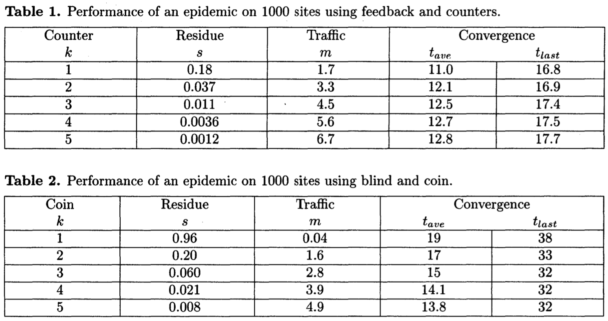
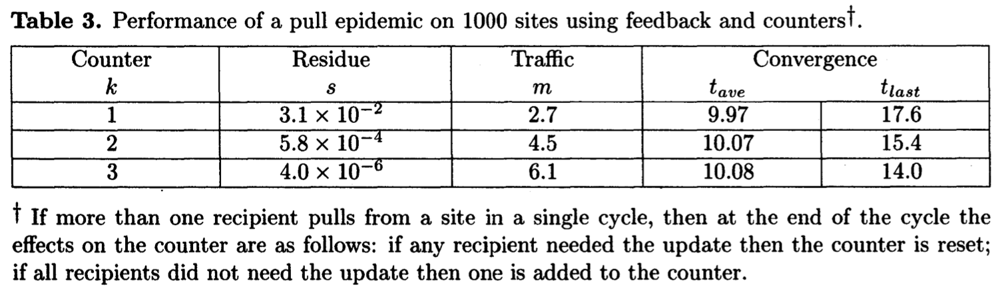

<head>
    
    
</head>

# Table of Contents

1.  [Algorithm](#orga951a5f)
2.  [Review](#org07b2e70)
    1.  [简介](#org0f41490)
        1.  [动机](#orga1658e7)
        2.  [相关工作](#org5b8ea38)
        3.  [本文计划](#org4ac3459)
    2.  [基本技术](#org6886af2)
        1.  [记号](#org8879d19)
        2.  [直接邮件](#orgb0bed91)
        3.  [反熵](#org79a41d4)
        4.  [复杂的污染流行](#orgbade821)
        5.  [提供一个反熵的复制流行病](#org6fb76f4)
3.  [Tips](#org92d2c69)
4.  [Share](#orgea2023f)

# Algorithm

Leetcode 347: Top K Frequent Elements

<https://dreamume.medium.com/leetcode-347-top-k-frequent-elements-d38cd70541fe>

# Review

Epidemic Algorithms for Replicated Database Maintenance

<http://bitsavers.informatik.uni-stuttgart.de/pdf/xerox/parc/techReports/CSL-89-1_Epidemic_Algorithms_for_Replicated_Database_Maintenance.pdf>

## 简介

考虑数据库在大型、各种各样、不可靠且缓慢改变的成百上千个网站的网络环境下的对许多网站复制，我们检查一些方法在站点间达成并维持一致。每个数据库更新被注入在单个站点且必须广播到所有其他站点或被后续的更新替代。站点可变成全一致仅当所有的更新活动已停止且系统暂时变得安静。另一方面，假设一个合理的更新速度，大多数信息在任意给定站点是当前的。这个一致性的松散形式在实际中很有用。我们的目标是设计高效稳定的算法且能很好的使用站点增长的扩展

在检查算法解决这个问题的可考虑重要因素包括

-   更新需要的时间广播到所有站点，且
-   广播单个更新产生的网络流量。理想网络流量是跟更新乘以服务器数量成比例的，但一些算法产生更多的流量

本文我们呈现分析，使用扩散更新的一些策略的模拟结果和实践经验。方法检查包括；

1.  直接邮件：每个新的更新直接从该站点邮件到所有其他站点。这是有效的但不是完全可靠因为个别站点不总是知道所有其他站点且邮件有时会丢失
2.  反熵：每个站点随机规律地选择另一个站点且交换它解决的两者之间不同的数据库内容。反熵是非常可靠的但需要检测数据库内容且不能使用太频繁。分析和模拟显示反熵，可靠、广播更新比直接邮件慢很多
3.  谣言传播：站点初始化为“无知的”，当一个站点接收到一个新的更新它变成一个“热谣言“；当站点持有一个热谣言，它定期随机选择一个其他站点并确保该站点已看到该更新；当站点已经尝试共享一个热谣言给很多站点以看到该更新，站点停止对待谣言为热的且不再广播该更新。谣言循环可能比反熵更频繁因为它们在每个站点上要求更少的资源，但有几率导致更新不会达到所有站点

反熵和谣言传播都是传染进程的例子，传染理论的结果是可应用的。这些机制的理解极大地得利于现存的流行病数学理论，虽然我们的目的不同。更多地，我们有设计流行病机制的自由，我们采用流行病领域的术语并称有一个更新要共享的站点为共享该更新的感染。一个站点为易感染的如果它还未接收到更新；一个站点被删除如果它接收到更新但不再共享更新。反熵是一个简单流行病的例子：站点总是要么易感染要么已感染

选择合作者统一结果会有高网络流量，使我们考虑相关分布其选择趋向于附近的服务器。施乐公司因特网在实际拓扑上的分析和模拟揭露了反熵和谣言传播的分布收敛和统一分布一样快，当减少每个连接的平均和最大流量时。结果反熵算法安装在施乐公司因特网且得到显著的性能改进

我们将指出数据库的扩展复制是昂贵的。它将通过数据库分层分解或缓存尽可能避免。即使这样，我们论文的结果是有趣的因为它们显示了显著的重复可被达到，通过简单的算法，在分层的每层或缓存方案上

### 动机

这个工作起源于在施乐公司Clearinghouse服务器的学习。公司组成数百个以太网用网关连接且许多不同容量的电话线。几千个工作站，服务器和计算主机。一个从日本机器来的包到欧洲可能经过了最多14个网关和7个电话线

Clearinghouse服务维护3层、分层名称到机器地址、用户唯一标识等的传递。分层分区上两层的名字空间到一个域集合。每个域可能存储（重复）一部分，或全部的Clearinghouse服务器，有数百个

一些域事实上存储在CIN的所有Clearinghouse服务器上。在1986年初，许多网络观察性能问题可被跟踪到在它们的高层复制域创建尝试达成一致流量上。随着网络增长，更新域存储在甚至几个服务器上广播也非常慢

当我们开始处理该问题，Clearinghouse服务器被用来直接邮件和反熵。反熵运行在每个域，理论上，每天本地时间在午夜到早上6点一次（每个服务器）。事实上，服务器由于网络负载经常不能在允许时间内完成反熵工作

我们首次发现反熵跟着一个重邮步骤：正确的数据库值被邮给之前两个反熵参与者分歧的所有站点。更多地站点间不同意导致更多的流量。对一个存储在300个站点的域，每天晚上可能有90000个邮件信息被引入。这远超网站的容量，且结果导致所有网络服务下线：邮件、文件传输、名字查询等等

因为重邮步骤不能在我们观察的大网络上工作，它被禁止。更进一步分析显示这没有效率：某些网络中key链接仍然被反熵流量过载

### 相关工作

本文算法想要维护一个广复制目录，或名称查找，数据库。跟使用基于交易的机制不同这里尝试达成“一次拷贝序列化“，我们使用驱动复制节点达到最终同意的机制。这样的机制被Johnson et al首先提出，并用在Grapevine和Clearinghouse中。这些系统的经验使我们知道一些问题仍在；特别地，一些更新（低可能性）不能到达所有站点。Lampson提出一个分层数据结构避免高复制，但仍然需要一些每个部件的复制，6到12个服务器。主站点复制数据库的更新算法被提议通过请求应用于单个站点来同步更新；更新站点负责广播更新到所有节点。DARPA域系统，例如，使用这种排序的算法。主站点更新避免了本文描述的分布式更新的问题但导致了集中控制

有两个特征区别我们的算法和之前的机制。首先，之前的机制依赖各种从底层通讯协议的保证和维持一致的分布式控制结构。例如，在Clearinghouse中更新的初始分布依赖于底层保障邮件协议，其在实际中由于物理查询过载经常故障，即使邮件队列维护在磁盘存储。Sarin和Lynch展现了一个分布式算法用来丢弃过时的数据，其依赖于保障，合适地顺序，消息转发及每个服务器描述相同数据库的其他所有服务器的具体数据结构。Lampson et al.预想一个服务器环上的确定性移动，被一个服务器到下一个的指针持有。这些算法依赖各种分布式数据结构的排斥一致属性，例如，在Lampson算法中指针必须定义为一个环。本文算法仅依赖重复消息的最终转发，不需要服务器的数据结构描述信息

其次，本文描述的算法是随机的，即每个服务器的算法使用独立的随机选择。不同地是，之前的机制是确定性的。例如，在反熵和流言触发算法中，一个服务器做一个随机选择要么依然感染或被删除。随机选择的使用避免我们使用这样的声明：“信息将以时间成比例的收敛到网络直径。“我们最好声称在更进一步的更新缺失的情况下，信息不能收敛的概率随时间指数级增长。另一方面，我们相信随机协议的使用使我们的算法可用简单的数据结构直接实现

### 本文计划

第一节形式化复制数据库的记号和展现达成一致性的基本技术。第二节描述从数据库删除数据项的技术；删除比其他改变更复杂因为删除数据项必须呈现一个替代者直到删除的消息扩散到所有站点。第3节展现反熵和流言合作者的选择在非统一空间分布上的模拟和分析结果

## 基本技术

本节介绍复制数据库记号和呈现基本直接邮件，反熵和复杂传染协议及它们的分析

### 记号

考虑一个网络包含n个站点的集合S，每个存储一个数据库的拷贝。数据库拷贝站点 $ s \\in S $是时间变动的不完整函数

$ \\begin{equation} s.ValueOf: K \\to (v: V \\times t : T) \\end{equation} $

K是键的集合（名称），V是值的集合，T是时间戳的集合。V包含不同的元素NIL但未指明。T是按<总序。我们解释s.ValueOf[k] = (NIL, t)为该项目确认为k已经被从数据库中删除。即，从数据库客户端来看，s.ValueOf[k] = (NIL, t)就是s.ValueOf[k]未定义

第1.2和1.3节所述的分布式技术是简单的，通过考虑一个数据库对单个名称存储值和时间戳。所以我们说

$ \\begin{equation} s.ValueOf \\in (v: V \\times t: T) \\end{equation} $

例如，s.ValueOf是有序对包含一个值和一个时间戳。如之前所述，第一个元素可能是NIL，表示该项目在第二个元素所示的时间被删除

更新分布式进程的目标是驱动系统使得

$ \\begin{equation} \\forall s,s' \\in S, s.ValueOf = s'.ValueOf \\end{equation} $

在任意站点有一个操作客户端必须调用来更新数据库，s:

$ \\begin{equation} Update[v: V] \\equiv s.ValueOf \\gets (v, Now[]) \\end{equation} $

Now是一个函数返回全局唯一时间戳。Now[]返回的时间戳将是当前的格林尼治时间 - 如果不是，算法将不以实际效果工作。感兴趣的读者可参考Clearinghouse[Op]和Grapevine[Bi]论文进一步地描述时间戳在构建一个有用的数据库中的角色。对我们的目的来说，必要地知道该元组有一个更大的时间戳将总是被替换成一个更小的时间戳

### 直接邮件

直接邮件策略当一个更新发生时尝试通知所有其他站点。基本的算法执行在一个站点上：

$ \\begin{equation} \\text{FOR EACH } s' \\in S \\text{ DO} \\\\ \\qquad PostMail[to: s', msg: ("Update", s.ValueOf)] \\\\ \\qquad ENDLOOP \\end{equation} $

一旦接受到消息("Update", (v,t))，站点执行：

$ \\begin{equation} \\text{IF } s.ValueOf.t < t \\text{ THEN} \\\\ \\qquad s.ValueOf \\gets (v, t) \\end{equation} $

PostMail操作希望是附近的，但不完全可靠。它把消息放入队列使得发送者不被延迟。队列保持在邮件服务器的稳定存储这样它们不被服务器崩溃影响。尽管，PostMail可能失败：消息可能被丢弃当队列满了或它们的目标长时间不能访问。除了邮件系统的这种故障，直接邮件也可能失败当源站点更新时没有S的精确知识，站点集合。

在Grapevine系统[Bi]中，检测和校正直接邮件故障的职责策略被指定给管理网络的人员。只有在几十个服务器的网络中这种处理方式才能很好适配

每个更新直接邮件产生n个消息，每个消息游走于源和目的之间的网络连接。这样（连接 $ \\cdot $ 消息）流量单位跟站点数量乘以站点间平均距离成比例

### 反熵

Grapevine设计者认识到直接邮件处理故障在大型网络中超出了人的能力范围。他们提出反熵作为一个机制运行在从这样的故障中自动恢复的背景环境中。反熵不作为Grapevine的一部分来实现，但设计能在不变动的情况下适配Clearinghouse。它最基本的形式反熵被表达为如下在每个站点s上定期执行的算法：

$ \\begin{equation} \\text{FOR SOME } s' \\in S \\text{ DO} \\\\ \\qquad ResolveDifference[s, s'] \\\\ \\qquad ENDLOOP \\end{equation} $

ResolveDifference[s, s']需要两个服务器合作，依赖于它的设计，它的有效方法可被表达为如下三种方式之一，称为push，pull和push-pull：

$ \\begin{equation} ResolveDifference: PROC[s, s'] = \\{ -- push \\\\ \\qquad \\text{IF } s.ValueOf.t > s'.ValueOf.t \\text{ THEN} \\\\ \\qquad \\qquad s'.ValueOf \\gets s.ValueOf \\\\ \\qquad \\} \\end{equation} $

$ \\begin{equation} ResolveDifference: PROC[s, s'] = \\{ -- pull \\\\ \\qquad \\text{IF } s.ValueOf.t > s'.ValueOf.t \\text{ THEN} \\\\ \\qquad \\qquad s'.ValueOf \\gets s.ValueOf \\\\ \\qquad \\} \\end{equation} $

$ \\begin{equation} ResolveDifference: PROC[s, s'] = \\{ -- push-pull \\\\ \\qquad \\text{SELECT TRUE FROM } \\\\ \\qquad \\qquad s.ValueOf.t > s'.ValueOf.t \\Rightarrow s'.ValueOf \\gets s.ValueOf; \\\\ \\qquad \\qquad s.ValueOf.t < s'.ValueOf.t \\Rightarrow s.ValueOf \\gets s'.ValueOf; \\\\ \\qquad \\qquad ENDCASE \\Rightarrow NULL; \\\\ \\qquad \\} \\end{equation} $

现在我们假设站点s'被随机从集合S中统一选中，且每个站点每个时期执行一次反熵算法

它是流行病的基本结果即简单的流行病，比如反熵，最终感染整个人群。理论也显示开始的单个感染站点在预期时间内达成人口大小比例的日志。比例常量是敏感的对使用的ResolveDifference过程。对push，对大的n [Pi] 公式是 $ \\log_ {2}(n) + \\ln(n) + O(1) $

容易知道即使邮件失败，即扩散一个更新超过单个站点，则反熵将最终把它分布到整个网络。然而，我们期望反熵分布更新只到几个站点，假设多数站点通过直接邮件接收它们。这样，考虑当只有几个站点仍然是怀疑状态时会发生什么是很重要的。这种情况下push和pull之间行为有大不同，push-pull行为像pull。一个简单的确定性模型预测被观察的行为。设 $ p_ {i} $为在 $ i^{th} $反熵循环后一个站点仍然被怀疑的概率。对pull，如果它在 $ i^{th} $循环后被怀疑则站点在 $ i + 1^{st} $循环依然被怀疑且它在 $ i + 1^{st} $循环中联系一个怀疑站点。这样，我们获得

$ \\begin{equation} p_ {i+1} = (p_ {i})^{2} \\end{equation} $

当 $ p_ {i} $很小时会快速收敛到0。对push，一个站点如果在 $ i^{th} $循环中被怀疑则仍然在 $ i + 1^{st} $循环中被怀疑且没有感染站点在 $ i + 1^{st} $循环中选择联系它。这样，push的模拟发生为

$ \\begin{equation} p_ {i+1} = p_ {i}\\left(1 - \\frac{1}{n}\\right)^{n(1-p_ {i})} \\end{equation} $

其也收敛到0，但相对慢些，因为对非常小 $ p_ {i} $（且大n）它大约是

$ \\begin{equation} p_ {i+1} = p_ {i}e^{-1} \\end{equation} $

强烈建议在实际中，当反熵被用来作为一个某些其他分布式机制比如直接邮件的备份，要么pull或push-pull比push要好，后者在理想情况下行为性能差

反熵算法非常昂贵，因为它包含一个数据库的两个完全拷贝的比较，其中一个来自网络。通常数据库拷贝是几乎完全同意，这样多数工作被浪费。给定这个观察，一个可能的性能改进对每个站点是维护一个数据库内容的checksum，当数据库更新时重新计算checksum。站点执行反熵首先交换checksum，只在checksum不匹配时比较全部的数据库。这个方案节省了大量的网络流量。不幸地是，通常最近的更新只有部分站点知道。checksum在不同的站点很可能不匹配除非时间需要一个更新发送给所有站点是很小的对应新更新间期望的时间。随着网络的增长，需要分布一个更新到所有站点的时间也增长，这样checksum的使用变得用处有限

一个更复杂的处理是使用checksum定义一个时间窗 $ \\tau $，其足够大使得更新期望在 $ \\tau $时间内到达所有站点。和简单方案一样，每个站点维护它的数据库checksum。另外，站点维护一个最近更新列表，一个在它的数据库中所有条目其年龄（通过它们的时间戳和站点本地时钟的不同度量）小于 $ \\tau $的列表。两个站点s和s'执行反熵通过先交换最近更新列表，使用列表来更新它们的数据库和checksums，且然后比较checksums。只有checksums不匹配这些站点比较它们整个数据库

在比较checksums之前交换最近更新列表确保如果一个站点最近已接收到一个改变或删除，对应的丢弃条目不被计算在其他站点的checksum中。这样，checksum比较很可能成功，使全数据库比较成为不必要。在这样的情况下，反熵比较产生的期望的流量仅是最近更新列表的期望大小，为时间 $ \\tau $内网络中发生的更新的数量。注意 $ \\tau $的选择超过一个更新期望的分布时间是严重的事，如果 $ \\tau $选择不好，或如果网络的增长驱使期望更新分布时间超过 $ \\tau $，checksum比较将总是失败且网络流量将升高到被反熵产生没有checksum更高的水平

以上方案的一个简单变种，其不需要 $ \\tau $值的有效选择，如果每个站点可维护一个通过时间戳的它的数据库的反转索引。两个站点执行反熵通过交换反向时间戳顺序更新，渐增地计算它们的checksums，直到checksum的一致达成。当从网络流量观点看它是理想的，该方案（我们将因此指定为peel bakc）可能并不实际因为维护每个站点额外的反转索引是昂贵的操作

### 复杂的污染流行

如我们所看到的，直接邮件更新有几个问题：它可能失败因为消息丢失，或因为起源处有其他数据库站点的不完全信息，且它在起源站点引入一个O(n)的瓶颈。这些问题的一些被一个广播邮件机制弥补，但大多数该机制依赖一个分布信息。我们将要描述的流行机制能避免这些问题，但它们有一个不同的、直接故障的可能性必须小心地学习分析和模拟。幸运地是这个故障可能性可任意小。我们指定这些机制为复杂的流行用来区分反熵对应简单的流行；复杂流行仍然有一个简单的实现

回忆单个更新，一个数据库要么怀疑（它不知道该更新），感染（它知道该更新且与其他站点共享）或删除（它知道该更新但不扩散它）。这非常容易实现使得一个共享的步骤不需要完全的访问数据库。发送者管理一个感染更新的列表，且接收者尝试插入每个更新到它自己的数据库且添加所有新的更新到它的感染列表。唯一的难点是决定什么时候从感染列表中删除更新

在我们讨论设计好的传染之前，让我们看一个例子，通常称为流言扩散

流言扩散基于如下的场景：有n个人，初始化未激活（怀疑）。我们散布一个人的流言使其激活（感染），随机电话其他人且共享流言。每个人听到流言也变激活且分享流言。当一个激活的人用一个不必要的电话拨打（接收者已知道流言），则有概率1/k该激活的人失去共享流言的兴趣（该人变得被删除）。我们将知道系统如何快的收敛到未激活状态（该状态下没有人被感染）且当该状态达成时知道流言的人的百分比

以下描述，流言扩展可能被确定性的用一对积分等式建模。我们设s, i和r代表怀疑的人的比例，感染的比例和删除的比例，这样s + i + r = 1:

$ \\begin{equation} \\frac{ds}{dt} = -si \\end{equation} $

$ \\begin{equation} \\frac{di}{dt} = +si -\\frac{1}{k}(1 -s)i \\end{equation} $

第一个等式建议怀疑者将根据乘积si被感染，第二个等式有一个额外的项表达由于不必要的电话呼叫导致的丢失。第三个等式对r是冗余的

处理以上等式一个标准的技术是使用比率。消除t且让我们解决i作为s的一个函数：

$ \\begin{equation} \\frac{di}{ds} = - \\frac{k+1}{k} + \\frac{1}{ks} \\end{equation} $

$ \\begin{equation} i(s) = - \\frac{k+1}{k}s + \\frac{1}{k} \\log s + c\\end{equation} $

c是一个积分常量被初始条件决定：$ i(1 - \\epsilon) = \\epsilon $

对大n，$ \\epsilon $为0，给定：

$ \\begin{equation} c = \\frac{k+1}{k} \\end{equation} $

且一个解决方案

$ \\begin{equation} i(s) = \\frac{k+1}{k}(1 - s) + \\frac{1}{k} \\log s \\end{equation} $

函数i(s)为零当

$ \\begin{equation} s = e^{-(k+1)(1-s)} \\end{equation} $

这是s的间接等式，但支配项显示s以指数为k的方式递减。这样递增的k是一个有效的方法确保大多数人听到了流言。例如，当k = 1该公式建议20%将错过该流言，当k = 2只有6%会错过

1.  变化

    目前我们只看到一个复杂的传染病，基于流言扩散技术。一般我们想要理解如何设计一个好的流行病，这样它值得现在暂停下来审查判断传染病的标准。我们考虑：
    
    1.  留数 当i为0时s的值，当传染病完成时仍然可怀疑的数量。我们想要留数尽可能小，且如上所分析的，它可很灵活的使留数任意小
    2.  流量 目前我们以站点间数据库更新的方式度量流量，不考虑网络拓扑。这方便使用一个平均值m，一个典型站点发送消息的数量：
        
        $ \\begin{equation} m = \\frac{ \\text{总更新流量} }{ 站点数 } \\end{equation} $
        
        在第3节我们将提炼该度量来兼容个人连接的流量
    3.  延迟 有两个有趣的时间。平均延迟是在一个给定站点更新初始注入和更新达到时间之间的不同，在所有站点的评价。我们引用它为 $ t_ {ave} $。一个相似的数量，$ t_ {last} $为传染病期间接受到更新的最后一个站点的延迟。在$ t_ {last} $之后更新消息将持续出现在网络，但它们将不会到达一个怀疑站点。我们发现它需要引入两个时间因为它们常常行为不同，且设计者逻辑上会担忧这两个时间
    
    接下来，让我们考虑一些流言扩散的变动。首先我们将描述修改的实际方面，且之后我们将讨论留数、流量和延迟
    
    Blind vs Feedback 流言例子使用接收者的反馈；一个发送者丢失兴趣仅在接收者已知该流言。一个盲变化以1/k的概率丢失兴趣而不考虑接收者。这移除了对接收者向量响应的需要。
    
    Counter vs Coin 我们使用一个计数来替代已概率1/k丢失兴趣，这样我们丢失兴趣仅在k个不必要的联系之后。计数需要保持感染列表元素的额外状态。注意我们可组合计数和盲技术，独立于任何反馈仍然感染k个循环
    
    以上变化的一个奇怪的方面是它们共享相同的流量和留数之间的基本关系：
    
    $ \\begin{equation} s = e^{-m} \\end{equation} $
    
    通过观察nm个更新发送和单个站点遗失所有这些更新的机会是 $ (1 - \\frac{1}{n})^{nm} $我们可以得出该公式。（因为m不是个常量该关系依赖m的分布走到0当 $ n \\to \\infty $，这个事实是我们已观察到但没有证明）延迟是区分以上可能性的唯一考量：模拟显示计数和反馈改善延迟，计数扮演了一个比反馈更重要的角色
    
    
    
    推 vs 拉, 我们假设所有的站点随机选择目标站点并推感染更新给目标。反熵推 vs 拉的不同可被应用到流言。拉有一些优点，但主要实际考虑是更新注入到分布式数据库的速度。如果有大量独立的更新一个拉请求很可能找到一个非空流言列表的源，触发有用的信息流。相反，如果数据库不活跃，推算法停止引入过量流量，当拉继续注入更新请求时。我们自己的CIN应用程序有一个足够高的更新速度来警告拉的使用
    
    拉的主要优势是它比推关系的 $ s = e^{-m} $更好。这里blind vs feedback和counter vs coin变种很重要。模拟显示counter和feedback变种改进留数，counter比feedback更重要些。我们有复现关系建模counter和feedback例子显示 $ s = e^{- \\Theta(m^{3})} $的行为
    
    

    最小化 它也可能使用计数器的两个参与者做一个交换来做出一个删除决定。该想法使用一个推和拉，且如果两个站点知道了该更新，则有更小计数的站点将增长（如果相等则都会增长）。这需要通过网络发送一个计数器

    连接限制 是否连接限制应视为一个难点或一个优点不是很清楚。这样我们忽略连接限制。在推模型下，例如，我们已假设在单个循环中一个站点更可能变为一个接收者而不是一个推送者，且在推的例子中我们假设一个站点可服务无限制数量的请求。因为我们计划频繁运行流言扩散算法，现实中我们使用一个连接限制。连接限制影响推和拉机制有些不同：拉会更差，推更好些

    为了解为什么推更好，假设数据库比较安静，只有一个更新在扩散，且连接限制为1。如果两个站点联系相同的接收者则一个联系被拒绝。接收者仍然获得更新，但少一个单位流量。（我们已选择用更新发送来度量流量。一些网络活动引起拒绝连接，但这传输的更新要少。我们有，缺失连接否则无用）。多少连接被拒绝？因为一个流行病指数增长，我们假设多少流量发生在最后当几乎每个人被感染且拒绝的概率接近 $ e^{-1} $。所以我们期望推及连接限制1行为如下：

    $ \\begin{equation} s = e^{- \\lambda m } \\qquad \\qquad \\lambda = \\frac{1}{1 - e^{-1}} \\end{equation} $

    模拟显示计数变化接近这个行为（计数及反馈有效）。coin变种不符合以上假设，因为当所有站点感染时它们没有最多的流量发生。虽然它们仍然比 $ s = e^{-m} $好。所有的变种，因为推在安静的网络中以连接限制1最好它似乎值得强制该限制即使更多的连接是可能的

    有连接限制的拉会差些，因为好的性能依赖每个循环在每个站点为一个接收者。虽然有一个有限的连接失败概率 $ \\delta $，拉变动的渐近线。假设，最多的流量发生在所哟站点被感染时，则在该期间一个站点丢失一个更新的机会大约为：

    $ \\begin{equation} s = \\delta^{m} = e^{- \\lambda m } \\qquad \\qquad \\lambda = - \\ln \\delta \\end{equation} $

    幸运地是，对适度大小的连接限制，失败概率变得非常小，因为在一个循环中一个站点有j个连接的机会为 $ \\frac{e^{-1}}{j !} $

    搜寻 如果一个连接被拒绝则选择站点可搜寻替代站点。搜寻是相对便宜的且似乎能改善所有连接限制的情况。在极端情况下，一个连接限制为1及无限搜寻限制导致一个完全的排列。推和拉变得相同，且余留非常小

### 提供一个反熵的复制流行病

我们看到一个复杂的流行病算法可以非常小的流量快速扩散更新。不幸地是，一个复杂的流行可能失败；有一个非零的概率感染站点数量将为零当某些站点依然是怀疑状态时。这种事件很少出现；虽然，如果它发生，系统将在一个稳定状态一个更新被某些站点所知，但不是所有站点。为消除这种可能性，反熵可间断运行来支持一个复杂流行，如同在Clearinghouse中支持直接邮件一样。这确保概率为1的使每个更新最终到达（或被替换）每个站点

但反熵作为一个支持机制，对初始化更新来说流言传播比直接邮件有显著的优势。考虑当一个丢失更新被发现当两个站点执行反熵时做了什么。一个传统的响应不会做任何事（除了使数据库两个站点一致），依赖反熵最终转发更新到所有站点。一个更积极的响应会重分布更新，使用机制初始化分布，例如，邮件它到所有其他站点或使它再成为一个热流言。保守的处理是少数站点不知道更新。然而，处理偶尔完全的初始化失败，需要一个重分布步骤

不幸地是，直接邮件重分布的开销很高。最坏的情况发生在当初始化分布管理转发一个更新到大约一半的站点，这样下一个反熵循环每个O(n)站点尝试重分布更新通过邮件它到所有n个站点，产生 $ O(n^{2}) $个邮件消息。Clearinghouse首次实现重分布，但我们强制消除它因为它开销太高

使用流言传播而不是直接邮件会极大缩减重分布的期望开销。流言传播在简单情况下是理想的，只有几个站点接收更新失败，因为一个热流言已经被几乎所有站点知道这样它会快速消失不会产生很多流量。它在最坏的情况下表现也不错：如果一个更新分布到大约一半的站点，则O(n)个更新拷贝将作为热流言引入下一个反熵轮次。这实际上比在单个站点引入流言产生更少的网络流量

这使我们产生一个组合流言传播和反熵的方式。回忆我们之前描述一个反熵的变种成为peel back需要一个额外的以时间戳为序的数据库索引。该想法使站点已反时间戳序交换更新直到它们在整个数据库上达成checksum一致。peel back和流言传播可组合通过保持一个双向列表的更新而不是一个搜索树。在我们需要一个搜索树来维持反向时间戳顺序之前，我们现在使用一个双向链表维持一个本地活动顺序：站点发送更新根据他们的本地链表序，且它们接收通常的流言反馈告诉它们什么时候一个更新有用。有用的更新移动到它们对应列表的前面，而无用的更新变得在列表深处。这种组合变种比只用peel back更好因为：1）它避免了额外的索引，2）它在网络分区和重加入时表现很好。它比只使用流言传播要好因为它没有失败可能性。在实际中，我们可能在某时间不发送更新，但从列表头批量一系列更新。这个集合模拟流言传播的热流言列表，但成员关系不再是二进制方式因为如果第一个批量达成checksum一致失败的话，则更多的批量会发送。如果必要，数据库的任意更新可再变为热流言

# Tips

-   知识分类型，一些大量消耗脑细胞的需要放慢速度有效吸收，而一些更偏知识型的，可以提速以了解阅读为主
-   注意前提知识，在学习新的知识前先把其需要的前提知识先学好，有层次的推进，否则容易卡壳
-   或许每个阶段有每个阶段适合自己的学习方法，在未找到更好的方法之前先要坚持使用目前认为最适合的方法，并清楚当前所用方法的缺陷及可能改进方向，每过一段时间或觉得当前方法不再适应时，要尝试一些新的方法

# Share

Scalability for Dummies - Part 2: Database

<https://www.lecloud.net/post/7994751381/scalability-for-dummies-part-2-database>

在第一部分之后，你的服务器现在可水平扩展且你可服务数千个并行请求。但你的应用程序变得越来越慢且最终无法工作。原因：你的数据库。是MySQL？

现在需要的改变比添加更多的复制节点更加激进且需要一些勇气。最后，你可选择2条路：

路径1是继续使用MySQL并使他运行。租用一个数据库管理员（DBA）告诉他做主从复制（从节点读，主节点写）且添加内存来升级你的主服务器。在数月时间，你的DBA将提及“分片”，“denormalization", "SQL tunning"且担心下周过多需求。这时每个保持数据库运行的新的行为 将更昂贵且耗时。如果你的数据集较小且容易迁移你可能选择路径2更好

路径2意味着从开始阶段就denormalize right且在任意数据库查询中不包含Join。你可停留于使用MySQL，且像NoSQL数据库一样使用它，否则你可以切换到一个更好更易扩展的NoSQL数据库如MongoDB或CouchDB。Join现在需要在你的应用程序代码中做。这个步骤你做的越快将来需要修改的代码越少。但即使你成功切换到最新最好的NoSQL数据库且让你的应用程序做数据集join，不久你的数据库请求将变得越来越慢，你需要引入缓存

