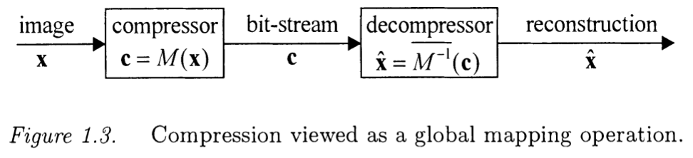
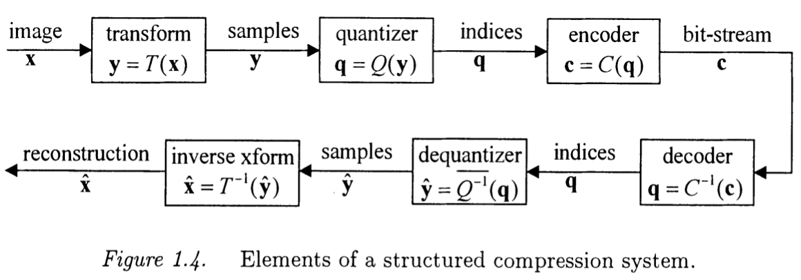
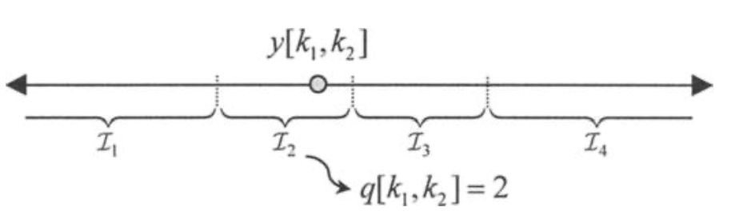

<head>
    
    
</head>

# Table of Contents

1.  [IMAGE COMPRESSION OVERVIEW](#orgb938244)
    1.  [Elementary Concepts](#orgba908b6)
        1.  [Lossless and Lossy Compression](#orgd7eab88)
        2.  [Gamma Correction](#orgfb89b50)
        3.  [Measures Of Compression](#org8b8fd5c)
    2.  [EXPLOITING REDUNDANCY](#org821e426)
        1.  [STATISTICAL REDUNDANCY](#org8d9f45b)
        2.  [IRRELEVANCE](#org8b50179)
        3.  [ELEMENTS OF A COMPRESSION SYSTEM](#org853b446)

# IMAGE COMPRESSION OVERVIEW

## Elementary Concepts

### Lossless and Lossy Compression

最常见的修改度量方法是MSE(Mean Squared Error)，定义为

$ \\begin{equation} MSE \\stackrel{\\Delta}{=} \\frac{1}{N_ {1}N_ {2}} \\sum_ {n_ {1} = 0}^{N_ {1} - 1} \\sum_ {n_ {2} = 0}^{N_ {2} - 1} \\left(x[n_ {1}, n_ {2}] - \\hat{x}[n_ {1}, n_ {2}]\\right)^{2} \\end{equation} $

对图像压缩，MSE最常见被作为倒数度量引用，PSNR(Peak Signal to Noise Ratio)，定义为

$ \\begin{equation} PSNR \\stackrel{\\Delta}{=} 10 \\log_ {10} \\frac{(2^{B} - 1)^{2}}{MSE} \\end{equation} $

PSNR用dB作为单位。好的重建图像典型地有PSNR值30dB或更多

MSE作为图像修改度量的流行部分源于其计算简便，部分由于线性优化问题的可追溯性包括方差度量

### Gamma Correction

显示设备比如电视和计算机显示器是高非线性的，传递到电子粉末的动力大约为 $ v^{\\gamma} $，v是应用到电子枪的控制电压，$ \\gamma $的值范围在1.8到2.8之间。

更精确地说，设 $ x_ {lin} [n_ {1}, n_ {2} ] $记为正规化场景下图像位置 $ [n_ {1}, n_ {2}] $的亮度。正规化即使 $ x_ {lin} = 0 $对应无光，$ x_ {lin} = 1 $对应场景中可计数的最强烈级别。所谓的"gamma“函数，参数为$ \\gamma和\\beta $， $ x'[n_ {1}, n_ {2} ] $为正规化后图像采样值，范围从0到1，

$ \\begin{equation} x'[n_ {1}, n_ {2}] = \\left\\{ \\begin{array}{ll} gx_ {lin}[n_ {1}, n_ {2}] & \\text{ if } 0 \\le x_ {lin}[n_ {1}, n_ {2}] \\le \\epsilon \\\\ (1 + \\beta) (x_ {lin}[n_ {1}, n_ {2}])^{\\frac{1}{\\gamma}} - \\beta & \\text{ if } \\epsilon \\le x_ {lin}[n_ {1}, n_ {2}] \\le 1 \\end{array} \\right. \\end{equation} $

$ \\epsilon $和g定义为

$ \\begin{equation} \\epsilon = \\left(\\frac{\\beta}{(1+ \\beta)(1 - \\frac{1}{\\gamma})}\\right)^{\\gamma} \\text{ 和 } g = \\frac{\\beta}{\\epsilon (\\gamma - 1)} \\end{equation} $

这些定义确保gamma函数在断点 $ x_ {lin} = \\epsilon $连续可导

一个呈现彩色图像的合并标准为sRGB（标准RGB）颜色空间，其小心地定义通过上述描述的gamma函数及参数 $ \\gamma = 2.4 和 \\beta = 0.055 $使线性的红绿蓝映射到非线性RGB采样值。该函数描述在下图：

需要注意大多数图像在实际中被gamma校正，在压缩时会影响图像采样值引入的误差的解释。忽略gamma函数中小的线性段（或假设 $ \\beta = 0 $），这样 $ x_ {lin} = (x')^{\\gamma} $，我们看到一个小误差，$ dx' $，gamma校正值对应场景光误差，$ dx_ {lin} $

$ \\begin{equation} \\begin{aligned} dx_ {lin} &= \\gamma(x')^{\\gamma - 1} dx' \\\\ &= \\gamma (x_ {lin})^{1 - \\frac{1}{\\gamma}} dx' \\end{aligned} \\end{equation} $

这样，场景光误差将在图像更明亮的部分变得更大。但很幸运地是（不是设计），该行为跟人可视系统（Weber's law）能很好匹配。根据Weber's law，场景光的改变 $ dx_ {lin} $，需要有效的明显改变在可察觉亮度到 $ x_ {lin} $自身的比例。对 $ \\gamma $的大值，上述等式显示 $ \\frac{dx_ {lin}}{x_ {lin}} $大约跟 $ dx' $成比例。这样，gamma校正值比线性场景光 $ x_ {lin} $能以更容易察觉的方式统一度量。这样，Weber's law的效果能跟简单的数字改动度量比如MSE自动协调，提供应用到gamma校正采样值

相反地，MSE证明在没有gamma校正的图像采样上用处不大。对这样的图片有损压缩算法会导致更差的视觉性能。当处理非自然图片源时需要特别小心；医学X射线和SAR（合成口径雷达）图像，例如，通常是线性的

### Measures Of Compression

图片压缩的目的是用一串二进制数字表达图像，称为压缩字节流，记为c。目标是是使其长度\|\|c\|\|尽可能小。定义压缩比为

$ \\begin{equation} \\text{压缩比} \\stackrel{\\Delta}{=} \\frac{N_ {1}N_ {2}B}{\|\|c\|\|} \\end{equation} $

最终，我们定义压缩比率，表达为bps(bits per sample)

$ \\begin{equation} \\text{比率 }(bps) \\stackrel{\\Delta}{=} \\frac{\|\| c \|\|}{N_ {1}N_ {2}} \\end{equation} $

对有损压缩，比率对图像压缩系统更是一个性能度量，因为高字节深度图像的最少有效位通常被丢弃而不导致重度失真。这样，每图像采样花费的平均字节数通常是更重要的压缩性能度量，而不是采样跟原始相比的精确度

如果图像显示为常量物理大小而不是像素维度，一个相似的参数给出建议字节流本身的大小相比比率是更重要的性能度量。在这样的应用程序中，许多原始的图像解决方案在呈现时会丢失这样压缩算法被应用到图像的不会出现重要失真的化略解决方案版本。总结来说，比率是有损压缩性能重要度量仅当 $ N_ {1} 和 N_ {2} $跟物理维度成比例的图像上

上图提供了一个粗略显示的压缩自然图像的压缩比率，虽然其严重依赖图像的内容。假设有损重构图像被计算机显示器以典型的90像素/英尺（22像素/mm）解决方案呈现，如果图像被打印为更紧密的点位则可达成更高的压缩比

## EXPLOITING REDUNDANCY

没有任何压缩时，图像采样值表现为 $ N_ {1}N_ {2}B $比特。本节我们简单讨论冗余这样激发1.3节引入的操作，其在多数图像压缩系统中很常见

### STATISTICAL REDUNDANCY

考虑两个B-bit整数，$ x_ {1}, x_ {2} \\in [0, 1, \\ldots, 2^{B} - 1] $。作为例子，这些整数可能对应两个相邻的图像采样值。无压缩时，两个整数使用2B比特。假设，解压者知道一个规律值最终为0和1；例如，图像可能已知为bi-level。它必要使用一个比特来表示 $ x_ {1}, x_ {2} $，压缩比为 $ B : 1 $。假设进一步解压者知道两个值总是相等的。则，一个比特可有效表达一对数字，压缩比为 $ 2B : 1 $

当然，上述描述的情况实际中不常见。通常解压者可能知道一些可能的值集合比其他值更可能出现，如果解压者知道 $ x_ {1} \\in {0, 1} $有非常高的概率则我们希望可能扩展1比特多一点的比特来表达 $ x_ {1} $的真实值。在第2章我们期望一个可能花费的平均 $ H(X_ {1}) $比特，$ X_ {1} $是一个随机变量，其总结解压者的关于 $ x_ {1} $值的认知，且 $ H(X_ {1}) $是一个 $ X_ {1} $的统计分布函数，记为它的熵

### IRRELEVANCE

上面描述的冗余形式允许我们表达为化略比特的原始采样值。很多情况下，这些采样值的一些信息对图像呈现可能不重要。如下有一些例子

可视无关：如果图像采用密度超过人类可视精度对任何显示和可视条件的适合集合的限制，过度的图像解决方案对人类观察没有影响。

应用程序特定无关：在一些应用程序中，特别是军事和医学场景中，图像的值可能被在任务中有用度决定；例如，目标识别或医学诊断。图像领域对该任务无用时可能被认为是无关的

一个利用无关的方法是转换原始图像采样值为新的采样值集合，其对无关信息使用更少的比特。在最简单的例子中，转换可能包括子采样或图像采样中对应无关的领域。剩下采样的统计冗余可能进一步利用来改进压缩

1.  IRRELEV ANCE IN COLOUR IMAGERY

    一个无关的有趣例子发生在颜色图像上，人类视角对图像亮度和饱和度属性的快速变化远不如对强烈度改变敏感。为图像压缩的目的，这个属性通常模型化为用线性转换映射原始RGB图像采样为luminance-chrominance空间且子采样chrominance部分
    
    我们展示这个称为YCbCr转换:

    $ \\begin{equation} \\left( \\begin{array}{ccc} x_ {Y} \\\\ x_ {C_ {b}} \\\\ x_ {C_ {r}} \\end{array} \\right) = \\left( \\begin{array}{ccc} 0.299 & 0.587 & 0.114 \\\\ -0.169 & -0.331 & 0.5 \\\\ 0.5 & -0.419 & -0.0813 \\end{array} \\right) \\cdot \\left( \\begin{array}{ccc} x_ {R} \\\\ x_ {G} \\\\ x_ {B} \\end{array} \\right) \\end{equation} $

    注意第一个chrominance部分，$ x_ {C_ {b}} $是原始蓝频道和新luminance(intensity)频道之间不同的扩展版本，特别地

    $ \\begin{equation} x_ {C_ {b}} = 0.564 (x_ {B} - x_ {Y}) \\end{equation} $

    相似地，$ x_ {C_ {r}} $是红-luminance颜色不同，

    $ \\begin{equation} x_ {C_ {r}} = 0.713 (x_ {R} - x_ {Y}) \\end{equation} $

    通过化略chrominance频道解决方案来建模化略可视敏感度为快速颜色改变是很常见的。特别地，通常用YCbCr表示chrominance部件为子采样2个在水平和垂直方向

2.  IRRELEVANCE AND DISTORTION

    对于有损压缩，$ D(x, \\hat{x}) = 0 $表示图像 $ x \\equiv x[n_ {1}, n_ {2}] $和 $ \\hat{x} \\equiv \\hat{x}[x_ {1}, x_ {2}] $只是在某些不相关方面不同
    
    假设，例如，$ \\hat{x} $通过对原始图像x的子采样版本获得，因为 $ \\hat{x} $为更少的采样，它更容易压缩。这样，$ D(x, \\hat{x}) = 0 $，一个好的有损压缩算法应该选择编码子采样呈现
    
    需要指出颜色图像压缩不需要子采样YCbCr呈现的chrominance部分，提供的变动度量能够正确地对相关解决方案建模

### ELEMENTS OF A COMPRESSION SYSTEM

上图描述了压缩和解压系统对应两个映射，M和 $ \\overline{M^{-1}} $。对无损压缩，我们需要 $ \\overline{M^{-1}} = M^{-1} $。对有损压缩，M是不可逆的，所以我们使用记号 $ \\overline{M^{-1}} $表示是一个粗略地反操作。我们可认为压缩器为大量地查找 $ 2^{N_ {1}N_ {2}B} $条目表

压缩系统可被分类为“固定长度”或“变长“。对前者，压缩的比特流有固定长度，$ \|\| c \|\| $，且重构图像变动，$ D(x, \\hat{x}) $将随着图像到图像而变动，对应的解压器可认为是大量地查找 $ 2^{\|\| c \|\|} $条目表操作。该压缩器M：

$ \\begin{equation} c = M(x) = \\operatorname{argmin}_ {c'} D(x, \\overline{M^{-1}}(c')) \\end{equation} $

它是充分的维持在压缩器和解压器上最小的表查找对应 $ \\overline{M^{-1}} $

1.  结构的重要

    
    
    上面等式体现的处理是向量估计(VQ)的思想。VQ处理的一般性是有趣的；然而，$ \\overline{M^{-1}} $表大小查找的指数增长使它对所有图像处理不现实，而只能处理只有较少采样的小图片。对实际的图像压缩，有必要在map的形式M和 $ \\overline{M^{-1}} $上使用额外的结构。虽然这可用几种方式实现，这里我们的目标是使用在图像压缩系统中最常见的结构。该结构如上图所示。一些替代的结构将在1.4节简短讨论

    如上图所描述的，第一个步骤是转换原始图像的采样为新的采样集，其更被压缩系统接受。对这一步骤我们写y = T(x)，$ y \\equiv y[k_ {1}, k_ {2}] $是另一个有限的二维序列，有 $ K_ {1}K_ {2} $个元素。算子T的属性将在之后讨论，这里我们指出算子通常是可逆的。洁牙器使用一个相反的转换，$ T^{-1} $且这一步骤没有引入改动。第二个步骤是使用离散索引序列呈现估计的转换采样，这一步我们写q = Q(y)，$ q \\equiv q[p_ {1}, p_ {2}] $记为有限模拟索引的二维序列，有 $ P_ {1}P_ {2} $个元素。对每个模拟索引的可能的输出集合，$ q[p_ {1}, p_ {2}] $，一般比转换采样更小；这样的模拟索引数量，$ P_ {1}P_ {2} $不会比转换采样数量大，可能比其转换采样数量 $ K_ {1}K_ {2} $更小。这样，模拟映射，Q，引入了一个扰动且解压器使用一个相反地估计，$ \\overline{Q^{-1}} $。最后，模拟索引编码为最终的比特流的形式。我们写c = C(q)。这个步骤是可逆的且不会引入扰动这样解码器可恢复模拟索引 $ q = C^{-1}(c) $

2.  CODING

    码的目的是利用模拟索引 $ q[p_ {1}, p_ {2}] $的统计冗余。模拟和转换元素被设计为确保冗余有空间来定位。理想情况下，随机变量 $ Q[p_ {1}, p_ {2}] $都是统计独立的。这样，索引可被独立编码且需要被考虑的统计冗余的唯一形式是在它们的概率分布上任意非统一的

    一个简单的例子假设有4个可能的模拟索引我们标签为q = 1, 2, 3，有概率

    $ \\begin{equation} P(Q = q) = \\left\\{ \\begin{array}{ll} \\frac{1}{2} & \\text{if } q = 0 \\\\ \\frac{1}{4} & \\text{if } q = 1 \\\\ \\frac{1}{8} & \\text{if } q = 2 \\\\ \\frac{1}{8} & \\text{if } q = 3 \\end{array} \\right. \\end{equation} $

    一个优化编码代表4个可能的输出用如下字符串：

    $ \\begin{equation} \\begin{array}{ll} q = 0 \\\\ q = 1 \\\\ q = 2 \\\\ q = 3 \\end{array} \\to \\begin{array} "1" \\\\ "01" \\\\ "001" \\\\ "000" \\end{array} \\end{equation} $

    每个采样平均使用的比特数为

    $ \\begin{equation} \\frac{1}{2} \\cdot 1 + \\frac{1}{4} \\cdot 2 + \\frac{1}{8} \\cdot 3 + \\frac{1}{8} \\cdot 3 = 1 \\frac{3}{4} 比特 \\end{equation} $

3.  QUANTIZATION

    
    
    Quantization会引入失真，对无损压缩不会有quantization。在最简单的例子中我们会映射每个转换采样，$ y[k_ {1}, y_ {2}] $，独立地对应quantization索引，$ q[k_ {1}, k_ {2}] $。这被称为纯量quantization，它是最简单和最普通的quantization形式。纯量quantization关联每个quantization索引在实数线上一个间隔

    $ \\begin{equation} q[k_ {1}, k_ {2}] = i 如果 y[k_ {1}, k_ {2}] \\in \\mathcal{I}_ {i} \\end{equation} $

    $ \\mathcal{I}_ {i} $为不相交且覆盖实数线。作为一个例子，上图的纯量quantizater映射每个转换采样到4个不同的索引中的一个

    预估反quantization操作，$ \\overline{Q^{-1}} $，映射每个索引，$ q[k_ {1}, k_ {2}] $，到对应间隔的某些呈现水平上， $ \\hat{y}[k_ {1}, k_ {2}] $。在最简单的例子中，我们选择 $ \\hat{y}[k_ {1}, k_ {2}] $作为间隔的中间点，$ \\mathcal{I}_ {q[k_ {1}, k_ {2}]} $。从这个基本讨论中，它应该明显 $ \\overline{Q^{-1}} $是Q的右反，例如，

    $ \\begin{equation} Q \\left(\\overline{Q^{-1}}(\\hat{y}) \\right) = \\hat{y} \\end{equation} $
