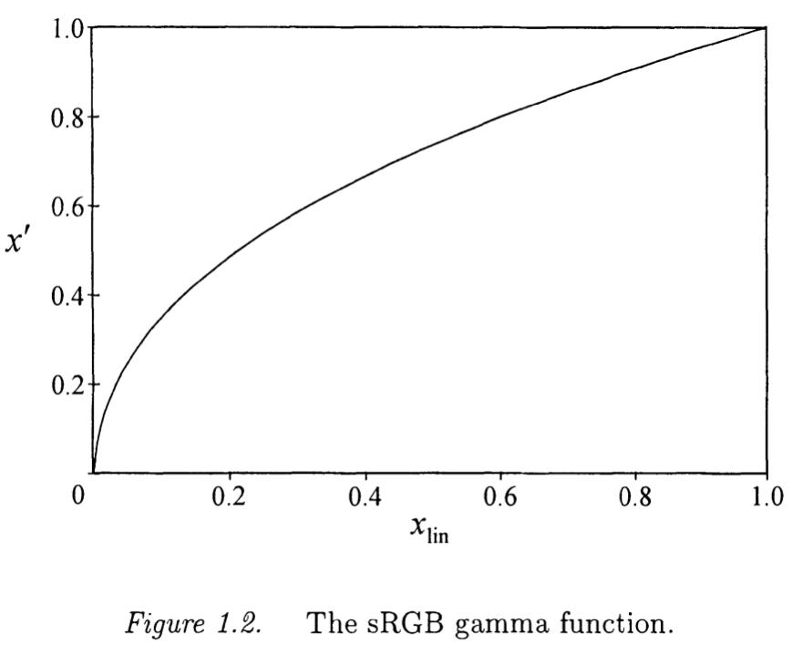
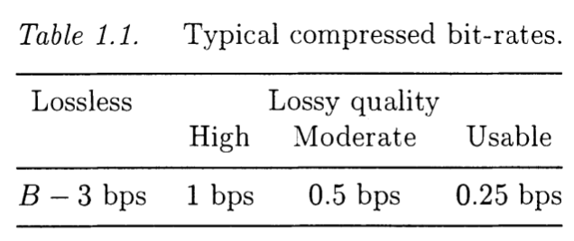

<head>
    
    
</head>

# Table of Contents

1.  [IMAGE COMPRESSION OVERVIEW](#orgb938244)
    1.  [Elementary Concepts](#orgba908b6)
        1.  [Lossless and Lossy Compression](#orgd7eab88)
        2.  [Gamma Correction](#orgfb89b50)
        3.  [Measures Of Compression](#org8b8fd5c)
    2.  [EXPLOITING REDUNDANCY](#org821e426)
        1.  [STATISTICAL REDUNDANCY](#org8d9f45b)

# IMAGE COMPRESSION OVERVIEW

## Elementary Concepts

### Lossless and Lossy Compression

最常见的修改度量方法是MSE(Mean Squared Error)，定义为

$ \\begin{equation} MSE \\stackrel{\\Delta}{=} \\frac{1}{N_ {1}N_ {2}} \\sum_ {n_ {1} = 0}^{N_ {1} - 1} \\sum_ {n_ {2} = 0}^{N_ {2} - 1} \\left(x[n_ {1}, n_ {2}] - \\hat{x}[n_ {1}, n_ {2}]\\right)^{2} \\end{equation} $

对图像压缩，MSE最常见被作为倒数度量引用，PSNR(Peak Signal to Noise Ratio)，定义为

$ \\begin{equation} PSNR \\stackrel{\\Delta}{=} 10 \\log_ {10} \\frac{(2^{B} - 1)^{2}}{MSE} \\end{equation} $

PSNR用dB作为单位。好的重建图像典型地有PSNR值30dB或更多

MSE作为图像修改度量的流行部分源于其计算简便，部分由于线性优化问题的可追溯性包括方差度量

### Gamma Correction

显示设备比如电视和计算机显示器是高非线性的，传递到电子粉末的动力大约为 $ v^{\\gamma} $，v是应用到电子枪的控制电压，$ \\gamma $的值范围在1.8到2.8之间。

更精确地说，设 $ x_ {lin} [n_ {1}, n_ {2} ] $记为正规化场景下图像位置 $ [n_ {1}, n_ {2}] $的亮度。正规化即使 $ x_ {lin} = 0 $对应无光，$ x_ {lin} = 1 $对应场景中可计数的最强烈级别。所谓的"gamma“函数，参数为$ \\gamma和\\beta $， $ x'[n_ {1}, n_ {2} ] $为正规化后图像采样值，范围从0到1，

$ \\begin{equation} x'[n_ {1}, n_ {2}] = \\left\\{ \\begin{array}{ll} gx_ {lin}[n_ {1}, n_ {2}] & \\text{ if } 0 \\le x_ {lin}[n_ {1}, n_ {2}] \\le \\epsilon \\\\ (1 + \\beta) (x_ {lin}[n_ {1}, n_ {2}])^{\\frac{1}{\\gamma}} - \\beta & \\text{ if } \\epsilon \\le x_ {lin}[n_ {1}, n_ {2}] \\le 1 \\end{array} \\right. \\end{equation} $

$ \\epsilon $和g定义为

$ \\begin{equation} \\epsilon = \\left(\\frac{\\beta}{(1+ \\beta)(1 - \\frac{1}{\\gamma})}\\right)^{\\gamma} \\text{ 和 } g = \\frac{\\beta}{\\epsilon (\\gamma - 1)} \\end{equation} $

这些定义确保gamma函数在断点 $ x_ {lin} = \\epsilon $连续可导

一个呈现彩色图像的合并标准为sRGB（标准RGB）颜色空间，其小心地定义通过上述描述的gamma函数及参数 $ \\gamma = 2.4 和 \\beta = 0.055 $使线性的红绿蓝映射到非线性RGB采样值。该函数描述在下图：

需要注意大多数图像在实际中被gamma校正，在压缩时会影响图像采样值引入的误差的解释。忽略gamma函数中小的线性段（或假设 $ \\beta = 0 $），这样 $ x_ {lin} = (x')^{\\gamma} $，我们看到一个小误差，$ dx' $，gamma校正值对应场景光误差，$ dx_ {lin} $

$ \\begin{equation} \\begin{aligned} dx_ {lin} &= \\gamma(x')^{\\gamma - 1} dx' \\\\ &= \\gamma (x_ {lin})^{1 - \\frac{1}{\\gamma}} dx' \\end{aligned} \\end{equation} $

这样，场景光误差将在图像更明亮的部分变得更大。但很幸运地是（不是设计），该行为跟人可视系统（Weber's law）能很好匹配。根据Weber's law，场景光的改变 $ dx_ {lin} $，需要有效的明显改变在可察觉亮度到 $ x_ {lin} $自身的比例。对 $ \\gamma $的大值，上述等式显示 $ \\frac{dx_ {lin}}{x_ {lin}} $大约跟 $ dx' $成比例。这样，gamma校正值比线性场景光 $ x_ {lin} $能以更容易察觉的方式统一度量。这样，Weber's law的效果能跟简单的数字改动度量比如MSE自动协调，提供应用到gamma校正采样值

相反地，MSE证明在没有gamma校正的图像采样上用处不大。对这样的图片有损压缩算法会导致更差的视觉性能。当处理非自然图片源时需要特别小心；医学X射线和SAR（合成口径雷达）图像，例如，通常是线性的

### Measures Of Compression

图片压缩的目的是用一串二进制数字表达图像，称为压缩字节流，记为c。目标是是使其长度\|\|c\|\|尽可能小。定义压缩比为

$ \\begin{equation} \\text{压缩比} \\stackrel{\\Delta}{=} \\frac{N_ {1}N_ {2}B}{\|\|c\|\|} \\end{equation} $

最终，我们定义压缩比率，表达为bps(bits per sample)

$ \\begin{equation} \\text{比率 }(bps) \\stackrel{\\Delta}{=} \\frac{\|\| c \|\|}{N_ {1}N_ {2}} \\end{equation} $

对有损压缩，比率对图像压缩系统更是一个性能度量，因为高字节深度图像的最少有效位通常被丢弃而不导致重度失真。这样，每图像采样花费的平均字节数通常是更重要的压缩性能度量，而不是采样跟原始相比的精确度

如果图像显示为常量物理大小而不是像素维度，一个相似的参数给出建议字节流本身的大小相比比率是更重要的性能度量。在这样的应用程序中，许多原始的图像解决方案在呈现时会丢失这样压缩算法被应用到图像的不会出现重要失真的化略解决方案版本。总结来说，比率是有损压缩性能重要度量仅当 $ N_ {1} 和 N_ {2} $跟物理维度成比例的图像上

上图提供了一个粗略显示的压缩自然图像的压缩比率，虽然其严重依赖图像的内容。假设有损重构图像被计算机显示器以典型的90像素/英尺（22像素/mm）解决方案呈现，如果图像被打印为更紧密的点位则可达成更高的压缩比

## EXPLOITING REDUNDANCY

没有任何压缩时，图像采样值表现为 $ N_ {1}N_ {2}B $比特。本节我们简单讨论冗余这样激发1.3节引入的操作，其在多数图像压缩系统中很常见

### STATISTICAL REDUNDANCY

考虑两个B-bit整数，$ x_ {1}, x_ {2} \\in [0, 1, \\ldots, 2^{B} - 1] $。作为例子，这些整数可能对应两个相邻的图像采样值。无压缩时，两个整数使用2B比特。假设，解压者知道一个规律值最终为0和1；例如，图像可能已知为bi-level。它必要使用一个比特来表示 $ x_ {1}, x_ {2} $，压缩比为 $ B : 1 $。假设进一步解压者知道两个值总是相等的。则，一个比特可有效表达一对数字，压缩比为 $ 2B : 1 $

当然，上述描述的情况实际中不常见。通常解压者可能知道一些可能的值集合比其他值更可能出现，如果解压者知道 $ x_ {1} \\in {0, 1} $有非常高的概率则我们希望可能扩展1比特多一点的比特来表达 $ x_ {1} $的真实值。在第2章我们期望一个可能花费的平均 $ H(X_ {1}) $比特，$ X_ {1} $是一个随机变量，其总结解压者的关于 $ x_ {1} $值的认知，且 $ H(X_ {1}) $是一个 $ X_ {1} $的统计分布函数，记为它的熵
