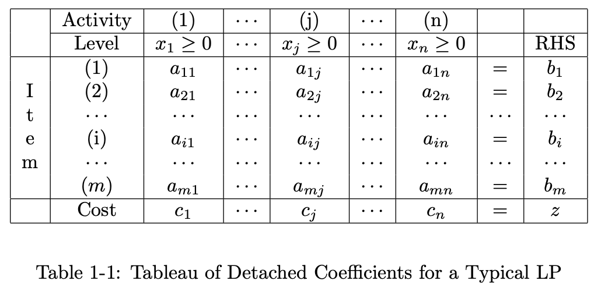

<head>
    
    
</head>

# Table of Contents

1.  [THE LINEAR PROGRAMMING PROBLEM](#org41f9ba4)
    1.  [MATHEMATICAL STATEMENT](#orgab2ed03)

# THE LINEAR PROGRAMMING PROBLEM

## MATHEMATICAL STATEMENT

线性规划在standard form中的数学定义是找到值 $ x_ {1} \\ge 0, x_ {2} \\ge 0, \\ldots, x_ {n} \\ge 0 $和min z满足

$ \\begin{equation} \\begin{array}{ccc} c_ {1}x_ {1} & + & c_ {2}x_ {2} & + & \\cdots & + & c_ {n}x_ {n} & = & z (Min) \\\\ a_ {11}x_ {1} & + & a_ {12}x_ {2} & + & \\cdots & + & a_ {1n}x_ {n} & = & b_ {1} \\\\ a_ {21}x_ {1} & + & a_ {22}x_ {2} & + & \\cdots & + & a_ {2n}x_ {n} & = & b_ {2} \\\\ \\vdots & & \\vdots & & \\vdots & & \\vdots & & \\vdots \\\\ a_ {m1}x_ {1} & + & a_ {m2}x_ {2} & + & \\cdots & + & a_{m n}x_ {n} & = & b_ {m} \\end{array} \\end{equation} $

用向量矩阵标记，我们可重写为

$ \\begin{equation} Minimize \\qquad c^{T}x = z \\end{equation} $

$ \\begin{equation} \\text{subject to} \\qquad Ax = b, \\qquad A: m \\times n \\end{equation} $

$ \\begin{equation} \\qquad \\qquad \\qquad x \\ge 0 \\end{equation} $

standard form的线性规划的dual的定义是找到值 $ \\pi_ {1}, \\pi_ {2}, \\ldots, \\pi_ {m} $和最大值v满足

$ \\begin{equation} \\begin{array}{ccc} b_ {1}\\pi_ {1} & + & b_ {2}\\pi_ {2} & + & \\cdots & + & b_ {m}\\pi_ {m} & = & v (Max) \\\\ a_ {11}\\pi_ {1} & + & a_ {21}\\pi_ {2} & + & \\cdots & + & a_ {m1}\\pi_ {m} & \\le & c_ {1} \\\\ a_ {12}\\pi_ {1} & + & a_ {22}\\pi_ {2} & + & \\cdots & + & a_ {m2}\\pi_ {m} & \\le & c_ {2} \\\\ \\vdots & & \\vdots & & \\vdots & & \\vdots & & \\vdots \\\\ a_ {1n}\\pi_ {1} & + & a_ {2n}\\pi_ {2} & + & \\cdots & + & a_{m n}\\pi_ {m} & \\le & c_ {m} \\end{array} \\end{equation} $

用向量矩阵标记，我们可重写为

$ \\begin{equation} Maximize \\qquad b^{T}\\pi = v \\end{equation} $

$ \\begin{equation} \\text{subject to} \\qquad A^{T}\\pi \\le c, \\qquad A: m \\times n \\end{equation} $

