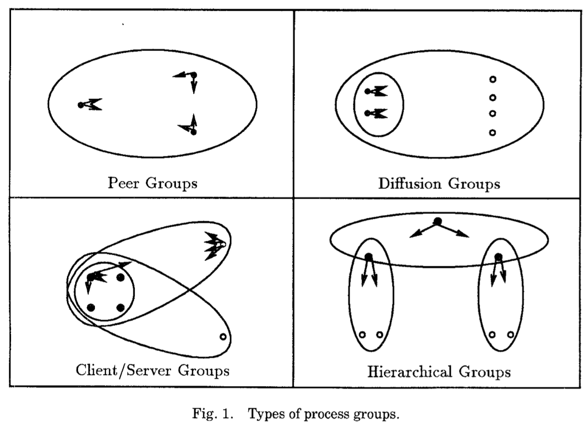
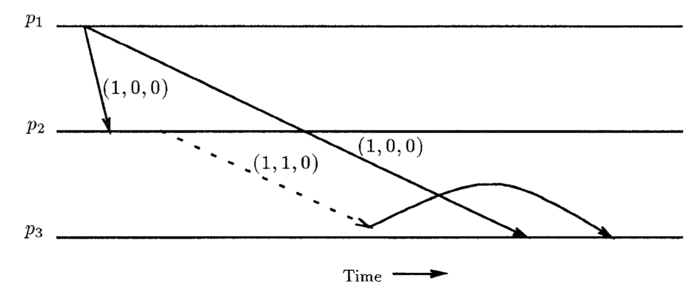
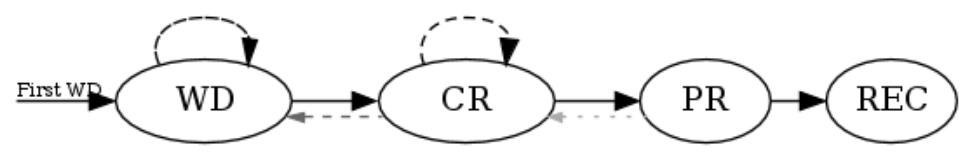

<head>
    
    
</head>

# Table of Contents

1.  [Algorithm](#orgfaa4b92)
2.  [Review](#orgf8e1276)
    1.  [简介](#orga2eb731)
        1.  [ISIS toolkit](#org1dddf3b)
        2.  [ISIS用户经验](#orge06380e)
        3.  [关于组通讯协议之前的工作](#org5cbe772)
        4.  [执行模型](#org85c660c)
        5.  [CBCAST和ABCAST协议](#org64e14ab)
3.  [Tips](#org726d2a7)
4.  [Share](#org1064c31)
    1.  [WebRTC Standardization Status](#orgd266a20)
    2.  [The path to being a full Recommendation](#orgfaf82e7)
    3.  [流行病使标准影响缓慢](#org79a4961)
    4.  [标准化工作有多重要？](#orgcc0eb6d)
    5.  [WebRTC扩展](#orgd0b32a7)
    6.  [getCurrentBrowsingContextMedia](#org7dff67e)
    7.  [WebRTC NV](#org6ba47ac)

# Algorithm

Leetcode 352: <https://leetcode.com/problems/data-stream-as-disjoint-intervals/>

<https://dreamume.medium.com/leetcode-352-data-stream-as-disjoint-intervals-75e178107288>

# Review

Lightweight Causal and Atomic Group Multicast

ISIS toolkit是分布式编程环境基于虚拟同步进程组和组通讯。我们呈现一族新的协议支持该模型。我们的处理最主要关注于原始多播，称为CBCAST，实现了容错，关系序消息转发。CBCAST可被直接使用，或扩展到原始总序多播，称为ABCAST。它在接收到之后正常立即转发消息，且强制一个空间超过发送者所属的组大小的一定比例，通常为一个小数字。协议都实现作为ISIS最近版本的一部分且我们讨论一些编程问题及性能。我们的工作使我们包含进程组和组通讯可达成性能和扩展比较消息传输层 - 找到矛盾广泛关心于分布式计算的这种风格可能不可接受

## 简介

### ISIS toolkit

ISIS toolkit提供各种工具在一个松耦合分布式环境下构建软件。系统成功地处理分布式一致性、协同分布式算法和容错问题。在本文写作时，Toolkit 2.1版本被使用在数百个地方

ISIS的两个方面是它的关键：

-   虚拟同步进程组的实现。这样的一个组包含一系列进程合作执行一个分布式算法，复制数据，提供一个服务容错或利用分布式
-   一系列可靠多播协议，进程和组成员跟组交互。ISIS可靠性包含故障原子性，转发顺序保障和一个组处理原子性形式，其成员改变通过组通讯同步

虽然ISIS支持大范围的多播协议，一个协议称为CBCAST称为系统通讯的多数。事实上，许多ISIS工具只是原始地调用该通讯。例如，ISIS复制数据工具使用单个（异步）CBCAST来执行每个更新和加锁操作；读不需要通讯。一个结论是CBCAST的开销代表ISIS系统的性能瓶颈

原始ISIS CBCAST协议的开销部分为结构原因，部分因为协议的使用。实现用一个协议服务器，因此所有CBCAST通讯经由一个间接路径。独立于协议本身的开销，该间接路径是昂贵的。更进一步，协议服务器证明扩展比较困难，限制初始ISIS版本为网络上几百个节点。对于协议使用，我们的初始化实现更喜欢一般化而不是特化因此允许特别灵活地目标地址。它使用其他的算法达成CBCAST顺序属性但需要定期的垃圾收集

地址灵活性在现在看来很弱，ISIS经验使我们关注于系统如何使用，允许我们聚焦核心功能。本文中描述协议支持高并发应用程序，扩展系统为巨量覆盖进程组和边界为过载的信息跟发送者消息所属的进程组大小成比例。虽然没有早期版本那么一般化，新的协议能够支持ISIS toolkit和所有我们熟悉的ISIS应用程序。该一般化化略的好处是使我们的系统在性能和扩张性上有显著地增长。事实上，新的协议套装没有对它支持的系统扩展有明显地限制。在应用程序本地化、爆发的通讯、多数多播将携带只是一个必要的小开销而不管使用的组的数量和大小这样的通常情况下，一个消息被延迟仅当它为乱序时。

本文的结构如下。第2节讨论被ISIS支持的进程组类型和在当前的ISIS应用程序中观察到的组使用和通讯的范型。第3节调查多播工作。第4节形式化虚拟同步多播问题和CBCAST和ABCAST协议必须满足的属性。第5节介绍在单进程组中我们的新技术；多播组在第6节。第7节考虑一些ISIS特别地实现问题。第8节中有一个我们初始化实现的性能讨论

### ISIS用户经验

我们开始审查在现存的ISIS应用程序中的组类型和组使用范型

ISIS支持四种组类型，如上图所示。最简单的记为配对组。在配对组中，进程合作作为对等的顺序使任务完成。它们可管理复制数据，子分割任务，监控另一个的状态或结合为一个紧密的协作分布行为。另一个常见的结构为客服端/服务器组。进程配对组作为服务器服务大量客户端。客户端与服务器以请求/回复风格交互，要么通过一个喜欢的服务器且通过向它发起RPC调用，或通过多播到整个服务器组。在后一种情况，服务器将通常多播它们的回复给对应的客户端和另一个服务器。一个扩展组是一类客户端-服务器组，服务器多播消息到服务器全集和客户端。客户端是被动的，只是简单地接收消息。扩散组出现在任意广播信息到大量站点的应用程序中，例如在经纪交易大厅。最后，分层组结构出现在分布式系统需要更大的服务器组的时候。分层组为组的树结构集合。一个根组映射初始连接请求到一个适合的分组，且应用程序只交互这个分组。数据在子组间被分区，且虽然一个大组通讯机制是有效的，但很少需要

许多ISIS应用程序使用多个结构，当混杂功能使用时使用覆盖组。例如，一个扩散组用来扩散股票信息被一个客户端/服务器组通过经纪人程序注册它们的股票兴趣信息覆盖。尽管，现存的ISIS应用程序很少使用大量的组。组不频繁改变成员，且一般包含足够成员来容错或负载共享（例如，3-5个进程）。另一方面，一个客户端/服务器或扩展组的客户端数量可能很大

虽然ISIS用户的学习我们已概括这些范型部分是ISIS演化的人为方式。在这里讨论之前的ISIS版本中，组有相当重量的条目。应用程序只能通过确保到一个组的通讯比组成员变动更频繁来获得可接受的性能。未来，我们期望我们的系统继续支持这四种组类型。我们也期望组仍然较小（除了客户端-服务器或扩散组的客户端集合）。然而，当我们如协议描述那样重建ISIS且移动关键模块到操作系统的更底层，组和组通讯期望有更低成本。这些开销似乎为一个决定性因素防止ISIS用户使用一个巨量的组，特别地在进程组自然建模某些应用程序级别数据类型或对象的时候。结果，我们期望对某些应用程序，组将远超进程数。更进一步，组将变成更加动态，因为加入或离开一个组的开销可极大减少使用本文发展的协议

为说明这些观点，我们考虑某些应用程序有这些特征。一个科学的模拟使用一个n维网格可能使用一个进程组来呈现每个网格元素的邻居。一个网络信息服务运行在数百个站点可能使用小进程组复制个人数据项；结果将为一个大组包含许多小的数据复制域，可能移动数据对应访问范型。相似地，一个进程组可能使用在一个模块化应用程序中导入许多这样的对象来实现复制数据。在每个例子中，进程组的数量可能巨大且在组扩展之间覆盖

想要支持应用程序像这些研究报告中呈现一个主要动机。早期的ISIS协议已证明扩展不灵活且困难；它似乎不能用来支持高动态，大扩展应用程序。这里报告的协议能响应这些需求，支持这些问题开发如同支持并行处理，使用多播通讯硬件和强制实时时间期限和消息优先级

### 关于组通讯协议之前的工作

我们的通讯协议从Schiper发展的关系消息转发协议演变而来，且基于Fidge和Mattern的工作。在单个进程组的情况下，算法被Ladin和Peterson发展的协议影响。然而，我们的工作在以下方面一般化协议：

-   其他多播协议只在单个进程组的情况下处理因果关系。我们的解决方案能处理多组，覆盖组。我们讨论一个多播协议在异步时必须遵循因果序（不阻塞发送者直到远端转发发生）。异步通讯在组结构分布式应用程序中是高性能的关键且是ISIS的核心特性
-   ISIS架构处理客户端/服务器组和扩散组为覆盖组集合，且在这种情况下优化因果序信息的管理。客户端和服务器可直接多播和容错客户端/服务器组的子组。Peterson的协议不执行这些组风格。Ladin协议支持客户端/服务器交互，但不支持扩散组，且不允许客户端直接多播到服务器组
-   Ladin协议使用稳定存储作为容错办法的一部分，我们的协议使用一个消息稳定的记号不需要额外存储

我们的CBCAST协议可扩展提供一个总消息转发序，该扩展支持我们主要贡献的多组。然而，我们的ABCAST协议也使用一个转发序跟因果序一致，允许它异步使用。一个转发序可能是总的但不是因果的，且一些协议指出不提供该保证

### 执行模型

我们现在形式化模型和要解决的问题

1.  基本系统模型

    系统由不相交内存空间的进程 $ P = \\{ p_ {1}, p_ {2}, \\ldots, p_ {n} \\} $组成。我们假设这个集合是静态的且已知；之后，我们放松该假设。通过崩溃检测到的进程故障（一个故障停止假设）；由一个故障检测机制提供一个通知。当多个进程需要协作，例如，管理复制数据，分割一个计算，监控另一个状态等等，它们可被结构化为进程组。这种组的集合被记为 $ G = \\{g_ {1}, g_ {2} \\cdots \\} $
    
    每个进程组有一个名字和一系列进程成员。成员动态地加入和离开；一个故障使一个进程离开其所属的所有组。进程组成员不需要唯一，也不需要对进程所属组数量有任何限制。以下呈现的协议都假设进程只多播到它所属的组，且所有多播直接到单组的所有成员
    
    我们的系统模型通常假设一个额外的服务实现进程组抽象。这精确反映我们当前的实现，从一个现存的ISIS进程组服务器上获得组成员管理。事实上，然而，这个需求可去掉
    
    进程加入和离开进程组的接口不在这里考虑，但组服务通讯成员信息到一个进程跟这个相关。一个进程组的视图是它的成员列表。g的视图序列是一个列表 $ view_ {0}(g), view_ {1}(g), \\ldots, view_ {n}(g) $
    
    (1) $ view_ {0}(g) = 0 $
    
    (2) $ \\forall i: view_ {i}(g) \\subseteq P $，P是系统中所有进程集合，且
    
    (3) $ view_ {i}(g)和 view_ {i+1}(g) $不同仅为一个进程的加入或减少
    
    进程对其他组成员故障的学习只通过这个视图机制
    
    我们假设在进程间直接通讯总是可能的；软件实现这个被成为消息传输层。没有我们的协议，进程总是使用点到点和多播消息通讯；多播可能使用多个点到点消息传输如果没有更有效的替代方式的话。原始的传输通讯必须提供无损、无错、序列化的消息转发。消息传输层总是假设一旦发现一个故障检测则截获和丢失的消息来自该进程。这防止进程可能悬挂一个扩展时间的可能性（例如，等待一个分页存储来响应），但然后尝试重启系统通讯。明显，这种短暂的问题不能和永久故障区分出来，因此很少会选择用相同的方式处理，通过强制故障进程运行一个恢复协议
    
    我们的协议架构允许应用程序构建器定义一个新的传输协议，可能对特殊硬件有优势。本文描述的实现使用我们构建在一个不可靠数据层的传输
    
    进程的执行是一个事件序列的偏序，每个对应一个不可分割行为的执行。一个非循环时间序，记为 $ \\stackrel{p}{\\to} $，反映发生在进程p在另一个之上的事件依赖。事件 $ send_ {p}(m) $记为dests(m)，通过进程p到一个或多个目标的集合的传输；通过进程p消息m的接收记为 $ rev_ {p}(m) $。当进程在上下文是清楚的时候我们省略下标。当 $ \| dests(m) \| > 1 $我们将假设在当个行为中send推送消息到所有通讯频道可能被故障打断，但不会被其他send或rev行为打断
    
    我们记 $ rev_ {p}(view_ {l}(g)) $事件为一个进程p属于 $ view_ {l}(g) $中的学习
    
    我们区分接收消息事件和转发消息事件，因为这允许我们模型协议延迟消息转发直到某些条件满足。转发事件被记为 $ deliver_ {p}(m) $当 $ rcv_ {p}(m) \\stackrel{p}{\\to} deliver_ {p}(m) $
    
    当一个进程属于多个组，我们可能需要显示一个消息被发送、接收或转发到哪个组。我们将通过用第二个参数扩展我们的记号；例如， $ deliver_ {p}(m, g) $将显示消息m被转发在进程p，且被组g中其他进程发送
    
    和Lamport一样，我们定义潜在的系统关系$ \\to $，作为关系的传输闭集定义如下：
    
    (1) 如果 $ \\exists p: e \\stackrel{p}{\\to} e', 则 e \\to e' $
    
    (2) $ \\forall m: send(m) \\to rev(m) $
    
    对消息m和m'，记号 $ m \\to m' $将被使用为 $ send(m) \\to send(m') $的简写
    
    最后，为阐明活跃，我们假设任意消息被一个进程发送最终接收除非发送者或目标故障，且故障被检测且最终反映到一个新的组试图忽略该故障进程

2.  虚拟同步属性需要多播协议

    早期，我们描述ISIS为一个虚拟同步编程环境。直观上，这意味着用户可编程作为系统调度分布式事件在某个时刻（例如，组成员改变，多播和故障）。当一个系统事实上是这样的行为时，我们称它同步；这样的环境将简化分布式算法的发展但提供很少的可能性来利用并行。ISIS使用的调度，同步只在表面。在ISIS工具箱中工具的顺序需要已被分析，且系统事实上强制在每个案例中同步需要的程度，操作经常并行执行且异步多播，但算法仍能发展且使用一个简单的同步模型
    
    虚拟同步有两个主要的方面：
    
    （1） 地址扩展。它可能使用组为多播的目标。协议必须扩展一个组唯一号到目标列表且转发消息使得
    
    a. 当消息到达时所有接收者有相同的组视角
    
    b. 目的列表包含该视图的成员
    
    这些规则的影响是目标列表的扩展和消息转发看似为单个瞬时事件
    
    （2）原子转发和顺序。这包括消息转发容错（所有操作的目标最终接收到一个消息或只有发送者故障，无消息发送）。进一步地，当多个目标接收到相同的消息，他们观察到一致的转发顺序
    
    两种类型的转发顺序很有趣。我们定义关系转发顺序对多播消息m和 $ m^{\\prime} $如下：
    
    $ m \\to m^{\\prime} \\Rightarrow \\forall p \\in dests(m) \\cap dests(m^{\\prime}): diliver(m) \\stackrel{p}{\\rightarrow} deliver(m^{\\prime}) $
    
    CBCAST只提供关系顺序转发。如果两个CBCAST并发，协议在目标上对它们转发顺序无限制。ABCAST扩展关系顺序为一个总序，通过顺序并发消息m和 $ m^{\\prime} $使得
    
    $ \\exists m, m^{\\prime}, p \\in g: deliver_ {p}(m, g) \\stackrel{p}{\\rightarrow} deliver_ {p}(m^{\\prime}, g) \\rightarrow \\\\ \\forall q \\in g: deliver_ {q}(m, g) \\stackrel{q}{\\rightarrow} deliver_ {q}(m^{\\prime}, g) $
    
    注意ABCAST的这个目标只是顺序化消息发送到相同的组；其他定义也是可能的。我们将在之后章节讨论。因为ABCAST协议顺序并发事件，它比CBCAST成本高，因此需要同步解决方案而CBCAST协议是更高效的异步解决方案
    
    虽然可定义其他的转发顺序，我们在ISIS上的工作建议这不需要。更高层的ISIS工具箱为它们整个用异步CBCAST实现。事实上，Schmuck显示多个算法指定为ABCAST可修改为使用CBCAST而不影响正确性。进一步，他阐述了两种协议对顺序转发类型是完整的。例如，CBCAST可模仿任意顺序属性允许消息转发在通讯的第一轮次上
    
    容错和消息转发顺序不依赖我们的模型。一个进程在观察到发送者故障后将不接收故障发送者的多播；这需要在视图对应故障可被转发到组成员之前在故障时的多播进度可被系统刷新。更进一步，故障不会在一个多播关系序列中离开隔绝。即如果 $ m \\to m^{\\prime} $且一个进程 $ p_ {l} $已接收到 $ m^{\\prime} $，它不需要考虑一个故障可能防止m被转发到任意它的目标（即使m和 $ m^{\\prime} $的目标不重叠）。故障原子化不会提供任何保证

3.  向量时间

    我们转发协议基于一种逻辑时钟称为向量时钟。向量时钟协议维护有效的信息来精确地代表 $ \\to $

    对一个进程 $ p_ {i} $的向量时间，记为 $ VT(p_ {i}) $，是一个长度为n的向量（ $ n = \| P \| $），已进程号为索引
    
    1.  当 $ p_ {i} $开始执行，$ VT(p_ {i}) $初始化为0
    2.  对在 $ p_ {i} $上的每个事件send(m)，$ VT(p_ {i})[i] $增长1
    3.  每个进程 $ p_ {i} $多播的消息用增加的 $ VT(p_ {i}) $值进行时间戳
    4.  当进程$ p_ {j} $转发一个从 $ p_ {i} $包含 $ VT(m) $的消息m，$ p_ {j} $修改它的向量时钟如下：
        
        $ \\forall k \\in 1, \\cdots, n: VT(p_ {j})[k] = max(VT(p_ {j})[k], VT(m)[k]) $
    
    即赋给消息m的向量时间戳统计消息的数量，在每个发送者上，先于m
    
    比较向量时间戳的规则如下：
    
    1.  $ VT_ {1} \\le VT_ {2} \\quad iff \\quad \\forall i: VT_ {1}[i] \\le VT_ {2}[i] $
    2.  $ VT_ {1} < VT_ {2} \\text{ if } VT_ {1} \\le VT_ {2} \\text{ and } \\exists i: VT_ {1}[i] < VT_ {2}[i] $
    
    这可被显示为给定消息m和$ m^{\\prime}, m \\to m^{\\prime} \\text{ iff } VT(m) < VT(m^{\\prime}) $：向量时间戳精确代表关系
    
    向量时间为Fidge和Mattern以这种形式发表；后者还有一个好的观测。其他研究者也使用向量时间或相似的机制。

### CBCAST和ABCAST协议

本章节描述我们新的CBCAST和ABCAST协议。我们初始化考虑一个固定成员关系的进程组的例子。多进程组问题将在下一节说明。本节首先引入关系转发协议，然后扩展它到总序ABCAST协议，并最终考虑视图改变

1.  CBCAST协议

    假设一个进程P集合只使用广播到系统中全部进程集合来通讯。即，$ \\forall m: dests(m) = P $。我们现在开发一个转发协议，每个进程p接收它发送的消息，必要时进行延迟，然后以跟关系顺序一致来转发：
    
    $ m \\to m^{\\prime} \\Rightarrow \\forall p: diliver_ {p}(m) \\stackrel{p}{\\rightarrow} deliver_ {p}(m^{\\prime}) $

    我们的解决方案是使用向量时间戳转发。基本思想是用时间戳标签每个消息，$ VT(m)[k] $，精确显示进程 $ p_ {k} $中多少个多播先于m。m的接收者将延迟m直到 $ VT(m)[k] $个消息以从 $ p_ {k} $转发。因为 $ \\to $是向量时间上精确地非循环表示，转发的结果顺序是关系且deadlock free的
    
    协议：
    
    （1）在发送m之前，进程 $ p_ {\\iota} $递增 $ VT(p_ {\\iota})[i] $且时间戳m
    
    （2）在收到$ p_ {\\iota} $发送的用VT(m)时间戳标签的消息m后，进程 $ p_ {J} \\ne p_ {i} $ 延迟转发m直到：
    
    $ \\forall k: 1 \\cdots n \\left\\{ \\begin{array}{ll} VT(m)[k] = VT(p_ {\\jmath})[k] + 1 & \\text{if } k = i \\\\ VT(m)[k] \\le VT(p_ {\\jmath})[k] & \\text{otherwise} \\end{array} \\right. $
    
    进程$ p_ {J} $不需要延迟从它自身接收到的消息。延迟的消息用队列维持，CBCAST延迟队列。该队列用向量时间存储，通过接到的时间排序并行的消息
    
    （3）当一个消息m被转发，$ VT(p_ {J}) $根据向量时间协议被更新
    
    
    
    步骤2是协议的关键。这保证任意消息$ m^{\\prime} $在m之前关系传输（因此 $ VT(m^{\\prime}) < VT(m) $）将被$ p_ {J} $在m之前转发。一个使用这个规则延迟转发消息的例子如上图
    
    我们用两个阶段证明协议的正确性。我们首先显示关系关系不会被违反（安全）且然后我们阐述协议绝不会不清晰地延迟一个消息

# Tips

-   感觉要看的东西太多，需要根据自己的规划、喜好、节奏做些取舍

# Share

WebRTC Today & Tomorrow: Interview with W3C WebRTC Chair Bernard Aboba

<https://webrtchacks.com/webrtc-today-tomorrow-bernard-aboba-qa/>

每年我会在IIT-RTC会议上遇到许多WebRTC标准的人员。今年的传染病使得今年明显不同往年。Bernard Aboba代表Edge在这年的WebRTC浏览器更新轮桌上在Kranky Geek（他在这里经常是Edge WebRTC的代言人）。Bernard也是W3C的WEBRTC Working Group的联合主席。当我们在这年的Kranky Geek会议上接触标准化工作和“WebRTC未来“，我们没有时间深入很多细节所以我们将在这里说明

Bernard有一个长且不同的实时通讯职业。还有他的W3C WebRTC联合主席角色，他也是WEBTRANS和AVTCORE工作组的联合主席和ORTC, WebRTC-SVC, WebRTC-NV Use Cases, WebRTC-ICE, WebTransport和WebRTC-QUIC文档的作者。不要忘记WebRTC也是IETF部分标准，Bernard也是WEBTRANS and AVTCORE WGs的联合主席。在微软他是微软组媒体组织称为IC3的组的架构师，该小组职责是支持微软组和其他项目基于Teams架构比如Azure通讯服务

## WebRTC Standardization Status

作为W3C's WebRTC Working Group主席之一，Bernard是WebRTC标准化进程中的权威人物。我开始问他Working Group当前的角色

Bernard: 在April 2020 presentation to W3C讨论的那样，WebRTC Working Group官方描述工作在3个方面：

1.  完成WebRTC Peer Connection (WebRTC-PC)，这是第一优先级，及相关的指导说明比如WebRTC状态
2.  捕获，流和输出相关说明，包括媒体捕获和流，屏幕捕获，从DOM Elements中媒体捕获，媒体流图像捕获，媒体流记录，音频输出设备和内容提示
3.  WebRTC-NV，下一版WebRTC

WebRTC-NV是WebRTC的下一版，它将在当前1.0指导说明中出现

Bernard: WebRTC-NV工作主要在4个分类

1.  一个分类是扩展WebRTC PeerConnection。这包括WebRTC扩展，WebRTC-SVC和可插入流。我将提及WebRTC提议推荐和所有依赖RTCPeerConnection的工作需要“统一计划”，这是现在所有浏览器中默认的SDP方言。这样，例如在你的应用程序中，如果不支持“统一计划”它不可能利用可插入流来支持端到端加密
2.  第二个分类包括在WebRTC-PC提议推荐中没有实现或成熟需求的特性，包括WebRTC唯一标识，WebRTC优先级控制和WebRTC DSCP
3.  第三个分类是捕获扩展，比如MediaStreamTrack可插入流，媒体捕获和流扩展和媒体捕获深度流扩展（最近复苏）
4.  第四个分类是我称之为独立指导说明，其不需要依赖RTCPeerConnection或存在的媒体捕获指导说明。WebRTC-ICE（已被实现为独立指导说明）在这个分类中，及在W3C WEBRTC外部发展的API指导说明比如WebTransport（在W3C WebTransport WG），WebRTC-QUIC（在ORTC CG）和WebCodecs（在WICG）

给定不同的工作分类，"NV"这个术语有些模糊且可能使人困惑。该术语源之于ORTC，但今天它一般为多个说明，而不是单个文档。在当前的使用中，有一些歧义，因为"NV"可能指定为RTCPeerConnection扩展和现存的捕获APIs，或跟RTCPeerConnection或现存的捕获APIs不相关的API，比如WebTransport和WebCodecs，这样当有人提及"WebRTC-NV"时，它通常需要问一些问题来理解它们到底是哪个意思

## The path to being a full Recommendation

WebRTC使用的协议被定义在IETF，W3C定义浏览器中使用的API。W3C的正式标准化之路 - 和争论应该包括那些东西 - 一度成为争议的话题

Bernard给出这些方面的一些背景和状态

Chad: 你能给我们的听众介绍W3C指导说明的阶段状况吗？

Bernard: 第一个标准化阶段是CR - 替代者推荐。替代者推荐意味着指导说明已被广泛审查，已经达到WG要求且可实现。在CR时，指导说明可能还没有完全实现（有特征风险）且可能被浏览器内部处理

你可看到整个进程细节描述在 <https://www.w3.org/2020/Process-20200915/>

Chad: 当你说最后的CR，我猜测有多个CR或CR进程是多阶段的？

Bernard: 有一个新的W3C进程有实时的指导说明。让我们说我们在最后一个之前我们将文档化一个提议的推荐

这样PR[提议推荐]即是你可以尝试实验指导说明已实现的每一个条目。下一个步骤是PR且我们收集你们需要的大量的数据。比如Peer Connection，它有大量的数据因为你需要所有你的内部操作测试，包括你的WPT测试结果，也包括潜在的你的KITE测试结果

WPT指web-platform-tests，是W3C上一系列测试检查API实现，该结果放在<https://wpt.fyi>

KITE是一个开源，内部操作测试项目指定给WebRTC。Alex博士讨论了相关内容在他的webrtcHacks博客上 - <https://webrtchacks.com/sfu-load-testing/>

Chad: WPT即wpt.fyi，是一般化类型自动特性测试，而KITE是WebRTC特定内部操作测试

Barnard: WebRTC WPT测试运行在单个浏览器上，WebRTC WPT上我们没有服务器测试，但有一些像WebTransport这样的服务器测试。这样WebRTC WPT测试不需要在浏览器间或浏览器与议会服务器间demo化操作，而KITE测试是在浏览器和潜在的多个条目中测试

Chad: 这就是WebRTC指导说明 - 你们事实上发送媒介给不同的浏览器

Bernard: 为理解WPT测试覆盖水平，我们有指导说明的注释。除了测试结果，你也想要知道指导说明被测试事实上覆盖了多少

## 流行病使标准影响缓慢

WebRTC有一些有趣的影响。它使我们所有人在WebRTC社区非常忙碌，更多聚焦于所有新流量的扩展和可靠性。然而，聚焦的改变极大地影响了现在的进程。这也影响到标准进程了吗？

Bernard: 底线是我们尝试收集所有证据我们将要呈现在W3C上声明我们准备好了提议推荐阶段。这是非常大的一步，但进度被病毒影响放慢。我的意思，我们认为我们将获得进一步的实现进程，但病毒让所有人放慢

Chad: 因为人们忙于支持他们的产品或因为事实上你们不能频繁聚集在一起？

Bernard: 流行病打乱了很多事，例如，KITE内部操作测试通常由IETF的人来完成但我们还没有IETF的人。我们已尝试去搞清楚我们如何使测试完成，但由于没法把人聚集在一处统计很困难。如果人员分散在全世界各地想要在同一时间同一地点组织所有人是困难的。

病毒不仅打乱了测试，也影响了实现计划。当几乎所有提议推荐的特性已实现在至少一个浏览器时，我们原本相信我们将在2020年秋的code base上有更多的特性实现在多个浏览器上。这样实现进度和测试都不在我们的预期中

## 标准化工作有多重要？

WebRTC已在非常多浏览器实现，在过去几年有一个更新。WebRTC支持了VoIP流量的重要部分。标准化工作的下一个阶段还很重要吗？

Bernard指出标准化不仅仅是写指导说明 - 它实际上是内部操作能力

Bernard: 标准化工作聚焦在测试和稳定性上。WebRTC Peer Connection最大的挑战之一是它的宽度太广。我们了解到仅从每天从bug中分离出的严重bug，知道我们的覆盖不是我们真实想要的。我们也了解到它有多困难达到可接受的测试覆盖。这里有很多最近的bug比如多路，其事实上已有主要的影响在现存的服务且我们还没有测试。我们从这些bug中看到这些不是WPT发现的。这些需要有类似KITE的框架来做且我们还没有在KITE中接近百分比测试覆盖

我将说最大的不同之一是我认为在实时通讯 vs 网络其他方面有很大的测试矩阵尺寸。甚至想象如果我告诉你Chad，我想要让你开发，获得95%的覆盖。我想通过这样测试的进程是有帮助的，但它还使我们欣赏让每一件事都覆盖的挑战。非常难

## WebRTC扩展

WebRTC事项列表变得越来越长。如Bernard所提及的，WebRTC 1.0进度跟随标准进程所以只需要画一条线来添加新的特性。如Bernard将解释的，WebRTC扩展有一些特性不会进入WebRTC 1.0

Bernard: 有一系列指导说明依赖RTCPeerConnection。WebRTC扩展是其中之一。有一些指导说明添加功能到PC端WebRTC。这里有大量事项例如，RTP头扩展加密。WebRTC SVC - 可扩展视频编码 - 不在WebRTC扩展文档中，但我认为它是一个扩展。我将考虑可插入流为WebRTC PC端的一个扩展，它的编码版本。这些事项假设你有RTCPeerConnection

## getCurrentBrowsingContextMedia

随着视频会议的使用增长，有几个频率高的问题即webcam出错和偶尔的屏幕共享。同时，快速webcam访问通常是WebRTC服务的一个问题。平衡访问速度和隐私控制是一个难题。另外，getMediaDevices提供的媒体设备信息使用的指纹成为一个持续的隐私挑战

getCurrentBrowsingContextMedia的提议是一个处理这些挑战的尝试

Chad: 我们能说下getCurrentBrowsingContextMedia媒体提议吗？

Bernard: 这是一个扩展，我认为是一个屏幕捕获的扩展。让我说说捕获的问题 - 聚焦于捕获的很多是隐私和安全问题。我们发现媒体捕获流对隐私不是很好。假设你给应用程序所有设备信息，是否它们被选择或否，则让它创建自己的picker。这对指纹是一个问题因为现在我知道在你的机器上所有的设备。虽然你不想使用摄像头，但我知道有。Jan-ivar已经提议我们移动到另一个模型，其跟屏幕捕获相似

在屏幕捕获中你只获得访问用户选择的摄像头。这样它不像我获得访问你所有的apps且我能看到每个窗口且然后我决定作为一个应用程序购买我想看的。现在用户选择源且你只能获得访问它。这是Jan-ivar提议的媒体捕获和流模型。它会变成浏览器picker的一部分。应用程序只能获得用户选择的设备信息。这是一个大变动。它也将带来一些基本的媒体捕获和流问题。例如，如果用户依然想要选择的话限制的目的是什么？

Chad: 这是否意味着设备picker有更多的指导说明？

Bernard: 我认为是。然而，我们决定根据该模型升级现存的指导说明。然后Jan-ivar创建该新模型的一个独立的说明针对所有这些问题。这是一个非常不同的模型，当人们使用应用程序picker时如何使用这新模型呢？这将花费很长的时间

## WebRTC NV

一个激烈争论的标准结论是一个勉强地决定指定一个形式化的版本名称因为每个人有不同的观点在什么组成一个主发布版本（例如，1.0, 2.0） vs 一个小版本（例如，1.1, 1.2等）。曾有一个替代的提议称为ORTC有时指WebRTC的前身。WebRTC 1.0已合并我们讨论的指导说明。然而，还有很多债在下一个版本中。他们最终命名下一个版本为"WebRTC Next Version"或WebRTC-NV

Bernard解释这意味着什么

Chad: 我们讨论一下我们将看到的下一代WebRTC。我猜我们不称其为2.0因为1.0还没有完成？

Bernard: 我想可能是时候想想NV术语因为它代表两个潜在的非常不同的事。一个是如我提及的Peer Connection扩展 - 可插入流，WebRTC扩展，WebRTC SVC。我认为当你把所有指导说明和在一块它将是ORTC的所有功能，所以我们在WebRTC PC上已兼容大多数ORTC对象模型

另一个非常独立的是我所说的单独说明。这包括WebTransport, WebCodecs, WebRTC ICE - 这些是非常独立的，且不依赖RTCPeerConnection，所以它是下一代跟现在的不同

明显地，WebTransport是一个原始的尝试。WebCodecs在Chrome上是一个原始尝试。现在这非常不同因为你使用的许多事情作为WebRTC PC的一部分，你现在不得不在Web Assembly上写。所以它是非常非常不同的开发模型

WebTransport继承客户端-服务器模型。有一个点对点扩展在之前尝试过一段时间，但当前它是客户端服务器模型。这样你不能写完整的WebRTC PC使用用例带着WebCodecs和WebTransport

我想说在WebRTC NV上发生的另一件事，它变得非常重要，即人们已聚焦于机器学习和访问裸媒体。这是ORTC没有提供的。且我想说的是WebTransport或WebCodecs模型相比ORTC在更底层。ORTC不会给你直接访问编码器和解码器。这在WebCodecs中能获得。所以我认为我们将带着ORTC的思想且我们已使它更底层到传输层
