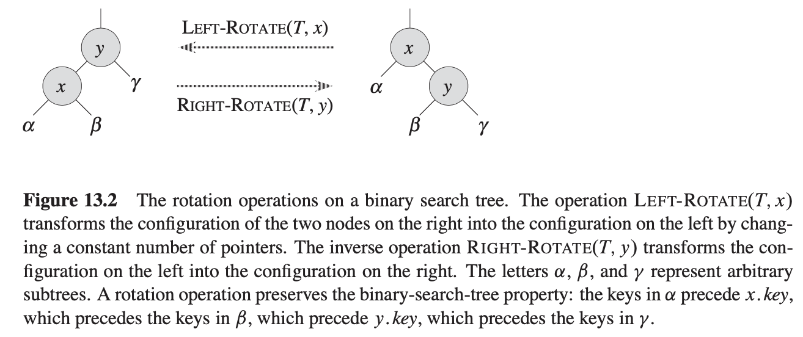
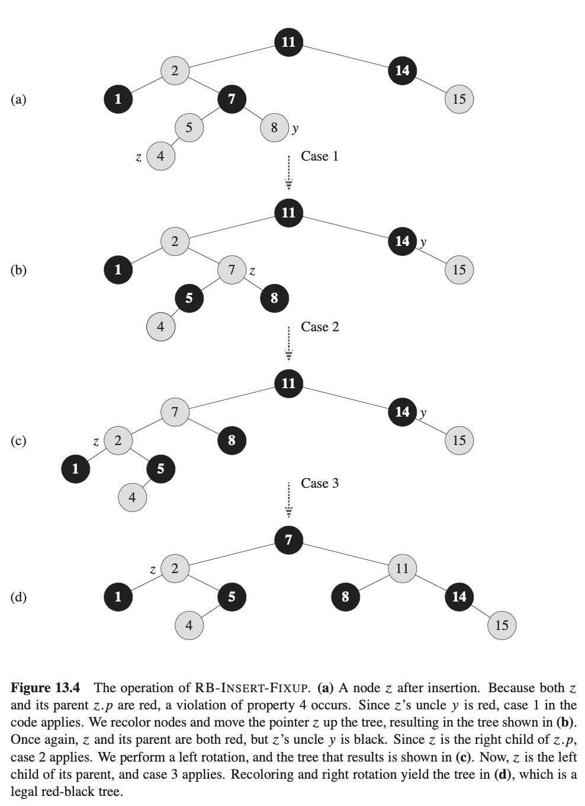
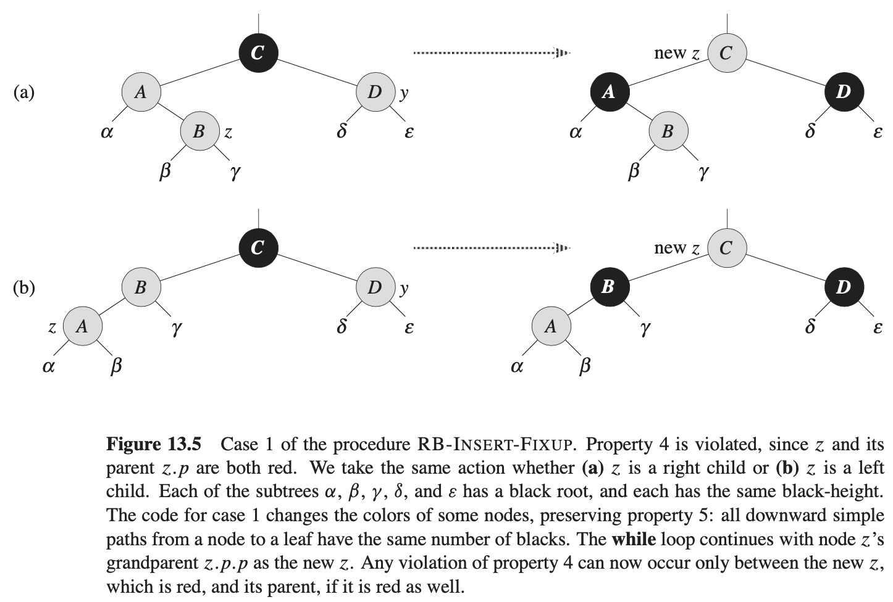

<head>
    
    
</head>

# Table of Contents

1.  [Algorithm](#org6aee94e)
2.  [Review](#org4d79028)
3.  [Tips](#org40dbc23)
4.  [Share](#orgd704316)
    1.  [红黑树属性](#orge5f4ef6)
    2.  [旋转](#orge229ec9)
    3.  [插入](#org7e963e7)
        1.  [第一种情况：z的叔叔y是红色](#orgb548eee)

# Algorithm

Leetcode 352: 

# Review

# Tips

-   

# Share

《算法导论》第13章 红黑树

之前看了一遍，全忘了，再复习一遍

前面章节显示一个高度为h的二叉搜索树支持任意基本动态集操作 - 比如搜索、前节点、后节点、最大值、最小值、插入和删除为O(h)时间复杂度。这样，集合操作很快如果搜索树的高度较小的话。如果高度很高，集合操作可能运行不比链表快。红黑树是许多搜索树解决方案的一种，它是平衡的为了确保基本动态集操作在最坏的情况下有O(lgn)的时间复杂度

## 红黑树属性

一个红黑树是一个二叉搜索树，每个节点额外带一个比特的存储：它的颜色，红色或黑色。通过限制从根到叶子的任意简单路径上的节点颜色，红黑树确保这样的路径不会比别的路径的长度超过两倍，这样该树是大约平衡的

树上每个节点现在包含属性颜色、键、左、右和父，如果一个节点的一个孩子或父不存在，对应的节点指针属性包含值NIL。我们将视这些NIL为指针到二叉搜索树叶子（额外节点）及正常，携带键的节点为树的内部节点

一个红黑树是一个二叉树满足如下红黑树属性：

1.  每个节点要么红色要么黑色
2.  根节点是黑色
3.  每个叶子（NIL）是黑色
4.  如果一个节点是红色，则它的两个孩子节点是黑色
5.  对每个节点，从这个节点到其叶子节点所含的所有简单路径有相同数目的黑色节点

为了方便处理红黑树代码的边界条件，我们使用一个单个守卫符来代表NIL。对红黑树T，守卫符T.nil是一个和树中普通节点有相同属性的对象。它的颜色属性是黑色，它的其他属性 - 父、左、右和键可为任意值。所有指向NIL的指针被替换为指向守卫符T.nil

我们使用守卫符使得我们可处理节点x的一个NIL孩子节点作为父节点为x的普通节点。虽然我们在树中对每个NIL可以添加不同的守卫节点，这样每个NIL节点的父是良好定义的，但这样处理会浪费空间。我们使用一个守卫符T.nil代表所有的NILs - 所有叶子和根的父。守卫符父、左、右和键值可忽略，虽然我们在方便的时候可设置它们

我们一般限制我们的兴趣点在红黑树的内部节点，因为它们持有键值。在本章的剩下部分，当我们画红黑树时我们忽略叶子

我们称任意简单路径上黑色节点的数目，不包括节点x本身，从节点x到其叶子结点中的黑节点，记为bh(x)。我们定义红黑树的黑色高度为它根节点的黑色高度

**引理** 有n个内部节点的红黑树有高度最多2lg(n + 1)

证明：我们已显示在任意节点x为根的子树包含至少 $ 2^{hb(x)} - 1 $个内部节点开始。我们通过在x的高度上用归纳法证明。如果x的高度是0，则x必须为叶子（T.nil），且以x为根的子树包含至少 $ 2^{bh(x)} - 1 = 2^{0} - 1 = 0 $个内部节点。考虑一个节点有正数的高度且是有两个孩子节点的内部节点。每个孩子有一个黑色高度要么bh(x)或bh(x) - 1，取决于是否它的颜色是红或黑。因为x的孩子的高度小于x本身的高度，我们可应用归纳假设使每个孩子有至少 $ 2^{bh(x) - 1} - 1 $个内部节点。这样，x为根的子树包含至少 $ (2^{bh(x) - 1} - 1) + (2^{bh(x) - 1} - 1) + 1 = 2^{bh(x)} - 1 $ 个内部节点

为完成引理的证明，设h为树的高度。则从根到叶子的任意路径上至少一半的节点，不包含根，必须为黑色。结论，根的黑色高度必须至少h / 2，这样

$ \\begin{equation} n \\ge 2^{\\frac{h}{2}} - 1 \\end{equation} $

规整一下该该公式，可得 $ \\lg (n + 1) \\ge \\frac{h}{2} 或 h \\le 2 \\lg (n+1) $

## 旋转

搜索树操作TREE-INSERT和TREE-DELETE，时间复杂度为O(lgn)。因为它们会修改树，结果会违反红黑属性。为恢复这些属性，我们必须改变树中某些节点的颜色且改变指针结构

我们通过旋转来改变指针结构，其是一个搜索树中本地操作保留二叉搜索树属性。有两种类型的旋转：左旋和右旋。当我们在节点x上左旋时，我们假设它的右子节点不是T.nil；x可能为树中任意节点其右子节点不是T.nil。左旋使y作为子树的新根，x作为y的左子节点且y的左子节点作为x的右子节点

LEFT-ROTATE的伪代码假设 $ x.right \\ne T.nil $且root的父为T.nil

$ \\begin{equation} 1 \\qquad y = x.right \\qquad \\qquad \\text{set y} \\\\ 2 \\qquad x.right = y.left \\qquad \\qquad \\text{// turn y's left subtree into x's right subtree} \\\\ 3 \\qquad \\text{if } y.left \\ne T.nil \\\\ 4 \\qquad \\qquad y.left.p = x \\\\ 5 \\qquad y.p = x.p \\qquad \\qquad \\text{// link x's parent to y} \\\\ 6 \\qquad \\text{if } x.p == T.nil \\\\ 7 \\qquad \\qquad T.root = y \\\\ 8 \\qquad \\text{elseif } x == x.p.left \\\\ 9 \\qquad \\qquad x.p.left = y \\\\ 10 \\qquad \\text{else } x.p.right = y \\\\ 11 \\qquad y.left = x \\qquad \\qquad \\text{// put x on y's left} \\\\ 12 \\qquad x.p = y \\end{equation} $

RIGHT-ROTATE代码跟LEFT-ROTATE代码是对称的，时间复杂度为O(1)

## 插入

我们能插入一个节点到n个节点的红黑树，时间复杂度为O(lgn)。为此，我们使用一个TREE-INSERT的直接修改版本插入节点z到树T，然后标记z为红色。为保持红黑树属性，我们然后调用一个辅助过程RB-INSERT-FIXUP来调整节点颜色并执行旋转。

$ \\begin{equation} RB-INSERT(T, z) \\\\ 1 \\qquad y = T.nil \\\\ 2 \\qquad x = T.root \\\\ 3 \\qquad \\text{while }x \\ne T.nil \\\\ 4 \\qquad \\qquad y = x \\\\ 5 \\qquad \\qquad \\text{if } z.key < x.key \\\\ 6 \\qquad \\qquad \\qquad x = x.left \\\\ 7 \\qquad \\qquad \\text{else } x = x.right \\\\ 8 \\qquad z.p = y \\\\ 9 \\qquad \\text{if } y == T.nil \\\\ 10 \\qquad \\qquad T.root = z \\\\ 11 \\qquad \\text{elseif } z.key < y.key \\\\ 12 \\qquad \\qquad y.left = z \\\\ 13 \\qquad \\text{else } y.right = z \\\\ 14 \\qquad z.left = T.nil \\\\ 15 \\qquad z.right = T.nil \\\\ 16 \\qquad z.color = RED \\\\ 17 \\qquad RB-INSERT-FIXUP(T, z) \\end{equation} $

TREE-INSERT和RB-INSERT过程有四点不同。首先，TREE-INSERT中的所有NIL实例被T.nil替代。其次，我们在RB-INSERT的第14-15行设置z.left和z.right为T.nil，为了维护适合的树结构。第三，我们在第16行设置z节点颜色。第四，因为把z节点设置为红色可能违反了红黑树属性，我们在17行调用RB-INSERT-FIXUP(T, z)来恢复红黑树属性

$ \\begin{equation} RB-INSERT-FIXUP(T, z) \\\\ 1 \\qquad \\text{while } z.p.color == RED \\\\ 2 \\qquad \\qquad \\text{if } z.p == z.p.p.left \\\\ 3 \\qquad \\qquad \\qquad y = z.p.p.right \\\\ 4 \\qquad \\qquad \\qquad \\text{if } y.color == RED \\\\ 5 \\qquad \\qquad \\qquad \\qquad z.p.color = BLACK \\qquad \\qquad \\qquad \\text{// case 1} \\\\ 6 \\qquad \\qquad \\qquad \\qquad y.color = BLACK \\qquad \\qquad \\qquad \\text{// case 1} \\\\ 7 \\qquad \\qquad \\qquad \\qquad z.p.p.color = RED \\qquad \\qquad \\qquad \\text{// case 1} \\\\ 8 \\qquad \\qquad \\qquad \\qquad z = z.p.p \\qquad \\qquad \\qquad \\text{// case 1} \\\\ 9 \\qquad \\qquad \\qquad \\text{else if } z == z.p.right \\\\ 10 \\qquad \\qquad \\qquad \\qquad z = z.p \\qquad \\qquad \\qquad \\text{// case 2} \\\\ 11 \\qquad \\qquad \\qquad \\qquad LEFT-ROTATE(T, z) \\qquad \\qquad \\qquad \\text{// case 2} \\\\ 12 \\qquad \\qquad \\qquad \\qquad z.p.color = BLACK \\qquad \\qquad \\qquad \\text{// case 3} \\\\ 13 \\qquad \\qquad \\qquad \\qquad z.p.p.color = RED \\qquad \\qquad \\qquad \\text{// case 3} \\\\ 14 \\qquad \\qquad \\qquad \\qquad RIGHT-ROTATE(T, z.p.p) \\qquad \\qquad \\qquad \\text{// case 3} \\\\ 15 \\qquad \\qquad \\text{else (same as then clause with "right" and "left" exchanged)} \\\\ 16 \\qquad T.root.color = BLACK \\end{equation} $

为理解RB-INSERT-FIXUP如何工作，我们应该把该代码分成3个主要步骤。首先，我们应该确定什么违反了红黑树属性当节点z被插入并设置为红色时被引入了进来。其次，我们应该检查1-15行while循环的整体目标。最后，我们应该探索while循环里3个分支的每一个并查看它们如何实现目标。上图显示了RB-INSERT-FIXUP在一个红黑树例子中的操作

红黑树的什么属性会在调用RB-INSERT-FIXUP时违背？属性1一直保持，属性3也是，因为新插入的红色节点的两个孩子为T.ni。属性5为从一个给定节点的每个简单路径有相同数目的黑节点，也满足，因为节点z替代了守卫符，且节点z是红色的。这样，唯一可能违反的属性是属性2，其要求根为黑色，且属性4，一个红色节点不能有一个红色的孩子。由于z是红色，这两个属性都可能违反。如果z是根，属性2被违反，如果z的父是红色，属性4被违反。上图显示在节点z被插入后属性4被违反

1-15行的while循环在每次循环迭代开始时维持如下三部分不变量：

a. 节点z是红色的

b. 如果z.p是根，则z.p是黑色的

c. 如果树违反红黑树的任意属性，则它违反最多其中一个，且要么属性2要么属性4。如果树违反属性2，它是因为z是根且是红色，如果违反属性4，它是因为z和z.p都是红色

c部分处理红黑树的违背情况。因为我们将聚焦在节点z和其附近节点，从a部分我们知道z是红色的，我们将使用b部分显示当我们引用它在第2、3、7、8、13和14行时节点z.p.p存在

回忆我们需要显示一个循环不变量是真的在循环第一次迭代之前，每次迭代维持循环不变量，且循环不变量在循环结束给了我们有用的属性

我们以初始化和终止参数开始。然后，当我们检查循环主体工作的细节，我们将讨论循环每次迭代时维持不变量。通过这个方法，我们也将显示循环的每次迭代有两个可能的输出：要么指针z在树上往上移，要么我们执行某些旋转并然后循环终止

初始化：在循环开始之前，我们的红黑树是正常的，然后我们添加一个红色节点z。我们显示在RB-INSERT-FIXUP被调用时不变量的每个部分都保持：

a. 当RB-INSERT-FIXUP被调用时，被添加的z节点是红色的

b. 如果z.p是根，则z.p变成黑且不改变之前的RB-INSERT-FIXUP调用

c. 我们已经看到当RB-INSERT-FIXUP被调用时属性1、3和5是保持的

如果树违反了属性2，则红色根必须为新添加的z节点，它是树中唯一的内部节点。因为z的父和孩子节点都是守卫符，颜色是黑，则树不违背属性4，这样，整个树的红黑属性只违背了属性2

如果树违反了属性4，则因为z的孩子节点为黑色守卫符且树在z添加之前不违反任何属性，则z和z.p都是红色

终止：当循环终止时，z.p是黑色。（如果z是根，则z.p是守卫符，也是黑色），这样在循环终止时树不违背属性4。通过循环不变量，唯一会违反的是属性2。16行恢复了该属性，这样当RB-INSERT-FIXUP结束时，所有的红黑树属性都保持了

维持：我们事实上在循环中需要考虑6种情况，但其中3种和另3种对称，依赖于是否第2行确定z的父z.p为z的祖父z.p.p的左孩子或右孩子。我们已给出z.p为左孩子时的代码。z.p.p节点存在，因为循环不变量的(b)部分。如果z.p是根，则z.p是黑色的。因为我们进入一个循环迭代只在z.p是红色的时候，我们知道z.p不可能为根。因此，z.p.p存在

我们通过z的父的兄弟节点的颜色区分case 1还是case 2和3。第3行使y指向z的叔叔z.p.p.right，第4行测试y的颜色。如果y为红色，则我们执行case 1。否则，执行case 2和3。在所有这3种情况中，z的祖父z.p.p是黑色的，因为它的父z.p是红色的，且属性4只在z和z.p之间被违背

### 第一种情况：z的叔叔y是红色

上图显示case 1（5-8行）的情形，当z.p和y都是红色时发生。因为z.p.p是黑色的，我们可设置z.p和y为黑色，因此修复了z和z.p都是红色的问题，且我们可设置z.p.p为红色，因此维护了属性5。我们然后把z.p.p作为z节点重复循环。z指针在树中向上移动两层

现在，我们显示了case 1在开始和下一次迭代前维持了循环不变量。我们使用z记为当前迭代的z节点，且 $ z' = z.p.p $记为下一次迭代时将被第1行测试的z节点

a. 因为本次迭代z.p.p的颜色为红色，$ z' $节点在下一次迭代开始时为红色

b. 节点 $ z'.p $在本次迭代时是z.p.p.p节点，且该节点颜色不变。如果这个节点是根，它在这次迭代前为黑色，且它在下一次迭代前仍然是黑色

c. 我们已经讨论了case 1维持了属性5，且它不引入属性1和3的违背问题

如果节点 $ z' $在下一次迭代前是根，则case 1在本次迭代时纠正了属性4的违背问题，因为 $ z' $是红色且它是根，属性2是唯一违背的属性

如果节点 $ z' $在下一次迭代前不是根，则case 1纠正了本次迭代前出现的属性4违背问题，如果 $ z'.p $为黑色，则属性4不会违背，如果 $ z'.p $是红色，则 $ z' $的红色使 $ z'和z'.p $之间出现属性4的违背问题

