<head>
    
    
</head>

# Table of Contents

1.  [Drawing in the plane and on other surfaces](#org251e123)
    1.  [定义](#org88e35f4)
        1.  [图形绘制的面](#org6a8af02)
2.  [Cycles in planar graphs](#orgf58d474)
    1.  [Kuratowski’s theorem](#orgd5e5cf6)
3.  [Euler’s formula](#org1dcb9f7)
    1.  [命题（欧拉公式）](#org39eca50)
    2.  [命题](#orge697396)
    3.  [命题（Planar图形有O(n)条边）](#org013d7f8)
    4.  [命题](#org11abb0c)
4.  [颜色地图：四色问题](#org2f53b0e)
    1.  [定义（图形的颜色数）](#org9ec3f40)
    2.  [定义（双图）](#orgf7326ec)
    3.  [问题（四色问题）](#org9590a52)

# Drawing in the plane and on other surfaces

如你所见，本书中多数图形为一个图像（而不是点和边的列表）。但我们已学习图形的属性跟它们的画法无关，且绘画纯是辅助。在本章中分析主题为图形绘制本身且我们将主要关注能在平面上被绘画测的图形且边不会相交。这样的图形被称为planar

从前一章的非形式化定义中，读者可能获得了非常好的直观关于什么是图形绘制。这样的直观通常是高效的如果我们想要显示某些图形是planar的 - 我们可简单绘制一个无交叉边图形的适合的图片。然而，如果我们想要以严格地逻辑证明，某些图形不是planar的，在没有绘制符号的数学定义时我们没法证明。如今的数学完全构建于少数原始的记号和集合理论公理上 - 或至少多数数学家尝试确定是这样。例如，平面的记号被模型为Cartesian乘积R x R。每个实数被定义为有理数的cartesian子集，有理数从自然数创建，且最终自然数被定义为从空集产生的某种特殊集合（这在数学中很少看到，但如果你看一些数学基础书籍你可以找到它）

为了形式化地引入绘制符号，我们先定义一个弧形：一个平面上 $ \\alpha $的子集形如：$ \\alpha = \\gamma([0, 1]) = \\{ \\gamma(x): x \\in [0, 1] \\} $，且 $ \\gamma: [0, 1] \\to R^{2} $是一个闭合区间[0, 1]到平面的连续单射。点 $ \\gamma(0) $和 $ \\gamma(1) $被称为弧形 $ \\alpha $的端点

这个定义，跟绘制的直观符号非常接近。间隔[0, 1]可被认为一个时间段，期间我们绘制了一个线段从点 $ \\gamma(0) $到点 $ \\gamma(1) $。然后 $ \\gamma(t) $是在时刻t铅笔所在的位置。映射 $ \\gamma $的连续性意味着在纸的表面上的连续运动，且单射表示绘制的线段没有相交

## 定义

一个图形G = (V, E)的绘制我们指一个如下赋值：对G中每个顶点v，赋值一个平面上的点b(v)，对每条边 $ e = \\{v, v'\\} \\in E $，赋值一个平面上端点b(v)到端点 $ b(v') $的弧线 $ \\alpha(e) $。我们假设映射b是单射（不同的顶点赋值给平面上不同的点），且没有形式为b(v)的点在任意弧线上除了弧线端点。一个图形及某些绘制被称为一个拓扑图形

一个图形G的绘制，其任意两个弧线对应不同的边要么没有相交要么只共享端点被称为一个planar绘制。一个图形G是planar的如果它有至少一个planar绘制

我们以给出以上一个图形绘制的形式化定义，为了阐述一个绘制的记号可被包含在数学逻辑构建中。我们将不继续以严格的逻辑构建planar图形的子序列理论。我们会使用planar曲线的记号和结果。这些属于数学分支称为拓扑。只有非常少的拓扑知识在基础数学课程中出现，我们不得不引入非常复杂的机制来使事情严谨。更多地，某些直观明显的陈述的证明非常困难。因此，我们将有时依赖读者的直觉，我们将要求读者相信某些没有证明的陈述。严谨的陈述可以找到，例如，在最近的Mohar和Thomassen的书中。幸运地是，在图形绘制理论中，基本的绘制直觉很少导致被曲解

一个planar绘制是图形可视化的高级形式（在非planar绘制中边交叉对顶点可能是错误的），在某些应用程序中其绘制有一个物理意义，边交叉是不可接受的（例如，单层集成电路的设计）

### 图形绘制的面

设G = (V, E)为一个拓扑planar图形，例如，一个planar图形及一个给定的planar绘制。考虑在平面上不在绘制弧线的所有点的集合。该集合包含有限多个连接区域（想象我们沿着绘制的边剪切）:

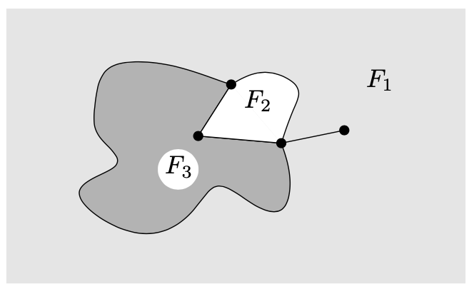

（我们说一个集合 $ A \\subseteq R^{2} $是连通的如果对任意两个点 $ x, y \\in A $存在一个弧线 $ \\alpha \\in A $，x、y为端点。“连通“是一个拓扑记号的例子 ）这些区域将被称为被考虑的拓扑planar图形的面。这些区域扩展到无穷，比如上图中的 $ F_ {1} $，被称为绘制的外部面（或无边界面），且所有其他面被称为内部面（或有边界面）

让我们强调面被定义为一个给定的planar绘制。面通常不被定义为一个nonplanar绘制，且我们将不谈论一个planar图形的面没有特定的绘制

绘制在其他表面。一个图形也能被绘制在非平面的其他表面上。让我们列出一些有趣表面的例子

每个人都知道球形（例如，一个球的表面）。一个tire-tube的表面被称为环面

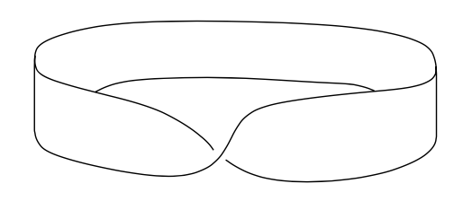

如果我们把长纸条的一条边反转180度，再跟另一条边粘上，我们获得一个有趣的表面称为莫比乌斯环

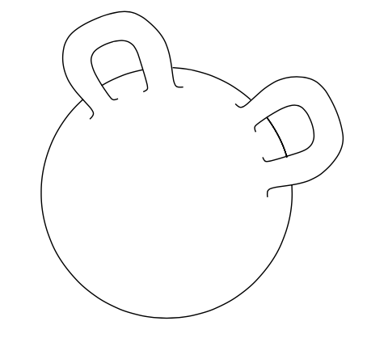

另一个例子是一个球形带两个柄

经过适当的变形，有这样的表面被称为Klein bottle

每个这样的表面可通过planar多边形通过粘贴和适当的变形创建。上述这些例子中，除了带两个柄的球，我们总是可从一个planar矩形开始，用适当的方式粘某些边。

有个一般性的理论说任何闭合表面（没有边界点且不会走到无穷远；一个学术上的术语是“一个没有边界的紧2维流形“）可通过一个规则的凸多边形经过适当的粘贴和变形创造。更多地，如果结果表面是两个边（注意莫比乌斯环和Klein bottle只有一边）则它可继续变形为一个带有限多个柄的球形。该理论的基础和一些相关话题被Stillwell在本书中做了漂亮地解释

图形可根据它们能被绘制的表面被分类。如下节我们将展示的，$ K_ {5} $，5个点的完全图，$ K_ {3, 3} $，3 + 3边的完全两分图，都是planar。但 $ K_ {5} $可在环面上绘制，例如

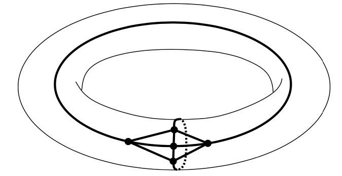

$ K_ {3,3} $可在莫比乌斯环上绘制：

**命题** 任意图形在球形上可画出带有效多个柄且没有交叉的边

（这个命题是非形式化的，因为我们没有给出精确的球形带柄的定义）

非形式化证明：让我们画一个图形G = (V, E)在球上，可能有交叉边。设 $ e_ {1}, e_ {2}, \\ldots, e_ {n} $为所有与另一个边有交叉的边。对每条边 $ e_ {i} $，添加一个柄像一座桥避开其他边，这种办法柄不会相交且画在柄上的边不会与其他边交叉：

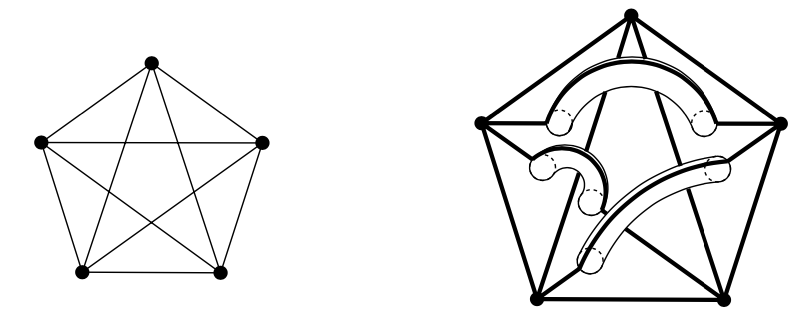

**定义** 添加到球面上最小的柄数使得图形G可被绘制在表面上没有交叉边被称为图形G的gennus

planar图形的genus为0，这非常明显如果我们使用stereography映射。我们把3维空间上的球放在它能触碰平面 $ \\rho $的地方。设o记为球上映射到 $ \\rho $最远处的点（北极）：

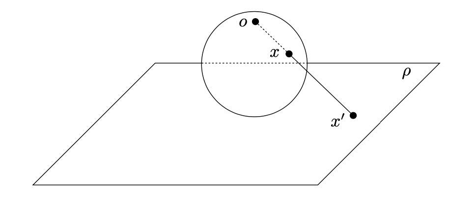

则stereographic映射映射球上每个 $ x \\neq o $的点到平面上的一个点 $ x'，x' $是ox线与平面 $ \\rho $的交点。（对点o，映射没有定义）这定义一个在平面和球的双射，o点除外。给定一个在球上图形G的没有交叉边的绘制，点o不在绘制的弧线上（我们可假设一个适合的o点的选择），stereographic映射做出一个planar的图形G的绘制。相反，通过反向的映射，从一个planar绘制我们得到一个球上的绘制

# Cycles in planar graphs

我们将调研planar图形的各种组合属性。planar图形的记号本身可跟纯组合意义相当，不使用平面的拓扑属性或图形绘制的意图

planar图形的地理定义将被转换为一个组合定义，我们使用平面连接属性到组合。这样的一个属性被表达为下面的Jordan curve定理。首先，一个定义：一个Jordan curve是一个闭合的不自相交的curve。更形式化地，一个Jordan curve被定义为一个端点相接的弧线，例如，一个区间[0, 1]的连续图形在一个映射f下是一对一的，除了f(0) = f(1)

**Jordan curve定理** 任意Jordan curve k分割平面为两个相连的部分，k的内部和外部，k是内部和外部的边界（内部和外部被称为k的regions）这意味着如果我们定义一个关系 $ \\approx $在 $ R^{2} \\ k $集合上通过设置 $ x \\approx y $当且仅当x和y可被跟k不相交的一个弧线连接，则 $ \\approx $是2个类型的一个相当，一个为有界集合另一个为无界集合

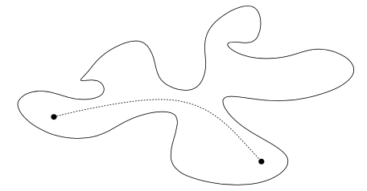

这个理论直观上是明显的，但它的证明不简单，虽然最近Thomassen找到了重要的简化。对平面的一些Jordan curve，描述非常明显，但对其他的它就不那么明显了（尝试找到一个弧线连接点 $ \\circ $到 $ \\bullet $且不与curve相交）：

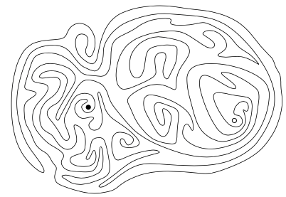

为了阐明直观不总是依赖这样的明显的叙述，让我们提及一个相关的定理。一个Jordan curve的扩展，Jordan-Schonflies定理，告诉我们对任意Jordan curve，内部可被持续变形为圆的内部。更精确地说，存在一个连续映射其反向映射也是连续的，称为同胚，在被任何Jordan curve和普通的圆盘之间包裹的闭合区域。相似地，有人期望如果我们定义一个拓扑球形通过连续单射作为通常地理球形的像，这样的东西将范定一个区域其可连续变形到一个普通的球上。但这是不行的 - 有一个反例被称为Alexander's horned sphere

让我们标记解决Jordan curve理论的困难主要源于弧线的一般化。我们承认一个任意的连续单射映射一个单元间隔的弧线。一个更简单的方法构建planar图形逻辑精确的理论是只允许弧线包含有限个直线段 - 让我们称它们为polygonal弧线。我们可这样称一个图形polygonally planar如果它能在没有使用polygonal弧线相交的情况下被绘制。用polygonal弧线证明Jordan curve定理是容易的。且它不难验证任意planar图形也是polygonal planar的。

**命题** $ K_ {5} $不是planar的

证明：设 $ b_ {1}, b_ {2}, b_ {3}, b_ {4}, b_ {5} $为在某些planar绘制中对应 $ K_ {5} $的边的点。连接点 $ b_ {i}, b_ {j} $的弧线记为 $ \\alpha(i, j) $

因为 $ b_ {1}, b_ {2}, b_ {3} $为图 $ K_ {5} $中圆的边，弧线 $ \\alpha(1, 2), \\alpha(2, 3), \\alpha(3, 1) $形成Jordan curve k，且因此点 $ b_ {4}, b_ {5} $要么都在k内部要么都在k外部，否则 $ \\alpha(4, 5) $将和k有交叉。首先假设 $ b_ {4} $在k内部，如下图所示：

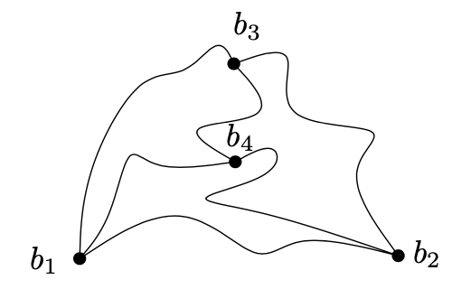

则 $ b_ {5} $在弧线 $ \\alpha(1, 4), \\alpha(2, 4), \\alpha(1, 2) $ 或 $ \\alpha(2, 3), \\alpha(3, 4), \\alpha(2, 4) $ 或 $ \\alpha(1, 3), \\alpha(3, 4), \\alpha(1, 4) $所在的Jordan curve中，如果 $ b_ {4}, b_ {5} $在k的外部，情况类似

**2-connected图形上的面和环** 如果 $ e_ {1}, \\ldots, e_ {n} $为一个拓扑planar图形G上的环，则弧线 $ \\alpha(e_ {1}), \\ldots, \\alpha(e_ {n}) $形成一个Jordan curve。通过Jordan curve定理，我们知道G的每个面要么在Jordan curve的内部要么在外部。简单来说，让我们称该Jordan curve为G的一个环（这样G的一个环意味着要么是一个图形理论上的意义，例如，G的一个子图，或在某些G的绘制中的Jordan curve对应的G的一个图形理论上的环）

对某些拓扑planar图形，每个面要么在G的环的内部要么在外部。但它不总是这样。例如，一个树的planar绘制只有一个面。另一个例子如下：

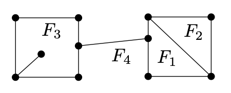

它证明坏的例子为不是2-connected图形

**命题** 设G为2点连接planar图形。则G的任意planar绘制的每个面是G的某个环的区域

证明：如果图形G是一个三角形，描述服从Jordan curve定理

设G = (V, E)为至少4个点的联通拓扑planar图形。通过命题4.6.5，要么存在边 $ e \\in E $ 使得图形 $ G' = G - e $ 是2连通的，否则有一个2连通图形 $ G' = (V', E') $和一条边 $ e \\in E' $使得 $ G = G' % e $，其中%%记为边分割操作

因为G是一个拓扑planar图形，$ G' $也是一个拓扑planar图形。因为$ G' $是2连通的，我们可使用归纳假设。拓扑图形 $ G' $的每个面是某个G'的环的一个区域。

让我们考虑第一个case，$ G' = G - e, e = \\{v, v' \\} $。点v和 $ v' $通过弧线 $ \\alpha(e) $连接对于边e，且因此它们都位于 $ G' $的一个面F的边界上。设 $ k_ {F} $为面F的环边界。如下图所示，弧线 $ \\alpha(e) $分割F为两个新面 $ F'和F'' $：

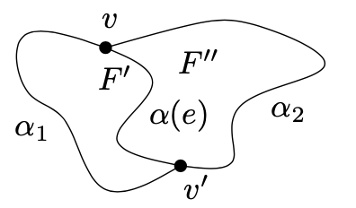

面 $ F', F'' $为环$ \\alpha_ {1} \\cup \\alpha(e) \\text{ 和 } \\alpha_ {2} \\cup \\alpha(e) $的区域，其中 $ \\alpha_ {1}, \\alpha_ {2} $为连接 $ v, v' $的两个弧线且一起形成环 $ k_ {F} $。因此G的面为环所包围。这使得 $ G = G' + e $

剩下的第二种case更容易：如果 $ G = G' %% e $且 $ G' $的每个面是 $ G' $的某个环的区域，则G有相同的属性，如下从边分割定义可得

命题6.2.3显示一个2连通planar图形，比任意其他planar图形更漂亮。但对证明定理或设计planar图形的算法，通常建议先处理3连通planar图形，然后尝试通过分解给定图形为3连通来处理一般情况

**planar图形的组合特征** 让我们标签如下：一个图形G是planar的当且仅当G的每个子分割是planar的。该属性用作planar图形的组合特征 - 一个图形理论里的特征标记

## Kuratowski’s theorem

一个图形G是planar的如果它没有子图形与 $ K_ {3,3} \\text{或} K_ {5} $的子分割同构

定理容易证明（如果G是planar的则它不能包含一个非planar图形的子分割），但反过来证明较难，我们将不再本书提及

这个定理显示任意非planar图形可通过找到 $ K_ {3,3} \\text{或} K_ {t} $的子分割确定。从计算的观点视角，例如，如果我们想要通过计算机测试图形planar且可能找到一个planar绘制，这个方法不是非常高效。算法知道测试是否一个给定的图形包含一个固定图形的子分割，但这些算法非常复杂且不实际。对planar测试和找到好的planar绘制，一些快速（虽然也复杂）的方法被发明。这些方法可以，例如，在O(n)时间复杂度内测试一个n个顶点的给定图形的planar性质。考虑好的绘制，例如，任何n个顶点的planar图形可被这样的方式绘制，顶点有1到n之间的整数坐标，且边为直线段。

# Euler’s formula

对planar图形存在唯一一个基本数量公式。所有其他的结果某种程度上都会使用这个公式。同时，这是最老的公式。它为1752年被欧拉发现

## 命题（欧拉公式）

设G = (V, E)为一个连通planar图形，且设f为G的某些绘制的面的数量，则我们有

$ \\begin{equation} \| V \| - \| E \| + f = 2 \\end{equation} $

特别地，面的数量不依赖于特殊的绘制

证明：我们使用归纳法，如果 $ E = \\emptyset $ 则 $ \| V \| = 1 $ 且f = 1，且公式成立。所以设 $ \| E \| \\ge 1 $，我们区分两种情况：

1.  图形G不包含循环。则G是一棵树且因此 $ \| V \| = \| E \| + 1 $；同时我们有f = 1因为树的planar绘制只有一个面
2.  一些边 $ e \\in E $包含一个循环。在这种情况下图形 G - e 是连通的。因此通过归纳假设，欧拉公式成立（我们考虑从给定的绘制G中移除e的绘制）。根据Jordan curve定理，在考虑的G的绘制中边e邻接两个不同的面F和 $ F' $。这些面在删除e之后变成一个面。因此通过添加e的绘制面和边的数量增加1，且边的数量不变；因此欧拉公式对G也是成立的

**应用程序：柏拉图固体** 极客学校的思考者们用柏拉图的名字来标注高规范几何固体的特殊意义，被称为规范多面体。一个规范多面体是一个3维有限面的凸体。所有的面应该是相同形状和大小的规则凸多边形，且每个顶点相邻相同数目的面。对这些固体的兴趣在于它们良好的性质。只有5种规则多面体：四个面的三角体、立方体、规范八面体、规范十二面体、规范二十面体

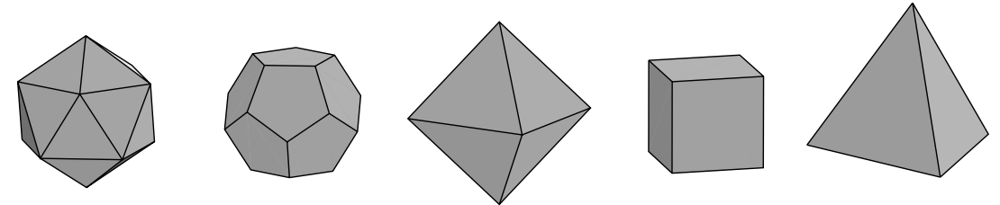

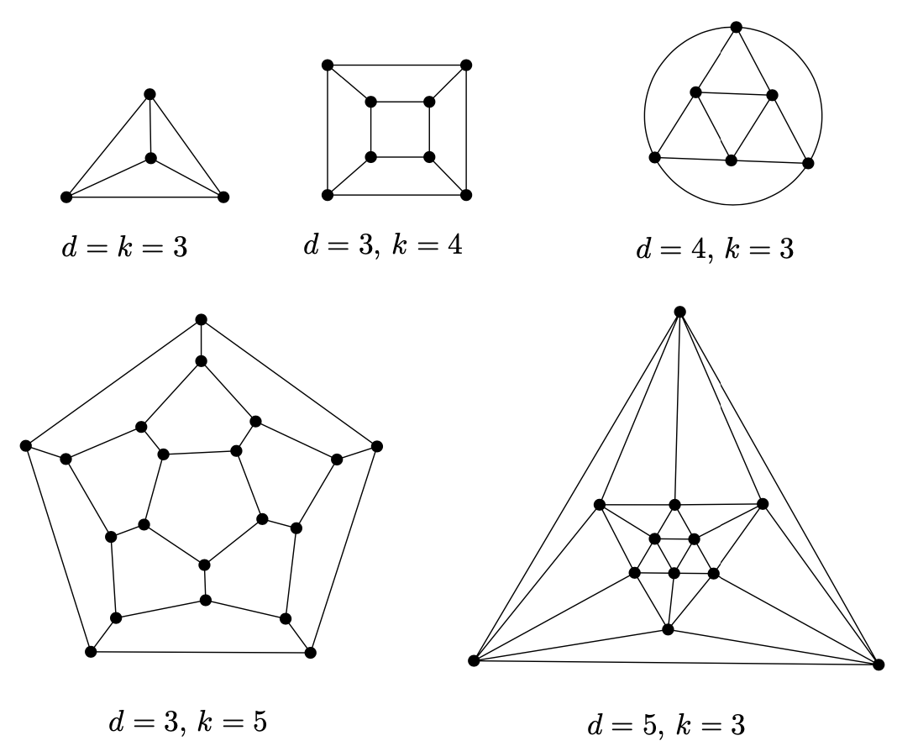

古代希腊人已知道这个事实。让我们标记如果我们放开条件一点点（我们不坚持凸性，或我们允许两种面，等），或如果我们在更高维度，我们可看到更有趣且漂亮的几何形状。这方面的研究依然很活跃

使用欧拉公式，我们将显示除了5个柏拉图多面体没有其他规范多面体存在。该证明的第一步是转换一个凸多面体为一个planar图形。我们把考虑的多面体放在一个球面上，这样球的中心在多面体的里面。然后我们映射多面体到球面。这使得在球面上的图形绘制没有交叉边，这样的一个绘制可被变形为二维映射里的planar绘制。多面体的点、边和面变成planar绘制的点、边和面

对规则多面体，拓扑planar绘制的结果使每个点有相同的度d（ $ d \\ge 3 $），且每个面有相同数量的点（ $ k \\ge 3 $）

## 命题

设G为一个拓扑planar图形，每个点有d度且每个面邻接k个点，$ d \\ge 3, k \\ge 3 $。则G跟上图中的一个同构

证明：让我们记图形G = (V, E)的顶点数为n，边数为m，面数为f。首先我们使用等式 $ \\sum_ {v \\in V}deg_ {G}(v) = 2 \| E \| $，则

$ \\begin{equation} dn = 2m \\end{equation} $

相似地我们获得等式

$ \\begin{equation} 2m = kf \\end{equation} $

接下来，我们用m来表达n和f，并带入欧拉公式：

$ \\begin{equation} 2 = n - m + f = \\frac{2m}{d} - m + \\frac{2m}{k} \\end{equation} $

化简得：

$ \\begin{equation} \\frac{1}{d} + \\frac{1}{k} = \\frac{1}{2} + \\frac{1}{m} \\end{equation} $

因min(d, k) = 3，或 $ \\frac{1}{d} + \\frac{1}{k} \\le \\frac{1}{2} $，对d = 3我们有 $ \\frac{1}{k} - \\frac{1}{6} = \\frac{1}{m} > 0 $，且因此 $ k \\in \\{3, 4, 5\\} $。相似地，对k = 3我们有 $ d \\in \\{3, 4 , 5\\} $。因此如下的可能之一必须发生：

<table border="2" cellspacing="0" cellpadding="6" rules="groups" frame="hsides">

<colgroup>
<col  class="org-right" />

<col  class="org-right" />

<col  class="org-right" />

<col  class="org-right" />

<col  class="org-right" />
</colgroup>
<thead>
<tr>
<th scope="col" class="org-right">d</th>
<th scope="col" class="org-right">k</th>
<th scope="col" class="org-right">n</th>
<th scope="col" class="org-right">m</th>
<th scope="col" class="org-right">f</th>
</tr>
</thead>

<tbody>
<tr>
<td class="org-right">3</td>
<td class="org-right">3</td>
<td class="org-right">4</td>
<td class="org-right">6</td>
<td class="org-right">4</td>
</tr>

<tr>
<td class="org-right">3</td>
<td class="org-right">4</td>
<td class="org-right">8</td>
<td class="org-right">12</td>
<td class="org-right">6</td>
</tr>

<tr>
<td class="org-right">3</td>
<td class="org-right">5</td>
<td class="org-right">20</td>
<td class="org-right">30</td>
<td class="org-right">12</td>
</tr>

<tr>
<td class="org-right">4</td>
<td class="org-right">3</td>
<td class="org-right">6</td>
<td class="org-right">12</td>
<td class="org-right">8</td>
</tr>

<tr>
<td class="org-right">5</td>
<td class="org-right">3</td>
<td class="org-right">12</td>
<td class="org-right">30</td>
<td class="org-right">20</td>
</tr>
</tbody>
</table>

现在我们容易检查这些情况跟上图的对应性

让我们标记planar图形和3维凸多面体之间的联系比想象中的跟紧密

## 命题（Planar图形有O(n)条边）

(i) 设G = (V, E)为至少3个顶点的planar图形。则 $ \| E \| \\le 3 \| V \| - 6 $。当任意最大planar图形时等式成立；即一个planar图形添加任意新的边（保持相同的顶点集合）能使它为非planar

(ii) 考虑planar图形不包含三角形（例如，子图形 $ K_ {3} $）且有至少3个顶点，则 $ \| E \| \\le 2 \| V \| - 4 $

证明(i)：如果图形G不是最大planar我们保持添加边直到它变成最大planar。因此(i)将被证明当我们显示 $ \| E \| = 3 \| V \| - 6 $为真对任意至少3个顶点的最大planar图形

首先，我们显示至少3个顶点的最大planar图形的每个面（包含外部的面）是三角形，例如，他的边界是3的循环

如果G是不连接的，我们可清晰地用新的边连接两个不同的部分。如果G是连接的但不是2-连通，它有一些顶点v，其删除会不连接G，创建部件 $ V_ {1}, V_ {2}, \\ldots, V_ {k}, k \\ge 2 $（注意我们使用G有至少3个顶点的假设）。选择两条边e和 $ e' $连接v到两个不同的部分$ V_ {i}, V_ {j} $使得e和 $ e' $互相绘制。它们的端点可被新边 $ \\bar{e} $连通而不丢失planar性质：

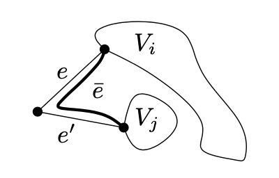

因此一个至少3个顶点的最大planar图形是2-连通的，每个面边界是图形的一个环。相反地，假设某些面F包含 $ t \\ge 4 $个顶点 $ v_ {1}, \\ldots, v_ {t} $的边界环。如果顶点 $ v_ {1} $不连接顶点 $ v_ {3} $，则我们可在面F中绘制边 $ \\{v_ {1}, v_ {3} \\} $，且因此 $ \\{v_ {2}, v_ {4} \\} $不能是边，否则 $ \\{v_ {1}, v_ {3} \\} $ 和 $ \\{v_ {2}, v_ {4} \\} $会相交。因此，我们可安全地在面F中绘制边 $ \\{ v_ {2}, v_ {4} \\} $

这样，一个最大planar图形的每个面是一个三角形。等式 $ 3f = 2 \| E \| $，f是面的数量。从欧拉公式的f我们得到：

$ \\begin{equation} \| V \| - \| E \| + \\frac{2}{3} \| E \| = 2 \\end{equation} $

因此有 $ \| E \| = 3 \| V \| - 6 $，(i)得证

证明(ii)：在必要情况下添加了一些边以后，我们可假设我们的图形是最大边三角planar图形，意味着通过增加任意新边我们创建了一个三角或使图形非planar（或两者都是）。我们可再假设图形是连通的

如果G不是2连通的则它有一个顶点v，删除后分割G为部分 $ V_ {1}, \\ldots, V_ {k}, k \\ge 2 $。我们可添加一些边在不同的部分使G仍然是planar的，但对一些边我们引入一个三角（当我们连接的两个顶点都相邻v时），这样我们得更小心处理。如果每个部分 $ V_ {i} $包含一个顶点则G是一个树且公式成立。让我们假设 $ \| V_ {1} \| \\ge 2 $，且考虑一个面F有 $ V_ {1} $的一个顶点和其他 $ V_ {i} $的一个顶点在边界上，如下图所示：

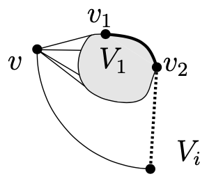

部分 $ V_ {1} $必须有至少一条边，$ \\{v_ {1}, v_ {2} \\} $在边界F上，因为G没有三角，它不可能 $ v_ {1} $ 和 $ v_ {2} $跟v相邻。因此 $ v_ {1} $ 和 $ v_ {2} $可被连接到 $ V_ {i} $的一个顶点在F上而不创建三角

因此，我们可假设G是2连通的。在这种情况下，每个面是G上一个环。每个这样的面有长度至少4，且我们得到 $ 2 \| E \| \\ge 4f $。使用欧拉公式我们最终得到 $ \| E \| \\le 2 \| V \| - 4 $

**一个典型的错误证明** 假设我们想要证明任意顶点 $ n \\ge 3 $的拓扑planar图形使得每个面有3个边的边界有3n-6个边。一些学生有时给出如下类型的错误答案。我们用归纳法，对n = 3我们有一个3个顶点3条边的简单三角形。接着，让我们假设对n个顶点的任意拓扑planar图形G该描述成立，对任意这样的图形，我们在某个面中添加一个顶点且连接它与该面的3个顶点如下：

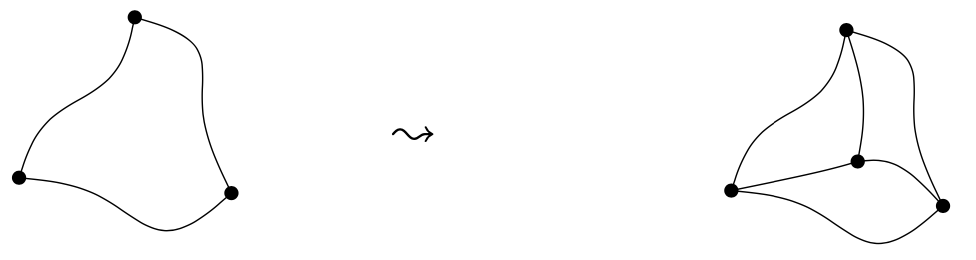

这使得 $ G' $有n + 1个顶点。G的边数按归纳假设为3n - 6条边，且我们新添加了3条边。因此 $ G' $有3(n + 1) - 6条边且描述对n + 1个顶点也成立。然而，该问题是不是所有可能的n + 1个顶点的拓扑planar图形 $ G' $有三角面可使某些G按上述进行操作。例如，八面体的顶点度数为4，然而任意从更小的图形通过上述操作产生的图形至少有一个顶点度数为3

(i)有一个重要且经常应用的结论，每个planar图形有一些顶点度数最多为5。(ii)确保一个没有三角形的planar图形包含一个顶点度数不超过3

(i)也显示了 $ K_ {5} $不是planar的，因为它有10条边，然而一个5个顶点的plannar图形最多有9条边。(ii)意味着 $ K_ {3, 3} $不是planar的，因为一个6个顶点的无三角形的图形最多有8条边

## 命题

设G = (V, E)为至少3个顶点的2连通planar图形。设 $ n_ {i} $为度数为i的顶点个数，设 $ f_ {i} $为i长度循环边界的面的个数。则我们有

$ \\begin{equation} \\sum_ {i \\ge 1} (6 - i) n_ {i} = 12 + 2 \\sum_ {j \\ge 3} (j - 3) f_ {j} \\end{equation} $

或

$ \\begin{equation} 5n_ {1} + 4n_ {2} + 3n_ {3} + 2n_ {4} + n_ {5} - n_ {7} - 2n_ {8} - \\cdots = 12 + 2f_ {4} + 4f_ {5} + 6f_ {6} + cdots \\end{equation} $

因此 $ 5n_ {1} + 4n_ {2} + 3n_ {3} + 2n_ {4} + n_ {5} \\ge 12 $，且至少3个顶点的每个planar图形包含至少3个度数不超过5的顶点

证明：因 $ \| V \| = \\sum_ {i}n_ {i}, f = \\sum_ {i} f_ {i} $，通过带入欧拉公式，我们有

$ \\begin{equation} 2 \| E \| = 2(\| V \| + f - 2) = \\sum_ {i}2n_ {i} + \\sum_ {j}2f_ {j} - 4 \\end{equation} $

通过之前证明中的双重统计我们进一步获得：$ \\sum_ {i}in_ {i} = 2 \| E \| = \\sum_ {j}jf_ {j} $。带入上面的公式得：

$ \\begin{equation} \\sum_ {j}(j - 2)f_ {j} + 4 = \\sum_ {i} 2n_ {i} \\qquad \\qquad \\qquad \\sum_ {j}2f_ {j} = \\sum_ {i}(i - 2)n_ {i} + 4 \\end{equation} $

我们把第一个等式乘以2并减去第2个等式得

$ \\begin{equation} \\sum_ {i} (6 - i) n_ {i} - 4 = 2 \\sum_ {j} (j - 3)f_ {j} + 8 \\end{equation} $

即得证

# 颜色地图：四色问题

## 定义（图形的颜色数）

设G = (V, E)为一个图形，设k为一个自然数。一个映射 $ c: V \\to \\{1, 2, \\ldots, k \\} $被称为一个图形的颜色如果 $ c(x) \\ne c(y) $对每条边 $ \\{x, y \\} \\in E $。G的颜色数，记为 $ \\chi(G) $为最小的k使得存在一个颜色c: $ V(G) \\to \\{1,2,\\ldots, k\\} $

图形的颜色数属于最重要的组合记号。然而，本书我们仅在本节提及它

数学上，一个地图可看作为一个planar图形的绘制。图的州为图形的面，图形的顶点为在3个或更多州上的点，图的边为顶点在边界上的部分：

注意图形中的多个边可对应一个地图

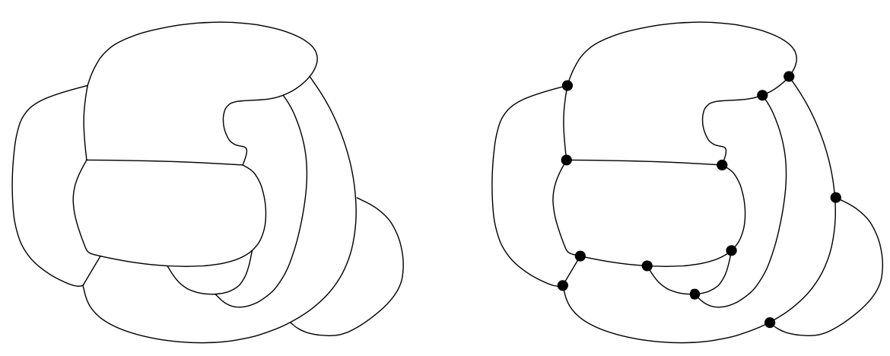

为了转换地图颜色问题（例如，拓扑planar图形面的颜色）为上述定义的图形点颜色问题，我们引入双图的记号。想象我们标记地图中每个州的首府城市为一个点，每两个相邻的州的首府被位于这两个州领土上的高速公路连接且穿过它们共同的边界。双图的顶点为首府且边为高速公路

为形式化定义双图，我们需要多条边和循环，这样使我们回忆一个可能的方法引入它们。一个带多条边和循环的图形可被表达为一个三元组$ (V, E, \\epsilon) $，V和E为不相交集且 $ \\epsilon: E \\to { V \\choose 2 } \\cup V $是一个映射每条边的两个端点到每个循环它的单端点。现在我们可给定双图的一个数学定义：

## 定义（双图）

设G为一个拓扑planar图形，例如一个planar图形(V, E)及一个固定的planar绘制。设 $ \\mathcal{F} $记为G的面的集合。我们定义一个图形，可能有循环和多条边，为 $ (\\mathcal{F}, E, \\epsilon) $，$ \\epsilon $被定义为 $ \\epsilon(e) = \\{ F_ {i}, F_ {j} \\} $，边e是面 $ F_ {i}, F_ {j} $的公共边界（我们也允许 $ F_ {i} = F_ {j} $，当相同的面在给定边的两边）。这个图形 $ (\\mathcal{F}, E, \\epsilon) $被称为（地理上）G的双，被记为 $ G^{ * } $

一个例子：

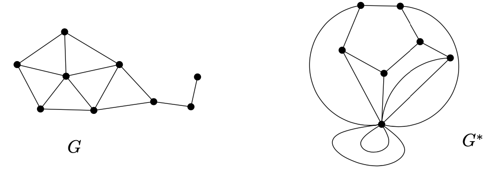

双图 $ G^{ * } $可跟图形G的绘制绘制在一起，如我们之前所示的首府和高速公路的非形式化解释。我们选择一个点 $ b_ {F} $在G的每个面F里，对G的每条边e我们绘制一个弧线交叉e和连接点 $ b_ {F}, b_ {F'} $，F和 $ F' $是邻接边e的面。该弧线完全在面F和 $ F' $里。这样，我们获得一个 $ G^{ * } $的planar绘制：

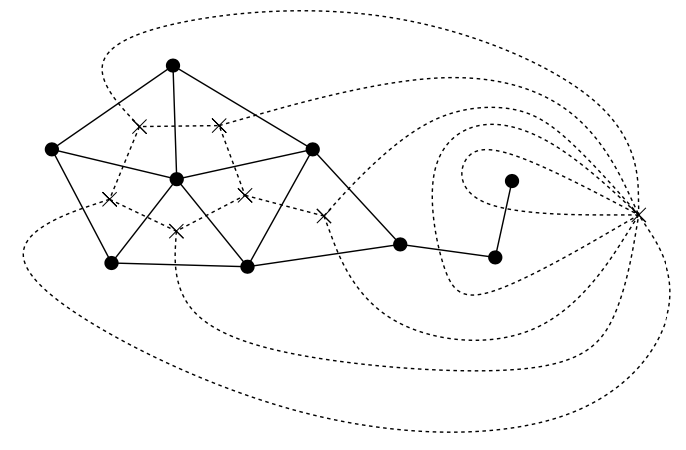

考虑一个planar地图，该图的k颜色着色相当于双图 $ G^{ * } $的边的k颜色着色

另一方面，任意planar图形可通过适合的双图的子图来获得。我们只通过一个图片显示证明：例如，下图

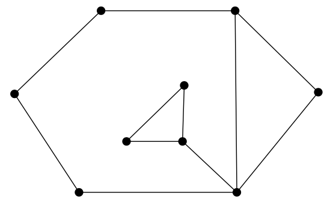

包含在双图中：

（对应的，我们可讨论任意拓扑planar图形跟它的双图同构）因此地图着色问题可形式化为planar图形的着色问题。特别地，我们可用另一种方法描述为

## 问题（四色问题）

$ \\chi(G) \\le 4 $对每个planar图形G成立吗？

我们提供一个更弱的结果：
