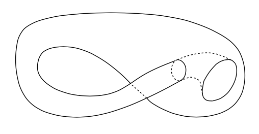
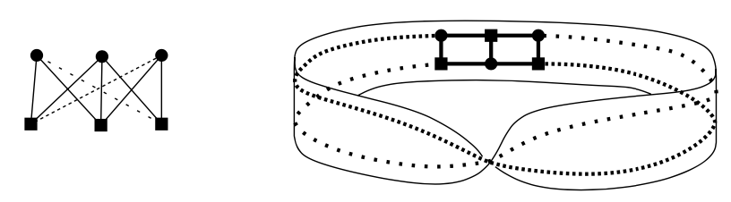

<head>
    
    
</head>

# Table of Contents

1.  [Drawing in the plane and on other surfaces](#org251e123)
    1.  [定义](#org88e35f4)
        1.  [图形绘制的面](#org6a8af02)
2.  [Cycles in planar graphs](#orgf58d474)

# Drawing in the plane and on other surfaces

如你所见，本书中多数图形为一个图像（而不是点和边的列表）。但我们已学习图形的属性跟它们的画法无关，且绘画纯是辅助。在本章中分析主题为图形绘制本身且我们将主要关注能在平面上被绘画测的图形且边不会相交。这样的图形被称为planar

从前一章的非形式化定义中，读者可能获得了非常好的直观关于什么是图形绘制。这样的直观通常是高效的如果我们想要显示某些图形是planar的 - 我们可简单绘制一个无交叉边图形的适合的图片。然而，如果我们想要以严格地逻辑证明，某些图形不是planar的，在没有绘制符号的数学定义时我们没法证明。如今的数学完全构建于少数原始的记号和集合理论公理上 - 或至少多数数学家尝试确定是这样。例如，平面的记号被模型为Cartesian乘积R x R。每个实数被定义为有理数的cartesian子集，有理数从自然数创建，且最终自然数被定义为从空集产生的某种特殊集合（这在数学中很少看到，但如果你看一些数学基础书籍你可以找到它）

为了形式化地引入绘制符号，我们先定义一个弧形：一个平面上 $ \\alpha $的子集形如：$ \\alpha = \\gamma([0, 1]) = \\{ \\gamma(x): x \\in [0, 1] \\} $，且 $ \\gamma: [0, 1] \\to R^{2} $是一个闭合区间[0, 1]到平面的连续单射。点 $ \\gamma(0) $和 $ \\gamma(1) $被称为弧形 $ \\alpha $的端点

这个定义，跟绘制的直观符号非常接近。间隔[0, 1]可被认为一个时间段，期间我们绘制了一个线段从点 $ \\gamma(0) $到点 $ \\gamma(1) $。然后 $ \\gamma(t) $是在时刻t铅笔所在的位置。映射 $ \\gamma $的连续性意味着在纸的表面上的连续运动，且单射表示绘制的线段没有相交

## 定义

一个图形G = (V, E)的绘制我们指一个如下赋值：对G中每个顶点v，赋值一个平面上的点b(v)，对每条边 $ e = \\{v, v'\\} \\in E $，赋值一个平面上端点b(v)到端点 $ b(v') $的弧线 $ \\alpha(e) $。我们假设映射b是单射（不同的顶点赋值给平面上不同的点），且没有形式为b(v)的点在任意弧线上除了弧线端点。一个图形及某些绘制被称为一个拓扑图形

一个图形G的绘制，其任意两个弧线对应不同的边要么没有相交要么只共享端点被称为一个planar绘制。一个图形G是planar的如果它有至少一个planar绘制

我们以给出以上一个图形绘制的形式化定义，为了阐述一个绘制的记号可被包含在数学逻辑构建中。我们将不继续以严格的逻辑构建planar图形的子序列理论。我们会使用planar曲线的记号和结果。这些属于数学分支称为拓扑。只有非常少的拓扑知识在基础数学课程中出现，我们不得不引入非常复杂的机制来使事情严谨。更多地，某些直观明显的陈述的证明非常困难。因此，我们将有时依赖读者的直觉，我们将要求读者相信某些没有证明的陈述。严谨的陈述可以找到，例如，在最近的Mohar和Thomassen的书中。幸运地是，在图形绘制理论中，基本的绘制直觉很少导致被曲解

一个planar绘制是图形可视化的高级形式（在非planar绘制中边交叉对顶点可能是错误的），在某些应用程序中其绘制有一个物理意义，边交叉是不可接受的（例如，单层集成电路的设计）

### 图形绘制的面

设G = (V, E)为一个拓扑planar图形，例如，一个planar图形及一个给定的planar绘制。考虑在平面上不在绘制弧线的所有点的集合。该集合包含有限多个连接区域（想象我们沿着绘制的边剪切）:

（我们说一个集合 $ A \\subseteq R^{2} $是连通的如果对任意两个点 $ x, y \\in A $存在一个弧线 $ \\alpha \\in A $，x、y为端点。“连通“是一个拓扑记号的例子 ）这些区域将被称为被考虑的拓扑planar图形的面。这些区域扩展到无穷，比如上图中的 $ F_ {1} $，被称为绘制的外部面（或无边界面），且所有其他面被称为内部面（或有边界面）

让我们强调面被定义为一个给定的planar绘制。面通常不被定义为一个nonplanar绘制，且我们将不谈论一个planar图形的面没有特定的绘制

绘制在其他表面。一个图形也能被绘制在非平面的其他表面上。让我们列出一些有趣表面的例子

每个人都知道球形（例如，一个球的表面）。一个tire-tube的表面被称为环面

如果我们把长纸条的一条边反转180度，再跟另一条边粘上，我们获得一个有趣的表面称为莫比乌斯环

另一个例子是一个球形带两个柄

经过适当的变形，有这样的表面被称为Klein bottle

每个这样的表面可通过planar多边形通过粘贴和适当的变形创建。上述这些例子中，除了带两个柄的球，我们总是可从一个planar矩形开始，用适当的方式粘某些边。

有个一般性的理论说任何闭合表面（没有边界点且不会走到无穷远；一个学术上的术语是“一个没有边界的紧2维流形“）可通过一个规则的凸多边形经过适当的粘贴和变形创造。更多地，如果结果表面是两个边（注意莫比乌斯环和Klein bottle只有一边）则它可继续变形为一个带有限多个柄的球形。该理论的基础和一些相关话题被Stillwell在本书中做了漂亮地解释

图形可根据它们能被绘制的表面被分类。如下节我们将展示的，$ K_ {5} $，5个点的完全图，$ K_ {3, 3} $，3 + 3边的完全两分图，都是planar。但 $ K_ {5} $可在环面上绘制，例如

$ K_ {3,3} $可在莫比乌斯环上绘制：

**命题** 任意图形在球形上可画出带有效多个柄且没有交叉的边

（这个命题是非形式化的，因为我们没有给出精确的球形带柄的定义）

非形式化证明：让我们画一个图形G = (V, E)在球上，可能有交叉边。设 $ e_ {1}, e_ {2}, \\ldots, e_ {n} $为所有与另一个边有交叉的边。对每条边 $ e_ {i} $，添加一个柄像一座桥避开其他边，这种办法柄不会相交且画在柄上的边不会与其他边交叉：

**定义** 添加到球面上最小的柄数使得图形G可被绘制在表面上没有交叉边被称为图形G的gennus

planar图形的genus为0，这非常明显如果我们使用stereography映射。我们把3维空间上的球放在它能触碰平面 $ \\rho $的地方。设o记为球上映射到 $ \\rho $最远处的点（北极）：

则stereographic映射映射球上每个 $ x \\neq o $的点到平面上的一个点 $ x'，x' $是ox线与平面 $ \\rho $的交点。（对点o，映射没有定义）这定义一个在平面和球的双射，o点除外。给定一个在球上图形G的没有交叉边的绘制，点o不在绘制的弧线上（我们可假设一个适合的o点的选择），stereographic映射做出一个planar的图形G的绘制。相反，通过反向的映射，从一个planar绘制我们得到一个球上的绘制

# Cycles in planar graphs

我们将调研planar图形的各种组合属性。planar图形的记号本身可跟纯组合意义相当，不使用平面的拓扑属性或图形绘制的意图

planar图形的地理定义将被转换为一个组合定义，我们使用平面连接属性到组合。这样的一个属性被表达为下面的Jordan curve定理。首先，一个定义：一个Jordan curve是一个闭合的不自相交的curve。更形式化地，一个Jordan curve被定义为一个端点相接的弧线，例如，一个区间[0, 1]的连续图形在一个映射f下是一对一的，除了f(0) = f(1)

**Jordan curve定理** 任意Jordan curve k分割平面为两个相连的部分，k的内部和外部，k是内部和外部的边界（内部和外部被称为k的regions）这意味着如果我们定义一个关系 $ \\approx $在 $ R^{2} \\ k $集合上通过设置 $ x \\approx y $当且仅当x和y可被跟k不相交的一个弧线连接，则 $ \\approx $是2个类型的一个相当，一个为有界集合另一个为无界集合

这个理论直观上是明显的，但它的证明不简单，虽然最近Thomassen找到了重要的简化。对平面的一些Jordan curve，描述非常明显，但对其他的它就不那么明显了（尝试找到一个弧线连接点 $ \\circ $到 $ \\bullet $且不与curve相交）：

为了阐明直观不总是依赖这样的明显的叙述，让我们提及一个相关的定理。一个Jordan curve的扩展，Jordan-Schonflies定理，告诉我们对任意Jordan curve，内部可被持续变形为圆的内部。更精确地说，存在一个连续映射其反向映射也是连续的，称为同胚，在被任何Jordan curve和普通的圆盘之间包裹的闭合区域。相似地，有人期望如果我们定义一个拓扑球形通过连续单射作为通常地理球形的像，这样的东西将范定一个区域其可连续变形到一个普通的球上。但这是不行的 - 有一个反例被称为Alexander's horned sphere

让我们标记解决Jordan curve理论的困难主要源于弧线的一般化。我们承认一个任意的连续单射映射一个单元间隔的弧线。一个更简单的方法构建planar图形逻辑精确的理论是只允许弧线包含有限个直线段 - 让我们称它们为polygonal弧线。我们可这样称一个图形polygonally planar如果它能在没有使用polygonal弧线相交的情况下被绘制。用polygonal弧线证明Jordan curve定理是容易的。且它不难验证任意planar图形也是polygonal planar的。

**命题** $ K_ {5} $不是planar的

证明：设 $ b_ {1}, b_ {2}, b_ {3}, b_ {4}, b_ {5} $为在某些planar绘制中对应 $ K_ {5} $的边的点。连接点 $ b_ {i}, b_ {j} $的弧线记为 $ \\alpha(i, j) $

因为 $ b_ {1}, b_ {2}, b_ {3} $为图 $ K_ {5} $中圆的边，弧线 $ \\alpha(1, 2), \\alpha(2, 3), \\alpha(3, 1) $形成Jordan curve k，且因此点 $ b_ {4}, b_ {5} $要么都在k内部要么都在k外部，否则 $ \\alpha(4, 5) $将和k有交叉。首先假设 $ b_ {4} $在k内部，如下图所示：

则 $ b_ {5} $在弧线 $ \\alpha(1, 4), \\alpha(2, 4), \\alpha(1, 2) $ 或 $ \\alpha(2, 3), \\alpha(3, 4), \\alpha(2, 4) $ 或 $ \\alpha(1, 3), \\alpha(3, 4), \\alpha(1, 4) $所在的Jordan curve中，如果 $ b_ {4}, b_ {5} $在k的外部，情况类似

**2-connected图形上的面和环** 如果 $ e_ {1}, \\ldots, e_ {n} $为一个拓扑planar图形G上的环，则弧线 $ \\alpha(e_ {1}), \\ldots, \\alpha(e_ {n}) $形成一个Jordan curve。通过Jordan curve定理，我们知道G的每个面要么在Jordan curve的内部要么在外部。简单来说，让我们称该Jordan curve为G的一个环（这样G的一个环意味着要么是一个图形理论上的意义，例如，G的一个子图，或在某些G的绘制中的Jordan curve对应的G的一个图形理论上的环）

对某些拓扑planar图形，每个面要么在G的环的内部要么在外部。但它不总是这样。例如，一个树的planar绘制只有一个面。另一个例子如下：

它证明坏的例子为不是2-connected图形
