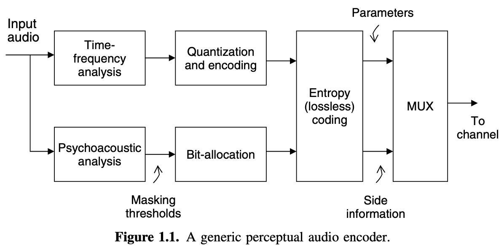

<head>
    
    
</head>

# Table of Contents

1.  [introduction](#orge40d976)
    1.  [A GENERAL PERCEPTUAL AUDIO CODING ARCHITECTURE](#orgd523d77)
    2.  [AUDIO CODER ATTRIBUTES](#orge5620e3)
        1.  [音频质量](#orgc325fd7)
        2.  [比特率](#org8305c97)
        3.  [复杂度](#org91db739)
        4.  [编解码延迟](#orgdd03b0d)
        5.  [错误稳定](#orgb31e5d2)
    3.  [音频编码类型 - 概要](#org2675877)
    4.  [本书组织](#org2ab12fa)

# introduction

## A GENERAL PERCEPTUAL AUDIO CODING ARCHITECTURE

最近几年，研究员提议了几种有效的信号模型（例如，基于传输的，subband-filter结构，wavelet-packet）和复现高质量数字音频的压缩标准。多数这些算法基于一般的结构如下：

-   单传输
-   常量时间采样，统一/非统一bandpass过滤
-   变时（信号自适应）采样，统一/非统一bandpass过滤
-   调和/正弦分析器
-   源系统分析（LPC和多脉激发）
-   以上的混合版本

时间频率分析方法的选择总是包含时间和频率解决方案要求的一个基本折中。探测扰动控制通过声音心理学信号分析章节基于心理学原理估计信号掩码动力。心理学声学模型转发掩码阙值测量在时间频率平面每个点的最大扰动数值使得时间频率参数的测量不会引入可听见的一些错误。心理学声学模型因此允许测量阶段开发可发觉的无关事项。该阶段也可开发统计冗余通过经典的技术比如DPCM或ADPCM。一旦一个测量紧参数集形成，剩下的冗余通常通过无杂音run-length(RL)和熵编码技术删除，例如，Huffman，算术或Lempel-Ziv-Welch (LZW)。因为心理学声学扰动控制模型的输出是依赖信号的，多数算法为可变速度。固定频道速度要求通常通过缓存反馈方案满足，经常会引入编码延迟

## AUDIO CODER ATTRIBUTES

感知音频代码典型地基于如下属性评估：音频重生质量，操作比特率，计算复杂度，编解码延迟和频道错误稳定性。目标是用低比特率（<32 kb/s）达到高质量音频输出，及可接受的算法延迟（~5到20ms），且低计算复杂度（每秒~1到10百万指令或MIPS）

### 音频质量

音频质量是设计一个音频编码算法最重要的因素。从简单近通透感知编码的发展中已取得成功地跨越。典型地，信号保真的经典客观度量比如信号噪音比（SNR）和总调和扰动（THD）为非普世的。感知音频编码领域很快成熟且创造了听力测试地更多需求，因此存在在感知度量方案上对应地兴趣增长。一些主观和客观的质量度量被提出且在最近几十年中标准化。这些方案中的一些包括噪声掩码比（NMR）感知音频质量度量（PAQM），感知评估（PERCEVAL）和客观音频信号评估（OASE）

### 比特率

从编解码设计者的视角观点看，一个关键挑战是用最小的比特数呈现高保真音频。例如，如果一个5毫秒音频帧采样率为48kHz（每帧240采样数）使用80比特呈现，则编码率为80比特/5ms = 26 kb/s。低比特率意味着高压缩率和一般的低重生质量。早期编码比如ISO/IEC MPEG-1 (32-448 kb/s)，杜比AC-3(32-384 kb/s)，索尼ATRAC(256 kb/s)和飞利浦PASC(192 kb/s)使用高比特率获得通透的音频重生。然而，一些复杂音频编码工具的发展（比如，MPEG-4音频工具）创造了以8到32 kb/s高效传输或存储音频。将来音频编码算法承诺以低比特率提供可靠质量，扩展使比特率和质量匹配需求比如时间变化频道容量

### 复杂度

减少计算复杂度不仅是实时实现的需要也减少能量消耗和扩大电池使用时长。计算复杂度通常用每秒百万指令数（MIPS）衡量。复杂度估计跟处理器相关。例如，杜比AC-3解码器的复杂度在Zoran ZR38001通用DSP核上是大约27MIPS；而摩托罗拉DSP56002处理器，复杂度大约45MIPS。通常，多数音频编解码依赖非对称编码原理。这意味着编解码复杂度在编码器和解码器之间是不同的（典型地，复杂度编码器占80%，解码器20%），减少解码器复杂度更重要

### 编解码延迟

许多对高保真音频（流音频，按需音频）的网络应用程序有延迟容忍（最大为100-200ms），提供时机为利用长时间信号属性来获得高编码收益。然而，在双实时通讯和VoIP应用程序中，低延迟编码（10-20ms）是很重要的。考虑之前描述的例子，例如，一个音频编码操作48kHz采样频率的5ms的帧。在理想的编码场景中，编码器最小延迟需要5ms，解码器需要5ms（相同帧长度）。然而，其他因素比如综合分析过滤窗口、前向、比特保留池和频道延迟会导致额外的延迟。使用更短的综合分析窗口，避免前向和重构建比特保留池可使得低延迟编码，但会降低编码效率

### 错误稳定

包交换和无线网络音频流的增长流行比如因特网意味着这些应用程序的任何算法必须能够处理一个有噪音的时间变化频道。特别地，错误稳定和错误保护的提供必须在编码器兼容，为了达到在容易错误的频道上电子音频的可靠传输。一个简单的想法为提供错误敏感和优先级比特的更好的保护。例如，音频帧头需要最大错误稳定；否则，头部的传输错误将严重损害整个音频帧。一些错误检测/纠正代码在使用中。包括字节流的错误纠正代码将帮助获得输入音频的无措重生，然而，将增加复杂度和比特率

从前面章节的讨论中，明显看到在设计对特殊应用程序的算法时一些妥协必须考虑。因此，音频代码标准包含一些工具支持扩展算法的设计。例如，MPEG-4提供工具设计算法满足不同的比特率、延迟、复杂度和稳定性需求

## 音频编码类型 - 概要

基于信号模型或综合分析技术应用于编码音频信号，音频编码器可被分类为：

-   线性预测
-   转换
-   Subband
-   正弦曲线

算法也可基于有损或无损音频编码分类。有损音频编码方案通过感知相关信息达到压缩效果，一些例子包括ISO/IEC MPEG编解码系列、杜比AC-3和DTS CA。在无损音频编码中，音频数据只是挤压来获得原始比特表示。MLP和DSD技术形成一类高无损压缩算法，分别使用在DVD音频和SACD存储格式中。无损音频编码技术，一般为高速高真高质量数字音频。例如，感知音频编码使压缩比例从10:1到25:1，然而无损音频编码可获得压缩比例从2:1到4:1

## 本书组织

在第2章，我们复习音频编解码的基本信号处理概念，在第3章提供介绍材料对波形量化和熵编码方案。在这章中的一些关键话题涵盖扩散量化、统一/非统一量化、脉冲编码调制（PCM）、微分PCM（DPCM）、适配DPCM（ADPCM）、向量量化（VQ）、比特配置技术和熵编码方案（Huffman, Rice和算术）

第4章提供在窄带和宽带编码中线性预测和它的应用程序信息。首先，我们处理在语音应用程序中LP分析/综合处理的工具。接下来，我们描述开发循环分析综合LP和闭合循环分析综合LP技术

在第5章，描述心理声学原理。Johnson的可探测熵记号表述为音频透明压缩的基本限制的度量。ISO/IEC 11172-3 MPEG-1心理声学分析模型1被用来描述在全局掩码阙值计算中的五个关键步骤。第6章探讨过滤边设计问题和算法，及特别强调在修改离散余弦转换（MDCT）广泛用于一些探测音频编码算法。第6章也处理预先人工回音和控制策略

第7、8、9章复习FM和CD质量音频信号透明编码的确定和合并技术，包括一些变成国际标准的算法。转换编码方法在第7章描述，子带编码算法在第8章处理，第9章描述正弦算法。对于基于统一宽带过滤边方法，第8章涵盖利用离散波浪转换（DWT)的方法、离散波浪包转换（DWPT），和其他非统一过滤边。混合算法的例子使用多个信号模型将贯穿第7、8、9章
