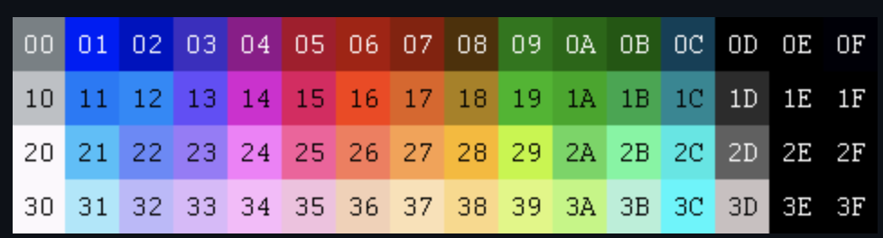
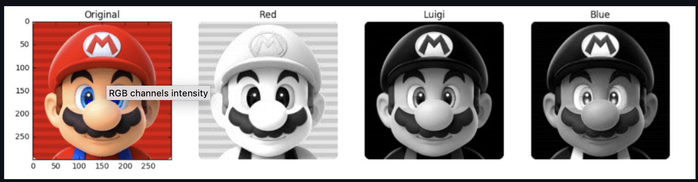
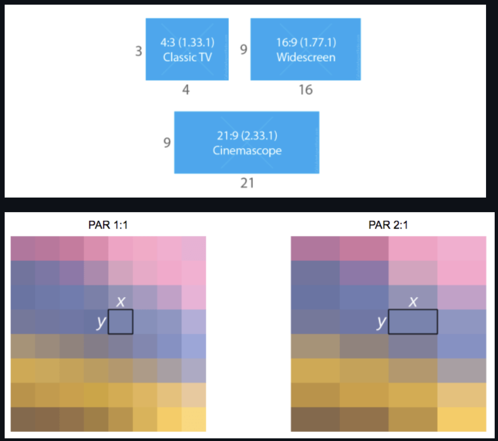
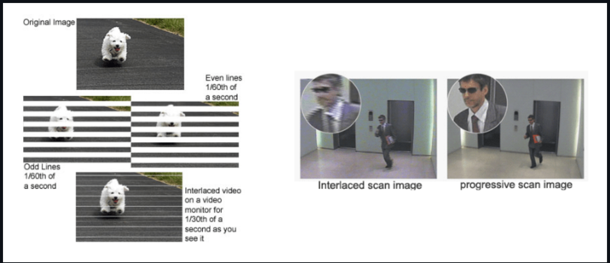

<head>
    
    
</head>

# Table of Contents

1.  [Algorithm](#org4d179f3)
2.  [Review](#orgf42d996)
    1.  [基本术语](#orgad1809b)
        1.  [编码图片的其他方法](#org0b9e842)
3.  [Tips](#orgc599c34)
4.  [Share](#orgb25525f)

# Algorithm

Leetcode 363: Max Sum of Rectangle No Larger Than K

<https://dreamume.medium.com/leetcode-363-max-sum-of-rectangle-no-larger-than-k-940e21bd9413>

# Review

digital video introduction

<https://github.com/leandromoreira/digital_video_introduction#intro>

## 基本术语

一个图片可被认为是一个2维矩阵。如果我们考虑颜色，我们可把图像作为一个3维矩阵，增加的维度用来提供颜色数据

如果我们选择通过主颜色（红、绿、蓝）呈现这些颜色，我们定义3个标准：红、绿、蓝

我们称矩阵中每个点为一个像素（图片元素）。一个像素代表一个给定颜色的性质。例如，一个红色像素表示绿为0、蓝为0、红为最大值。粉红色像素可为这三种颜色的组合。使用数值范围从0到255，粉红像素定义为红为255，绿为192和蓝为203

### 编码图片的其他方法

许多其他可能的模型用来呈现构建图片的颜色。我们可以，例如，使用一个索引颜色盘，我们只需要单个字节代表每个像素而不是RGB模型中需要3个。在这样的模型中，我们使用一个2D矩阵而不是3D矩阵来呈现我们的颜色，这将节省内存但只有更少的颜色选项

例如，看如下的图片，第一个为全彩色，其他的为灰色调子下的红、绿、蓝

我们可看到红色更多（第二个面容中最亮的部分），相比蓝色只在Mario的眼睛（最后一个面容）和衣服部分上

且每个颜色质量需要某些比特，该数量称为位深。让我们说我们对每颜色使用8位比特（接收值从0到255），因此我们有一个24比特位深

图片的另一个属性是清晰度，即一个维度上像素的数量。通常呈现为宽x高，例如4x4

另一个图片或视频的属性是高宽比，描述图片或像素宽和高的比例

当人们说这个电影或图片是16x9他们通常指显示高宽比（DAR），然而我们也有不同形状的像素，我们称为像素高宽比（PAR）

DVD是DAR 4:3，虽然DVD真实清晰度是704x480，它仍然保持4:3比例因为它有PAR 10:11（704x10 / 480x11）

最后，我们可定义一个视频为时间内连续的n帧，n是帧率或每秒帧数(FPS)

显示一个视频需要的每秒比特币数为它的比特率

比特率 = 宽 \* 高 \* 位深 \* 每秒帧数

例如，一个30帧每秒的视频，每像素24比特，480x240的清晰度将需要每秒82,944,000比特或82.944Mbps (30x480x240x24)，如果我们不采用任何压缩的话

当比特率为常数它被称为常量比特率（CBR）但它变化的话则称为可变比特率（VBR）

在早期，工程师使用一种视频显示的双检测帧率技术而不消耗额外的带宽。该技术被称为交错视频；它发送屏幕的一半到一帧，另一半在接下来的一帧

现在屏幕呈现多数使用进度扫描技术，这是一种显示、存储或传输移动图片，使每帧的所有行顺序绘制

# Tips

-   在想做的事情很多时，自然会感到时间的紧迫，进而提高效率，充分利用时间及碎片时间
-   进入一个新领域，如果快速学习实践和理论需要合理地分配时间并有效利用网络资源

# Share

Scalability for Dummies - Part 3: Cache

<https://www.lecloud.net/post/9246290032/scalability-for-dummies-part-3-cache>

在第2部分之后，你现在有了一个可扩展数据库解决方案。你不在害怕存储兆字节数据。但你的用户还是不得不遭遇慢的页面请求当从数据库获取大量数据时。这个解决方案可用缓存实现

对于缓存我总是指内存中的缓存比如Memcached或Redis。请不要做基于文件的缓存，它将使你的服务器复制和自动扩展变成一个阵痛

对内存中的缓存，一个缓存是一个简单的键值存储和它将在你的应用程序和你的数据存储之间的一个缓存层。当你的应用程序需要读数据时它应该先尝试从你的缓存中获取。一旦缓存中没有，它才尝试从主要的数据源中获取数据。为什么要这么做？因为一个缓存是非常快的。它持有内存中每个数据集且请求处理非常快。例如，当Redis布置在一台标准服务器上时可以每秒做成百上千次读操作。增量写也非常快。

有两种缓存数据的范型：

1.  缓存数据库请求
    
    这仍是大多数情况下使用的范型。当你做一个数据库请求时，你存储结果数据集到缓存。你的请求的哈希版本作为缓存的键。下一次查询时，你首先检查在缓存中是否已存在。该范型有几个问题。主要的问题是过期。它很难去删除一个缓存结果当你缓存一个复制的查询。当数据改变你需要删除所有被影响的缓存查询

2.  缓存对象
    
    这是我强烈推荐且我更喜欢这种范型。一般来说，看到你的数据为一个对象如同在你的代码中一样（类、实例等）。让你的类为数据库中的一个数据集且存储该类实例或数据集在缓存中。例如，一个类称为Product，有一个属性为data。它是一个数组包含价格、文字、图片和用户查看你的产品的次数。属性data在类中被几个方法用数据库请求来填充。现在，做如下操作：当你的类完成数据数组的组装，直接存储数据数组，或更好地是在缓存中完成类的实例。这允许你简单地脱离对象当一些被改变且使你的代码的操作更快且更有逻辑

最好的部分：它使异步处理成为可能！想象一个工作者服务器队伍组装你的对象！应用程序消费最新的缓存对象且不再接触数据库！

缓存对象的一些想法：

-   用户session（不使用数据库）
-   完整呈现博客文章
-   活动流
-   用户 <-> 朋友关系

我非常喜欢缓存，这容易理解，非常简单地实现且能获得很好的结果。一般来说，我更喜欢Redis而不是Memcached，因为我喜欢Redis额外的数据库特征比如持久化和内建的数据结构比如链表和集合。用Redis和一个聪明的键可能使你完全脱离数据库。但如果你只是需要缓存，用Memcached
