<head>
    
    
</head>

# Table of Contents

1.  [Algorithm](#org9890338)
2.  [Review](#orgb874c60)
    1.  [Redundancy removal](#orga58eaf5)
        1.  [颜色、亮度和我们的眼睛](#orgc913566)
3.  [Tips](#orgcb64a58)
4.  [Share](#org2401d34)
    1.  [第一种](#orgbc72147)
    2.  [第二种](#org81db141)

# Algorithm

Leetcode 365: <https://leetcode.com/problems/water-and-jug-problem/>

<https://dreamume.medium.com/leetcode-365-water-and-jug-problem-69735194a596>

# Review

digital video introduction

<https://github.com/leandromoreira/digital_video_introduction#intro>

## Redundancy removal

我们学习到不使用任何压缩的视频是不灵活的；一个720p清晰度30fps的一小时视频需要278GB。因为使用无损数据压缩算法比如DEFLATE（使用PKZIP、Gzip、PNG），不会有效减少需要的带宽我们需要找到其他压缩视频的方法

1280 \* 720 \* 24 \* 30 \* 3600 = 278GB

我们可利用视觉原理。我们更关注亮度而不是颜色，在重复的时间中，一个视频包含大量变动很小的图像，每帧包含许多相同或相似颜色的区域

### 颜色、亮度和我们的眼睛

我们的眼睛相比颜色，对亮度更敏感，看下图:

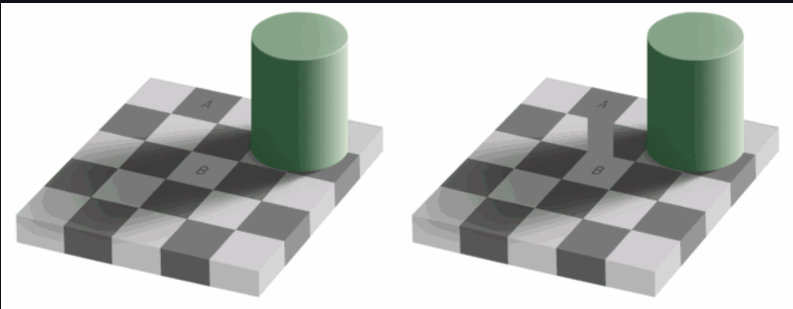

如果你不能看到左图中A和B方块中颜色是一样的，这是正常的，我们的大脑更关注亮暗而不是颜色

简单的解释我们的眼睛的工作原理，我们的眼睛是一个复杂的器官，它由许多部分组成但我们最感兴趣是圆锥和棒状细胞。眼睛包含大约1.2亿个棒状细胞和6千万个圆锥细胞

为简化，让我们尝试说明颜色和亮度在眼睛里的部分功能。棒形细胞主要负责亮度而圆锥细胞负责颜色，有三种圆锥细胞，每种负责不同的颜色，为：S-cones（蓝色），M-cones（绿色）和L-cones（红色）

因为我们有更多的棒状细胞，所以我们更能够区分亮度

**对比敏感函数**

实验心理学和许多其他领域的研究在人类视觉上发展了很多理论。其中之一被成为对比敏感函数。即对给定的初始光呈现的值和光的比例和时间相关，需要多少光的变化使得观察者能报告有变化。注意函数这个单词，这是我们能用不仅仅黑白色及其他颜色度量对比敏感函数的原因。这些实验的结果显示在多数情况下我们的眼睛对亮度比颜色敏感

一旦我们知道我们对亮度更敏感，我们就可以利用这一点

1.  颜色模型

    我们首先学习如何使用RGB模型来标记图像颜色，但也有其他模型。事实上，有一个模型隔离亮度和颜色，被称为YCbCr
    
    颜色模型使用Y代表亮度和两个颜色频道Cb（蓝色）和Cr（红色）。YCbCr源于RGB且它也可被转换为RGB。使用该模型我们可创建全色图像如下：
    
    

2.  YCbCr和RGB的转换

    一些人可能有争议，我们如何不使用绿色产生所有的颜色？
    
    为回答该问题，我们将了解RGB到YCbCr的转换。我们将使用ITU-R组推荐的标准BT.601所使用的系数。第一步是计算颜色，我们将使用ITU建议的常量替代RGB值
    
    Y = 0.299R + 0.587G + 0.114B
    
    一旦我们有了颜色，我们可分割颜色：
    
        Cb = 0.564(B - Y)
        Cr = 0.713(R - y)
    
    且我们可反向转换且使用YCbCr获得绿色值
    
        R = Y + 1.402Cr
        B = Y + 1.772Cb
        G = Y - 0.344Cb - 0.714Cr
    
    一般来说，显示（显示器、TV、屏幕等）只使用RGB模型，但组织方式不同，一些放大显示如下：
    
    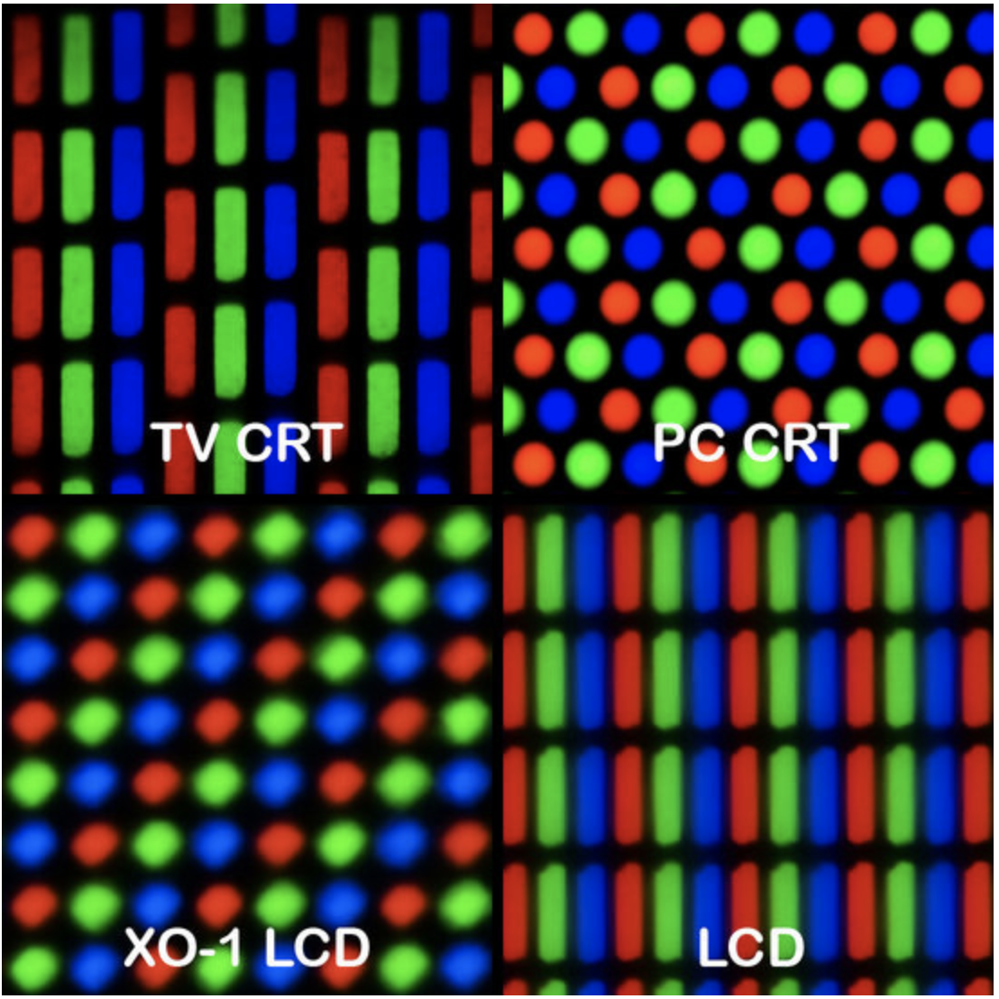

3.  颜色子采样

    当图像呈现为亮度和颜色分量，我们可利用人类视觉系统对亮度更敏感的特点来选择性的移除信息
    
    颜色子采样是使用更少的颜色清晰度来编码图像的技术
    
    颜色清晰度应该减少多少呢？证明已有一些方案描述如何处理清晰度且合并（最后颜色 = Y + Cb + Cr）
    
    这些方案被称为子采样系统且表达为3部分比例 - a:x:y，定义颜色清晰度为颜色像素的a x 2块
    
    -   a是水平采样（通常为4）
    -   x是在一个像素的第一行的颜色采样数（跟a相关的水平清晰度）
    -   y是在一个像素的第一行和第二行之间颜色采样变化的数目
    
    通常现代编解码的解决方案为4:4:4（无子采样），4:2:2，4:1:1，4:2:0，4:1:0和3:1:1
    
    **YCbCr 4:2:0合并**
    
    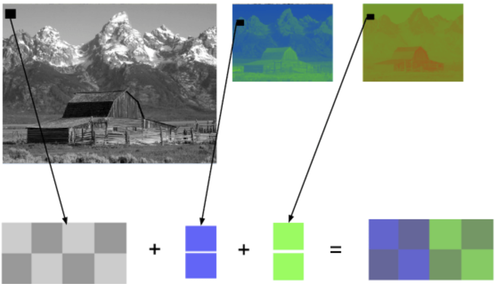
    
    上图是一个使用YCbCr 4:2:0 图像的合并片段，注意每个像素只使用12个比特
    
    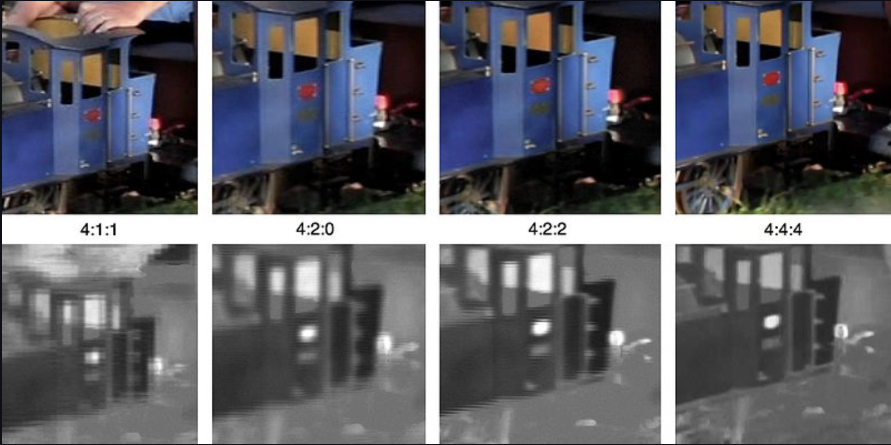
    
    可看到被各主颜色子采样的相同图片，第一行的图像为最终的YCbCr数据，最后一行为颜色清晰度。可看到丢失的信息很少
    
    前面我们计算了我们需要278GB来存储一个小时720p30帧的视频文件，如果我们使用YCbCr 4:2:0我们能砍到一半（139GB），但它依然离理想的情况差很多

4.  实践：检查YCbCr图表

    
    
    你可用ffmpeg检查YCbCr图表，可通过图表看出上图场景蓝色更明显

5.  关于Color、luma、luminance、gamma的视频

    <http://www.youtube.com/watch?v=Ymt47wXUDEU>

6.  实践：检查YCbCr对比度

    你可可视化一个视频给定行的Y对比度使用FFmpeg的[示波器过滤](https://ffmpeg.org/ffmpeg-filters.html#oscilloscope)
    
        ffplay -f lavfi -i 'testsrc2=size=1280x720:rate=30000/1001,format=yuv420p' -vf oscilloscope=x=0.5:y=200/720:s=1:c=1
    
    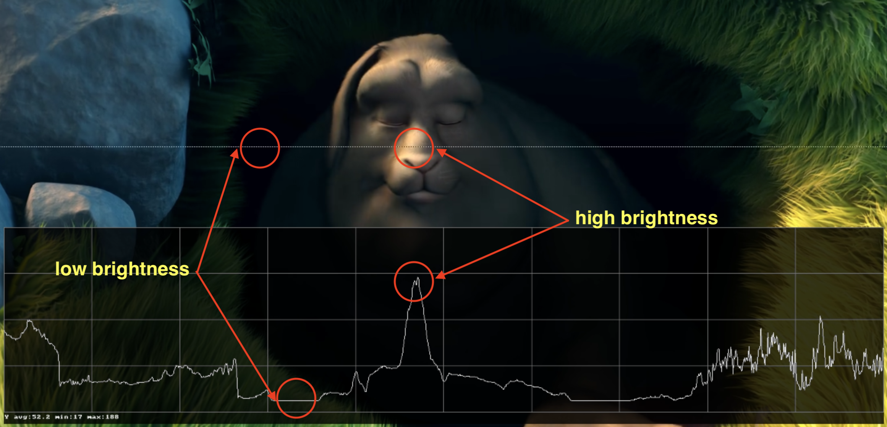

7.  帧类型

    
    
    
    
    
    假设我们有一个30fps的电影，这是它的头4帧
    
    我们可看到有很多重复，比如蓝色背景在这几帧中没有改变。为解决这个问题，我们可抽象分类为3种类型的帧
    
    **I帧（关键帧）**
    
    一个I帧是自包含的帧。它不依赖任何其他帧来呈现，一个I帧看上去像一个静态图片。第一帧通常是一个I帧但我们将看到I帧插入在其他类型帧之间
    
    **P帧（预测帧）**
    
    一个P帧利用当前的图片使用之前的帧呈现这一点。例如，在第二帧中，唯一的改变是球往前移动了一点，我们可通过不同和对之前帧的引用重构帧
    
    因为P帧使用更少的数据，为什么我们不能编码整个视频使用一个I帧和剩下都作为P帧？
    
    在我们编码该视频之后，开始观看并做一个查找，你将注意到它将花费一些时间移动到该位置。这是因为P帧需要一个引用帧（例如I帧）来呈现
    
    另一个快速测试你可编码一个视频使用一个I帧然后编码每2秒插入一个I帧并检查
    
    **B帧（双向预测）**
    
    引用之前和之后的帧来提供更好的压缩
    
    **总结**
    
    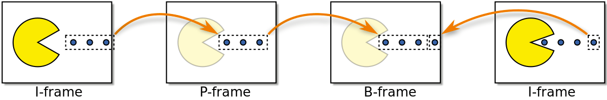
    
    这些帧类型用来提供更好的压缩。我们将在下节看到如何发生的，但现在我们可认为I帧为昂贵的而P帧好一点，但最好的是B帧

8.  时间冗余（内部预测）

    让我们探索选项我们减少时间上的重复，这类冗余可用内部预测技术解决
    
    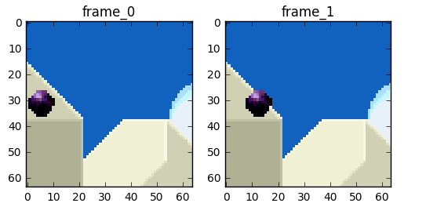
    
    我们将尝试花费更少的比特来编码帧0和1的序列
    
    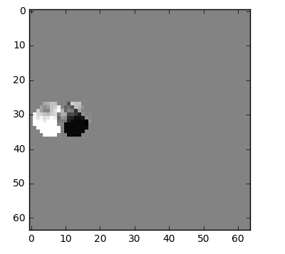
    
    我们可以做缩减，我们简单的从帧0减帧1且我们得到我们需要编码的剩余
    
    但如果告诉你有更好的办法使用更少的比特呢？首先，让我们把帧0作为很好定义的部分的集合且然后我们尝试匹配从帧0到帧1的块。我们可认为它是运动估计
    
    **块运动补偿**
    
    块运动补偿分割当前的帧为不覆盖的块，且运动补偿向量告诉这些块从哪来（一个常见的错误概念是之前的帧被分割为非覆盖的块，且运动补偿向量告诉这些块移动到哪）。源块典型地覆盖在源帧中。一些视频补偿算法用一些不同的之前传输的帧来组装当前的帧
    
    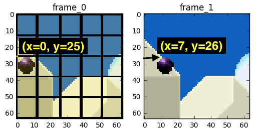
    
    我们可估计球从x=0, y=25移动到x=6, y=26，x和y值是运动向量。进一步步骤我们可保存比特只编码最后块位置和预测的运动向量的不同，这样最后的运动向量是x=6 (6-0), y=1 (26-25)
    
    在真实世界场景，该球可被切分为n部分但进程是一样的
    
    帧上的对象以3D方式移动，球可变得更小当它移动到背景。当我们不能找到完美的匹配对我们尝试查找匹配的块时这是正常的。这里有一个我们估计的视图 vs 真实的图片如下：
    
    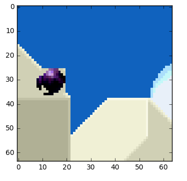
    
    但我们可看到当我们应用运动估计编码的数据比使用简单delta帧技术的要更小
    
    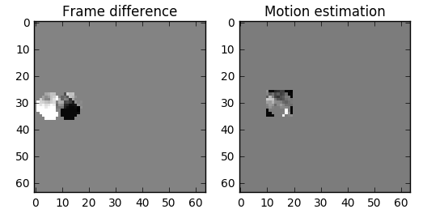
    
    **真实的运动补偿看着会如何**
    
    该技术被应用到所有的块，通常一个球会被分区为多个块
    
    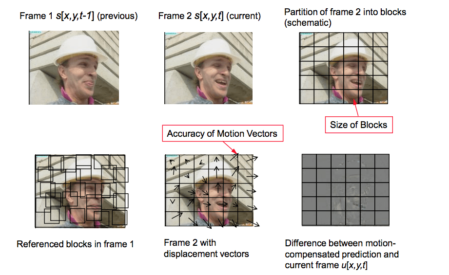
    
    你可用 [jupyter](https://github.com/leandromoreira/digital_video_introduction/blob/master/frame_difference_vs_motion_estimation_plus_residual.ipynb) 来练习这些概念
    
    我们可用 [ffmpeg内部预测（运动向量）](https://github.com/leandromoreira/digital_video_introduction/blob/master/encoding_pratical_examples.md#generate-debug-video) 产生一个视频
    
    
    
    或我们可使用 [Intel Video Pro Analyzer](https://software.intel.com/en-us/intel-video-pro-analyzer) （付费但有一个免费试用版限制使用头10个帧）
    
    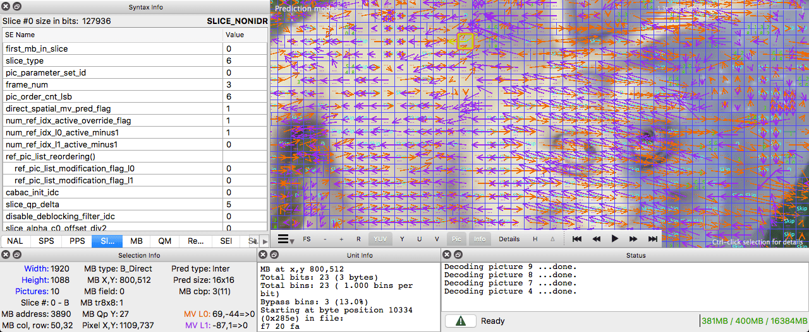

9.  空间冗余（intra预测）

    如果我们分析视频每一帧我们看到有许多区域是相关的
    
    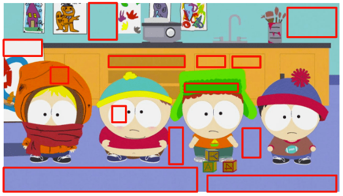
    
    让我们看一个例子。这个场景由蓝和白色组成
    
    
    
    这是一个I帧且我们不能使用之前的帧来预测但我们还能压缩它。我们将编码选择的红块。如果我们看它的邻居，我们可估计有一个趋势颜色围绕着它
    
    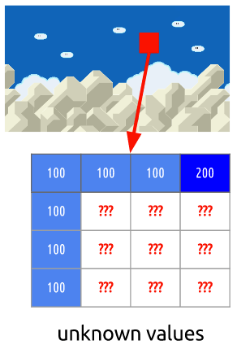
    
    我们将预测该帧将继续垂直扩展颜色，它意味着未知像素的颜色将保持它的邻居的颜色值
    
    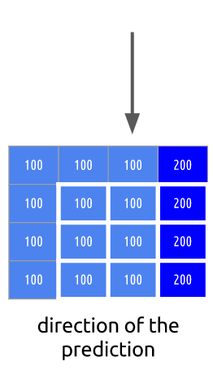
    
    我们的预测可能是错误的，因此我们需要应用技术（intra预测）且然后减去给定我们剩余块的真实值，导致比原来更压缩的矩阵
    
    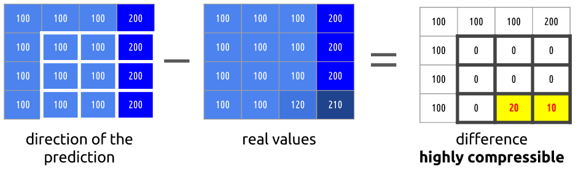
    
    **实践：检查intra预测**
    
    你可 [使用ffmpeg产生带宏块和它们的预测的视频](https://github.com/leandromoreira/digital_video_introduction/blob/master/encoding_pratical_examples.md#generate-debug-video)
    
    
    
    或使用Intel Video Pro Analyzer

# Tips

-   把学的东西能简单概要的讲出来，才能说明真学懂了，而且所讲的东西能体现你理解的程度

# Share

Scalability for Dummies - Part 4: Asynchronism

<https://www.lecloud.net/post/9699762917/scalability-for-dummies-part-4-asynchronism>

系列的第4部分开始于一个场景：想象你想要在你喜欢的面包店买面包。你进入面包店，要一块面包，但现在没有面包。你要求当你的面包订单好了后2小时内再来。这很让人恼火，是吧？

为避免这样请等一会的问题，需要异步。这样对面包店好，也同样对你的web服务或web app好

一般地，有两种异步范型

## 第一种

让我们用之前的面包店的场景继续说明。异步处理的第一部是“在晚上烤面包且在早上出售“。对应web应用程序这意味着做一些耗时且服务于完成的工作的事情在低请求时期

常见的这种范式用来转换动态内容为静态内容。网站的页面，可能用大量框架或CMS构建，在每次改变后预渲染和本地存储为静态HTML文件。通常这些计算任务在一个常规的基准上完成，可能是一个脚本被cronjob每小时调用。这种预计算产生的数据极大地改善网站和web app，使得它们容易扩展和高效。想象你的网站的扩张性如果脚本上传这些预渲染的HTML页面到AWS S3或Cloudfront或其他内容转发网络！你的网站将每小时快速响应和处理百万级的访问！

## 第二种

不幸地是，有些时候客户有特殊请求比如一个生日蛋糕带祝福语“Steve，生日快乐！“面包店不能预测这类客户的祝福，这样它必须在客户在面包店里时开始该任务并告诉他在明天回来。对web服务这意味着异步处理任务

一个典型的工作流：

一个用户来到你的网站且开始一个计算密集型任务，该任务可能将花费数分钟完成。这样你的网站前端发送一个工作给工作队列且立即通知给用户：你的工作在处理中，请继续浏览网页。工作队列让一些工作线程处理新的工作。如果有新的工作则工作线程处理并数分钟后发送信号说明已完成。前端检查该信号，收到后通知用户。这是一个非常简单的例子

如果你现在想要深入一些细节且做技术设计，我推荐你看RabbitMQ的前3个简要说明。RabbitMQ是帮助实现异步处理的系统之一。你也可以使用ActiveMQ或一个简单的Redis列表。基本的思想是有一个任务队列用来待处理。异步似乎比较复杂，但它值得你花时间学习它且亲自实现它。后端变得近乎无限扩展且前端让用户体验更有吸引力

如果你做一些耗时的事情，尝试异步去做
