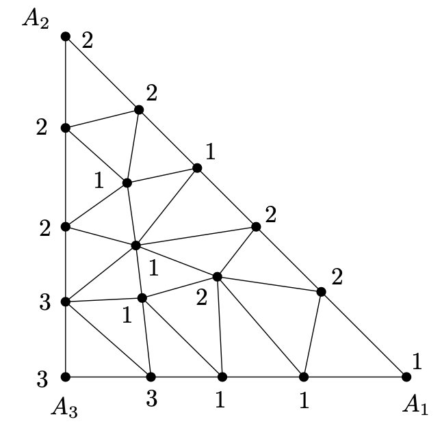
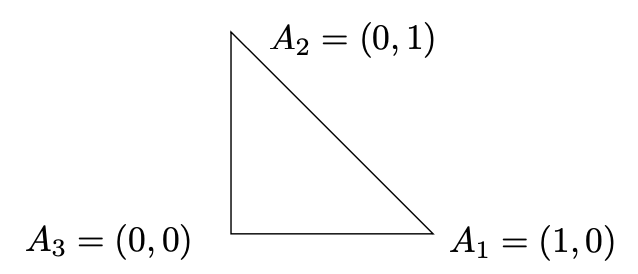
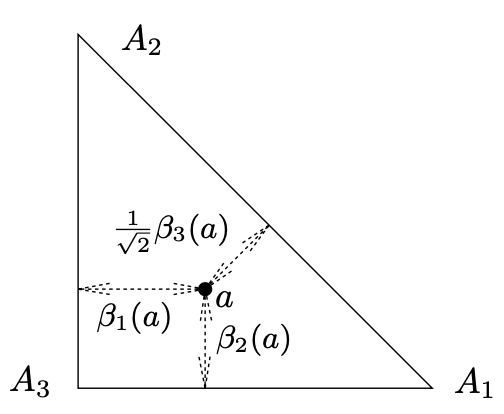
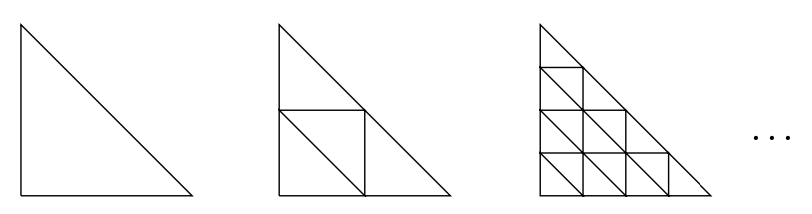
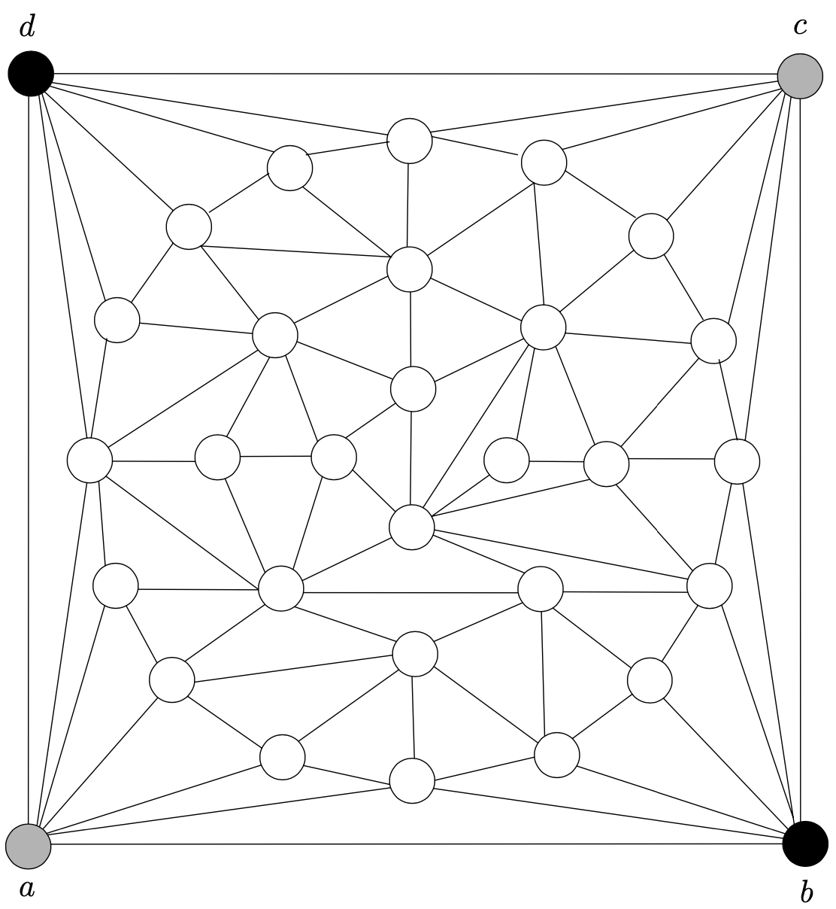

<head>
    
    
</head>

# Table of Contents

1.  [Parity arguments](#org5c64a74)
    1.  [命题（Sperner引理 - planar版本）](#org6779ace)
    2.  [命题（一维固定点定理）](#orgba6cb2d)
    3.  [定理（Planar Brouwer的固定点定理）](#org9b963ed)
    4.  [命题](#org1863832)

# Parity arguments

让我们画一个大三角形，顶点为 $ A_ {1}, A_ {2}, A_ {3} $。我们分割它为任意有限个小三角形，如下图：

其中每个三角形都不会在其他三角形的边的里面，这样如果我们考虑该结果图为一个planar图形的绘制，所有内部的面都是三角形。让我们给大三角形和小三角形的顶点标签为1、2、3，在如下规则中：给顶点 $ A_ {i} $一个标签i，i = 1,2,3，且所有在边 $ A_ {i} A_ {j} $上的大三角形的顶点只能给标签为i或j，其他的顶点则可任意赋值

## 命题（Sperner引理 - planar版本）

在如上的描述中，一个顶点被赋值为1、2、3的小三角形总是存在

**证明** 我们定义一个辅助图形G；如上图。它的顶点为我们三角度量的面，例如，所有小三角形加上外层的面。在图中，顶点被描述为对应面中的小黑三角形。外层的面的顶点被记为v。两个顶点，例如，原始图形的面，由G的一条边连接如果有相邻的面且它们共同的边的端点标签为1和2。也考虑最外层面的顶点v，它连接所有小三角形邻接大三角周边边标签为12

一个小三角形在这个图形G中可连接一些它的邻居只在它的顶点标签为1且另一个标签为2。如果仍然有顶点标签为1或2，考虑的小三角形邻接两个邻居。如果仍然有顶点标签为3，则考虑三角形邻接一个邻居，且唯一的情况是图形G中小三角形的度数是奇数。我们现在显示顶点v（外层的面）在G中有奇数的度数。然后，通过握手引理，在G中存在至少另一个奇数度数的顶点，且这是想要的小三角形标签为1,2,3

图形G的边邻接v明显只与大三角形的边 $ A_ {1} A_ {2} $交叉。通过标签规则，该边只包含标签为1或2的顶点。让我们写下这些标签序列，开始于 $ A_ {1} $，结束于 $ A_ {2} $。v的邻居的数量是在这个序列中交替的1和2。因为序列开始于1结束于2，这样交替的数必须为奇数。因此v在G中是奇数的度数

## 命题（一维固定点定理）

对任意连续函数 $ f: [0, 1] \\to [0, 1] $，存在一个点 $ x \\in [0, 1] $使得f(x) = x

这样的x被称为函数f的固定点。该命题可通过考虑函数g(x) = f(x) - x来证明。这是一个连续函数其 $ g(0) \\ge 0 $且 $ g(1) \\le 0 $。直观上非常明显这样的连续函数的图形不能跳过x轴且因此g在[0,1]之间的某个点是0

固定点理论一般描述如下，在某种环境下，某些函数f必须有一个固定点，例如，存在一个x使得f(x) = x。这样的定理在数学的许多领域都是重要的结果。通常作为工具证明各种类型等式（积分、微分等）的存在方案

在Brouwer的固定点定理中，命题的一维间隔被平面的三角形替代，或三维空间中的四面体，或更高维的类似物。这里我们只证明2维空间版本因为我们只证明了2维的Sperner引理。

设 $ \\Delta $记为平面上的一个三角形。为简化，让我们记三角形的顶点为 $ A_ {1} = (1, 0), A_ {2} = (0, 1), A_ {3} = (0, 0) $：

一个函数 $ f: \\Delta \\to \\Delta $被称为连续的如果对 $ \\forall a \\in \\Delta $且 $ \\forall \\epsilon > 0 $存在 $ \\delta > 0 $使得如果 $ b \\in \\Delta $是从a开始距离最大为 $ \\delta $的一个点则f(a)和f(b)的距离最多为 $ \\epsilon $

## 定理（Planar Brouwer的固定点定理）

每个连续函数 $ f: \\Delta \\to \\Delta $有一个固定点

证明：我们定义三个辅助实值函数 $ \\beta_ {1}, \\beta_ {2}, \\beta_ {3} $在三角形 $ \\Delta $上。对一个在坐标(x, y)上的点 $ a \\in \\Delta $，我们设置

$ \\beta_ {1}(a) = x, \\quad \\beta_ {2}(a) = y, \\quad \\beta_ {3}(a) = 1 - x - y $

地理上，$ \\beta_ {i} $如下显示：

我们定义集合 $ M_ {1}, M_ {2}, M_ {3} \\subseteq \\Delta $:

$ M_ {i} = \\{ a \\in \\Delta: \\beta_ {i}(a) \\ge \\beta_ {i}(f(a)) \\} $

i = 1, 2, 3。这样，$ M_ {i} $包含点通过函数f远离 $ A_ {i} $的相反面

注意每个点 $ p \\in M_ {1} \\cap M_ {2} \\cap M_ {3} $是函数f的固定点，对如果p不是固定的则f必须移动离开某个面。更具体地，如果 $ p \\in M_ {1} \\cap M_ {2} \\cap M_ {3} $则我们有 $ \\forall i = 1, 2, 3, \\beta_ {i}(p) \\ge \\beta_ {i}(f(p)) $且因为 $ \\sum_ {i}\\beta_ {i}(p) = \\sum_ {i}\\beta_ {i}(f(p)) = 1 $我们得到 $ \\forall i, \\beta_ {i}(p) = \\beta_ {i}(f(p)) $，意味着p = f(p)。我们的目标现在是找到一个点在 $ M_ {1} \\cap M_ {2} \\cap M_ {3} $中

考虑一个序列三角化三角形$ \\Delta $：

在每个这样的三角化中，我们标签三角形的所有顶点为1, 2和3。我们需要一个顶点标签i属于集合 $ M_ {i} $，且赋值满足Sperner引理规则。我们不得不确保这总是被排列的

顶点 $ A_ {1} $有从它的对边最大可能的距离；因此该距离在f下不会增加。因此 $ A_ {1} \\in M_ {1} $且我们可标签 $ A_ {1} $为1；$ A_ {2}, A_ {3} $相似。一个点a在边 $ A_ {2}A_ {3} $上有 $ \\beta_ {1}(a) + \\beta_ {2}(a) = 1 $，意味着f(a)不能同时满足 $ \\beta_ {1}(f(a)) > \\beta_ {1}(a) $且 $ \\beta_ {2}(f(a)) > \\beta_ {2}(a) $。这样 $ a \\in M_ {1} \\cup M_ {2} $，且这样我们可在边 $ A_ {1}A_ {2} $上标签所有的顶点为1和2。其他边情况相似。最终，$ \\Delta $的每个点属于至少一个 $ M_ {i} $集合因为它从所有边上都不能移动更远

Sperner引理意味着每个成功地提炼三角化有一个三角形标签为1，2，3。让我们记一些这样的三角形的顶点在第j次三角化中为 $ a_ {j,1}, a_ {j, 2}, a_ {j, 3}, a_ {j, i} \\in M_ {i}, i = 1, 2, 3 $

考虑无穷序列点 $ (a_ {1,1}, a_ {2, 1}, a_ {3,1}, \\ldots ) $。我们需要选择一个无穷收敛子序列。这总是可能的，事实上，在三角形内点的任意无穷序列包含一个收敛的无穷子序列。（三角形的该属性，例如，对任意闭合且有界平面的子集，被称为紧性）这样假设我们已经选择一个收敛的子序列$ (a_ {j_ {1}, 1}, a_ {j_ {2}, 1}, a_ {j_ {3}, 1}, \ldots), j_ {1} < j_ {2} < j_ {3} < \\ldots $，且让我们记它的极限点为p

我们声称 $ p \\in M_ {1} $。通过 $ M_ {1} $的定义，我们有 $ \\beta_ {1}(a_ {j_ {k}}, 1) \\ge \\beta_ {1}(f(a_ {j_ {k}}, 1)), \\forall j_ {k} $，且在两边使用一个极限有 $ \\beta_ {1}(p) \\ge \\beta_ {1}(f(p)) $，因为使用极限在连续函数中会保留非严格不等式

因为三角形的直径在连续三角化中趋于0，其他顶点的序列，例如，$ (a_ {j_ {1}, 2}, a_ {j_ {2}, 2}, a_ {j_ {3}, 3}, \\ldots) $和 $ (a_ {j_ {1}, 3}, a_ {j_ {2}, 3}, a_ {j_ {3}, 3}, \\ldots) $，也收敛到点p。这意味着 $ p \\in M_ {2} $且 $ p \\in M_ {3} $。这样，p就是函数f想要的固定点

让我们展示另一个例子使用握手引理。我们将分析一个游戏。如上图，每个选手每次标注一个未标注节点，例如，第一个选手（Alice）标注为灰色，第二个选手（Betty）标注为黑色。在开始时，Alice有a、c两个标注节点，Betty有b、d标注节点。如果Alice能够标注从a到c的一条路径上所有节点则她获胜，Betty标注一条从b到d的路径上所有节点则他胜。如果节点都已标记完则为平局

## 命题

一个给定白板上（外层面是一个四方形，所有内部面是三角形），不存在有一个绘制

证明：假设存在一个绘制。让A为Alice标注的节点集合且设B为Betty标注的集合

让我们根据如下规则赋值标签1，2，3。如果一个A中节点可通过一个所有顶点属于A的路径连接到a则标记为1，相似地，如果B中节点能通过一个所有顶点为B中节点的路径连接到b则标签为2。剩下的节点标记为3。通过假设，c和d都标记为3，否则有一个选手已经胜利了

我们将显示有一个内部三角面T标签为1，2，3。这导致一个矛盾，因为标签为3的T的节点（称为x）不能属于A或B。如果x属于A，我们考虑三角形T中节点y标签为1。通过标签的定义，存在一个从a到y的路径只使用A中节点，且这个路径可扩展到x，因为y邻接x。相似地我们可得出x不属于B，这是一个矛盾。原因如下图：

<../img/board_game_not_exist_a_draw.pn>
