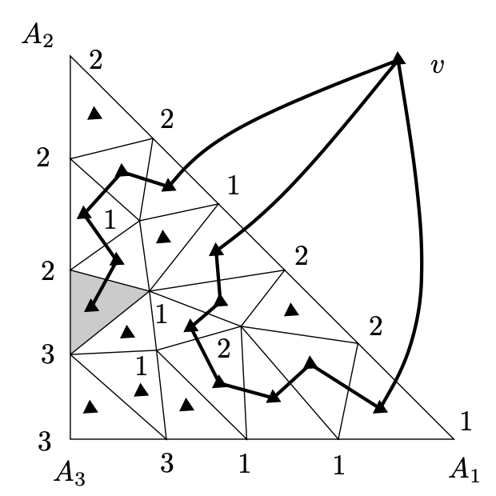

<head>
    
    
</head>

# Table of Contents

1.  [Parity arguments](#org5c64a74)
    1.  [命题（Sperner引理 - planar版本）](#org6779ace)

# Parity arguments

让我们画一个大三角形，顶点为 $ A_ {1}, A_ {2}, A_ {3} $。我们分割它为任意有限个小三角形，如下图：

其中每个三角形都不会在其他三角形的边的里面，这样如果我们考虑该结果图为一个planar图形的绘制，所有内部的面都是三角形。让我们给大三角形和小三角形的顶点标签为1、2、3，在如下规则中：给顶点 $ A_ {i} $一个标签i，i = 1,2,3，且所有在边 $ A_ {i} A_ {j} $上的大三角形的顶点只能给标签为i或j，其他的顶点则可任意赋值

## 命题（Sperner引理 - planar版本）

在如上的描述中，一个顶点被赋值为1、2、3的小三角形总是存在

**证明** 我们定义一个辅助图形G；如上图。它的顶点为我们三角度量的面，例如，所有小三角形加上外层的面。在图中，顶点被描述为对应面中的小黑三角形。外层的面的顶点被记为v。两个顶点，例如，原始图形的面，由G的一条边连接如果有相邻的面且它们共同的边的端点标签为1和2。也考虑最外层面的顶点v，它连接所有小三角形邻接大三角周边边标签为12

一个小三角形在这个图形G中可连接一些它的邻居只在它的顶点标签为1且另一个标签为2。如果仍然有顶点标签为1或2，考虑的小三角形邻接两个邻居。如果仍然有顶点标签为3，则考虑三角形邻接一个邻居，且唯一的情况是图形G中小三角形的度数是奇数。我们现在显示顶点v（外层的面）在G中有奇数的度数。然后，通过握手引理，在G中存在至少另一个奇数度数的顶点，且这是想要的小三角形标签为1,2,3

图形G的边邻接v明显只与大三角形的边 $ A_ {1} A_ {2} $交叉。通过标签规则，该边只包含标签为1或2的顶点。让我们写下这些标签序列，开始于 $ A_ {1} $，结束于 $ A_ {2} $。v的邻居的数量是在这个序列中交替的1和2。因为序列开始于1结束于2，这样交替的数必须为奇数。因此v在G中是奇数的度数

