<head>
    
    
</head>

# Table of Contents

1.  [Algorithm](#org5fabb1b)
2.  [Review](#org18ccb2f)
    1.  [视频编解码如何工作?](#orgf9ebc42)
        1.  [什么? 为什么? 怎么?](#org577de24)
        2.  [历史](#org460918d)
        3.  [通用编解码](#org1e79b25)
        4.  [第一步 - 图片分区](#org73db3f5)
        5.  [第2步 - 预测](#orgab69b54)
        6.  [第3步 - 转换](#org453209a)
        7.  [第4步 - 量化](#org1ab82a7)
        8.  [第5步 - 熵编码](#org0696cb7)
        9.  [第6步 - 比特流格式](#orgc156414)
        10. [复习](#org09e5bfb)
        11. [H.265如何取得比H.264更好的压缩率](#orgd65bbd0)
3.  [Tips](#orgebc9586)
4.  [Share](#orgeace7e3)
    1.  [费马测试](#org7aab4bb)
    2.  [Miller-Rabin测试](#org7af13c2)

# Algorithm

Leetcode 368: <https://leetcode.com/problems/largest-divisible-subset/>

<https://dreamume.medium.com/leetcode-368-largest-divisible-subset-c8439528581e>

# Review

digital video introduction

<https://github.com/leandromoreira/digital_video_introduction#intro>

## 视频编解码如何工作?

### 什么? 为什么? 怎么?

有很多软件/硬件用来压缩解压缩数字视频。市场和社会需求高质量视频而低带宽或存储。记住当我们计算每秒30帧，每像素24比特，480x240清晰度的视频需要的带宽时，无压缩的视频需要82.944Mbps。唯一的方法是在TV和互联网上转发HD/FullHD/4K视频。我们将剪短介绍一下主要的技术

编解码 vs 容器

一个对新手主要的错误是混淆数字视频编解码和数字视频容器。我们可认为容器是一个包装格式包含视频（还可能有音频）的metadata，且压缩视频可被视为它的负载

通常，视频文件的扩展定义它的视频容器。例如，文件video.mp4可能是一个MPEG-4 Part 14容器且一个文件名为video.mkv可能是一个matroska格式

### 历史

频编解码H.261诞生于1990年，且它设计为工作在64kbit/s的速率上。它使用chroma子采样、宏块等思想。在1995年，H.263视频编解码标准发布且继续扩展到2001年

2003年H.264/AVC第一版完成。同年，TrueMotion公司发布它们的视频编解码作为免费有损视频压缩称为VP3。2008年，谷歌购买了该公司，同年发布VP8。在2012年11月，谷歌发布VP9且被3/4浏览器市场（包括移动端）支持

AV1是一个新免版税且开源视频编解码由开放媒体联盟设计，其公司有：谷歌、Mozilla、微软、亚马逊、Netflix、AMD、ARM、NVidia、Intel和Cisco。第一个版本0.1.0引用的编解码发布于2016年4月7号

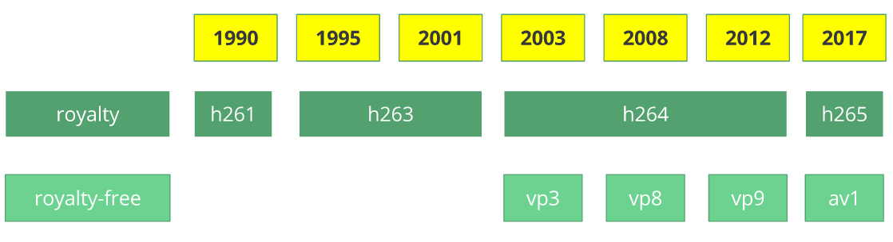

AV1的诞生

2015年早期，谷歌专注于VP10，Xiph (Mozilla) 专注于Daala和Cisco开源免版税视频编解码Thor

然后MPEG LA首先宣布HEVC (H.265)的年度上限和比H.264高八倍的收费但不久它们改变了规则：

-   无年度上限
-   内容收费（收入的0.5%）
-   每单位费用比h264高10倍

开发媒体联盟由硬件制造商（Intel、AMD、ARM、Nvidia、Cisco），内容转发商（谷歌、Netflix、Amazon），浏览器维护者（谷歌、Mozilla）和其他创建

公司有一个共同的目标，一个免版税视频编解码且然后AV1诞生，其专利许可更简单

你可惊奇发现通过浏览器分析AV1编解码，<http://aomanalyzer.org/>

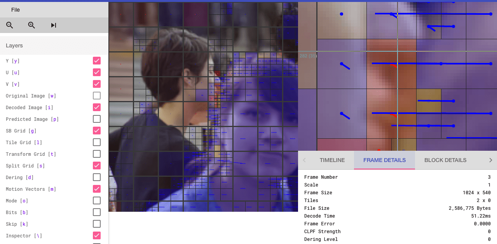

### 通用编解码

我们将介绍一般视频编解码背后的主要机制，但这些概念的多数是有用的且用于现代的编解码比如VP9、AV1和HEVC。为理解简化，有时我们使用一个真实的例子（多数为H.264）来阐述一个技术

### 第一步 - 图片分区

第一步是分割帧为几个区、子分区等

有很多原因要这么做，例如，当我们分割图片我们可更精确地预测，使用小区对小的移动部分，使用更大的区对静态背景

通常，编解码组织这些区为分片，宏（编码树单元）和许多子分区。这些区最大大小不同，HEVC设置为64x64而AVC使用16x16但子分区可为4x4

记住我们学习了帧的类型，你可应用这些思想到块，因此我们可有I分片、B分片和I宏块等

实践：检查区

我们可使用Intel Video Pro Analyzer，如下是VP9分区分析

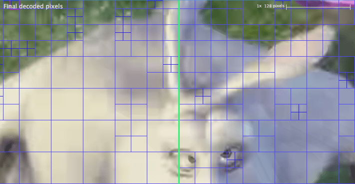

### 第2步 - 预测

一旦我们有了分区，我们可在它们之上使用预测。对内部预测我们需要发送运动向量和剩余和intra预测，我们将发送预测方向和剩余

### 第3步 - 转换

在我们获得剩余块（预测区 - 真实区），我们可转换且让我们知道哪些像素我们可丢弃而保持整体质量

虽然有其他转换，我们将更关注于离散余弦转换（DCT）。DCT主要特征为

-   转换像素块为相同大小频率系数块
-   压缩能量，使它容易消除空间冗余
-   可反转，你可反转像素

在2017年2月2号，Cintra, R. J.和Bayer, F. M发布了他们的论文DCT-like Transform for Image Compression Requires 14 Additions Only

不要担心如果你不理解这些，我们将尝试做一些试验

让我们看如下8x8的像素块

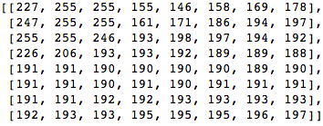

其呈现如下图像(8x8):

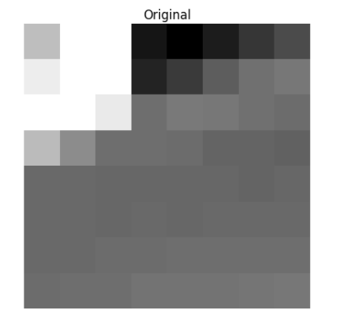

当我们应用DCT到该像素块时我们得到系数块（8x8）：

如果我们呈现系数块，我们获得图像：

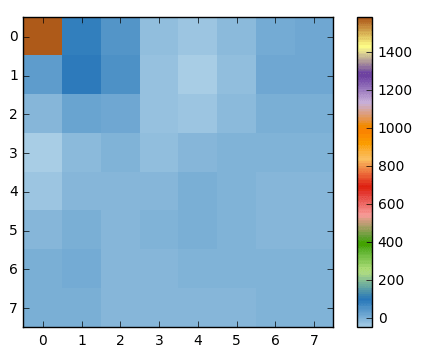

你看到它不像源图片，我们应该注意第一个系数跟其他系数非常不同。第一个系数被叫做DC系数，呈现输入数组所有采样，跟平均采样相似

该系数块有一个有趣的属性，它分离高频部分和低频部分

在图片中，多数能量集中在低频，这样如果我们转换一个图片到它的频率部分且抛弃高频系数，我们可缩减需要的数据描述图片而不牺牲太多图片质量

频率意味着信号改变的快慢

让我们尝试应用我们获得的知识在测试中转换源图片为它的频率（系数块）使用DCT且扔掉不太重要的系数部分

首先，我们转换它为频率域

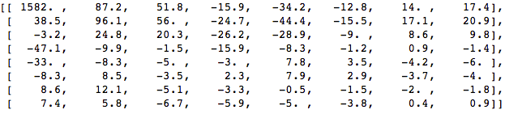

接着，我们丢弃部分系数（67%），右底部的大部分：

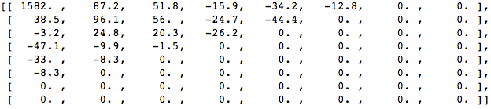

最后，我们从丢弃的系数块重构建图片（记住，它需要可反转）且跟源图片比较

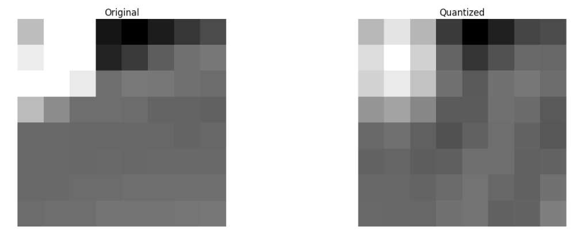

我们可看到它跟源图片相似但有许多不同，我们丢弃了67.1875%且我们仍然能得到一些跟源图片相似的地方。我们可更智能的丢弃系数来获得更好的图片质量，但这是后面的话题

每个系数使用所有像素形成

注意每个系数不直接映射到单个像素而是它的所有像素的权重和，这很重要。这个神奇的图片显示第一个和第二个系数如何计算，使用每个索引唯一的权重

### 第4步 - 量化

当我们丢弃一些系数，在最后的步骤（转换），我们做一些形式的量化。这一步是我们选择丢失哪里的信息（有损部分）或简单地说，我们量化系数来达到压缩

我们怎么量化系数块？一个简单的方法为统一量化，我们取一个块，用一个值（10）除并截取该值：

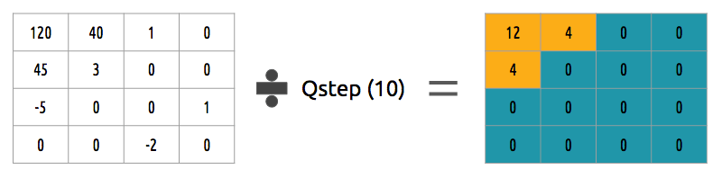

我们如何反转系数块？我们可乘以之前除的值

该实现不是最好的因为它不统计每个系数的重要性，我们可使用一个量化矩阵，该矩阵利用DCT的属性，更多地量化右边底部，而少量化左上，JPEG使用类似的实现

### 第5步 - 熵编码

在我们量化数据（图片块/分片/帧）之后，我们可无损压缩它。有许多方法（算法）来压缩数据。我们将简介一些

VLC编码：

让我们假设我们有一个符号流：a, e, r和t和它们的概率（从0到1）：

<table border="2" cellspacing="0" cellpadding="6" rules="groups" frame="hsides">

<colgroup>
<col  class="org-left" />

<col  class="org-right" />

<col  class="org-right" />

<col  class="org-right" />

<col  class="org-right" />
</colgroup>
<thead>
<tr>
<th scope="col" class="org-left">&#xa0;</th>
<th scope="col" class="org-right">a</th>
<th scope="col" class="org-right">e</th>
<th scope="col" class="org-right">r</th>
<th scope="col" class="org-right">t</th>
</tr>
</thead>

<tbody>
<tr>
<td class="org-left">概率</td>
<td class="org-right">0.3</td>
<td class="org-right">0.3</td>
<td class="org-right">0.2</td>
<td class="org-right">0.2</td>
</tr>
</tbody>
</table>

我们可赋值唯一的二进制代码，最小的到最大可能，更大的编码到更小可能的符号

<table border="2" cellspacing="0" cellpadding="6" rules="groups" frame="hsides">

<colgroup>
<col  class="org-left" />

<col  class="org-right" />

<col  class="org-right" />

<col  class="org-right" />

<col  class="org-right" />
</colgroup>
<thead>
<tr>
<th scope="col" class="org-left">&#xa0;</th>
<th scope="col" class="org-right">a</th>
<th scope="col" class="org-right">e</th>
<th scope="col" class="org-right">r</th>
<th scope="col" class="org-right">t</th>
</tr>
</thead>

<tbody>
<tr>
<td class="org-left">概率</td>
<td class="org-right">0.3</td>
<td class="org-right">0.3</td>
<td class="org-right">0.2</td>
<td class="org-right">0.2</td>
</tr>

<tr>
<td class="org-left">二进制代码</td>
<td class="org-right">0</td>
<td class="org-right">10</td>
<td class="org-right">110</td>
<td class="org-right">1110</td>
</tr>
</tbody>
</table>

编码器和解码器必须知道符号表和它的编码，因此，你也需要发送该表

算术编码：

让我们假设我们有一个符号流：a，e，r，s，t和它们的概率：

<table border="2" cellspacing="0" cellpadding="6" rules="groups" frame="hsides">

<colgroup>
<col  class="org-left" />

<col  class="org-right" />

<col  class="org-right" />

<col  class="org-right" />

<col  class="org-right" />

<col  class="org-right" />
</colgroup>
<thead>
<tr>
<th scope="col" class="org-left">&#xa0;</th>
<th scope="col" class="org-right">a</th>
<th scope="col" class="org-right">e</th>
<th scope="col" class="org-right">r</th>
<th scope="col" class="org-right">s</th>
<th scope="col" class="org-right">t</th>
</tr>
</thead>

<tbody>
<tr>
<td class="org-left">概率</td>
<td class="org-right">0.3</td>
<td class="org-right">0.3</td>
<td class="org-right">0.15</td>
<td class="org-right">0.05</td>
<td class="org-right">0.2</td>
</tr>
</tbody>
</table>

我们可构建通过频率排序的所有可能符号

现在让我们编码流，我们取第一个符号e，其位于子范围0.3到0.6（不包含边界）且我们使用相同的比例在该范围

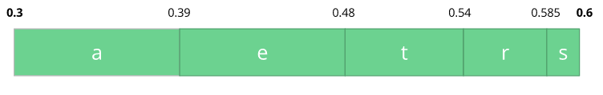

我们继续编码流，现在我们取第二个符号a，其在新的子范围0.3到0.39中且然后我们取我们最后的符号t且我们做同样的处理且我们获得最后的子范围0.354到0.372

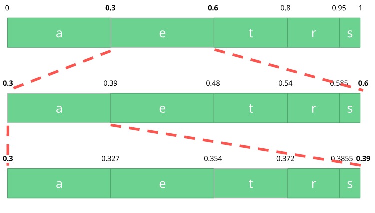

我们仅需要在最后的子范围0.354到0.372之间取一个数，让我们选择0.36但我们可选择该子范围内任意数，只有该值我们可恢复我们源流。如果你思考它，它像如果我们一个范围的范围线来编码我们的流

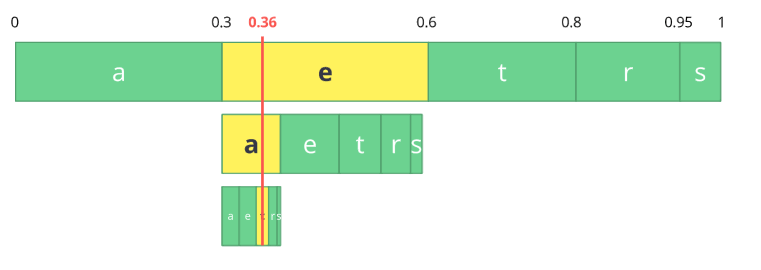

反向处理（解码）非常容易，对我们的数0.36和我们源范围我们可运行相同的进程但现在使用该数揭露流编码背后的数

对第一个范围，我们注意到我们的数符合分片，因此，它是我们第一个符号，现在我们分割该子范围，做相同的处理，且我们注意到0.36符合符号a且在我们重复之后我们得到最后的符号t

编码器和解码器必须知道符号概率表，因此我们需要发送该表

### 第6步 - 比特流格式

在我们做了这些步骤之后我们需要取压缩帧和内容到这些步骤。我们需要通知解码器编码器采集的决策，比如位深、颜色空间、清晰度、预测信息（运动向量，intra预测方向），配置，水平，帧率，帧类型，帧数等

**H.264比特流**

AVC(H.264)标准定义将被发送到块帧（网络中概念）的信息，称为NAL（网络抽象层）。NAL主要的目标是网络友好的视频呈现供给，该标准必须工作在TV上（基于流），互联网（基于包）

有一个同步标签定义NAL单元的边界。每个同步标签有一个值0x00 0x00 0x01，第一个同步标签为0x00 0x00 0x00 0x01。如果我们用hexdump打开h264流，我们可确认在文件的开始有3个NAL

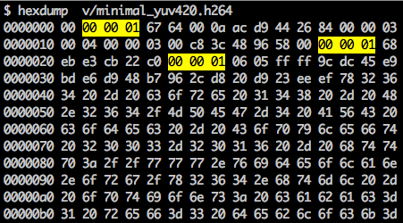

如我们之前所说，解码器需要不仅知道图片数据还需要知道视频细节，帧，颜色，使用参数和其他。每个NAL第一个字节定义它的类别和类型

<table border="2" cellspacing="0" cellpadding="6" rules="groups" frame="hsides">

<colgroup>
<col  class="org-right" />

<col  class="org-left" />
</colgroup>
<thead>
<tr>
<th scope="col" class="org-right">NAL type id</th>
<th scope="col" class="org-left">Descriptionn</th>
</tr>
</thead>

<tbody>
<tr>
<td class="org-right">0</td>
<td class="org-left">Undefined</td>
</tr>

<tr>
<td class="org-right">1</td>
<td class="org-left">Coded slice of a non-IDR picture</td>
</tr>

<tr>
<td class="org-right">2</td>
<td class="org-left">Coded slice data partiiton A</td>
</tr>

<tr>
<td class="org-right">3</td>
<td class="org-left">Coded slice data partition B</td>
</tr>

<tr>
<td class="org-right">4</td>
<td class="org-left">Coded slice data partition C</td>
</tr>

<tr>
<td class="org-right">5</td>
<td class="org-left">IDR Coded slice of an IDR picture</td>
</tr>

<tr>
<td class="org-right">6</td>
<td class="org-left">SEI Supplemental enhancement informationn</td>
</tr>

<tr>
<td class="org-right">7</td>
<td class="org-left">SPS Sequence parameter set</td>
</tr>

<tr>
<td class="org-right">8</td>
<td class="org-left">PPS Picture parameter set</td>
</tr>

<tr>
<td class="org-right">9</td>
<td class="org-left">Access unit delimiter</td>
</tr>

<tr>
<td class="org-right">10</td>
<td class="org-left">End of sequence</td>
</tr>

<tr>
<td class="org-right">11</td>
<td class="org-left">End of stream</td>
</tr>

<tr>
<td class="org-right">&#x2026;</td>
<td class="org-left">&#x2026;</td>
</tr>
</tbody>
</table>

通常，比特流的第一个NAL是一个SPS，该类型NAL负责通知一般编码变量如配置、水平、清晰度和其他

如果我们跳过第一个同步标签我们可解码第一个字节来知道第一个NAL的类型

例如同步标签之后的第一个字节为01100111，第一个比特0为禁止0比特位，接下来的两个比特11告诉我们nalrefidc其表示该NAL是否是一个引用位且剩下的5个比特00111告诉我们nalunittype，这里，它是SPS(7) NAL单元

SPS NAL的第二个字节（二进制=01100100，hex=0x64，十进制=100）是profileidc位，其显示编码器使用的配置，在这个例子中，我们使用高配置。第三个字节包含一些标志位决定确切的配置（比如限制或进度）。但在我们的例子中第三个字节为0x00且因此编码器使用高配置

当我们读H.264比特流SPS NAL说明我们将找到参数名、类别、描述的许多值，例如，让我们看picwidthinmbsminus1和picheightinmapunitsminus1位

<table border="2" cellspacing="0" cellpadding="6" rules="groups" frame="hsides">

<colgroup>
<col  class="org-left" />

<col  class="org-right" />

<col  class="org-left" />
</colgroup>
<thead>
<tr>
<th scope="col" class="org-left">参数名</th>
<th scope="col" class="org-right">类别</th>
<th scope="col" class="org-left">描述</th>
</tr>
</thead>

<tbody>
<tr>
<td class="org-left">picwidthinmbsminus1</td>
<td class="org-right">0</td>
<td class="org-left">ue(v)</td>
</tr>

<tr>
<td class="org-left">picheightinmapunitsminus1</td>
<td class="org-right">0</td>
<td class="org-left">ue(v)</td>
</tr>
</tbody>
</table>

如果我们在这些位的值上做一些数学计算我们将得到清晰度。我们可表达一个1920x1080使用一个picwidthinmbsminus1值119（(119 + 1) \* macroblocksize = 120 \* 16 = 1920），这样节省空间

如果我们继续解释我们创建的视频，我们可跳过最后的NAL，其是帧本身

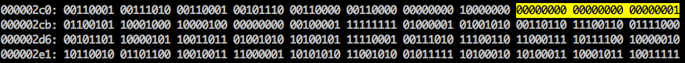

我们可看到它的首6个字节值：01100101 10001000 10000100 00000000 00100001 11111111。第一个字节告诉我们NAL类型，在本例中，(00101)它是一个IDR分片(5)且我们可进一步检查

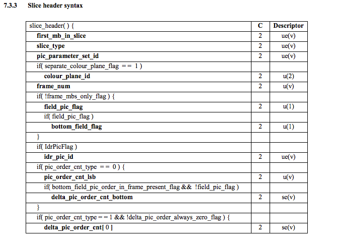

使用该说明信息我们可解码分片类型（slicetype），帧数（framenum）

为了获得一些位的值(ue(v), me(v), se(v) or te(v)) 我们需要解码它使用一个特别解码器称为Exponential-Golomb，该方法非常高效编码变量值，多数时有很多缺省值

这个视频slicetype和framenum值为7（I分片）和0（第一帧）

我们可看到比特流作为一个协议且如果你想要或需要学习更多该比特流请参考ITU H.264 spec。这里有一个宏图表显示图片数据（压缩YUV）的位置：

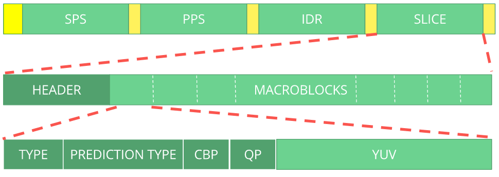

我们可探索其他比特流比如VP9比特流，H.265(HEVC)或我们最好的AV1比特流，它们看着相似吗？不，一旦你学习一个你可容易获得其他

### 复习

我们将注意许多现代的编解码使用我们学习过的相同模型。事实上，让我们看Thor视频编解码块图表，它包含我们学习过的所有步骤。该想法是你知道应该能够至少更好理解该领域的发明和论文

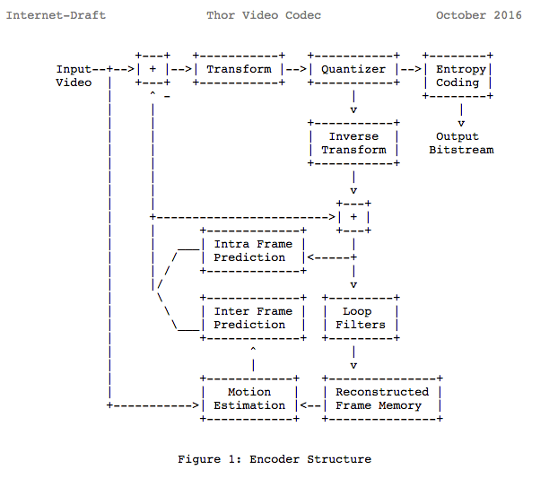

之前我们已计算我们需要139GB存储来存放一个小时720p清晰度30帧每秒的视频文件，如果我们使用我们学习到的技术，如内外预测、转换、量化、熵编码和其他，假设我们花费0.031比特每像素，相同的探测质量视频只需要367.82MB

### H.265如何取得比H.264更好的压缩率

现在我们知道编解码如何工作，则它容易理解新的编解码如何用更少的比特获得更高的清晰度

我们将比较AVC和HEVC，它是更多的CUP周期（复杂度）和压缩率的折中

HEVC比AVC有更大更加分区的选项，更多intra预测方向，改进熵编码等，所有这些改进使H.265能够比H.264进一步压缩50%

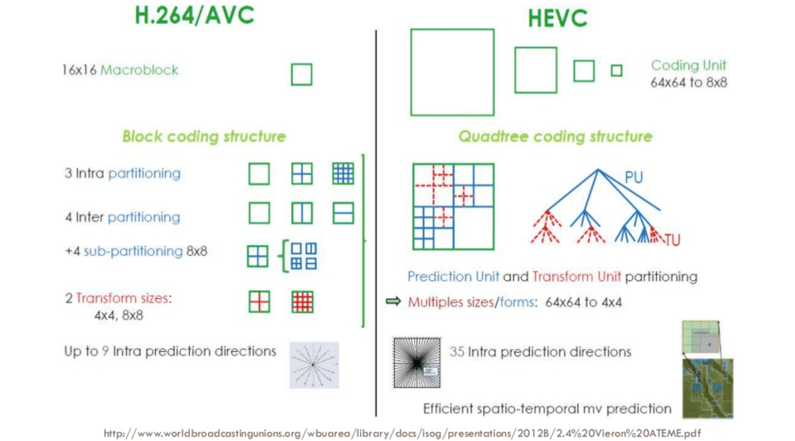

# Tips

多做题还是很重要的，特别是要做经典的题及一些例子，如下参考了网上一道题的解法

素数倒数和不收敛

<https://mathsface.files.wordpress.com/2013/05/divergence.pdf>

当我在学校时，我的数学老师cheekily告诉我对无穷多个数求和并得到一个有限的数是可能的。如下：

$ 1 + \\frac{1}{2} + \\frac{1}{4} + \\frac{1}{8} + \\frac{1}{16} + \\cdots = 2 $

我问老师怎么得到的答案，老师的回复：

我们设$ S = 1 + \\frac{1}{2} + \\frac{1}{4} + \\frac{1}{8} + \\frac{1}{16} + \\cdots $

然后我们把上式乘以1 / 2:

$ \\frac{1}{2}S = \\frac{1}{2} + \\frac{1}{4} + \\frac{1}{8} + \\frac{1}{16} + \\cdots $

然后我们有：

$ \\frac{1}{2} S + 1 = 1 + \\frac{1}{2} + \\frac{1}{4} + \\frac{1}{8} + \\frac{1}{16} + \\cdots $

即 $ \\frac{1}{2} S + 1 = S $

所以答案是S = 2

第二天我下课后留下来告诉老师一个好消息，我走到黑板并写下：

$ 1 + 2 + 4 + 8 + 16 + \\cdots = -1 $

她盯着我看了一会，“我想这个式子不对“

然后我在黑板写下：

$ S = 1 + 2 + 4 + 8 + 16 + \\ldots $

如果我把两边乘以2，得到

$ 2S = 2 + 4 + 8 + 16 + 32 + \\ldots $

现在，如果我两边加1，得到

$ 2S + 1 = 1 + 2 + 4 + 8 + 16 + 32 + \\ldots $

这样有

$ 2S + 1 = S $

所以 $ S = -1 $

我笑着看着她但她没有笑。她说我的做法是错的。她说你不能加上无穷多个数来得到一个更大的数。如果你想加上无穷多项，它们必须非常小使得它们可以忽略。她说数越接近0，和将收敛到一个有限的值

之后，在我的大学一年级时，我发现她又戏弄我了。在无穷级数课上，我的教授写下一个调和级数

$ 1 + \\frac{1}{2} + \\frac{1}{3} + \\frac{1}{4} + \\cdots $

并告诉我们它不收敛，即它为无穷大。教授用如下说明

我们把该调和级数分组：

$ 1 + \\frac{1}{2} + (\\frac{1}{3} + \\frac{1}{4}) + (\\frac{1}{5} + \\frac{1}{6} + \\frac{1}{7} + \\frac{1}{8}) + \\cdots $

我们先看第一个括号里的分组：

$ ( \\frac{1}{3} + \\frac{1}{4}) > (\\frac{1}{4} + \\frac{1}{4}) = \\frac{1}{2} $

第二个括号里的分组：

$ ( \\frac{1}{5} + \\frac{1}{6} + \\frac{1}{7} + \\frac{1}{8}) > (\\frac{1}{8} + \\frac{1}{8} + \\frac{1}{8} + \\frac{1}{8}) = \\frac{1}{2} $

如此循环，我们可得到

$ 1 + \\frac{1}{2} + (\\frac{1}{2}) + (\\frac{1}{2}) + \\ldots $

该和显然是无穷大，则我们的调和级数也是无穷大

完成上面证明后，教授露出一个比我的中学老师更邪恶的笑容，就像他知道我们对小数和的理解如同需要用勺喂食的垃圾一样

我现在更聪明了一些，且我知道如果我们想要如下形式的和

$ \\frac{1}{a_ {1}} + \\frac{1}{a_ {2}} + \\frac{1}{a_ {3}} + \\ldots $

要收敛，这些项需要一个好的步骤趋于零，或另一种方式，分母需要以一个好的步骤趋于无穷大

例如，对调和级数

$ 1 + \\frac{1}{2} + \\frac{1}{3} + \\frac{1}{4} + \\ldots $

的分母为连续数字

$ 1, 2, 3, 4, \\ldots $

它们趋于无穷大但不是很快。另一个例子如下：

$ 1 + \\frac{1}{4} + \\frac{1}{9} + \\frac{1}{16} + \\ldots = \\frac{\\pi^{2}}{6} $

这里，分母为平方数，该序列增长足够快并确保了收敛

这里有一个非常酷的事实告诉我们素数序列的增长：

$ \\sum_ {p}\\frac{1}{p} = \\frac{1}{2} + \\frac{1}{3} + \\frac{1}{5} + \\frac{1}{7} + \\frac{1}{11} + \\cdots = \\infty $

即素数序列的增长不够快以确保收敛。在某种程度上，素数比平方数要密，这引出了Legendre’s conjecture，描述任意两个平方数之间有一个素数。该conjecture尚未被证明，事实上，我们甚至不知道任意两个立方数之间是否有一个素数

我们将证明上述级数不收敛。首先，我们需要一些引理

*引理 1* 设s为大于1的实数，则

$ 1 + \\frac{1}{2^{s}} + \\frac{1}{3^{s}} + \\frac{1}{4^{s}} + \\frac{1}{5^{s}} + \\cdots = \\frac{1}{1 - 2^{-s}} \\cdot \\frac{1}{1 - 3^{-s}} \\cdot \\frac{1}{1 - 5^{-s}} \\cdots $

左边是所有计数的和，右边是所有素数的乘积。使用形式化记号，为

$ \\sum_ {n} \\frac{1}{n^{s}} = \\prod_ {p}\\frac{1}{1 - p^{-s}} $

这里是一个上式的非形式化证明

*非形式化证明*

首先，注意到右边的每项为

$ \\frac{1}{1 - p^{-s}} $

对 $ \| x \| <  1 $我们有扩展

$ \\frac{1}{1 - x} = 1 + x + x^{2} + x^{3} + \\ldots $

对 $ \| p^{-s} \| < 1 \| $，我们有

$ \\begin{aligned} \\frac{1}{1-p^{-s}} &=1+p^{-s}+\\left(p^{-s}\\right)^{2}+\\left(p^{-s}\\right)^{3}+\\ldots \\\\ &=1+p^{-s}+p^{-2 s}+p^{-3 s}+\\ldots \\end{aligned} $

则明显

$ \\prod_ {p} \\frac{1}{1 - p^{-s}} $

可写为

$ \\prod_ {p}(1 + p^{-s} + p^{-2s} + p^{-3s} + \\ldots ) $

现在让我们想一下该乘积。它可容易写成

$ (1 + 2^{-s} + 2^{-2s} + 2^{-3s} + \\ldots)(1 + 3^{-s} + 3^{-2s} + 3^{-3s} + \\ldots)(1 + 5^{-s} + 5^{-2s} + 5^{-3s} + \\ldots) $

如果我们完全扩展这些括号，我们将得到一个和。该和的每一项（除了1，1为每个括号里的1相乘获得）为一个素数或素数的次方的乘积，所有的都是-s次方。因为每个大于1的整数是一个唯一的素数和素数次方的乘积，我们恢复每个正整数一次且为-s的次方：

$ 1 + 2^{-s} + 3^{-s} + 4^{-s} + \\ldots $

这等于 $ \\sum_ {n} 1 / n^{s} $

上述的证明是非形式化的，利用乘积无限和和积，我们可形式化的通过前n个素数乘积和应用泰勒级数。然后，显示它和无穷和差别当 $ n \\to \\infty $为0

现在，让我们证明 $ \\sum_ {p} 1 / p = \\infty $

*素数倒数级数不收敛* 设s > 1。我们开始如下：

$ \\sum_ {n} \\frac{1}{n^{s}} = \\prod_ {p} \\frac{1}{1 - p^{s}} $

对等式两边求log得：

$ \\begin{aligned} \\log{(\\sum_ {n}\\frac{1}{n^{s}})} &= \\log{(\\prod_ {p} \\frac{1}{1 - p^{-s}})} \\\\ &= \\sum_ {p} \\log{(\\frac{1}{1 - p^{-s}})} \\\\ &= - \\sum_ {p} \\log{(1 - p^{-s})} \\end{aligned} $

我们现在希望使用如下的泰勒级数，该级数对 $ \| x \| < 1 $成立：

$ - \\log{(1 - x)} = \\sum^{\\infty}_ {n=1} \\frac{x^{n}}{n} $

我们带入右边得：

$ \\begin{aligned} \\log{(\\sum_ {n}\\frac{1}{n^{s}})} &= \\sum_ {p} - \\log{(1 - p^{-s})} \\\\ &= \\sum_ {p}(\\frac{1}{p^{s}} + \\frac{1}{2p^{2s}} + \\frac{1}{3p^{3s}} + \\cdots) \\\\ &= \\sum_ {p} \\frac{1}{p^{s}} + \\sum_ {p} \\frac{1}{p^{2s}}(\\frac{1}{2} + \\frac{1}{3p^{s}} + \\frac{1}{4p^{2s}} + \\cdots) \\\\ < \\sum_ {p} \\frac{1}{p^{s}} + \\sum_ {p} \\frac{1}{p^{2s}}(1 + \\frac{1}{p^{s}} + \\frac{1}{p^{2s}} + \\cdots) \\end{aligned} $

这样我们得到：

$ \\log{(\\sum_ {n} \\frac{1}{n^{s}})} < \\sum_ {p} \\frac{1}{p^{s}} + \\sum_ {p} \\frac{1}{p^{s} (p^{s} - 1)} $

让我们考虑极限 $ s \\to 1 $，左边将趋于无穷

右边比左边大，右边也将趋于无穷。考虑和

$ \\sum_ {p} \\frac{1}{p^{s}(p^{s} - 1)} $

我们可看到

$ \\begin{aligned} \\sum_ {p} \\frac{1}{p^{s}(p^{s} - 1)} &< \\sum_ {p} \\frac{1}{p^{2s}} \\\\ &< \\sum^{\\infty}_ {n=1} \\frac{1}{n^{2s}} \\end{aligned} $

当 $ s \\to 1 $，上述和边界为 $ \\pi^{2} / 6 $，回到我们主等式中：

$ \\log{(\\sum_ {n} \\frac{1}{n^{s}})} < \\sum_ {p} \\frac{1}{p^{s}} + \\sum_ {p} \\frac{1}{p^{s}(p^{s} - 1)} $

我们看到

$ \\sum_ {p} \\frac{1}{p^{s}} $

当 $ s \\to 1 $时趋于无穷，因此 $ \\sum_ {p} \\frac{1}{p} = \\infty $

# Share

Primality Tests

<https://crypto.stanford.edu/pbc/notes/numbertheory/millerrabin.html>

给定一个整数n，如何确定n是一个素数？假设n是一个奇数

最明显的想法是对n做因式分解，但目前还没有有效的因式分解算法

## 费马测试

根据费马定理，如果n是一个素数，则对任意a有 $ a^{n-1} = 1 (mod \\, n) $。费马测试建议：随机取一个数 $ a \\in [1 \\ldots n - 1] $看是否 $ a^{n-1} = 1 (mod \\, n) $。如果不是，则n不是一个素数

然而，当n不为素数时等式也可能成立。例如，n = 561 = 3 x 11 x 17。通过中国余数定理

$ \\mathcal{Z}_ {561} = \\mathcal{Z}_ {3} \\times \\mathcal{Z}_ {11} \\times \\mathcal{Z}_ {17} $

对每个 $ a \\in \\mathcal{Z}^{ * }_ {561} $对应有

$ (x, y, z) \\in \\mathcal{Z}^{ * }_ {3} \\times \\mathcal{Z}^{ * }_ {11} \\times \\mathcal{Z}^{ * }_ {17} $

通过费马定理，$ x^{2} = 1, y^{10} = 1, z^{16} = 1 $。因为2，10和16都能被260整除，这意味着 $ (x, y, z)^{560} = (1, 1, 1) $，即 $ \\forall a \\in \\mathcal{Z}^{ * }_ {561}, a^{560} = 1 $

这样不管我们选择什么样的a值，561总是能通过费马测试，只要a与n互质就行。这样的数称为Carmichael数，且它有无穷多个

如果a不与n互质，则不能通过费马测试，但这种情况下我们可通过计算gcd(a, n) 获得n的一个因子

## Miller-Rabin测试

我们可通过n是素数当且仅当 $ x^{2} = 1 (mod \\, n) $ 的解为 $ x = \\pm 1 $来获得更好的处理

如果n通过费马测试，则 $ a^{n-1} = 1 $，则我们检查 $ a^{\\frac{n-1}{2}} = \\pm 1 $，因为 $ a^{\\frac{n-1}{2}} $是1的平方根

不幸地是，有些数比如第三个Carmichael数1729依然会通过这个加强版的测试。但如果我们迭代进行测试呢？我们继续把指数减半测试直到模的结果不是1。如果其结果不是-1则n不是素数

更形式化的，设 $ 2^{s} $为n - 1中包含2最大的指数，即 $ n - 1 = 2^{s}q $，q为某个奇数。序列的每个成员

$ a^{n-1} = a^{2^{s}q}, a^{2^{s - 1}q}, \\cdots, a^{q} $

是连续的平方根

如果n是素数，该序列模结果开始为1且要么每个成员为1，或第一个不为1的结果为-1

Miller-Rabin测试随机取 $ a \\in \\mathcal{Z}_ {n} $，如果上述序列模结果不以1开始，或第一个不为1的结果不是-1，则n不是一个素数

它证明对任意组合数n，包括Carmichael数，n通过Miller-Rabin测试的可能性最多为 $ \\frac{1}{4} $。（平均概率会小很多）这样n通过的可能性在几次运行后指数级减少

如果n没通过Miller-Rabin测试，但序列模结果开始为1，则我们有一个模n为1的平方根，我们可有效因式分解n。这样Carmichael数总是很容易分解

练习：如果我们用Miller-Rabin测试对这样形式的数pq，q和q都是很大的素数，会怎么样？我么能用它来破解RSA吗？

给定一个n，找到s使得 $ n - 1 = 2^{s}q $，q为某个奇数，然后我们实现一个Miller-Rabin测试如下：

1.  随机选择一个数 $ a \\in [1 \\ldots n - 1] $
2.  如果 $a^{q} = 1 $则n通过
3.  否则，对 $ i = 0, \\ldots, s - 1 $看是否 $ a^{2^{i}q} = -1 $，如果这样，n通过
4.  否则n不是一个素数
