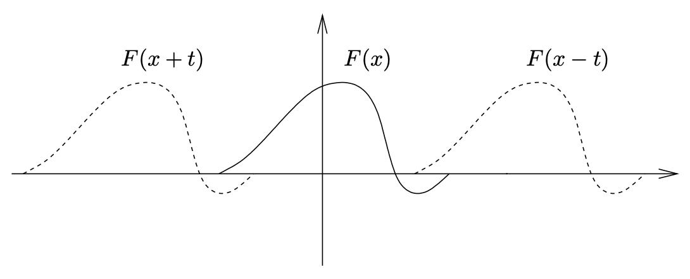

<head>
    
    
</head>

# Table of Contents

1.  [The Genesis of Fourier Analysis](#org8842656)
    1.  [The vibrating string](#org8951148)
        1.  [波浪等式的发展](#org051013c)
        2.  [波浪等式的解决方案](#orgf0a0406)

# The Genesis of Fourier Analysis

## The vibrating string

设y(t)记为在时刻t物体的偏移。我们假设弹簧是理想的，即它满足Hooke法则：运用在弹簧的回复力为F = -ky(t)。这里k > 0是给定的物理量称为弹簧常量。应用牛顿定律（$ 力 = 重量 \\times 加速度 $），我们得到

$ -ky(t) = my^{\\prime \\prime} (t) $

我们使用记号 $ y^{\\prime \\prime} $记为y对t的二次微分。用 $ c = \\sqrt{\\frac{k}{m}} $，该微分等式变为

$ \\begin{equation} y^{\\prime \\prime}(t) + c^{2}y(t) = 0 \\end{equation} $

该等式一般解给定为

$ y(t) = a \\cos{ct} + b \\sin{ct} $

a, b都是常量

在上述表达式中，c是给定常量，但a和b可为任意实数。为了确定等式的特定解，我们必须引入两个初始条件。例如，如果我们给定y(0)和 $ y^{\\prime} (0) $，即初始位置和物体速度，则该物理问题的解是唯一的且给定为

$ y(t) = y(0) \\cos(ct) + \\frac{y^{\\prime} (0)}{c} \\sin{ct} $

我们可容易检查存在常量A > 0和 $ \\varphi \\in \\mathbb{R} $使得

$ a \\cos(ct) + b \\sin(ct) = A \\cos{(ct - \\varphi)} $

因为以上给出了物理解释，我们称 $ A = \\sqrt{a^{2} + b^{2}} $为运动的振幅，c为它的自然频率，$ \\varphi $为它的相，且 $ \\frac{2 \\pi}{c} $为运动的周期

函数 $ A \\cos{(ct - \\varphi)} $典型的图形如上图

我们做两个观察。首先是最基本的震荡系统的数学描述，名为简单调和运动，包括最基本的三角函数 $ \\cos{t}, \\sin{t} $。它很重要，回忆这些函数和复数的关系，如欧拉公式 $ e^{it} = \\cos{t} + i \\sin{t} $。第二个观察是简单的调和运动确定为一个时间函数和两个初始条件，一个确定位置，另一个是速度（时刻t = 0）。该属性在更一般化震荡系统中共享，如下所示

震动弹簧可被看作为一维波浪运动。我们想要描述两种运动使得它们为简单图形表示形式

-   首先，我们考虑波浪。像波浪的运动描述为图形y = u(x, t)，如下图所示
    
    
    
    即有一个初始配置 $ y == \\varphi(x) $表示时刻t = 0时的波浪，且一个振幅因子 $ \\psi(t) $，依赖于t，所以y = u(x, t)有
    
    $ u(x, t) = \\varphi(x) \\psi (t) $

-   第二个类型的波浪运动通常被观察为旅行波浪。它的描述特别简单：
    
    有一个初始配置F(x)当t = 0时u(x, t)等于F(x)。随着t变化，该配置向右偏移ct单位，c是一个正常量
    
    $ u(x, t) = F(x - ct) $
    
    图形如下：
    
    
    
    因为随时间t以速度c移动，该常量表示为波浪的速度。函数F(x - ct)向右移动的一维旅行波浪。相似的，u(x, t) = F(x + ct)为向左移动的一维旅行波浪

### 波浪等式的发展

想象一个弹簧放在(x, y)平面上，沿着x轴在x = 0和x = L之间伸展。它的位置y = u(x, t)是x和t的一个函数，目标是得到一个微分等式

为这个目标，我们考虑弹簧被分割为N块物体（我们认为是个体颗粒）统一分布在x轴，这样第n个颗粒它的x坐标在 $ x_ {n} = \\frac{nL}{N} $。我们将因此想象弹簧为N个颗粒的复数系统，每个只在垂直方向震荡；然而，不像我们之前考虑的简单调和震荡，每个颗粒有它的震荡通过弹簧张力连接到它的邻居

我们然后设置 $ y_ {n}(t) = u(x_ {n}, t) $，且注意 $ x_ {n+1} - x_ {n} = h, h = \\frac{L}{N} $。如果我们假设弹簧有常量密度 $ \\rho > 0 $，每个颗粒有质量 $ \\rho h $。通过牛顿定律，$ \\rho h y^{\\prime \\prime}_ {n}(t) $等于作用在作用在第n个颗粒上的力。我们现在使用简单假设该力影响两个临近的颗粒，如上图所示x坐标的 $ x_ {n-1}, x_ {n+1} $。我们进一步假设来自于第n个颗粒右边的该力是 $ \\frac{y_ {n+1} - y_ {n}}{h} $的部分，h是 $ x_ {n+1}, x_ {n} $之间的距离；因为我们可写该张量为

$ ( \\frac{\\tau}{h} ) (y_ {n+1} - y_ {n}) $

$ \\tau > 0 $是一个常量等于弹簧张力的常数。有一个相似的力来自于左边，为

$ ( \\frac{\\tau}{h} ) (y_ {n-1} - y_ {n}) $

添加这些力给我们想要的在震荡 $ y_ {n}(t) $的关系，名为

$ \\begin{equation} \\rho h y^{\\prime \\prime}_ {n}(t) = \\frac{\\tau}{h} \\{ y_ {n+1}(t) + y_ {n-1}(t) - 2y_ {n}(t) \\} \\end{equation} $

一方面，选择上面的记号，我们看到

$ y_ {n+1} (t) + y_ {n-1}(t) - 2y_ {n}(t) = u(x_ {n} + h, t) + u(x_ {n} - h, t) - 2u(x_ {n}, t) $

另一方面，对任意函数F(x)，我们有

$ \\frac{F(x+h) + F(x - h) - 2F(x)}{h^{2}} \\to F^{\\prime \\prime}(x) \\qquad h \\to 0 $

这样我们可概括，在除了h且让h趋于0，有

$ \\rho \\frac{\\partial^{2} u}{\\partial t^{2}} = \\tau \\frac{\\partial^{2} u}{\\partial x^{2}} $

或

$ \\frac{1}{c^{2}} \\frac{\\partial^{2} u}{\\partial t^{2}} = \\frac{\\partial^{2} u}{\\partial x^{2}}, c = \\sqrt{\\frac{\\tau}{\\rho}} $

这个关系被称为一维波浪等式，或更简单的波浪等式。系数c > 0被称为运动的速度

跟这个偏微分等式连接，我们做一个重要的简化数学标签。这用于缩放，或用物理的语言，改变单位。即我们可认为坐标x作为 $ x = aX $，a是一个适合的正常量。现在，用新坐标X的术语，间隔 $ 0 \\le x \\le L $变成 $ 0 \\le X \\le L / a $。相似地，我们可替代时间坐标t为t = bT，b是另一个正常量。如果我们设置 U(X, T) = u(x, t)，则

$ \\frac{\\partial U}{\\partial X} = a \\frac{\\partial u}{\\partial x}, \\qquad \\frac{\\partial^{2} U}{\\partial X^{2}} = a^{2} \\frac{\\partial^{2} u}{\\partial x^{2}} $

且对t的微分相似。这样如果我们选择a和b，我们可转换一维波浪等式为

$ \\frac{\\partial^{2} U}{\\partial T^{2}} = \\frac{\\partial^{2} U}{\\partial X^{2}} $

其设置速度c为1。进一步，我们有自由转换间隔 $ 0 \\le x \\le L $ 到 $ 0 \\le X \\le \\pi $。（我们将看到 $ \\pi $的选择在许多环境下很方便）所有这些伴随 $ a = L / \\pi, b = L / (c \\pi) $。一旦我们解决了一个新等式，我们可返回到原来的等式通过变量的反转操作。因此，我们不牺牲一般性，认为波浪等式给定在 $ [0, \\pi] $区间内有速度c = 1

### 波浪等式的解决方案

从摆动弹簧发展的等式，我们现在解释两种办法来解决它：

-   使用旅行波浪
-   使用站立波浪的重叠

第一种非常简单且重要，它不直接给出问题的全部景象；第二种办法会实现它，且广泛适应。首先相信第二种办法只应用于简单的情况，其弹簧初始化位置和速度给定如同站立波浪的重叠。然而，作为傅立叶思想的结论，它变得清晰，问题可在这两种所有初始化条件下起作用

**旅行波浪**

为简化，我们假设c = 1且 $ L = \\pi $，这样等式变成

$ \\frac{\\partial^{2}u}{\\partial t^{2}} = \\frac{\\partial^{2} u}{\\partial x^{2}} \\qquad \\text{on } 0 \\le x \\le \\pi $

重要的观察如下：如果F是任意可两次微分函数，则u(x, t) = F(x + t)且u(x, t) = F(x - t)解决了该波浪等式。注意图形u(x, t) = F(x - t)在时刻t = 0是图形F的简化，且在时刻t = 1它变成图形F转移到右边1个单位。因此，我们认识F(x - t)是旅行波浪向右以速度1旅行。相似地，u(x, t) = F(x + t)是波浪向左以速度1旅行。这些运动描述如下图：

我们观察到波浪等式是线性的。这意味着如果u(x, t)和v(x, t)为特殊解决方案，则 $ \\alpha u(x, t) + \\beta v(x, t) $也是，$ \\alpha, \\beta $为任意常量。因此，我们可重叠两个相反方向的波浪旅行来找到两个可两次微分函数，则

$ u(x, t) = F(x, t) + G(x - t) $

是波浪等式的一个解决方案。事实上，我们现在显示所有的解决方案都有这种形式

我们丢弃 $ 0 \\le x \\le \\pi $的假设，且假设u是可两次微分函数，其解决所有实数x和t的波浪等式。考虑如下新变量集 $ \\xi = x + t, \\eta = x - t $，且定义 $ v(\\xi, \\eta) = u(x, t) $。变量公式地改变显示v满足

$ \\frac{\\partial^{2} v}{\\partial{\\xi} \\partial{\\eta}} = 0 $

积分该关系两次给定 $ v(\\xi, \\eta) = F(\\xi) + G(\\eta) $，得

$ u(x, t) = F(x + t) + G(x - t) $

我们现在必须连接该结果到我们原始的问题，即弹簧的物理运动。我们确定 $ 0 \\le x \\le \\pi $的限制，弹簧的初始形状u(x, 0) = f(x)，且事实是弹簧有一个固定的终点，即对于所有t有$ u(0, t) = u(\\pi, t) = 0 $。为使用以上简单地观察，我们首先扩展f到所有的 $ \\mathbb{R} $，使它在 $ [- \\pi, \\pi ] $上为奇函数，以 $ 2 \\pi $为周期。然后扩展u解决在所有 $ \\mathbb{R} $上的波浪等式，且对所有 $ x \\in \\mathbb{R}, u(x, 0) = f(x) $。因此，u(x, t) = F(x + t) + G(x - t)，且设置t = 0我们找到

$ F(x) + G(x) = f(x) $

因为许多F和G的选择满足该等式，这里建议引入另一个u上的初始条件，称为弹簧的初始速度我们记为g(x):

$ \\frac{\\partial u}{\\partial t}(x, 0) = g(x) $

则 $ g(0) = g(\\pi) = 0 $。我们扩展g到 $ \\mathbb{R} $使它在 $ [- \\pi, \\pi] $上为奇函数，且以 $ 2 \\pi $为周期。位置和速度的两个初始条件现在转换为如下系统：

$ \\left\\{\\begin{array}{l}F(x)+G(x)=f(x) \\\\ F^{\\prime}(x)-G^{\\prime}(x)=g(x)\\end{array}\\right. $

微分第一个等式并和第二个等式相加，我们获得

$ 2 F^{\\prime}(x) = f^{\\prime}(x) + g(x) $

相似地

$ 2 G^{\\prime} (x) = f^{\\prime}(x) - g(x) $

且因此有常量 $ C_ {1}, C_ {2} $使得

$ F(x) = \\frac{1}{2} \\left[ f(x) + \\int^{x}_ {0}g(y)dy \\right] + C_ {1} $

$ G(x) = \\frac{1}{2} \\left[ f(x) - \\int^{x}_ {0}g(y)dy \\right] + C_ {2} $

因为F(x) + G(x) = f(x)，我们有 $ C_ {1} + C_ {2} = 0 $。因此，我们波浪等式最终的解决方案有如下形式

$ u(x, t) = \\frac{1}{2} [f(x + t) + f(x - t)] + \\frac{1}{2} \\int^{x + t}_ {x - t}g(y)dy $

该形式被称为d’Alembert公式。观察该扩展我们选择的f和g确保弹簧总是有固定终点，即对任意t，$ u(0, t) = u(\\pi, t) = 0 $

**站立波浪的重叠**

我们转换到解决波浪等式的第二种方法，其基于我们之前物理观察的两个基本结论。通过站立波浪的考量，我们找到波浪等式的一个特殊的解决方案，形如 $ \\varphi(x) \\psi(x) $。该过程，在其他领域（热等式等）工作得很好，被称为变量独立且构建解决方案被称为纯调。然后通过波浪等式的线性，我们可期望组合这些纯调为声音的复杂组合。该思想更进一步，我们希望最终表达波浪等式的一般化解决方案为这些特殊解决方案的和

注意波浪等式的一边只包含x的微分，而另一边，只有t的微分。该观察提供另一个原因来看待形如$ u(x, t) = \\varphi(x) \\psi(t) $的等式解决方案，希望缩减一个困难的偏微分等式为更简单的一个系统的常微分等式。在波浪等式的例子中，对u的如上形式，我们得到

$ \\varphi(x) \\psi^{\\prime \\prime}(t) = \\varphi^{\\prime \\prime}(x) \\psi(t) $

因此

$ \\frac{\\psi^{\\prime \\prime}(t)}{\\psi(t)} = \\frac{\\varphi^{\\prime \\prime}(x)}{\\varphi(x)} $

关键的观察点是左边只依赖t，右边只依赖x。这只在两边相等为一个常数才可能发送，我们记为 $ \\lambda $。因此，波浪等式缩减如下：

$ \\left\\{\\begin{array}{l}\\psi^{\\prime \\prime}(t)-\\lambda \\psi(t)=0 \\\\ \\varphi^{\\prime \\prime}(x)-\\lambda \\varphi(x)=0\\end{array}\\right. $

我们聚焦我们的注意力在以上系统的第一个等式上。这里，读者将识别在学习简单的调和运动中我们获得的等式。注意我们只需要考虑 $ \\lambda < 0 $的情况，因为当 $ \\lambda \\ge 0 $解决方案 $ \\psi $不会随时间震荡。因此，我们可写入 $ \\lambda = -m^{2} $，且等式的解决方案被给定为

$ \\psi(t) = A\\cos{mt} + B \\sin{mt} $

相似地，我们找到第二个等式的解决方案：

$ \\varphi(x) = \\tilde{A} \\cos{mx} + \\tilde{B} \\sin{mx} $

现在我们考虑弹簧位于x = 0或 $ x = \\pi $时。$ \\varphi(0) = \\varphi(\\pi) = 0 $，得到 $ \\tilde{A} = 0 $，且如果 $ \\tilde{B} \\ne 0 $，则m必须为一个整数。如果m = 0，无解决方案，且如果 $ m \\le -1 $，我们可重命名常量且缩减情况 $ m \\ge 1 $，因为函数 $ \\sin{y} $为奇函数且 $ \\cos{y} $为偶函数。最后，我们猜测对 $ m \\ge 1 $，函数

$ u_ {m}(x, t) = (A_ {m}\\cos{mt} + B_ {m} \\sin{mt}) \\sin{mx} $

在进一步波浪等式分析处理之前，我们暂停一下先讨论站立波浪的一些细节。术语来之对每个固定的t，查看 $ u_ {m}(x, t) $的图形。假设首先m = 1，且 $ u(x, t) = \\cos{t}\\sin{x} $，则上图(a)给出不同t值的图形u

m = 1的情况对应基本调或摆动弹簧的第一个调和

我们现在让m = 2且 $ u(x, t) = \\cos{2t}\\sin{2x} $。对应第一个overtone或第二个调和，且该运动描述在上图(b)中。注意 $ \\forall t, u(\\pi / 2, t) = 0 $。这样的点，时间上不动，被称为节点，有最大振幅的点称为反节点

对更高的m值我们获得更多的overtone或更高的调和。注意当m增加，频率增加，且周期 $ 2 \\pi / m $减少。因此，基本调比其他overtone有更低的频率

我们现在回到原来的问题。会议波浪等式是线性的如果u和v能解决该等式，这样 $ \\alpha u + \\beta v $ 也可以，对任意常量 $ \\alpha, \\beta $。这允许我们构建更多的解决方案，通过站立波浪 $ u_ {m} $的线性组合。该技术，称为重叠，让我们最后猜测波浪等式的解决方案

$ u(x, t) = \\sum^{\\infty}_ {m=1} \\left(A_ {m}\\cos{mt} + B_ {m}\\sin{mt}\\right) \\sin{mx} $

注意上述的和是无限的，这样引起了收敛问题，但因为多数我们的参数是形式化的，我们不担心该问题现在

假设上述表达式给出了波浪等式的所有解决方案。如果我们然后需求弹簧在时刻t = 0时初始位置被图形形状的函数f在 $ [0, \\pi] $上给定，$ f(0) = f(\\pi) = 0 $，我们有 $ u(x, 0) = f(x) $，因此

$ \\sum^{\\infty}_ {m=1}A_ {m}\\sin{mx} = f(x) $

因为弹簧的初始形状可为任意函数f，我们可询问一下基本问题：

给定一个$ [0, \\pi] $上的函数f, $ f(0) = f(\\pi) = 0 $，我们可找到系数 $ A_ {m} $使得

$ f(x) = \\sum^{\\infty}_ {m=1}A_ {m}\\sin{mx} $

该问题表述很松散，但本书下面两章大量的工作将精确地形式化该问题且尝试回答它。这是初始化学习傅立叶分析的基本问题

一个简单的观察允许我们猜测一个公式给定 $ A_ {m} $如果上述表达式成立。我们用 $ \\sin{nx} $乘以两边且集成在 $ [0, \\pi] $，我们获得

$ \\begin{aligned} \\int^{\\pi}_ {0}f(x)\\sin{nx}dx &= \\int^{\\pi}_ {0}\\left(\\sum^{\\infty}_ {m=1}A_ {m}\\sin{mx} \\right) \\sin{nx} dx \\\\ &= \\sum^{\\infty}_ {m=1}A_ {m}\\int^{\\pi}_ {0}\\sin{mx}\\sin{nx}dx = A_ {n} \\cdot \\frac{\\pi}{2} \\end{aligned} $

我们利用了如下事实

$ \\int_{0}^{\\pi} \\sin m x \\sin n x d x=\\left\\{\\begin{array}{ll}0 & \\text { if } m \\neq n \\\\ \\pi / 2 & \\text { if } m=n\\end{array}\\right. $

因此，$ A_ {n} $的猜测，称为f的 $ n^{th} $傅立叶正弦系数，

$ A_ {n} = \\frac{2}{\\pi} \\int^{\\pi}_ {0} f(x)\\sin{nx}dx $

我们可转换傅立叶sine系列在 $ [0, \\pi] $上的问题到一个更一般化的 $ [-\\pi, \\pi] $区间上的问题。如果我们可表达 $ [0, \\pi] $上的f用一个sine系列，则该表达也能用区间 $ [-\\pi, \\pi] $表达如果我们通过使f为奇函数扩展f到该区间。相似地，我们可问如果一个区间 $ [-\\pi, \\pi] $上的偶函数可被表达为cosine系列，如

$ g(x) = \\sum^{\\infty}_ {m = 0} A^{\\prime}_ {m} \\cos{mx} $

更一般地，因为一个任意的函数F在区间 $ [-\\pi, \\pi] $上可被表达为f + g，f是奇函数，g是偶函数，我们可问如果F可被写为

$ F(x) = \\sum^{\\infty}_ {m=1} A_ {m}\\sin{mx} + \\sum^{\\infty}_ {m=0}A^{\\prime}_ {m} \\cos{mx} $

或通过应用欧拉公式 $ e^{ix} = \\cos{x} + i \\sin{x} $，我们希望F为形式：

$ F(x) = \\sum^{\\infty}_ {m=- \\infty} a_ {m}e^{imx} $

通过分析，我们可使用如下事实：

$ \\frac{1}{2 \\pi} \\int_ {-\\pi}^{\\pi} e^{i m x} e^{-i n x} d x = \\left\\{\\begin{array}{ll} 0 & \\text { if } n \\neq m \\\\ 1 & \\text { if } n=m\\end{array}\\right. $

则

$ a_ {n} = \\frac{1}{2 \\pi} \\int^{\\pi}_ {- \\pi}F(x)e^{-inx} dx $

$ a_ {n} $被称为F的 $ n^{th} $傅立叶系数

我们现在重新形式化问题：

**问题** 给定任意$ [-\\pi, \\pi] $上的函数，傅立叶系数如上定义，则

$ F(x) = \\sum^{\\infty}_ {m=- \\infty} a_ {m}e^{imx} ? $

我们回到波浪等式。为形式化问题，我们必须引入两个初始条件。赋值初始位置和弹簧的速度。即我们需要u满足微分等式和两个条件：

$ u(x, 0) = f(x) \\text{   和   } \\frac{\\partial u}{\\partial t}(x, 0) = g(x) $

f和g是预赋值的函数。注意这需要f和g被表达为

$ f(x) = \\sum^{\\infty}_ {m=1} A_ {m} \\sin{mx} \\text{   和   } g(x) = \\sum^{\\infty}_ {m=1}mB_ {m} \\sin{mx} $
