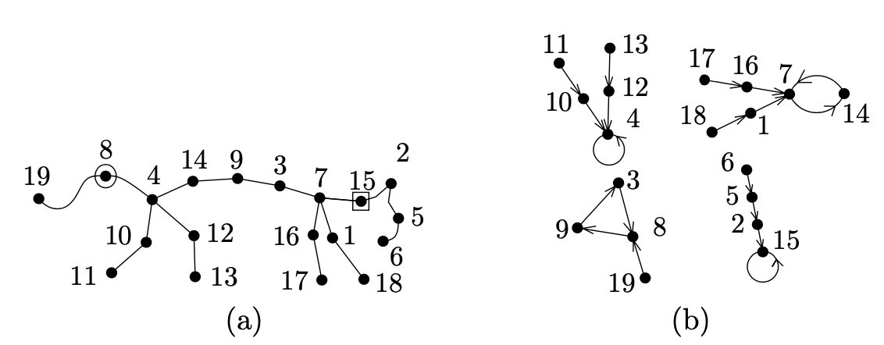
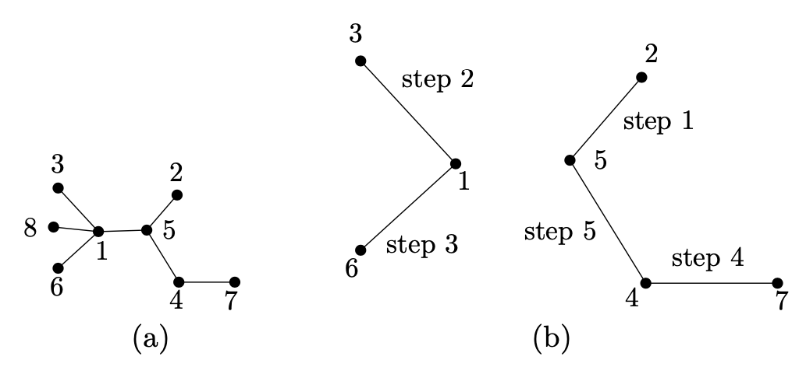
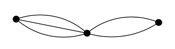
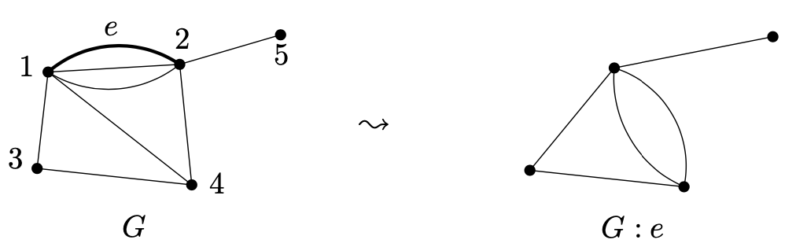
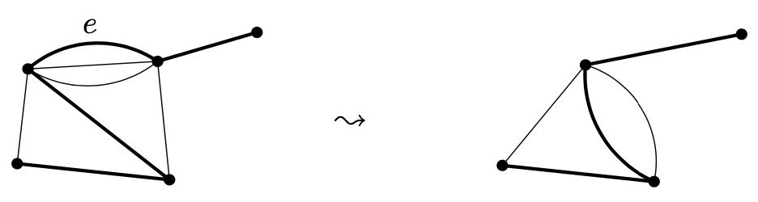

<head>
    
    
</head>

# Table of Contents

1.  [结果](#org4f39a9a)
    1.  [定理（Cayley公式）](#orgfb9c108)
    2.  [A proof via score](#org6c78265)
        1.  [命题](#org6275426)
    3.  [用脊椎动物证明](#orgaa4f3ff)
    4.  [使用 $ Pr \\ddot{u} fer $代码证明](#org33f6fcc)
    5.  [用行列式证明](#org895566a)
    6.  [定理（Binet-Cauchy定理）](#orgbd27f2d)

# 结果

对一个给定的图形G，设T(G)记为G的所有伸展树的个数，我们有 $ T(K_ {3}) = 3 $。在本章中，我们呈现如下结果的几个证明：

## 定理（Cayley公式）

对每个 $ n \\ge 2 $，$ T(K_ {n}) $的个数，例如，给定n个顶点的树的个数，为 $ n^{n-2} $

## A proof via score

### 命题

设 $ d_ {1}, d_ {2}, \\ldots, d_ {n} $为正整数，其和为2n - 2，则对 $ i = 1, 2, \\ldots, n $的顶点i有度数为 $ d_ {i} $的图形 $ K_ {n} $的伸展树的个数为

$ \\frac{(n - 2)!}{(d_ {1} - 1)! (d_ {2} - 1)! \\cdots (d_ {n} - 1)! } $

**证明** 使用归纳法。对n = 1, 2，命题显然成立，所以设n > 2，因为 $ d_ {i} $的和小于2n，存在一个i，其 $ d_ {i} = 1 $。我们现在假设 $ d_ {n} = 1 $

设 $ \\mathcal{T} $为 $ K_ {n} $的所有伸展树的集合。分类 $ \\mathcal{T} $的树为n - 1个组 $ \\mathcal{T}_ {1}, \\ldots, \\mathcal{T}_ {n - 1} $: 集合 $ \\mathcal{T}_ {j} $包含所有顶点n连接到顶点j的 $ \\mathcal{T} $的树。接着，我们考虑 $ \\mathcal{T}_ {j} $中的树，且我们删除顶点n及它的度数。我们获得一个 $ K_ {n-1} $的伸展树，其顶点i的度数为 $ d_ {i}, i \\ne j $和 $ d_ {j} - 1, i = j $。容易看到这样我们获得一个集合 $ \\mathcal{T}_ {j} $到 $ K_ {n-1} $的所有伸展树的集合 $ \\mathcal{T}^{\\prime}_ {j} $的双射，顶点为 $ d_ {1}, d_ {2}, \\ldots, d_ {j-1}, d_ {j} - 1, d_ {j+1}, \\ldots, d_ {n-1} $

通过归纳假设，我们有

$ \\begin{aligned} \| \\mathcal{T}_ {j} \| &= \| \\mathcal{T}^{\\prime}_ {j} \| = \\frac{(n-3)!}{(d_ {1} - 1)! \\cdots (d_ {j-1} - 1)! (d_ {j} - 2)!(d_ {j+1} - 1)! \\cdots (d_ {n-1} - 1)!} \\\\ &= \\frac{(n-3)! (d_ {j} - 1)}{(d_ {1} - 1)! (d_ {2} - 1)! \\cdots (d_ {n-1} - 1)!} \\end{aligned} $

当 $ d_ {j} = 1 $时该公式也成立，它使得在顶点j没有伸展树，$ d_ {j} - 1 = 0 $

因此，顶点度数为 $ d_ {1}, d_ {2}, \\ldots, d_ {n}, d_ {n} = 1 $的n个顶点的伸展树个数为

$ \\begin{aligned} \| \\mathcal{T} \| &= \\sum^{n}_ {j=1} \| \\mathcal{T}_ {j} \| = \\sum^{n-1}_ {j=1} \\frac{(n-3)! (d_ {j} - 1)}{(d_ {1} - 1)! (d_ {2} - 1)! \\cdots (d_ {n-1} - 1)!} \\\\ &= \\left(\\sum^{n-1}_ {j=1}(d_ {j} - 1)\\right) \\frac{(n-3)!}{(d_ {1} - 1)!(d_ {2} - 1)! \\cdots (d_ {n-1} - 1)!} \\\\ &= \\frac{(n-2)(n-3)!}{(d_ {1} - 1)! (d_ {2} - 1)! \\cdots (d_ {n-1} - 1)!} \\end{aligned} $

我们加上所有可能scores的伸展树，得到

$ \\begin{aligned} T\\left(K_{n}\\right) &=\\sum_{d_{1}, d_{2}, \\ldots, d_{n} \\geq 1 \\atop d_{1}+d_{2}+\\cdots+d_{n}=2 n-2} \\frac{(n-2) !}{\\left(d_{1}-1\\right) !\\left(d_{2}-1\\right) ! \\cdots\\left(d_{n}-1\\right) !} \\\\ &=\\sum_{k_{1}+k_{2}+\\cdots+k_{n}=n-2}{k_{1}, \\ldots, k_{n} \\geq 0} \\frac{(n-2) !}{k_{1} ! k_{2} ! \\cdots k_{n} !} \\\\ &=(\\underbrace{1+1+\\cdots+1}_{n \\times})^{n-2}=n^{n-2} . \\end{aligned} $

## 用脊椎动物证明

考虑一个完全图 $ K_ {n} $的伸展树，把一个顶点用圆圈标记，一个顶点用方框标记，如上图(a)。一个顶点可以即用圆圈标记也用方框标记。从 $ K_ {n} $的一些扩展树用这种方法得到的对象被称为脊椎动物。设 $ \\mathcal{V} $记为所有脊椎动物的集合

对每个给定的扩展树，我们可创建 $ n^{2} $个脊椎动物。因此所有扩展树的数量为 $ \| \\mathcal{V} \| / n^{2} $

**引理** 在所有脊椎动物集合 $ \\mathcal{V} $和所有顶点集合V到其自身的映射集合中存在一个双射F

因为n个元素集合到其自身的映射数量为 $ n^{n} $，因此伸展数的数目为 $ n^{n-2} $

**引理证明** 我们用上图的例子阐述了双射F的定义。我们开始如上图(a)脊椎动物W的绘制。圆圈和方块标记的顶点由唯一的路径连接，我们先以顶点标号的大小排列写下一行数字，然后我们从标记圆圈到标记方块的顺序写下一行数字：

<table border="2" cellspacing="0" cellpadding="6" rules="groups" frame="hsides">

<colgroup>
<col  class="org-right" />

<col  class="org-right" />

<col  class="org-right" />

<col  class="org-right" />

<col  class="org-right" />

<col  class="org-right" />

<col  class="org-right" />
</colgroup>
<thead>
<tr>
<th scope="col" class="org-right">3</th>
<th scope="col" class="org-right">4</th>
<th scope="col" class="org-right">7</th>
<th scope="col" class="org-right">8</th>
<th scope="col" class="org-right">9</th>
<th scope="col" class="org-right">14</th>
<th scope="col" class="org-right">15</th>
</tr>
</thead>

<tbody>
<tr>
<td class="org-right">8</td>
<td class="org-right">4</td>
<td class="org-right">14</td>
<td class="org-right">9</td>
<td class="org-right">3</td>
<td class="org-right">7</td>
<td class="org-right">15</td>
</tr>
</tbody>
</table>

我们定义一个辅助直接图P: 顶点集合包含上面的顶点，且我们对上一行的顶点向对应下一行的顶点做一个箭头（直边）。因为只有一个箭头指向一个顶点并指出一个顶点，图P是一个直接循环的不相交并（包含可能直接循环的孤立顶点）。我们也说该连接线定义了它的顶点的一个排列，且P包含该排列的循环。在我们的例子中，这些循环是(3, 8, 9), (4), (7, 14)和(15)

我们现在回头来看整个脊椎动物W，如果我们移除连接线的边，它分裂成几部分（各部分也是树）。我们连接各部分的边使得它们指向该部分中包含连接线中的顶点。我们现在定义顶点集合V的直接图：它的边为各部分的所有直接边，加上图形P的边。我们绘制图形P的循环，然后我们绘制每个顶点（原始是从连接线来）树悬挂在连接线的顶点上，如上图(b)

我们声称该直接图G是一个图的映射。使用该图G，我们可最终定义一个映射 $ f: \\{1, 2, \\ldots, n\\} \\to \\{1,2,\\ldots, n\\} $，对每个 $ i \\in V, f(i) = j $，在我们的例子中，我们获得映射 $ 1 \\mapsto 7, 2 \\mapsto 15, 3 \\mapsto 8, 4 \\mapsto 4, 5 \\mapsto 2, 6 \\mapsto 5, 7 \\mapsto 14, 8 \\mapsto 9, 9 \\mapsto 3, 10 \\mapsto 4, \\\\ 11 \\mapsto 10, 12 \\mapsto 4, 13 \\mapsto 12, 14 \\mapsto 7, 15 \\mapsto 15, 16 \\mapsto 7, 17 \\mapsto 16, 18 \\mapsto 1, 19 \\mapsto 8 $。这样， 每个脊椎动物W确定一个映射F(W)

仍然要证明原始的脊椎动物W可用上述映射f重建，且每个映射可从某个脊椎动物获得

## 使用 $ Pr \\ddot{u} fer $代码证明

考虑一个伸展树，如上图(a)是一个8个顶点的例子。我们解释如何构建一个序列 $ p = P(T) = (p_ {1}, p_ {2}, \\ldots, p_ {n-2}) $，被称为树T的 $ Pr \\ddot{u} fer $代码。基本思想是一个个移除T的叶子直到树被缩减为一条边。我们将构建一个树的辅助序列 $ T_ {0} = T, T_ {1}, T_ {2}, \\ldots, T_ {n-2} = K_ {2} $，且同时生成序列p。假设树 $ T_ {i-1} $已经从某些i（初始化时我们有 $ T_ {0} = T $）构建。如我们所知，$ T_ {i-1} $有至少一个叶子（例如，一个度数为1的顶点）。我们拿走 $ T_ {i-1} $中最小的叶子（回忆T的顶点为数$ 1, 2, \\ldots, n $），且我们通过从 $ T_ {i-1} $移除该叶子及其边来形成 $ T_ {i} $。同时，我们也定义第i项，$ p_ {i} $，作为从 $ T_ {i-1} $移除的邻居叶子作为构建序列。注意，我们不记录叶子而是记录它的邻居！通过持续这么做 $ i = 1,2, \\ldots, n - 2$，我们定义整个序列p = P(T)

现在我们看如何从序列 $ p = (p_ {1}, p_ {2}, \\ldots, p_ {n-2}) $重构原来的树 $ T = P^{-1}(p) $。更确切地，我们给定一个规则从给定的序列p创建一个伸展树，且我们用这种方式从某些伸展树得到p然后我们还能还原该树T。这将显示树的序列编码对应了一个双射

让我们假设一个给定序列p从某个伸展树T通过上述构建获得。设 $ \\mathcal{l}_ {1} $记为T第一个被移除的叶子。我们如何从序列p中选择 $ \\mathcal{l}_ {1} $呢？$ \\mathcal{l}_ {1} $不能发生在序列p的任意地方，进一步不包含在集合 $ \\{p_ {1}, p_ {2}, \\ldots, p_ {n-2} \\} $上的任意顶点则为树 $ T_ {0} $的叶子，否则我们会移除它导致出现一个悬着的叶子，且它将出现在序列p中。根据移除叶子的规则，$ \\mathcal{l}_ {1} $必须为集合 $ \\{1, 2, \\ldots, n \\} \\ \\{ p_ {1}, p_ {2}, \\ldots, p_ {n-2} \\} $中最小元素。现在我们可绘制顶点 $ \\mathcal{l}_ {1} $和 $ p_ {1} $且通过一条边连接它们，如上图(b)

进一步，我们继续这样处理。从T的第一步到第i - 1步中移除T中的叶子 $ \\mathcal{l}_ {1}, \\mathcal{l}_ {2}, \\ldots, \\mathcal{l}_ {i-1} $。我们通过顶点 $ p_ {i} $的边连接 $ \\mathcal{l}_ {i} $；如果 $ \\mathcal{l}_ {i} $还没被绘制，$ p_ {i} $也相似。构建的前5步描述在上图(b)中。第6步，我们将绘制边$ \\{1, 5\\} $

在n - 2步后，我们已绘制伸展树T的n - 2条边，在p的构建中所有边被移除。它得到最后剩下的边，其一个顶点为 $ p_ {n-2} $，例如，最后叶子的邻居撕裂，另一个顶点是不在叶子 $ \\mathcal{l}_ {1}, \\ldots, \\mathcal{l}_ {n-2} $和不同于 $p_ {n-2} $。在上图中，是边 $ \\{ 1, 8 \\} $

这里完成了构建过程的描述，但证明还没完。容易检查对任意输入序列p，算法执行且返回某个带n - 1条边的 $ K_ {n} $子图形G，且我们知道如果p通过编码某个伸展树T的方式获得，则G = T。仍然要证明(1) G总是一棵树，且(2)应用到G的编码总是原来的p

设 $ G_ {i} = (\\{1, 2, \\ldots, n\\}, \\{e_ {i}, e_ {i+1}, \\ldots, e_ {n-1} \\}), e_ {1}, e_ {2}, \\ldots, e_ {n-1} $为G的边，顺序通过编码算法产生。可以检查边 $ e_ {i+1}, \\ldots, e_ {n-1} $不会连接顶点 $ \\mathcal{l}_ {i} $，因此 $ \\mathcal{l}_ {i} $在 $ G_ {i} $中是一个叶子。这样G是一颗树，且$ G_ {i} $是树加上i + 1个孤立顶点

对(2)，可以检查 $ \\mathcal{l}_ {i} $是 $ G_ {i} $中最小的叶子，$ i \\le i \\le n - 2 $。通过 $ \\mathcal{l}_ {i} $的定义，一个更小的叶子只发生在 $ \\mathcal{l}_ {1}, \\ldots, \\mathcal{l}_ {i-1} $或 $ \\{p_ {i}, \\ldots, p_ {n-2} \\} $中。第一组在问题之外，因为 $ \\mathcal{l}_ {1}, \\ldots, \\mathcal{l}_ {i-1} $在 $ G_ {i} $中是孤立的。让我们考虑一个顶点 $ p_ {k}, i \\le k \\le n - 2 $，在图 $ G_ {k} $中，$ p_ {k} $是叶子 $ \\mathcal{l}_ {k} $的邻居，且它还有另一个邻居因为它在$ G_ {k+1} $的单个连接部分中至少有两个顶点

## 用行列式证明

设G为为一个顶点为 $ 1, 2, \\ldots, n, n \\ge 2 $和边 $ e_ {1}, e_ {2}, \\ldots, e_ {m} $的任意图形。我们引入一个n x n的矩阵Q，称为图形G的Laplace矩阵，其元素 $ q_ {i j} $由以下公式决定：

$ \\begin{aligned} q_ {i i} &= \\operatorname{deg}_ {G}(i) & i = 1, 2, \\ldots, n \\\\ q_ {i j} &= \\left\\{ \\begin{array}{ll} -1 & \\text{for } \\{i, j\\} \\in E(G) \\\\ 0 & \\text{otherwise} \\end{array} \\right. & i, j = 1, 2, \\ldots, n, i \\ne j \\end{aligned} $

进一步，设 $ Q_ {i j} $记为 $ (n - 1) \\times (n - 1) $矩阵通过删除Q的第i行和第j列

*定理* 对每个图形G，我们有 $ T(G) = \\operatorname{det} Q_ {11} $

让我们标记 $ T(G) = \| \\operatorname{det} Q_ {i j} \|, i, j \\in \\{ 1, 2, \\ldots, n \\} $

在我们开始证明上面定理之前，我们计算一下完全图伸展树的个数。对 $ G = K_ {n} $，Laplace矩阵在对角线上有数字n - 1，其他则为-1。如果我们删除第一行和第一列，我们获得一个如下形式的 $ (n - 1) \\times (n - 1) $矩阵

$ \\left( \\begin{array}{ccccc} n - 1 & -1 & -1 & \\ldots & -1 \\\\ -1 & n - 1 & -1 & \\ldots & -1 \\\\ \\vdots & \\vdots & \\vdots & \\ldots & \\vdots \\\\ -1 & -1 & -1 & \\ldots & n - 1 \\end{array} \\right) $

我们通过适当的行和列操作计算行列式。我们从所有行中减去第一行，第一个不减，然后我们用所有列的和替代第一列。我们获得一个矩阵在主对角线上有数 $ 1, n, n, n, \\ldots, n $且在主对角线下的元素为0。行列式为所有对角线上元素的乘积，为，$ n^{n - 2} $

我们以两种方法证明上述定理。第一个较短且更加图形理论，第二个更多使用线性代数且它更好地解释了为什么定理是对的

**定理的第一个证明** 我们继续用归纳法，我们扩展归纳假设且显示该定理对多边图也成立。在4.4章节已提及，任意两个顶点可能被任意数量的边连接（无、1或几个）。如果两个顶点u和v被一些边连接，则我们统计连接u和v的每个伸展树对应个数，即我们使用不同边的伸展树。如下的多边图，例如，有6个伸展树:

我们不允许我们的图形有循环，因为它们对伸展树的个数没有影响。Laplacian多图像什么？如果两个顶点u和v被m个边连接，则 $ q_ {u v} = -m $。对角线元素 $ q_ {u u} $是顶点u的度数

进一步，我们将依赖公式

$ T(G) = T(G - e) + T(G: e) $

e是图形G上一条任意边，G - e记为删除该边获得的图形，而G: e为收缩该边获得的图形。后一种表示为我们移除边e且e的顶点合并为1个。通过这种处理，我们引入新的多边。然而，如果e的顶点被G的其他边连接，则这些边将被删除。下图显示了一个收缩的例子：

我们分割G的伸展树为两种类型。第一类伸展树不包含e。第二类包含e，它们跟G : e的伸展树有一对一的关系，如下图

现在我们还将分析边删除和边缩减如何影响Laplacian。更精确地，假设边e有顶点1和2，让我们考虑矩阵 $ Q_ {1 1} $是如何变化的。对边删除，很简单：如果我们记G - e的Laplacian $ Q^{\\prime} $，则从 $ Q_ {11} $左上角元素减去1得到 $ Q^{\\prime}_ {11} $

当缩减边e，顶点1和2消失，一个新顶点合并后出现。让我们记G : e的顶点为新顶点获得标签1，老顶点标签 $ i \\ge 3 $为标签i - 1，且让 $ Q^{\\prime \\prime} $记为G : e的Laplacian。容易看到 $ Q^{\\prime \\prime}_ {11} = Q_ {11, 22} $，为Q删除删除行和列，如下面例子：

$ Q_ {11} = \\left( \\begin{array}{cccc} 5 & 0 & -1 & -1 \\\\ 0 & 2 & -1 & 0 \\\\ -1 & -1 & 3 & 0 \\\\ -1 & 0 & 0 & 1 \\end{array} \\right), \\quad Q^{\\prime \\prime}_ {11} = \\left( \\begin{array}{ccc} 2 & -1 & 0 \\\\ -1 & 3 & 0 \\\\ 0 & 0 & 1 \\end{array} \\right) $

现在我们继续归纳证明。我们将通过归纳法显示对每个最多m条边的多边图G $ T(G) = \\operatorname{det}Q_ {11} $成立

如果在一个多边图G中一个顶点不产生任意边，则我们有T(G) = 0。Laplacian矩阵的第一行只包含0，且因为一个Laplacian行和总是0，则$ Q_ {11} $行的和也是0。这样，$ \\operatorname{det} Q_ {11} = 0 $，这样等式成立

第二种情况更有趣，如果顶点1邻接至少一条边，则我们固定一条这样的边，我们称它为e，且我们选择顶点使得e的另一个顶点标签为2。如果我们记 $ Q, Q^{\\prime}, Q^{\\prime \\prime} $是图形G, G - e和G: e的Laplacian矩阵，通过之前定理的归纳假设，我们有

$ T(G) = T(G - e) + G(G: e) = \\operatorname{det}Q^{\\prime}_ {11} + \\operatorname{det}Q^{\\prime \\prime}_ {11} = \\operatorname{det}Q^{\\prime}_ {11} + \\operatorname{det}Q_ {11,22} $

因矩阵的行列式是每行的一个线性函数，且从 $ Q^{\\prime}_ {11} $通过加入一个顶点 $ e_ {1} = (1, 0, 0, \\ldots, 0) $到第一行得到矩阵 $ Q_ {11} $。这样，$ \\operatorname{det}Q_ {11} = \\operatorname{det}Q^{\\prime}_ {11} + \\operatorname{det} R $，R有 $ e_ {1} $向量作为它第一行，$ Q_ {11} $为其他行。通过第一行行列式的扩展，我们看到 $ \\operatorname{det} R = \\operatorname{det}Q_ {11,22} $，且因此 $ \\operatorname{det}Q^{\\prime}_ {11} + \\operatorname{det}Q_ {11,22} = \\operatorname{det}Q^{\\prime}_ {11} + \\operatorname{det} R = \\operatorname{det} Q_ {11} $。这样证明了定理

**定理的第二个证明** 首先我们固定G的一些任意选择方向 $ \\vec{G} $，例如，对每条边 $ e_ {k} $，我们选择一个它的顶点作为头且另一个变为尾。这个方向的边被记为 $ \\vec{e}_ {k} $。我们需要一些朝向来证明，虽然结论是独立于特殊的朝向，且只依赖G。我们定义一个辅助矩阵 $ D = D_ {\\vec{G}} $，称为选择朝向 $ \\vec{G} $的发生矩阵。该矩阵有n行，对应 $ \\vec{G} $的向量，且m列，对应 $ \\vec{G} $的边，且它定义如下：

$ d_ {i k} = \\left\\{ \\begin{array}{ll} -1 & \\text{if i is the tail of } \\vec{e}_ {k} \\\\ 1 & \\text{if i is the head of } \\vec{e}_ {k} \\\\ 0 & \\text{otherwise} \\end{array}\\right. $

注意矩阵D在每列只有一个元素为1一个元素为-1，其他为0，且所有行的和为0向量

让我们回忆一下如果A是一个矩阵，则符号 $ A^{T} $记为A的转置，即$ A^{T} $的元素 $ a_ {j i} $在(i, j)的位置。接着，让 $ \\bar{D} $记为D删除第一行

**引理** 对图形G的任意朝向 $ \\vec{G} $，当 $ D = D_ {\\vec{G}} $时，等式 $ DD^{T} = Q, \\bar{D} \\bar{D}^{T} = Q_ {11} $成立

**证明** 通过矩阵乘法的定义，$ DD^{T} $在(i, j)位置的元素为 $ \\sum^{m}_ {k=1} d_ {i k}d_ {j k} $。对i = j，乘积 $ d_ {i k}d_ {j k} = d^{2}_ {i k} $。为1如果i是$ \\vec{e}_ {k} $的头或尾，且其他为0，因此和为G中顶点i的度数。对 $ i \\ne j $，乘积 $ d_ {i k}d_ {j k} $非零只有当 $ \\vec{e}_ {k} = (i, j) $ 或 $ \\vec{e}_ {k} = (j, i) $时，且这种情况下其值为-1。跟Laplace矩阵定义比较，我们看到 $ DD^{T} = Q $。引理中的第二个等式是矩阵乘积定义的简单结论

如下关键引理连接伸展树到行列式

*引理* 设T为顶点集合 $ \\{1, 2, \\ldots, n \\} $有n - 1条边( $ n \\ge 2 $)的图形，且设 $ \\vec{T} $为T的一个朝向。设 $ C = D_ {\\vec{T}} $为带方向图形 $ \\vec{T} $的发生矩阵，且设 $ \\bar{C} $记为C删除它的第一行的方阵。则 $ \\operatorname{det} \\bar{C} $为0, 1, -1中的一个值，且它非零当且仅当如果T是一颗树（这意味着它是顶点集合 $ \\{1, 2, \\ldots, n \\} $的完全图的一棵伸展树）

*证明* 我们继续对n做归纳法。对n = 2，形势简单：T有一条边，这样它是一个伸展树，且矩阵 $ \\bar{C} $的单个元素为1或者-1

让我们考虑n > 2，且区分两种情况，依赖于是否T中 $ 2, 3, \\ldots, n $顶点有度数1

首先，假设度数1的顶点存在。不失一般性，我们可假设它是顶点n，顶点n属于一个单边，$ \\vec{e}_ {k} $。这意味着矩阵 $ \\bar{C} $有一个非零元素在最后一行（为1或-1），取名为k列

我们扩展矩阵 $ \\bar{C} $的行列式，根据行对应到顶点n（这是 $ \\bar{C} $的第(n - 1)行）：

$ \\operatorname{\\bar{C}} = \\sum^{n-1}_ {j=1}(-1)^{n-1+j} \\bar{c}_ {n-1, j} \\operatorname{det} \\bar{C}_ {n-1, j} $

$ \\bar{C}_ {i j} $记为矩阵 $ \\bar{C} $删除第i行和第j列。因为第(n-1)行只有一个非零元素，为 $ \\bar{c}_ {n-1, k} $，我们获得 $ \\operatorname{det}\\bar{C} = (-1)^{n-1+k}\\bar{c}_ {n-1,k} \\operatorname{det}\\bar{C}_ {n-1, k} $，且因此 $ \| \\operatorname{\\bar{C}} \| = \| \\operatorname{det}\\bar{C}_ {n-1, k} \| $

设 $ \\bec{T}^{\\prime} $为 $ \\vec{T} $删除顶点n和边 $ \\vec{e}_ {k} $后的直接图。矩阵 $ \\bar{C}^{\\prime} $从 $ C^{\\prime} = D_ {\\vec{T}^{\\prime}} $删除第一行为 $ \\bar{C}_ {n-1, k} $。通过归纳假设，我们知道 $ \| \\operatorname{det} \\bar{C}^{\\prime} \| $是1或0取决于是否 $ T^{\\prime} $ （$ \\vec{T}^{\\prime} $的无方向版本）在它的顶点集合上是否是伸展树。因为我们从T移除了一个度数1顶点，T是伸展树当且仅当 $ T^{\\prime} $是一个伸展树

让我们讨论第二种情况，当T中顶点 $ 2, 3, \\ldots, n $没有度数为1的顶点。首先我们观察在这种情况下T有一个孤立顶点（如果它没有，顶点1将有度数至少为1且其他顶点至少为2，且因此度数的和大于 $ 2 \| E(T) \| = 2(n - 1) $，矛盾）

因为一个孤立顶点，T是非连接的，且因此它不是一个伸展树。为完成证明我们需要展示 $ \\operatorname{det} \\bar{C} = 0 $。如果有一个孤立顶点，则它在矩阵 $ \\bar{C} $中对应一个零行。如果顶点1是孤立的则 $ \\bar{C} $中所有行的和是零向量因为发生矩阵 $ D_ {\\vec{T}} $有零行和。两种情况我们有 $ \\operatorname{\\bar{C}} = 0 $

通过证明的引理，我们知道图形G的伸展树数量等于 $ (n-1) \\times (n-1) $子矩阵其非零的矩阵 $ \\bar{D} $的行列式值

## 定理（Binet-Cauchy定理）

设A为n行m列的一个任意矩阵，则

$ \\operatorname{det}(AA^{T}) = \\sum_ {I}\\operatorname{det}(A_ {I})^{2} $

和为所有n元素子集 $ I \\in \\left(\\begin{array}{c} \\{1, 2, \\ldots, m \\} \\\\ n \\end{array} \\right) $，且 $ A_ {i} $为矩阵A删除不在I的索引中的列

我们给出该定理的完整证明，但首先我们先看Binet-Cauchy定理证明之前的定理。通过引理和本定理，我们得到

$ \\operatorname{det}Q_ {11} = \\operatorname{det}(\\bar{D}\\bar{D}^{T}) = \\sum_ {I \\in \\left(\\begin{array}{c} \\{1, 2, \\ldots, m \\} \\\\ n - 1 \\end{array} \\right)} \\operatorname{det}(\\bar{D}_ {I})^{2} $

通过引理，我们看到最后的表达式为G的伸展树的数量

*Binet-Cauchy定理的证明* 让我们记 $ M = AA^{T} $。我们扩展M的行列式根据行列式的定义，例如

$ \\operatorname{det}M = \\sum_ {\\pi \\in S_ {n}} \\operatorname{sgn}(\\pi) \\prod^{n}_ {i=1}m_ {i, \\pi(i)} $

和是集合 $ \\{1, 2, \\ldots, n \\} $的所有排列 $ \\pi $，且 $ \\operatorname{sgn}(\\pi) $代表排列 $ \\pi $的符号（对任意排列，符号为+1 或-1）
