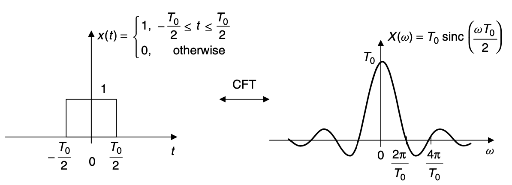
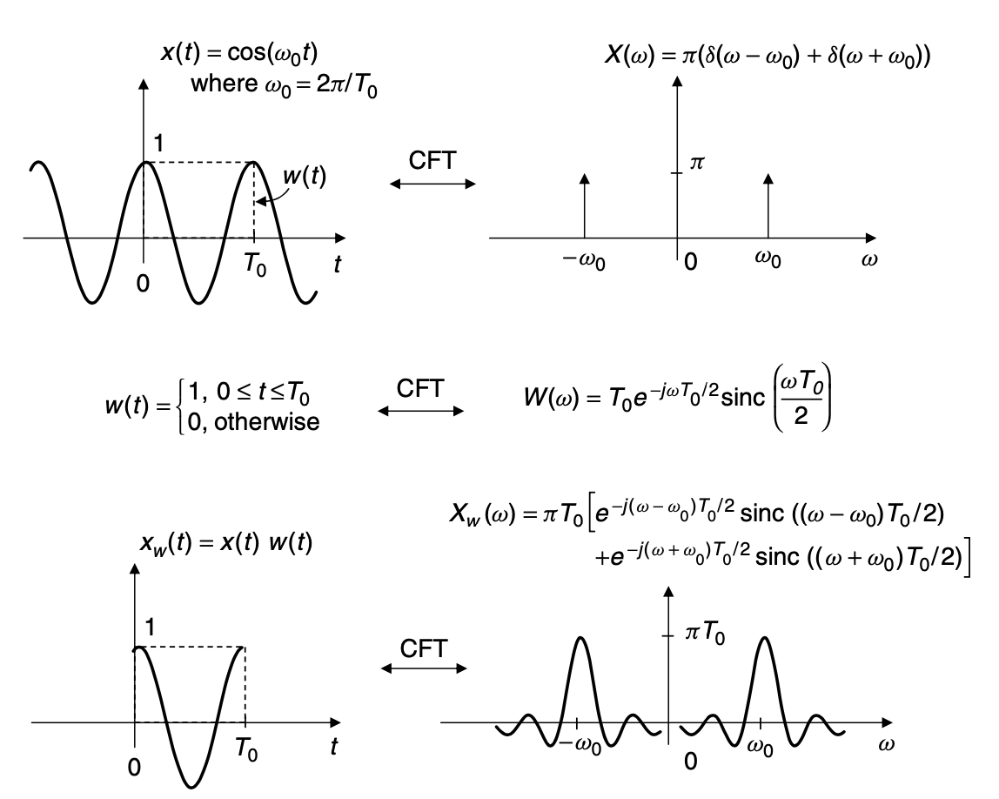

<head>
    
    
</head>

# Table of Contents

1.  [简介](#orge466ec6)
2.  [模拟信号谱](#org6d08dbb)

# 简介

这里描述的信号处理理论将限制在音频编解码相关概念上。因为本章的限制，我们提供大多数量化描述和只确立必要的数学公式。首先，我们简单回顾连续时间信号和系统和用来特征模拟信号频谱的方法的基本知识。然后呈现模拟过滤和子序列描述离散时间信号的基础。覆盖的离散时间信号基础包含：转换的基础呈现数字序列谱和数字过滤的理论。必要的随机和多速率信号处理

# 模拟信号谱

模拟信号的频率谱描述为连续傅立叶变换(CFT)。连续时间信号的CFT, x(t)，被给定为

$ X(\\omega) = \\int^{\\infty}_ {- \\infty} x(t)e^{-j \\omega t} dt $

$ \\omega $是每秒弧度的频率。注意 $ \\omega = 2 \\pi f $，f是频率Hz。复数函数 $ X( \\omega ) $描述CFT大小和信号的相位谱。反向CFT被给定为

$ x(t) = \\frac{1}{2 \\pi} \\int^{\\infty}_ {-\\infty} X(\\omega)e^{j \\omega t}d \\omega $

反向CFT也被称为综合公式因为它描述时间域信号，x(t)，以复数正弦函数的形式。在CFT理论中，x(t)和 $ X(\\omega) $被称为转换对，例如

$ x(t) \\leftrightarrow X(\\omega) $
