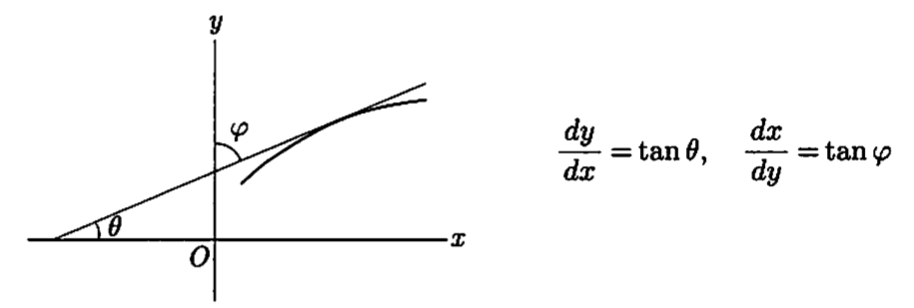
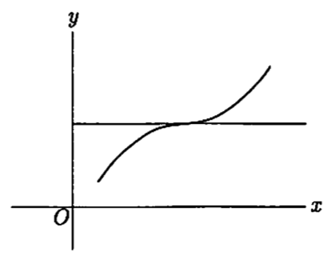
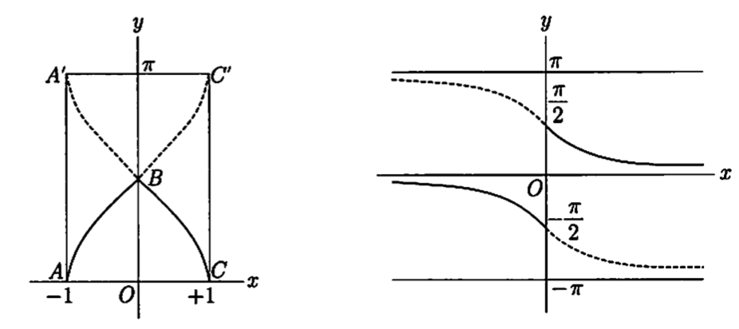

<head>
    
    
</head>

# Table of Contents

1.  [微分法](#orgf3ab5b6)
    1.  [微分方法](#orgb8fc619)
    2.  [复合函数的微分](#org58e77c9)
    3.  [逆函数的微分法](#org795a647)
    4.  [指数函数和对数函数](#orgfef7530)
    5.  [高阶微分法](#org2fd2501)
    6.  [偏微分](#org027031c)

# 微分法

## 微分方法

**定理** 连续性是微分可能性的必要条件

但是它不是充分条件

例子，$ f(x) = x \\sin{\\frac{1}{x}}, f(0) = 0 $的f(x)在0时的区间上连续，x = 0时却不能微分。实际上

$ \\frac{f(h) - f(0)}{h} = \\sin{\\frac{1}{h}} $

当 $ h \\to 0 $时，极限不存在

上述函数在x = 0这一点是特异点，Weierstras（1872）作出了区间各点都不能微分的连续函数的例子时，震惊了当时的数学界

## 复合函数的微分

**定理** f(x) $ \\varphi(t) $微分存在，则 $ F(t) = f(\\varphi(t)) $微分存在

$ F^{\\prime} (t) = f^{\\prime}(x) \\cdot \\varphi^{\\prime}(t) $

即

$ \\frac{dy}{dt} = \\frac{dy}{dx} \\cdot \\frac{dx}{dt} $

这是复合函数的微分法

**证明** t的变动为 $ \\Delta t $，x的变动为 $ \\Delta x $，这样y的变动为 $ \\Delta y $

$ \\frac{\\Delta y }{\\Delta t} = \\frac{\\Delta y}{\\Delta x} \\cdot \\frac{\\Delta x}{\\Delta t} $

当 $ \\Delta t \\to 0 $时

$ \\frac{\\Delta x}{\\Delta t} \\to \\frac{dx}{dt} $

同时当 $ \\Delta x \\to 0 $时

$ \\frac{\\Delta y}{\\Delta x} \\to \\frac{dy}{dx} $

所以

$ \\frac{\\Delta y}{\\Delta t} \\to \\frac{dy}{dx} \\cdot \\frac{dx}{dt} $

这样

$ F^{\\prime}(t) = f^{\\prime}(x)\\varphi^{\\prime}(t) $

注意上述证明方法的问题

x为独立变量，$ \\Delta x $任意的话需要 $ \\Delta x \\ne 0 $，上面的情况是x是t的函数值，$ \\Delta t $的值引起 $ \\Delta x = 0$的情况是有的。这样的话，之前的证明写法有不合理的地方，变量 $ \\Delta x, \\Delta y $的写法要做修改如下：

$ \\Delta y = f^{\\prime}(x) \\Delta x + \\epsilon \\Delta x, \\quad \\Delta x = \\varphi^{\\prime}(t)\\Delta t + \\epsilon^{\\prime} \\Delta t $

当 $ \\Delta t \\to 0 $时， $ \\epsilon^{\\prime} \\to 0 $，有 $ \\Delta x \\to 0 $，但 $ \\Delta t \\ne 0 $时，$ \\Delta x = 0 $的情况也有。$ \\Delta x = 0 $时 $ \\epsilon = 0 $定义为 $ \\Delta t \\to 0 $时 $ \\epsilon \\to 0 $，这样

$ \\begin{aligned} \\Delta t &= (f^{\\prime}(x) + \\epsilon)(\\varphi^{\\prime}(t) + \\epsilon^{\\prime}) \\Delta t \\\\ &= f^{\\prime}(x)\\varphi^{\\prime}(t) \\cdot \\Delta t + [\\epsilon \\varphi^{\\prime}(t) + \\epsilon^{\\prime} f^{\\prime}(x) + \\epsilon \\epsilon^{\\prime}] \\Delta t \\end{aligned} $

右边括弧中的用 $ \\epsilon^{\\prime \\prime} $表达，则

$ \\Delta y = f^{\\prime}(x) \\varphi^{\\prime}(t) \\Delta t + \\epsilon^{\\prime \\prime} \\Delta t, \\quad \\epsilon^{\\prime \\prime} = \\epsilon \\varphi^{\\prime}(t) + \\epsilon^{\\prime} f^{\\prime}(x) + \\epsilon \\epsilon^{\\prime} $

当 $ \\Delta t \\to 0 $时 $ \\epsilon^{\\prime \\prime} \\to 0 $，则

$ dy = f^{\\prime}(x) \\varphi^{\\prime}(t) dt $

这样结果为

$ dy = f^{\\prime}(x)dx $

同样，y为x的函数，x为t的函数，t为u的函数时，微分为

$ \\frac{dy}{du} = \\frac{dy}{dx} \\frac{dx}{dt} \\frac{dt}{du} $

## 逆函数的微分法

假设有一个 $ a \\le x \\le b $区间上的连续函数y = f(x)。如果y在该区间的最大值和最小值为p和q，则y可取遍 $ p \\le y \\le q $区间上的任意值。但是，只有当y = f(x)是单调的，才能通过x值唯一确定一个y值

如果f(x)不是单调的，$ x_ {1} < x_ {2} < x_ {3} $对应 $ y_ {1} < y_ {2} < y_ {3} $及$ y_ {1} > y_ {2} > y_ {3} $都有可能。如果 $ y_ {1} < y_ {2}, y_ {2} > y_ {3}, y_ {2} \\eta > Max(y_ {1}, y_ {3}) $，区间 $ (x_ {1}, x_ {2}) $及 $ (x_ {2}, x_ {3}), \\eta = f(x) $的x的值最少会出现一次

单调的时候，区间 $ p \\le y \\le q $中y=f(x)中各种值唯一对应。对应 $ x = \\varphi(y), \\varphi $是f的逆函数。这样，f是 $ \\varphi $的逆函数，f和 $ \\varphi $互为逆函数

**定理18** 关于x的区间的函数y单调且连续，则y的变动区间中x是其反函数。反函数也连续单调。如果y可微则x也可微

$ \\frac{dy}{dx} \\cdot \\frac{dy}{dx} = 1 $

证明：我们用y = f(x), $ x = \\varphi(y) $表示两个函数。$ x = \\xi $对应 $ y = \\eta $。$ \\{y_ {n}\\} $为收敛到 $ \\eta $的任意单调数列，对应 $ \\{x_ {n} \\} $单调有界，极限值收敛到 $ \\lambda $。由于f(x)的连续性，$ f(\\lambda) = \\eta $，则有 $ \\lambda = \\varphi(\\eta) = \\xi $。则 $ y_ {n} \\to \\eta $的同时 $ x_ {n} \\to \\xi $，即 $ \\varphi(y_ {n}) \\to \\varphi(\\eta) $，这样反函数 $ \\varphi(y) $连续

有

$ \\frac{\\Delta x}{\\Delta y} = 1 / \\frac{\\Delta y}{\\Delta x} $

当 $ \\Delta y \\to 0 $时，有$ \\Delta x \\to 0 $，同时 $ \\lim{\\frac{\\Delta x}{\\Delta y}} = 1 / \\lim{\\frac{\\Delta y}{\\Delta x}} $，即 $ \\frac{d x}{d y} = 1 / \\frac{d y}{d x} $

但 $ \\frac{d y}{d x} = 0 $的情况要排除

取三角函数的逆函数的例子

(1) $ \\arcsin{x} $

y = sinx 在区间 $ - \\frac{\\pi}{2} \\le x \\le \\frac{\\pi}{2} $，一般化区间为

$ (2n - 1)\\frac{\\pi}{2} \\le x \\le (2n + 1)\\frac{\\pi}{2}, \\qquad (n = 0, \\pm 1, \\pm 2, \\cdots) $

内单调，y在区间 $ -1 \\le y \\le 1 $之间取值。则函数y = sinx的逆函数，即 $ x = \\arcsin{y} $中y在 $ -1 \\le y \\le 1 $之间，所以x必须限定为上述区间中的一个

这样从y = sinx中有

$ \\frac{d \\sin{x}}{d x} = \\cos{x}, \\qquad \\frac{d \\arcsin{y}}{d y} = \\frac{1}{\\cos{x}} = \\pm \\frac{1}{\\sqrt{1 - y^{2}}} $

由于我们选取 $ - \\frac{\\pi}{2} \\le x \\le \\frac{\\pi}{2} $区间，则 $ \\cos{x} \\ge 0 $。则这里 $ \\pm $应该为 +，这样变量x，y置换可得

$ d \\arcsin{x} = \\frac{1}{\\sqrt{1 - x^{2}}} $

(2) $ \\arctan{x} $

$ y = \\tan{x} $在区间 $ - \\frac{\\pi}{2} < x < \\frac{\\pi}{2} $内从 $ -\\infty $ 到 $ + \\infty $单调递增。这样arctan定义为

$ y = \\arctan{x}, \\qquad - \\frac{\\pi}{2} < y < \\frac{\\pi}{2} $

例如：

$ \\arctan{0} = 0, \\qquad \\arctan{\\pm 1} = \\pm \\frac{\\pi}{4} \\\\ \\arctan{\\pm \\infty} = \\lim_ {x \\to \\pm \\infty} \\arctan{x} = \\pm \\frac{\\pi}{2} $

从 $ y = \\tan{x}, \\frac{dy}{dx} = \\frac{1}{\\cos^{2}{x}} = 1 + y^{2} $，通过记号变换，有

$ \\operatorname{D}{\\arctan{x}} = \\frac{1}{1 + x^{2}} $

例1，$ y = \\arcsin{\\sqrt{1 - x^{2}}} $意味着 $ \\sqrt{1 - x^{2}} = \\sin{y} $。从而 $ x^{2} = \\cos^{2}{y}, x = \\pm \\cos{y} $。$ \\arcsin $的主值在ABC如下图，y的主值微分为

$ \\frac{dy}{dx} = \\frac{1}{\\sqrt{1 - (1 - x^{2})}} \\frac{-x}{\\sqrt{1 - x^{2}}} = \\frac{1}{\| x \|} \\frac{-x}{\\sqrt{1 - x^{2}}} = \\mp \\frac{1}{\\sqrt{1 - x^{2}}} \\qquad (x \\ge 0) $

当x = 0时 $ \\operatorname{D^{+}}{y} = -1, \\operatorname{D^{-}}{y} = +1 $

## 指数函数和对数函数

当a > 0时，对 $ a^{x} $微分有

$ \\frac{d(a^{x})}{dx} = \\lim_ {h \\to 0}{\\frac{a^{x+h} - a^{x}}{h}} = a^{x} \\lim_ {h \\to 0}\\frac{a^{h} - 1}{h} $

因为h > 0，则 $ a^{h} > 1 $，则设 $ a^{h} = 1 + \\frac{1}{t}, t > 0 $。当 $ h \\to 0, a^{h} \\to 1, t \\to \\infty $

从 $ h = \\log_ {a}{(1 + \\frac{1}{t})} $中得到

$ \\frac{a^{h} - 1}{h} = \\frac{\\frac{1}{t}}{\\log_ {a}{(1 + \\frac{1}{t})}} = \\frac{1}{\\log_ {a}{(1 + \\frac{1}{t})^{t}}} $

当 $ h \\to 0, t \\to \\infty $有 $ (1 + \\frac{1}{t})^{t} \\to e $，因为 $ \\log_ {a} $是连续函数，$ h \\to 0 $时 $ \\log_ {a}{(1 + \\frac{1}{t})^{t}} \\to \\log_ {a}{e} $。则

$ \\lim_ {h \\to 0}{\\frac{a^{h} - 1}{h}} = \\frac{1}{\\log_ {a}{e}} = \\log_ {e}{a} $

当h < 0时，把h用-h带入，得：

$ \\frac{a^{-h} - 1}{-h} = \\frac{a^{h} - 1}{h} \\cdot \\frac{1}{a^{h}}, \\qquad (h > 0) $

当 $ h \\to 0 $时， $ a^{h} \\to 1 $，则有

$ \\frac{a^{-h} - 1}{-h} \\to \\log_ {e}{a} $

所以

$ \\frac{d(a^{x})}{dx} = a^{x} \\log_ {e}{a} $

**对数微分法** u, v, w为x的函数，u, v, w在x = 0时，$ \\log{\| uvw \|} $微分为

$ \\operatorname{D}\\log{ \| uvw \| } = \\operatorname{D}{(\\log{\| u \|} + \\log{\| v \|} + \\log{\| w \|})} = \\frac{u^{\\prime}}{u} + \\frac{v^{\\prime}}{v} + \\frac{w^{\\prime}}{w} $

但是又

$ \\operatorname{D}{\\log{ \| uvw \| }} = \\frac{(uvw)^{\\prime}}{uvw} $

则

$ \\frac{(uvw)^{\\prime}}{uvw} = \\frac{u^{\\prime}}{u} + \\frac{v^{\\prime}}{v} + \\frac{w^{\\prime}}{w}, \\qquad (u \\ne 0, v \\ne 0, w \\ne 0) $

同样的

$ (\\frac{u}{v})^{\\prime} / \\frac{u}{v} = \\frac{u^{\\prime}}{u} - \\frac{v^{\\prime}}{v} $

## 高阶微分法

y = f(x)的导数是 $ f^{\\prime}(x) $，$ f^{\\prime}(x) $的导数是 $ f^{\\prime \\prime}(x) $。第n阶导数是 $ f^{(n)}(x) $。$ f^{\\prime \\prime}(x) $可写为

$ \\frac{d}{dx} (\\frac{dy}{dx}) \\text{ 或 } \\frac{d^{2} y}{dx^{2}} $

同样的

$ \\frac{d^{n}y}{dx^{n}} = f^{(n)}(x) $

上述记号中，$ dx^{2} $是 $ (dx)^{2} $，$ d^{2}y $是 $ d(dy) $，微分记号可写为

$ dy = y^{\\prime}_ {x} dx $

两边微分，$ d(dy), d(dx) $表示 $ d^{2}y, d^{2} x $，得

$ d^{2}y = y^{\\prime \\prime}_ {x}(dx)^{2} + y^{\\prime}_ {x}d^{2}x $

这里x为独立变量，$ dx = \\delta x $，$ d^{2}x = d(\\delta x) = 0 $，则

$ d^{2}y = y^{\\prime \\prime}_ {x}dx^{2} $

则 $ \\frac{d^{2}y}{dx^{2}} = f^{\\prime \\prime}(x) $。而 $ x = \\varphi(t) $，有 $ d^{2}x = x^{\\prime \\prime}_ {t}dt^{2} $，则

$ d^{2}y = y^{\\prime \\prime}_ {x}x^{\\prime 2}_ {t} dt^{2} + y^{\\prime}_ {x}x^{\\prime \\prime}_ {t}dt^{2} $

则有

$ \\frac{d^{2}}{dt^{2}} f(\\varphi(t)) = f^{\\prime \\prime}(\\varphi(t)) \\varphi^{\\prime}(t)^{2} + f^{\\prime}(\\varphi(t))\\varphi^{\\prime \\prime}(t) $

u, v为x的函数，则根据Leibniz法则有

$ \\frac{d^{n}(uv)}{dx^{n}} = u^{(n)}v + {n \\choose 1}u^{(n-1)}v^{\\prime} + \\cdots + {n \\choose k}u^{(n-k)}v^{(k)} + \\cdots + uv^{(n)} $

而 $ u / v $的高阶导函数没有简单的函数表示

## 偏微分

两个以上的变量，根据一个变量变动，相关的微分叫做偏微分。例如z = f(x, y)

$ \\frac{\\partial z}{\\partial x} = \\lim_ {\\Delta x \\to 0} \\frac{f(x + \\Delta x, y) - f(x,y)}{\\Delta x}, \\qquad \\frac{\\partial z}{\\partial y} = \\lim_ {\\Delta y \\to 0} \\frac{f(x, y+\\Delta y) - f(x, y)}{\\Delta y} $

当区域内各点关于 $ \\frac{\\partial z}{\\partial x}, \\frac{\\partial z}{\\partial y} $存在时，这样的x, y函数

$ \\frac{\\partial z}{\\partial x} = f_ {x}(x, y) = D_ {x} f(x, y), \\quad \\frac{\\partial z}{\\partial y} = f_ {y}(x, y) = D_ {y}f(x, y) $

同样对高阶微分

$ \\frac{\\partial}{\\partial x} (\\frac{\\partial z}{\\partial x}) = \\frac{\\partial^{2} z}{\\partial x^{2}} = f_ {xx}(x, y) $

$ \\frac{\\partial}{\\partial y} (\\frac{\\partial z}{\\partial x}) = \\frac{\\partial^{2} z}{\\partial x \\partial y} = f_ {xy}(x, y), \\quad \\frac{\\partial}{\\partial x} (\\frac{\\partial z}{\\partial y}) = \\frac{\\partial^{2} z}{\\partial y \\partial x} = f_ {yx}(x, y) $

$ \\frac{\\partial}{\\partial y} (\\frac{\\partial z}{\\partial y}) = \\frac{\\partial^{2} z}{\\partial y^{2}} = f_ {yy}(x, y) $

三个以上的变量也一样

例1 $ \\sqrt{x^{2} + y^{2}} = r $

$ f(x, y) = \\log{r} = \\frac{1}{2} \\log{x^{2} + y^{2}} $

然而

$ f_ {x} = \\frac{x}{x^{2} + y^{2}} = \\frac{x}{r^{2}}, \\qquad f_ {y} = \\frac{y}{r^{2}} $

$ f_ {xx} = \\frac{1}{x^{2} + y^{2}} - \\frac{2x^{2}}{(x^{2}+y^{2})^{2}} = \\frac{1}{r^{2}} - \\frac{2x^{2}}{r^{4}} $

$ f_ {xy} = - \\frac{2xy}{(x^{2} + y^{2})^{2}} = - \\frac{2xy}{r^{4}} = f_ {yx} $

$ f_ {yy} = \\frac{1}{r^{2}} - \\frac{2y^{2}}{r^{4}} $

$ \\frac{\\partial^{2}f}{\\partial x^{2}} + \\frac{\\partial^{2} f}{\\partial y^{2}} $用 $ \\Delta f $表示，则

$ \\Delta f = \\frac{\\partial^{2} f}{\\partial x^{2}} + \\frac{\\partial^{2} f}{\\partial y^{2}} = \\frac{2}{r^{2}} - \\frac{2(x^{2} + y^{2})}{r^{4}} = 0 $

例2 $ \\sqrt{x^{2} + y^{2} + z^{2}} = r, f(x, y, z) = \\frac{1}{r} = (x^{2} + y^{2} + z^{2})^{- \\frac{1}{2}} $

$ f_ {x} = - \\frac{x}{(x^{2} + y^{2} + z^{2})^{\\frac{3}{2}}} = - \\frac{x}{r^{3}}, \\qquad f_ {y} = - \\frac{y}{r^{3}}, \\qquad f_ {z} = - \\frac{z}{r^{3}} $

$ f_ {xx} = - \\frac{1}{r^{3}} - x\\{-3 \\frac{1}{r^{4}} \\cdot \\frac{\\partial r}{\\partial x} \\} = - \\frac{1}{r^{3}} + \\frac{3x}{r^{4}} \\cdot \\frac{x}{r} = - \\frac{1}{r^{3}} + \\frac{3x^{2}}{r^{5}} $

$ f_ {yy} = - \\frac{1}{r^{3}} + \\frac{3y^{2}}{r^{5}} $

$ f_ {zz} = - \\frac{1}{r^{3}} + \\frac{3z^{2}}{r^{5}} $

$ \\Delta f = \\frac{\\partial^{2} f}{\\partial x^{2}} + \\frac{\\partial^{2} f}{\\partial y^{2}} + \\frac{\\partial^{2} f}{\\partial z^{2}} = - \\frac{3}{r^{3}} + \\frac{3(x^{2} + y^{2} + z^{2})}{r^{5}} = - \\frac{3}{r^{3}} + \\frac{3r^{2}}{r^{5}} = 0 $

$ f_ {xy} = -x(-3 \\frac{1}{r^{4}} \\cdot \\frac{\\partial r}{\\partial y}) = 3 \\frac{xy}{r^{5}} = f_ {yx} $
