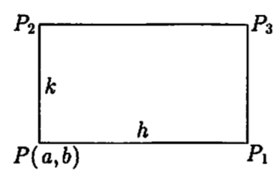
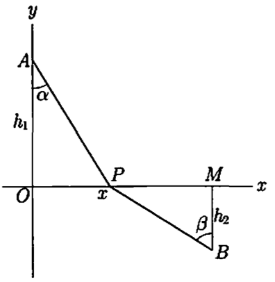
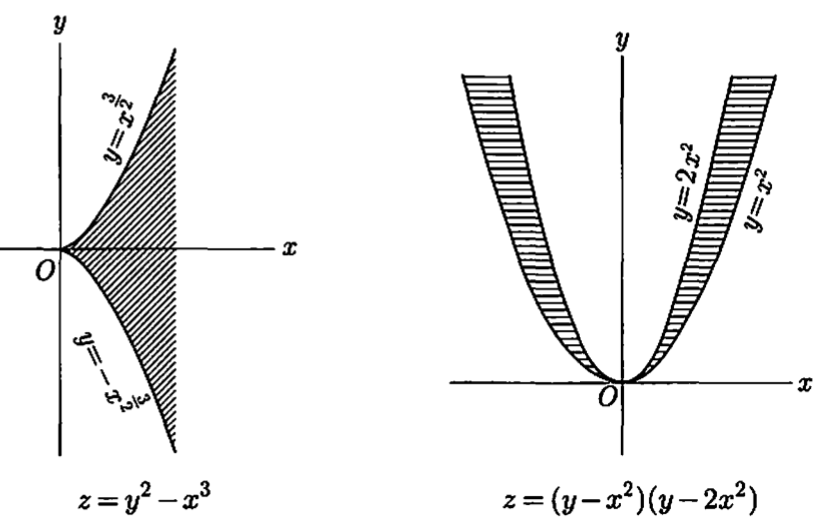
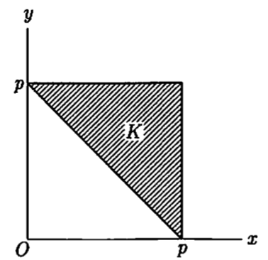
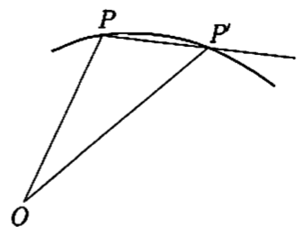
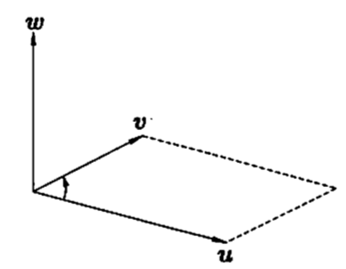
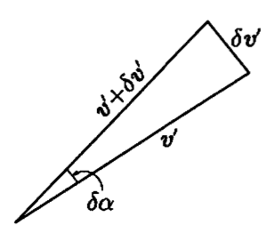

<head>
    
    
</head>

# Table of Contents

1.  [微分法](#orgf3ab5b6)
    1.  [微分方法](#orgb8fc619)
    2.  [复合函数的微分](#org58e77c9)
    3.  [逆函数的微分法](#org795a647)
    4.  [指数函数和对数函数](#orgfef7530)
    5.  [高阶微分法](#org2fd2501)
    6.  [偏微分](#org027031c)
    7.  [微分可能性 全微分](#org6b41390)
    8.  [微分的顺序](#orgb82b151)
    9.  [高阶的全微分](#org76e122d)
    10. [Taylor公式](#org18dfda1)
    11. [极大极小](#org2f5a766)
    12. [切线和曲率](#orgb764003)

# 微分法

## 微分方法

**定理** 连续性是微分可能性的必要条件

但是它不是充分条件

例子，$ f(x) = x \\sin{\\frac{1}{x}}, f(0) = 0 $的f(x)在0时的区间上连续，x = 0时却不能微分。实际上

$ \\frac{f(h) - f(0)}{h} = \\sin{\\frac{1}{h}} $

当 $ h \\to 0 $时，极限不存在

上述函数在x = 0这一点是特异点，Weierstras（1872）作出了区间各点都不能微分的连续函数的例子时，震惊了当时的数学界

## 复合函数的微分

**定理** f(x) $ \\varphi(t) $微分存在，则 $ F(t) = f(\\varphi(t)) $微分存在

$ F^{\\prime} (t) = f^{\\prime}(x) \\cdot \\varphi^{\\prime}(t) $

即

$ \\frac{dy}{dt} = \\frac{dy}{dx} \\cdot \\frac{dx}{dt} $

这是复合函数的微分法

**证明** t的变动为 $ \\Delta t $，x的变动为 $ \\Delta x $，这样y的变动为 $ \\Delta y $

$ \\frac{\\Delta y }{\\Delta t} = \\frac{\\Delta y}{\\Delta x} \\cdot \\frac{\\Delta x}{\\Delta t} $

当 $ \\Delta t \\to 0 $时

$ \\frac{\\Delta x}{\\Delta t} \\to \\frac{dx}{dt} $

同时当 $ \\Delta x \\to 0 $时

$ \\frac{\\Delta y}{\\Delta x} \\to \\frac{dy}{dx} $

所以

$ \\frac{\\Delta y}{\\Delta t} \\to \\frac{dy}{dx} \\cdot \\frac{dx}{dt} $

这样

$ F^{\\prime}(t) = f^{\\prime}(x)\\varphi^{\\prime}(t) $

注意上述证明方法的问题

x为独立变量，$ \\Delta x $任意的话需要 $ \\Delta x \\ne 0 $，上面的情况是x是t的函数值，$ \\Delta t $的值引起 $ \\Delta x = 0$的情况是有的。这样的话，之前的证明写法有不合理的地方，变量 $ \\Delta x, \\Delta y $的写法要做修改如下：

$ \\Delta y = f^{\\prime}(x) \\Delta x + \\epsilon \\Delta x, \\quad \\Delta x = \\varphi^{\\prime}(t)\\Delta t + \\epsilon^{\\prime} \\Delta t $

当 $ \\Delta t \\to 0 $时， $ \\epsilon^{\\prime} \\to 0 $，有 $ \\Delta x \\to 0 $，但 $ \\Delta t \\ne 0 $时，$ \\Delta x = 0 $的情况也有。$ \\Delta x = 0 $时 $ \\epsilon = 0 $定义为 $ \\Delta t \\to 0 $时 $ \\epsilon \\to 0 $，这样

$ \\begin{aligned} \\Delta t &= (f^{\\prime}(x) + \\epsilon)(\\varphi^{\\prime}(t) + \\epsilon^{\\prime}) \\Delta t \\\\ &= f^{\\prime}(x)\\varphi^{\\prime}(t) \\cdot \\Delta t + [\\epsilon \\varphi^{\\prime}(t) + \\epsilon^{\\prime} f^{\\prime}(x) + \\epsilon \\epsilon^{\\prime}] \\Delta t \\end{aligned} $

右边括弧中的用 $ \\epsilon^{\\prime \\prime} $表达，则

$ \\Delta y = f^{\\prime}(x) \\varphi^{\\prime}(t) \\Delta t + \\epsilon^{\\prime \\prime} \\Delta t, \\quad \\epsilon^{\\prime \\prime} = \\epsilon \\varphi^{\\prime}(t) + \\epsilon^{\\prime} f^{\\prime}(x) + \\epsilon \\epsilon^{\\prime} $

当 $ \\Delta t \\to 0 $时 $ \\epsilon^{\\prime \\prime} \\to 0 $，则

$ dy = f^{\\prime}(x) \\varphi^{\\prime}(t) dt $

这样结果为

$ dy = f^{\\prime}(x)dx $

同样，y为x的函数，x为t的函数，t为u的函数时，微分为

$ \\frac{dy}{du} = \\frac{dy}{dx} \\frac{dx}{dt} \\frac{dt}{du} $

## 逆函数的微分法

假设有一个 $ a \\le x \\le b $区间上的连续函数y = f(x)。如果y在该区间的最大值和最小值为p和q，则y可取遍 $ p \\le y \\le q $区间上的任意值。但是，只有当y = f(x)是单调的，才能通过x值唯一确定一个y值

如果f(x)不是单调的，$ x_ {1} < x_ {2} < x_ {3} $对应 $ y_ {1} < y_ {2} < y_ {3} $及$ y_ {1} > y_ {2} > y_ {3} $都有可能。如果 $ y_ {1} < y_ {2}, y_ {2} > y_ {3}, y_ {2} \\eta > Max(y_ {1}, y_ {3}) $，区间 $ (x_ {1}, x_ {2}) $及 $ (x_ {2}, x_ {3}), \\eta = f(x) $的x的值最少会出现一次

单调的时候，区间 $ p \\le y \\le q $中y=f(x)中各种值唯一对应。对应 $ x = \\varphi(y), \\varphi $是f的逆函数。这样，f是 $ \\varphi $的逆函数，f和 $ \\varphi $互为逆函数

**定理18** 关于x的区间的函数y单调且连续，则y的变动区间中x是其反函数。反函数也连续单调。如果y可微则x也可微

$ \\frac{dy}{dx} \\cdot \\frac{dy}{dx} = 1 $

证明：我们用y = f(x), $ x = \\varphi(y) $表示两个函数。$ x = \\xi $对应 $ y = \\eta $。$ \\{y_ {n}\\} $为收敛到 $ \\eta $的任意单调数列，对应 $ \\{x_ {n} \\} $单调有界，极限值收敛到 $ \\lambda $。由于f(x)的连续性，$ f(\\lambda) = \\eta $，则有 $ \\lambda = \\varphi(\\eta) = \\xi $。则 $ y_ {n} \\to \\eta $的同时 $ x_ {n} \\to \\xi $，即 $ \\varphi(y_ {n}) \\to \\varphi(\\eta) $，这样反函数 $ \\varphi(y) $连续

有

$ \\frac{\\Delta x}{\\Delta y} = 1 / \\frac{\\Delta y}{\\Delta x} $

当 $ \\Delta y \\to 0 $时，有$ \\Delta x \\to 0 $，同时 $ \\lim{\\frac{\\Delta x}{\\Delta y}} = 1 / \\lim{\\frac{\\Delta y}{\\Delta x}} $，即 $ \\frac{d x}{d y} = 1 / \\frac{d y}{d x} $

但 $ \\frac{d y}{d x} = 0 $的情况要排除

取三角函数的逆函数的例子

(1) $ \\arcsin{x} $

y = sinx 在区间 $ - \\frac{\\pi}{2} \\le x \\le \\frac{\\pi}{2} $，一般化区间为

$ (2n - 1)\\frac{\\pi}{2} \\le x \\le (2n + 1)\\frac{\\pi}{2}, \\qquad (n = 0, \\pm 1, \\pm 2, \\cdots) $

内单调，y在区间 $ -1 \\le y \\le 1 $之间取值。则函数y = sinx的逆函数，即 $ x = \\arcsin{y} $中y在 $ -1 \\le y \\le 1 $之间，所以x必须限定为上述区间中的一个

这样从y = sinx中有

$ \\frac{d \\sin{x}}{d x} = \\cos{x}, \\qquad \\frac{d \\arcsin{y}}{d y} = \\frac{1}{\\cos{x}} = \\pm \\frac{1}{\\sqrt{1 - y^{2}}} $

由于我们选取 $ - \\frac{\\pi}{2} \\le x \\le \\frac{\\pi}{2} $区间，则 $ \\cos{x} \\ge 0 $。则这里 $ \\pm $应该为 +，这样变量x，y置换可得

$ d \\arcsin{x} = \\frac{1}{\\sqrt{1 - x^{2}}} $

(2) $ \\arctan{x} $

$ y = \\tan{x} $在区间 $ - \\frac{\\pi}{2} < x < \\frac{\\pi}{2} $内从 $ -\\infty $ 到 $ + \\infty $单调递增。这样arctan定义为

$ y = \\arctan{x}, \\qquad - \\frac{\\pi}{2} < y < \\frac{\\pi}{2} $

例如：

$ \\arctan{0} = 0, \\qquad \\arctan{\\pm 1} = \\pm \\frac{\\pi}{4} \\\\ \\arctan{\\pm \\infty} = \\lim_ {x \\to \\pm \\infty} \\arctan{x} = \\pm \\frac{\\pi}{2} $

从 $ y = \\tan{x}, \\frac{dy}{dx} = \\frac{1}{\\cos^{2}{x}} = 1 + y^{2} $，通过记号变换，有

$ \\operatorname{D}{\\arctan{x}} = \\frac{1}{1 + x^{2}} $

例1，$ y = \\arcsin{\\sqrt{1 - x^{2}}} $意味着 $ \\sqrt{1 - x^{2}} = \\sin{y} $。从而 $ x^{2} = \\cos^{2}{y}, x = \\pm \\cos{y} $。$ \\arcsin $的主值在ABC如下图，y的主值微分为

$ \\frac{dy}{dx} = \\frac{1}{\\sqrt{1 - (1 - x^{2})}} \\frac{-x}{\\sqrt{1 - x^{2}}} = \\frac{1}{\| x \|} \\frac{-x}{\\sqrt{1 - x^{2}}} = \\mp \\frac{1}{\\sqrt{1 - x^{2}}} \\qquad (x \\ge 0) $

当x = 0时 $ \\operatorname{D^{+}}{y} = -1, \\operatorname{D^{-}}{y} = +1 $

## 指数函数和对数函数

当a > 0时，对 $ a^{x} $微分有

$ \\frac{d(a^{x})}{dx} = \\lim_ {h \\to 0}{\\frac{a^{x+h} - a^{x}}{h}} = a^{x} \\lim_ {h \\to 0}\\frac{a^{h} - 1}{h} $

因为h > 0，则 $ a^{h} > 1 $，则设 $ a^{h} = 1 + \\frac{1}{t}, t > 0 $。当 $ h \\to 0, a^{h} \\to 1, t \\to \\infty $

从 $ h = \\log_ {a}{(1 + \\frac{1}{t})} $中得到

$ \\frac{a^{h} - 1}{h} = \\frac{\\frac{1}{t}}{\\log_ {a}{(1 + \\frac{1}{t})}} = \\frac{1}{\\log_ {a}{(1 + \\frac{1}{t})^{t}}} $

当 $ h \\to 0, t \\to \\infty $有 $ (1 + \\frac{1}{t})^{t} \\to e $，因为 $ \\log_ {a} $是连续函数，$ h \\to 0 $时 $ \\log_ {a}{(1 + \\frac{1}{t})^{t}} \\to \\log_ {a}{e} $。则

$ \\lim_ {h \\to 0}{\\frac{a^{h} - 1}{h}} = \\frac{1}{\\log_ {a}{e}} = \\log_ {e}{a} $

当h < 0时，把h用-h带入，得：

$ \\frac{a^{-h} - 1}{-h} = \\frac{a^{h} - 1}{h} \\cdot \\frac{1}{a^{h}}, \\qquad (h > 0) $

当 $ h \\to 0 $时， $ a^{h} \\to 1 $，则有

$ \\frac{a^{-h} - 1}{-h} \\to \\log_ {e}{a} $

所以

$ \\frac{d(a^{x})}{dx} = a^{x} \\log_ {e}{a} $

**对数微分法** u, v, w为x的函数，u, v, w在x = 0时，$ \\log{\| uvw \|} $微分为

$ \\operatorname{D}\\log{ \| uvw \| } = \\operatorname{D}{(\\log{\| u \|} + \\log{\| v \|} + \\log{\| w \|})} = \\frac{u^{\\prime}}{u} + \\frac{v^{\\prime}}{v} + \\frac{w^{\\prime}}{w} $

但是又

$ \\operatorname{D}{\\log{ \| uvw \| }} = \\frac{(uvw)^{\\prime}}{uvw} $

则

$ \\frac{(uvw)^{\\prime}}{uvw} = \\frac{u^{\\prime}}{u} + \\frac{v^{\\prime}}{v} + \\frac{w^{\\prime}}{w}, \\qquad (u \\ne 0, v \\ne 0, w \\ne 0) $

同样的

$ (\\frac{u}{v})^{\\prime} / \\frac{u}{v} = \\frac{u^{\\prime}}{u} - \\frac{v^{\\prime}}{v} $

## 高阶微分法

y = f(x)的导数是 $ f^{\\prime}(x) $，$ f^{\\prime}(x) $的导数是 $ f^{\\prime \\prime}(x) $。第n阶导数是 $ f^{(n)}(x) $。$ f^{\\prime \\prime}(x) $可写为

$ \\frac{d}{dx} (\\frac{dy}{dx}) \\text{ 或 } \\frac{d^{2} y}{dx^{2}} $

同样的

$ \\frac{d^{n}y}{dx^{n}} = f^{(n)}(x) $

上述记号中，$ dx^{2} $是 $ (dx)^{2} $，$ d^{2}y $是 $ d(dy) $，微分记号可写为

$ dy = y^{\\prime}_ {x} dx $

两边微分，$ d(dy), d(dx) $表示 $ d^{2}y, d^{2} x $，得

$ d^{2}y = y^{\\prime \\prime}_ {x}(dx)^{2} + y^{\\prime}_ {x}d^{2}x $

这里x为独立变量，$ dx = \\delta x $，$ d^{2}x = d(\\delta x) = 0 $，则

$ d^{2}y = y^{\\prime \\prime}_ {x}dx^{2} $

则 $ \\frac{d^{2}y}{dx^{2}} = f^{\\prime \\prime}(x) $。而 $ x = \\varphi(t) $，有 $ d^{2}x = x^{\\prime \\prime}_ {t}dt^{2} $，则

$ d^{2}y = y^{\\prime \\prime}_ {x}x^{\\prime 2}_ {t} dt^{2} + y^{\\prime}_ {x}x^{\\prime \\prime}_ {t}dt^{2} $

则有

$ \\frac{d^{2}}{dt^{2}} f(\\varphi(t)) = f^{\\prime \\prime}(\\varphi(t)) \\varphi^{\\prime}(t)^{2} + f^{\\prime}(\\varphi(t))\\varphi^{\\prime \\prime}(t) $

u, v为x的函数，则根据Leibniz法则有

$ \\frac{d^{n}(uv)}{dx^{n}} = u^{(n)}v + {n \\choose 1}u^{(n-1)}v^{\\prime} + \\cdots + {n \\choose k}u^{(n-k)}v^{(k)} + \\cdots + uv^{(n)} $

而 $ u / v $的高阶导函数没有简单的函数表示

## 偏微分

两个以上的变量，根据一个变量变动，相关的微分叫做偏微分。例如z = f(x, y)

$ \\frac{\\partial z}{\\partial x} = \\lim_ {\\Delta x \\to 0} \\frac{f(x + \\Delta x, y) - f(x,y)}{\\Delta x}, \\qquad \\frac{\\partial z}{\\partial y} = \\lim_ {\\Delta y \\to 0} \\frac{f(x, y+\\Delta y) - f(x, y)}{\\Delta y} $

当区域内各点关于 $ \\frac{\\partial z}{\\partial x}, \\frac{\\partial z}{\\partial y} $存在时，这样的x, y函数

$ \\frac{\\partial z}{\\partial x} = f_ {x}(x, y) = D_ {x} f(x, y), \\quad \\frac{\\partial z}{\\partial y} = f_ {y}(x, y) = D_ {y}f(x, y) $

同样对高阶微分

$ \\frac{\\partial}{\\partial x} (\\frac{\\partial z}{\\partial x}) = \\frac{\\partial^{2} z}{\\partial x^{2}} = f_ {xx}(x, y) $

$ \\frac{\\partial}{\\partial y} (\\frac{\\partial z}{\\partial x}) = \\frac{\\partial^{2} z}{\\partial x \\partial y} = f_ {xy}(x, y), \\quad \\frac{\\partial}{\\partial x} (\\frac{\\partial z}{\\partial y}) = \\frac{\\partial^{2} z}{\\partial y \\partial x} = f_ {yx}(x, y) $

$ \\frac{\\partial}{\\partial y} (\\frac{\\partial z}{\\partial y}) = \\frac{\\partial^{2} z}{\\partial y^{2}} = f_ {yy}(x, y) $

三个以上的变量也一样

例1 $ \\sqrt{x^{2} + y^{2}} = r $

$ f(x, y) = \\log{r} = \\frac{1}{2} \\log{x^{2} + y^{2}} $

然而

$ f_ {x} = \\frac{x}{x^{2} + y^{2}} = \\frac{x}{r^{2}}, \\qquad f_ {y} = \\frac{y}{r^{2}} $

$ f_ {xx} = \\frac{1}{x^{2} + y^{2}} - \\frac{2x^{2}}{(x^{2}+y^{2})^{2}} = \\frac{1}{r^{2}} - \\frac{2x^{2}}{r^{4}} $

$ f_ {xy} = - \\frac{2xy}{(x^{2} + y^{2})^{2}} = - \\frac{2xy}{r^{4}} = f_ {yx} $

$ f_ {yy} = \\frac{1}{r^{2}} - \\frac{2y^{2}}{r^{4}} $

$ \\frac{\\partial^{2}f}{\\partial x^{2}} + \\frac{\\partial^{2} f}{\\partial y^{2}} $用 $ \\Delta f $表示，则

$ \\Delta f = \\frac{\\partial^{2} f}{\\partial x^{2}} + \\frac{\\partial^{2} f}{\\partial y^{2}} = \\frac{2}{r^{2}} - \\frac{2(x^{2} + y^{2})}{r^{4}} = 0 $

例2 $ \\sqrt{x^{2} + y^{2} + z^{2}} = r, f(x, y, z) = \\frac{1}{r} = (x^{2} + y^{2} + z^{2})^{- \\frac{1}{2}} $

$ f_ {x} = - \\frac{x}{(x^{2} + y^{2} + z^{2})^{\\frac{3}{2}}} = - \\frac{x}{r^{3}}, \\qquad f_ {y} = - \\frac{y}{r^{3}}, \\qquad f_ {z} = - \\frac{z}{r^{3}} $

$ f_ {xx} = - \\frac{1}{r^{3}} - x\\{-3 \\frac{1}{r^{4}} \\cdot \\frac{\\partial r}{\\partial x} \\} = - \\frac{1}{r^{3}} + \\frac{3x}{r^{4}} \\cdot \\frac{x}{r} = - \\frac{1}{r^{3}} + \\frac{3x^{2}}{r^{5}} $

$ f_ {yy} = - \\frac{1}{r^{3}} + \\frac{3y^{2}}{r^{5}} $

$ f_ {zz} = - \\frac{1}{r^{3}} + \\frac{3z^{2}}{r^{5}} $

$ \\Delta f = \\frac{\\partial^{2} f}{\\partial x^{2}} + \\frac{\\partial^{2} f}{\\partial y^{2}} + \\frac{\\partial^{2} f}{\\partial z^{2}} = - \\frac{3}{r^{3}} + \\frac{3(x^{2} + y^{2} + z^{2})}{r^{5}} = - \\frac{3}{r^{3}} + \\frac{3r^{2}}{r^{5}} = 0 $

$ f_ {xy} = -x(-3 \\frac{1}{r^{4}} \\cdot \\frac{\\partial r}{\\partial y}) = 3 \\frac{xy}{r^{5}} = f_ {yx} $

## 微分可能性 全微分

函数z = f(x, y)的一点P = (x, y)。$ \\Delta z = f(x + \\Delta x, y + \\Delta y) - f(x, y) $，则

$ \\Delta z = A \\Delta x + B \\Delta y + \\varepsilon \\rho $

A, B是跟 $ \\Delta x, \\Delta y $无关的系数，点(x, y)的值有的话，$ \\rho $是定点(x,y)和动点 $ (x + \\Delta x, y + \\Delta y) $的距离 $ (\\rho = \\sqrt{(\\Delta x)^{2} + (\\Delta y)^{2}} ) $，$ \\varepsilon $跟 $ \\Delta x, \\Delta y $相关，$ \\rho \\to 0 $时，$ \\varepsilon \\to 0 $。用之前页的记号有 $ \\varepsilon \\rho = o \\rho $。这样函数z在点(x, y)微分是可能的

上面的等式成立的话，$ \\Delta y = 0, \\rho = \| \\Delta x \| $时，

$ \\frac{\\Delta z}{\\Delta x} = A \\pm \\varepsilon $

这时，$ \\Delta x \\to 0, \\varepsilon \\to 0 $的话，(x, y)的 $ \\frac{\\partial z}{\\partial x} $存在，为A。同样的，$ \\frac{\\partial z}{\\partial y} $存在，为B。点 $(x + \\Delta x, y + \\Delta y) $从点(x, y)一定方向上收敛时，$ \\alpha $确定，$ \\Delta x = \\rho \\cos{\\alpha}, \\Delta y = \\rho \\sin{\\alpha} $时，

$ \\frac{\\Delta z}{\\rho} = A \\cos{\\alpha} + B \\sin{\\alpha} + \\varepsilon $

$ \\lim_ {\\rho \\to 0} \\frac{\\Delta z}{\\rho} = A \\cos{\\alpha} + B \\sin{\\alpha} = \\frac{\\partial z}{\\partial x} \\cos{\\alpha} + \\frac{\\partial z}{\\partial y} \\sin{\\alpha} $

这种情况下，$ \\lim_ {\\rho \\to 0} \\frac{\\Delta z}{\\rho} $是 $ \\Delta x = \\rho \\cos{\\alpha}, \\Delta y = \\rho \\sin{\\alpha} $方向上的偏微分商

之前的等式成立的话各方向上的偏微分商存在，即为上式

z可微分的话，$ \\Delta z $的主要部分 $ \\Delta x, \\Delta y $的一次方程式 $ \\frac{\\partial z}{\\partial x} \\Delta x + \\frac{\\partial z}{\\partial y} \\Delta y $是z的全微分，用dz表示。特别地，z = x, z = y时 $ dx = \\Delta x, dy = \\Delta y $，这样全微分为

$ dz = \\frac{\\partial z}{\\partial x} dx + \\frac{\\partial z}{\\partial y} dy $

z可微分时 $ dz = \\frac{\\partial z}{\\partial x} \\Delta x + \\frac{\\partial z}{\\partial y} \\Delta y $为(x, y)关于曲面z = f(x, y)相接的平面。这样的平面上坐标为X, Y, Z的话，dx, dy, dz为 $ X - x, Y - y, Z - z $，接平面的方程式为

$ Z - z = \\frac{\\partial z}{\\partial x}(X - x) + \\frac{\\partial z}{\\partial y}(Y - y) $

这是接平面的定义

z = f(x, y)有领域的各点可微分时，这样的领域可微分。这样的情况下f(x, y)的领域是连续的

**定理** $ \\frac{\\partial z}{\\partial x}, \\frac{\\partial z}{\\partial y} $领域存在且连续的时候，z的领域可微分

证明 $ \\Delta x, \\Delta y $用h, k带入得

$ \\begin{aligned} \\Delta z &= f(x + h, y + k) - f(x, y) \\\\ &= \\{ f(x + h, y + k) - f(x, y + k)\\} + \\{ f(x, y + k) - f(x, y) \\} \\end{aligned} $

使用x的平均值定理

$ f(x + h, y + k) - f(x, y + k) = hf_ {x}(x + \\theta h, y + k), \\qquad 0 < \\theta < 1 $

假设 $ f_ {x} $ 连续

$ f_ {x}(x + \\theta h, y + k) = f_ {x}(x, y) + \\varepsilon $

如果 $ h \\to 0, k \\to 0 $时 $ \\varepsilon \\to 0 $

y的偏微分

$ f(x, y + k) - f(x, y) = kf_ {y}(x, y) - \\varepsilon^{\\prime} k $

$ k \\to 0 $时 $ \\varepsilon^{\\prime} \\to 0 $，则

$ \\Delta z = hf_ {x}(x, y) + k f_ {y}(x, y) + h \\varepsilon + k \\varepsilon^{\\prime} $

$ \| h \| \\le \\rho, \| k \| \\le \\rho, (\\rho = \\sqrt{h^{2} + k^{2}}) $，所以 $ \| h \\varepsilon + k \\varepsilon^{\\prime} \| \\le (\| \\varepsilon \| + \| \\varepsilon^{\\prime} \|) \\rho $ 

$ \\Delta z = hf_ {x}(x, y) + kf_ {y}(x, y) + o \\rho $

即z是可微分的

**注意** 该定理的假设过大，上述证明用了 $ f_ {x} $的连续性。领域内 $ z_ {x}, z_ {y} $关于点(x, y)存在，这样如果连续的话，该点的z可微分

## 微分的顺序

f(x, y)关于x微分得导函数$ f_ {x}(x, y) $，$ f_ {x}(x, y) $关于y微分的导函数为 $ f_ {xy} $。这样 $ f_ {xy}, f_ {yx} $指代不同的事物。然而在一定条件下，$ f_ {xy}, f_ {yx} $为同一函数。现在采用这些条件中最容易获得的条件：

**定理** 在某个区域 $ f_ {xy}, f_ {yx} $连续的话这样的区域 $ f_ {xy} = f_ {yx} $

证明 对区域的任意一点(a, b)的附近考察

$ \\Delta = f(a + h, b + k) - f(a + h, b) - f(a, b + k) + f(a, b) $

用图的记号有

$ \\Delta = f(P_ {3}) - f(P_ {1}) - f(P_ {2}) + f(P) $

写成

$ \\varphi(x) = f(x, b + k) - f(x, b) $

$ \\varphi(a) = f(P_ {2}) - f(P), \\varphi(a + h) = f(P_ {3}) - f(P_ {1}) $

$ \\Delta = \\varphi(a + h) - \\varphi(a) $

假设(a, b)附近 $ f_ {x} $存在，则

$ \\varphi^{\\prime}(x) = f_ {x}(x, b + k) - f_ {x}(x, b) $

这样x = a 和 x = a + h之间，用 $ \\varphi(x) $的平均值定理

$ \\varphi(a + h) - \\varphi(a) = h\\varphi^{\\prime}(a + \\theta h) \\qquad (0 < \\theta < 1) $

综合得

$ \\Delta = h\\{ f_ {x}(a + \\theta h, b + k) - f_ {x}(a + \\theta h, b) \\} $

假设(a, b)附近 $ f_ {xy} $存在，则右边y = b和y = b + k间，用平均值定理得

$ \\Delta = hkf_ {xy}(a + \\theta h, b + \\theta^{\\prime} k) \\qquad (0 < \\theta^{\\prime} < 1) $

假设 $ f_ {xy} $在(a, b)点连续，则

$ \\lim_ {(h, k) \\to (0, 0)} \\frac{\\Delta}{hk} = f_ {xy}(a, b) $

x,h和y,k交换可得

$ \\lim_ {h, k) \\to (0, 0)} \\frac{\\Delta}{hk} = f_ {yx}(a, b) $

这样，区域内各点有

$ f_ {xy} = f_ {yx} $

在 $ f_ {x}, f_ {y}, f_ {xy} $存在的区域，该区域内一点 $ f_ {xy} $连续，这样的点 $ f_ {yx} $存在，且 $ f_ {xy} = f_ {yx} $(Schwarz定理)

如果区域内 $ f_ {x}, f_ {y} $存在，区域内某点可微，则在该点 $ f_ {xy} = f_ {yx} $（Young定理）

这里可用之前的式子证明，假定h = k且 $ f_ {x} $可微

$ f_ {x}(a + \\theta h, b + h) = f_ {x}(a, b) + \\theta h f_ {xy}(a, b) + h f_ {xy}(a, b) + oh $

$ f_ {x}(a + \\theta h, b) = f_ {x}(a, b) + \\theta h f_ {xx}(a, b) + oh $

这样 $ \\Delta = h^{2} f_ {xy}(a, b) + oh^{2} $，有

$ \\lim_ {h \\to 0} \\frac{\\Delta}{h^{2}} = f_ {xy}(a, b) $

假设x, y对称，有$ f_ {xy}(a, b) = f_ {yx}(a, b) $

不能无条件的认为 $ f_ {xy} = f_ {yx} $，这个很重要，现在举一个例子

$ \\left\\{ \\begin{array}{ll} f(x,y) = xy \\frac{x^{2} - y^{2}}{x^{2} + y^{2}}, & (x, y) \\ne (0, 0), \\\\ f(0, 0) = 0 \\end{array} \\right. $

$ (x, y) \\ne (0, 0) $时计算得

$ f_ {x}(x, y) = \\frac{3x^{2} - y^{3}}{x^{2} + y^{2}} - \\frac{2x^{2}y(x^{2} - y^{2})}{(x^{2} + y^{2}x)^{2}} $

x,y 交换得 $ f_ {y} $，然而

$ f_ {xy}(x, y) = \\frac{x^{2} - y^{2}}{x^{2} + y^{2}} + \\frac{8x^{2}y^{2}(x^{2} - y^{2})}{(x^{2} + y^{2})^{3}} $

$ (x, y) \\ne (0, 0) $时连续，$ f_ {yx} $相等，然而，$ f_ {xy}(0, y)= -1, (y \\ne 0), \\lim_ {y \\to 0} f_ {xy}(0, y) = -1 $。然而，$ f_ {x}(0, y) = -y, y \\ne 0 $，$ f_ {x}(0, 0) = 0 $时$ f_ {x}(0, y) $在y = 0时连续，这样 $ f_ {xy}(0, 0) = -1 $。同样的，$ f_ {yx}(x, 0) = 1 $时 $ f_ {yx}(0, 0) = 1 $

三阶以上，导函数连续的话，可以改变微分顺序。例如 $ f_ {xxy} = (f_ {x})_ {xy} = (f_ {x})_ {yx} = f_ {xyx} $，相邻的顺序进行交换，这样

$ f_ {xyz} = f_ {xzy} = f_ {zxy} = f_ {zyx} = f_ {yzx} = f_ {yxz} $

$ f_ {xxyy} = f_ {xyxy} = f_ {xyyx} = f_ {yxxy} = f_ {yxyx} = f_ {yyxx} $

这样二阶导函数

$ f_ {x^{2}} = \\frac{\\partial^{2} f}{\\partial x^{2}}, \\qquad f_ {xy} = \\frac{\\partial^{2} f}{\\partial x \\partial y}, \\qquad f_ {y^{2}} = \\frac{\\partial^{2} f}{\\partial y^{2}} $

第n阶为

$ f_ {x^{r}y^{s}} = \\frac{\\partial^{n} f}{\\partial x^{r} \\partial y^{s}} \\qquad \\qquad (r + s = n, s = 0, 1, 2, \\ldots, n) $

## 高阶的全微分

u = f(x, y)的第一阶全微分

$ du = \\frac{\\partial u}{\\partial x}dx + \\frac{\\partial u}{\\partial y}dy $

$ \\frac{\\partial u}{\\partial x} $可微分，x, y关于du的全微分为 $ d^{2} u $

即x, y为独立变量(h = dx, k = dy)

$ \\begin{aligned} d^{2}u = d(du) &= \\frac{\\partial}{\\partial x}(\\frac{\\partial u}{\\partial x} h + \\frac{\\partial u}{\\partial y} k)h + \\frac{\\partial}{\\partial y}(\\frac{\\partial u}{\\partial x} h + \\frac{\\partial u}{\\partial y}k)k \\\\ &= \\frac{\\partial^{2} u}{\\partial x^{2}}h^{2} + 2 \\frac{\\partial^{2}u}{\\partial x \\partial y} hk + \\frac{\\partial^{2} u}{\\partial y^{2}} k^{2} \\\\ &= \\frac{\\partial^{2} u}{\\partial x^{2}}d x^{2} + 2 \\frac{\\partial^{2} u}{\\partial x \\partial y}dxdy + \\frac{\\partial^{2} u}{\\partial y^{2}} dy^{2} \\end{aligned} $

同样的

$ d^{3}u = \\frac{\\partial^{3} u}{\\partial x^{3}} dx^{3} + 3 \\frac{\\partial^{3}u}{\\partial x^{2} \\partial y} dx^{2}dy + 3 \\frac{\\partial^{3} u}{\\partial x \\partial y^{2}}dxdy^{2} + \\frac{\\partial^{3} u}{\\partial y^{3}}dy^{3} $

一般的

$ d^{n}u = \\frac{\\partial^{n} u}{\\partial x^{n}}dx^{n} + \\cdots + {n \\choose k} \\frac{\\partial^{n} u}{\\partial x^{k} \\partial y^{n-k}} dx^{k}dy^{n-k} + \\cdots + \\frac{\\partial^{n} u}{\\partial y^{n}}dy^{n} $

这样

$ d^{n} u = (\\frac{\\partial}{\\partial x}dx + \\frac{\\partial}{\\partial y}dy)^{n} u $

三个以上的变量的话，同样的

$ \\begin{aligned} d^{2} u &= \\frac{\\partial^{2} u}{\\partial x^{2}} dx^{2} + \\frac{\\partial^{2} u}{\\partial y^{2}}dy^{2} + \\frac{\\partial^{2}u}{\\partial z^{2}}dz^{2} + \\cdots &+ 2 \\frac{\\partial^{2} u}{\\partial x \\partial y}dxdy + 2 \\frac{\\partial^{2} u}{\\partial x \\partial y} + 2 \\frac{\\partial^{2} u}{\\partial x \\partial z}dxdz + 2 \\frac{\\partial^{2} u}{\\partial y \\partial z}dydz + \\cdots , \\end{aligned} $

一般的

$ d^{n}u = (\\frac{\\partial}{\\partial x}dx + \\frac{\\partial}{\\partial y}dy + \\frac{\\partial}{\\partial z}dz + \\cdots)^{n} u $

*合成函数* u为x, y的函数，x, y为t的函数，u为t的函数

u跟x, y相关，x, y跟t相关连续（可微分）的话，u连续（可微分）

可微分的时候 $ \\frac{du}{dt} $得

$ \\Delta u = u_ {x} \\Delta x + u_ {y} \\Delta y + o(\\sqrt{\\Delta x^{2} + \\Delta y^{2}}) $

$ \\Delta x, \\Delta y $使得 $ \\Delta t $对应变化

$ \\Delta x = x^{\\prime} \\Delta t + o(\\Delta t), \\qquad \\Delta y = y^{\\prime} \\Delta t + o(\\Delta t) $

综合得

$ \\Delta u = (u_ {x}x^{\\prime} + u_ {y}y^{\\prime}) \\Delta t + o(\\Delta t) $

$ \\lim_ {\\Delta t \\to 0} \\frac{\\Delta u}{\\Delta t} $存在，这样

$ \\frac{du}{dt} = u_ {x}x^{\\prime} + u_ {y}y^{\\prime}. \\qquad (x^{\\prime} = \\frac{dx}{dt}, y^{\\prime} = \\frac{dy}{dt}) $

第二阶以上可微分的话，有

$ \\begin{aligned} \\frac{d^{2}u}{dt^{2}} &= \\frac{du_ {x}}{dt}x^{\\prime} + u_ {x}x^{\\prime \\prime} + \\frac{du_ {y}}{dt}y^{\\prime} + u_ {y}y^{\\prime \\prime} \\\\ &= (u_ {xx}x^{\\prime} +u_ {xy}y^{\\prime})x^{\\prime} + (u_ {xy}x^{\\prime} + u_ {yy}y^{\\prime})y^{\\prime} + u_ {x}x^{\\prime \\prime} + u_ {y}y^{\\prime \\prime} \\\\ &= u_ {xx}x^{\\prime 2} + 2u_ {xy}x^{\\prime}y^{\\prime} + u_ {yy}y^{\\prime 2} + u_ {x}x^{\\prime \\prime} + u_ {y}y^{\\prime \\prime} \\end{aligned} $

x、y是两个变量 $ \\xi, \\eta $的函数，u也是 $ \\xi, \\eta $的函数。这样

$ u_ {\\xi} = u_ {x} x_ {\\xi} + u_ {y}y_ {\\xi}, \\qquad u_ {\\eta} = u_ {x}u_ {\\eta} + u_ {y}y_ {\\eta} $

同样的

$ u_ {\\xi \\xi} = u_ {xx}x^{2}_ {\\xi} + 2u_ {xy}x_ {\\xi}y_ {\\xi} + u_ {yy}y^{2}_ {\\xi} + u_ {x}x_ {\\xi \\xi} + u_ {y}y_ {\\xi \\xi} $

$ u_ {\\xi \\eta} = u_ {xx}x_ {\\xi}x_ {\\eta} + u_ {xy}(x_ {\\xi}y_ {\\eta} + x_ {\\eta}y_ {\\xi}) + u_ {yy}y_ {\\xi}y_ {\\eta} + u_ {x}x_ {\\xi \\eta} + u_ {y}y_ {\\xi \\eta} $

$ u_ {\\eta \\eta} = u_ {xx}x^{2}_ {\\eta} + 2u_ {xy}x_ {\\eta}y_ {\\eta} + u_ {yy}y^{2}_ {\\eta} + u_ {x}x_ {\\eta \\eta} + u_ {y}y_ {\\eta \\eta} $

例子 u = u(x, y)，x,y 相关偏微分商的极坐标变换

$ x = r \\cos{\\theta}, \\qquad y = r \\sin{\\theta} $

$ r = \\sqrt{x^{2} + y^{2}}, \\qquad \\theta = \\arctan{\\frac{y}{x}} $

u是r, $ \\theta $的函数，$ r, \\theta $是x, y的函数，计算得

$ r_ {x} = \\frac{x}{r} = \\cos{\\theta}, \\qquad r_ {y} = \\frac{y}{r} = \\sin{\\theta} $

$ \\theta_ {x} = - \\frac{y}{r^{2}} = - \\frac{\\sin{\\theta}}{r}, \\qquad \\theta_ {y} = \\frac{x}{r^{2}} = \\frac{\\cos{\\theta}}{r} $

$ u_ {x} = u_ {r}r_ {x} + u_ {\\theta}\\theta_ {x} = u_ {r}\\cos{\\theta} - \\frac{u_ {\\theta}}{r} \\sin{\\theta} $

$ u_ {y} = u_ {r}r_ {y} + u_ {\\theta}\\theta_ {y} = u_ {r} \\sin{\\theta} + \\frac{u_ {\\theta}}{r} \\cos{\\theta} $

$ u_ {xx} = u_ {rr}\\cos^{2}{\\theta} + \\frac{u_ {\\theta \\theta}}{r^{2}} \\sin^{2}{\\theta} - 2 \\frac{u_ {r\\theta}}{r} \\cos{\\theta} \\sin{\\theta} + \\frac{u_ {r}}{r} \\sin^{2}{\\theta} + 2 \\frac{u_ {\\theta}}{r^{2}} \\cos{\\theta} \\sin{\\theta} $

$ u_ {yy} = u_ {rr}\\sin^{2}{\\theta} + \\frac{u_ {\\theta \\theta}}{r^{2}} \\cos^{2}{\\theta} + 2 \\frac{u_ {r\\theta}}{r} \\cos{\\theta} \\sin{\\theta} + \\frac{u_ {r}}{r} \\cos^{2}{\\theta} - 2 \\frac{u_ {\\theta}}{r^{2}} \\cos{\\theta} \\sin{\\theta} $

这样

$ \\frac{\\partial^{2}u}{\\partial x^{2}} + \\frac{\\partial^{2} u}{\\partial y^{2}} = \\frac{\\partial^{2} u}{\\partial r^{2}} + \\frac{1}{r^{2}} \\frac{\\partial^{2} u}{\\partial \\theta^{2}} + \\frac{1}{r} \\frac{\\partial u}{\\partial r} $

## Taylor公式

**固定差异** 对于y = f(x)，x一定的增量 $ \\Delta x(\\Delta x \\ge 0) $，对于y的增量

$ \\Delta y = \\Delta f(x) = f(x + \\Delta x) - f(x) $

为y的定差的差分。$ \\Delta y $是x的函数，对应 $ \\Delta x $的增加，这样的固定差异为y的第二阶定差，记为 $ \\Delta^{2} y $

$ \\begin{aligned} \\Delta^{2} y &= \\Delta f(x + \\Delta x) - \\Delta f(x) \\\\ &= \\{f(x + 2 \\Delta x) - f(x + \\Delta x)\\} - \\{f(x + \\Delta x) - f(x)\\} \\\\ &= f(x + 2 \\Delta x) - 2f(x + \\Delta x) + f(x) \\end{aligned} $

同样的，第n阶的定差

$ \\begin{aligned} \\Delta^{n} y &= \\Delta^{n-1}f(x + \\Delta x) - \\Delta^{n-1}f(x) \\\\ &= f(x + n \\Delta x) - {n \\choose 1} f(x + (n-1) \\Delta x) + {n \\choose 2}f(x + (n-2) \\Delta x) + \\cdots + (-1)^{n} f(x) \\end{aligned} $

例如，$ g(x) = ax^{n} + \\cdots $为n的多项式，$ \\Delta x = h $

$ \\Delta g(x) = nahx^{n-1} + \\cdots, \\qquad \\Delta^{2}g(x) = n(n-1)ah^{2}x^{n-2} + \\cdots $

$ \\Delta^{n} g(x) = n! ah^{n} \\qquad \\Delta^{n+1} g(x) = 0 $

则对十分小的 $ \\Delta x $

$ f(x + k \\Delta x) = \\sum^{n}_ {\\nu = 0}(k \\Delta x)^{\\nu} \\frac{f^{(\\nu)}(x)}{\\nu !} + o(\\Delta x)^{n} $

这样

$ \\begin{aligned} \\Delta^{n} y &= \\sum^{n}_ {k, \\nu = 0}(-1)^{n-k} {n \\choose k} k^{\\nu} \\Delta x^{\\nu} \\frac{f^{(\\nu)}(x)}{\\nu !} + o(\\Delta x)^{n} \\\\ &= \\sum^{n}_ {\\nu = 0} \\Delta x^{\\nu} \\frac{f^{(\\nu)}(x)}{\\nu !} (\\sum^{n}_ {k=0} (-1)^{n-k} {n \\choose k}k^{\\nu}) + o(\\Delta x)^{n} \\end{aligned} $

现在

$ \\sum^{n}_ {k=0}(-1)^{k}{n \\choose k}k^{\\nu} = \\left\\{ \\begin{array}{ll} 0, & (\\nu = 0, 1, \\ldots, n-1) \\\\ (-1)^{n} n! & (\\nu = n) \\end{array} \\right. $

这样 $ y = x^{n} $，从以上的式子及 $ \\Delta^{n} y = n! \\Delta x^{n} $有

$ \\Delta^{n} y = (\\Delta x)^{n} f^{(n)}(x) + o(\\Delta x)^{n} $

从而

$ \\lim_ {\\Delta x \\to 0} \\frac{\\Delta^{n} y}{\\Delta x^{n}} = f^{(n)}(x) $

**二元以上的Taylor公式** f(x, y) n次可微分时A = (x, y)区域内一点，取很小的 $ \| h \|, \| k \| $，点B = (x+h, y+k)的线分AB有

$ F(t) = f(x + ht, y + kt) $

$ 0 \\le t \\le 1 $区间里t的函数，有

$ F^{\\prime}(t) = (h \\frac{\\partial}{\\partial x} + k \\frac{\\partial}{\\partial y}) f(x + ht, y + kt), \\ldots, $

$ F^{n}(t) = (h \\frac{\\partial}{\\partial x} + k \\frac{\\partial}{\\partial y})^{n} f(x+ht, y+kt) $

有

$ F(t) = F(0) + tF^{\\prime}(0) + \\cdots + \\frac{t^{n-1}}{(n-1)!} F^{(n-1)}(0) + \\frac{t^{n}}{n!} F^{(n)}(\\theta t), \\qquad 0 < \\theta < 1 $

t = 1时

$ \\begin{aligned} f(x+h, y+k) &= f(x,y) + df(x, y) + \\frac{1}{2} d^{2} f(x, y) + \\cdots \\\\ &+ \\frac{1}{(n-1)!} d^{n-1} f(x, y) + \\frac{1}{n!} d^{n} f(x + \\theta h, y + \\theta k) \\end{aligned} $

用 $ d^{\\nu} $简记为

$ df(x, y) = hf_ {x}(x, y) + kf_ {y}(x, y) $

$ d^{2} f(x, y) = h^{2} f_ {xx}(x,y) + 2hkf_ {xy}(x, y) + k^{2}f_ {yy}(x, y), \\ldots $

最后的剩余项变量x, y用 $ x + \\theta h, y + \\theta k $带入

当n = 1时

$ f(x + h, y + k) - f(x, y) = hf_ {x}(x + \\theta h, y + \\theta k) + kf_ {y}(x + \\theta h, y + \\theta k) $

$ (x + \\theta h, y + \\theta k) $为线分AB上的点。这是二元的平均值定理

对点A = (x, y)第n阶微分，假定可能性

$ f(x + h, y + k) = f(x, y) + df(x, y) + \\frac{d^{2} f(x, y)}{2!} + \\cdots + \\frac{d^{n} f(x, y)}{n!} + o \\rho^{n} $

$ \\rho = \\sqrt{h^{2} + k^{2}} $

这样证明

$ F(t) = f(x + \\frac{h}{\\rho} t, y + \\frac{k}{\\rho} t) $

则

$ F(t) = F(0) + tF^{\\prime}(0) + \\cdots + \\frac{t^{n} F^{(n)}(0)}{n!} + ot^{n} $

$ t = \\rho $，这样 $ ot^{n} / t^{n} $AB线分的方向无关收敛

**Taylor级数** 如果f(x)各阶微分存在的话，区间内关于x

$ lim_ {n \\to \\infty}R_ {n} = 0 $

则

$ f(x) = lim_ {n \\to \\infty} \\sum^{n}_ {\\nu = 0}(x - a)^{\\nu} \\frac{f^{(\\nu)}(a)}{\\nu !} $

右边用无限级数写成为

$ f(x) = f(a) + (x - a)\\frac{f^{\\prime}(a)}{1!} + (x - a)^{2} \\frac{f^{\\prime \\prime}(a)}{2!} + \\cdots + (x - a)^{n} \\frac{f^{(n)}(a)}{n!} + \\cdots $

这样的形式是f(x)的Taylor级数。特别地a = 0时被称为Maclaurin级数

例子 $ f(x) = e^{x} $

a = 0且 $ f^{(n)} = 1 $则

$ R_ {n} = \\frac{x^{n}}{n!} e^{\\theta x}, \\qquad 0 < \\theta < 1 $

则

$ \| R_ {n} \| < \\frac{\| x \|^{n}}{n!} e^{\| x \|} $

固定x则 $ \\lim \\frac{\| x \|^{n}}{n!} = 0 $，则 $ - \\infty < x < \\infty $

$ e^{x} = 1 + \\frac{x}{1!} + \\frac{x^{2}}{2!} + \\cdots + \\frac{x^{n}}{n!} + ... $

特别当x = 1时，剩余项写入得

$ e = 1 + \\frac{1}{1!} + \\frac{1}{2!} + \\cdots + \\frac{1}{n!} + R_ {n+1}, \\qquad R_ {n+1} = \\frac{e^{\\theta}}{(n+1)!} < \\frac{3}{(n+1)!} $

**e的计算** e是 $ lim{(1 + \\frac{1}{n})^{n}} $，现在用 $ \\frac{1}{n!} $小数第7位数计算，到n = 10有

$ \\begin{aligned} 1 + \\frac{1}{1!} + \\frac{1}{2!} &= 2.5 \\\\ \\frac{1}{3!} &= 0.1666666 \\\\ \\frac{1}{4!} &= 0.0416666 \\\\ \\frac{1}{5!} &= 0.0083333 \\\\ \\frac{1}{6!} &= 0.0013888 \\\\ \\frac{1}{7!} &= 0.0001984 \\\\ \\frac{1}{8!} &= 0.0000248 \\\\ \\frac{1}{9!} &= 0.0000027 \\\\ \\frac{1}{10!} &= 0.0000002 \\\\ e &= 2.7182814 \\end{aligned} $

这样得到e的近似值，$ n \\ge 3 $有8项误差大于 $ \\frac{1}{10^{7}} $，剩余项

$ R_ {11} < \\frac{3}{11!} = \\frac{1}{10!} \\frac{3}{11} < \\frac{1}{10^{7}} $

误差小于 $ \\frac{1}{10^{6}} $，实际上 $ e = 2.718281828 \\cdots $

**e为无理数的证明** 假设e是有理数，$ e = \\frac{m}{n} $，m, n为整数，则 $ n! e $为整数，从而

$ n! R_ {n+1} = \\frac{e^{\\theta}}{n + 1} > 0 \\qquad (0 < \\theta < 1) $

必须为整数。从而

$ 1 \\le \\frac{e^{\\theta}}{n+1} < \\frac{3}{n+1} $

则 n + 1 < 3, n < 2, n = 1。然而e = m，则e必须是整数，而由于2 < e < 3，则矛盾

例子 $ \\sin{x} = x - \\frac{x^{3}}{3!} + \\frac{x^{5}}{5!} - + \\cdots $

$ \\cos{x} = 1 - \\frac{x^{2}}{2!} + \\frac{x^{4}}{4!} -+ \\cdots $

x任意，这样 $ \| R_ {n} \| \\to 0 $

## 极大极小

函数f(x)在点 $ x = x_ {0} $取值为 $ f(x_ {0}) $，其是 $ x_ {0} $的附近的值大（小），则 $ f(x_ {0}) $为最大值（最小值），$ x_ {0} $为f(x)的极大点（极小点），最大值、最小值统称为极值，这样 $ x_ {0} $为极值点

$ x_ {0} $为f(x)的极小点，则

$ 0 < \| x - x_ {0} \| < \\delta \\text{ 时 } f(x) - f(x_ {0}) > 0 $

如果把上式中的>换成 $ \\ge $，则 $ f(x_ {0}) $ 为弱极小值

**定理** 点 $ x_ {0} $为函数f(x)定义域内一点

(1) f(x)在 $ x_ {0} $可微分时，$ x = x_ {0} $如果是f(x)的极值，则 $ f^{\\prime}(x_ {0}) = 0 $。$ f^{\\prime}(x_ {0}) $存在是极值的必要条件

(2) f(x)在 $ x_ {0} $处连续，$ x_ {0} $附近可微分，如果 $ f^{\\prime}(x) $在 $ x = x_ {0} $处符号改变，$ f(x_ {0}) $为极值。详细地说，x逐渐增大地通过 $ x_ {0} $，$ f^{\\prime} $符号从+变成-，则 $ f(x_ {0}) $为极大值，如果是从-变成+则是极小值

(3) f(x)在 $ x_ {0} $附近可微分，$ f^{\\prime \\prime}(x_ {0}) $存在，$ f^{\\prime}(x_ {0}) = 0, f^{\\prime \\prime}(x_ {0}) > 0 $则 $ f(x_ {0}) $为极小值，$ f^{\\prime}(x_ {0}) = 0, f^{\\prime \\prime}(x_ {0}) < 0 $则 $ f(x_ {0}) $为极大值

例子 一个平面两侧的亮点A, B，动点P在这个平面的两侧以一定的速度 $ c_ {1}, c_ {2} $运动，P从A到B最短的运动时间是什么？

解答 问题的要求是P需要在平面的两侧沿直线运动，问题简化如下

平面的直角坐标x轴上侧和下侧的点 $ A = (0, h_ {1}), B = (a, -h_ {2}), a > 0 $。P = (x, 0)，则求使 $ \\frac{AP}{c_ {1}} + \\frac{BP}{c_ {2}} $值最小的P点位置

则可认为是区间为 $ 0 \\le x \\le a $的

$ f(x) = \\frac{\\sqrt{h^{2}_ {1} + x^{2}}}{c_ {1}} + \\frac{\\sqrt{h^{2}_ {2} + (a-x)^{2}}}{c_ {2}} $

的最小值

上述区间内，f(x)可微分，计算得

$ f^{\\prime}(x) = \\frac{1}{c_ {1}} \\cdot \\frac{x}{\\sqrt{h^{2}_ {1} + x^{2}}} - \\frac{1}{c_ {2}} \\cdot \\frac{a - x}{\\sqrt{h^{2}_ {2} + (a-x)^{2}}} $

考察 $ f^{\\prime}(x) = 0 $

$ f^{\\prime}(x) $的第一项

$ \\frac{1}{c_ {1}} \\frac{x}{\\sqrt{h^{2}_ {1} + x^{2}}} = \\frac{\\sin{\\alpha}}{c_ {1}} $

这里$ [0, a] $区间x增大则单调增大，而第二项

$ \\frac{1}{c_ {2}} \\frac{a-x}{\\sqrt{h^{2}_ {2} + (a - x)^{2}}} = \\frac{\\sin{\\beta}}{c_ {2}} $

x增大则单调减小

则点 $ x_ {0} $应该是

$ \\frac{\\sin{\\alpha}}{\\sin{\\beta}} = \\frac{c_ {1}}{c_ {2}} \\qquad \\text{光的折射率} $

**多变量的极值定义** 两变量的 $ P_ {0} = (x_ {0}, y_ {0}) $的附近，$ P_ {0} $之外的点P = (x, y)

$ f(P) < f(P_ {0}) \\qquad f(P) > f(P_ {0}) $

则 $ f(P_ {0}) $为极大（极小）值

这样的定义，$ f(x_ {0}, y_ {0}) $的极值，有

$ f_ {x}(x_ {0}, y_ {0}) = 0, \\qquad f_ {y}(x_ {0}, y_ {0}) = 0 $

这是极值的必要条件

这样的条件下

$ f(x, y) - f(x_ {0}, y_ {0}) = \\frac{1}{2} \\{ a(x - x_ {0})^{2} + 2b(x - x_ {0})(y - y_ {0}) + c(y - y_ {0})^{2} \\} + o \\rho^{2} $

$ a = f_ {xx}(x_ {0}, y_ {0}), b = f_ {xy}(x_ {0}, y_ {0}), c = f_ {yy}(x_ {0}, y_ {0}), \\rho = \\sqrt{(x - x_ {0})^{2} + (y - y_ {0})^{2}} $

$ \\rho $非常小，上式右边的符号决定了二次式

$ aX^{2} + 2bXY + cY^{2} \\qquad (X = x - x_ {0}, Y = y - y_ {0}) $

这样有三种情况

(1) $ ac - b^{2} > 0 $。由二次式的符号，a和c的正负符号相同，a为正则是极小值，否则为极大值

(2) $ ac - b^{2} < 0 $。$ P_ {0} $的附近 $ f(P) > f(P_ {0}), f(P) < f(P_ {0}) $都有，$ f(P_ {0}) $不是极值

(3) $ ac - b^{2} = 0 $。这种情况下，需要考虑三阶及以上微分，但是用一般的理论相当复杂，现在为了简单起见，坐标进行变换，$ (x_ {0}, y_ {0}) = (0, 0) $，这样的情况是一个完全平方形，用a = 0, b = 0, c = 1做二三个例子

例1 $ z = y^{2} $。在(0, 0)点是z的最小值0，(x, 0)时z = 0，这是极小值

例2 $ z = y^{2} + x^{4} $。(0, 0)点极小值

例3 $ z = y^{2} - x^{3} $。(0, 0)点不是极值点，(x, y)下图左图，阴影部分z < 0，其他部分则z > 0

例4 $ z = (y - x^{2})(y - 2x^{2})。同上，下图右图

有三个以上变量的情况，$ f(x_ {1}, x_ {2}, \\cdots, x_ {n}) $关于点 $ A = (a_ {1}, a_ {2}, \\ldots, a_ {n}) $为极值的话，这样的点

$ f_ {x_ {1}} = 0, f_ {x_ {2}} = 0, \\cdots, f_ {x_ {n}} = 0 $

为必要的，这样的话关于A $ f_ {x_ {i}x_ {j}}(A) = a_ {ij} $

$ f(a_ {1} + \\xi_ {1}, \\cdots, a_ {n} + \\xi_ {n}) - f(a_ {1}, \\cdots, a_ {n}) = \\frac{1}{2} Q(\\xi_ {1}, \\xi_ {2}, \\cdots, \\xi_ {n}) + o \\rho^{2} $

$ Q(\\xi_ {1}, \\xi_ {2}, \\cdots, \\xi_ {n}) = \\sum^{n}_ {i, j = 1}a_ {ij}\\xi_ {i}\\xi_ {j} $

$ \\rho = \\sqrt{\\sum^{n}_ {i=1} \\xi^{2}_ {i}} $

$ a_ {ij} $的行列式为

$ D = \\left \| \\begin{array}{cccc} a_ {11} & a_ {12} & \\cdots & a_ {1n} \\\\ a_ {21} & a_ {22} & \\cdots & a_ {2n} \\\\ \\cdots & \\cdots & \\cdots & \\cdots \\\\ a_ {n1} & a_ {n2} & \\cdots & a_ {nn} \\end{array} \\right \| \\ne 0 \\qquad (a_ {ij} = a_ {ji}) $

这样我们可以对A是否有极值点做断言

如果二次形式Q符号固定，则为正时极小，负时极大。它的判别法可通过D的前导行列式的符号获得。$ D_ {k} $全为正时极小，$ D_ {k} $的符号为 $ (-1)^{k} $时极大

二次形式Q符号不固定时，f(A)没有极值。$ D \\ne 0 $时，$ D_ {k} $不符合上述条件，就可能会这样

D = 0时，只有二阶微分时不能断言

例子 求给定周长的三角形的最大面积

解 周长为2p，边为x, y, z，面积为S，S用f(x, y)带入得

$ f(x, y) = p(p - x)(p - y)(p -z), \\qquad z = 2p - x - y $

独立变量为x,y，其变动范围为

$ 0 < x < p, \\qquad, 0 < y < p, \\qquad p < x + y $

这样固定三角形的一条边y，则从几何学上我们可知最大面积为x = z时。这样 $ f_ {x} = 0 $，同样 $ f_ {y} = 0 $时y = z。这样

$ x = y = z = \\frac{2}{3} p $

从这个关系我们得出一个正的直角三角形，但这是不可能的。我们知道“如果有一个最大值，它是一个等边三角形“，由于f(x, y)是连续的，但它不是闭区间，不能保证最大值的存在，这是问题的关键

幸好根据Weierstrass定理，我们可以越过这个障碍，我们构造一个封闭区域

$ 0 \\le x \\le p, \\qquad 0 \\le y \\le p \\qquad p \\le x + y $

在三角形的极端情况下，它只不过是一条双线段，因此即使是面积为0的线段也参与了最大值的竞争。现在在这个封闭区间中有最大值。然而，在区间的边界处f = 0，在区域内f > 0。因此最大值在区域内部，则 $ x = y = z = \\frac{2}{3} p $时是最大值

我们计算这里的二阶导数，我们使用上一节的符号

$ a = c = - \\frac{2}{3} p^{2}, \\qquad b = - \\frac{1}{3} p^{2}, \\qquad ac - b^{2} > 0 $

则这是极大值点，但极大值不是最大值，所以这个不能解决问题

例子 行列式的最大值（Hadamard定理）。例如，n阶行列式

$ D = \\left\| \\begin{array}{cccc} a_ {1} & b_ {1} & \\cdots & l_ {1} \\\\ a_ {2} & b_ {2} & \\cdots & l_ {2} \\\\ \\cdots & \\cdots & \\cdots & \\cdots \\\\ a_ {n} & b_ {n} & \\cdots & l_ {n} \\end{array} \\right\| $

的绝对值的最大值

$ a^{2}_ {i} + b^{2}_ {i} + \\cdots + l^{2}_ {i} = s^{2}_ {i} \\qquad (i = 1, 2, \\cdots, n) $

要求这个条件下。（但是 $ s_ {i} $是正数），目标有以下关系表达式

$ \| D \| \\le s_ {1} s_ {2} \\cdots s_ {n} $

D是 $ n^{2} $个变量 $ a_ {1}, \\cdots, l_ {n} $的多项式。这种条件下独立变量有n(n - 1)个。现在考察n次元球面上的点 $ P_ {i} $

$ P = (P_ {1}, P_ {2}, \\cdots, P_ {n}) $

的组合P的函数的行列式，D = D(P)是关于P连续，P变量变动的闭区间，这样这样的点都是内点。D的最大值、最小值存在，这样可从哪个D的极值中找到

$ D = a_ {i}A_ {i} + b_ {i}B_ {i} + \\cdots + l_ {i}L_ {i} $

$ A_ {i}, B_ {i}, \\cdots, L_ {i} $是 $ a_ {i}, b_ {i}, \\cdots, l_ {i} $的余因子，这样D的第i行以外的组成的多项式，D的极值的必要条件是

$ \\frac{\\partial D}{\\partial a_ {i}} = A_ {i} + L_ {i} \\frac{\\partial l_ {i}}{\\partial a_ {i}} = A_ {i} - L_ {i}\\frac{a_ {i}}{l_ {i}} = 0 $

$ b_ {i}, c_ {i}, \\cdots $相关也相同，则

$ \\frac{A_ {i}}{a_ {i}} = \\frac{B_ {i}}{b_ {i}} = \\cdots = \\frac{L_ {i}}{l_ {i}} $

$ i \\ne k $有

$ a_ {k}A_ {i} + b_ {k}B_ {i} + \\cdots + l_ {k}L_ {i} = 0 $

则有

$ a_ {i}a_ {k} + b_ {i}b_ {k} + \\cdots + l_ {i}l_ {k} = 0 $

由以上的式子的值，D的绝对值已确定。这样

$ D^{2} = \\left\| \\begin{array}{cccc} s^{2}_ {1} & 0 & \\cdots & 0 \\\\ 0 & s^{2}_ {2} & \\cdots & 0 \\\\ \\cdots & \\cdots & \\cdots & \\cdots \\\\ 0 & 0 & \\cdots & s^{2}_ {n} \\end{array} \\right\| = (s_ {1}s_ {2} \\cdots s_ {n})^{2} $

则

$ D = \\pm s_ {1} s_ {2} \\cdots s_ {n} $

这样D的最大值为 $ s_ {1}s_ {2} \\cdots s_ {n} $（最小值为 $ - s_ {1}s_ {2}\\cdots s_ {n} $ ），这是它的极大极小值

## 切线和曲率

本章的最后我们讨论切线和曲率，这是微分法的起源。为了简化描述，使用矢量法的记号，矢量作为具有一定大小和方向的量是已知的。从直角坐标原点O到点P = (x, y, z)的线段OP所表示的向量用 $ \\upsilon = (x, y, z) $表示，$ \| \\upsilon \| = \\sqrt{x^{2} + y^{2} + z^{2}} $

两个向量 $ u = (x_ {1}, y_ {1}, z_ {1}), \\upsilon = (x_ {2}, y_ {2}, z_ {2}) $，定义两种乘法

(1) 标量乘法

$ u \\upsilon = x_ {1}x_ {2} + y_ {1}y_ {2} + z_ {1}z_ {2} $

$ u, \\upsilon $不为零向量时，它们的方向余弦

$ \\frac{x_ {1}}{\| u \|}, \\frac{y_ {1}}{\| u \|}, \\frac{z_ {1}}{\| u \|}, \\frac{x_ {2}}{\| \\upsilon \|}, \\frac{y_ {2}}{\| \\upsilon \|}, \\frac{z_ {2}}{\| \\upsilon \|} $

$ u, \\upsilon $间的夹角为 $ \\theta $

$ \\cos{\\theta} = \\frac{x_ {1}x_ {2} + y_ {1}y_ {2} + z_ {1}z_ {2}}{\| u \| \| \\upsilon \|} $

则

$ u \\upsilon = \| u \| \| \\upsilon \| \\cos{\\theta} $

这是标量乘积几何上的意义。$ u, \\upsilon $互相垂直时

$ u \\upsilon = 0 $

及

$ uu = x^{2}_ {1} + y^{2}_ {1} + z^{2}_ {1} = \| u \|^{2} $

对于标量积，交换律和分配律成立

$ u \\upsilon = \\upsilon u, \\qquad (u_ {1} + u_ {2}) \\upsilon = u_ {1} \\upsilon + u_ {2} \\upsilon $

x,y,z为变量t的函数时，向量

$ OP = u = (x, y, z) $

这时，$ t + \\Delta t $对应的向量

$ OP^{\\prime} = u + \\Delta u = (x + \\Delta x, y + \\Delta y, z + \\Delta z) $

则 $ \\Delta u $是向量 $ PP^{\\prime} $

$ \\Delta u = (\\Delta x, \\Delta y, \\Delta z) $

x,y,z可微分的话，$ \\Delta t \\to 0 $时向量

$ \\frac{\\Delta u}{\\Delta t} = (\\frac{\\Delta x}{\\Delta t}, \\frac{\\Delta y}{\\Delta t}, \\frac{\\Delta z}{\\Delta t}) $

的极限值是一个常量。这样的极限值 $ \\dot{u} = \\frac{du}{dt} $写为

$ \\dot{u} = (\\dot{x}, \\dot{y}, \\dot{z}) $

由向量积的定义，有

$ \\frac{d}{dt} (u \\upsilon) = \\dot{u} \\upsilon + u \\dot{\\upsilon} $

特别地，u常常是单位向量（ $ \| u \| = 1 $），这样当只有方向改变时，uu = 1，$ u \\dot{u} = 0 $，这里 $ \\dot{u} \\ne 0 $时，u和 $ \\dot{u} $相互垂直

(2) 向量积 $ u \\times \\upsilon $，两个向量

$ u = (x_ {1}, y_ {1}, z_ {1}), \\upsilon = (x_ {2}, y_ {2}, z_ {2}) $

坐标的行列

$ \\left( \\begin{array}{ccc} x_ {1} & y_ {1} & z_ {1} \\\\ x_ {2} & y_ {2} & z_ {2} \\end{array} \\right) $

坐标为三个行列式的向量

$ \\omega = (y_ {1}z_ {2} - y_ {2}z_ {1}, z_ {1}x_ {2} - z_ {2}x_ {1}, x_ {1}y_ {2} - x_ {2}y_ {1}) $

这个是 $ u, \\upsilon $的向量积，写为 $ u \\times \\upsilon $。其几何学的意义如下

现在简单的 $ \\omega = (x, y, z) $写为

$ xx_ {1} + yy_ {1} + zz_ {1} = 0, \\qquad xx_ {2} + yy_ {2} + zz_ {2} = 0 $

即

$ \\omega u = 0, \\qquad \\omega \\upsilon = 0 $

则 $ \\omega $ 与u 和 $ \\upsilon $相互垂直

$ \\left \| \\begin{array}{ccc} x & y & z \\\\ x_ {1} & y_ {1} & z_ {1} \\\\ x_ {2} & y_ {2} & z_ {2} \\end{array} \\right \| = x^{2} + y^{2} + z^{2} = \| \\omega \|^{2} $

是一个平行六面体的体积，它的三条边为向量u, $ \\upsilon, \\omega $，因为它是正的，所以$ u, \\upsilon, \\omega $是一个与坐标轴一致的系统（右手螺旋），由于它的体积等于 $ \| \\omega \|^{2} $，$ \| \\omega \| $为 $ u, \\upsilon $为边的平行四边形的面积

特别地当 $ u, \\upsilon $方向一致时

$ u \\times \\upsilon  = 0 $

根据上面的定义，向量积的交换律不成立

$ u \\times \\upsilon  = - \\upsilon \\times u $

有分配律

$ (u_ {1} + u_ {2}) \\times \\upsilon = u_ {1} \\times \\upsilon + u_ {2} \\times \\upsilon $

$ \\upsilon \\times (u_ {1} + u_ {2}) = \\upsilon \\times u_ {1} + \\upsilon \\times u_ {2} $

$ u, \\upsilon $为t的函数时

$ \\frac{d}{dt} (u \\times \\upsilon) = \\dot{u} \\times \\upsilon + u \\times \\dot{\\upsilon} $

(3) 此外，三个向量

$ u = (x_ {1}, y_ {1}, z_ {1}), \\qquad \\upsilon = (x_ {2}, y_ {2}, z_ {2}), \\qquad \\omega = (x_ {3}, y_ {3}, z_ {3}) $

平行六面体的体积由 $ (u, \\upsilon, \\omega) $来表示

$ (u, \\upsilon, \\omega) = \\left \| \\begin{array}{ccc} x_ {1} & y_ {1} & z_ {1} \\\\ x_ {2} & y_ {2} & z_ {2} \\\\ x_ {3} & y_ {3} & z_ {3} \\end{array} \\right \| $

如果三个单位向量i, j, k（两两互相垂直）是右旋螺旋，则它们构成一个单位系统，在这种情况下

$ i^{2} = j^{2} = k^{2} = 1, \\qquad i \\times i = j \\times j = k \\times k = 0 $

$ ij = ji = 0, \\qquad i \\times j = k = -j \\times i $

$ jk = kj = 0, \\qquad j \\times k = i = -k \\times j $

$ ki = ik = 0, \\qquad k \\times i = j = - i \\times k $

$ (i, j, k) = 1 $

现在曲线C用变量t来表示，C上的点P = (x, y, z)的坐标x, y, z是t的函数，向量OP用 $ \\upsilon $表示，现在曲线上 $ t + \\Delta t $对应的点 $ P^{\\prime} = (x + \\delta x, y + \\delta y, z + \\delta z) $，则向量 $ OP^{\\prime} $为 $ \\upsilon + \\delta \\upsilon $，则 $ \\delta \\up $为向量 $ PP^{\\prime} $

$ \\delta \\upsilon = (\\delta x, \\delta y, \\delta z) $

现在x, y, z三阶可微分的话，则泰勒公式

$ \\delta x = \\dot{x} \\delta t + \\ddot{x} \\frac{\\delta t^{2}}{2} + \\dddot{x}\\frac{\\delta t^{3}}{6} + o \\delta t^{3} $

$ \\delta y, \\delta z $也一样，这样可写为

$ \\delta \\upsilon = \\dot{\\upsilon} \\delta t + \\ddot{\\upsilon} \\frac{\\delta t^{2}}{2} + \\dddot{\\upsilon} \\frac{\\delta t^{3}}{6} + o \\delta t^{3} $

$ \\dot{\\upsilon} = (\\dot{x}, \\dot{y}, \\dot{z}) $，$ \\ddot{\\upsilon}, \\dddot{\\upsilon} $也一样，$ \\delta t \\to 0 $时 $ \| o \| \\to 0 $，$ \\dot{\\upsilon}, \\ddot{\\upsilon}, \\dddot{\\upsilon} $三个向量关于曲线上点P在几何学上有重要的性质

对向量 $ \\dot{\\upsilon} = (\\dot{x}, \\dot{y}, \\dot{z}) $，

$ \| \\dot{\\upsilon} \| = \\sqrt{\\dot{x}^{2} + \\dot{y}^{2} + \\dot{z}^{2}} $

点P在曲线C的切线的方向余弦为

$ \\frac{\\cos{\\alpha}}{\\dot{x}} = \\frac{\\cos{\\beta}}{\\dot{y}} = \\frac{\\cos{\\gamma}}{\\dot{z}} = \\frac{1}{\| \\dot{\\upsilon} \|} $

但是 $ \\dot{\\upsilon} = 0 $时，要排除 $ \\dot{x}, \\dot{y}, \\dot{z} $同时为0的点（特异点）

如果以曲线C的一个固定点计算的弧长s代替t作为参赛，则结果很简明

$ \\delta \\upsilon = \\upsilon^{\\prime} \\delta s + \\upsilon^{\\prime \\prime} \\frac{\\delta s^{2}}{2} + \\upsilon^{\\prime \\prime \\prime} \\frac{\\delta s^{3}}{6} + o \\delta s^{3} $

弧长理论将在后面介绍，这里弧 $ PP^{\\prime} $和弦 $ PP^{\\prime} $的比在距离 $ PP^{\\prime} \\to 0 $时收敛到1，即

$ \\frac{\\delta x^{2} + \\delta y^{2} + \\delta z^{2}}{\\delta s^{2}} \\to 1 $

则

$ \\frac{dx}{ds} = \\cos{\\alpha}, \\qquad \\frac{dy}{ds} = \\cos{\\beta}, \\qquad \\frac{dz}{ds} = \\cos{\\gamma} $

则有

$ x^{\\prime 2} + y^{\\prime 2} + z^{\\prime 2} = 1 \\Rightarrow \| \\upsilon^{\\prime} \| = 1 $

s为变量，$ \\upsilon^{\\prime} $切线上关于s的增加方向上取的单位向量。$ \| \\upsilon^{\\prime} \| = 1 $的话，假定$ \\upsilon^{\\prime \\prime} \\ne 0 $，则 $ \\upsilon^{\\prime \\prime} $和 $ \\upsilon^{\\prime} $垂直。P上关于 $ \\upsilon^{\\prime \\prime} $平行的直线是曲线C的主法线，含有$ \\upsilon^{\\prime}, \\upsilon^{\\prime \\prime} $的平面是接触平面

通过P点的任意平面的方程式的标准形为

$ l(X - x) + m(Y - y) + n(Z - z) = 0 \\qquad (l^{2} + m^{2} + n^{2} = 1) $

p = (l, m, n)是平面的法线上的单位向量。曲线上的点 $ P^{\\prime} = (x + \\delta x, y + \\delta y, z + \\delta z) $到平面的距离为

$ l\\delta x + m \\delta y + n \\delta z $

等于 $ p \\cdot \\delta \\upsilon $的标量积。但 $ \\delta \\upsilon = (\\delta x, \\delta y, \\delta z) $，这样

$ p \\upsilon^{\\prime} \\delta s + p \\upsilon^{\\prime \\prime} \\frac{\\delta s^{2}}{2} + o \\delta s^{2} $

p和 $ \\upsilon^{\\prime}, \\upsilon^{\\prime \\prime} $垂直，即含有$ \\upsilon^{\\prime}, \\upsilon^{\\prime \\prime} $的平面时$ \\delta \\upsilon $为高位的小数。这就意味着是接触平面

设P关于$ P^{\\prime} $切线间的夹角为 $ \\alpha $，$ \\delta \\alpha $为向量 $ \\upsilon^{\\prime}, \\upsilon^{\\prime} + \\delta \\upsilon^{\\prime} $间的夹角，$ \\upsilon^{\\prime} $的长为常量1时，$ \\delta s \\to 0 $

$ \\frac{\\delta \\alpha}{\| \\delta \\upsilon^{\\prime} \|} \\to 1 $

然而

$ \\frac{\\delta \\upsilon^{\\prime}}{\\delta s} \\to \\upsilon^{\\prime \\prime}, \\qquad \\frac{\| \\delta \\upsilon^{\\prime} \|}{\\delta s} \\to \| \\upsilon^{\\prime \\prime} \| $

则有

$ \\frac{\\delta \\alpha}{\\delta s} \\to \| \\upsilon^{\\prime \\prime} \| \\Rightarrow \\frac{d \\alpha}{d s} = \| \\upsilon^{\\prime \\prime} \| $

这里 $ \\frac{d \\alpha}{ds} $为C的切线方向随弧长变动的改变率，这里点P上的曲率，它的倒数 $ \\rho $为曲率半径。即

$ \\frac{1}{\\rho} = \\frac{d \\alpha}{ds} = \| \\upsilon^{\\prime \\prime} \| = \\sqrt{(\\frac{d^{2}x}{ds^{2}})^{2} + (\\frac{d^{2}y}{ds^{2}})^{2} + (\\frac{d^{2}z}{ds^{2}})^{2}} $

这是P上接触平面的垂线即陪法线。现在，切线、主法线、陪法线上单位用i,j,k，记为

$ \\left. \\begin{array}{l} i = \\upsilon^{\\prime}, \\\\ j = \\rho \\upsilon^{\\prime \\prime}, \\\\ k = i \\times j. \\end{array} \\right\\} $

然而

$ k^{\\prime} = i^{\\prime} \\times j + i \\times j^{\\prime} $

有$ i^{\\prime} = \\upsilon^{\\prime \\prime} $与j平行，则 $ i^{\\prime} \\times j = 0 $，从而

$ k^{\\prime} = i \\times j^{\\prime} $

则 $ k^{\\prime} $与i垂直。而 $ \| k \| = 1 $得 $ k^{\\prime} $ 与k垂直，从而 $ k^{\\prime} $与j平行。（这里假定 $ k^{\\prime} \\ne 0 $）跟 $ \| \\upsilon^{\\prime \\prime} \| $一样，$ \| k^{\\prime} \| $是s随陪法线方向的变动率，即接触平面绕切线旋转的角度的变动率。由于将s的增加方向定为切线的正方向，因此这种回旋可以定正负。$ k^{\\prime} $与j平行，从$ \| j \| = 1 $得到 $ k^{\\prime} = \\pm \| k^{\\prime} \| j $，现在

$ k^{\\prime} = - \\frac{1}{\\tau} j $

$ \\frac{1}{\\tau} $为切线C的第二曲率即扭率，它的倒数为扭率半径

点P在曲线C上移动时，单位系统(i,j,k)以右手还是左手变动取决于 $ \\tau $的正负

任意向量用i,j,k组合表达为ai+bj+ck，现在 $ j^{\\prime} $考察

$ j = k \\times i, j^{\\prime} = k^{\\prime} \\times i + k \\times i^{\\prime} $

$ i^{\\prime} = \\upsilon^{\\prime \\prime} = \\frac{1}{\\rho} j, k^{\\prime} = - \\frac{1}{\\tau} j $，则 $ j \\times i = -k, k \\times j = -i $

$ j^{\\prime} = - \\frac{1}{\\rho} i + \\frac{1}{\\tau} k $

上述 $ i^{\\prime}, j^{\\prime}, k^{\\prime} $一起写为

$ \\left\\{ \\begin{array}{ccccc} i^{\\prime} & = & & \\frac{1}{\\rho}j, & \\\\ j^{\\prime} & = & - \\frac{1}{\\rho}i & & + \\frac{1}{\\tau} k, \\\\ k^{\\prime} & = & & -\\frac{1}{\\tau} j & \\end{array} \\right. $

这是Frenet公式
