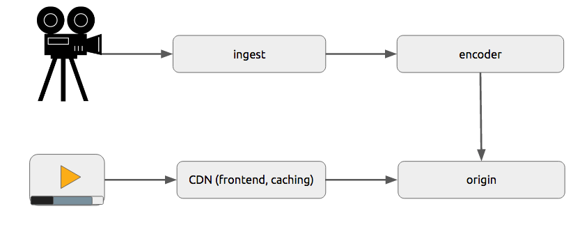
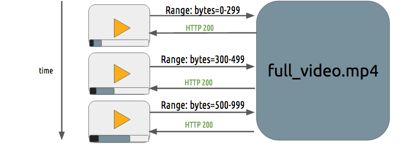
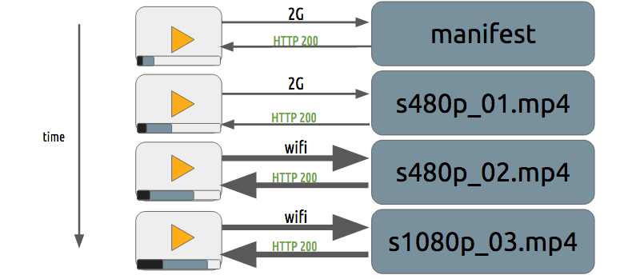
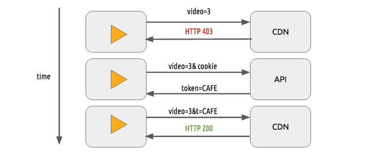
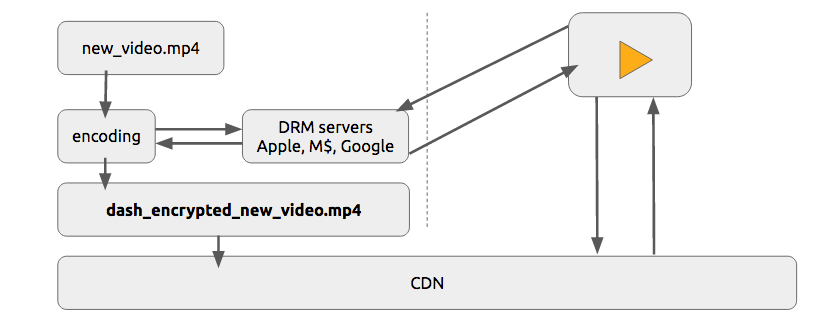
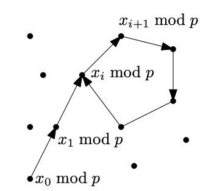

<head>
    
    
</head>

# Table of Contents

1.  [Algorithm](#org3cfcd6e)
2.  [Review](#orgca68751)
    1.  [在线流](#orgca3870b)
        1.  [一般架构](#orgced3d75)
        2.  [进度下载和适配流](#orgbed89ed)
        3.  [内容保护](#org89fab6c)
        4.  [DRM](#org9041e7d)
3.  [Tips](#org21dccc0)
4.  [Share](#org54a97ff)
    1.  [Pollard rho算法](#org841643d)
    2.  [quadratic sieve](#orgaead7de)

# Algorithm

Leetcode 365: 

# Review

digital video introduction

<https://github.com/leandromoreira/digital_video_introduction#intro>

## 在线流

### 一般架构

### 进度下载和适配流

### 内容保护

我们可使用简单的token系统来保护内容。没有token的用户尝试请求一个视频CDN会拒绝他然而有有效token的用户可播放该内容，这在多数web鉴权系统上都能很好工作

单独使用该token系统仍然会允许用户下载视频并分发它。则DRM（数字版权管理）系统可用来避免该问题

在现实世界生产系统中，人们通常使用这两种技术来提供验证和鉴权

### DRM

1.  主要的系统

    -   FPS - FairPlay Streaming
    -   PR - PlayReady
    -   WV - Widevine

2.  什么

    DRM表示数字版权管理，它用来提供数字媒体的版权包含，例如，数字视频和音频

3.  为什么

    内容创作者想要保护它的智能资产防止拷贝来禁止未授权的数字媒体分发

4.  怎么做

    我们将描述一个抽象和一般化形式的DRM
    
    给定一个内容C1（例如，一个hls或dash视频流），一个播放器P1（例如，shaka-clappr、exo-player或ios）在设备D1（例如，一个智能手机、TV、平板或桌面电脑/笔记本）使用DRM系统DRM1
    
    内容C1在DRM1系统中用对称密钥K1加密，产生加密内容C'1
    
    
    
    播放器P1，设备D1有两个钥（非对称），一个私钥PRK1（这个是被保护的，只有D1知道）和一个公钥PUK1
    
    当播放器P1想要播放内容C'1，它需要处理DRM系统DRM1，给出它的公钥PUK1。DRM系统DRM1用客户端公钥PUK1加密的对称密钥K1，这只有D1可以解密
    
    K1P1D1 = enc(K1, PUK1)
    
    P1使用它DRM本地系统（它可能是一个SOC，一个特殊硬件或软件），该系统能够使用它的私钥PRK1解密内容，它可从K1P1D1解密对称密钥K1且播放C'1。在最好的情况下，该密钥不能从内存导出
    
    K1 = dec(K1P1D1, PRK1)
    
    P1.play(dec(C'1, K1))
    
    

# Tips

-   

# Share

Factoring

<https://math.mit.edu/~goemans/18310S15/factoring-notes.pdf>

我们将看到高效检查一个整数n是否是素数是可能的。如果因式分解能高效完成（例如，在 $ D^{4} $操作内，$ D \\sim \\log n $是n的数字数目），则RSA加密会被破解，在公钥中分解N = pq

可能第一个想到的算法是暴力破解：对每个大于1小于等于 $ \\sqrt{n} $的正整数d，检查是否d能被n整除。这对任意特定选择的d非常有效，使用Euclidean算法：计算gcd(d, n)，如果不为1，则结果是n的一个因子。不幸地是，这个方法非常慢，因为需要检查 $ \\sqrt{n} $个整数

我们将看到两个更快的算法。第一个是Pollard rho算法，需要大约 $ n^{\\frac{1}{4}} $个gcd操作。第二个，quadratic seive，需要时间复杂度为 $ e^{\\sqrt{\\log{n}\\log{\\log{n}}}} $。这看起来有一点复杂，但

$ (\\log{n})^{C} = e^{C\\log{\\log{n}}} \\qquad \\text{and} \\qquad n^{\\epsilon} = e^{\\epsilon \\log{n}} $

这样 $ e^{\\sqrt{\\log{n}\\log{\\log{n}}}} $在这两个之间

## Pollard rho算法

假设n为要因式分解的数，且n = pq，p是一个素数因子小于等于 $ \\sqrt{n} $（q不需要是素数，如果n有超过2个素数因子）。注意我们不知道p

考虑如下想法试验。在 $ \\mathbb{Z}_ {n} $中随机取某些数 $ x_ {1}, x_ {2}, \\ldots, x_ {l} $。假设所有数不相同（如果n远大于l）。现在假设

存在某个 $ 1 \\le i < j \\le l $ 使得 $ x_ {i} \\equiv x_ {j} \\quad (mod \\, p) $

则 $ p \| x_ {i} - x_ {j} $，且因为 $ p \| n $，我们有

$ p \| gcd(x_ {i} - x_ {j}, n) $

因为 $ -n < x_ {i} - x_ {j} < n $且 $ x_ {i} \\neq x_ {j}, gcd(x_ {i} - x_ {j}, n) < n $。这样 $  gcd(x_ {i} - x_ {j}, n) $获得了n的一个因子

记住我们不知道p，但上述告诉我们如果我们计算 $ gcd(x_ {i'} - x_ {j'}, n) $对每一对 $ 1 \\le i' < j' \\le l $，我们可找到因子。但l需要多大来使该概率可接受呢？

答案大概为 $ \\sqrt(p) $。这本质上是生日悖论的重新表述：在只有30个人的组中，组中两个人有相同的生日概率是非常大的 - 超过60%。让我们计算可能性，例如，$ x_ {1}, x_ {2}, \\ldots, x_ {l} $的余数类都是不同的。即

$ \\begin{aligned} \\mathbb{P}(\\text { all different }) &=\\left(1-\\frac{1}{n}\\right)\\left(1-\\frac{2}{n}\\right) \\cdots\\left(1-\\frac{\\ell-1}{n}\\right) \\\\ & \\leq e^{-1 / n} \\cdot e^{-2 / n} \\cdots e^{-(\\ell-1) / n} \\quad \\text { using } 1-y \\leq e^{-y} \\\\ &=e^{-\\frac{\\ell(\\ell-1)}{2 n}} \\\\ & \\sim e^{-\\ell^{2} /(2 n)} \\end{aligned} $

这样如果 $ l = \\sqrt{n} $，概率大概为 $ e^{-\\frac{1}{2}} \\le \\frac{2}{3} $

因为 $ p \\le \\sqrt{n} $，我们只需要选择 $ l = n^{\\frac{1}{4}} $。但i,j对的数量为 $ {l \\choose 2} $为 $ \\frac{1}{2} \\sqrt{n} $。检查所有这些组对需要 $ \\sqrt{n} $gcd计算 - 这不比暴力搜索强！

一个技巧是不随机取 $ x_ {i} $，但用一种看似随机的方法。让 $ f : \\mathbb{Z}_ {n} \\to \\mathbb{Z}_ {n} $定义为

$ f(x) = x^{2} + 1 \\; mod \\; n $

固定任意 $ x_ {0} \\in \\mathbb{Z}_ {n} $，现在考虑序列

$ x_ {1} = f(x_ {0}), \\qquad, x_ {2} = f(x_ {1}), \\qquad \\ldots \\qquad x_ {i} = f(x_ {i - 1}), \\ldots $

*经验上的事实*: 序列 $ x_ {0}, x_ {1}, \\ldots $看起来随机

这不是一个精确的描述，且没有形式化证明该算法能有效工作。但它在经验上确实起作用，$ x_ {0} $的多数选择，为一对 $ i < j < C \\sqrt{p}, x_ {i} \\equiv x_ {j} (mod \\; p) $。现在是在该序列中找到这样一对i、j。但我们还是不能检查每对 $ i', j' $，所以怎么办呢？

观察我们已看到序列中的循环

$ x_ {0} \\, mod \\, p, \\qquad x_ {1} \\, mod \\, p, \\qquad x_ {2} \\, mod \\, p, \\qquad, \\ldots $

假设 $ x_ {i} \\equiv x_ {j} (mod \\, p), i < j $且i的选择尽可能小。然后 $ f(x_ {i}) \\equiv f(x_ {j}) (mod \\, p) $，例如，$ x_ {i+1} \\equiv x_ {j+1} (mod \\, p) $。如下图：

**龟兔算法**:

1.  设 $ y_ {0} = x_ {0} $
2.  对 $ i = 1,2,\\ldots $
    1.  $x_ {1} = f(x_ {i-1}) $
    
    2.  $ y_ {i} = f(f(y_ {i - 1})) $
    
    3.  if $ gcd(x_ {i} - y_ {i}, n) \\ne 1 $，返回发现的因子

我们用经验上的事实意味着该算法将在 $ C \\sqrt{p} \\le C n^{\\frac{1}{4}} $步骤后结束，C为某个小常数；如果我们运行更长时间没找到循环，我们将放弃并选择另一个 $ x_ {0} $再开始

## quadratic sieve

本算法接近当前已知最快的因式分解算法。时间复杂度为 $ e^{\\sqrt{\\log{n}\\log{\\log{n}}}} $

基于如下想法。如果我们能找到两个数a, b使得 $ a \\not \\equiv b (mod \\, n), a \\not \\equiv -b (mod \\, n), a^{2} \\equiv b^{2} (mod \\, n) $，则我们可以得到一个因子。有 $ n \| (a - b)(a + b), n \\not \| a - b, n \\not \| a + b $，则 gcd(a+b, n)为一个因子（gcd(a-b, n)也是，但我们只需要一个）

让 $ g: \\mathbb{Z}_ {n} \\to \\mathbb{Z} $为一个函数 $ g(z) = z^{2} \\, mod \\, n $。现在如果我们可以找到某个整数z，$ \\sqrt{n} \\le z \\le \\sqrt{n} + K $（K为某个大数，但比 $ \\sqrt{n} $小很多）且g(z)是一个完美平方（注意：完美平方的意思是一个整数，不在 $ \\mathbb{Z}_ {n} $中。这样 $ g(y) = y^{2} $，而不是 $ g(z) \\equiv y^{2} (mod \\, n)）。让 $ g(z) = y^{2} $，则 $ y^{2} \\equiv z^{2} (mod \\, n) $，但 $ z \\not \\equiv y (mod \\, n) $，因为 $ y < \\sqrt{n} \\le z < n $。更进一步，如果K不太大，它也能显示 $ z \\not \\equiv -y (mod \\, n) $。这样我们可从gcd(y - z, n)获得一个因子

**例子** 假设n = 1817。则 $ \\lceil \\sqrt{n} \\rceil = 43 $。我们得到：$ g(51) = 784 = 28^{2} $，这样 $ 51^{2} \\equiv 28^{2} (mod \\, 1817) $，因此 $ 23 \\cdot 79 \\equiv 0 (mod 1817) $且我们得到一个因子

不幸地是，从 $ \\lceil \\sqrt{n} \\rceil $开始且查找一个z使得g(z)是一个完美平方不能很好解决；z这样的特殊值很少，且这样的数的尝试很大。但有另一个希望。假设我们找到不同的 $ z_ {1}, z_ {2}, \\ldots, z_ {l} \\in \\mathbb{Z}_ {n}, z_ {i} \\ge \\sqrt{n} $，且

$ \\prod^{l}_ {i=1} g(z_ {i}) $是一个完美平方

（注意我们乘以 $ g(z_ {i}) $作为正常整数，不是模数；这样这个乘积大于n）。然后这对我们是一个好消息：设 $ z = \\prod^{l}_ {i=1}z_ {i}, y^{2} = \\prod6{l}_ {i=1}g(z_ {i}) $。然后 $ y^{2} \\equiv z^{2} (mod \\, n) $，且 $ y \\not \\equiv \\pm z (mod \\, n) $，我们又找到一个因子gcd(y + z, n)。它不像 $ y \\equiv \\pm z (mod \\, n) $，虽然我们不处理这个；如果我们不幸，我们不得不尝试另一套 $ z_ {i} $的集合

是否有更容易的方法找到这样的 $ z_ {i} $的集合？注意给定一个整数m及素数因式分解 $ m = p^{\\alpha_ {1}}_ {1} p^{\\alpha_ {2}}_ {2} \\cdots p^{\\alpha_ {t}}_ {t} $，则m是一个完整平方当且仅当 $ \\alpha_ {j} $是一个偶数对每个 $ 1 \\le j \\le t $。该想法对 $ z_ {i} $起作用使得 $ g(z_ {i}) $在因式分解中只包含小素数，我们可利用这个特性来得到一个完美平方

**定义 1** 对 $ B \\in \\mathbb{N} $，一个整数被称为B光滑的如果它的素数因子最多是B

例如，15和75是5光滑的，但14不是5光滑的

如果B不太大，我们可 i) 检查是否一个整数m是B光滑的，且 ii) 如果它是，能高效找到它的素数因子。对每个素数 $ p_ {i} \\le B $计算 $ gcd(p_ {i}, m) $，且如果它大于1，用 $ p_ {i} $除以m。如果m最终缩减到1，我们有m的一个不大于B的素数因式分解。否则，m不是B光滑的

该计划是：取某个B（不幸地是会随着n增长，但比n增长得慢很多；大概 $ B = e^{\\frac{1}{2} \\sqrt{\\log{n} \\log{\\log{n}}}} $），且找到B + 1个数 $ z_ {1}, z_ {2}, z_ {B+1} \\in \\mathbb{Z}_ {n}, z_ {i} \\ge \\sqrt{n} $，这样 $ g(z_ {i}) $对每个i是B光滑的。它证明这些数不是很罕见（依赖于B的选择），这样我们从 $ \\lceil \\sqrt{n} \\rceil $开始尝试每个值z，检查是否g(z)是B光滑的

一旦我们有这些数 $ z_ {1}, \\ldots, z_ {B+1} $，我们将事实上能够找到这些数的一个子集满足之前的连乘式。这是一些线性代数的结论。让 $ p_ {1}, \\ldots, p_ {t} $为最多为B的素数列表的大小。让 $ g(z_ {i}) = \\prod^{t}_ {j = 1} p^{\\alpha_ {i,j}_ {j}} $为 $ g(z_ {i}) $的素数分解（当然，某些 $ \\alpha_ {i,j} $可为0）。然后对一个给定的子集 $ I \\subseteq \\{ 1,2,\\ldots, B+1\\} $，

$ \\prod_ {j \\in I} g(z_ {i}) = \\prod^{t}_ {j=1}p^({\\sum_ {i \\in I}\\alpha_ {i,j})_ {j} $

这样，应用我们的一个数为完美整数的条件，

$ \\prod_ {i \\in I}g(z_ {i}) $是一个完美整数 $ \\leftrightarrow \\sum_ {i \\in I} \\alpha_ {i,j} $ 是偶数 $ \\forall j \\in \\{1, 2, \\ldots, t \\} $

现在线性代数连接。考虑 $ (B + 1) \\times t $矩阵A，元素 $ A_ {ij} = \\alpha_ {i,j} mod 2 $。我们认为A的元素为 $ \\mathbb{Z}_ {2} $。设 $ A_ {i} $记为A的第i行，然后我们找到一个行的非空集合 $ I \\subseteq \\{1, 2, \\ldots, B + 1 \\} $使得 $ \\sum_ {i \\in I} A_ {i} = 0 $。这样一个子集I存在有一个线性代数概念，线性依赖。因为A只有B列，A的rank最多为B；因为有超过B行，这意味着必须有一个线性依赖，例如，$ w_ {i} \\in \\mathbb{Z}_ {2} $使得

$ \\sum^{B+1}_ {i=1} w_ {i}A_ {i} = 0 $

（不是所有 $ w_ {i} $为0）。让 $ I = \\{i \| w_ {i} = 1 \\} $，有一个高效算法找到该线性依赖
