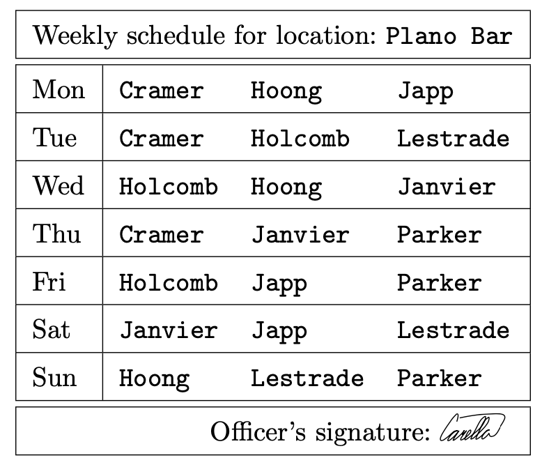
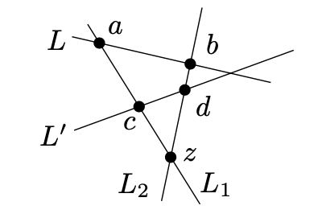
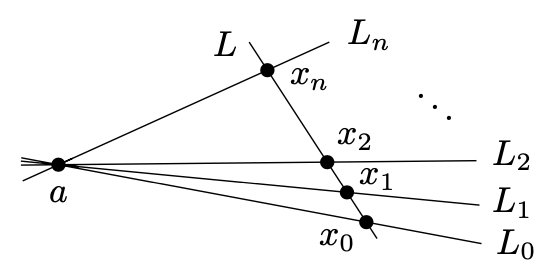

<head>
    
    
</head>

# Table of Contents

1.  [定义和基本属性](#org26c438d)
    1.  [定义](#org00539b3)
2.  [finite projective planes的存在](#org413b88f)
3.  [垂直Latin方块](#orgc53c8f7)

# 定义和基本属性

finite projective plane是带某些属性的有限集合的子集的系统

## 定义

设X为一个有限集，且设 $ \\mathcal{L} $为X的子集的系统。二元组 $ (X, \\mathcal{L}) $被称为finite projective plane，如果它满足如下公理：

(P0) 存在一个4元素集合 $ F \\subseteq X $使得对每个集合 $ L \\in \\mathcal{L}, \| L \\cap F \| \\le 2 $

(P1) 任意两个不同的集合 $ L_ {1}, L_ {2} \\in \\mathcal{L} $ 相交只有一个元素，例如，$ \| L_ {1} \\cap L_ {2} \| = 1 $

(P2) 对任意两个不同的元素 $ x_ {1}, x_ {2} \\in X $，只存在一个集合 $ L \\in \\mathcal{L} $ 使得 $ x_ {1} \\in L, x_ {2} \\in L $

如果 $ (X, \\mathcal{L}) $是一个finite projective plane，我们X的元素为点，$ \\mathcal{L} $的集合为线。如果 $ x \\in X $是一个点而 $ L \\in \\mathcal{L} $是一条线，我们说“点x在线L上“或“线L穿过点x“

如果我们用这种新语言表达公里(P0) - (P2)，他们开始跟几何陈述相似。公里(P1)说任意两个不同的线只相交于一个点，公理(P2)告诉我们只有一条线穿过两个不同的点。公理(P0)需要4个点存在使得没有3个点共线

如果 $ a, b \\in X $为finite projective plane上两个不同的点，包含a和b的唯一的线 $ L \\in \\mathcal{L} $被记为符号 $ \\bar{ab} $。如果 $ L, L^{\\prime} \\in \\mathcal{L} $为不同的线，$ L_ {1} \\cap L_ {2} $的唯一点被称为它们的交

我们依然还欠读者一个projective plane中projective的解释。首先，我们应该显示什么是projective转换。考虑两个3维欧几里得空间中的平面 $ \\rho $ 和 $ \\sigma $和一个不在这两个平面中的点c，且从点c映射 $ \\rho $中的每个点到平面 $ \\sigma $。这定义了一个映射，称为从 $ \\rho $到 $ \\sigma $的projective转换。如果 $ x \\in \\rho $是一个点使得线段cx平行于平面 $ \\sigma $，则在欧几里得几何中，x的像是未定义的。但如果我们补充 $ \\rho $和 $ \\sigma $一个无穷远的线使得它们变成projective planes，则这个projective转换是这两个projective planes间的双射。如果 $ \\rho $和 $ \\sigma $被考虑为同一平面的拷贝，我们认为这个映射是projective plane到其自身的双射。projective plane是一个适当的域可做projective几何，一个考虑projective几何适当的域和保留projective转换的配置的几何分支。例如，projective转换映射conic部分（圆、椭圆、抛物线和双曲线）到conic部分，但一个椭圆可被转换为一个双曲线，等，且一个conic部分的伟大统一理论可在projective几何中建立

实际projective plane的finite projective plane的相似用来作为各种记号的动机，且通常也为目的（我们可绘制几何图像）。在真实projective plane上的几何考虑和使用公理(P0) - (P2)只运用在finite projective planes上。不要忘记一个finite projective plane只是一个带(P0) - (P2)属性的有限集合系统，因此其他几何记号不能自动转换到它身上。例如，在finite projective plane上没有距离，因此它没有圆的明确定义。另一个重要的不同是在通常的几何平面上，每条线的点可被该线自然排序，但在finite projective plane上没有这样的排序

**例子** 一个有限projective plane最小可能的例子是7个点和7条线，每条线有3个点，且它称为Fano plane。如上图。这些点被标记为1-7，且每条线上的3个点被一个线段连接，这些连接线被标签为a-g

Fano plane虽然小，但是一个有用的数学对象，且它也作为各种谜题或一些高级问题的解决方案出现，比如如下这个。7个警察被转换到第87区域的各个区，一个好的时机是让他们互相观察在西南C Drive的Plano Bar，这里是一个简单甚至乏味地值班因为酒吧的顾客通常是计算机罪犯，数字钱币伪造者或类似的人。需要一个3人移动小组，一周1天服务。如何安排每周调度使得7人中的每两人会值班一周？Fano plane提供了好的解决方案（点对应警察，移动对应线，以某种顺序排列）。每个人有相同编号的移动，没有人会超过连续两天，但另一方面，每个移动有一个人在前一天也在并知道发生了什么。我们不知道这样的调度在实际中会被警方使用，但例如，一些摩托循环赛会根据基于affine plane的order four来组织

**命题** 设 $ (X, \\mathcal{L}) $为一个finite projective plane。则所有它的线有相同数量的点；即 $ \\forall L, L^{\\prime} \\in \\mathcal{L}, \| L \| = \| L^{\\prime} \| $

**证明** 任意选择两条线 $ L, L^{\\prime} \\in \\mathcal{L} $，首先我们证明一个辅助声明：存在一个点 $ z \\in X $不在 $ L, L^{\\prime} $上

证明辅助声明。选择一个集合 $ F \\subseteq X $作为公理(P0)，我们有 $ \| L \\cap F \| \\le 2 $且 $ \| L^{\\prime} \\cap F \| \\le 2 $。如果F不在 $ L \\cup L^{\\prime} $中则得证。唯一剩下的可能性是L交F于两点（称为a,b）且 $ L^{\\prime} $交F于两点（记为c,d）。则我们考虑线 $ L_ {1} = \\overline{ac} $和 $ L_ {2} = \\overline{bd} $，设z为 $ L_ {1} $和 $ L_ {2} $的交点

如下几何图形显示了该情形：

当然，我们不得不非常小心只使用(P0) - (P2)，而不是图形中的额外信息。在许多方面，finite projective plane跟几何（欧几里得）平面很不同

我们断言 $ z \\notin L \\cup L^{\\prime} $。线L和 $ L_ {1} $交于一点，名为a，且这样如果 $ z \\in L $，我们得到z = a。但这是不可能的因为线 $ L_ {2} $会包含点z = a, b和d，F中的3个点。这被条件P0禁止。因此 $ z \\notin L $，且相似地我们可得到 $ z \\notin L^{\\prime} $。这完成了辅助声明的证明

现在我们显示线L和 $ L^{\\prime} $有相同的大小。我们定义一个映射 $ \\varphi: L \\to L^{\\prime} $；它是一个双射。我们固定一个点 $ z \\notin L \\cup L^{\\prime} $且定义点 $ x \\in L $的象 $ \\varphi(x) $作为线 $ \\overline{zx} $和 $ L^{\\prime} $的交，如下图所示：

通过公理(P1)和(P2)，点 $ \\varphi(x) $是定义的。接着，我们检查 $ \\varphi $是双射。如果 $ y \\in L^{\\prime} $是一个任意点，我们考虑线 $ \\bar{zy} $，且设x为和线L的交点，则线 $ \\bar{zy} $和 $ \\bar{zx} $共线，因此我们有 $ y = \\varphi(x) $，则映射 $ \\varphi $是一个双射且 $ \| L \| = \| L^{\\prime} \| $

**定义（projective plane的序）** finite projective plane $ (X, \\mathcal{L}) $的序是 $ \| L \| - 1 $。$ L \\in \\mathcal{L} $是一条线（根据证明过的命题，序不依赖线的选择）

例如，Fano plane有序2（线有三个点），且它是唯一的序为2的projective plane

**命题** 设$ (X, \\mathcal{L}) $为一个序为n的projective plane，则我们有

(i) 只有n + 1条线穿过X中的每个点

(ii) $ \| X \| = n^{2} + n + 1 $

(iii) $ \| \\mathcal{L} \| = n^{2} + n + 1 $

**证明(i)** 考虑一个任意点 $ x \\in X $。首先我们观察到存在一条线不包含x。即如果F是4点配置如(P0)，且 $ a,b,c \\in F $为不同于x的点，则至少线 $ \\overline{ab} $ 和 $ \\overline{ac} $有一条线不包含x

固定这样的一条线L，$ x \\notin L $。对每个点 $ y \\in L $，我们考虑线 $ \\overline{xy} $；有n + 1条线通过x点。另一方面，任意包含x的线交L在某点 $ y \\in L $且因此它有n + 1条线穿过x

**证明(ii)** 我们选择某条线 $ L = \\{ x_ {0}, x_ {1}, x_ {2}, \\ldots, x_ {n} \\} \\in \\mathcal{L} $且一个点 $ a \\notin L $，如下图所示：

设 $ L_ {i} $记为线 $ \\overline{a x_ {i}}, i = 0, 1, \\ldots, n $。根据(P1)，任意两条线，$ L_ {i} $和 $ L_ {j} $，交于一个点，为点a。线 $ L_ {0}, L_ {1}, \\ldots, L_ {n} $每个除了a还有n个点，且因此它们一共包含 $ (n + 1)n + 1 = n^{2} + n + 1 $个不同的点。它也显示对任意点 $ x \\in X \\ \\{a\\} $位于某条线 $ L_ {i} $上。通过(P1)，线 $ \\overline{ax} $交线于点 $ x_ {i} $，且通过(P2)，线 $ \\overline{ax} $必须和L相交。这证明了(ii)

我们现在忽略(iii)的证明。在续集中，我们将学习一个重要的原理，且从它我们看到(iii)立马得到证明

**Duality** duality的意思在projective planes中是“交换点和线的角色“。为了精确地公式化，我们先引入finite projective plane的发生图形。事实上，发生图形可被一个集合X的子集的任意系统 $ \\mathcal{S} $定义。发生图形是一个顶点集合 $ X \\cup \\mathcal{S} $的二分图，每个集合 $ S \\in \\mathcal{S} $被一条边连接到所有点 $ x \\in S $。结果每个点 $ x \\in X $连接到包含它的所有集合。简单地说，我们可说发生图形的每条边对应成员关系 $ \\in $。Fano plane的发生图形如上图；点被对应点和线的标签标签（结果的图形是漂亮且重要的图形，虽然在我们的绘制中比较丑陋，它甚至有个名字：the Heawood graph）

给定一个finite projective plane $ (X, \\mathcal{L}), (X, \\mathcal{L}) $的dual通过$ (X, \\mathcal{L}) $的发生图形获得且解释为线是点的顶点，顶点为点的集合。在上图中，我们可上下翻转该图形。因为 $ \\mathcal{L} $现在被认为是一个点集，对 $ \\forall x \\in X $，线的集合 $ \\{ L \\in \\mathcal{L}: x \\in L \\} $被解释为一条线。在上图例子中，dual的点为 $ \\{a, b, \\ldots, g\\} $，dual的线为 $ \\{a, c, e \\} $（对Fano plane中点1），$ \\{a, d, g\\} $（对点2），等等

**命题** finite projective plane的dual也是一个finite projective plane

**证明** 设 $ (X, \\mathcal{L}) $为一个finite projective plane。$ (X, \\mathcal{L}) $的dual是一对 $ (\\mathcal{L}, \\Lambda), \\Lambda $是一个 $ \\mathcal{L} $子集的系统，每个子集对应X中的某个点（注意不同的点为 $ \\mathcal{L} $不同的子集，因为两个点只共享一条线）

我们需要验证 $ (\\mathcal{L}, \\Lambda) $的条件(P0) - (P2)。我们以P0开始。如果这个条件转换为原始集合系统 $ (X, \\mathcal{L}) $的语言，它意味着我们需要找到4条线 $ L_ {1}, L_ {2}, L_ {3}, L_ {4} \\in \\mathcal{L} $使得不会有3条线共一个点。让我们考虑一个4点配置 $ F = \\{a, b, c, d\\} \\subseteq X $作为条件(P0)，且定义 $ L_ {1} = \\overline{ab}, L_ {2} = \\overline{cd}, L_ {3} = \\overline{ad}, L_ {4} = \\overline{bc} $。如果我们看这4条线的任意3条，任意两条共享F中的一个点，且该点不包含在第3条上。因此$ L_ {1}, \\ldots, L_ {4} $中的任意3条线只有空的交集，这样我们确认了dual集合系统的条件(P0)的验证

dual $ (\\mathcal{L}, \\Lambda) $的条件(P1)需要：如果 $ x, x^{\\prime} \\in X $为两个不同点，则存在只有一条线 $ L \\in \\mathcal{L} $包含x和 $ x^{\\prime} $。这就是$ (X, \\mathcal{L}) $需要的条件(P2)，我们发现dual的(P2)是原始projective plane $ (X, \\mathcal{L}) $的(P1)的结果

现在我们称finite projective plane的dual为dual projective plane。dual projective plane有和projective plane相同的序

一般地，如果我们有关于序为n的finite projective plane的一些有效的陈述，且如果我们交换点和线，我们也能获得一个有效地陈述。例如，如果原始陈述说“线 $ L_ {1}, L_ {2} $交于点x“，我们可在dual中说“点 $ x_ {1}, x_ {2} $被线L连接“

# finite projective planes的存在

序2、3、4和5的projective planes存在。但不存在序为6的projective planes。序为7、8、9的projective planes存在，但序为10的不存在。这有一般化规律吗？它得出一个序为n的projective plane存在当一个n个元素的域存在。这里一个域是代数上的概念；即它是一个带加法、减法、乘法和除法满足某个公理 - 如果你不熟悉定义看附录。代数教给我们，一个n元素的域存在当且仅当n是一个素数的次方

对一个可被至少两个不同的素数整除的n，没有n个元素的域存在，但不知道是否有一个序为n的projective plane存在。有一些部分负的结果；例如，如果数n被4整除余1或2且它不能为两个整数平方的和则没有序为n的projective plane存在。这使得我们不用考虑序6、14和许多其他的projective planes的存在，但它不能覆盖所有的可能性。例如，它不能处理序10或12

序为10的projective plane存在已经被排除。这里有一个有趣的历史。对序6，Euler给出了一个证明尝试，但只有Tarry在1900年给出了一个令人信服的论证。对序10，最近被使用大量的计算机计算给出了一个证明。对更高的序12，projective plane的存在仍然是一个开放式的问题。明显这个问题可通过检查有限数量的配置来解决，但对当代的计算技术来说配置的数量来起来太过巨大

**一个projective plane的代数结构** 对有兴趣且缺乏代数背景的读者，我们解释如何从域构建一个projective plane。我们特别对finite projective planes感兴趣，但构建对实数的projective plane也起作用

直接看上去比较复杂，因为结果的projective plane的点相当于有序三元组的集合。然而，一旦给定定义，检查projective plane的公理是很直接的。在例子中域是R，实数，构建有直观地几何解释，我们将在最后呈现。对有些人来说几何解释会帮助形式化构建，但对另一些人可能导致更加混乱，所以这取决于读者的品味，多少抽象应该放入几何直观

构建用某些域K开始。对实数的projective plane（例如，使用欧几里得平面通过无穷远点做适当的扩展），我们使用所有实数域R作为K。如果我们选择K的n个元素域，构建结果为一个序n的finite projective plane。我们运行的例子是K的3元素域，例如，集合 $ \\{0, 1, 2\\} $及模3操作

首先我们考虑集合 $ T = K^{3} \\backslash \\{(0, 0, 0) \\} $；即集合的所有有序三元组(x,y,t)，$ x, y, t \\in K $且x, y, t不同时为0。在这样的T中，我们定义一个相等关系 $ \\approx $如下：$ (x_ {1}, y_ {1}, t_ {1} ) \\approx (x_ {2}, y_ {2}, t_ {2}) $当且仅当一个非零的 $ \\lambda \\in K $存在使得 $ x_ {2} = \\lambda x_ {1}, y_ {2} = \\lambda y_ {1}, t_ {2} = \\lambda t_ {1} $。构建的projective plane的点用这种相等关系分类。porjective plane这样产生通常被记为 $ PK^{2} $，例如，实数的projective plane通常被记为 $ PR^{2} $

为了获得projective plane一个更好的直观，我们从每个相等 $ \\approx $类中选择一个代表性的三元组。对这些代表，我们选择三元组其最后一个非零部分为1。因此，代表为(x, y, 1)，(x, 1, 0)和(1, 0, 0)的三元组。容易得出任意其他的三元组跟上述形式的一个三元组相等

总是说相等类有些麻烦，这样我们说一个点(x, y,t)在续集中，表示整个相等类包含(x, y, t)

如果K是一个n元素域，我们现在可统计我们获得多少个点。形如(x, y, 1)的点的个数为 $ n^{2} $个，形如(x, 1, 0)的点有n个，形如(1, 0, 0)的点只有一个 - 总共 $ n^{2} + n + 1 $个。对n = 3，这些标签的所有点绘制如下图表：

现在我们定义线，对 $ \\forall (a, b, c) \\in K^{3} \\ \\{(0, 0, 0)\\} $，我们定义一条线L(a,b,c)作为所有满足如下等式的projective plane点(x, y, t)的集合：

$ ax + by + ct = 0 $

明显，两个相等的点(x,y,t)和$ (\\lambda x, \\lambda y, \\lambda t) $要么都满足该等式要么都不满足，且因此我们有定义projective plane点的某个集合。对 $ \\forall \\lambda \\in K, \\lambda \\ne 0 $，三元组 $ (\\lambda a, \\lambda b, \\lambda c) $定义和三元组(a, b, c)相同的线。因此，三元组上定义线我们有相同的相等关系。我们可选择相同的代表三元组，例如，最后一个非零元素为1的。如下图，我们已绘制所有的线通过点(0, 0, 1)。我们已忽略多数点的标签：

为了显示一个n元素域，我们已构建了一个序为n的finite projective plane，我们必须检查条件(P0) - (P2)。我们以条件P1开始，设 $ (a_ {1}, b_ {1}, c_ {1}) $和 $ (a_ {2}, b_ {2}, c_ {2}) $为两个不等的三元组，例如，一个不是另一个的倍数

我们可直接计算两条线的交点。让我们考虑三元组作为域K上的3维向量，我们容易得到其线性无关，因此，矩阵

$ \\left( \\begin{array}{ccc} a_ {1} & b_ {1} & c_ {1} \\\\ a_ {2} & b_ {2} & c_ {2} \\end{array} \\right) $

有rank 2。且存在3个数 $ x, y, t \\in K $，它们不能同时为0，使得

$ x(a_ {1}, a_ {2}) + y(b_ {1}, b_ {2}) + t(c_ {1}, c_ {2}) = (0, 0) $

这样点(x, y, t)是两条线的交点

另一方面，因为矩阵的rank是2，两个线性无关的列存在。假设，例如，为 $ (a_ {1}, a_ {2}), (b_ {1}, b_ {2}) $。这意味着对任意向量(u, v)，等式 $ x(a_ {1}, a_ {2}) + y(b_ {1}, b_ {2}) = (u, v) $有唯一的解。即两条线交于同一点

条件P2可相似地得到证明，P0的证明留给读者

**几何解释** 如我们在本章开头提到的，构建实数projective plane的基本思想是通过无穷远点扩展欧几里得平面，这样对欧几里得平面中线的每个方向有一个对应的无穷远点，使得所有平行的线相交。如上图

为了使这类图像更形式化，我们考虑Cartesian坐标系统(x, y, t)，t轴是垂直的，这样的3维空间。欧几里得平面放置在这个3维空间中作为水平平面，t = 1，如下图灰色部分：

平面的每个点a对应一条线 $ \\mathcal{l} = \\overline{0a} $经过3维空间的源点。例如，点 $ a_ {1} $在上图中对应线 $ \\mathcal{l}_ {1} $。相反地，经过3维空间源点的每条线对应灰色平面的一个点，除了水平线，比如$ \\mathcal{l}_ {3} $

我们注意到当我们开始倾斜线 $ \\mathcal{l}_ {1} $到 $ \\mathcal{l}_ {2} $的位置，然后再到水平线 $ \\mathcal{l}_ {3} $，对应的灰色平面的点沿着一条线的轨迹回退到无穷远。这样就不自然地想到水平线比如 $ \\mathcal{l}_ {3} $对应到无穷远点。这里我们使用一个典型地现代数学的技巧 - 不去解释无穷远点对应水平线，我们忘掉原始的欧几里得平面，说projective plane的点为三维空间经过源点的线。我们没有描述 $ PK^{2} $的形式化构建，但projective plane的点是形如 $ \\{(\\lambda x, \\lambda y, \\lambda t): \\lambda \\in K \\ \\{ 0 \\} \\} $的集合，其几何上来说是$ K^{3} $上经过源点的一条线

projective plane的线对应经过源点的三维空间的平面

上述构建可能给出projective plane一些点的映像，那些无穷远点，是比较特殊的，和其他点不同。但并不是这样，没有点有特殊性，且无穷远在某些程度上只是为了方便

# 垂直Latin方块

一个序为n的Latin方块是一个n行n列的方块表。每个条目是集合 $ \\{1, 2, \\ldots, n \\} $中的数，集合中每个数在每行每列中只出现一次。两个3 x 3的Latin方块描述如下：

现在我们说相同序的两个Latin方块是垂直的是什么意思。想象其中一个方块是透明的，我们让它盖在另一个方块上，如上图

这样，我们获得 $ n^{2} $个有序对，每对由透明方块的一个条目和盖在其下的另一个方块的条目构成。考虑方块是垂直的如果没有重复的有序对

**定理** 设M为序为n的Latin方块集合，使得每两个都是垂直的。则 $ \| M \| \\le n - 1 $

**证明** 我们开始如下观察。设A和B为序为n的垂直Latin方块，设 $ \\pi $为数字 $ 1, 2, \\ldots, n $的某些排列。让我们做一个新的Latin方块 $ A^{\\prime} $，其位置(i, j)上的条目为数字 $ \\pi(a_ {ij}) $，$ a_ {ij} $是方块A在位置(i, j)上的条目。通过垂直的定义，不难看到 $ A^{\\prime} $和B也是垂直Latin方块。该观察可被语法“Latin方块的垂直性不被其一重命名符号而改变“

为证明定理，想象我们有Latin方块 $ A_ {1}, A_ {2}, \\ldots, A_ {t} $，每两个都是垂直的。对每个 $ A_ {i} $，用这样的方法排列符号（例如，数字 $ 1, 2, \\ldots, n $），结果Latin方块 $ A^{\\prime}_ {i} $的第一行为 $ (1, 2, \\ldots, n ) $。通过上述的观察，Latin方块 $ A^{\\prime}_ {1}, \\ldots, A^{\\prime}_ {t} $仍然是相互垂直的。让我们看在方块 $ A^{\\prime}_ {i} $的位置(2, 1)上会占据什么数字。首先，这个条目不可能为1，因为第1行第1列已经是1。进一步，没有两个方块 $ A^{\\prime}_ {i} $和$ A^{\\prime}_ {j} $在位置(2, 1)上有相同的数字；如果有，通过 $ A^{\\prime}_ {i} $盖住 $ A^{\\prime}_ {j} $，我们可得到一对确定的数字，为(k, k)在位置(2,1)上，但该对已出现在首行第k列条目上。因此数字 $ 2,3, \\ldots, n $每个只能出现在某个$ A^{\\prime}_ {i} $上的位置(2,1)上一次，因此 $ t \\le n - 1 $
