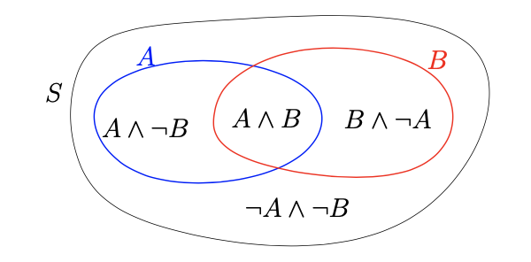
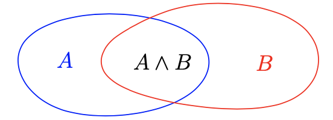
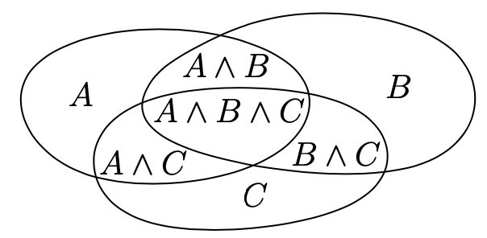

<head>
    
    
</head>

# Table of Contents

1.  [Algorithm](#org5011220)
2.  [Review](#org3706cb2)
    1.  [背景](#org04b7e81)
    2.  [实际中的经验](#org537de57)
    3.  [软件问题](#orga1f6706)
    4.  [进程组](#org2d674eb)
3.  [Tips](#org9574eb8)
    1.  [采样空间和事件](#org78514ce)
    2.  [条件概率和独立](#org809e364)
    3.  [Bayes' rule](#orgb6427e0)
    4.  [包含排除公式](#orgc516b5a)
    5.  [期望](#orgcc6a9e0)
    6.  [方差](#orgeb66a9f)
4.  [Share](#org63e202f)
    1.  [Families and ZDDs](#org85770dc)
    2.  [References](#org4b7cf33)

# Algorithm

Fliptile: <http://poj.org/problem?id=3279>

<https://dreamume.medium.com/poj-fliptile-d3138796c111>

# Review

A Response to Cheriton and Skeen's Criticism of Causual and Totally Ordered Communication

<https://www.cs.princeton.edu/courses/archive/fall07/cos518/papers/catocs-limits-response.pdf>

## 背景

在给1993 ACM操作系统理论专题研讨会上的论文中，Cheriton和Skeen提供了他们对于无关和总序作为通讯属性的理解。在这篇文章中，我想要展现我在Isis上的工作，及Isis采用的通讯模型。我假设读者熟悉Cheriton Sheen的论文，且他们使用的并发顺序的结构

Isis不是Cheriton和Skeen讨论的使用无关和总序属性的唯一的系统，还有很多项目的研究者使用相似的技术。然而，我将主要介绍Isis，当我阅读Cheriton/Skeen的讨论，它似乎显示在他们的论文中使用CATOCS作为其同义词

我想要做几个主要论点：

-   虽然以学术术语呈现，Skeen和Cheriton在系统中有一个商机称为TIB $ (tm)2 $，其和Isis分布式工具(tm)及Isis分布式新系统(tm)是竞争关系。这样，在他们想法的背后有一个商业产品。我提及这个不是对他们论文的指责，而是提供一个利益冲突。Cheriton和Skeen使用他们的观点来赚钱，但贬低Isis产品的特性，就像我通过讨论这些特性的有用性来获利一样。这个会扭曲我们的讨论吗？有可能的风险在利益冲突的地方，我将把它交给学术社区来获得结论
-   我的工作基于我过去的讨论，而有一些没有呈现在讨论中，可能导致结果不完整和版本扭曲。我想建议Cheriton和Skeen创造场合来看一下Isis的虚拟同步方面，讨论它们在CATOCS顺序中的价值。但他们指出这些问题包含顺序和可靠性的综合，且CATOCS是不适应的。特别地，他们引入交易强烈建议CATOCS主要支持交易应用程序的构建
-   即使把Cheriton和Skeen的论文放在它固有的地方，呈现地争论通常也是不完整的，因此有误导。例如，当这些作者引入纯顺序问题，他们通过使用应用程序特定语义顺序属性。其相信典型用户有相同的顺序目标集，系统的意图是实现用户的编程模型。事实是顺序问题通常导致编程风格包含异步通讯，系统主要的原因是担心消息顺序会减少用户可见设计复杂度且因此增加可靠性
-   一些争议很激烈，比如CATOCS不能维持一致“弹性”数据结构，且声称在缓存空间跟系统大小的函数一样的二次方增长，是错误的。在这方面，Cheriton和Skeen的二次方增长现象在典型Isis消息上对应一些字节的时间戳，即使对非常大的进程组平均也许只是12字节的数据。特殊进程的必要负载也相似地较低。这样的负载分析，及一些其他，跟系统像Isis、Transis、Psync、Gossiphe和Amoeba的经验直接矛盾
-   在操作系统社区，性能是一个重要的考虑因素。而Cheriton和Skeen声称CATOCS成本高，他们没有说他们喜欢的交易一致性模型的成本。一致性需要的地方，Isis虚拟同步模型 - 他们没有提及 - 考虑更好的交易和给出强保证除了外带数据。更进一步，我们可容易的在Isis上分层交易，或把它们靠近Isis。这样有三个选择：一个编程模型运行尽可能快，但没有语义（希望用户不会构建一些东西来引入可靠性或一致性），一个进程组编程模型，其可拷贝数据且有其他的一致顺序、容错编程工具，且在CATOCS系统属性中有一个键有非常高的性能，和交易模型，其性能不可避免地被刷新日志到稳定存储成本的限制。通过忽略虚拟同步的引用，Cheriton和Skeen用他们的偏见来支持他们想要得到的结论

这不是秘密，我相信在提供无关和总序的争论上，至少在进程组计算系统中是被排斥的。一个主要原因，Cheriton和Skeen没有谈到，是这种处理（至少当嵌入到一个适当的编程环境）在实现分布式系统中会极大减少复杂度，开发时间和调试效果。我相信甚至有时发生小的性能损失，平均用户更关心有一个简单的方式构建可靠软件而不是在应用程序中有一个通讯协议属性的总控制。Cheriton和Skeen忽略了简单化的收益，标准和处理开发人员失控的困难问题

这种观点有争议也不是个秘密。为挑战它，Cheriton和Skeen收集了一些不需要Isis提供的系统（他们声称他们的例子取材于文献，但大多数跟我了解的论文里的例子非常不同）。他们丢失了Isis发展的整个系统类。为对应他们引入的可靠性问题，他们这么做而不提及Isis虚拟同步模型这个关键的方面，导致他们得到结论“CATOCS顺序属性对这些问题是不适应的“。Isis处理比CATOCS顺序属性更能容忍可靠性问题，这个观点被Cheriton和Skeen完全忽略。这个的一个好例子是由于原子多播协议不一致的输出导致无关离开分割的失败。Isis防止了这个问题，而这在Cheriton和Skeen的处理中检测和处理都非常困难

为减少Isis相对于CATOCS的争议，Cheriton和Skeen简单丢弃了整个观点，当组合一个适当的执行模型，CATOCS是一个有价值的工具改善分布式系统性能和简化用户编程环境。也许CATOCS顺序限制了RPC编程在不一致的情况下的价值，或在纯交易环境中。但在这些极端依赖高可用性、高性能和一致性的分布式计算模型中，提供给开发者的选项在其他情况下并不有效

## 实际中的经验

Cheriton和Skeen的论文主要用在学术领域，我想做对应的事。作者提及了TIB商业上的成功，Teknekron产品。论文的几个部分引用了来自TIB用户的反馈。我想指出Isis也是一个商业成功产品，且我也能从我的用户中得到相同的反馈。事实上，我能强烈地得到在目前写作期间Isis比TIB更成功

Isis用在市场数据应用程序，且被用于一些有野心的金融系统，比如纽约股票交易所的内部通讯基础设施，EBS的通讯层，其为超过60个瑞士银行和货币交易公司组成的联盟发展的一套电子交易系统。Isis在其他领域也有成功的案例。例如，Isis被用在通信系统，工厂级自动系统（进程控制和电子制作），计算机辅助设计和工程、科学计算（新CERN粒子加速器的数据获取系统） - 这只是各种分布式系统需求的表面。更进一步，Isis被选中作为主要的军事项目，比如HiperD系统（AEGIS系统的前身），下一代手机系统（Iridium），及用于空中交通管制

很可能的，Cheriton和Skeen会反馈说这种用户没有他们的应用程序需要CATCOS顺序的证据；也许他们需要容错或Isis的其他方面，也许Isis价格排斥他们，或也许这些用户是错误的且可以用TIB管理。当然，这些评论也可以用到Cheriton和Skeen提到的150个TIB用户

好的方式来引用现实世界中的应用程序是描述应用程序足够多的细节使得读者可看清楚一些系统属性，比如CATCOS顺序，如何解决问题。例如，纽约股票交易所担心在交易发生时保留关联顺序的成本，否则交易商不能意识到一系列事件。交易所也担心用同样的顺序显示相同的事件，避免给交易商一个非公平的优先级当其他交易商看到的是不同的显示的时候。且，在股票交易应用程序中是松散地实时限制。通过学习这些考量，我们可询问对底层消息传递系统提供关联和总序的价值如何

大概Cheriton和Skeen会回应说这是一个不寻常的应用程序

在空中交通管控应用程序中，在容错系统中面临很多一致性角色的展示。这样的系统使用一小簇工作站来提供容错到一个位置，使飞行控制器工作在为其提供控制行为数据的专家辅助上。一致性、重复和性能都在应用程序中被需要：一个工作站只能从另一个工作站接管、故障，如果之前的系统有一个精确的飞行数据拷贝，后者将继续维护。我们可减少这样的问题来混合CATCOS顺序和可靠性考虑 - 使用虚拟同步模型。但它需要花费很多页来描述应用程序细节来展示它们的功能。读者没有其他办法知道是否这是解决这样问题的唯一办法

Cheriton和Skeen还会说这是一个特殊的应用程序。我希望他们对我展示的任意程序都这样反应。基本上，他们挑战CATOCS顺序属性一般不是最好的解决给定问题的方法，且当我质疑这些一下例子，我确信他们会质疑我的任何提议。对任意给定的应用程序，缺乏比较对应技术支持者提议的两种处理方式，我不相信有人能令人信服地回答这样的问题。Cheriton和Skeen尝试并显示我如何解决他们遇到的奇怪问题，但他们从不问我这些问题的输入。

在应用Isis到实际问题上，CATOCS属性很有价值因为它们简化异步通信范型。如果Cheriton和Skeen有一个替代方案简化这样的问题，我将很有兴趣看到它。在他们的论文中，然而，结论是负面的且没有实际替代品提出，除了TIB

## 软件问题

我相信多数分布是系统寻求获得如下属性：

-   可靠性和容错
-   一致性
-   并行
-   复制数据的能力
-   故障恢复后重配置
-   支持族或流操作序列

甚至当开发人员同意需要一个属性时，他们常常通过这些术语表示不同的事物。一个系统可能寻求从磁盘恢复数据；另一个可能只是要重配置来排除故障部件。一个可能满足缓存老数据，而另一个需求进程集有连续，本地拷贝动态改变的控制参数

Isis上的一个工作承诺是没有一个技术能让所有用户喜欢 - 它似乎显示至少需要两种技术。最大的分裂是在数据库风格分布式系统和控制/通讯系统之间。前者考虑数据文件一般不能复制。从故障恢复意味着等待故障系统重启，清理崩溃产生的东西，启动使用存储的数据文件的正常进程。明显地，这包含一个长等待，但节点成本超过了它的收益。例如，商业OLTP系统不复制数据可支持每秒数千个交易；复制数据库技术会让相似应用程序慢十多倍。为了使用复制技术的数据库，他们倾向于复制不常改变的对象。当然，数据库在持久化数据上会用串行化原则和保障原子效应来调度

而控制/通讯系统，意味着一类操作某些事的系统，系统本身为一个网络、外部存储、给代理商转发的分析数据等。军事上会称为控制和通讯应用程序；银行或经纪行会称为数据分布式系统。这些系统，跟数据库系统不同，通常需要通过从故障和启动功能重配置来维护持续有效性。这迫使它们管理故障服务器丢失的数据：系统不能等待恢复，虽然它可尝试当服务器重启时保存数据。在线进度是一个主目标

一个数据库类型应用程序的好例子是银行系统。自动出纳机需要处理一个交易在出钱之前记录进银行，这样在按下回车键和收到钱之间的延迟是一个直接的度量交易子系统速度的方法。磁盘上的数据是重要的 - 它有用户当前的银行账单，且如果一个数据库日志包含一个无效的取钱，在数据库恢复前银行不会允许进一步的取钱

一个控制通讯应用程序的好例子是空中交通管制系统的控制台显示。控制器不会因为一些计算机故障而等待数据库恢复。这样的系统要么重配置且继续工作，以最小的延迟，否则就没有用。内部，这样的系统通常由监控数据流、输入过滤和产生输出数据流程序组成

数据库系统组操作为交易。这是基本处理原理，且对非分布式数据库应用程序能很好工作。分布式数据库系统通常弱化交易模型（例如，考虑Pu最近的关于epsilon序列化工作）；交易序列化解释的成本在分布式设置中需要很高来容错

控制应用程序更关注异步消息序列间的关系。这是这样的系统通常的范型且在这些系统内部结构中的自然方式的反应，基于数据流的过滤。数据库风格事件组不总是出现在这些系统中，但当它们出现时，需要一个流模型和一个交易模型的混合

现在，Isis已从控制/通讯应用程序中出现，有一个广泛的解释这些是什么。Isis寻求辅助用户构建任意分布式应用程序，并聚焦于能故障、一致性和复制 - 在真实世界异步设置中控制自身的在线有效性。Isis的属性和特征使当尝试维护分布式系统一致性的时候也能重配置即使在故障发生下也能有进展

当我读了这些论文，认为Cheriton和Skeen用那些需要弱一致性数据分布、交易数据库和实时应用程序的例子来指责源于Isis的控制和一致性问题的顺序属性是一种偏见。他们争论只有交易提供一致性故障恢复给用户。虚拟同步模型提供一种交易的替代方案其成本更低，且达到有效地强保证来支持分布式控制/通讯系统，但Cheriton和Skeen不谈这个 - 虽然它是Isis和其他相似系统中的主模型。这样，他们控制用户对技术有不完整和偏见的映像

## 进程组

整个困扰源于什么？故事得从几年前说起

在1985年Dave Cheriton和Willy Zwaenepoel建议分布式系统为使用进程组的结构。他们实现该想法，显示它执行效果很好（特别在硬件广播，使用一个过滤方案来丢弃不想要的消息），且讨论应用程序，比如通讯发布范式V。然而，缺乏任意顺序或可靠性属性。它是一种尽最大努力的系统，尝试可靠且顺序但不显示事件问题，且V不容错

Isis使用进程组思想，添加了通讯可靠性和顺序属性处理，并展示了能力来支持容错组计算工具，其被成功地用于一些应用程序中。该工作开始于1986年，在1987年发布。读者可能知道，Isis提供各种工具，包括在进程组内复制数据，监控关系，同步化，添加组成员和转换状态这样使它们在并行、n版本编程中更新、分割计算来增加容错或获得性能。Isis分层应用程序，包括程序到程序的新闻工具，一个可靠网络文件系统，一个负载均衡工具和一个反应控制系统。每个这些高层应用程序通过反射一些行为可见地到用户为一系列进程组，其中计算和通讯在里面发生

# Tips

Probability Theory

<http://math.mit.edu/~goemans/18310S15/probability-notes.pdf>

## 采样空间和事件

为处理概率，我们定义一个采样空间S，其元素为某些进程或实验可能的输出。例如，采样空间可能为一个骰子的输出，或抛硬币。对采样空间的每个元素，我们赋值一个概率，为0到1之间的非负数，我们记为p(x)，我们需要

$ \\sum_ {x \\in S}p(x) = 1 $

这样我们采样空间元素的总概率为1。这意味着当我们执行我们的进程，我们采样空间中的一个将发生

**例子** 采样空间可为 $ S = \\{a, b, c\\} $，且概率可为p(a) = 1/2, p(b) = 1/3, p(c) = 1/6

如果我们采样空间中的所有元素有相同的概率，我们称为我们采样空间中的统一概率分布。例如，如果我们采样空间为骰子输出，采样空间可记为 $ S = \\{x_ {1}, x_ {2}, \\ldots, x_ {6} \\} $，事件 $ x_ {i} $对应值i。统一分布，每个输出 $ x_ {i} $对应公平的骰子有1/6的概率。相似地，如果我们考虑抛一个公平的硬币，输出为H（头）和T（尾），每个概率为1/2。在这种情况下我们有统一概率分布S = {H, T}

我们定义一个事件A为采样空间的子集。例如，在投骰子中，如果事件A为偶数，则 $ A = \\{x_ {2}, x_ {4}, x_ {6} \\} $。事件A的概率记为 $ \\mathbb{P}(A) $，为采样空间对应元素概率的和。对此我们有

$ \\mathbb{P}(A) = p(x_ {2}) + p(x_ {4}) + p(x_ {6}) = \\frac{1}{2} $

给定一个我们采样空间中的事件A，有一个补事件对应采样空间中不在A中的所有点。我们记为事件 $ \\neg A $。因为采样空间所有点相加为1，我们有

$ \\mathbb{P}(A) + \\mathbb{P}(\\neg A) = \\sum_ {x \\in A}p(x) + \\sum_ {p \\notin A}p(x) = \\sum_ {x \\in S}p(x) = 1 $

这样 $ \\mathbb{P}(\\notin A) = 1 - \\mathbb{P}(A) $

注意：虽然我们采样空间的两个元素不能同时发生，两个事件可以同时发生。即，如果我们定义A为投出来为偶数，且B为投出来是小数（1，2或3），则它可能对A和B都发生（投出来是2）,都不发生（投出来是5），或其中一个发生。我们称A和B都发生为"A and B“，记为$ A \\land B $（或有时为 $ A \\cap B $），且事件A或B至少一个发生为"A or B"，记为 $ A \\lor B $（或有时为 $ A \\cup B $）

假设我们有两个事件A和B。他们分割我们的采样空间为4个不相交的部分，对应两个事件发生，一个事件发生另一个事件不发生和两个都不发生。如上图。这些情况覆盖了整个采样空间，对每个元素只发生一次，这样我们得到

$ \\mathbb{P}(A \\land B) + \\mathbb{P}(A \\land \\notin B) + \\mathbb{P}(\\notin A \\land B) + \\mathbb{P}(\\notin A \\land \\notin B) = 1 $

## 条件概率和独立

设A为一个非零概率事件，我们定义事件B的概率以事件A为条件，记为 $ \\mathbb{P}(B \| A) $，为

$ \\mathbb{P}(B \| A) = \\frac{\\mathbb{P}(A \\land B)}{\\mathbb{P}(A)} $

为什么这是一个有趣的记号？让我们给一个例子。假设我们投一个骰子，且我们问投出奇数的可能性，在投出一个数最多为3的条件下？因为我们知道我们的投值为1，2和3，且它们概率上相等（因为我们是一个公平骰子的统一平均分布），则每个输出的概率为 $ \\frac{1}{3} $。这样获得奇数的概率（得到1或3）为 $ \\frac{2}{3} $。这样如果A是一个事件“输出最多为3“且B是“输出为奇数”，则我们有数学定义“基于条件A的B的概率“给定为 $ \\mathbb{P}(B \| A) = 2 / 3 $。有

$ \\mathbb{P}(B \| A) = \\frac{\\mathbb{P}(B \\land A)}{\\mathbb{P}(A)} = \\frac{2 / 6}{1 / 2} = \\frac{2}{3} $

我们定义 $ \\mathbb{P}(B \| A) $的直观原因给出了我们想要的答案，即当事件A的一个条件发生时A中每个输出的概率将乘以 $ \\frac{1}{\\mathbb{P}(A)} $

容易计算检查如果我们有两个事件A和B，则

$ \\mathbb{P}(A) = \\mathbb{P}(A \| B)\\mathbb{P}(B) + \\mathbb{P}(A \| \\notin B)\\mathbb{P}(\\notin B) $

其前一项为 $ \\mathbb{P}(A \\land B) $，后一项为 $ \\mathbb{P}(A \\land \\notin B) $。两项相加，得到

$ \\mathbb{P}(A \\land B) + \\mathbb{P}(A \\land \\notin B) = \\mathbb{P}(A) $

如果我们有两个事件A和B，我们说他们独立如果两个都发生的概率是两个事件概率的乘积，即

$ \\mathbb{P}(A \\land B) = \\mathbb{P}(A) \\cdot \\mathbb{P}(B) $

**例子** 对一个骰子，投出偶数的事件A，和投出小于等于3的事件B是不独立的，因为 $ \\mathbb{P}(A) \\cdot \\mathbb{P}(B) \\ne \\mathbb{P}(A \\land B) $。即 $ \\frac{1}{2} \\cdot \\frac{1}{2} \\ne \\frac{1}{6} $。然而，如果你定义C为投出1或2的事件，则A和C是独立的，因为 $ \\mathbb{P}(A) = \\frac{1}{2}, \\mathbb{P}(C) = \\frac{1}{3}, \\mathbb{P}(A \\land C) = \\frac{1}{6} $

让我们现在显示在一个例子上独立的数学定义跟直观的独立定义不匹配。让我们假设我们扔两个硬币（不需要公平的硬币）。采样空间 $ S = \\{HH, HT, TH, TT\\} $（前一个字母代表第一个硬币的结果）。让我们记第一个硬币为尾的事件为 $ T \\circ $，第二个硬币为尾的事件为 $ \\circ T $。通过定义，我们有 $ \\mathbb{P}(T \\circ) = p(TH) + p(TT) $。假设知道第一个硬币为尾不改变第二个硬币为尾的概率。这给出

$ \\mathbb{P}(\\circ T \| T \\circ) = \\mathbb{P}(\\circ T) $

更进一步，通过条件概率的定义，

$ \\mathbb{P}(\\circ T \| T \\circ) = \\frac{\\mathbb{P}(TT)}{\\mathbb{P}(T \\circ)} $

通过组合得到

$ \\mathbb{P}(TT) = \\mathbb{P}(T \\circ) \\mathbb{P}(\\circ T) $

或对应的

$ \\mathbb{P}(T \\circ \\land \\circ T) = \\mathbb{P}(T \\circ) \\mathbb{P}(\\circ T) $

该式为独立的定义。结论：知道第一额硬币是尾不改变第二个硬币是尾的概率，这跟我们定义事件 $ T \\circ $和 $ \\circ T $独立是相同的

更一般地，假设A和B独立，我们有

$ \\mathbb{P}(B \| A) = \\frac{\\mathbb{P}(A \\land B)}{\\mathbb{P}(A)} = \\frac{\\mathbb{P}(A) \\mathbb{P}(B)}{\\mathbb{P}(A)} = \\mathbb{P}(B) $

即如果两个事件独立，则B发生的概率，基于条件A发生跟B发生的概率没有条件时相同。它直接检查推理可保留：如果B的概率在A条件下不改变，则两个事件独立

我们定义k个事件 $ A_ {1}, \\ldots, A_ {k} $为独立的如果这些事件任意子集的交为它们概率的乘积，即，如果对 $ \\forall 1 \\le i_ {1} < i_ {2} < \\cdots < i_ {s} \\le k $，

$ \\mathbb{P}(A_ {i_ {1}} \\land A_ {i_ {2}} \\land \\cdots \\land A_ {i_ {s}}) = \\mathbb{P}(A_ {i_ {1}}) \\mathbb{P}(A_ {i_ {2}}) \\cdots \\mathbb{P}(A_ {i_ {s}}) $

可能出现三个事件的集合，使得任意两个独立，而它们三个不独立。找到这样的例子是一个有趣的练习

如果我们在采样空间 $ S_ {1}, \\ldots, S_ {k} $上有k个概率分布，我们可构建一个新的概率分布称为乘积分布，通过假设这些k个进程为独立的。我们新的采样空间由所有k元组 $ (s_ {1}, s_ {2}, \\ldots, s_ {k} ), s_ {i} \\in S $组成。该空间的概率分布被定义为

$ p(s_ {1}, s_ {2}, \\ldots, s_ {k}) = \\prod^{k}_ {i=1}p(s_ {i}) $

例如，如果你投k个骰子，你的采样空间将为 $ (s_ {1}, \\ldots, s_ {k}) $的集合，$ s_ {i} \\in \\{x_ {1}, x_ {2}, \\ldots, x_ {6}\\} $。$ s_ {i} $的值代表第i个骰子的结果。对两个骰子，投出一个1和一个2的概率为：

$ p(x_ {1}, x_ {2}) + p(x_ {2}, x_ {1}) = \\frac{1}{6} \\cdot \\frac{1}{6} + \\frac{1}{6} \\cdot \\frac{1}{6} = \\frac{1}{18} $

## Bayes' rule

如果我们有一个采样空间，则基于事件A的条件给了我们一个新的采样空间。在新的采样空间的元素为事件A中的元素，且我们把它们的概率除以 $ \\mathbb{P}(A) $使得它们仍然相加为1

让我们考虑一个例子。假设我们有两个硬币，一个是有趣的硬币，有两个头，另一个是正常的。假设你随机投一个骰子。你观察它为头。另一面为尾的概率是多少？我将在下一段落告诉你答案，但你可先测试你的意图猜猜答案

为解决这个谜题，让我们标记有两个头的硬币：一个为 $ H_ {1} $，另一个为 $ H_ {2} $。现在有四种可能性，如下：

<table border="2" cellspacing="0" cellpadding="6" rules="groups" frame="hsides">

<colgroup>
<col  class="org-left" />

<col  class="org-left" />
</colgroup>
<thead>
<tr>
<th scope="col" class="org-left">硬币1</th>
<th scope="col" class="org-left">硬币2</th>
</tr>
</thead>

<tbody>
<tr>
<td class="org-left">H1</td>
<td class="org-left">H</td>
</tr>

<tr>
<td class="org-left">H2</td>
<td class="org-left">T</td>
</tr>
</tbody>
</table>

如果你观察到头，则你消除了一种可能性。剩下的3种，有两种情况是另一面是头，只有1种情况是尾。这样，另一面是尾的概率是 $ \\frac{1}{3} $

一个相似的概率谜题如下：你遇见一个有两个孩子的妇女，至少一个孩子是女孩。则两个孩子都是女孩的概率是多少？计划的答案是如果你随机选择一个有两个孩子的妇女，有概率 $ \\frac{1}{4} $为两个男孩，概率 $ \\frac{1}{2} $为一男一女，即概率 $ \\frac{1}{4} $为两个女孩。这样有两个女孩的条件概率，为 $ \\frac{1}{3} $

**习题** 一个妇女在一个学校地区生活，五分之一有两个孩子的妇女的孩子是双胞胎，其中的五分之一是同性双胞胎。现在她在女孩的家长聚会上遇见有两个孩子的妇女是两个女孩的概率是多少？【假设所以的母亲以相同的概率会参加聚会，当且仅当两孩子是双胞胎时才会在同一年级，且孩子为男孩女孩的概率相等】

我们现在表述贝叶斯原则，它是简单且有用的

**贝叶斯原则** 对任意两个事件A和B，有

$ \\mathbb{P}(B \| A) = \\mathbb{P}(A \| B) \\frac{\\mathbb{P}(B)}{\\mathbb{P}(A)} $

贝叶斯原则的证明很直接。用定义替代贝叶斯原则中的条件概率，我们得到

$ \\frac{\\mathbb{P}(A \\land B)}{\\mathbb{P}(A)} = \\frac{\\mathbb{P}(B \\land A)}{\\mathbb{P}(B)} \\frac{\\mathbb{P}(B)}{\\mathbb{P}(A)} $

这容易得出结论

我们现在给定一个贝叶斯原则的相似应用。假设有某种疾病，我们称为疾病L。现在让我们假设在一般人口中疾病发生率为千分之一。现在，假设有一些测试在多数情况下正常，有一个假阳率：

$ \\mathbb{P}(测试阳性 \| 无疾病) $

让我们假设该假阳的概率为1/30。同样有假阴率

$ \\mathbb{P}(测试阴性 \| 有疾病) $

让我们假设假阴性的概率为1/10

现在，这是测试每个人的好办法吗？我们将使用贝叶斯原则来计算在一般人口中测试阳性且有疾病的概率。让我们定义事件A为测试阳性，B为有疾病。则贝叶斯原则告诉我们

$ \\mathbb{P}(B \| A) = \\mathbb{P}(A \| B) \\frac{\\mathbb{P}(B)}{\\mathbb{P}(A)} $

这些表示什么。$ \\mathbb{P}(A \| B) $是你测试为阳性，给定你有疾病，使用假阴性率我们得到0.9 = 1 - 1/10。$ \\mathbb{P}(B) = 1/1000 $是疾病发生率。$ \\mathbb{P}(A) $需要更近一步地计算。我们使用公式

$ \\mathbb{P}(A) = \\mathbb{P}(A \| B) \\mathbb{P}(B) + \\mathbb{P}(A \| \\neg B)\\mathbb{P}(\\neg B) $

这给定

$ \\mathbb{P}(A) = \\frac{9}{10}\\frac{1}{1000} + \\frac{1}{30}\\frac{999}{1000} \\approx 0.0342 $

你可看到该计算主要部分为假阳性率，则，使用贝叶斯原则，我们找到

$ \\mathbb{P}(B \| A) = \\mathbb{A \| B} \\frac{B}{A} = 0.9 \\frac{0.001}{0.0342} \\approx 0.0265 $

即即使你测试为阳性，你有疾病L的几率为大约百分之2.65

是否它是测试疾病L的好办法是一个医学决定，其依赖于疾病的严重性，且给测试阳性的人什么处理的副作用。然而，任何人的决定是否它是一个好办法应该考虑上述计算

这不只是一个定理问题。现在，一些医学诊所广告整个身体CAT扫描对健康人，他们将检查一些癌症或其他严重的疾病在早期发现便于治疗。FDA和一些其他医学机构质疑如果假阳性最终证明无害是健康是否有过度风险

## 包含排除公式

回忆如果我们有两个事件，A和B，则它们分割采样空间为四个互斥子集。这对应公式

$ \\mathbb{P}(A \\land B) + \\mathbb{P}(A \\land \\neg B) + \\mathbb{P}(\\neg A \\land B) + \\mathbb{P}(\\neg A \\land \\neg B) = 1 $

通过观察上图，我们现在发展一个 $ \\mathbb{P}(A \\lor B) $的公式，A或B至少一个发生的概率。上图分割平面为4个部分

我们看到如果我们使用 $ \\mathbb{P}(A) + \\mathbb{P}(B) $，我们会重复统计同时在A和B中的采样空间中的所有点，这样我们有

$ \\mathbb{P}(A \\lor B) = \\mathbb{P}(A) + \\mathbb{P}(B) - \\mathbb{P}(A \\land B) $

现在，如果我们有三个事件，A,B,C，则我们获得Venn图表表示如下

我们想要获得公式 $ \\mathbb{P}(A \\lor B \\lor C) $。如果我们用 $ \\mathbb{P}(A) + \\mathbb{P}(B) + \\mathbb{P}(C) $，我们统计了每两个交集两次，三个交集 $ A \\land B \\land C $三次。这样，我们必须剪去 $ \\mathbb{P}(A \\land B) + \\mathbb{P}(B \\land C) + \\mathbb{P}(A \\land C) $。现在，如果我们再看 $ A \\land B \\land C $，我们先加了3次又减了3次，这样我们需要再加回来，我们得到

$ \\mathbb{P}(A \\lor B \\lor C) = \\mathbb{P}(A) + \\mathbb{P}(B) + \\mathbb{P}(C) - \\mathbb{P}(A \\land B) - \\mathbb{P}(B \\land C) - \\mathbb{P}(A \\land C) + \\mathbb{P}(A \\land B \\land C) $

该公式可被扩展到n个事件，如下是一般化结果

**定理** 设 $ A_ {1}, \\ldots, A_ {n} $为事件。则它们并的概率是

$ \\begin{aligned} \\mathbb{P}(A_ {1} \\lor a_ {2} \\lor \\ldots \\lor A_ {n}) &= \\sum^{n}_ {i=1} \\mathbb{P}(A_ {i}) - \\sum_ {i \\le i < j \\le n} \\mathbb{P}(A_ {i} \\land A_ {j}) \\\\ &+ \\sum_ {1 \\le i < j < k \\le n} \\mathbb{P}(A_ {i} \\land A_ {j} \\land A_ {k}) - \\ldots + (-1)^{n+1}\\mathbb{P}(A_ {1} \\land A_ {2} \\land \\ldots \\land A_ {n}) \\end{aligned} $

## 期望

另一个在概率里非常重要的概念是随机变量。一个随机变量是一个函数f定义在我们的采样空间S上的点。即对每个 $ x \\in S $，有一个值f(x)。我们将只考虑函数其值在实数 $ \\mathbb{R} $上

我们说两个随机变量f和g独立如果事件 $ f(x) = \\alpha, g(x) = \\beta $对任意选择的值 $ \\alpha, \\beta $在f和g范围内是独立的

我们定义一个随机变量f的期望值为

$ \\mathbb{E}(f) = \\sum_ {x \\in S} p(x)f(x) $

期望有时记为 $ \\bar{f} $

期望的另一个表达为

$ \\mathbb{E}(f) = \\sum_ {\\alpha \\in range(f)} \\alpha \\mathbb{P}(f = \\alpha) $

这是直接检测使用事实

$ \\mathbb{P}(f = \\alpha) = \\sum_ {s \\in S: f(x) = \\alpha} p(x) $

假设我们有一个事件A。有一个重要的随机变量 $ I_ {A} $关联A，称为A的一个指导变量

$ I_ {A}(x) = \\left \\{ \\begin{array}{l} 1 \\text{ if } x \\in A \\\\ 0 \\text{ if } x \\notin A \\end{array} \\right. $

我们可看到

$ \\mathbb{E}(I_ {A}) = \\sum p(x)I_ {A}(x) = \\sum_ {x \\in A}p(x) = \\mathbb{P}(A) $

*期望的线性* 一个非常有用的事实关于期望是它是线性的。即如果我们有两个函数，f和g，则

$ \\mathbb{E}(f + g) = \\mathbb{E}(f) + \\mathbb{E}(g) $

如果我们有一个常量 $ \\alpha \\in \\mathbb{R} $

$ \\mathbb{E}(\\alpha f) = \\alpha \\mathbb{E}(f) $

证明是很直接的。第一个等式的证明如下

$ \\mathbb{E}(f + g) = \\sum_ {x \\in S} p(x)(f(x) + g(x)) = \\sum_ {x \\in S}p(x)f(x) + \\sum_ {x \\in S}p(x)g(x) = \\mathbb{E}(f) + \\mathbb{E}(g) $

第二个证明相似，这里我们不写了

希望 $ \\mathbb{E}(f) \\cdot \\mathbb{E}(g) = \\mathbb{E}(f \\cdot g) $，但一般这是错的。例如，对一个指标随机变量 $ I_ {A} $，我们有 $ \\mathbb{E}(I_ {A}) = \\mathbb{P}(A) $而 $ \\mathbb{E}(I_ {A} \\cdot I_ {A}) = \\mathbb{E}(I^{2}_ {A}) = \\mathbb{E}(I_ {A}) = \\mathbb{P}(A) $而不是 $ \\mathbb{P}(A)^{2}。然而，如果两个随机变量f和g是独立的，则等式成立

$ \\begin{aligned} \\mathbb{E}(f \\cdot g) &= \\sum_ {x \\in S}p(x)f(x)g(x) \\\\ &= \\sum_ {\\alpha} \\sum_ {\\beta} \\sum_ {x \\in S: f(x) = \\alpha, g(x) = \\beta} p(x)\\alpha \\beta \\\\ &= \\sum_ {\\alpha}\\sum_ {\\beta} \\alpha \\beta \\mathbb{P}(f(x) = \\alpha \\land g(x) = \\beta) \\\\ &= \\sum_ {\\alpha}\\sum_ {\\beta} \\mathbb{P}(f(x) = \\alpha) \\mathbb{P}(g(x) = \\beta) \\\\ &= (\\sum_ {\\alpha} \\alpha \\mathbb{P}(f(x) = \\alpha)) (\\sum_ {\\beta} \\beta \\mathbb{P}(g(x) = \\beta)) \\\\ &= \\mathbb{E}(f) \\mathbb{E}(g) \\end{aligned} $

## 方差

另一个跟随机变量数量相关的是方差。定义为

$ \\operatorname{Var}(f) = \\mathbb{E}[(f - \\bar{f})^{2}] $

即方差是f值和f的期望值 $ \\bar{f} = \\mathbb{E}(f) $之间的平方差。我们也可扩展为

$ \\operatorname{Var}(f) = \\sum_ {x \\in S} p(x) (f(x) - \\bar{f})^{2} $

方差告诉我们一个随机变量的值和它的期望值的接近程度。你可能更熟悉标准差 $ \\sigma $；f的标准差被定义为Var(f)的平方根

我们可重写方差的定义如下：

$ \\begin{aligned} \\operatorname{Var}(f) &= \\mathbb{E}[(f - \\bar{f})^{2}] \\\\ &= \\mathbb{E}(f^{2} - 2 \\bar{f} f + \\bar{f}^{2}) \\\\ &= \\mathbb{E}[f^{2}] - 2 \\bar{f} \\mathbb{E}[f] + \\bar{f}^{2} \\\\ &= \\mathbb{E}[f^{2}] - \\bar{f}^{2} \\end{aligned} $

这样f的方差是f的平方的期望减去f的期望的平方

通过Cauchy-Schwartz不等式有

$ \\mathbb{E}[ \| f - \\bar{f} \|] \\le \\sqrt{\\operatorname{Var}(f)} $

如果我们有一个随机变量f和一个实数c则 $ \\operatorname{Var}(cf) = c^{2} \\operatorname{Var}(f) $。假设我们有两个随机变量f和g，且我们想计算它们的和的方差，我们有

$ \\begin{aligned} \\operatorname{Var}(f + g) &= \\mathbb{E}[(f + g)^{2} - (\\bar{f} + \\bar{g})^{2}] \\\\ &= \\mathbb{E}[f^{2}] + 2 \\mathbb{E}[fg] + \\mathbb{E}[g^{2}] - (\\bar{f}^{2} + 2 \\bar{f} \\bar{g} + \\bar{g}^{2}) \\\\ &= \\mathbb{E}[f^{2}] - \\bar{f}^{2} + 2 \\mathbb{E}[g^{2}] - \\bar{g}^{2} + 2 \\mathbb{E} [fg] - 2 \\bar{f} \\bar{g} \\\\ &= \\operatorname{Var}(f) + \\operatorname{Var}(g) + 2 \\mathbb{E}[fg] - 2\\bar{f} \\bar{g} \\end{aligned} $

最后的 $ \\mathbb{E}[fg] - \\bar{f} \\bar{g} $，称为协方差。回忆之前的章节如果f和g为独立的，$ \\mathbb{E}[fg] = \\bar{f} \\bar{g} $，这样协方差为0。这样我们有如果f和g独立

$ \\operatorname{Var}(f + g) = \\operatorname{Var}(f) + \\operatorname{Var}(g) $

如果独立，方差是线性的（即使不独立期望也是线性的）

最后，假设我们有k个随机变量，$ f_ {1}, \\ldots, f_ {k} $，其相互独立：对任意 $ i \\ne j $，$ f_ {i} $和 $ f_ {j} $独立。变量$ f = f_ {1} + f_ {2} + f_ {3} + \\ldots + f_ {k} $的方差是什么？我们有

$ \\begin{aligned} \\operatorname{Var}(f) &= \\mathbb{E}(f_ {1} + \\ldots + f_ {k})^{2} - (\\bar{f}_ {1} + \\ldots + \\bar{f}_ {k})^{2} \\\\ &= \\sum^{k}_ {i=1} \\mathbb{E}[f^{2}_ {i}] - \\sum^{k}_ {i=1}\\bar{f}^{2}_ {i} + 2 \\sum_ {1 \\le i < j \\le k} \\mathbb{E}[f_ {i}f_ {j}] - 2 \\sum_ {1 \\le i < j \\le k} \\bar{f}_ {i} \\bar{f}_ {j} \\\\ &= \\sum^{k}_ {i=1} \\operatorname{Var}(f_ {i}) \\end{aligned} $

这是一个非常有用的事实

让我们计算如果你抛硬币n次，出现头部的个数的方差。假设一个不公平的硬币有概率为p为头部，q = 1 - p为尾部。则定义出现头部为1，否则为0。方差为

$ \\operatorname{Var}(f) = \\mathbb{E}[f^{2}] - (\\mathbb{E}f)^{2} = p - p^{2} = p (1 - p) $

如果你抛硬币n次，每次都是独立的，则方差是单次的方差的n倍，np(1-p)

# Share

Binary Decision Diagrams

<https://crypto.stanford.edu/pbc/notes/zdd/>

看一张美国大陆的地图，考虑如下问题：

假设你想要通过高速公路访问每个州立法机构一次，怎样才是最短？怎样才是最长？所有路的平均方差和标准方差是什么？

定义州的权重，例如，通过读前两个字母作为以36为基的数。找到州的集合使得集合中没有两个元素相邻，且总权重最大

有一些方法对地图着色使得相邻的州不会有相同的颜色。如果颜色有权重2，3，5和7，怎样着色有最少的权重？

或考虑：

你如何覆盖棋盘使用 $ 1 \\times 1, 2 \\times 1, 3 \\times 1 $方框？如果我们也有类似 $ 2 \\times 2 $的方盒其中一块丢失？

列出所有5字母单词，其替代一个b为o仍然是单词

我们如何有效地解决这些问题？

## Families and ZDDs

拿第二个地图问题作为例子。设U为所有美国大陆州的集合。任何不相邻州的选择可被视为U的子集

考虑F，所有这些子集的集合。为清晰化，我们称U的子集的集合比如F（对应的，U的幂集的子集）为U上的集合族。这样“集合”通常表示为U的一个子集，且族意味着这些子集的聚合。hypergraphs对应集合族，但我们跟从高纳德的推荐用族

证明我们可描述F为基本族，如果我们有一个更聪明的方法在计算机上来表征族，我们可能快速构建从基本族到F的表征，并确定集合在F中的最大权重，并解决该问题

一个ZDD是一个聪明的数据结构表征一个集合族。ZDD代表零抑制二进制决策表格但它不重要

如上的组合问题可被视为特殊族集合问题。用ZDD，我们可高效的给出答案

## References

看

-   Donald E. Knuth, "The Art of Computer Programming", Volume 4, Fascicle 1
-   Computer Musings by Professor Donald E. Knuth, in particular, "Fun With Zero-Suppressed Binary Decision Diagrams (ZDDs)" and "Fun With Binary Decision Diagrams (BDDs)"

粗略来说，许多元素的成员关系相关时BDD比ZDD要好，无关时ZDD好。我聚焦于ZDD，因为当我开始这些笔记时我感兴趣的问题更适合ZDD

我想知道如果任何人看到一些BDD-ZDD混合，其每条边包含一个比特位表示它是否应该解释为BDD边或ZDD边。我怀疑相关算法可工作在一个BDD混合中，且获得两全其美有助于解决某些问题。也许我们可进一步定义某些问题的边尾，例如，一个在i和j之间的边意味着每第二个在i和j之间的元素必须在，且另一个类型的边可能意味着在范围内的只有一个元素在

