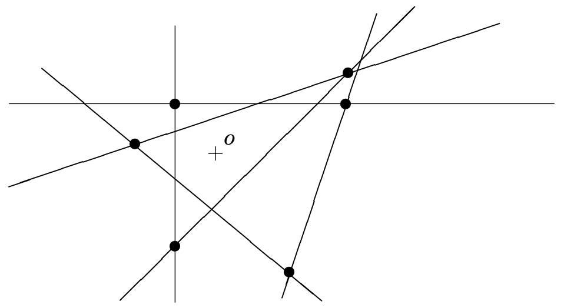

<head>
    
    
</head>

# Table of Contents

1.  [统计证明](#org6e1a4a6)
    1.  [命题](#org0817386)
    2.  [问题](#org7e2a47f)
    3.  [定理](#orge96eef9)
    4.  [定理 $ m(3) \\ge 7 $](#org9b71866)
2.  [有限概率空间](#org6d44ad3)
    1.  [定理（Turan's theorem）](#org7be12ef)

# 统计证明

## 命题

存在一个n个变量的布尔函数不能被任意少于 $ 2^{n} / \\log_ {2}{(n+8)} $个符号的公式定义。例如，对23个变量我们需要超过一百万个符号的公式

**证明** 所有n个变量的布尔函数的数量是 $ 2^{2^{n}} $，其n个变量公式的数量被最多m个符号写出的不超过 $ (n + 8)^{m} $个，因为公式中每m个位置可被n + 7个可能的符号填充，或可能是空白。这样，我们也统计了许多无意义的字符串符号，但一个初略的上限是有的。如果 $ 2^{2^{n}} > (n + 8)^{m} $，则存在一个布尔函数不能被最多m个符号表达。通过算法中的不等式，我们获得 $ m \\ge 2^{n} / \\log_ {2}{(n+8)} $

## 问题

假设 $ \\mathcal{M} $的每个集合都是k个元素。则 $ \\mathcal{M} $系统中不能两颜色着色的最小的个数m(k)是多少？

容看得到m(2) = 3，因为我们需要3条边来使图形不能两分。但对k = 3时问题要复杂很多。在之前的章节中，我们有一个7个3元组的系统不是两着色的，名为Fano plane，这样m(3) <= 7。事实上，m(3) = 7；为证明这个，我们需要显示所有6个或更少的3元组系统是可以两着色的。我们开始一个一般化陈述来给定一个k = 3的弱化边界。然后，对某些更大的效应，我们将改进k = 3的特殊情况的结果

## 定理

我们有 $ m(k) \\ge 2^{k-1} $，例如，任意大小为k的系统集合元素个数小于 $ 2^{k-1} $是一个两着色的

**证明** 设 $ \\mathcal{M} $为某个集合X的k元素子集的系统，且设 $ \| \\mathcal{M} \| = m $。我们通过如下随机过程给X的每个点着上红色或白色。对每个点 $ x \\in X $，我们投一个硬币。如果我们得到头面我们把x着上白色否则我们着上红色

设 $ M \\in \\mathcal{M} $为考虑的系统中k元组之一。M中所有点在随机着色中获得相同颜色的概率是什么？所有k个点同时为白色的概率是 $ 2^{-k} $，且所有点同时为红色的概率为 $ 2^{-k} $。M不是同为一个颜色的概率为 $ 2 \\cdot 2^{-k} = 2^{1-k} $。因此 $ \\mathcal{M} $中m个集合至少一个是单色的概率是 $ m2^{1-k} $。如果该数字严格小于1，例如，如果 $ m < 2^{k-1} $，则我们随机着色是两着色对系统 $ \\mathcal{M} $是一个非零的概率。因此，至少一个两着色存在

对很大的k，函数m(k)增长$ 2^{k} $（更精确地，我们有 $ m(k) = \\Theta(2^{k}k^{1/3}) $且 $ m(k) = O(2^{k}k^{2}) $；）且这样定理给出一个非常好的主意，另一方面，对k = 3我们只给出估计 $ m(k) \\ge 4 $，我们使用两个技巧改进该边界

## 定理 $ m(3) \\ge 7 $

我们必须显示一个有限集合X上任意6个元组的系统是可两着色的。我们区分两种情况：$ \| X \| \\le 6 $和 $ \| X \| > 6 $。只有前一种情况需要用概率讨论

**引理** 设X为一个集合最多6个元素，且设 $ \\mathcal{M} $为X上最多6个元组的系统。则 $ \\mathcal{M} $是可两着色的

**证明** 如果需要，我们添加更多的点到X使得它有6个点。我们随机选择6个点中的3个着上白色，其他3个着上红色。如果M是 $ \\mathcal{M} $中任意一个元组，则只有两种可能让M为单色：要么M全红剩下的3个点为白色，或M全白其他点为红色。因此M是单色的概率是 $ \\frac{1}{10} $。$ \\mathcal{M} $中的6个元组中的一些变成单色的概率不超过 $ \\frac{6}{10} < 1 $，因此有一个两着色存在

相同的证明也显示6个点上的任意9个元组也是两着色的

对第二步骤，我们需要如下定义。设 $ (X, \\mathcal{M}) $为一个集合系统，设x, y为X中两个元素。我们说x和y是连通的如果存在一个集合 $ M \\in \\mathcal{M} $包含x和y。如果x和y为不连通的点，我们定义一个新的集合系统 $ (X^{\\prime}, \\mathcal{M}^{\\prime} $通过粘合x和y到一起。点x和y被一个z点替代，我们把z放入之前包含x或y的所有集合中。形式化为：$ X^{\\prime} = (X \\ \\{x, y\\}) \\cup \\{z\\}, M^{\\prime} = \\{ M \\in \\mathcal{M}: M \\cap \\{x, y\\} = \\emptyset\\} \\cup \\{(M \\ \\{x, y\\}) \\cup \\{z\\}: M \\in \\mathcal{M}, M \\cap \\{x, y\\} \\ne \\emptyset \\} $

让我们记如果点x和y不连通且 $ \\mathcal{M} $是一个3元组的系统，则 $ (X^{\\prime}, M^{\\prime}) $也是一个三元组系统，且集合 $ X^{\\prime} $比X少一个点。进一步我们声称如果 $ (X^{\\prime}, \\mathcal{M}^{\\prime}) $是两着色的则 $ (X, \\mathcal{M}) $也是一个两着色的。考虑一个两着色的集合 $ X^{\\prime} $，及对应的集合X，x和y为z的颜色，容易看到不会出现单色集合。因此，为完成定理证明，提供以下引理：

**引理** 设 $ (X, \\mathcal{M}) $为 $ \| X \| \\ge 7 $的6个元组的系统，则X包含两个点在 $ \\mathcal{M} $中不连通

**证明** 一个三元组 $ M \\in \\mathcal{M} $使得3对点连接。因此6个三元组使得最多 $ 3 \\cdot 6 = 18 $个点对连接。但点对的总数目在7元素集合中为 $ \\left(\\begin{array}{l} 7 \\\\ 2\\end{array}\\right) = 21 $，因此一些点对没有连接（至少3个）

让我们标记m(4)未知（对更大的k也是）。它容易得出m(4)可通过有限多个配置（4元组系统）计算出。但配置的数量超出所有超级计算机的能力

# 有限概率空间

## 定理（Turan's theorem）

对任意n个顶点的图形G，我们有

$ \\alpha(G) \\ge \\frac{n^{2}}{2 \| E(G) \| + n} $

$ \\alpha(G) $记为图形G中顶点最大独立集合的大小，一个独立集合是一个顶点集合使得其相互不会被一条边连接

该概率方法用来证明如下引理：

**引理** 对任意图形G，我们有

$ \\alpha(G) \\ge \\sum_ {v \\in V(G)} \\frac{1}{\\operatorname{deg}_ {G}(v) + 1} $

（ $ \\operatorname{deg}_ {G}(v) $记为图形G中顶点v的度数）

**证明** 假设G的顶点为 $ 1, 2, \\ldots, n $，让我们用一个随机的顶点排列 $ \\pi $。我们定义一个集合 $ M = M(\\pi) \\subseteq V(G) $，包含所有顶点v使得v的所有邻居u满足 $ \\pi(u) > \\pi(v) $；即顶点v在 $ \\pi $的排序中在所有它的邻居前面。注意集合 $ M(\\pi) $在G中是一个独立集合，且对任意排列 $ \\pi $有 $ \| M(\\pi) \| \\le \\alpha(G) $。因此 $ E[\|M\|] \\le \\alpha(G) $。我们现在用不同的方法计算M的期望大小

对一个顶点v，设 $ A_ {v} $为事件 $ v \\in M(\\pi) $。如果 $ N_ {v} $记为顶点v的所有邻居的集合，则集合 $ N_ {v} \\cup \\{v\\} $的所有顺序在排序 $ \\pi $下有相同的概率，且这样v为该集合最小元素的概率为 $ 1 / (\| N_ {v} \| + 1) = 1 / (\\operatorname{deg}_ {G}(v) + 1) $。因此 $ P(A_ {v}) = 1 / (\\operatorname{deg}_ {G}(v) + 1) $，且我们可计算：

$ \\begin{aligned} \\alpha(G) &\\ge E[\|M\|] = \\sum_ {v \\in V(G)}E[I_ {A_ {v}}] \\\\ &= \\sum_ {v \\in V(G)}P(A_ {v}) = \\sum_ {v \\in V(G)}P(A_ {v}) = \\sum_ {v \\in V(G)}\\frac{1}{\\operatorname{deg}_ {G}(v) + 1} \\end{aligned} $

**定理的证明** 边 $ e = \| E(G) \| $的数量是顶点度数的一半。这样我们有如下情形：对非负实数 $ d_ {1}, d_ {2}, \\ldots, d_ {n} $，我们知道 $ \\sum_ {i=1}^{n} d_ {i} = 2e $，且我们问和的最小可能值是

$ \\sum_ {i=1}^{n} \\frac{1}{d_ {i} + 1} $

它可显示和最小时是 $ d_ {1} = d_ {2} = \\cdots = d_ {n} = 2e / n $。这样，该值即为定理中的值 $ n^{2} / (2e + n) $

**$ \\le k $的交的数量** 这是某些几何算法分析中的一个几何问题。让我们考虑一个集合L包含平面中n条线，使得没有3条线会有公共点且相互不会平行。设o为一个不在L中的点。我们将考虑L中的线相交对。每对线有一个交点，因此一共有 $ {n \\choose 2} $个相交。我们说如果线段ov相交则一个相交v有k个，两条线定义一个交v，L至少有k条线。对给定的n和k，交最多为k的最大可能相交数为多少？以下定理给定一个上界，其为常量比例的最大可能值
