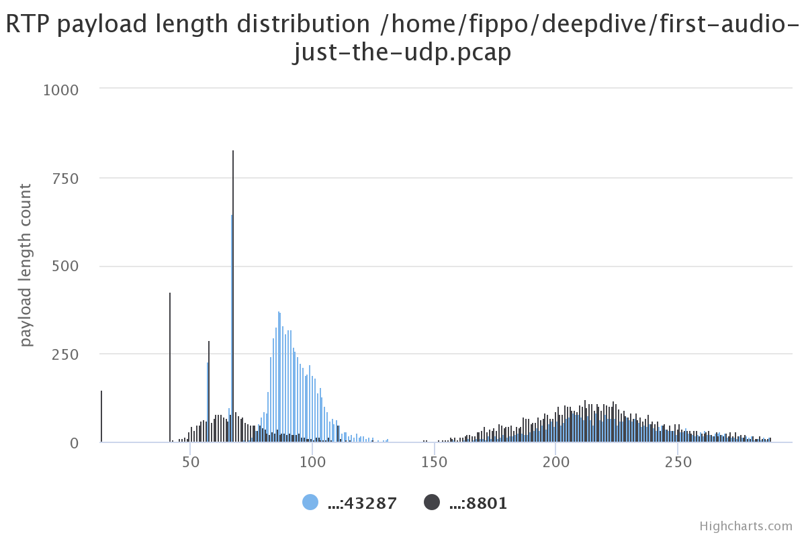
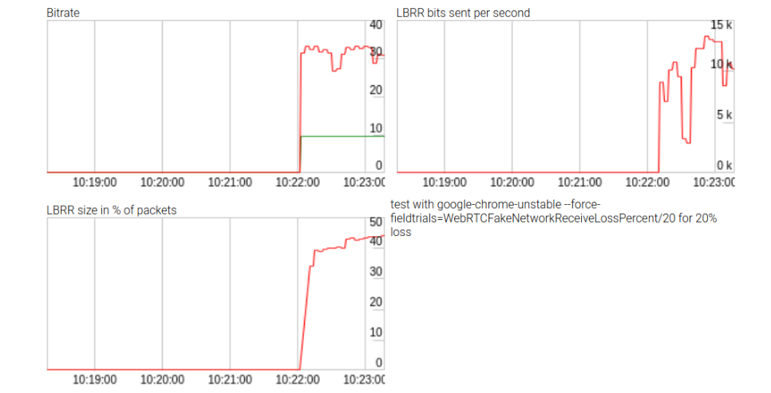
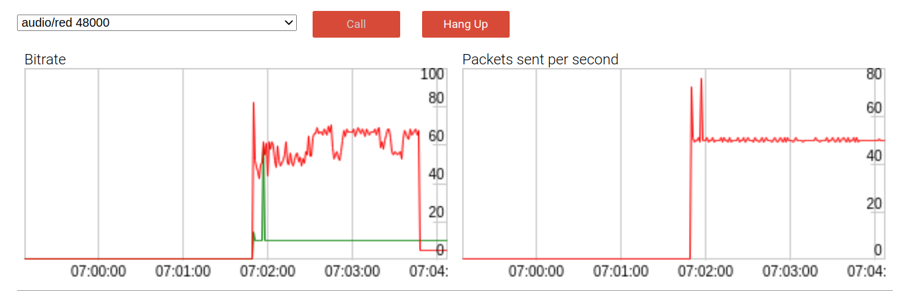
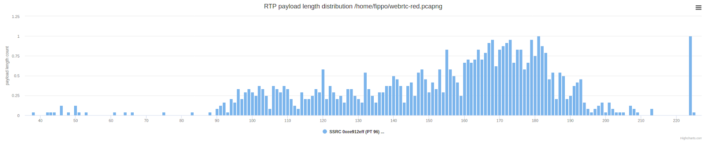
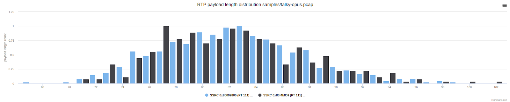
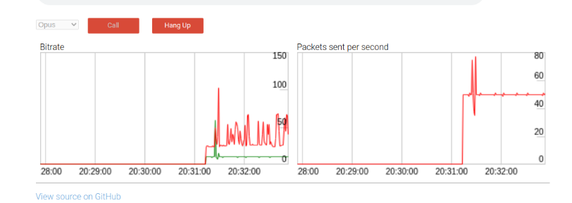
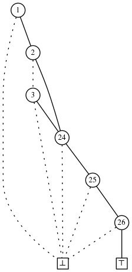

<head>
    
    
</head>

# Table of Contents

1.  [Algorithm](#org96aa9ee)
2.  [Review](#org475aff8)
    1.  [Opus FEC](#org24515fc)
    2.  [And I see RED](#org1d81643)
    3.  [添加Voice Activity Detection(VAD)支持](#org110c285)
    4.  [找到正确的距离](#orgdbfee2f)
    5.  [在真实世界中度量性能](#org5aa9fcc)
3.  [Tips](#orgb82f210)
4.  [Share](#orgaa162dc)

# Algorithm

A Simple Problem with Integers: <http://poj.org/problem?id=3468>

<https://dreamume.medium.com/poj-a-simple-problem-with-integers-5daab870672f>

# Review

webrtcH4cKS: ~ RED: Improving Audio Quality with Redundancy

<https://webrtchacks.com/red-improving-audio-quality-with-redundancy/>

2020年4月Citizenlab报告了Zoom弱加密问题且报道了Zoom使用SILK音频编码。不幸地是，该文章没有包含裸数据来验证。感想谷歌Project Zero的Natalie Sivanovich帮助我们使用Frida跟踪工具并提供一些裸SILK音频帧的dump。这些分析激发我们探查WebRTC如何处理音频。音频质量更容易感知当我们注意到一些小故障时。十秒音频的分析足够使我们探索WebRTC提供的音频质量的可能的改进

我在2017年查看Zoom客户端发现音频包相比任意基于WebRTC的方案大得多：

上图显示了一些带UDP payload长度的包。150到300字节长度的包相比典型的WebRTC电话来说不常见。有很多比我们典型的从Opus里获得的包要长。我们怀疑有某些前向纠错(FEC)或向后冗余但没法访问到未加密帧

未加密的SILK帧显示一个相似的分布。在转换帧到文件且播放，我用wireshark查看了包。下面是一个我发现特别有意思的包含了3个包的例子：

    packet 7:
    e9e4ab17ad8b9b5176b1659995972ac9b63737f8aa4d83ffc3073d3037b452fe6e1ee
    5e6e68e6bcd73adbd59d3d31ea5fdda955cbb7f
    
    packet 8: 
    e790ba4908639115e02b457676ea75bfe50727bb1c44144d37f74756f90e1ab926ef
    930a3ffc36c6a8e773a780202af790acfbd6a4dff79698ea2d96365271c3dff86ce6396
    203453951f00065ec7d26a03420496f
    
    packet 9:
    e93997d503c0601e918d1445e5e985d2f57736614e7f1201711760e4772b020212dc
    854000ac6a80fb9a5538741ddd2b5159070ebbf79d5d83363be59f10ef
    e790ba4908639115e02b457676ea75bfe50727bb1c44144d37f74756f90e1ab926ef
    930a3ffc36c6a8e773a780202af790acfbd6a4dff79698ea2d96365271c3dff86ce6396
    203453951f00065ec7d26a03420496f
    e9e4ab17ad8b9b5176b1659995972ac9b63737f8aa4d83ffc3073d3037b452fe6e1ee
    5e6e68e6bcd73adbd59d3d31ea5fdda955cbaef

第9个包完全包含两个之前的包。第8个包包含之前的包。这样的冗余是一个特性，通过SILK解码器的深度挖掘（可从Skype小组提交的因特网草案或从它的github仓库）显示这是SILK的LBRR - 低比特率冗余：

    } else if (psDec->FrameTermination == SKP_SILK_LBRR_VER1) {
        psDec->inband_FEC_offset = 1; // FEC info with 1 packet delay
        psDec->no_FEC_counter = 0;
    } else if (psDec->FrameTermination == SKP_SILK_LBRR_VER2) {
        psDec->inband_FEC_offset = 2; // FEC info with 2 packets delay
        psDec->no_FEC_counter = 0;
    }

ZOOM使用SKPSILKLBRRVER1，但有两个冗余包。如果每个UDP包包含不止当前的音频帧还包含前两帧，这将使你丢失两个包都没关系。所以Zoom音频质量的关键是Skype的秘密诀窍?

## Opus FEC

我们如何用WebRTC获取相同？看一下Opus FEC。LBRR，低比特率冗余，SILK也包含在Opus里。然而，Opus SILK和Skype开源的原始的SILK不同，LBRR部分被用来前向纠错模式

在Opus，前向纠错不只是在原始音频帧之后添加而在它之前且被字节流编码。我们实验尝试使用可插入流api添加我们自己的前向纠错但需要在实际的包之前一个完整的相关信息插入进字节流

然而没有成功，允许收集一些LBRR效果的统计数据如上图显示。LBRR使用比特率上升到10kbps（或数据比特率的2/3）。这些统计不被WebRTC getStats()接口导出，因此它们的结果非常有趣

对重编码的问题，Opus FEC被证明在WebRTC中被配置了一些无帮助的方法：

-   它启动基于包丢失且我们想要所有时间有冗余信息，这样在任意问题时它都有。这意味着我们不能默认启动它且在随机零星的丢失中保护我们
-   前向纠错的数量限制为25%。超过后它就没什么用了
-   FEC的比特率从目标最大比特率上减掉

从目标最大比特率上减掉FEC比特率非常没用 - FEC减少了流核心的比特率。一个低比特率流一般导致质量下降。如果没有任何包丢失对FEC来纠正则这将导致质量更糟而不是改进。为什么它要这么做？一般的理论认为包丢失的一个原因是冲突。如果你有冲突，你不想要发送更多的数据因为那只会让事情更糟。然而，如Emil lvov在2017年KrankyGeek谈话中说，冲突不总是包丢失的原因。另外，这个处理也忽略了任意相伴随的视频流。对Opus音频基于冲突的FEC策略当发送上百千比特视频相对只有50kbpsOpus流的时候没有什么意义。可能我们将看到将来libopus的一些改变。直到那时它可能关闭它，当前在WebRTC上默认是启动的

## And I see RED

如果我们想要事实上的冗余，RTP有一个解决方案，称为RTP Payload for Redundant Audio Data，或RED。它很老了，于1997年写入RFC 2198。它允许把多个不同时间戳的RTP playloads在相对低的负载下写入相同的RTP包

使用RED把一个或两个冗余音频帧放入每个包将比Opus FEC有更多的包丢失抗性。它会有一个成本，两倍或三倍音频比特率从30kbps到60kbps或90kbps（有额外的10kbps头部数据）。相比较超过每秒一兆每秒的视频数据它显得不起眼

WebRTC库事实上包含一个RED的二次编码器和解码器 - 现在它是冗余的。尽管一些效果来移除一些无用的音频RED代码，我管理使用编码器相对小的影响。WebRTC问题tracker包含完整的故事

现在用如下的标志运行Chrome可启动：

    --force-fieldtrials=WebRTC-Audio-Red-For-Opus/Enabled/

RED可通过SDP协商启动，它将显示如下：

    --force-fieldtrials=WebRTC-Audio-Red-For-Opus/Enabled/

它默认不启动因为消费额外的带宽不是一个好主意。为使用RED，改变编解码顺序使它在Opus编解码之前。这样做的一个方法是使用RTCRtpTransceiver.setCodecPreferences接口。SDP变换明显是另一个替代方案。SDP格式也可提供一个方法来配置冗余的最大水平但offer-answer RFC 1298语义不完全清楚这样我选择暂时不使用它

在音频采样中运行它显示如下行为。一个带一个冗余包的早期版本：

默认时，payload比特率（红线）接近60kbps两倍于没有冗余的情况。DTX（不连续传输）是一个带宽节省机制，它只在探测到语音时发送包。如期望的，当DTX被用来比特率影响在通话结束时迁移

观察包长度揭露了期望的结果：跟正常的payload长度分布相比为两倍的平均值：

这还是跟Zoom有点不同，Zoom中我们看到一些冗余，但许多包没有冗余

## 添加Voice Activity Detection(VAD)支持

如果包上有语音Opus FEC只发送冗余数据。这也应用到RED实现。为此，Opus编码器需要在SILK层确定固定导出正确的VAD信息。对这样的调整，如果有语音比特率只增长到60k比特

这样图谱跟Zoom更相似:

## 找到正确的距离

距离指冗余包的数量。我们发现RED带距离为1是很好的，RED带距离为2好更多。我们的实验室演绎模拟60%的随机包丢失。在Opus + RED环境下产生很好的音频而Opus不带RED则严重下减。WebRTC getStats()接口提供了一个非常有用的方法来度量比较隐藏的采样比例，其通过从总接收采样中分离隐藏采样获得

这些容易用如下JavaScript代码片段获得：

    (await pc2.getReceivers()[0].getStats()).forEach(report => {
      if(report.type === "track") console.log(report.concealmentEvents, report.concealedSamples, report.totalSamplesReceived, report.concealedSamples / report.totalSamplesReceived)})

我运行了一些包丢失测试，使用非常有用的WebRTCFakeNetworkReceiveLossPercent Chrome标志：

    --force-fieldtrials=WebRTC-Audio-Red-For-Opus/Enabled/WebRTCFakeNetworkReceiveLossPercent/20/

用20%的包丢失和FEC的默认启动在音频质量上没有大的区别但以下矩阵中列出了不同：

<table border="2" cellspacing="0" cellpadding="6" rules="groups" frame="hsides">

<colgroup>
<col  class="org-left" />

<col  class="org-right" />
</colgroup>
<thead>
<tr>
<th scope="col" class="org-left">场景</th>
<th scope="col" class="org-right">隐藏比例</th>
</tr>
</thead>

<tbody>
<tr>
<td class="org-left">无RED</td>
<td class="org-right">18%</td>
</tr>

<tr>
<td class="org-left">无RED, FEC禁止</td>
<td class="org-right">20%</td>
</tr>

<tr>
<td class="org-left">RED及距离为1</td>
<td class="org-right">4%</td>
</tr>

<tr>
<td class="org-left">RED及距离为2</td>
<td class="org-right">0.7%</td>
</tr>
</tbody>
</table>

没有RED或FEC测量在需要的包丢失下相同，有一些对FEC的小影响，但不大

对60%的丢失音频质量在无RED时非常不好，使得声音有点金属感且单词难以理解：

<table border="2" cellspacing="0" cellpadding="6" rules="groups" frame="hsides">

<colgroup>
<col  class="org-left" />

<col  class="org-right" />
</colgroup>
<thead>
<tr>
<th scope="col" class="org-left">场景</th>
<th scope="col" class="org-right">隐藏比例</th>
</tr>
</thead>

<tbody>
<tr>
<td class="org-left">无RED</td>
<td class="org-right">60%</td>
</tr>

<tr>
<td class="org-left">RED及距离1</td>
<td class="org-right">32%</td>
</tr>

<tr>
<td class="org-left">RED及距离2</td>
<td class="org-right">18%</td>
</tr>
</tbody>
</table>

在RED及距离1时有一些人造音，在RED及距离2时几乎完美（这也是现在使用的冗余总量）

## 在真实世界中度量性能

我们希望引入RED到Opus改进音频质量，但它在一些情况下会使事情更糟。Emil Ivov自愿地第一个运行一些听力测试使用POLQA-MOS方法。这在Opus之前做过这样我们有一个基线来比较

如果初始化测试显示承诺的结果我们将运行大规模实验在主Jitis Meet开发使用我们上述提到的隐藏度量

注意对媒体服务器和SFU，启动RED更加复杂因为服务器需要管理RED重传来选择客户端，比如如果不是会议中所有客户端支持RED。一些客户端可能有一些带宽限制不想要RED。如果一个端点不支持RED，SFU可移除冗余编码且发送无包装的Opus。它可能自己实现RED且使用RED当从一个端点重发Opus包来支持RED

# Tips

看《设计模式之美》，里面提到的抽象个人觉得很重要。作者提到抽象作为一种只关注功能点不关注实现的设计思路，帮助大脑过滤掉许多非必要的信息。在面对复杂系统的时候，人脑能承受的信息复杂度是有限的，所以我们必须忽略掉一些非关键性的实现细节

在对功能的理解基础上，能设计出合理的抽象，则是优秀程序员应该具有的能力。为什么设计这样的抽象，解决了什么问题，这其中体现了你的思考。因为一种设计不可能解决所有问题，在综合了所有考虑因素之后所做出的决定能看出你的取舍

由于抽象之后功能点更加突出，隐藏和屏蔽了细节，只暴露必要的信息，这样自然降低了复杂度。甚至你可以结合你对功能的理解，在更高层次或维度上做一些抽象，有时会产生更好的效果

# Share

Goto considered helpful

<https://crypto.stanford.edu/pbc/notes/zdd/example.html>

让我们重新检查我们的第一个例子：

F = {{A, B, X, Y, Z}, {A, C, X, Y, Z}}。我们希望用这样的方式保存房间使得我们可仍然能容易地操作F，这不是一般的压缩技术。事实上，保存房间并保持运行时间还不够，我们需要改进运行时间。为解决我们的问题，我们必须比比特域更高效地使用时间和空间

我们注意到F中两个集合有很多相同元素，整个家族F有如下函数：

输入：一个集合S

-   I7: if $ A \\notin S $ 返回0， 否则goto I6:
-   I6: 如果 $ B \\notin S $ goto I5，否则
    -   如果任何 $ C, \\ldots, W $在S中返回0，否则 goto I4
-   I5: 如果 $ C \\notin S $返回0；否则
    -   如果任意 $ D, \\ldots, W $在S中返回0，否则 goto I4
-   I4: 如果 $ X \\notin S $返回0，否则 goto I3
-   I3: 如果 $ Y \\notin S $返回0，否则 goto I2
-   I2: 如果 $ Z \\notin S $返回0，否则返回1

一个集合S在F中当且仅当该函数返回1。我们可呈现该程序为一个有向无循环图：

我们将解释为一个程序。开始于最上面的节点。节点标签为i意味着我们测试如果第i个字母在集合S中，如果不在，我们跟从虚线，否则我们走实线

如果目标节点有标签j，我们返回0如果i和j之间的字母在S中，然后我们重复该过程在目标节点上。如果我们到达节点T则我们返回1，且相似地如果我们达到 $ \\perp $，我们返回0

一些情况下如果我们以字母表顺序检查S的成员我们有最好的程序。存在不必要的检查；当我们确定S是否在F中时则立即返回。相反地，用比特域的哈希表，计算一个hash需要查看每个比特

因此我们用一个8节点的单向不循环图替代26大小的2比特域。它可能出现不必要的麻烦但在一些合并操作后，我们会有集合有许多相同的元素，这种处理最终会赢。例如，$ F \\cup G $对我们的方案有利，因为所有它的4个集合包含A, X, Y, Z，但只有一个包含C

另外，即使没有合并操作和它们的特殊类型，某些问题自然地包含集合家族当以上述形式存储时有很好的压缩

我们如何一般化和形式化这些想法使得我们可系统的构建一个给定家族的如上形式？即使我们可以，该表示适合我们的问题吗？

有一些技巧可小心地选择避免选择的例子。一般地，开始节点有一个标签大于1，我们可有一个节点小于26指向 $ \\perp $。下一章节，将清楚描述如何转换这些例子为适合的

