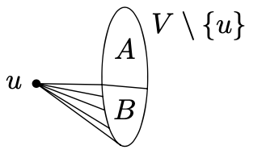
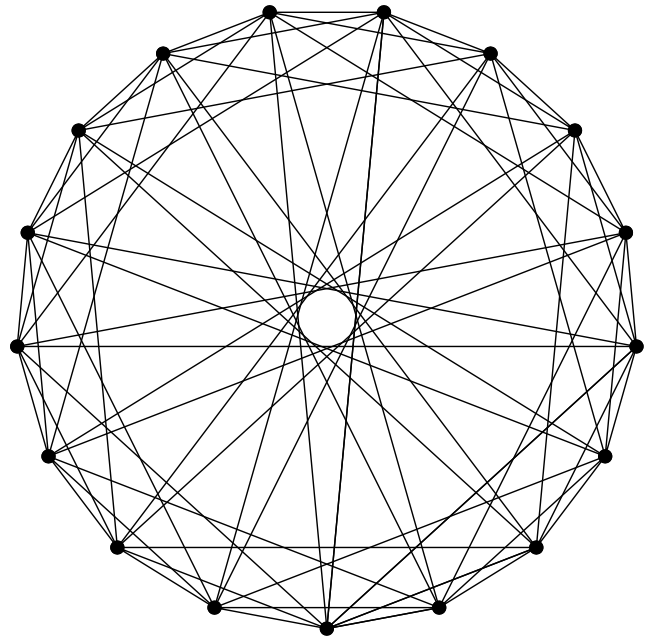

<head>
    
    
</head>

# Table of Contents

1.  [6个人的聚会](#org12b5603)
    1.  [定理](#org82b7db9)
    2.  [定理（鸽笼定理）](#org2869597)
2.  [对图形的Ramsey定理](#orgc162dbb)
    1.  [定理（对图形的Ramsey定理）](#org36a1240)
3.  [Ramsey数的一个更低的边界](#org5e436c3)
    1.  [定理](#orgab947c2)
    2.  [引理](#org9fdf442)

# 6个人的聚会

我们现在看一个6个人聚会的例子。设G为一个图形，我们引入如下的记号：$ \\omega(G) $记为一个完全子图的最大顶点数，且 $ \\alpha(G) $为G中一个独立集合的最大顶点数，即集合中两个顶点之间没有被一条边连接

## 定理

设G为一个至少6个顶点的图，则 $ \\alpha(G) \\ge 3 $ 或 $ \\omega(G) \\ge 3 $

**证明** 让我们任意选择G中一个顶点且让我们把它记为u。设 $ A \\subseteq V(G) \\ \\{u\\} $为不连接到u的顶点集合；形式为 $ A = \\{v \\in V(G): v \\ne u, \\{u, v\\} \\notin E(G) \\} $。设 $ B = V(G) \\ A \\ \\{u \\} $ 包含连接到u的顶点。因为 $ \| V(G) \| \\ge 6 $，A、B集合中必须至少有一个有3个元素。我们现在区分两种情况

1.  $ \| A \| \\ge 3 $。设A包含顶点x, y, z。如果每两个形成G的一条边，则 $ \\{x, y, z\\} $确定为一个三角形，例如，一个完全子图显示 $ \\omega(G) \\ge 3 $。否则，如果，例如，$ \\{x, y\\} \\notin E(G) $，则 $ \\{x, y, z \\} $在G中是一个独立集合，且这样 $ \\alpha(G) \\ge 3 $
2.  $ \| B \| \\ge 3 $。我们继续分析：要么B中没有没有顶点对是G的边，则 $ \\alpha(G) \\ge 3 $，否则存在顶点 $ x,y \\in B $形成G的一条边。第二种情况集合 $ \\{u, x, y \\} $引入一个G的完全子图，且因此 $ \\omega(G) \\ge 3 $

注意我们需要区分多少情况来区分证明6个顶点图形的定理。在上面定理的证明中我们使用了一个特殊的情况，$ t = 2, n_ {1} = n_ {2} = 3 $，和如下著名的定理

## 定理（鸽笼定理）

设 $ n_ {1}, n_ {2}, \\ldots, n_ {t} $为自然数，设X为至少 $ 1 + \\sum^{t}_ {i=1} (n_ {i} - 1) $个元素的集合，且设 $ X_ {1}, X_ {2}, \\ldots, X_ {t} $为不相交集合形成X的分区。则存在i使得 $ X_ {i} $有至少 $ n_ {i} $个元素

# 对图形的Ramsey定理

## 定理（对图形的Ramsey定理）

设图形G有至少 $ {k + \\ell - 2 \\choose k - 1} $个顶点，则 $ \\omega(G) \\ge k $ 或 $ \\alpha(G) \\ge \\ell $

让我们记定理的条件对k和 $ \\ell $是对称的，因为 $ {k + \\ell + 2 \\choose k - 1} = { k + \\ell - 2 \\choose \\ell - 1} $

如果我们在定理中用 $ k = \\ell = 3 $替代，我们获得每个有 $ {4 \\choose 2} = 6 $个顶点的图形G满足 $ \\omega(G) \\ge 3 $ 或 $ \\alpha(G) \\ge 3 $

**证明** 我们继续在 $ k + \\ell $上进行归纳。对 k = 1 或 $ \\ell = 1 $容易看到该表述是满足的（对k = 2或 $ \\ell = 2 $也是）

现在让我们假设 $ k, \\ell \\ge 2 $且表述对 $ k, \\ell - 1 $和 $ k - 1, \\ell $成立。我们把 $ n = {k + \\ell - 2 \\choose k - 1 }, n_ {1} = {k + \\ell - 3 \\choose k - 1} $和 $ n_ {2} = {k + \\ell - 3 \\choose k - 2} $。通过Pascal公式我们有 $ n = n_ {1} + n_ {2} $，且我们重写为形式 $ n = 1 + ((n_ {1} - 1) + (n_ {2} - 1) + 1) $，则通过鸽槽原理可得证

设G = (V, E)为有n个顶点的任意图形。我们想要显示 $ \\omega(G) \\ge k $或 $ \\alpha(G) \\ge \\ell $。让我们选择任意一个顶点 $ u \\in V $。我们根据顶点是否连接到u分割剩下的顶点为两个集合A和B，如下图：

形式化为：

$ A = \\{v \\in V \\ \\{u \\}: \\{u, v\\} \\notin E \\} $

$ B = \\{v \\in V \\ \\{u \\}: \\{u, v\\} \\in E \\} $

通过鸽盒原理我们有 $ \| A \| \\ge n_ {1} $ 或 $ \| B \| \\ge n_ {2} $。如果 $ \| A \| \\ge n_ {1} $，我们对$ (k, \\ell - 1) $使用归纳假设。我们通过集合A满足$ \\omega(G_ {A}) \\ge k $或 $ \\alpha(G_ {A}) \\ge \\ell - 1 $归纳得到图形 $ G_ {A} $。前一种情况我们有 $ \\omega(G) \\ge k $，后一种情况任意独立集合 $ I \\subset A $与顶点u一起组成一个独立集合 $ I \\cup \\{u \\} $，这样 $ \\alpha(G) \\ge \\alpha(G_ {A}) + 1 \\ge \\ell $

在 $ \| B \| \\ge n_ {2} $的情况下，我们继续分析且我们也能获得 $ \\omega(G) \\ge k $ 或 $ \\alpha(G) \\ge \\ell $。这样归纳步骤结束

定理证明允许我们引入如下定义。设 $ r(k, \\ell) $记为最小自然数使得有n个顶点的每个图形G满足 $ \\omega(G) \\ge k $或者 $ \\alpha(G) \\ge \\ell $。数 $ r(k, \\ell) $被称为ramsey数，Ramsey图形定理保证 $ r(k, \\ell) $对每个 $ k \\ge 1 $ 且 $ \\ell \\ge 1 $存在

让我们总结Ramsey数的值：

$ \\begin{aligned} r(1, \\ell) &= 1, \\quad r(k, 1)=1 \\\\ r(2, \\ell) &= \\ell, \\quad r(k, 2)=k \\\\ r(3,3) &=6 . \\end{aligned} $

只有少数的一些Ramsey数已知。例如，r(4, 4) = 18，但r(5, 5)的值还未知

# Ramsey数的一个更低的边界

本节我们引入Ramsey数的一个基本属性之一。我们显示数r(k, k)，为简洁起见我们记为r(n)，非常快的以指数增长。在形式化和证明结果之前，让我们回忆提供一个r(k)的下边界意味着什么：如果我们声称r(k) > n，我们断言n个顶点的某个图形G的存在，G满足 $ \\omega(G) < k $且 $ \\alpha(G) < k $。（特别地，检查 $ n < {2k - 2 \\choose k - 1} $还不够，因为表达式 $ {2k - 2 \\choose k - 1} $只是r(k)的一个上限，且k(k)可能更小）

例如，在之前的章节中使用图形 $ C_ {5} $我们证明了r(3) > 5。我们也提及没有证据证明r(4) = 18。不等式r(4) > 17可通过如下图证明：

有趣地是，r(3) > 5和r(4) > 17对应的图形是同构的。这里我们将用概率的方法证明r(k)的下界

## 定理

设k和n为自然数满足 $ { n \\choose k } \\cdot 2^{1 - {k \\choose 2}} < 1 $，则r(k) > n

什么样的k和n满足定理条件？通常在概率方法中，我们将使用非常粗略简单地估计：

$ {n \\choose k} \\le \\frac{n^{k}}{k!} < \\frac{n^{k}}{2^{k/ 2 + 1}} $

(该不等式只在 $ k \\ge 3 $时成立）。我们根据定理有

$ {n \\choose k} \\cdot 2^{1 - {k \\choose 2}} < \\frac{n^{k}}{2^{k / 2 + 1}} \\cdot 2^{1 - k(k-1)/2} = (\\frac{n}{2^{k / 2}})^{k} $

这样定理的条件对 $ n = 2^{k / 2} $时满足

## 引理

对所有 $ k \\ge 3 $我们有 $ r(k) > 2^{k / 2} $

该不等式对k = 2也有效

**定理证明** 我们考虑一个随机图形G，其顶点集合为 $ V = \\{1, \\ldots, n \\} $，每个可能的 $ {n \\choose 2 } $条边以 $ \\frac{1}{2} $概率出现，跟其他边独立

设K为V中一个任意的k元素子集。设 $ A_ {K} $记为事件“K的顶点组成一个G的完整子图“。$ A_ {K} $的概率 $ P(A_ {K}) $为$ 2^{-{k \\choose 2}} $。相似地，如果我们记 $ B_ {K} $为事件“K的顶点组成G的一个独立集合“，则 $ P(B_ {K}) = 2^{-{k \\choose 2}} $ 。$ C_ {K} = A_ {K} \\cup B_ {K} $（例如，K组成一个完全子图或一个独立集合）的概率为 $ 2 \\cdot 2^{- {k \\choose 2}} = 2^{1 - {k \\choose 2}} $。设p记为概率，存在一个k元素 $ K \\subseteq V $，使得 $ C_ {K} $发送。该概率很难确定，因为事件 $ C_ {K} $一般不独立。但对我们的目的它有效估计了p，通过把所有 $ C_ {K} $的概率加和：

$ p \\le \\sum_ {K \\subseteq V, \| K \| = k} P(C_ {K}) $

我们然后获得 $ p \\le {n \\choose k} \\cdot 2^{1 - {k \\choose 2}} $，且因此，定理的假设确保 p < 1。但这意味着V中存在至少一个图形其 $ \\alpha, \\omega $都小于k

我们注意到证明不提供任意方法来构建想要的图形印证 $ r(k) > 2^{\\frac{k}{2}} $。不止这个证明不提供方法：现在还没有这样的图形构建被发现
