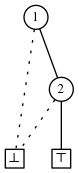

<head>
    
    
</head>

# Table of Contents

1.  [Algorithm](#orge337daf)
2.  [Review](#org2db7abf)
3.  [Tips](#org7ab41c7)
4.  [Share](#org9a4ba63)
    1.  [表征一个家族](#org826a143)
    2.  [特征](#orga793571)

# Algorithm

K-th Number: <http://poj.org/problem?id=2104>

<https://dreamume.medium.com/poj-k-th-number-50c297294218>

# Review

# Tips

代码精进之路 第一模块部分

开篇词不错，代码即名片，看代码即看到了这个人，在速度和质量之间权衡，质量更重要，速度可以放慢些

代码质量主要由工程师本身把控，但人人都会犯错，为确保少出错误，需要一个有效的机制来保障，如下是减少错误的五道关卡：

1.  程序员提高自身能力
2.  编译器
3.  回归测试
4.  代码评审
5.  代码分析

优秀的工程师永远是最主要的关键，要能够发现关键的问题

代码要规范，规范的代码你会越熟悉，容易知道套路和潜在问题，这样不管是写还是阅读都会很快，不容易出错，也更加高效

代码命名尽量要有意义，对于OC命名可以相对长些，能够望文生义，且不产生歧义，易于阅读和理解

代码要看起来整洁干净，层次分明，布局合理，让阅读舒适

最好的效果是代码即注释，如代码有不容易理解的地方，就需要注释，注释要准确、简明、清晰

# Share

ZDDs defined

<https://crypto.stanford.edu/pbc/notes/zdd/zdd.html>

ZDDs似乎是平凡的，它们跟一些著名的数据结构相似比如crit-bit树或DFA。尽管这样，它们必须满足的条件具有深远地影响

我们定义一个ZDD $ Z $为任意有向不循环图比如：

1.  一个中止节点要么
    1.  特殊节点 $ \\top $（TRUE节点），或
    2.  特殊节点 $ \\bot $（FALSE节点）
2.  每个非中止节点满足如下条件：
    1.  节点用一个正整数v标签，该标签不需要唯一
    2.  节点有出度为2。其一被称为"LO"，另一个为"HI"。在图表中，我们用点线画LO的边，实线画HI的边
    3.  一个目标节点要么为中止节点或标签为大于v的整数。这样我们可忽略图表中上箭头因为边方向可通过标签确认
    4.  HI节点边不会指向 $ \\top $节点
3.  只有一个节点入度为0，我们称之为根节点。这意味这根节点要么为中止节点要么为图表中标签为最小的整数
4.  如果两个节点有相同的标签，则它们的LO或HI边指向不同的节点。即没有冗余的节点

我们称 $ Z $为一个非缩略的ZDD，如果一个HI边指向 $ \\bot $或最后的条件不能满足

在我们第一个例子中，一个宇宙U为字母U，更一般地，我们考虑一个大小为n的U，标签元素为1到n

该图表在一个ZDD中以任意节点为根其本身也还是一个有效的ZDD。这样我们期望直接递归描述许多ZDD算法和属性。事实上，如果对动态规划比较适应则会感到对ZDD很舒适

## 表征一个家族

设$ F $为一个ZDD。设v为它的根节点，则

1.  如果 $ v = \\bot $则没有其他节点且 $ F $表示 $ \\emptyset $，则为空家族
2.  如果 $ v = \\top $则没有其他节点且 $ F $表示只包含空集的家族：$ \\{ \\emptyset \\} $。我们称之为单元家族，且记为 $ \\epsilon $
3.  否则v有两个孩子。设 $ v_ {0} $为LO节点，且 $ v_ {1} $为HI节点。设 $ F_ {i} $为通过归纳假设根为 $ v_ {i} $的ZDD的家族。则 $ F $表示为家族
    
    $ F_ {0} \\cup \\bigcup_ {\\alpha \\in F_ {1}} \\alpha \\cup \\{ v \\} $

即在真实生活中，我们用有和没有分割世界：在LO分支我们有$ F $中不包含v的集合：

$ F_ {0} = \\{\\alpha: \\alpha \\in F, v \\notin \\alpha $

在HI分支中我们有$ F $ 中包含v的集合，但我们在记录它们之前删除v：

$ F_ {1} = \\{ \\alpha \\ \\{v \\}: \\alpha \\in F, v \\in \\alpha \\} $

一些例子：

上面的是家族 $ \\emptyset \\cup \\{ \\emptyset \\cup \\{2\\}\\} = \\{\\{2\\}\\} $。这是 $ e_ {2} $，一个基本的家族。基本家族为形如 $ \\{\\{ n \\} \\} $的家族，且记为 $ e_ {n} $

更多的家族：

家族 $ \\{\\emptyset\\} \\cup \\{ \\emptyset \\cup \\{2\\}\\} = \\{\\emptyset, \\{2\\}\\} $

家族 $ \\{\\{2\\}\\} \\cup \\{\\emptyset \\cup \\{1\\}\\} = \\{\\{1\\}, \\{2\\}\\} $

家族 $ \\epsilon \\cup \\{\\{1\\} \\cup \\{2\\}\\} = \\{\\{1,2\\}\\} $

## 特征

两个ZDD相同当且仅当它们表征的家族相同。当我们谈到家族为一个ZDD时，我们表示ZDD代表家族

我们可按字母序统计所有F中集合

我们有 $ \| F \| = \| F_ {0} \| + \| F_ {1} \| $，这样我们可递归计算ZDD中集合数。这也允许我们选择，例如，42个成员的家族中第13个集合。随机访问非常快，且分析在编程语言中延迟演绎比如Haskell:ZDD可按需产生想要的家族成员。这样任意操作我们可在一个集合数组上做，我们可在一个ZDD上高效地做相似地事情

我们可修改这些技术使得如果我们在一个宇宙中权重每个成员，在递归访问每个成员之后，我们可找到家族中最大（最小）权重的集合，且统计这样的平均数和标准方差。我们可计算有趣的生成函数，比如我们可读取给定大小的集合的数目。对一个数组表示的家族，我们不得不访问每个集合。对一个ZDD，我们只需要访问每个节点，这样访问量更小

作为用树构建的数据结构，我们可转换递归算法为从低向上的迭代算法。为简洁性我们使用递归算法，在实际中迭代算法更好
