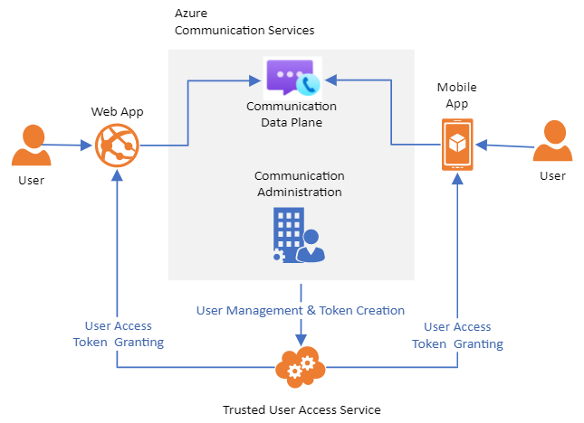

<head>
    
    
</head>

# Table of Contents

1.  [Algorithm](#orge337daf)
2.  [Review](#org2db7abf)
    1.  [提供的API和特性](#org624a9fc)
    2.  [接受WebRTC](#orga50ae20)
    3.  [客户端SDK](#org7068e58)
    4.  [服务端管理SDK](#org07be1bd)
    5.  [其他特性](#orgfe24c00)
    6.  [信令](#org613d9bf)
    7.  [SDP & Media](#org395161a)
        1.  [PeerConnection规划](#orgc359edd)
        2.  [ICE](#org3cb814a)
        3.  [加密](#org49849bb)
        4.  [编解码](#orgfdeb72b)
        5.  [RTCP](#orga6b24ad)
        6.  [带宽估计（BWE）](#orgf7d2cc4)
        7.  [其他未确定的事项](#org4d08927)
    8.  [总结](#orga25043c)
3.  [Tips](#org7ab41c7)
4.  [Share](#org9a4ba63)
    1.  [表征一个家族](#org826a143)
    2.  [特征](#orga793571)

# Algorithm

K-th Number: <http://poj.org/problem?id=2104>

<https://dreamume.medium.com/poj-k-th-number-50c297294218>

# Review

webrtcH4cKS: ~ How does the new Azure Communication Services implement WebRTC? (Gustavo Garcia)

<https://webrtchacks.com/how-does-azure-communication-services-implement-webrtc-gustavo-garcia/>

我们有一个长的传统分析使用WebRTC的主要服务。随着WebRTC的成功，该列表变得越来越长，我们难以跟上。幸运地是我们喜欢的作者之一Gustavo Garcia Bernardo最近花时间审查了新的微软Azure通讯服务，他发现一些有趣的结果我们将在这里呈现

Gustavo有一个实时通讯领域的一个资深职业且对WebRTC早期的工作有亲密的关系

我假设你知道微软Azure，这是一家1.6万亿市值的公司做的一个大产品。微软有一个长期且非常唯一的WebRTC历史，这样我们非常好奇WebRTC如何作为它们的一部分使用

注意我联系过微软Azure通讯小组来给我们一个简短的重审，他们提供技术精确度

几周前微软宣布了Azure通讯服务（ACS）。该新产品在他们的云服务类目中提供通话、SMS、PSTN呼叫和视频通讯。它跟通讯平台服务（CPaaS）类目统治级选手比如Vonage、Twilio、Agora和Zoom或Amazon提供的视频API竞争

微软提供的与它的竞争者差别不大。本文将聚焦于语音和视频部分。它们基于WebRTC。如你所视在细节上它复用大量现存的微软框架（从Skype或微软小组）

在高级上，有两个api:

1.  管理API - 这包含服务端SDK用来创建用户和访问token
2.  客户端SDK - web、Android和iOS，这些连接端点到通讯服务器来发送接收音频/视频/屏幕共享及从PSTN和微软小组的媒体

## 提供的API和特性

客户端API有两个基本初始的特性

1.  呼叫
2.  房间

呼叫接口可以呼叫其他用户连接到系统。房间接口可使你加入一个一般化的房间。唯一识别号和呼叫的支持可能比其他平台更强因为是以小组平台提供的特性集成和复用架构。有趣地是缺乏房间的访问控制，如果房间ID已知每个访问token都允许加入每个房间

客户端基本的呼叫控制操作（静音/非静音，持有/非持有，屏幕共享）提供给一些音频视频设备管理API来简化系统配置

## 接受WebRTC

做一个总结，让我们比较Azure和WebRTC标志上的不同（W3C或IETF草案）；

<table border="2" cellspacing="0" cellpadding="6" rules="groups" frame="hsides">

<colgroup>
<col  class="org-left" />

<col  class="org-left" />

<col  class="org-left" />
</colgroup>
<thead>
<tr>
<th scope="col" class="org-left">特性</th>
<th scope="col" class="org-left">WebRTC/RTCWeb</th>
<th scope="col" class="org-left">Azure</th>
</tr>
</thead>

<tbody>
<tr>
<td class="org-left">SDES</td>
<td class="org-left">必须不能只提供SDES</td>
<td class="org-left">使用SDES</td>
</tr>

<tr>
<td class="org-left">ICE</td>
<td class="org-left">RFC 5245</td>
<td class="org-left">RFC 5245, 完整的ICE而不是ice-lite</td>
</tr>

<tr>
<td class="org-left">音频编码</td>
<td class="org-left">Opus或G.711</td>
<td class="org-left">G.722，它是可选的和G.711</td>
</tr>

<tr>
<td class="org-left">视频编码</td>
<td class="org-left">VP8或H.264</td>
<td class="org-left">P2P支持的H.264, VP8</td>
</tr>

<tr>
<td class="org-left">多流</td>
<td class="org-left">统一规划</td>
<td class="org-left">规划B</td>
</tr>

<tr>
<td class="org-left">多播</td>
<td class="org-left">标准，实现上有些改变</td>
<td class="org-left">不支持</td>
</tr>
</tbody>
</table>

## 客户端SDK

提供Web、iOS和Android客户端SDK，浏览器支持是受限的，它只支持Chrome，Safari的一些限制支持（只接收）和新的windows下的Edge

<table border="2" cellspacing="0" cellpadding="6" rules="groups" frame="hsides">

<colgroup>
<col  class="org-left" />

<col  class="org-left" />

<col  class="org-left" />

<col  class="org-left" />

<col  class="org-left" />

<col  class="org-left" />

<col  class="org-left" />
</colgroup>
<thead>
<tr>
<th scope="col" class="org-left">浏览器</th>
<th scope="col" class="org-left">Windows</th>
<th scope="col" class="org-left">MacOS</th>
<th scope="col" class="org-left">Ubantu</th>
<th scope="col" class="org-left">Linux</th>
<th scope="col" class="org-left">Android</th>
<th scope="col" class="org-left">iOS</th>
</tr>
</thead>

<tbody>
<tr>
<td class="org-left">Chrome</td>
<td class="org-left">✓</td>
<td class="org-left">✓</td>
<td class="org-left">✓</td>
<td class="org-left">✓</td>
<td class="org-left">✓</td>
<td class="org-left">n/a</td>
</tr>

<tr>
<td class="org-left">New Edge</td>
<td class="org-left">✓</td>
<td class="org-left">&#xa0;</td>
<td class="org-left">&#xa0;</td>
<td class="org-left">&#xa0;</td>
<td class="org-left">&#xa0;</td>
<td class="org-left">n/a</td>
</tr>

<tr>
<td class="org-left">Safari</td>
<td class="org-left">n/a</td>
<td class="org-left">一些</td>
<td class="org-left">n/a</td>
<td class="org-left">n/a</td>
<td class="org-left">n/a</td>
<td class="org-left">✓</td>
</tr>
</tbody>
</table>

当测试Web和Android SDK时注意到它们需要一些打磨，例如浏览器日志显示了很多冗余信息

## 服务端管理SDK

管理SDK用来创建用户和token，微软支持C#、Python、Java和Node.js。这些SDK将运行在一个可信任的应用程序中且需要Azure控制台创建的一个访问key

## 其他特性

一些其他功能：

1.  PSTN呼叫：提供的预览版不允许我们测试这个功能，但根据文档它提供1:1和组呼叫功能
2.  SMS - 也不允许测试，但发送和聊天也作为Azure的通讯的部分提供
3.  组集成：不允许测试

在文档和SDK中没有提及录制和广播功能及任何Azure集成流处理能力比如文本到语音或可视化API

## 信令

信令基于http请求。我们能看到在信令中显示许多指向Skype域，这显示了该产品如何作为其他已存在的微软生态系统的一部分。事实上在Azure通讯服务中JWT Token里的用户唯一号被称为skype id:

如下是当你静默/非静默麦克风时基于Http的自定义JSON格式的专属信令：

对1:1呼叫系统直接使用P2P WebRTC连接。当在房间模式时，ACS使用一个SFU来在不同参与者之间转发音频视频包。这些SFU位于不同的区域。在我们的例子中（欧洲），我被分配给柏林的一个SFU服务器

## SDP & Media

### PeerConnection规划

客户端SDK使用一个WebRTC PeerConnection来发送和接收多个流。这是最有效且现代的机制，但不总是被用于所有平台。这时候它使用原始的B规划语义替代新的统一规划语义。许多大型应用程序现在还是在使用规划B

### ICE

ACS使用STUN和TURN TCP服务器。奇怪地是TURN TLS没有包括在内 - 这可能限制ACS的能力来在受限制的企业环境里连接

    http://localhost:5000/, { iceServers: [turn:52.158.34.11:3478?transport=udp, turn:52.158.34.11:443?transport=tcp], iceTransportPolicy: all, bundlePolicy: max-bundle, rtcpMuxPolicy: require, iceCandidatePoolSize: 0, sdpSemantics: "plan-b" }, {advanced: [{enableDtlsSrtp: {exact: false}}, {googCpuOveruseDetection: {exact: false}}]}

对用SFU直接连接，它使用典型的ICE UDP candidates但也使用ICE TCP candidates，端口为3478。ICE支持的是完整的ice而不是ice-lite。这在带公网IP的SFU上很不常见，因为它更难实现。完整的ICE不提供许多特性但也没有任何负面影响

### 加密

因WebRTC需要加密基于SRTP。然而，SFU/房间keys交换使用SDES而不是标准的DTLS协议。这更简单且提供更快地建立连接但只支持Chrome。它将很可能在某个时间点移除因为标准直接禁止SDES因为它不如DTLS安全

### 编解码

音频编解码使用G.722。这对WebRTC平台是不常见的，但也不奇怪，因为要连通PSTN和在现存的微软架构中重用。如下是SDP answer的音频信息的片段：

    m=audio 3480 RTP/SAVPF 9 0 8 13 101
    c=IN IP4 40.113.83.182
    a=rtpmap:9 G722/8000
    a=rtpmap:0 PCMU/8000
    a=rtpmap:8 PCMA/8000
    a=rtpmap:13 CN/8000
    a=rtpmap:101 telephone-event/8000

视频编解码用H.264。它使用RTX重传来实现可靠性。ACS不包括多播支持来适配视频质量给房间里不同的参与者。至少在例子中我测试比特率很低。你可从抓取到的发送者参数看到它如何配置使用H.264到200kbps

### RTCP

另外一些RTP/RTCP上的细节是在多数平台上使用bundle、rtcp-mux和rtcp-rsize。它也对每个流备用50个ssrc且在初始化建立期间在远端SDP上预分配8个远端流

### 带宽估计（BWE）

对带宽估计它使用接收端支持（基于REMB）而不是更现代且优化的发送端带宽估计（基于传输反馈）

### 其他未确定的事项

在SDP上发现有一些非标准的扩展，我怀疑这些没有什么影响可能是从其他应用程序继承过来的。例如：

    a=x-mediabw:applicationsharing-video send=8000;recv=8100
    a=x-source-streamid:19
    a=x-signaling-fb:* x-message app send:dsh
    a=x-signaling-fb:* x-message app send:src,csrc,vc recv:src

## 总结

Azure通讯服务的接口很简单。文档很好，它也承诺提供一个简单且有竞争力的价格模型

另一方面它还是一个测试阶段的产品。它和现存的竞争对手已服务数年的产品来说还不成熟。如果ACS为严谨考虑，微软将不得不扩展支持其他浏览器且清理现存的web支持。另外，一些视频质量技术的缺乏（主要是多播）且对新的编解码（特别是Opus）的不支持是失望的且希望在之后的版本中解决。录制功能的缺乏对多数流行的使用场景来说也是一个大问题

从我的观点来看最可能的部分是潜在的和Azure生态系统特征的集成比如推送消息、文本转语音、计算、pubsub等，例如它对视频/音频pubsub的支持将非常有用但这现在只对SMS有效

# Tips

代码精进之路 第一模块部分

开篇词不错，代码即名片，看代码即看到了这个人，在速度和质量之间权衡，质量更重要，速度可以放慢些

代码质量主要由工程师本身把控，但人人都会犯错，为确保少出错误，需要一个有效的机制来保障，如下是减少错误的五道关卡：

1.  程序员提高自身能力
2.  编译器
3.  回归测试
4.  代码评审
5.  代码分析

优秀的工程师永远是最主要的关键，要能够发现关键的问题

代码要规范，规范的代码你会越熟悉，容易知道套路和潜在问题，这样不管是写还是阅读都会很快，不容易出错，也更加高效

代码命名尽量要有意义，对于OC命名可以相对长些，能够望文生义，且不产生歧义，易于阅读和理解

代码要看起来整洁干净，层次分明，布局合理，让阅读舒适

最好的效果是代码即注释，如代码有不容易理解的地方，就需要注释，注释要准确、简明、清晰

# Share

ZDDs defined

<https://crypto.stanford.edu/pbc/notes/zdd/zdd.html>

ZDDs似乎是平凡的，它们跟一些著名的数据结构相似比如crit-bit树或DFA。尽管这样，它们必须满足的条件具有深远地影响

我们定义一个ZDD $ Z $为任意有向不循环图比如：

1.  一个中止节点要么
    1.  特殊节点 $ \\top $（TRUE节点），或
    2.  特殊节点 $ \\bot $（FALSE节点）
2.  每个非中止节点满足如下条件：
    1.  节点用一个正整数v标签，该标签不需要唯一
    2.  节点有出度为2。其一被称为"LO"，另一个为"HI"。在图表中，我们用点线画LO的边，实线画HI的边
    3.  一个目标节点要么为中止节点或标签为大于v的整数。这样我们可忽略图表中上箭头因为边方向可通过标签确认
    4.  HI节点边不会指向 $ \\top $节点
3.  只有一个节点入度为0，我们称之为根节点。这意味这根节点要么为中止节点要么为图表中标签为最小的整数
4.  如果两个节点有相同的标签，则它们的LO或HI边指向不同的节点。即没有冗余的节点

我们称 $ Z $为一个非缩略的ZDD，如果一个HI边指向 $ \\bot $或最后的条件不能满足

在我们第一个例子中，一个宇宙U为字母U，更一般地，我们考虑一个大小为n的U，标签元素为1到n

该图表在一个ZDD中以任意节点为根其本身也还是一个有效的ZDD。这样我们期望直接递归描述许多ZDD算法和属性。事实上，如果对动态规划比较适应则会感到对ZDD很舒适

## 表征一个家族

设$ F $为一个ZDD。设v为它的根节点，则

1.  如果 $ v = \\bot $则没有其他节点且 $ F $表示 $ \\emptyset $，则为空家族
2.  如果 $ v = \\top $则没有其他节点且 $ F $表示只包含空集的家族：$ \\{ \\emptyset \\} $。我们称之为单元家族，且记为 $ \\epsilon $
3.  否则v有两个孩子。设 $ v_ {0} $为LO节点，且 $ v_ {1} $为HI节点。设 $ F_ {i} $为通过归纳假设根为 $ v_ {i} $的ZDD的家族。则 $ F $表示为家族
    
    $ F_ {0} \\cup \\bigcup_ {\\alpha \\in F_ {1}} \\alpha \\cup \\{ v \\} $

即在真实生活中，我们用有和没有分割世界：在LO分支我们有$ F $中不包含v的集合：

$ F_ {0} = \\{\\alpha: \\alpha \\in F, v \\notin \\alpha $

在HI分支中我们有$ F $ 中包含v的集合，但我们在记录它们之前删除v：

$ F_ {1} = \\{ \\alpha \\ \\{v \\}: \\alpha \\in F, v \\in \\alpha \\} $

一些例子：

上面的是家族 $ \\emptyset \\cup \\{ \\emptyset \\cup \\{2\\}\\} = \\{\\{2\\}\\} $。这是 $ e_ {2} $，一个基本的家族。基本家族为形如 $ \\{\\{ n \\} \\} $的家族，且记为 $ e_ {n} $

更多的家族：

家族 $ \\{\\emptyset\\} \\cup \\{ \\emptyset \\cup \\{2\\}\\} = \\{\\emptyset, \\{2\\}\\} $

家族 $ \\{\\{2\\}\\} \\cup \\{\\emptyset \\cup \\{1\\}\\} = \\{\\{1\\}, \\{2\\}\\} $

家族 $ \\epsilon \\cup \\{\\{1\\} \\cup \\{2\\}\\} = \\{\\{1,2\\}\\} $

## 特征

两个ZDD相同当且仅当它们表征的家族相同。当我们谈到家族为一个ZDD时，我们表示ZDD代表家族

我们可按字母序统计所有F中集合

我们有 $ \| F \| = \| F_ {0} \| + \| F_ {1} \| $，这样我们可递归计算ZDD中集合数。这也允许我们选择，例如，42个成员的家族中第13个集合。随机访问非常快，且分析在编程语言中延迟演绎比如Haskell:ZDD可按需产生想要的家族成员。这样任意操作我们可在一个集合数组上做，我们可在一个ZDD上高效地做相似地事情

我们可修改这些技术使得如果我们在一个宇宙中权重每个成员，在递归访问每个成员之后，我们可找到家族中最大（最小）权重的集合，且统计这样的平均数和标准方差。我们可计算有趣的生成函数，比如我们可读取给定大小的集合的数目。对一个数组表示的家族，我们不得不访问每个集合。对一个ZDD，我们只需要访问每个节点，这样访问量更小

作为用树构建的数据结构，我们可转换递归算法为从低向上的迭代算法。为简洁性我们使用递归算法，在实际中迭代算法更好
