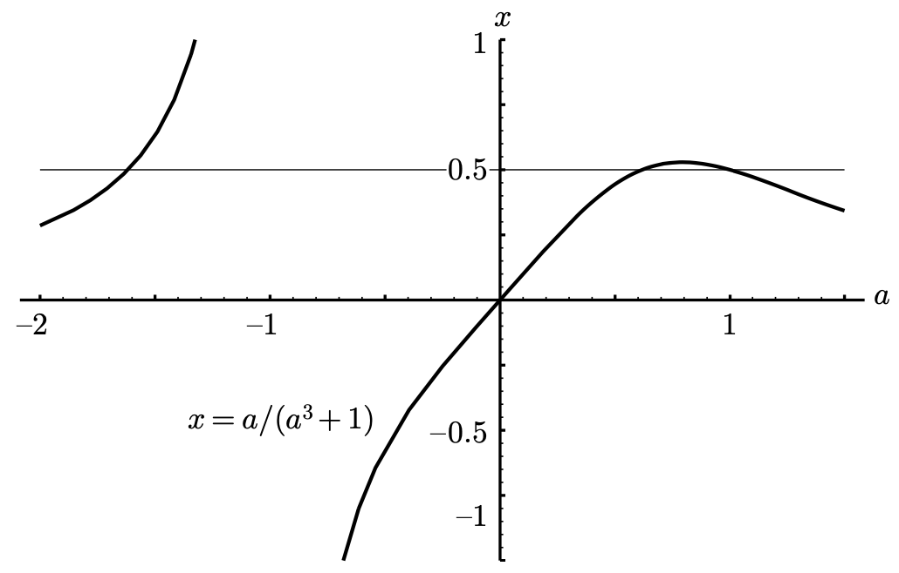

<head>
    
    
</head>

# Table of Contents

1.  [多项式的组合应用](#orga50c1a3)
    1.  [例子](#org87a1fc9)
    2.  [命题](#org60a5acb)
    3.  [命题](#org7d40c22)
2.  [Fibonacci数和黄金分割](#org706c12a)
    1.  [一些递归的总结](#orge6e4b5a)
        1.  [命题](#org14c7c07)
3.  [二叉树](#org6668572)
4.  [滚动骰子](#orgb0f2c34)
5.  [随机行走](#org7d40cc4)
6.  [Integer partitions](#orgbd7a200)
    1.  [一个事实 $ \\sum^{\\infty}_ {j=1} = \\frac{\\pi^{2}}{6} $](#orgd1bdd78)
    2.  [定理](#orgcf0a8a4)

本章我们将呈现一个有用的计算技术。基本思想是考虑一个实数的无穷序列和它的某个连续函数，这被称为序列的生成函数。序列的问题可通过计算函数来解决

# 多项式的组合应用

我们如何计算多项式 $ p(x) = x + x^{2} + x^{3} + x^{4} $且 $ q(x) = x + x^{3} + x^{4} $。这里有一个简单的规则：用q(x)的每一项乘以p(x)的每一项，并把乘积相加。这样我们得到 $ p(x)q(x) = x^{8} + 2x^{7} + 2x^{6} + 3x^{5} + 2x^{4} + x^{3} + x^{2} $

我们现在问一个不同的问题。我们取某一项，比如 $ x^{5} $，我们想要知道它在p(x)q(x)中的系数，而不计算整个乘积。我们可选其一中小于等于5的项跟另一个中适合的项来得到系数

**一个组合平均的二进制定理** 二进制定理断言：

$ (1 + x)^{n} = {n \\choose 0} + {n \\choose 1}x + {n \\choose 2}x^{2} + \\cdots + {n \\choose n}x^{n} $

## 例子

对所有 $ n \\ge 1 $，我们有

$ \\sum^{n}_ {k = 0}k {n \\choose k} = n 2^{n-1} $

**证明** 很简单，从上面定理两边求导即得

**第3章定理的另一个证明** 我们想要证明

$ \\sum^{n}_ {i=0} {n \\choose 2}^{2} = {2n \\choose n} $

考虑等式

$ (1+x)^{n} (1+x)^{n} = (1+x)^{2n} $

右边 $ x^{n} $的系数是 $ {2n \\choose n} $，左边我们可根据二进制定理扩展 $ (1+x)^{n} $，则得到

$ \\sum^{n}_ {i=0} {n \\choose i}{n \\choose n - i} = {2n \\choose n} $

即得证

## 命题

对组合应用程序，需要注意到对r为负整数，二项式系数 $ {r \\choose k}$ 可表达为 $ {r \\choose k} = (-1)^{k}{-r+k-1 \\choose k} = (-1)^{k} {-r+k-1 \\choose -r-1} $。因此对1 - x的负整数次方，我们有

$ \\frac{1}{(1-x)^{n}} = {n-1 \\choose n-1} + {n \\choose n - 1}x + {n + 1 \\choose n - 1}x^{2} + \\cdots + {n+k-1 \\choose n-1}x^{k} + \\cdots $

注意等式 $ \\frac{1}{1-x} = 1 + x + x^{2} + \\cdots $是n = 1时的特殊形式

## 命题

对任意实数r和任意非负整数k，我们定义二项式系数 $ {r \\choose k} $为公式：

$ {r \\choose k} = \\frac{r(r-1)(r-2)\\cdots (r - k + 1)}{k!} $

（特别地，我们设 $ {r \\choose 0} $为1）。则函数 $ (1+x)^{r} $的生成函数的序列为 $ ({r \\choose 0}, {r \\choose 1}, {r \\choose 2}, \\ldots) $。系列 $ {r \\choose 0} + {r \\choose 1} x + {r \\choose 2} x^{2} + \\cdots $对所有 $ \| x \| < 1 $总是收敛

# Fibonacci数和黄金分割

## 一些递归的总结

我们可找到一个系列 $ (y_ {0}, y_ {1}, y_ {2}, \\ldots) $的一般化形式满足等式

$ y_ {n+k} = a_ {k-1}y_ {n+k-1} + a_ {k-2}y_ {n+k-2} + \\cdots + a_ {1}y_ {n+1} + a_ {0}y_ {n} $

对所有 $ n = 0, 1, 2, \\ldots $，k是一个自然数且 $ a_ {0}, a_ {1}, \\ldots, a_ {k-1} $为实（或复）数。例如，对Fabonacci数我们将设置 $ k = 2, a_ {0} = a_ {1} = 1 $。让我们记所有系列 $ (y_ {0}, y_ {1}, y_ {2}, \\ldots) $的集合为 $ \\mathcal{Y} $满足上述等式（这样 $ \\mathcal{Y} $依赖于k和 $ a_ {0}, a_ {1}, \\ldots, a_ {k-1} $）。首先我们看一下术语

Eq是一个k度带常量系数的同构线性递归

-   一个递归或递归关系作为一个一般化记号表示解释一个系列的第n项和其前面几项的一个关系（通常是一个公式）
-   同构出现在名字中因为 $ (y_ {0}, y_ {1}, y_ {2}, \\ldots) \\in \\mathcal{Y} $则 $ (\\alpha y_ {0}, \\alpha y_ {1}, \\alpha y_ {2}, \\ldots) \\in \\mathcal{Y}, \\alpha $为任意实数。（在数学上，同构通常表示常量扩展）。另一方面，一个非同构递归的例子是 $ y_ {n+1} = y_ {n} + 1 $
- 线性表示 $ y_ {j} $的值总是出现在递归的第一次方且不是乘在一起。一个非线性递归的例子：$ y_ {n+2} = y_ {n+1}y_ {n} $
-   最后，常量系数表示 $ a_ {0}, a_ {1}, \\ldots, a_ {k-1} $为与n独立的固定数。也可以考虑一个递归如 $ y_ {n+1} = (n-1)y_ {n} $，系数是n的函数

现在我们将形式化该类递归关系解决方案的一般化结果。我们定义递归多项式的特征为多项式

$ p(x) = x^{k} - a_ {k-1}x^{k-1} - a_ {k-2}x^{k-2} - \\cdots - a_ {1}x - a_ {0} $

例如，Fibonacci数递归关系的特征多项式为 $ x^{2} - x - 1 $。让我们回忆任何k度 $ x^{k} $项系数为1的多项式可被写成

$ (x - \\lambda_ {1})(x - \\lambda_ {2}) \\ldots (x - \\lambda_ {k}) $

$ \\lambda_ {1}, \\ldots, \\lambda_ {k} $为（一般化复）数称为给定多项式的根

### 命题

设p(x)为同构线性递归特征多项式

(i) （简单的根）假设p(x)有k对不同的根 $ \\lambda_ {1}, \\ldots, \\lambda_ {k} $。则对任意系列 $ y = (y_ {0}, y_ {1}, \\ldots) \\in \\mathcal{Y} $满足之前的等式，复常数 $ C_ {1}, C_ {2}, \\ldots, C_ {k} $存在使得对所有n，我们有

$ y_ {n} = C_ {1}\\lambda^{n}_ {1} + C_ {2}\\lambda^{n}_ {2} + \\cdots + C_ {k}\\lambda^{n}_ {k} $

(ii) （一般化情况）设 $ \\lambda_ {1}, \\ldots, \\lambda_ {q} $为不同的复数对，且设 $ k_ {1}, \\ldots, k_ {q} $为自然数，$ k_ {1} + k_ {2} + \\cdots + k_ {q} = k $使得

$ p(x) = (x - \\lambda_ {1})^{k_ {1}} (x - \\lambda_ {2})^{k_ {2}} \\cdots (x - \\lambda_ {q})^{k_ {q}} $

则对任意系列 $ y = (y_ {0}, y_ {1}, \\ldots) \\in \\mathcal{Y} $满足之前的等式，复常数 $ C_ {ij} $存在 $ (i = 1,2,\\ldots, q, j = 0, 1, \\ldots, k_ {i} - 1) $使得对所有n，我们有

$ y_ {n} = \\sum^{q}_ {i=1}\\sum^{k_ {i} - 1}_ {j=0}C_ {ij} {n \\choose j} \\lambda^{n}_ {i} $

我们如何使用这个命题解决递归形式？让我们给出两个简洁的例子。对递归关系 $ y_ {n+2} = 5 y_ {n+1} - 6y_ {n} $，多项式特征为 $ p(x) = x^{2} - 5x + 6 = (x - 2)(x - 3) $。它的根为 $ \\lambda_ {1} = 2, \\lambda_ {2} = 3 $，且之前的命题告诉我们我们应该看形如 $ C_ {1} 2^{n} + C_ {2} 3^{n} $这样的解决方案。给定一些初始条件，$ y_ {0} = 2, y_ {1} = 5 $，我们必须确定常数 $ C_ {1}, C_ {2} $，公式给定这些 $ n = 0, 1 $的需求值，在我们的例子中，我们将设置 $ C_ {1} = C_ {2} = 1 $

另一个例子，等式 $ y_ {n+5} = 8y_ {n+4} +25y_ {n+3} -38y_ {n+2} + 28y_ {n+1} - 8y_ {n} $由特征多项式 $ p(x) = (x-1)^{2} (x-2)^{3} $，且这样解决方案应该为形如 $ y_ {n} = C_ {10} + C_ {11} n + c_ {20} 2^{n} + C_ {21}n2^{n} + C_ {22} {n \\choose 2}2^{n} $。常量的值根据头5个序列 $ (y_ {0}, y_ {1}, y_ {2}, \\ldots) $的值来计算

过程显示解决递归可在各种书中看到，且生成函数很少提及这种联系

# 二叉树

设 $ b_ {n} $记为n个顶点的二叉树个数。我们的目标是找到一个$ b_ {n} $的公式，通过列出所有的小二叉树，我们找到 $ b_ {0} = 1, b_ {1} = 1, b_ {2} = 2, b_ {3} = 5 $

通常，我们记 $ b(x) = b_ {0} + b_ {1}x + b_ {2}x^{2} + \\cdots $ 为对应的生成函数。对 $ n \\ge 1 $，n个顶点的二叉树个数为形为 $ (B, B^{\\prime}) $的有序对的个数，$ B, B^{\\prime} $为一共有n - 1个顶点的二叉树。如果B有k个顶点则 $ B^{\\prime} $有n - k - 1个顶点，$ k = 0, 1, \\ldots, n - 1 $。因此，这样的有序对的数目是

$ b_ {n} = b_ {0}b_ {n-1} + b_ {1}b_ {n-2} + \\cdots + b_ {n-1}b_ {0} $

把该公式和幂级数乘积的定义，我们看到 $ b_ {n} $为 $ b(x) \\cdot b(x) = b(x)^{2} $乘积的 $ x^{n-1} $项的系数。因此 $ b_ {n} $为函数 $ xb(x)^{2} $的 $ x^{n} $的项的系数。这样 $xb(x)^{2} $是b(x)相同系列的生成函数，除了b(x)有常数项 $ b_ {0} = 1 $而幂级数 $ xb(x)^{2} $有常数项为0。因为上述公式止对 $ n \\ge 1 $时成立，我们可写如下的生成函数：

$ b(x) = 1 + xb(x)^{2} $

假设x是使得幂级数b(x)收敛的实数。则b(x)也是一个实数，且它必须满足二次方程 $ b(x) = 1 + xb(x)^{2} $。则我们可得到b(x)为

$ \\frac{1 + \\sqrt{1 - 4x}}{2x} \\text{ 或 } \\frac{1 - \\sqrt{1 - 4x}}{2x} $

似乎有两个解。但我们知道系列 $ (b_ {0}, b_ {1}, b_ {2}, \\ldots) $，且它的生成函数是唯一的。因为b(x)是x的连续函数，我们必须要么使用第一个解，要么第二个。如果我们看第一个解，我们发现对x趋于0，它为 $ \\infty $，生成函数b(x)必须趋于 $ b_ {0} = 1 $。这样当b(x)收敛，它必须收敛到第二个解 $ b(x) = \\frac{1 - \\sqrt{1 - 4x}}{2x} $

使用二项式定理，我们有

$ \\sqrt{1 - 4x} = \\sum^{\\infty}_ {k = 0}(-4)^{k}{1/2 \\choose k}x^{k} $

$ x^{0} $的系数为1，因此幂级数 $ 1 - \\sqrt{1 - 4x} $有0的常量项。我们可以除以2x，对所有 $ n \\ge 1 $我们得到

$ b_ {n} = - \\frac{1}{2} (-4)^{n+1}{1/2 \\choose n+1} $

通过进一步操作，我们可获得一个更好的形式：

$ b_ {n} = \\frac{1}{n+1} {2n \\choose n} $

# 滚动骰子

**问题** 我们滚动一个骰子知道一个6首次出现。一般来说我们需要投几次？

在第一次投掷时为6的概率为$ p = \\frac{1}{6} $。第二次投掷为6的概率为(1-p)p，一般化时第i次投掷首次出现为6的概率为 $ q_ {i} = (1-p)^{i-1}p $。则一般化的投掷次数（期望）为

$ S = \\sum^{\\infty}_ {i=0}iq_ {i} = \\sum^{\\infty}_ {i=1}i(1-p)^{i-1}p $

我们引入生成函数 $ q(x) = q_ {1}x + q_ {2}x^{2} + \\cdots $。通过求导，我们获得 $ q^{\\prime}(x) = 1 \\cdot q_ {1} + 2 \\cdot q_ {2}x + 3 \\cdot q_ {3}x^{2} + \\cdots $，因此想要的S为 $ q^{\\prime}(1) $的值

我们通过如下表达式计算我们的生成函数：

$ q(x) = \\frac{p}{1-p} \\cdot \\frac{1}{1 - (1 - p)x} - \\frac{p}{1-p} $

$ q^{\\prime}(x) = p / (1 - (1 - p)x)^{2} $，因此 $ S = q^{\\prime}(1) = \\frac{1}{p} $

# 随机行走

想象一个实轴画在平面上，整数用圆圈标记。一个青蛙根据如下规则在这些圆圈上随机行走：

-   初始化（在第一次移动之前）青蛙在数字1上
-   每次移动，青蛙要么向右跳两个圆圈（从i到i+2）或者向左一个圆圈（从i到i-1）。它随机确定这些可能性中的一个，且两种可能性有相同的概率

**问题** 青蛙到达数字0的概率是多少？

首先，我们需要明确这样的概率是什么意思？容易定义青蛙在7步跳跃到达数字0的概率，（让我们记该概率为 $ P_ {7} $）。7步有 $ 2^{7} $不同的可能路径，因为每步跳跃，青蛙需要在两种可能性中做出决定，这些决定可任意组合。在我们的问题规则中，所有这些路径有相同的概率。以上定义的概率 $ P_ {7} $等于通过数字0的路径个数（75个）除以路径总数

问题中要求的概率P可被定义为极限 $ P = \\lim_ {i \\to \\infty} P_ {i} $，该概率确定存在，因为明显地，$ P_ {1} \\le P_ {2} \\le \\ldots $

设 $ a_ {i} $记为路径数其第i部到达数字0。我们有

$ P = \\sum^{\\infty}_ {i=1} \\frac{a_ {i}}{2^{i}} $

如果我们引入生成函数 $ a(x) = a_ {1}x + a_ {2}x^{2} + a_ {3}x^{3} + \\cdots $，我们得到 $ P = a(\\frac{1}{2}) $

为解决这个问题，查看不在数字1开始的路径也非常有用。例如，$ b_ {i} $表示从数字2开始第i跳到达数字0的路径数是多少？为了达到数字0，它首先得达到数字1.设j为首先到达数字1所要的跳数。如果j确定，则有 $ a_ {j} $可能性使得在第j跳达到1.则剩i - j调从1到0，则从i - j跳到0的跳数为 $ a_ {i - j} $。这样对给定的j，有 $ a_ {j}a_ {i-j} $的概率，这样我们得到

$ b_ {i} = \\sum^{i-1}_ {j-1}a_ {j}a_ {i-j} $

用生成函数的语言这意味着 $ b(x) = a(x)^{2} $

相似地，设 $ c_ {i} $为从数字3开始，第i跳到达0的路径数。我们可以得到 $ c(x) = a(x)b(x) = a(x)^{3} $

让我们用不同的观点看从数字1开始的路径数。在第1次移动，要么直接达到0（$ a_ {1}  = 1$），或者它跳到数字3。在后一种情况下，它在接下来的i - 1跳中有 $ c_ {i-1} $的概率到达0.因此，对i > 1，我们有 $ a_ {i} = c_ {i-1} $。因此有

$ a(x) = x + xc(x) = x + xa(x)^{3} $

特别地，对 $ x = \\frac{1}{2} $，如下等式结果：

$ P = \\frac{1}{2} + \\frac{1}{2} P^{3} $

这有3个解：$ 1, \\frac{1}{2} (\\sqrt{5} - 1), - \\frac{1}{2} (\\sqrt{5} + 1) $。负根可被排除。第二个根 $ P = \\frac{1}{2} (\\sqrt{5} - 1) = 0.618033988 \\ldots $（黄金分割）

# Integer partitions

把一个自然数n写成几个自然数之和有多少种写法？答案不困难如果我们统计有序的n分区；即，如果我们把表达式3 = 2 + 1和3 = 1 + 2作为3的两个不同的和表达式。问题变得更加困难且更有趣如果我们考虑确定的表达式只是加数的顺序不同。例如，对n = 5，所有可能的分区为5 = 1 + 1 + 1 + 1 + 1, 5 = 1 + 1 + 1 + 2, 5 = 1 + 2 + 2, 5 = 1 + 1 + 3, 5 = 2 + 3, 5 = 1 + 4和5 = 5。设 $ p_ {n} $为代表n的分区数

我们知道如何表达数的解决方案为如下等式：

$ i_ {i} + i_ {2} + \\cdots + i_ {k} = n $

每个 $ i_ {j} $的值在某个集合中，作为 $ x^{n} $的系数。$ i_ {j} $的顺序是无关的，设 $ i_ {j} $表达在n的分区中加数等于j的贡献。因此，n的分区为等式

$ i_ {1} + i_ {2} + \\cdots + i_ {n} = n $

$ i_ {1} \\in \\{0, 1, 2, 3, \\ldots\\}, \\quad i_ {2} \\in \\{0, 2, 4, 6, \\ldots\\}, \\ldots, i_ {j} \\in \\{0, j, 2j, 3j, \\ldots \\} $

例如，分区5 = 1 + 2 + 2对应 $ i_ {1} = 1, i_ {2} = 4, i_ {3} = i_ {4} = i_ {5} = 0 $

下一步是标准。新的公式我们立即得到 $ p_ {n} $是 $ x^{n} $一下乘积的系数

$ \\begin{aligned} P_ {n}(x) &= (1 + x + x^{2} + \\cdots) (1 + x^{2} + x^{4} + x^{6} + \\cdots) \\ldots (1 + x^{n} + x^{2n} + \\cdots ) \\\\ &= \\prod^{n}_ {k=1} \\frac{1}{1 - x^{k}} \\end{aligned} $

对所有数 $ x \\in (0, 1) $，我们有

$ p_ {n} \\le \\frac{1}{x_ {n}}P_ {n}(x) = \\frac{1}{x^{n}} \\prod^{n}_ {k=1} \\frac{1}{1 - x^{k}} $

我们想要选择x使得右边尽量小。一个适当的估计 $ P_ {n}(x) $是证明的另一部分。首先，为处理乘积，通常建议考虑对数；在我们的例子中

$ \\ln{p_ {n}} \\le \\ln{(\\frac{1}{x^{n}}P_ {n}(x))} = -n \\ln{x} - \\sum^{n}_ {k=1} \\ln{(1 - x^{k})} $

因为有

$ - \\ln{(1-y)} = \\frac{y}{1} + \\frac{y^{2}}{2} + \\frac{y^{3}}{3} + \\frac{y^{4}}{4} + \\cdots $

对所有 $ y \\in (-1, 1) $。因此，我们得到

$ \\begin{aligned} - \\sum^{n}_ {k=1}\\ln{(1-x^{k})} &= \\sum^{n}_ {k=1}\\sum^{\\infty}_ {j=1} \\frac{x^{kj}}{j} = \\sum^{\\infty}_ {j=1} \\frac{1}{j} \\sum^{n}_ {k=1} x^{jk} \\\\ &\\le \\sum^{\\infty}_ {j=1}\\frac{1}{j} \\sum^{\\infty}_ {k=1} x^{jk} = \\sum^{\\infty}_ {j=1} \\frac{1}{j} \\frac{x^{j}}{1-x^{j}} \\end{aligned} $

又由于

$ 1 - x^{j} = (1 - x)(1 + x + x^{2} + \\cdots + x^{j-1}) \\ge (1 - x)jx^{j-1} $

0 < x < 1，且

$ \\sum^{\\infty}_ {j=1} \\frac{1}{j} \\frac{x^{j}}{1 - x^{j}} \\le \\sum^{\\infty}_ {j=1}\\frac{1}{j} \\frac{x^{j}}{(1-x)jx^{j-1}} = \\frac{x}{1-x}\\sum^{\\infty}_ {j=1}\\frac{1}{j^{2}} $

## 一个事实 $ \\sum^{\\infty}_ {j=1} = \\frac{\\pi^{2}}{6} $

继续我们对 $ \\ln{p_ {n}} $的估计，我们得到

$ \\ln{p_ {n}} \\le -n \\ln{x} + \\frac{\\pi^{2}}{6}\\frac{x}{1-x} $

引入一个新的变量 $ u = x / (1-x) $（因此u可为 $ [0, \\infty) $中任意数，且$ x = u / (1+u) $）。使用不等式 $ \\ln{(1+ \\frac{1}{u})} \\le \\frac{1}{u} $，我们得到

$ \\ln{p_ {n}} < n \\ln{(1 + \\frac{1}{u})} + \\frac{\\pi^{2}}{6} u \\le \\frac{n}{u} + \\frac{\\pi^{2}}{6} u $

通过用 $ u = \\sqrt{6n} / \\pi $替代，我们得到 $ \\ln{p_ {n}} \\le \\pi \\sqrt{\\frac{2}{3}n} $（为什么用 $ u = \\sqrt{6n} / \\pi $，一个小的计算显示该值是 $ \\ln{p_ {n}} $作为u的函数的上限）

## 定理

对所有 $ n \\ge 1 $，我们有

$ p_ {n} < e^{\\pi \\sqrt{\\frac{2}{3}n}} = e^{(2.5650\\ldots)\\sqrt{n}} $

**一个更小的边界** 该上界是否是个好的上界？哈代和拉马努金的结果是 $ p_ {n} \\sim \\frac{1}{4 \\sqrt{3} n}e^{\\pi \\sqrt{\\frac{2}{3}n}} $，且这样上界已经非常好了 - 它的指数上有好的常数。但我们如何知道该定理的边界是正确的呢？这里有一个快速的方法从一个更弱的边界比该边界差不太多

如练习1所示，n上有序分区为k个加数的数量是 $ {n - 1 \\choose k - 1} $。因为每个k加数有最多 $ k! $个有序分区，我们有

$ p_{n} \\geq \\frac{\\left(\\begin{array}{c}n-1 \\\\ k-1\\end{array}\\right)}{k !} \\geq \\frac{(n-1)(n-2) \\ldots(n-k+1)}{(k !)^{2}} $

对任意 $ k \\in \\{1, 2, \\ldots, n\\} $。k是多大能得到最好的下界？如果我们把k加1，分母乘以一个因式 $ (k+1)^{2} $，分子乘以n - k。因此如果 $ (k+1)^{2} < n - k $，则k + 1比k好，因此对最好的k，$ (k + 1)^{2} $应该大约等于n - k。为使表达式简单化，我们设 $ k = \\lfloor \\sqrt{n} \\rfloor $。则 $ (n-1)(n-2)\\ldots(n-k+1) $大约为 $ n^{\\sqrt{n}} $。我们有

$ (n-1)(n-2)\\ldots(n-k+1) \\ge (n-k)^{k-1} = n^{k-1}(1 - \\frac{k}{n})^{k-1} $

且因为 $ \\frac{k}{n} = \\lfloor \\sqrt{n} \\rfloor / n \\le 1 / \\lfloor \\sqrt{n} \\rfloor = \\frac{1}{k} $且 $ (1 - \\frac{1}{k})^{k-1} > e^{-1} $，我们进一步得到

$ n^{k-1}(1 - \\frac{k}{n})^{k-1} \\ge n^{k-1}(1 - \\frac{1}{k})^{k-1} \\ge \\frac{n^{k}}{en} $

通过 $ k! \\le ek(k/e)^{k} $，我们有

$ p_ {n} \\ge (\\frac{n}{k^{2}})^{k} \\frac{e^{2k-3}}{nk^{2}} \\ge \\frac{e^{2k-3}}{n^{2}} \\ge \\frac{1}{e^{5}n^{2}}e^{2\\sqrt{n}} $

如果n足够大，则 $ n^{2} $远小于 $ e^{\\sqrt{n}} $，且因此 $ n^{-2}e^{2\\sqrt{n}} = \\Omega(e^{\\sqrt{n}}) $。这样对n足够大，$ p_ {n} $位于 $ e^{c_ {1}\\sqrt{n}} $和 $ e^{c_ {2}\\sqrt{n}} $之间，$ c_ {2} > c_ {1} > 0 $

**证明之前的一个事实** 我们用de Moivre公式开始：$ (\\cos{\\alpha} + i \\sin{\\alpha})^{n} = \\cos{n\\alpha} + i \\sin{n \\alpha} $，i是虚数单位，$ i^{2} = -1 $。用二项式定理扩展左边，且只考虑虚数部分，我们得到

$ {n \\choose 1} \\sin{\\alpha}\\cos^{n-1}{\\alpha} - {n \\choose 3}\\sin^{3}{\\alpha} \\cos^{n-3}{\\alpha} + {n \\choose 5} \\sin^{5}{\\alpha}\\cos^{n-5}{\\alpha} - \\cdots \\\\ = \\sin{n\\alpha} $

使用函数 $ \\cot{\\alpha} = \\frac{\\cos{\\alpha}}{\\sin{\\alpha}} $，我们可把左边重写为

$ \\sin^{n}{\\alpha} [{n \\choose 1} \\cot^{n-1}{\\alpha} - {n \\choose 3} \\cot^{n-3}{\\alpha} + {n \\choose 5}\\cot^{n-5}{\\alpha} - \\cdots] $

设n = 2m + 1为奇数，则方括号里的表达式可被写为 $ P(\\cot^{2}{\\alpha}) $，P(x)为多项式 $ {n \\choose 1}x^{m} - {n \\choose 3}x^{m-1} + {n \\choose 5}x^{m-2} - \\cdots $

我们称P(x)的根为m个数 $ r_ {1}, r_ {2}, \\ldots, r_ {m}, r_ {k} = \\cot^{2}{\\frac{k\\pi}{n}} $。事实上，对 $ \\alpha = \\frac{k\\pi}{n}, \\sin{\\alpha} $非零当 $ \\sin{n \\alpha} = 0 $，且这样 $ P(\\cot^{2}{\\alpha}) $必须为0。因为 $ r_ {1}, \\ldots, r_ {m} $互不相同且P(x)有度数m，因此

$ P(x) = n(x - r_ {1})(x - r_ {2}) \\ldots (x - r_ {m}) $
